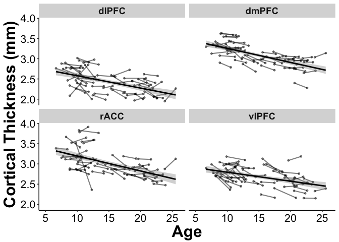

Regulation ROI Analysis
================
Rebecca Martin
6/24/2018

-   [Settings](#settings)
-   [Packages](#packages)
-   [Read in data](#read-in-data)
-   [Merge ROI data with behavioral data and add age terms](#merge-roi-data-with-behavioral-data-and-add-age-terms)
-   [Prep Graphs](#prep-graphs)
-   [Cortical ROIs](#cortical-rois)
    -   [Plot GLM clusters](#plot-glm-clusters)
    -   [Cortical cluster statistics](#cortical-cluster-statistics)
        -   [What is the shape of change in these ROIs?](#what-is-the-shape-of-change-in-these-rois)
        -   [Rates of change](#rates-of-change)
    -   [Does change in thickness predict change in behavior?](#does-change-in-thickness-predict-change-in-behavior)
        -   [rACC](#racc-1)
        -   [dmPFC](#dmpfc-1)
        -   [dlPFC](#dlpfc-1)
        -   [vlPFC](#vlpfc-1)

Note: this is not a final version and should be cleaned and proofread.

Settings
--------

``` r
knitr::opts_chunk$set(cache=TRUE)
```

``` r
root <- rprojroot::find_rstudio_root_file()
dataDir <- file.path(root, 'data')
codeDir <- file.path(root, 'code')
figureDir <- file.path(root, 'figures')
```

Packages
--------

``` r
library(tidyverse)
library(lme4)
library(lmerTest)
library(bmlm)
library(arm)
```

Read in data
------------

``` r
## Behavioral
appAvgLong <- read.table(file.path(dataDir,"app_avg_long.txt"), header=TRUE, sep="\t") ## for graphing 
appAvgWide <- read.table(file.path(dataDir,"app_avg_wide.txt"), header=TRUE, sep="\t")
demographicsLong <- read.table(file.path(dataDir,"demographicsLong.txt"), header=TRUE, sep="\t")
appBehavLongRaw <- read.table(file.path(dataDir,"app_behav_long.txt"), header=TRUE, sep="\t")

## Far ROI
far2TP <- read.table(file.path(dataDir, "far_2TP_combined_reduced.txt"), header=TRUE, sep="\t")
farRates <- read.table(file.path(dataDir, "farRates_reduced.txt"), header=TRUE, sep="\t")
```

Merge ROI data with behavioral data and add age terms
-----------------------------------------------------

``` r
appAvgLongROIs <- merge(appAvgLong, far2TP, by=c("fsid", "Phase"))

appAvgLongROIs$AgeCent <- appAvgLongROIs$Age - mean(appAvgLongROIs$Age)
appAvgLongROIs$AgeCentSq <- appAvgLongROIs$AgeCent*appAvgLongROIs$AgeCent
appAvgLongROIs$AgeCentCu <- appAvgLongROIs$AgeCent*appAvgLongROIs$AgeCent*appAvgLongROIs$AgeCent

appAvgLongReduced <- appAvgLongROIs %>% dplyr::select(Reactivity=Close, Regulation=Far, Age, fsid, Phase, Gender, rACC=rostralanteriorcingulate_lh, dmPFC=superiorfrontal_rh, dlPFC=rostralmiddlefrontal_lh, vlPFC=parsopercularis_rh) %>% gather(key=ROI, value=Thickness, -fsid, -Age, -Phase, -Gender, -Reactivity, -Regulation)

appWideROIRates <- merge(appAvgWide,farRates, by="fsid")
```

Prep Graphs
-----------

Cortical ROIs
=============

Plot GLM clusters
-----------------

``` r
ggplot(appAvgLongReduced, aes(x=Age, y=Thickness)) +
    geom_line(aes(y=Thickness, group=fsid), alpha=.5, size=.75) + 
    geom_point(aes(y=Thickness), size=1, alpha=.5) +
    geom_smooth(method='lm', color="black", ) +
    facet_wrap(~ROI, ncol=2) + 
    beckys.theme.conference +
    #theme_bw() +
    ylab("Cortical Thickness (mm)") +
    xlim(5,26) +
    #ylim(0,4) +
    scale_color_brewer(palette="Set1") +     scale_fill_brewer(palette="Set1") +
    #scale_color_manual(values=c("#e41a1c", "#377eb8")) + 
    theme(legend.position="none", legend.title=element_blank(), strip.text.y = element_text(size = 14, face="bold"),
                        strip.text.x = element_text(size = 14, face="bold"),)
```



``` r
#ggsave("figures/AgeROI.pdf", width=7, height=5, dpi=300)
#ggsave("figures/AgeROIDiss.pdf", width=7, height=5, dpi=300)
```

Cortical cluster statistics
---------------------------

### What is the shape of change in these ROIs?

#### RACC

``` r
summary(nullModrAcc <- lmer(rostralanteriorcingulate_lh ~ 1 + (1|fsid), data=appAvgLongROIs))
```

    ## Linear mixed model fit by REML. t-tests use Satterthwaite's method [
    ## lmerModLmerTest]
    ## Formula: rostralanteriorcingulate_lh ~ 1 + (1 | fsid)
    ##    Data: appAvgLongROIs
    ## 
    ## REML criterion at convergence: 9.1
    ## 
    ## Scaled residuals: 
    ##     Min      1Q  Median      3Q     Max 
    ## -4.1348 -0.3301 -0.0047  0.2855  4.0356 
    ## 
    ## Random effects:
    ##  Groups   Name        Variance Std.Dev.
    ##  fsid     (Intercept) 0.08445  0.2906  
    ##  Residual             0.02035  0.1427  
    ## Number of obs: 98, groups:  fsid, 49
    ## 
    ## Fixed effects:
    ##             Estimate Std. Error       df t value Pr(>|t|)    
    ## (Intercept)  3.00799    0.04395 48.00000   68.45   <2e-16 ***
    ## ---
    ## Signif. codes:  0 '***' 0.001 '**' 0.01 '*' 0.05 '.' 0.1 ' ' 1

``` r
summary(linModrAcc <- lmer(rostralanteriorcingulate_lh ~ AgeCent + (1|fsid), data=appAvgLongROIs))
```

    ## Linear mixed model fit by REML. t-tests use Satterthwaite's method [
    ## lmerModLmerTest]
    ## Formula: rostralanteriorcingulate_lh ~ AgeCent + (1 | fsid)
    ##    Data: appAvgLongROIs
    ## 
    ## REML criterion at convergence: -9.1
    ## 
    ## Scaled residuals: 
    ##     Min      1Q  Median      3Q     Max 
    ## -4.1893 -0.3266 -0.0773  0.2483  3.7230 
    ## 
    ## Random effects:
    ##  Groups   Name        Variance Std.Dev.
    ##  fsid     (Intercept) 0.05209  0.2282  
    ##  Residual             0.01848  0.1359  
    ## Number of obs: 98, groups:  fsid, 49
    ## 
    ## Fixed effects:
    ##              Estimate Std. Error        df t value Pr(>|t|)    
    ## (Intercept)  3.007994   0.035378 47.328814  85.023  < 2e-16 ***
    ## AgeCent     -0.035649   0.006298 74.411006  -5.661 2.67e-07 ***
    ## ---
    ## Signif. codes:  0 '***' 0.001 '**' 0.01 '*' 0.05 '.' 0.1 ' ' 1
    ## 
    ## Correlation of Fixed Effects:
    ##         (Intr)
    ## AgeCent 0.000

``` r
summary(quadModrAcc <- lmer(rostralanteriorcingulate_lh ~ AgeCent + AgeCentSq + (1|fsid), data=appAvgLongROIs))
```

    ## Linear mixed model fit by REML. t-tests use Satterthwaite's method [
    ## lmerModLmerTest]
    ## Formula: rostralanteriorcingulate_lh ~ AgeCent + AgeCentSq + (1 | fsid)
    ##    Data: appAvgLongROIs
    ## 
    ## REML criterion at convergence: 2.2
    ## 
    ## Scaled residuals: 
    ##     Min      1Q  Median      3Q     Max 
    ## -4.1060 -0.3374 -0.0672  0.2745  3.6442 
    ## 
    ## Random effects:
    ##  Groups   Name        Variance Std.Dev.
    ##  fsid     (Intercept) 0.05214  0.2284  
    ##  Residual             0.01865  0.1366  
    ## Number of obs: 98, groups:  fsid, 49
    ## 
    ## Fixed effects:
    ##               Estimate Std. Error         df t value Pr(>|t|)    
    ## (Intercept)  2.9891175  0.0453592 77.1789154  65.899  < 2e-16 ***
    ## AgeCent     -0.0363428  0.0063930 77.6393660  -5.685  2.2e-07 ***
    ## AgeCentSq    0.0007498  0.0011256 85.0569664   0.666    0.507    
    ## ---
    ## Signif. codes:  0 '***' 0.001 '**' 0.01 '*' 0.05 '.' 0.1 ' ' 1
    ## 
    ## Correlation of Fixed Effects:
    ##           (Intr) AgeCnt
    ## AgeCent    0.100       
    ## AgeCentSq -0.625 -0.161

``` r
summary(cubModrAcc <- lmer(rostralanteriorcingulate_lh ~ AgeCent + AgeCentSq + AgeCentCu + (1|fsid), data=appAvgLongROIs))
```

    ## Linear mixed model fit by REML. t-tests use Satterthwaite's method [
    ## lmerModLmerTest]
    ## Formula: rostralanteriorcingulate_lh ~ AgeCent + AgeCentSq + AgeCentCu +  
    ##     (1 | fsid)
    ##    Data: appAvgLongROIs
    ## 
    ## REML criterion at convergence: 14.4
    ## 
    ## Scaled residuals: 
    ##     Min      1Q  Median      3Q     Max 
    ## -4.2513 -0.3520 -0.0757  0.2918  3.7318 
    ## 
    ## Random effects:
    ##  Groups   Name        Variance Std.Dev.
    ##  fsid     (Intercept) 0.05198  0.2280  
    ##  Residual             0.01802  0.1342  
    ## Number of obs: 98, groups:  fsid, 49
    ## 
    ## Fixed effects:
    ##               Estimate Std. Error         df t value Pr(>|t|)    
    ## (Intercept)  2.9900501  0.0450301 76.8182115  66.401  < 2e-16 ***
    ## AgeCent     -0.0525352  0.0112787 91.2480041  -4.658 1.08e-05 ***
    ## AgeCentSq    0.0002673  0.0011450 80.1700901   0.233   0.8160    
    ## AgeCentCu    0.0003448  0.0001980 80.3047272   1.741   0.0855 .  
    ## ---
    ## Signif. codes:  0 '***' 0.001 '**' 0.01 '*' 0.05 '.' 0.1 ' ' 1
    ## 
    ## Correlation of Fixed Effects:
    ##           (Intr) AgeCnt AgCntS
    ## AgeCent    0.046              
    ## AgeCentSq -0.606  0.113       
    ## AgeCentCu  0.011 -0.827 -0.241

``` r
AIC(nullModrAcc, linModrAcc, quadModrAcc, cubModrAcc)
```

<script data-pagedtable-source type="application/json">
{"columns":[{"label":[""],"name":["_rn_"],"type":[""],"align":["left"]},{"label":["df"],"name":[1],"type":["dbl"],"align":["right"]},{"label":["AIC"],"name":[2],"type":["dbl"],"align":["right"]}],"data":[{"1":"3","2":"15.126862","_rn_":"nullModrAcc"},{"1":"4","2":"-1.138642","_rn_":"linModrAcc"},{"1":"5","2":"12.160883","_rn_":"quadModrAcc"},{"1":"6","2":"26.375141","_rn_":"cubModrAcc"}],"options":{"columns":{"min":{},"max":[10]},"rows":{"min":[10],"max":[10]},"pages":{}}}
  </script>

#### dmPFC

``` r
summary(nullModdmPFC <- lmer(superiorfrontal_rh ~ 1 + (1|fsid), data=appAvgLongROIs))
```

    ## Linear mixed model fit by REML. t-tests use Satterthwaite's method [
    ## lmerModLmerTest]
    ## Formula: superiorfrontal_rh ~ 1 + (1 | fsid)
    ##    Data: appAvgLongROIs
    ## 
    ## REML criterion at convergence: -76
    ## 
    ## Scaled residuals: 
    ##      Min       1Q   Median       3Q      Max 
    ## -2.55191 -0.34479  0.04357  0.42294  2.65309 
    ## 
    ## Random effects:
    ##  Groups   Name        Variance Std.Dev.
    ##  fsid     (Intercept) 0.064280 0.25354 
    ##  Residual             0.005034 0.07095 
    ## Number of obs: 98, groups:  fsid, 49
    ## 
    ## Fixed effects:
    ##             Estimate Std. Error       df t value Pr(>|t|)    
    ## (Intercept)  3.07977    0.03692 48.00000   83.41   <2e-16 ***
    ## ---
    ## Signif. codes:  0 '***' 0.001 '**' 0.01 '*' 0.05 '.' 0.1 ' ' 1

``` r
summary(linModdmPFC <- lmer(superiorfrontal_rh ~ AgeCent + (1|fsid), data=appAvgLongROIs))
```

    ## Linear mixed model fit by REML. t-tests use Satterthwaite's method [
    ## lmerModLmerTest]
    ## Formula: superiorfrontal_rh ~ AgeCent + (1 | fsid)
    ##    Data: appAvgLongROIs
    ## 
    ## REML criterion at convergence: -108.8
    ## 
    ## Scaled residuals: 
    ##      Min       1Q   Median       3Q      Max 
    ## -2.38586 -0.49084 -0.02841  0.52305  2.34302 
    ## 
    ## Random effects:
    ##  Groups   Name        Variance Std.Dev.
    ##  fsid     (Intercept) 0.03545  0.18829 
    ##  Residual             0.00386  0.06213 
    ## Number of obs: 98, groups:  fsid, 49
    ## 
    ## Fixed effects:
    ##              Estimate Std. Error        df t value Pr(>|t|)    
    ## (Intercept)  3.079769   0.027621 46.742745 111.501  < 2e-16 ***
    ## AgeCent     -0.029845   0.004074 95.679632  -7.326 7.47e-11 ***
    ## ---
    ## Signif. codes:  0 '***' 0.001 '**' 0.01 '*' 0.05 '.' 0.1 ' ' 1
    ## 
    ## Correlation of Fixed Effects:
    ##         (Intr)
    ## AgeCent 0.000

``` r
summary(quadModdmPFC <- lmer(superiorfrontal_rh ~ AgeCent + AgeCentSq + (1|fsid), data=appAvgLongROIs))
```

    ## Linear mixed model fit by REML. t-tests use Satterthwaite's method [
    ## lmerModLmerTest]
    ## Formula: superiorfrontal_rh ~ AgeCent + AgeCentSq + (1 | fsid)
    ##    Data: appAvgLongROIs
    ## 
    ## REML criterion at convergence: -96.3
    ## 
    ## Scaled residuals: 
    ##      Min       1Q   Median       3Q      Max 
    ## -2.28061 -0.49562  0.03837  0.53871  2.24028 
    ## 
    ## Random effects:
    ##  Groups   Name        Variance Std.Dev.
    ##  fsid     (Intercept) 0.034967 0.18700 
    ##  Residual             0.003938 0.06276 
    ## Number of obs: 98, groups:  fsid, 49
    ## 
    ## Fixed effects:
    ##               Estimate Std. Error         df t value Pr(>|t|)    
    ## (Intercept)  3.0683096  0.0311301 67.3377979  98.564  < 2e-16 ***
    ## AgeCent     -0.0301432  0.0040889 94.8030586  -7.372 6.24e-11 ***
    ## AgeCentSq    0.0004552  0.0005828 63.0948442   0.781    0.438    
    ## ---
    ## Signif. codes:  0 '***' 0.001 '**' 0.01 '*' 0.05 '.' 0.1 ' ' 1
    ## 
    ## Correlation of Fixed Effects:
    ##           (Intr) AgeCnt
    ## AgeCent    0.031       
    ## AgeCentSq -0.471 -0.065

``` r
summary(cubModdmPFC <- lmer(superiorfrontal_rh ~ AgeCent + AgeCentSq + AgeCentCu + (1|fsid), data=appAvgLongROIs))
```

    ## Linear mixed model fit by REML. t-tests use Satterthwaite's method [
    ## lmerModLmerTest]
    ## Formula: superiorfrontal_rh ~ AgeCent + AgeCentSq + AgeCentCu + (1 | fsid)
    ##    Data: appAvgLongROIs
    ## 
    ## REML criterion at convergence: -93.3
    ## 
    ## Scaled residuals: 
    ##      Min       1Q   Median       3Q      Max 
    ## -2.62034 -0.40879  0.03099  0.50091  2.51844 
    ## 
    ## Random effects:
    ##  Groups   Name        Variance Std.Dev.
    ##  fsid     (Intercept) 0.033164 0.18211 
    ##  Residual             0.003205 0.05661 
    ## Number of obs: 98, groups:  fsid, 49
    ## 
    ## Fixed effects:
    ##               Estimate Std. Error         df t value Pr(>|t|)    
    ## (Intercept)  3.068e+00  2.981e-02  6.639e+01 102.926  < 2e-16 ***
    ## AgeCent     -4.961e-02  6.433e-03  9.260e+01  -7.712 1.38e-11 ***
    ## AgeCentSq   -1.616e-06  5.426e-04  6.072e+01  -0.003 0.997634    
    ## AgeCentCu    3.654e-04  9.484e-05  6.451e+01   3.853 0.000271 ***
    ## ---
    ## Signif. codes:  0 '***' 0.001 '**' 0.01 '*' 0.05 '.' 0.1 ' ' 1
    ## 
    ## Correlation of Fixed Effects:
    ##           (Intr) AgeCnt AgCntS
    ## AgeCent    0.022              
    ## AgeCentSq -0.437  0.133       
    ## AgeCentCu -0.010 -0.804 -0.204

``` r
AIC(nullModdmPFC, linModdmPFC, quadModdmPFC, cubModdmPFC)
```

<script data-pagedtable-source type="application/json">
{"columns":[{"label":[""],"name":["_rn_"],"type":[""],"align":["left"]},{"label":["df"],"name":[1],"type":["dbl"],"align":["right"]},{"label":["AIC"],"name":[2],"type":["dbl"],"align":["right"]}],"data":[{"1":"3","2":"-70.04486","_rn_":"nullModdmPFC"},{"1":"4","2":"-100.75008","_rn_":"linModdmPFC"},{"1":"5","2":"-86.28984","_rn_":"quadModdmPFC"},{"1":"6","2":"-81.28673","_rn_":"cubModdmPFC"}],"options":{"columns":{"min":{},"max":[10]},"rows":{"min":[10],"max":[10]},"pages":{}}}
  </script>

#### dlPFC

``` r
summary(nullModdlPFC <- lmer(rostralmiddlefrontal_lh ~ 1 + (1|fsid), data=appAvgLongROIs))
```

    ## Linear mixed model fit by REML. t-tests use Satterthwaite's method [
    ## lmerModLmerTest]
    ## Formula: rostralmiddlefrontal_lh ~ 1 + (1 | fsid)
    ##    Data: appAvgLongROIs
    ## 
    ## REML criterion at convergence: -30
    ## 
    ## Scaled residuals: 
    ##      Min       1Q   Median       3Q      Max 
    ## -2.25323 -0.48817 -0.01149  0.39428  1.96299 
    ## 
    ## Random effects:
    ##  Groups   Name        Variance Std.Dev.
    ##  fsid     (Intercept) 0.06562  0.2562  
    ##  Residual             0.01203  0.1097  
    ## Number of obs: 98, groups:  fsid, 49
    ## 
    ## Fixed effects:
    ##             Estimate Std. Error       df t value Pr(>|t|)    
    ## (Intercept)  2.42383    0.03823 48.00000   63.39   <2e-16 ***
    ## ---
    ## Signif. codes:  0 '***' 0.001 '**' 0.01 '*' 0.05 '.' 0.1 ' ' 1

``` r
summary(linModdlPFC <- lmer(rostralmiddlefrontal_lh ~ AgeCent + (1|fsid), data=appAvgLongROIs))
```

    ## Linear mixed model fit by REML. t-tests use Satterthwaite's method [
    ## lmerModLmerTest]
    ## Formula: rostralmiddlefrontal_lh ~ AgeCent + (1 | fsid)
    ##    Data: appAvgLongROIs
    ## 
    ## REML criterion at convergence: -46.4
    ## 
    ## Scaled residuals: 
    ##      Min       1Q   Median       3Q      Max 
    ## -2.20637 -0.46855 -0.07552  0.43090  1.73141 
    ## 
    ## Random effects:
    ##  Groups   Name        Variance Std.Dev.
    ##  fsid     (Intercept) 0.04394  0.2096  
    ##  Residual             0.01063  0.1031  
    ## Number of obs: 98, groups:  fsid, 49
    ## 
    ## Fixed effects:
    ##              Estimate Std. Error        df t value Pr(>|t|)    
    ## (Intercept)  2.423834   0.031705 47.435371  76.449  < 2e-16 ***
    ## AgeCent     -0.029166   0.005395 82.415316  -5.406 6.15e-07 ***
    ## ---
    ## Signif. codes:  0 '***' 0.001 '**' 0.01 '*' 0.05 '.' 0.1 ' ' 1
    ## 
    ## Correlation of Fixed Effects:
    ##         (Intr)
    ## AgeCent 0.000

``` r
summary(quadModdlPFC <- lmer(rostralmiddlefrontal_lh ~ AgeCent + AgeCentSq + (1|fsid), data=appAvgLongROIs))
```

    ## Linear mixed model fit by REML. t-tests use Satterthwaite's method [
    ## lmerModLmerTest]
    ## Formula: rostralmiddlefrontal_lh ~ AgeCent + AgeCentSq + (1 | fsid)
    ##    Data: appAvgLongROIs
    ## 
    ## REML criterion at convergence: -36.5
    ## 
    ## Scaled residuals: 
    ##      Min       1Q   Median       3Q      Max 
    ## -2.24152 -0.38292 -0.07711  0.47034  1.64318 
    ## 
    ## Random effects:
    ##  Groups   Name        Variance Std.Dev.
    ##  fsid     (Intercept) 0.04358  0.2088  
    ##  Residual             0.01045  0.1022  
    ## Number of obs: 98, groups:  fsid, 49
    ## 
    ## Fixed effects:
    ##               Estimate Std. Error         df t value Pr(>|t|)    
    ## (Intercept)  2.3900586  0.0386442 75.3682023  61.848  < 2e-16 ***
    ## AgeCent     -0.0301994  0.0054079 84.7500798  -5.584 2.77e-07 ***
    ## AgeCentSq    0.0013416  0.0008858 77.1637223   1.515    0.134    
    ## ---
    ## Signif. codes:  0 '***' 0.001 '**' 0.01 '*' 0.05 '.' 0.1 ' ' 1
    ## 
    ## Correlation of Fixed Effects:
    ##           (Intr) AgeCnt
    ## AgeCent    0.073       
    ## AgeCentSq -0.577 -0.127

``` r
summary(cubModdlPFC <- lmer(rostralmiddlefrontal_lh ~ AgeCent + AgeCentSq + AgeCentCu + (1|fsid), data=appAvgLongROIs))
```

    ## Linear mixed model fit by REML. t-tests use Satterthwaite's method [
    ## lmerModLmerTest]
    ## Formula: rostralmiddlefrontal_lh ~ AgeCent + AgeCentSq + AgeCentCu + (1 |  
    ##     fsid)
    ##    Data: appAvgLongROIs
    ## 
    ## REML criterion at convergence: -21.3
    ## 
    ## Scaled residuals: 
    ##      Min       1Q   Median       3Q      Max 
    ## -2.19425 -0.42583 -0.05671  0.51234  1.62184 
    ## 
    ## Random effects:
    ##  Groups   Name        Variance Std.Dev.
    ##  fsid     (Intercept) 0.04425  0.2104  
    ##  Residual             0.01042  0.1021  
    ## Number of obs: 98, groups:  fsid, 49
    ## 
    ## Fixed effects:
    ##               Estimate Std. Error         df t value Pr(>|t|)    
    ## (Intercept)  2.3900745  0.0388247 74.7799232  61.561  < 2e-16 ***
    ## AgeCent     -0.0356811  0.0094395 93.0173761  -3.780 0.000277 ***
    ## AgeCentSq    0.0011958  0.0009095 73.2399659   1.315 0.192643    
    ## AgeCentCu    0.0001123  0.0001574 74.6752360   0.713 0.477839    
    ## ---
    ## Signif. codes:  0 '***' 0.001 '**' 0.01 '*' 0.05 '.' 0.1 ' ' 1
    ## 
    ## Correlation of Fixed Effects:
    ##           (Intr) AgeCnt AgCntS
    ## AgeCent    0.041              
    ## AgeCentSq -0.560  0.113       
    ## AgeCentCu  0.000 -0.818 -0.224

``` r
AIC(nullModdlPFC, linModdlPFC, quadModdlPFC, cubModdlPFC)
```

<script data-pagedtable-source type="application/json">
{"columns":[{"label":[""],"name":["_rn_"],"type":[""],"align":["left"]},{"label":["df"],"name":[1],"type":["dbl"],"align":["right"]},{"label":["AIC"],"name":[2],"type":["dbl"],"align":["right"]}],"data":[{"1":"3","2":"-24.024502","_rn_":"nullModdlPFC"},{"1":"4","2":"-38.423693","_rn_":"linModdlPFC"},{"1":"5","2":"-26.487938","_rn_":"quadModdlPFC"},{"1":"6","2":"-9.317424","_rn_":"cubModdlPFC"}],"options":{"columns":{"min":{},"max":[10]},"rows":{"min":[10],"max":[10]},"pages":{}}}
  </script>

#### vlPFC

``` r
summary(nullModvlPFC <- lmer(parsopercularis_rh ~ 1 + (1|fsid), data=appAvgLongROIs))
```

    ## Linear mixed model fit by REML. t-tests use Satterthwaite's method [
    ## lmerModLmerTest]
    ## Formula: parsopercularis_rh ~ 1 + (1 | fsid)
    ##    Data: appAvgLongROIs
    ## 
    ## REML criterion at convergence: -47.6
    ## 
    ## Scaled residuals: 
    ##      Min       1Q   Median       3Q      Max 
    ## -1.71700 -0.53536 -0.01913  0.53485  1.70044 
    ## 
    ## Random effects:
    ##  Groups   Name        Variance Std.Dev.
    ##  fsid     (Intercept) 0.04666  0.2160  
    ##  Residual             0.01142  0.1069  
    ## Number of obs: 98, groups:  fsid, 49
    ## 
    ## Fixed effects:
    ##             Estimate Std. Error       df t value Pr(>|t|)    
    ## (Intercept)  2.68167    0.03269 48.00000   82.03   <2e-16 ***
    ## ---
    ## Signif. codes:  0 '***' 0.001 '**' 0.01 '*' 0.05 '.' 0.1 ' ' 1

``` r
summary(linModvlPFC <- lmer(parsopercularis_rh ~ AgeCent + (1|fsid), data=appAvgLongROIs))
```

    ## Linear mixed model fit by REML. t-tests use Satterthwaite's method [
    ## lmerModLmerTest]
    ## Formula: parsopercularis_rh ~ AgeCent + (1 | fsid)
    ##    Data: appAvgLongROIs
    ## 
    ## REML criterion at convergence: -66.9
    ## 
    ## Scaled residuals: 
    ##      Min       1Q   Median       3Q      Max 
    ## -1.84733 -0.50601 -0.05602  0.52227  1.53469 
    ## 
    ## Random effects:
    ##  Groups   Name        Variance Std.Dev.
    ##  fsid     (Intercept) 0.039011 0.19751 
    ##  Residual             0.007968 0.08926 
    ## Number of obs: 98, groups:  fsid, 49
    ## 
    ## Fixed effects:
    ##              Estimate Std. Error        df t value Pr(>|t|)    
    ## (Intercept)  2.681669   0.029622 45.809931  90.531  < 2e-16 ***
    ## AgeCent     -0.028134   0.004919 85.469555  -5.719 1.54e-07 ***
    ## ---
    ## Signif. codes:  0 '***' 0.001 '**' 0.01 '*' 0.05 '.' 0.1 ' ' 1
    ## 
    ## Correlation of Fixed Effects:
    ##         (Intr)
    ## AgeCent 0.000

``` r
summary(quadModvlPFC <- lmer(parsopercularis_rh ~ AgeCent + AgeCentSq + (1|fsid), data=appAvgLongROIs))
```

    ## Linear mixed model fit by REML. t-tests use Satterthwaite's method [
    ## lmerModLmerTest]
    ## Formula: parsopercularis_rh ~ AgeCent + AgeCentSq + (1 | fsid)
    ##    Data: appAvgLongROIs
    ## 
    ## REML criterion at convergence: -56.3
    ## 
    ## Scaled residuals: 
    ##      Min       1Q   Median       3Q      Max 
    ## -1.70951 -0.49865  0.00993  0.51649  1.59586 
    ## 
    ## Random effects:
    ##  Groups   Name        Variance Std.Dev.
    ##  fsid     (Intercept) 0.041450 0.2036  
    ##  Residual             0.007448 0.0863  
    ## Number of obs: 98, groups:  fsid, 49
    ## 
    ## Fixed effects:
    ##               Estimate Std. Error         df t value Pr(>|t|)    
    ## (Intercept)  2.6535420  0.0360346 71.1729723  73.639  < 2e-16 ***
    ## AgeCent     -0.0294152  0.0049665 89.1973705  -5.923 5.82e-08 ***
    ## AgeCentSq    0.0011172  0.0007708 69.6475189   1.449    0.152    
    ## ---
    ## Signif. codes:  0 '***' 0.001 '**' 0.01 '*' 0.05 '.' 0.1 ' ' 1
    ## 
    ## Correlation of Fixed Effects:
    ##           (Intr) AgeCnt
    ## AgeCent    0.055       
    ## AgeCentSq -0.539 -0.103

``` r
summary(cubModvlPFC <- lmer(parsopercularis_rh ~ AgeCent + AgeCentSq + AgeCentCu + (1|fsid), data=appAvgLongROIs))
```

    ## Linear mixed model fit by REML. t-tests use Satterthwaite's method [
    ## lmerModLmerTest]
    ## Formula: parsopercularis_rh ~ AgeCent + AgeCentSq + AgeCentCu + (1 | fsid)
    ##    Data: appAvgLongROIs
    ## 
    ## REML criterion at convergence: -40.9
    ## 
    ## Scaled residuals: 
    ##      Min       1Q   Median       3Q      Max 
    ## -1.62302 -0.48828 -0.03118  0.52141  1.63765 
    ## 
    ## Random effects:
    ##  Groups   Name        Variance Std.Dev.
    ##  fsid     (Intercept) 0.040741 0.20184 
    ##  Residual             0.007631 0.08736 
    ## Number of obs: 98, groups:  fsid, 49
    ## 
    ## Fixed effects:
    ##               Estimate Std. Error         df t value Pr(>|t|)    
    ## (Intercept)  2.654e+00  3.595e-02  7.123e+01  73.842  < 2e-16 ***
    ## AgeCent     -2.431e-02  8.541e-03  9.370e+01  -2.847  0.00543 ** 
    ## AgeCentSq    1.215e-03  7.958e-04  6.747e+01   1.527  0.13148    
    ## AgeCentCu   -9.784e-05  1.380e-04  6.980e+01  -0.709  0.48063    
    ## ---
    ## Signif. codes:  0 '***' 0.001 '**' 0.01 '*' 0.05 '.' 0.1 ' ' 1
    ## 
    ## Correlation of Fixed Effects:
    ##           (Intr) AgeCnt AgCntS
    ## AgeCent    0.037              
    ## AgeCentSq -0.530  0.115       
    ## AgeCentCu -0.004 -0.813 -0.216

``` r
AIC(nullModvlPFC, linModvlPFC, quadModvlPFC, cubModvlPFC)
```

<script data-pagedtable-source type="application/json">
{"columns":[{"label":[""],"name":["_rn_"],"type":[""],"align":["left"]},{"label":["df"],"name":[1],"type":["dbl"],"align":["right"]},{"label":["AIC"],"name":[2],"type":["dbl"],"align":["right"]}],"data":[{"1":"3","2":"-41.57940","_rn_":"nullModvlPFC"},{"1":"4","2":"-58.90453","_rn_":"linModvlPFC"},{"1":"5","2":"-46.34736","_rn_":"quadModvlPFC"},{"1":"6","2":"-28.89453","_rn_":"cubModvlPFC"}],"options":{"columns":{"min":{},"max":[10]},"rows":{"min":[10],"max":[10]},"pages":{}}}
  </script>

### Rates of change

Does change in thickness predict change in behavior?
----------------------------------------------------

#### rACC

``` r
## Thickness and behav rate change
summary(changethickbehav <- lm(FarAnn ~ rostralanteriorcingulate_lh_diffAnn, data=appWideROIRates))
```

    ## 
    ## Call:
    ## lm(formula = FarAnn ~ rostralanteriorcingulate_lh_diffAnn, data = appWideROIRates)
    ## 
    ## Residuals:
    ##      Min       1Q   Median       3Q      Max 
    ## -0.78507 -0.38156 -0.00946  0.27904  1.18270 
    ## 
    ## Coefficients:
    ##                                     Estimate Std. Error t value Pr(>|t|)  
    ## (Intercept)                         -0.15052    0.06799  -2.214   0.0317 *
    ## rostralanteriorcingulate_lh_diffAnn -0.56156    0.77304  -0.726   0.4712  
    ## ---
    ## Signif. codes:  0 '***' 0.001 '**' 0.01 '*' 0.05 '.' 0.1 ' ' 1
    ## 
    ## Residual standard error: 0.4615 on 47 degrees of freedom
    ## Multiple R-squared:  0.0111, Adjusted R-squared:  -0.009937 
    ## F-statistic: 0.5277 on 1 and 47 DF,  p-value: 0.4712

``` r
## Age and thickness rate change? 
summary(changethickAge <- lm(rostralanteriorcingulate_lh_diffAnn ~ Age_T1, data=appWideROIRates))
```

    ## 
    ## Call:
    ## lm(formula = rostralanteriorcingulate_lh_diffAnn ~ Age_T1, data = appWideROIRates)
    ## 
    ## Residuals:
    ##      Min       1Q   Median       3Q      Max 
    ## -0.15411 -0.04339 -0.00622  0.02372  0.43285 
    ## 
    ## Coefficients:
    ##              Estimate Std. Error t value Pr(>|t|)
    ## (Intercept)  0.041635   0.037342   1.115    0.271
    ## Age_T1      -0.001437   0.002508  -0.573    0.569
    ## 
    ## Residual standard error: 0.08678 on 47 degrees of freedom
    ## Multiple R-squared:  0.006935,   Adjusted R-squared:  -0.01419 
    ## F-statistic: 0.3282 on 1 and 47 DF,  p-value: 0.5695

``` r
### Age X Rate interactions on behavior?
summary(changeInt <- lm(FarAnn ~  rostralanteriorcingulate_lh_diffAnn*AgeCent_T1, data=appWideROIRates))
```

    ## 
    ## Call:
    ## lm(formula = FarAnn ~ rostralanteriorcingulate_lh_diffAnn * AgeCent_T1, 
    ##     data = appWideROIRates)
    ## 
    ## Residuals:
    ##     Min      1Q  Median      3Q     Max 
    ## -0.8126 -0.3625  0.0106  0.2919  1.0415 
    ## 
    ## Coefficients:
    ##                                                Estimate Std. Error t value
    ## (Intercept)                                    -0.14626    0.06828  -2.142
    ## rostralanteriorcingulate_lh_diffAnn            -0.88403    0.82237  -1.075
    ## AgeCent_T1                                     -0.01149    0.01343  -0.856
    ## rostralanteriorcingulate_lh_diffAnn:AgeCent_T1 -0.16805    0.17053  -0.985
    ##                                                Pr(>|t|)  
    ## (Intercept)                                      0.0376 *
    ## rostralanteriorcingulate_lh_diffAnn              0.2881  
    ## AgeCent_T1                                       0.3967  
    ## rostralanteriorcingulate_lh_diffAnn:AgeCent_T1   0.3297  
    ## ---
    ## Signif. codes:  0 '***' 0.001 '**' 0.01 '*' 0.05 '.' 0.1 ' ' 1
    ## 
    ## Residual standard error: 0.4626 on 45 degrees of freedom
    ## Multiple R-squared:  0.04885,    Adjusted R-squared:  -0.01456 
    ## F-statistic: 0.7704 on 3 and 45 DF,  p-value: 0.5167

#### dmPFC

``` r
## Thickness and behav rate change
summary(changethickbehav <- lm(FarAnn ~ superiorfrontal_rh_diffAnn, data=appWideROIRates))
```

    ## 
    ## Call:
    ## lm(formula = FarAnn ~ superiorfrontal_rh_diffAnn, data = appWideROIRates)
    ## 
    ## Residuals:
    ##     Min      1Q  Median      3Q     Max 
    ## -0.8214 -0.3479 -0.0689  0.2961  1.1195 
    ## 
    ## Coefficients:
    ##                            Estimate Std. Error t value Pr(>|t|)  
    ## (Intercept)                 -0.1710     0.0729  -2.346   0.0232 *
    ## superiorfrontal_rh_diffAnn   0.4481     1.6109   0.278   0.7821  
    ## ---
    ## Signif. codes:  0 '***' 0.001 '**' 0.01 '*' 0.05 '.' 0.1 ' ' 1
    ## 
    ## Residual standard error: 0.4637 on 47 degrees of freedom
    ## Multiple R-squared:  0.001643,   Adjusted R-squared:  -0.0196 
    ## F-statistic: 0.07737 on 1 and 47 DF,  p-value: 0.7821

``` r
## Age and thickness rate change? 
summary(changethickAge <- lm(superiorfrontal_rh_diffAnn ~ Age_T1, data=appWideROIRates))
```

    ## 
    ## Call:
    ## lm(formula = superiorfrontal_rh_diffAnn ~ Age_T1, data = appWideROIRates)
    ## 
    ## Residuals:
    ##       Min        1Q    Median        3Q       Max 
    ## -0.069712 -0.023667 -0.008206  0.023395  0.123273 
    ## 
    ## Coefficients:
    ##              Estimate Std. Error t value Pr(>|t|)  
    ## (Intercept)  0.031114   0.017968   1.732   0.0899 .
    ## Age_T1      -0.000871   0.001207  -0.722   0.4741  
    ## ---
    ## Signif. codes:  0 '***' 0.001 '**' 0.01 '*' 0.05 '.' 0.1 ' ' 1
    ## 
    ## Residual standard error: 0.04176 on 47 degrees of freedom
    ## Multiple R-squared:  0.01096,    Adjusted R-squared:  -0.01008 
    ## F-statistic: 0.5208 on 1 and 47 DF,  p-value: 0.4741

``` r
### Age X Rate interactions on behavior?
summary(changeInt <- lm(FarAnn ~  superiorfrontal_rh_diffAnn*AgeCent_T1, data=appWideROIRates))
```

    ## 
    ## Call:
    ## lm(formula = FarAnn ~ superiorfrontal_rh_diffAnn * AgeCent_T1, 
    ##     data = appWideROIRates)
    ## 
    ## Residuals:
    ##      Min       1Q   Median       3Q      Max 
    ## -0.81063 -0.29751 -0.06015  0.26851  1.09958 
    ## 
    ## Coefficients:
    ##                                       Estimate Std. Error t value Pr(>|t|)
    ## (Intercept)                           -0.16606    0.07412  -2.241    0.030
    ## superiorfrontal_rh_diffAnn             0.43533    1.67426   0.260    0.796
    ## AgeCent_T1                            -0.01152    0.01374  -0.839    0.406
    ## superiorfrontal_rh_diffAnn:AgeCent_T1  0.13105    0.34718   0.377    0.708
    ##                                        
    ## (Intercept)                           *
    ## superiorfrontal_rh_diffAnn             
    ## AgeCent_T1                             
    ## superiorfrontal_rh_diffAnn:AgeCent_T1  
    ## ---
    ## Signif. codes:  0 '***' 0.001 '**' 0.01 '*' 0.05 '.' 0.1 ' ' 1
    ## 
    ## Residual standard error: 0.4698 on 45 degrees of freedom
    ## Multiple R-squared:  0.01877,    Adjusted R-squared:  -0.04665 
    ## F-statistic: 0.2869 on 3 and 45 DF,  p-value: 0.8346

#### dlPFC

``` r
## Thickness and behav rate change
summary(changethickbehav <- lm(FarAnn ~ rostralmiddlefrontal_lh_diffAnn, data=appWideROIRates))
```

    ## 
    ## Call:
    ## lm(formula = FarAnn ~ rostralmiddlefrontal_lh_diffAnn, data = appWideROIRates)
    ## 
    ## Residuals:
    ##     Min      1Q  Median      3Q     Max 
    ## -0.8703 -0.3074 -0.0215  0.2833  1.1427 
    ## 
    ## Coefficients:
    ##                                 Estimate Std. Error t value Pr(>|t|)  
    ## (Intercept)                     -0.17637    0.06813  -2.589   0.0128 *
    ## rostralmiddlefrontal_lh_diffAnn  0.67612    0.85311   0.793   0.4320  
    ## ---
    ## Signif. codes:  0 '***' 0.001 '**' 0.01 '*' 0.05 '.' 0.1 ' ' 1
    ## 
    ## Residual standard error: 0.461 on 47 degrees of freedom
    ## Multiple R-squared:  0.01319,    Adjusted R-squared:  -0.007808 
    ## F-statistic: 0.6281 on 1 and 47 DF,  p-value: 0.432

``` r
## Age and thickness rate change? 
summary(changethickAge <- lm(rostralmiddlefrontal_lh_diffAnn ~ Age_T1, data=appWideROIRates))
```

    ## 
    ## Call:
    ## lm(formula = rostralmiddlefrontal_lh_diffAnn ~ Age_T1, data = appWideROIRates)
    ## 
    ## Residuals:
    ##       Min        1Q    Median        3Q       Max 
    ## -0.208659 -0.034981  0.002486  0.039677  0.175878 
    ## 
    ## Coefficients:
    ##              Estimate Std. Error t value Pr(>|t|)
    ## (Intercept)  0.054947   0.033496   1.640    0.108
    ## Age_T1      -0.002459   0.002250  -1.093    0.280
    ## 
    ## Residual standard error: 0.07785 on 47 degrees of freedom
    ## Multiple R-squared:  0.02479,    Adjusted R-squared:  0.004043 
    ## F-statistic: 1.195 on 1 and 47 DF,  p-value: 0.2799

``` r
### Age X Rate interactions on behavior?
summary(changeInt <- lm(FarAnn ~  rostralmiddlefrontal_lh_diffAnn*AgeCent_T1, data=appWideROIRates))
```

    ## 
    ## Call:
    ## lm(formula = FarAnn ~ rostralmiddlefrontal_lh_diffAnn * AgeCent_T1, 
    ##     data = appWideROIRates)
    ## 
    ## Residuals:
    ##     Min      1Q  Median      3Q     Max 
    ## -0.8660 -0.3109 -0.0046  0.2914  1.0753 
    ## 
    ## Coefficients:
    ##                                            Estimate Std. Error t value
    ## (Intercept)                                -0.16714    0.06981  -2.394
    ## rostralmiddlefrontal_lh_diffAnn             0.57164    0.87484   0.653
    ## AgeCent_T1                                 -0.01036    0.01370  -0.756
    ## rostralmiddlefrontal_lh_diffAnn:AgeCent_T1  0.08749    0.15413   0.568
    ##                                            Pr(>|t|)  
    ## (Intercept)                                  0.0209 *
    ## rostralmiddlefrontal_lh_diffAnn              0.5168  
    ## AgeCent_T1                                   0.4536  
    ## rostralmiddlefrontal_lh_diffAnn:AgeCent_T1   0.5731  
    ## ---
    ## Signif. codes:  0 '***' 0.001 '**' 0.01 '*' 0.05 '.' 0.1 ' ' 1
    ## 
    ## Residual standard error: 0.4669 on 45 degrees of freedom
    ## Multiple R-squared:  0.03119,    Adjusted R-squared:  -0.03339 
    ## F-statistic: 0.483 on 3 and 45 DF,  p-value: 0.6958

#### vlPFC

``` r
## Thickness and behav rate change
summary(changethickbehav <- lm(FarAnn ~ parsopercularis_rh_diffAnn, data=appWideROIRates))
```

    ## 
    ## Call:
    ## lm(formula = FarAnn ~ parsopercularis_rh_diffAnn, data = appWideROIRates)
    ## 
    ## Residuals:
    ##      Min       1Q   Median       3Q      Max 
    ## -0.89490 -0.30572 -0.07489  0.29154  1.03561 
    ## 
    ## Coefficients:
    ##                            Estimate Std. Error t value Pr(>|t|)  
    ## (Intercept)                -0.19441    0.07672  -2.534   0.0147 *
    ## parsopercularis_rh_diffAnn  0.82732    1.02349   0.808   0.4230  
    ## ---
    ## Signif. codes:  0 '***' 0.001 '**' 0.01 '*' 0.05 '.' 0.1 ' ' 1
    ## 
    ## Residual standard error: 0.4609 on 47 degrees of freedom
    ## Multiple R-squared:  0.01371,    Adjusted R-squared:  -0.007273 
    ## F-statistic: 0.6534 on 1 and 47 DF,  p-value: 0.423

``` r
## Age and thickness rate change? 
summary(changethickAge <- lm(parsopercularis_rh_diffAnn ~ Age_T1, data=appWideROIRates))
```

    ## 
    ## Call:
    ## lm(formula = parsopercularis_rh_diffAnn ~ Age_T1, data = appWideROIRates)
    ## 
    ## Residuals:
    ##       Min        1Q    Median        3Q       Max 
    ## -0.192359 -0.042838 -0.007311  0.044286  0.132042 
    ## 
    ## Coefficients:
    ##              Estimate Std. Error t value Pr(>|t|)   
    ## (Intercept)  0.076075   0.027661   2.750  0.00843 **
    ## Age_T1      -0.002677   0.001858  -1.441  0.15622   
    ## ---
    ## Signif. codes:  0 '***' 0.001 '**' 0.01 '*' 0.05 '.' 0.1 ' ' 1
    ## 
    ## Residual standard error: 0.06428 on 47 degrees of freedom
    ## Multiple R-squared:  0.04231,    Adjusted R-squared:  0.02193 
    ## F-statistic: 2.076 on 1 and 47 DF,  p-value: 0.1562

``` r
### Age X Rate interactions on behavior?
summary(changeInt <- lm(FarAnn ~  parsopercularis_rh_diffAnn*AgeCent_T1, data=appWideROIRates))
```

    ## 
    ## Call:
    ## lm(formula = FarAnn ~ parsopercularis_rh_diffAnn * AgeCent_T1, 
    ##     data = appWideROIRates)
    ## 
    ## Residuals:
    ##      Min       1Q   Median       3Q      Max 
    ## -0.89008 -0.28616 -0.02664  0.27813  1.02907 
    ## 
    ## Coefficients:
    ##                                       Estimate Std. Error t value Pr(>|t|)
    ## (Intercept)                           -0.18574    0.07884  -2.356   0.0229
    ## parsopercularis_rh_diffAnn             0.76142    1.10328   0.690   0.4936
    ## AgeCent_T1                            -0.01122    0.01530  -0.733   0.4671
    ## parsopercularis_rh_diffAnn:AgeCent_T1  0.06504    0.23387   0.278   0.7822
    ##                                        
    ## (Intercept)                           *
    ## parsopercularis_rh_diffAnn             
    ## AgeCent_T1                             
    ## parsopercularis_rh_diffAnn:AgeCent_T1  
    ## ---
    ## Signif. codes:  0 '***' 0.001 '**' 0.01 '*' 0.05 '.' 0.1 ' ' 1
    ## 
    ## Residual standard error: 0.4683 on 45 degrees of freedom
    ## Multiple R-squared:  0.02539,    Adjusted R-squared:  -0.03958 
    ## F-statistic: 0.3908 on 3 and 45 DF,  p-value: 0.7602
