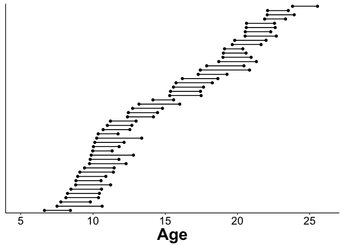
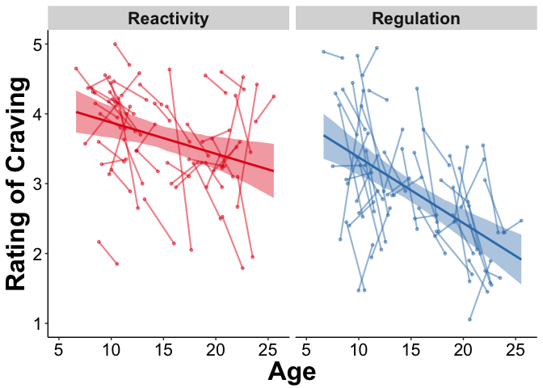
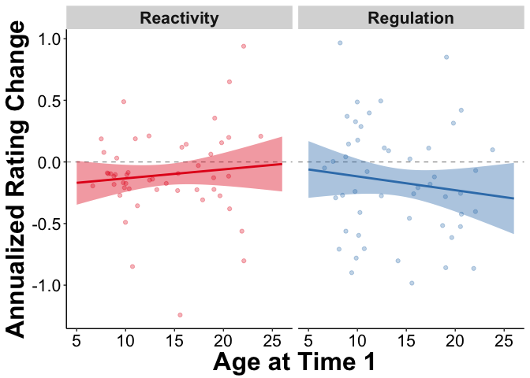

BehavioralResults
================
Rebecca Martin
6/23/2018

-   [Settings](#settings)
-   [Packages](#packages)
-   [Read in data](#read-in-data)
-   [Clean and center data](#clean-and-center-data)
-   [Prep Graphs](#prep-graphs)
-   [Graphing](#graphing)
    -   [Make longitudinal graph](#make-longitudinal-graph)
    -   [Run regressions for behav figure](#run-regressions-for-behav-figure)
    -   [Get fixed effect lines and confidence bands for Close and Far](#get-fixed-effect-lines-and-confidence-bands-for-close-and-far)
    -   [Graph behav ME figure (longitudinal lines with smoothed fixed effects lines for close and far)](#graph-behav-me-figure-longitudinal-lines-with-smoothed-fixed-effects-lines-for-close-and-far)
-   [Run regressions](#run-regressions)
    -   [What is the shape of the behavioral changes?](#what-is-the-shape-of-the-behavioral-changes)
-   [Look at Annualized Change](#look-at-annualized-change)
    -   [Make Data Long](#make-data-long)
    -   [Plot Annualized Change](#plot-annualized-change)
    -   [Does annualized change differ with age?](#does-annualized-change-differ-with-age)

Settings
--------

``` r
knitr::opts_chunk$set(cache=TRUE)
```

``` r
root <- rprojroot::find_rstudio_root_file()
dataDir <- file.path(root, 'data')
codeDir <- file.path(root, 'code')
figureDir <- file.path(root, 'figures')
```

Packages
--------

``` r
library(tidyverse)
library(lme4)
library(lmerTest)
library(bmlm)
library(arm)
```

Read in data
------------

``` r
appAvgLong <- read.table(file.path(dataDir,"app_avg_long.txt"), header=TRUE, sep="\t") ## for graphing 
appAvgWide <- read.table(file.path(dataDir,"app_avg_wide.txt"), header=TRUE, sep="\t")
demographicsLong <- read.table(file.path(dataDir,"demographicsLong.txt"), header=TRUE, sep="\t")
appBehavLongRaw <- read.table(file.path(dataDir,"app_behav_long.txt"), header=TRUE, sep="\t")

# For BMI measurements
asegLong <- read.table(file.path(dataDir,"asegLong.txt"), header=TRUE, sep="\t")
```

Clean and center data
---------------------

``` r
## Merge dataframes by id and phase
appLongAll <- merge(appBehavLongRaw, demographicsLong, by=c('ID', 'Phase'))
aseg2TPbehav <- merge(appAvgLong, asegLong, by=c('ID', 'Phase'))

## Bad subs: 10744, 13078, 1136
appAvgLong <- appAvgLong %>% dplyr::filter(ID != 10744, ID!= 13078, ID != 1136)
appAvgWide <- appAvgWide %>% dplyr::filter(ID != 10744, ID!= 13078, ID != 1136)
appLongAll <- appLongAll %>% dplyr::filter(ID != 10744, ID!= 13078, ID != 1136)

appAvgLongReduced <- appAvgLong %>% dplyr::select(Reactivity=Close, Regulation=Far, Age, fsid) %>% gather(key=Type, value=Rating, -fsid, -Age)

## Center data
appLongAll$AgeCent <- appLongAll$Age - mean(appLongAll$Age)
appLongAll$AgeSq <- appLongAll$AgeCent*appLongAll$AgeCent
appLongAll$AgeCu <- appLongAll$AgeCent*appLongAll$AgeCent*appLongAll$AgeCent

# Make Close and Far subsets for averaged and long data frames
appLongAvgClose <- appAvgLongReduced %>% filter(Type=="Reactivity")
appLongAvgFar <- appAvgLongReduced %>% filter(Type=="Regulation")

appLongClose <- appLongAll %>% filter(Type=="Close")
appLongFar <- appLongAll %>% filter(Type=="Far")
```

Prep Graphs
-----------

Graphing
========

Make longitudinal graph
-----------------------

``` r
demographicsPlotter <- appAvgLong %>% 
    mutate(Age=as.numeric(as.character(Age))) %>% 
    group_by(fsid) %>% 
    mutate(AgeMin=min(Age), AgeMax=max(Age)) %>% 
    ungroup() %>% 
    arrange(AgeMin) %>% 
    mutate(subjid=factor(fsid, levels=unique(fsid)))

ggplot(demographicsPlotter) + geom_errorbarh(aes(xmin=AgeMin, y=subjid, xmax=AgeMax, x=Age, group=fsid), height=0) + geom_point(aes(x=Age, y=subjid, group=fsid)) + ylab(NULL) + beckys.theme.conference + theme(axis.text.y=element_blank(), axis.ticks.y=element_blank(), panel.grid.major=element_blank(), panel.grid.minor=element_blank()) + xlim(5,26)
```



``` r
#ggsave("figures/demographics.pdf", width=7, height=5, dpi=300)
```

Run regressions for behav figure
--------------------------------

``` r
## Effect of Age and Close/Far
### Close Regression
closeBehavRes <- lmer(Rating ~ AgeCent + (1 | fsid), data=appLongClose)
summary(closeBehavRes)
```

    ## Linear mixed model fit by REML. t-tests use Satterthwaite's method [
    ## lmerModLmerTest]
    ## Formula: Rating ~ AgeCent + (1 | fsid)
    ##    Data: appLongClose
    ## 
    ## REML criterion at convergence: 5908
    ## 
    ## Scaled residuals: 
    ##     Min      1Q  Median      3Q     Max 
    ## -2.9207 -0.6385  0.2121  0.6936  2.3872 
    ## 
    ## Random effects:
    ##  Groups   Name        Variance Std.Dev.
    ##  fsid     (Intercept) 0.3288   0.5734  
    ##  Residual             1.4221   1.1925  
    ## Number of obs: 1815, groups:  fsid, 49
    ## 
    ## Fixed effects:
    ##             Estimate Std. Error       df t value Pr(>|t|)    
    ## (Intercept)  3.63567    0.08663 46.66812  41.970  < 2e-16 ***
    ## AgeCent     -0.05427    0.01476 96.42220  -3.677 0.000388 ***
    ## ---
    ## Signif. codes:  0 '***' 0.001 '**' 0.01 '*' 0.05 '.' 0.1 ' ' 1
    ## 
    ## Correlation of Fixed Effects:
    ##         (Intr)
    ## AgeCent 0.025

``` r
## Far Regression
farBehavRes <- lmer(Rating ~ AgeCent + (1 | fsid), data=appLongFar)  
summary(farBehavRes)
```

    ## Linear mixed model fit by REML. t-tests use Satterthwaite's method [
    ## lmerModLmerTest]
    ## Formula: Rating ~ AgeCent + (1 | fsid)
    ##    Data: appLongFar
    ## 
    ## REML criterion at convergence: 5667.6
    ## 
    ## Scaled residuals: 
    ##     Min      1Q  Median      3Q     Max 
    ## -3.2320 -0.7279  0.0297  0.6985  3.1883 
    ## 
    ## Random effects:
    ##  Groups   Name        Variance Std.Dev.
    ##  fsid     (Intercept) 0.3665   0.6054  
    ##  Residual             1.2758   1.1295  
    ## Number of obs: 1798, groups:  fsid, 49
    ## 
    ## Fixed effects:
    ##             Estimate Std. Error       df t value Pr(>|t|)    
    ## (Intercept)  2.86863    0.09056 42.14616  31.676  < 2e-16 ***
    ## AgeCent     -0.12520    0.01502 98.40065  -8.338 4.67e-13 ***
    ## ---
    ## Signif. codes:  0 '***' 0.001 '**' 0.01 '*' 0.05 '.' 0.1 ' ' 1
    ## 
    ## Correlation of Fixed Effects:
    ##         (Intr)
    ## AgeCent 0.024

``` r
### Combined Regression
bothBehavRes <- lmer(Rating ~ AgeCent + Type + (Type | fsid), data=appLongAll) 
summary(bothBehavRes)
```

    ## Linear mixed model fit by REML. t-tests use Satterthwaite's method [
    ## lmerModLmerTest]
    ## Formula: Rating ~ AgeCent + Type + (Type | fsid)
    ##    Data: appLongAll
    ## 
    ## REML criterion at convergence: 11576.6
    ## 
    ## Scaled residuals: 
    ##      Min       1Q   Median       3Q      Max 
    ## -3.11396 -0.70490  0.09999  0.72457  3.00645 
    ## 
    ## Random effects:
    ##  Groups   Name        Variance Std.Dev. Corr 
    ##  fsid     (Intercept) 0.4067   0.6377        
    ##           TypeFar     0.4053   0.6367   -0.59
    ##  Residual             1.3513   1.1624        
    ## Number of obs: 3613, groups:  fsid, 49
    ## 
    ## Fixed effects:
    ##              Estimate Std. Error        df t value Pr(>|t|)    
    ## (Intercept)   3.62920    0.09515  41.02256  38.143  < 2e-16 ***
    ## AgeCent      -0.09809    0.01190 124.68352  -8.244 1.97e-13 ***
    ## TypeFar      -0.75724    0.09889  47.99501  -7.657 7.29e-10 ***
    ## ---
    ## Signif. codes:  0 '***' 0.001 '**' 0.01 '*' 0.05 '.' 0.1 ' ' 1
    ## 
    ## Correlation of Fixed Effects:
    ##         (Intr) AgeCnt
    ## AgeCent  0.019       
    ## TypeFar -0.602 -0.001

``` r
### Interaction of Strategy and Age
bothBehavResInt <- lmer(Rating ~ Type*AgeCent + (Type | fsid), data=appLongAll)
summary(bothBehavResInt)
```

    ## Linear mixed model fit by REML. t-tests use Satterthwaite's method [
    ## lmerModLmerTest]
    ## Formula: Rating ~ Type * AgeCent + (Type | fsid)
    ##    Data: appLongAll
    ## 
    ## REML criterion at convergence: 11570.9
    ## 
    ## Scaled residuals: 
    ##     Min      1Q  Median      3Q     Max 
    ## -3.1353 -0.6924  0.1115  0.7130  3.0614 
    ## 
    ## Random effects:
    ##  Groups   Name        Variance Std.Dev. Corr 
    ##  fsid     (Intercept) 0.3410   0.5840        
    ##           TypeFar     0.3609   0.6008   -0.48
    ##  Residual             1.3488   1.1614        
    ## Number of obs: 3613, groups:  fsid, 49
    ## 
    ## Fixed effects:
    ##                  Estimate Std. Error        df t value Pr(>|t|)    
    ## (Intercept)       3.63393    0.08782  44.94647  41.380  < 2e-16 ***
    ## TypeFar          -0.76573    0.09421  46.18095  -8.128 1.86e-10 ***
    ## AgeCent          -0.06531    0.01443 104.91379  -4.527 1.59e-05 ***
    ## TypeFar:AgeCent  -0.06212    0.01709  74.70070  -3.634 0.000509 ***
    ## ---
    ## Signif. codes:  0 '***' 0.001 '**' 0.01 '*' 0.05 '.' 0.1 ' ' 1
    ## 
    ## Correlation of Fixed Effects:
    ##             (Intr) TypeFr AgeCnt
    ## TypeFar     -0.503              
    ## AgeCent      0.024 -0.013       
    ## TypFr:AgCnt -0.013  0.024 -0.566

``` r
### BMI
summary(BMIClose <- lmer(Close ~ BMIGroupReduced + (1 | ID), data=aseg2TPbehav))
```

    ## Linear mixed model fit by REML. t-tests use Satterthwaite's method [
    ## lmerModLmerTest]
    ## Formula: Close ~ BMIGroupReduced + (1 | ID)
    ##    Data: aseg2TPbehav
    ## 
    ## REML criterion at convergence: 198
    ## 
    ## Scaled residuals: 
    ##      Min       1Q   Median       3Q      Max 
    ## -2.91686 -0.36948  0.03031  0.45429  2.47454 
    ## 
    ## Random effects:
    ##  Groups   Name        Variance Std.Dev.
    ##  ID       (Intercept) 0.2842   0.5331  
    ##  Residual             0.2301   0.4797  
    ## Number of obs: 98, groups:  ID, 49
    ## 
    ## Fixed effects:
    ##                           Estimate Std. Error      df t value Pr(>|t|)    
    ## (Intercept)                 3.7113     0.1012 59.6740  36.660   <2e-16 ***
    ## BMIGroupReducedoverweight  -0.2043     0.1497 93.5420  -1.365    0.176    
    ## ---
    ## Signif. codes:  0 '***' 0.001 '**' 0.01 '*' 0.05 '.' 0.1 ' ' 1
    ## 
    ## Correlation of Fixed Effects:
    ##             (Intr)
    ## BMIGrpRdcdv -0.453

``` r
summary(BMIFar <- lmer(Far ~ BMIGroupReduced + (1 | ID), data=aseg2TPbehav))
```

    ## Linear mixed model fit by REML. t-tests use Satterthwaite's method [
    ## lmerModLmerTest]
    ## Formula: Far ~ BMIGroupReduced + (1 | ID)
    ##    Data: aseg2TPbehav
    ## 
    ## REML criterion at convergence: 248.4
    ## 
    ## Scaled residuals: 
    ##      Min       1Q   Median       3Q      Max 
    ## -1.58482 -0.66502 -0.07369  0.69935  2.11133 
    ## 
    ## Random effects:
    ##  Groups   Name        Variance Std.Dev.
    ##  ID       (Intercept) 0.3119   0.5585  
    ##  Residual             0.4758   0.6898  
    ## Number of obs: 98, groups:  ID, 49
    ## 
    ## Fixed effects:
    ##                           Estimate Std. Error       df t value Pr(>|t|)
    ## (Intercept)                2.86917    0.12171 59.67222  23.575   <2e-16
    ## BMIGroupReducedoverweight  0.09529    0.19579 95.81344   0.487    0.628
    ##                              
    ## (Intercept)               ***
    ## BMIGroupReducedoverweight    
    ## ---
    ## Signif. codes:  0 '***' 0.001 '**' 0.01 '*' 0.05 '.' 0.1 ' ' 1
    ## 
    ## Correlation of Fixed Effects:
    ##             (Intr)
    ## BMIGrpRdcdv -0.492

Get fixed effect lines and confidence bands for Close and Far
-------------------------------------------------------------

``` r
## for 95% confidence intervals change probs to 2.5 and 97.5 #90% = .05, .95
fitted.mer <- function(mod, nsim=100, probs=c(.025, .975), re.form=NULL)
{
    if(length(probs) != 2)
    {
        stop('probs must have two numbers, a lower and an upper bound')
    }
    
    predictThis <- function(x)
    {
        predict(x, re.form=re.form)
    }
    
    # compute bootstrapped predictions
    thePreds <- bootMer(mod, FUN=predictThis, nsim=nsim, re.form=re.form)
    
    # get the quantiles for each prediction and transpose to nice, row format
    theBounds <- apply(thePreds$t, 2, quantile, probs=probs) %>% t
    
    # combine the predictions and the quantils for each prediction and give names and make a tibble
    cbind(thePreds$t0, theBounds) %>% 
        as.data.frame %>% 
        setNames(c('Prediction', 'Lower', 'Upper')) %>% 
        tibble::as_tibble()
}

closeBehavResAvg <- lmer(Rating ~ Age + (1|fsid), data=appLongAvgClose)
farBehavResAvg <- lmer(Rating ~ Age + (1|fsid), data=appLongAvgFar)

closePreds <- fitted.mer(closeBehavResAvg, nsim=400, re.form=NA)
farPreds <- fitted.mer(farBehavResAvg, nsim=400, re.form=NA)

appLongClosePred <- bind_cols(appLongAvgClose, closePreds) %>% tibble::as_tibble()
appLongFarPred <- bind_cols(appLongAvgFar, farPreds) %>% tibble::as_tibble()

appLongAllPred <- bind_rows("Reactivity"=appLongClosePred, 
                            "Regulation"=appLongFarPred, 
                            .id='TrialType')
```

Graph behav ME figure (longitudinal lines with smoothed fixed effects lines for close and far)
----------------------------------------------------------------------------------------------

``` r
ggplot(appLongAllPred, aes(x=Age)) + 
    #geom_smooth(aes(color=Type, fill=Type), level=.95, method='lm') +
    geom_point(aes(y=Rating, color=Type), size=1, alpha=.5) +
    geom_line(aes(y=Rating, group=fsid, color=Type), alpha=.5, size=.75) + 
    geom_ribbon(aes(ymin=Lower, ymax=Upper, fill=Type), alpha=.4) + 
    geom_line(aes(y=Prediction, color=Type), size=1) + 
    facet_wrap(~Type) + 
    beckys.theme.conference +
    ylab("Rating of Craving") + 
    ylim(1,5) +
    xlim(5,26) +
    scale_color_brewer(palette="Set1") + scale_fill_brewer(palette="Set1") +
    #scale_color_manual(values=c("#e41a1c", "#377eb8")) + 
    theme(legend.position="none", legend.title=element_blank())
```



``` r
#ggsave("figures/BehavMainEffects.pdf", width=10, height=5, dpi=300)
#ggsave("figures/BehavMainEffectsDiss.pdf", width=10, height=5, dpi=300)
```

Run regressions
===============

What is the shape of the behavioral changes?
--------------------------------------------

``` r
### Close Regression
closeNull <-  lmer(Rating ~ 1 + (1 | fsid), data=appLongClose)
closeBehav <- lmer(Rating ~ AgeCent + (1 | fsid), data=appLongClose)
closeBehavSq <- lmer(Rating ~ AgeCent + AgeSq + (1 | fsid), data=appLongClose)
closeBehavCu <- lmer(Rating ~ AgeCent + AgeSq + AgeCu + (1 | fsid), data=appLongClose)

anova(closeNull, closeBehav, closeBehavSq, closeBehavCu)
```

    ## refitting model(s) with ML (instead of REML)

<script data-pagedtable-source type="application/json">
{"columns":[{"label":[""],"name":["_rn_"],"type":[""],"align":["left"]},{"label":["Df"],"name":[1],"type":["dbl"],"align":["right"]},{"label":["AIC"],"name":[2],"type":["dbl"],"align":["right"]},{"label":["BIC"],"name":[3],"type":["dbl"],"align":["right"]},{"label":["logLik"],"name":[4],"type":["dbl"],"align":["right"]},{"label":["deviance"],"name":[5],"type":["dbl"],"align":["right"]},{"label":["Chisq"],"name":[6],"type":["dbl"],"align":["right"]},{"label":["Chi Df"],"name":[7],"type":["dbl"],"align":["right"]},{"label":["Pr(>Chisq)"],"name":[8],"type":["dbl"],"align":["right"]}],"data":[{"1":"3","2":"5917.773","3":"5934.284","4":"-2955.886","5":"5911.773","6":"NA","7":"NA","8":"NA","_rn_":"closeNull"},{"1":"4","2":"5906.310","3":"5928.325","4":"-2949.155","5":"5898.310","6":"13.463163","7":"1","8":"0.0002432933","_rn_":"closeBehav"},{"1":"5","2":"5902.721","3":"5930.240","4":"-2946.360","5":"5892.721","6":"5.589141","7":"1","8":"0.0180721578","_rn_":"closeBehavSq"},{"1":"6","2":"5900.979","3":"5934.003","4":"-2944.490","5":"5888.979","6":"3.741026","7":"1","8":"0.0530918342","_rn_":"closeBehavCu"}],"options":{"columns":{"min":{},"max":[10]},"rows":{"min":[10],"max":[10]},"pages":{}}}
  </script>

``` r
## Far Regression
farNull <- lmer(Rating ~ 1 + (1 | fsid), data=appLongFar) 
farBehav <- lmer(Rating ~ AgeCent + (1 | fsid), data=appLongFar)  
farBehavSq <- lmer(Rating ~ AgeCent + AgeSq + (1 | fsid), data=appLongFar) 
farBehavCu <- lmer(Rating ~ AgeCent + AgeSq + AgeCu + (1 | fsid), data=appLongFar) 

anova(farNull, farBehav, farBehavSq, farBehavCu)
```

    ## refitting model(s) with ML (instead of REML)

<script data-pagedtable-source type="application/json">
{"columns":[{"label":[""],"name":["_rn_"],"type":[""],"align":["left"]},{"label":["Df"],"name":[1],"type":["dbl"],"align":["right"]},{"label":["AIC"],"name":[2],"type":["dbl"],"align":["right"]},{"label":["BIC"],"name":[3],"type":["dbl"],"align":["right"]},{"label":["logLik"],"name":[4],"type":["dbl"],"align":["right"]},{"label":["deviance"],"name":[5],"type":["dbl"],"align":["right"]},{"label":["Chisq"],"name":[6],"type":["dbl"],"align":["right"]},{"label":["Chi Df"],"name":[7],"type":["dbl"],"align":["right"]},{"label":["Pr(>Chisq)"],"name":[8],"type":["dbl"],"align":["right"]}],"data":[{"1":"3","2":"5730.725","3":"5747.208","4":"-2862.362","5":"5724.725","6":"NA","7":"NA","8":"NA","_rn_":"farNull"},{"1":"4","2":"5666.090","3":"5688.068","4":"-2829.045","5":"5658.090","6":"66.6346113","7":"1","8":"3.267975e-16","_rn_":"farBehav"},{"1":"5","2":"5667.821","3":"5695.293","4":"-2828.911","5":"5657.821","6":"0.2693488","7":"1","8":"6.037690e-01","_rn_":"farBehavSq"},{"1":"6","2":"5669.502","3":"5702.469","4":"-2828.751","5":"5657.502","6":"0.3190203","7":"1","8":"5.721970e-01","_rn_":"farBehavCu"}],"options":{"columns":{"min":{},"max":[10]},"rows":{"min":[10],"max":[10]},"pages":{}}}
  </script>

Look at Annualized Change
=========================

Make Data Long
--------------

``` r
appToPlot <- appAvgWide %>% 
    # only keep columns we care about
    dplyr::select(ID, Age_T1, CloseAnn, FarAnn) %>% 
    # make the data long, creating a column for both long and far, keeping Age and TimeElapsed separate
    gather(Type, DiffAnnual, CloseAnn, FarAnn) %>% 
    # group by subjid and Type so we can get proper lagged values 
    mutate(Type=ifelse(Type == 'CloseAnn', 'Reactivity', 'Regulation'))
```

Plot Annualized Change
----------------------

``` r
ggplot(appToPlot, aes(x=Age_T1, y=DiffAnnual)) + 
    geom_hline(yintercept=0, linetype="dashed", color="darkgrey") +
    geom_smooth(aes(color=Type, fill=Type), level=.9,  method="lm", fullrange=TRUE) + 
    geom_point(aes(color=Type), alpha=.3) + 
    facet_wrap(~Type) + 
    xlab("Age at Time 1") +
    ylab('Annualized Rating Change') +
    xlim(5,26) +
    theme(legend.position='none') + 
    beckys.theme.conference + 
    scale_color_brewer(palette="Set1") +
    scale_fill_brewer(palette="Set1") 
```



``` r
#ggsave("figures/AnnualizedChange.pdf", width=10, height=6, dpi=300)
```

Does annualized change differ with age?
---------------------------------------

``` r
closeAnnMod <- lm(CloseAnn ~ Age_T1, data=appAvgWide)
summary(closeAnnMod)
```

    ## 
    ## Call:
    ## lm(formula = CloseAnn ~ Age_T1, data = appAvgWide)
    ## 
    ## Residuals:
    ##      Min       1Q   Median       3Q      Max 
    ## -1.14940 -0.13327 -0.02604  0.21072  0.98447 
    ## 
    ## Coefficients:
    ##              Estimate Std. Error t value Pr(>|t|)
    ## (Intercept) -0.205883   0.152848  -1.347    0.184
    ## Age_T1       0.007267   0.010267   0.708    0.483
    ## 
    ## Residual standard error: 0.3552 on 47 degrees of freedom
    ## Multiple R-squared:  0.01055,    Adjusted R-squared:  -0.01051 
    ## F-statistic: 0.501 on 1 and 47 DF,  p-value: 0.4826

``` r
farAnnMod <- lm(FarAnn ~ Age_T1, data=appAvgWide)
summary(farAnnMod)
```

    ## 
    ## Call:
    ## lm(formula = FarAnn ~ Age_T1, data = appAvgWide)
    ## 
    ## Residuals:
    ##      Min       1Q   Median       3Q      Max 
    ## -0.80380 -0.29007 -0.01993  0.29460  1.06973 
    ## 
    ## Coefficients:
    ##              Estimate Std. Error t value Pr(>|t|)
    ## (Intercept) -0.005037   0.198213  -0.025    0.980
    ## Age_T1      -0.011218   0.013314  -0.843    0.404
    ## 
    ## Residual standard error: 0.4606 on 47 degrees of freedom
    ## Multiple R-squared:  0.01488,    Adjusted R-squared:  -0.00608 
    ## F-statistic: 0.7099 on 1 and 47 DF,  p-value: 0.4037

``` r
## Nope!!

## Cool interaction with parent income and close though
closeAnnParentInc <- lm(CloseAnn ~ Age_T1*ParentIncome_T1, data=appAvgWide)
summary(closeAnnParentInc)
```

    ## 
    ## Call:
    ## lm(formula = CloseAnn ~ Age_T1 * ParentIncome_T1, data = appAvgWide)
    ## 
    ## Residuals:
    ##      Min       1Q   Median       3Q      Max 
    ## -0.74398 -0.10559 -0.01463  0.15617  0.53829 
    ## 
    ## Coefficients:
    ##                         Estimate Std. Error t value Pr(>|t|)   
    ## (Intercept)            -1.154346   0.431882  -2.673  0.01135 * 
    ## Age_T1                  0.081395   0.029865   2.725  0.00996 **
    ## ParentIncome_T1         0.127616   0.053191   2.399  0.02189 * 
    ## Age_T1:ParentIncome_T1 -0.010073   0.003621  -2.782  0.00864 **
    ## ---
    ## Signif. codes:  0 '***' 0.001 '**' 0.01 '*' 0.05 '.' 0.1 ' ' 1
    ## 
    ## Residual standard error: 0.2639 on 35 degrees of freedom
    ##   (10 observations deleted due to missingness)
    ## Multiple R-squared:  0.1887, Adjusted R-squared:  0.1192 
    ## F-statistic: 2.714 on 3 and 35 DF,  p-value: 0.05963
