Lasso-CrossValidated Results
================
Jared Lander and Rebecca Martin
6/24/2018

-   [Packages](#packages)
-   [Helper Functions](#helper-functions)
    -   [Datatable](#datatable-func)
    -   [Matrix Prepper](#matrix-prep-func)
    -   [Model Prep and Fit](#model-prep-fit)
    -   [Cross-Validation](#cross-validation)
    -   [Plotting Theme](#plot-theme)
    -   [Coefficient Path](#coef-path)
    -   [Coefficient Plot](#coef-plot)
    -   [Model Summary](#model-summary)
    -   [All Regions](#data-all)
-   [Model Prep](#model-prep)
    -   [Region Names](#region-names)
-   [glmnet Models](#models)
    -   [All Regions Models](#glmnet-all-regions)
        -   [Rating All: ageCent, ageSq, AgeCu, Gender, Type, Brain regions](#rating-all-agecent-agesq-agecu-gender-type-brain-regions)
        -   [Rating All: ageCent, Gender, Type, Brain regions](#rating-all-agecent-gender-type-brain-regions)
        -   [Far All: ageCent, ageSq, AgeCu, Gender, Brain regions](#far-all-agecent-agesq-agecu-gender-brain-regions)
        -   [Far All: ageCent, Gender, Brain regions](#far-all-agecent-gender-brain-regions)
        -   [Fit an `lmer` based on the variables chosen in `all4`](#fit-an-lmer-based-on-the-variables-chosen-in-all4)

Packages
========

These are the packages we are using frequently enough to be loaded. Other packages may be used as namespaces and are not shown here.

``` r
packages <- c('coefplot',
              'dplyr', 'DT',
              'ggplot2', 'glmnet', 
              'here', 
              'lme4',
              'magrittr', 
              'purrr',
              'rsample',
              'useful')
purrr::walk(packages, library, character.only=TRUE)
```

Helper Functions
================

These are functions to make things a little easier.

Datatable
---------

This sets a bunch of options when using `datatable` which should really be the default anyway.

``` r
makeDT <- function(data, elementId)
{
    if (missing(elementId)) {
        elementId <- sprintf("coefpath_%s", paste(sample(x = c(letters, 
            LETTERS, 0:9), size = 12, replace = TRUE), collapse = ""))
    }
    
    datatable(
        data,
        rownames=FALSE, 
        elementId=elementId,
        extensions=c('FixedColumns', 'Scroller'),
        filter='top',
        options=list(
            dom='trfi',
            fixedColumns=list(leftColumns=1),
            deferRender=TRUE,
            scrollY=400,
            scroller=TRUE
        )
    )
}
```

Matrix Prepper
--------------

For each model the design matrix and penalty factor will be different. This function computes all of that. Numeric columns are unchanged, categorical columns are converted into indicator variables. Baselines of the categorical variables are not dropped since `glmnet` does not need that. We also do not include an intercept since `glmnet` will compute that for us.

``` r
prepMatrices <- function(data, response, predictors, contrats=FALSE, sparse=TRUE, 
                         multiplier=1)
{
    # build a formula with the predictors and response
    # after the formula is build subtract the intercept
    modelFormula <- useful::build.formula(response, predictors) %>% 
        update(~ . -1)
    
    # build matrices
    x <- useful::build.x(modelFormula, data=data, 
                         contrasts=contrats, sparse=sparse)
    y <- useful::build.y(modelFormula, data=data)
    
    # build penalty factor
    # first start by setting all penalty multipliers to 1
    penaltyMultipliers <- rep(multiplier, length=ncol(x))
    # give them names so it is easier to work with
    names(penaltyMultipliers) <- colnames(x)
    # now set the ID names to 0
    penaltyMultipliers[grep(pattern='^ID', x=names(penaltyMultipliers))] <- 0
    
    return(
        list(x=x, y=y, formula=modelFormula, penalty.factor=penaltyMultipliers)
    )
}
```

Model Prep and Fit
------------------

``` r
fit_model <- function(data, response, predictors, nfolds=10, multiplier=1)
{
    prep_info <- prepMatrices(data=data, 
                              response=response,
                              predictors=predictors,
                              multiplier=multiplier
    )
    
    model <- cv.glmnet(x=prep_info$x, y=prep_info$y, 
                       alpha=1,
                       family='gaussian',
                       nfolds=nfolds,
                       penalty.factor=prep_info$penalty.factor
    )
}
```

Cross-Validation
----------------

This will be used for seeing how well our `lme4` models perform.

``` r
holdout_results <- function(splits, response, ...) {
    # Fit the model to the 90%
    mod <- lmer(..., data = analysis(splits))
    # Save the 10%
    holdout <- assessment(splits)
    # `augment` will save the predictions with the holdout data set
    res <- broom::augment(mod, newdata = holdout)
    predictions <- res$.fitted
    # Calculate whether the prediction was correct
    res$error <- predictions - holdout[[response]]
    # Return the assessment data set with the additional columns
    res
}
```

Plotting Theme
--------------

``` r
beckys.theme.conference = theme(
    panel.background = element_rect(fill='transparent'), #color="black"
    axis.line = element_line(color='black'),
    panel.grid.minor = element_line(color='transparent'),
    panel.grid.major=element_line(color="transparent"),
    axis.title.x = element_text(size=24,face = "bold"),
    axis.title.y = element_text(size=24, vjust=1, face = "bold"),
    axis.text.x = element_text(size=16, colour="black"),
    axis.text.y = element_text(size=16, colour="black"),
    legend.text=element_text(size=16),
    strip.text.y = element_text(size = 16, face="bold"),
    strip.text.x = element_text(size = 16, face="bold"),
    legend.title = element_text(face="bold"),
    axis.line.x=element_line(color = 'black'), 
    axis.line.y=element_line(color = 'black')
)
```

Coefficient Path
----------------

Orginarily when using `glmnet` we would just use `coefplot::coefpath()` but there are so many `ID` variables that we write a custom function for removing them.

``` r
pathSimple <- function(model, elementId)
{
    # get the coefficient path
    pathTable <- coefplot::extractPath(model) %>% 
        # remove the ID columns
        dplyr::select(-starts_with('ID'))
    
    # plot with dygraphs
    g <- dygraphs::dygraph(pathTable, elementId=elementId) %>% 
        dygraphs::dyAxis(name="x", label='Log Lambda') %>% 
        dygraphs::dyAxis(name="y", label='Coefficients') %>% 
        dygraphs::dyLegend(show="onmouseover") %>% 
        dygraphs::dyRangeSelector() %>% dygraphs::dyUnzoom() %>% 
        dygraphs::dyHighlight(highlightCircleSize=3, highlightSeriesBackgroundAlpha=0.5, 
                    highlightSeriesOpts=list(strokeWidth=3))
    g <- purrr::reduce(.x=names(pathTable)[-1], .f=coefplot:::annotateSeries, 
                       .init=g, x=min(pathTable$lambda))
    
    g <- g %>% dygraphs::dyEvent(x=log(model$lambda.min), label="lambda.min", 
                  color="black", labelLoc="bottom", strokePattern="dotted") %>% 
        dygraphs::dyEvent(x=log(model$lambda.1se), label="lambda.1se", 
                color="black", labelLoc="bottom", strokePattern="dotted")
    return(g)
}
```

Coefficient Plot
----------------

Likewise, we want to plot the coefplot without the `ID` variables.

``` r
coefSimple <- function(model, 
                       lambda=c('lambda.1se', 'lambda.min'), 
                       sort='magnitude', title='Coefficient Plot',
                       plot=TRUE)
{
    lambda <- match.arg(lambda)
    p <- coefplot::coefplot(model, sort=sort, lambda=lambda, plot=FALSE, 
                            intercept=FALSE) %>% 
        dplyr::filter(!grepl(pattern='^ID', Coefficient)) %>% 
        dplyr::mutate(Coefficient=factor(Coefficient, levels=Coefficient))
    
    if(plot)
    {
        p <- p %>% 
            dplyr::mutate(Coefficient=stringr::str_remove(Coefficient, '_thickness')) %>% 
            dplyr::mutate(Coefficient=stringr::str_replace_all(Coefficient, '_', ' ')) %>% 
            dplyr::mutate(Coefficient=stringr::str_replace(Coefficient, 'AgeCent', 'Age')) %>% 
            dplyr::mutate(Coefficient=factor(Coefficient, levels=Coefficient)) %>% 
            coefplot::coefplot(title=title) + beckys.theme.conference
    }
    
    p
}
```

Model Summary
-------------

``` r
modelSummary <- function(model, elementId=NULL)
{
    plot(model)
    coefSimple(model, lambda='lambda.1se', title='Coefplot 1se') %>% print
    coefSimple(model, lambda='lambda.min', title='Coefplot min') %>% print
    # pathSimple(model, elementId=elementId) %>% print
}
```

This analysis examines the raw data rather than the aggregated data.

The dataset being used (for the paper) is called 'data/AllRegionsRaw.csv' which is the dataset the paper uses. This includes all 62 aparc regions from the DKT atlas (31 per hemisphere).

Note that for the paper we use the "all4" model which includes only the regulation ratings, mean centered age, gender, and the dkt brain regions

All Regions
-----------

``` r
allRegions <- readr::read_csv(here('data', 'AllRegionsRaw.csv')) %>% 
    mutate(ID=factor(ID)) %>% 
    # correct the age centering
    mutate(AgeCent=as.numeric(scale(Age, scale = FALSE))) %>% 
    rename(AgeCentSq=AgedCentSq, AgeCentCu=AgedCentCu)
```

A sample of the data.

``` r
#makeDT(allRegions %>% sample_frac(0.10), elementId='DataAllRaw')
```

Model Prep
==========

Region Names
------------

For predictors (or features or covariates depending on your terminology) we are going to use various types of Age, Gender, BMI and the various regions. Rather than enumerating all the regions we programatically list them using regular expressions.

``` r
regionNames_all <- names(allRegions)[
    stringr::str_detect(names(allRegions), 
                        '(^(lh)|(rh)_)|(_(lh)|(rh)$)')
    ]
```

glmnet Models
=============

We originally intended to use [`cv.glmmLasso`](https://github.com/thepira/cv.glmmLasso) but it is not quite ready so instead we will use `glmnet` to approximately compute random slope models. For this to happen we turn `ID` into indicator variables. To ensure each one remains in the model we need to set their `penalty.factor`s to 0.

All Regions Models
------------------

### Rating All: ageCent, ageSq, AgeCu, Gender, Type, Brain regions

``` r
set.seed(1234)
all1 <- fit_model(data=allRegions, 
                  response='Rating',
                  predictors=c('ID', 'AgeCent', 'AgeCentSq', 'AgeCentCu', 
                               'Gender', 'Type', regionNames_all),
                  nfolds=10
)
```

We view the coefficient path, error curve and coefplot for both `lambda.1se` and `lambda.min`.

``` r
pathSimple(all1, elementId='all1_mod')
```

<!--html_preserve-->

<script type="application/json" data-for="all1_mod">{"x":{"attrs":{"axes":{"x":{"pixelsPerLabel":60},"y":[]},"labels":["lambda","AgeCent","AgeCentSq","AgeCentCu","GenderF","GenderM","TypeClose","TypeFar","lh_caudalanteriorcingulate_thickness","lh_caudalmiddlefrontal_thickness","lh_cuneus_thickness","lh_entorhinal_thickness","lh_fusiform_thickness","lh_inferiorparietal_thickness","lh_inferiortemporal_thickness","lh_isthmuscingulate_thickness","lh_lateraloccipital_thickness","lh_lateralorbitofrontal_thickness","lh_lingual_thickness","lh_medialorbitofrontal_thickness","lh_middletemporal_thickness","lh_parahippocampal_thickness","lh_paracentral_thickness","lh_parsopercularis_thickness","lh_parsorbitalis_thickness","lh_parstriangularis_thickness","lh_pericalcarine_thickness","lh_postcentral_thickness","lh_posteriorcingulate_thickness","lh_precentral_thickness","lh_precuneus_thickness","lh_rostralanteriorcingulate_thickness","lh_rostralmiddlefrontal_thickness","lh_superiorfrontal_thickness","lh_superiorparietal_thickness","lh_superiortemporal_thickness","lh_supramarginal_thickness","lh_transversetemporal_thickness","lh_insula_thickness","rh_caudalanteriorcingulate_thickness","rh_caudalmiddlefrontal_thickness","rh_cuneus_thickness","rh_entorhinal_thickness","rh_fusiform_thickness","rh_inferiorparietal_thickness","rh_inferiortemporal_thickness","rh_isthmuscingulate_thickness","rh_lateraloccipital_thickness","rh_lateralorbitofrontal_thickness","rh_lingual_thickness","rh_medialorbitofrontal_thickness","rh_middletemporal_thickness","rh_parahippocampal_thickness","rh_paracentral_thickness","rh_parsopercularis_thickness","rh_parsorbitalis_thickness","rh_parstriangularis_thickness","rh_pericalcarine_thickness","rh_postcentral_thickness","rh_posteriorcingulate_thickness","rh_precentral_thickness","rh_precuneus_thickness","rh_rostralanteriorcingulate_thickness","rh_rostralmiddlefrontal_thickness","rh_superiorfrontal_thickness","rh_superiorparietal_thickness","rh_superiortemporal_thickness","rh_supramarginal_thickness","rh_transversetemporal_thickness","rh_insula_thickness"],"retainDateWindow":false,"xlabel":"Log Lambda","ylabel":"Coefficients","legend":"onmouseover","labelsDivWidth":250,"labelsShowZeroValues":true,"labelsSeparateLines":false,"showRangeSelector":true,"rangeSelectorHeight":40,"rangeSelectorPlotFillColor":" #A7B1C4","rangeSelectorPlotStrokeColor":"#808FAB","interactionModel":"Dygraph.Interaction.defaultModel","highlightCircleSize":3,"highlightSeriesBackgroundAlpha":0.5,"highlightSeriesOpts":{"strokeWidth":3},"hideOverlayOnMouseOut":true},"annotations":[{"x":-10.7077776649796,"shortText":"AgeCent","text":"AgeCent","width":50,"attachAtBottom":false,"series":"AgeCent"},{"x":-10.7077776649796,"shortText":"AgeCentSq","text":"AgeCentSq","width":50,"attachAtBottom":false,"series":"AgeCentSq"},{"x":-10.7077776649796,"shortText":"AgeCentCu","text":"AgeCentCu","width":50,"attachAtBottom":false,"series":"AgeCentCu"},{"x":-10.7077776649796,"shortText":"GenderF","text":"GenderF","width":50,"attachAtBottom":false,"series":"GenderF"},{"x":-10.7077776649796,"shortText":"GenderM","text":"GenderM","width":50,"attachAtBottom":false,"series":"GenderM"},{"x":-10.7077776649796,"shortText":"TypeClose","text":"TypeClose","width":50,"attachAtBottom":false,"series":"TypeClose"},{"x":-10.7077776649796,"shortText":"TypeFar","text":"TypeFar","width":50,"attachAtBottom":false,"series":"TypeFar"},{"x":-10.7077776649796,"shortText":"lh_caudalanteriorcingulate_thickness","text":"lh_caudalanteriorcingulate_thickness","width":50,"attachAtBottom":false,"series":"lh_caudalanteriorcingulate_thickness"},{"x":-10.7077776649796,"shortText":"lh_caudalmiddlefrontal_thickness","text":"lh_caudalmiddlefrontal_thickness","width":50,"attachAtBottom":false,"series":"lh_caudalmiddlefrontal_thickness"},{"x":-10.7077776649796,"shortText":"lh_cuneus_thickness","text":"lh_cuneus_thickness","width":50,"attachAtBottom":false,"series":"lh_cuneus_thickness"},{"x":-10.7077776649796,"shortText":"lh_entorhinal_thickness","text":"lh_entorhinal_thickness","width":50,"attachAtBottom":false,"series":"lh_entorhinal_thickness"},{"x":-10.7077776649796,"shortText":"lh_fusiform_thickness","text":"lh_fusiform_thickness","width":50,"attachAtBottom":false,"series":"lh_fusiform_thickness"},{"x":-10.7077776649796,"shortText":"lh_inferiorparietal_thickness","text":"lh_inferiorparietal_thickness","width":50,"attachAtBottom":false,"series":"lh_inferiorparietal_thickness"},{"x":-10.7077776649796,"shortText":"lh_inferiortemporal_thickness","text":"lh_inferiortemporal_thickness","width":50,"attachAtBottom":false,"series":"lh_inferiortemporal_thickness"},{"x":-10.7077776649796,"shortText":"lh_isthmuscingulate_thickness","text":"lh_isthmuscingulate_thickness","width":50,"attachAtBottom":false,"series":"lh_isthmuscingulate_thickness"},{"x":-10.7077776649796,"shortText":"lh_lateraloccipital_thickness","text":"lh_lateraloccipital_thickness","width":50,"attachAtBottom":false,"series":"lh_lateraloccipital_thickness"},{"x":-10.7077776649796,"shortText":"lh_lateralorbitofrontal_thickness","text":"lh_lateralorbitofrontal_thickness","width":50,"attachAtBottom":false,"series":"lh_lateralorbitofrontal_thickness"},{"x":-10.7077776649796,"shortText":"lh_lingual_thickness","text":"lh_lingual_thickness","width":50,"attachAtBottom":false,"series":"lh_lingual_thickness"},{"x":-10.7077776649796,"shortText":"lh_medialorbitofrontal_thickness","text":"lh_medialorbitofrontal_thickness","width":50,"attachAtBottom":false,"series":"lh_medialorbitofrontal_thickness"},{"x":-10.7077776649796,"shortText":"lh_middletemporal_thickness","text":"lh_middletemporal_thickness","width":50,"attachAtBottom":false,"series":"lh_middletemporal_thickness"},{"x":-10.7077776649796,"shortText":"lh_parahippocampal_thickness","text":"lh_parahippocampal_thickness","width":50,"attachAtBottom":false,"series":"lh_parahippocampal_thickness"},{"x":-10.7077776649796,"shortText":"lh_paracentral_thickness","text":"lh_paracentral_thickness","width":50,"attachAtBottom":false,"series":"lh_paracentral_thickness"},{"x":-10.7077776649796,"shortText":"lh_parsopercularis_thickness","text":"lh_parsopercularis_thickness","width":50,"attachAtBottom":false,"series":"lh_parsopercularis_thickness"},{"x":-10.7077776649796,"shortText":"lh_parsorbitalis_thickness","text":"lh_parsorbitalis_thickness","width":50,"attachAtBottom":false,"series":"lh_parsorbitalis_thickness"},{"x":-10.7077776649796,"shortText":"lh_parstriangularis_thickness","text":"lh_parstriangularis_thickness","width":50,"attachAtBottom":false,"series":"lh_parstriangularis_thickness"},{"x":-10.7077776649796,"shortText":"lh_pericalcarine_thickness","text":"lh_pericalcarine_thickness","width":50,"attachAtBottom":false,"series":"lh_pericalcarine_thickness"},{"x":-10.7077776649796,"shortText":"lh_postcentral_thickness","text":"lh_postcentral_thickness","width":50,"attachAtBottom":false,"series":"lh_postcentral_thickness"},{"x":-10.7077776649796,"shortText":"lh_posteriorcingulate_thickness","text":"lh_posteriorcingulate_thickness","width":50,"attachAtBottom":false,"series":"lh_posteriorcingulate_thickness"},{"x":-10.7077776649796,"shortText":"lh_precentral_thickness","text":"lh_precentral_thickness","width":50,"attachAtBottom":false,"series":"lh_precentral_thickness"},{"x":-10.7077776649796,"shortText":"lh_precuneus_thickness","text":"lh_precuneus_thickness","width":50,"attachAtBottom":false,"series":"lh_precuneus_thickness"},{"x":-10.7077776649796,"shortText":"lh_rostralanteriorcingulate_thickness","text":"lh_rostralanteriorcingulate_thickness","width":50,"attachAtBottom":false,"series":"lh_rostralanteriorcingulate_thickness"},{"x":-10.7077776649796,"shortText":"lh_rostralmiddlefrontal_thickness","text":"lh_rostralmiddlefrontal_thickness","width":50,"attachAtBottom":false,"series":"lh_rostralmiddlefrontal_thickness"},{"x":-10.7077776649796,"shortText":"lh_superiorfrontal_thickness","text":"lh_superiorfrontal_thickness","width":50,"attachAtBottom":false,"series":"lh_superiorfrontal_thickness"},{"x":-10.7077776649796,"shortText":"lh_superiorparietal_thickness","text":"lh_superiorparietal_thickness","width":50,"attachAtBottom":false,"series":"lh_superiorparietal_thickness"},{"x":-10.7077776649796,"shortText":"lh_superiortemporal_thickness","text":"lh_superiortemporal_thickness","width":50,"attachAtBottom":false,"series":"lh_superiortemporal_thickness"},{"x":-10.7077776649796,"shortText":"lh_supramarginal_thickness","text":"lh_supramarginal_thickness","width":50,"attachAtBottom":false,"series":"lh_supramarginal_thickness"},{"x":-10.7077776649796,"shortText":"lh_transversetemporal_thickness","text":"lh_transversetemporal_thickness","width":50,"attachAtBottom":false,"series":"lh_transversetemporal_thickness"},{"x":-10.7077776649796,"shortText":"lh_insula_thickness","text":"lh_insula_thickness","width":50,"attachAtBottom":false,"series":"lh_insula_thickness"},{"x":-10.7077776649796,"shortText":"rh_caudalanteriorcingulate_thickness","text":"rh_caudalanteriorcingulate_thickness","width":50,"attachAtBottom":false,"series":"rh_caudalanteriorcingulate_thickness"},{"x":-10.7077776649796,"shortText":"rh_caudalmiddlefrontal_thickness","text":"rh_caudalmiddlefrontal_thickness","width":50,"attachAtBottom":false,"series":"rh_caudalmiddlefrontal_thickness"},{"x":-10.7077776649796,"shortText":"rh_cuneus_thickness","text":"rh_cuneus_thickness","width":50,"attachAtBottom":false,"series":"rh_cuneus_thickness"},{"x":-10.7077776649796,"shortText":"rh_entorhinal_thickness","text":"rh_entorhinal_thickness","width":50,"attachAtBottom":false,"series":"rh_entorhinal_thickness"},{"x":-10.7077776649796,"shortText":"rh_fusiform_thickness","text":"rh_fusiform_thickness","width":50,"attachAtBottom":false,"series":"rh_fusiform_thickness"},{"x":-10.7077776649796,"shortText":"rh_inferiorparietal_thickness","text":"rh_inferiorparietal_thickness","width":50,"attachAtBottom":false,"series":"rh_inferiorparietal_thickness"},{"x":-10.7077776649796,"shortText":"rh_inferiortemporal_thickness","text":"rh_inferiortemporal_thickness","width":50,"attachAtBottom":false,"series":"rh_inferiortemporal_thickness"},{"x":-10.7077776649796,"shortText":"rh_isthmuscingulate_thickness","text":"rh_isthmuscingulate_thickness","width":50,"attachAtBottom":false,"series":"rh_isthmuscingulate_thickness"},{"x":-10.7077776649796,"shortText":"rh_lateraloccipital_thickness","text":"rh_lateraloccipital_thickness","width":50,"attachAtBottom":false,"series":"rh_lateraloccipital_thickness"},{"x":-10.7077776649796,"shortText":"rh_lateralorbitofrontal_thickness","text":"rh_lateralorbitofrontal_thickness","width":50,"attachAtBottom":false,"series":"rh_lateralorbitofrontal_thickness"},{"x":-10.7077776649796,"shortText":"rh_lingual_thickness","text":"rh_lingual_thickness","width":50,"attachAtBottom":false,"series":"rh_lingual_thickness"},{"x":-10.7077776649796,"shortText":"rh_medialorbitofrontal_thickness","text":"rh_medialorbitofrontal_thickness","width":50,"attachAtBottom":false,"series":"rh_medialorbitofrontal_thickness"},{"x":-10.7077776649796,"shortText":"rh_middletemporal_thickness","text":"rh_middletemporal_thickness","width":50,"attachAtBottom":false,"series":"rh_middletemporal_thickness"},{"x":-10.7077776649796,"shortText":"rh_parahippocampal_thickness","text":"rh_parahippocampal_thickness","width":50,"attachAtBottom":false,"series":"rh_parahippocampal_thickness"},{"x":-10.7077776649796,"shortText":"rh_paracentral_thickness","text":"rh_paracentral_thickness","width":50,"attachAtBottom":false,"series":"rh_paracentral_thickness"},{"x":-10.7077776649796,"shortText":"rh_parsopercularis_thickness","text":"rh_parsopercularis_thickness","width":50,"attachAtBottom":false,"series":"rh_parsopercularis_thickness"},{"x":-10.7077776649796,"shortText":"rh_parsorbitalis_thickness","text":"rh_parsorbitalis_thickness","width":50,"attachAtBottom":false,"series":"rh_parsorbitalis_thickness"},{"x":-10.7077776649796,"shortText":"rh_parstriangularis_thickness","text":"rh_parstriangularis_thickness","width":50,"attachAtBottom":false,"series":"rh_parstriangularis_thickness"},{"x":-10.7077776649796,"shortText":"rh_pericalcarine_thickness","text":"rh_pericalcarine_thickness","width":50,"attachAtBottom":false,"series":"rh_pericalcarine_thickness"},{"x":-10.7077776649796,"shortText":"rh_postcentral_thickness","text":"rh_postcentral_thickness","width":50,"attachAtBottom":false,"series":"rh_postcentral_thickness"},{"x":-10.7077776649796,"shortText":"rh_posteriorcingulate_thickness","text":"rh_posteriorcingulate_thickness","width":50,"attachAtBottom":false,"series":"rh_posteriorcingulate_thickness"},{"x":-10.7077776649796,"shortText":"rh_precentral_thickness","text":"rh_precentral_thickness","width":50,"attachAtBottom":false,"series":"rh_precentral_thickness"},{"x":-10.7077776649796,"shortText":"rh_precuneus_thickness","text":"rh_precuneus_thickness","width":50,"attachAtBottom":false,"series":"rh_precuneus_thickness"},{"x":-10.7077776649796,"shortText":"rh_rostralanteriorcingulate_thickness","text":"rh_rostralanteriorcingulate_thickness","width":50,"attachAtBottom":false,"series":"rh_rostralanteriorcingulate_thickness"},{"x":-10.7077776649796,"shortText":"rh_rostralmiddlefrontal_thickness","text":"rh_rostralmiddlefrontal_thickness","width":50,"attachAtBottom":false,"series":"rh_rostralmiddlefrontal_thickness"},{"x":-10.7077776649796,"shortText":"rh_superiorfrontal_thickness","text":"rh_superiorfrontal_thickness","width":50,"attachAtBottom":false,"series":"rh_superiorfrontal_thickness"},{"x":-10.7077776649796,"shortText":"rh_superiorparietal_thickness","text":"rh_superiorparietal_thickness","width":50,"attachAtBottom":false,"series":"rh_superiorparietal_thickness"},{"x":-10.7077776649796,"shortText":"rh_superiortemporal_thickness","text":"rh_superiortemporal_thickness","width":50,"attachAtBottom":false,"series":"rh_superiortemporal_thickness"},{"x":-10.7077776649796,"shortText":"rh_supramarginal_thickness","text":"rh_supramarginal_thickness","width":50,"attachAtBottom":false,"series":"rh_supramarginal_thickness"},{"x":-10.7077776649796,"shortText":"rh_transversetemporal_thickness","text":"rh_transversetemporal_thickness","width":50,"attachAtBottom":false,"series":"rh_transversetemporal_thickness"},{"x":-10.7077776649796,"shortText":"rh_insula_thickness","text":"rh_insula_thickness","width":50,"attachAtBottom":false,"series":"rh_insula_thickness"}],"shadings":[],"events":[{"pos":-10.6147439239351,"label":"lambda.min","labelLoc":"bottom","color":"black","strokePattern":[2,2],"axis":"x"},{"pos":-6.98642802320245,"label":"lambda.1se","labelLoc":"bottom","color":"black","strokePattern":[2,2],"axis":"x"}],"format":"numeric","data":[[-10.7077776649796,-10.6147439239351,-10.5217101828907,-10.4286764418463,-10.3356427008019,-10.2426089597574,-10.149575218713,-10.0565414776686,-9.96350773662415,-9.87047399557972,-9.77744025453529,-9.68440651349087,-9.59137277244644,-9.49833903140201,-9.40530529035758,-9.31227154931315,-9.21923780826873,-9.1262040672243,-9.03317032617987,-8.94013658513544,-8.84710284409101,-8.75406910304659,-8.66103536200216,-8.56800162095773,-8.4749678799133,-8.38193413886887,-8.28890039782445,-8.19586665678002,-8.10283291573559,-8.00979917469116,-7.91676543364673,-7.8237316926023,-7.73069795155788,-7.63766421051345,-7.54463046946902,-7.45159672842459,-7.35856298738016,-7.26552924633574,-7.17249550529131,-7.07946176424688,-6.98642802320245,-6.89339428215802,-6.80036054111359,-6.70732680006917,-6.61429305902474,-6.52125931798031,-6.42822557693588,-6.33519183589145,-6.24215809484703,-6.1491243538026,-6.05609061275817,-5.96305687171374,-5.87002313066931,-5.77698938962489,-5.68395564858046,-5.59092190753603,-5.4978881664916,-5.40485442544717,-5.31182068440275,-5.21878694335832,-5.12575320231389,-5.03271946126946,-4.93968572022503,-4.8466519791806,-4.75361823813618,-4.66058449709175,-4.56755075604732,-4.47451701500289,-4.38148327395846,-4.28844953291404,-4.19541579186961,-4.10238205082518,-4.00934830978075,-3.91631456873632,-3.8232808276919,-3.73024708664747,-3.63721334560304,-3.54417960455861,-3.45114586351418,-3.35811212246975,-3.26507838142533,-3.1720446403809,-3.07901089933647,-2.98597715829204,-2.89294341724761,-2.79990967620319,-2.70687593515876,-2.61384219411433,-2.5208084530699,-2.42777471202547,-2.33474097098105,-2.24170722993662,-2.14867348889219,-2.05563974784776,-1.96260600680333,-1.8695722657589,-1.77653852471448,-1.68350478367005,-1.59047104262562,-1.49743730158119],[-0.128508767045715,-0.12841449582685,-0.127601193087953,-0.127505316003865,-0.126882436807646,-0.126267583650584,-0.12548149963329,-0.124406234780004,-0.123100850993653,-0.122030699985752,-0.120512618279006,-0.119433860077743,-0.118080692056992,-0.11710589660314,-0.116539311543264,-0.114362899829906,-0.113977161379879,-0.113734231844302,-0.113516235472642,-0.113318695053477,-0.113222973996249,-0.113285078170304,-0.113594952150892,-0.113764331624028,-0.113093164347788,-0.112304046666939,-0.111774539056827,-0.111482474576207,-0.111160767492536,-0.111148006269242,-0.111658276887762,-0.112888499375844,-0.114459951445666,-0.115676870792495,-0.116689007686658,-0.117463611857518,-0.118184765127958,-0.11858036244869,-0.118401427853787,-0.118089459125589,-0.117053605906279,-0.116000003796543,-0.114545773460629,-0.111456587404809,-0.106539161134978,-0.100581952515236,-0.0941521961540252,-0.0868512687900101,-0.079526521490576,-0.0749739777928983,-0.0666877985275366,-0.0590086498843915,-0.0558912280379038,-0.0529316767653757,-0.0465798599811064,-0.0435798233780555,-0.0400792483191528,-0.0394440483071834,-0.0396908385210304,-0.0400367493243972,-0.0406744573974211,-0.0412819438788822,-0.0418387049636258,-0.0405634615655432,-0.0386836156300721,-0.0363967837607302,-0.0334347995075089,-0.0296479025511599,-0.0248474085334374,-0.016591776381358,-0.00650040339668364,0,0,0,0,0,0,0,0,0,0,0,0,0,0,0,0,0,0,0,0,0,0,0,0,0,0,0,0,0],[0.0391860517492579,0.0391255189102251,0.0386185326332726,0.0385587664942017,0.0381978725622998,0.0378568133173142,0.0374362931486779,0.0368589080598918,0.0361430461725919,0.0355488893660794,0.034674681610886,0.0340384903411228,0.0331115941078592,0.0323059709492874,0.0317852907278934,0.0300154418353293,0.0291732254797327,0.0284639308692162,0.0277993705081177,0.0270684225287001,0.0264946559736428,0.0253586095351132,0.0236529397276501,0.0234069019695278,0.0227855657428478,0.0221489010629524,0.0214753403556871,0.0211145409430894,0.0204008531424538,0.0198017206606978,0.0193356961877823,0.018924614971583,0.0184211683927532,0.0177957858657746,0.0170182150807786,0.0160926459666876,0.0149269579130179,0.0135584127039963,0.0121289866847184,0.0105751897565143,0.00843702046979201,0.00746358955502048,0.00653138643823035,0.00556588141583868,0.00444638805442892,0.00327554493766298,0.00203996821799738,0.000256029878802922,0,0,0,0,0,0,0,0,0,0,0,0,0,0,0,0,0,0,0,0,0,0,0,0,0,0,0,0,0,0,0,0,0,0,0,0,0,0,0,0,0,0,0,0,0,0,0,0,0,0,0,0],[-0.00183965970523494,-0.00183327437869924,-0.00177909195436832,-0.00177276757578939,-0.00173396510982289,-0.00169713842222891,-0.00165168342539293,-0.00159002629970357,-0.00151501804788439,-0.0014538166617967,-0.00136652399336845,-0.00130516286726659,-0.00122198115979445,-0.00115439710929025,-0.00110966410264897,-0.000960283832800056,-0.000901561060439375,-0.000852941596316504,-0.000806323961859112,-0.000753792403510915,-0.000710846874277922,-0.000621965478161641,-0.000469395558430811,-0.000444327645612025,-0.000363107080988707,-0.000282378577745631,-0.00019897047105868,-0.000155578842552747,-8.77223226799406e-05,-3.81914510903084e-05,-5.59163651558972e-06,0,0,0,0,0,0,0,0,0,0,0,0,0,0,0,0,0,0,0,0,0,0,0,0,0,0,0,0,0,0,0,0,0,0,0,0,0,0,0,0,0,0,0,0,0,0,0,0,0,0,0,0,0,0,0,0,0,0,0,0,0,0,0,0,0,0,0,0,0],[0,0,0,0,0,0,0,0,0,0,0,0,0,0,0,0,0,0,0,0,0,0,0,0,0,0,0,0,0,0,0,0,0,0,0,0,0,0,0,0,0,0,0,0,0,0,0,0,0,0,0,0,0,0,0,0,0,0,0,0,0,0,0,0,0,0,0,0,0,0,0,0,0,0,0,0,0,0,0,0,0,0,0,0,0,0,0,0,0,0,0,0,0,0,0,0,0,0,0,0],[0,0,0,0,0,0,0,0,0,0,0,0,0,0,0,0,0,0,0,0,0,0,0,0,0,0,0,0,0,0,0,0,0,0,0,0,0,0,0,0,0,0,0,0,0,0,0,0,0,0,0,0,0,0,0,0,0,0,0,0,0,0,0,0,0,0,0,0,0,0,0,0,0,0,0,0,0,0,0,0,0,0,0,0,0,0,0,0,0,0,0,0,0,0,0,0,0,0,0,0],[0.767918423815708,0.767912067453197,0.767909291187328,0.767901591839154,0.767896520348562,0.767890552187695,0.767884309217334,0.767878384635042,0.767871929070457,0.767863186556271,0.767853496293282,0.767841165810866,0.767824553154965,0.767804351174668,0.767789173071428,0.767751007457639,0.767726019847742,0.767700521507437,0.767670861929977,0.76763699734532,0.767600230517462,0.767563386201069,0.767538354179444,0.767502519193938,0.767443707228817,0.767373708521397,0.767295661808624,0.767213443021498,0.767115533608351,0.767006738121539,0.766875771908649,0.766714019848462,0.766518145475249,0.766306285028668,0.766072919525851,0.76582040075135,0.765533665570345,0.765222524684931,0.764902911660124,0.764577435836304,0.764192806725654,0.763853648228033,0.763505696071058,0.763140497811948,0.76273833121921,0.762276702362835,0.761794313673722,0.761229054939193,0.760599131433967,0.759966379835539,0.759271354612902,0.75841389522292,0.757545572945862,0.756656816080233,0.755550176537949,0.754420388693452,0.753175065536053,0.75175298539362,0.750215394265494,0.748569035773904,0.746757136131662,0.744754051859212,0.74248372556709,0.740025155798115,0.737297701247334,0.734313556424986,0.73103428771994,0.727449244688313,0.723524296918553,0.719105341130098,0.714326458152,0.709152956053626,0.703620073340506,0.697599104957108,0.690962728670385,0.68366811502147,0.675662285547586,0.666875897583867,0.657232847641233,0.646649612234375,0.635034524441289,0.622286979928242,0.608296565563173,0.592942103069959,0.576090599440163,0.557596095011217,0.537298399233657,0.515021703177217,0.490573056757983,0.463740697497077,0.434292216335374,0.401972544617414,0.366501744808741,0.327572585810899,0.284847881872642,0.237957572048266,0.186495514906742,0.130015970729007,0.0680297406672707,0],[-1.23264229454452e-08,-1.23037999087698e-08,-1.21132377824596e-08,-1.20910247773309e-08,-1.19531651944529e-08,-1.18224051267539e-08,-1.16611490501914e-08,-1.14447394174871e-08,-1.11871434470235e-08,-1.09811994237846e-08,-1.06933395296395e-08,-1.0494646881409e-08,-1.02288936646484e-08,-1.00209475483565e-08,-9.88739508310889e-09,-9.44779963847652e-09,-9.27691642548421e-09,-9.13788280558673e-09,-9.00655008491281e-09,-8.86143818534486e-09,-8.74451214118342e-09,-8.51268974487622e-09,-8.17582099817285e-09,-8.12005879463755e-09,-7.9095958128094e-09,-7.68797777592341e-09,-7.46238863935378e-09,-7.32501656443251e-09,-7.03303492407312e-09,-6.76823457698327e-09,-6.50048798247333e-09,-6.19556380784024e-09,-5.87211995766652e-09,-5.55501669591801e-09,-5.22138164201237e-09,-4.88344835028279e-09,-4.51589281303961e-09,-4.15747115325334e-09,-3.83936081296954e-09,-3.5208249231476e-09,-3.16508880047091e-09,-3.03234628254359e-09,-2.85921114897858e-09,-2.62610573238016e-09,-2.33391714368866e-09,-2.08914315231787e-09,-1.87064636651845e-09,-1.63418035020778e-09,-1.4532564461262e-09,-1.33839532454097e-09,-1.04420598120357e-09,-8.20045307723023e-10,-6.93429923642841e-10,-5.86238035782267e-10,-4.18757498115738e-10,-3.50066832852653e-10,-2.86701508267209e-10,-2.39019702866837e-10,-2.1357724947039e-10,-2.02120797510432e-10,-1.9009163363525e-10,-1.78386043709126e-10,-1.61183184246328e-10,-1.53664268387164e-10,-1.44269180185872e-10,-1.35366012739611e-10,-1.25672163390872e-10,-1.16800437603032e-10,-1.0811345275041e-10,-9.11038885239821e-11,-7.70899088069459e-11,-6.46403102335764e-11,-5.13331114845693e-11,-4.43271000908487e-11,-3.89147172192487e-11,-3.74099836771523e-11,-3.5903341644312e-11,-3.43947039307956e-11,-3.28838767811975e-11,-3.13708020688961e-11,-2.98550729075399e-11,-2.83367086726695e-11,-2.68153799800956e-11,-2.52905055636018e-11,-2.37616591612961e-11,-2.22286276422325e-11,-2.06908297401947e-11,-1.91481104508582e-11,-1.75996947526013e-11,-1.60453113878563e-11,-1.44844565925689e-11,-1.29162003407931e-11,-1.13399613663125e-11,-9.75442213236982e-12,-8.15935013247864e-12,-6.55335032771965e-12,-4.93541518998445e-12,-3.30484719981339e-12,-1.66001881180064e-12,0],[2.33740804784496,2.33662780338212,2.329796325352,2.32901017208846,2.32434946800989,2.32005511318636,2.31483805711124,2.3073474556535,2.2972991499308,2.28845683740649,2.27422579049948,2.26328943740923,2.24575956734633,2.2293852181411,2.21808178202365,2.17824517865609,2.15333933643019,2.13341690813169,2.11566797895584,2.09744858904206,2.08405692354667,2.05727019440906,2.01924055279453,2.01340271614216,2.00024436642076,1.98650664402941,1.97218805812369,1.96602754386899,1.94667766735883,1.92613280267074,1.90099536518805,1.86075672081041,1.80454346178886,1.75520171101115,1.71409952207339,1.69254139054121,1.68594984968635,1.69105774882533,1.69528752259044,1.68946004163685,1.69880990291432,1.68392997076871,1.67364166323568,1.67034601839136,1.68345624919193,1.70542971305495,1.74702084277964,1.78055187414468,1.78154218935498,1.78573193336773,1.82962737879701,1.7979617353344,1.7612397907256,1.72290097783463,1.66249598468428,1.56625363026877,1.44357016122228,1.32603019041291,1.25534353781519,1.22532722475855,1.18900626805716,1.14667898768798,1.06310655990568,1.00374598350155,0.915039617489544,0.825606957702312,0.726306692466803,0.63724542348225,0.55812227676929,0.43221581636018,0.266496595532243,0.0793720642164599,0,0,0,0,0,0,0,0,0,0,0,0,0,0,0,0,0,0,0,0,0,0,0,0,0,0,0,0],[-0.17454907061887,-0.174507169410049,-0.172461616630215,-0.172401171002673,-0.171277990936969,-0.17018182745621,-0.168813951659059,-0.166960481780982,-0.164596395648026,-0.162567509770863,-0.159693123006256,-0.158235558298031,-0.154639342868345,-0.149435207943289,-0.145071116528943,-0.144582101949778,-0.154623316082674,-0.162212650967453,-0.168552515024619,-0.173650795455602,-0.175445574300759,-0.173404758739092,-0.170298904499174,-0.17071266678582,-0.163806132756063,-0.155819520536458,-0.134908388445999,-0.120221431472274,-0.106477620366677,-0.0915242273354588,-0.0621380132342275,-0.023634946967915,-0.00223373046405123,0,0,0,0,0,0,0,0,0,0,0,0,0,0,0,0,0,0,0,0,0,0,0,0,0,0,0,0,0,0,0,0,0,0,0,0,0,0,0,0,0,0,0,0,0,0,0,0,0,0,0,0,0,0,0,0,0,0,0,0,0,0,0,0,0,0,0],[7.2448316841937,7.24048559653091,7.20327418389839,7.19881997151296,7.17016910652236,7.14172997626041,7.10500290918549,7.05362540831626,6.98925776519736,6.9347290756796,6.85386982025624,6.79373544579491,6.71101160311151,6.64392569204258,6.59855678641996,6.41899105188879,6.34492267994723,6.28298664342498,6.22301298331264,6.15586991226343,6.10197443767186,6.01108358512112,5.88231841095625,5.85911927284457,5.73625767232546,5.59174998865803,5.44208826178742,5.34498152286642,5.12812538233019,4.92368355809387,4.70681831175474,4.45150516089621,4.16628971759764,3.87418160259517,3.54937357221427,3.20397811073459,2.80679256002417,2.41364946629418,2.09231511142973,1.78735530278964,1.43732780499457,1.31004024666741,1.14402885997642,0.927923836514929,0.668113115954303,0.455111208032025,0.278667834349032,0.122702245560997,0.0349341569287889,0.00617382091968127,0,0,0,0,0,0,0,0,0,0,0,0,0,0,0,0,0,0,0,0,0,0,0,0,0,0,0,0,0,0,0,0,0,0,0,0,0,0,0,0,0,0,0,0,0,0,0,0,0,0],[1.28969342266847,1.28818140393855,1.27594843298596,1.27444791638017,1.26578254592567,1.25763675466498,1.24771055979569,1.23428698102206,1.21788788456294,1.20431838443845,1.1848679255101,1.17064170543904,1.15079153554398,1.13430841360893,1.12270893555902,1.09236510126038,1.07730954501783,1.06342329086756,1.04968827523023,1.0339990533535,1.02044136218729,0.98983548008407,0.938339118249909,0.927888286590766,0.904905722753591,0.881927066495147,0.858088251467655,0.845478428409433,0.828722187987047,0.816085425591767,0.805081844948161,0.796813923195404,0.790312790524546,0.785566743708484,0.783542493549028,0.786788081951766,0.797793498554553,0.807538715038131,0.815949781095803,0.825233331440837,0.850370061956557,0.846670073114203,0.834496253964354,0.817067600816973,0.797156176589446,0.770572342128243,0.733791761877906,0.68852609817359,0.639925016565836,0.599897057056613,0.53137361056011,0.474908616682155,0.413007304746596,0.342846738684735,0.216785326879104,0.12540970239947,0.0109966856059146,0,0,0,0,0,0,0,0,0,0,0,0,0,0,0,0,0,0,0,0,0,0,0,0,0,0,0,0,0,0,0,0,0,0,0,0,0,0,0,0,0,0,0],[-4.07688109449105,-4.07547005374022,-4.0637563744602,-4.06231505430704,-4.05383655161449,-4.0455982295352,-4.03520896020748,-4.0205232304426,-4.00135278703067,-3.98436891319401,-3.95781114466441,-3.93701733734274,-3.90530257574933,-3.87720744303256,-3.85779614171502,-3.78567687974961,-3.74706992644462,-3.71197070169714,-3.67687980603153,-3.63580020660254,-3.60125288252306,-3.53352595707355,-3.44569456592321,-3.42859266967872,-3.3604377246866,-3.27500589401188,-3.17356470928508,-3.11005849986915,-2.97812795004956,-2.83722212598521,-2.67746598878869,-2.49613058002787,-2.30543916224022,-2.10467329588973,-1.88459725251592,-1.65146664586256,-1.38714676271869,-1.11981964854667,-0.86628820528251,-0.611082370071573,-0.321165581011984,-0.23584719530771,-0.139765862902907,-0.0400207162014526,0,0,0,0,0,0,0,0,0,0,0,0,0,0,0,0,0,0,0,0,0,0,0,0,0,0,0,0,0,0,0,0,0,0,0,0,0,0,0,0,0,0,0,0,0,0,0,0,0,0,0,0,0,0,0,0],[0.0124686951103134,0.011388964146311,0.00481701058458819,0.00388558176243786,0.00120022940578301,0,0,0,0,0,0,-0.000561519674399824,-0.000688096487469888,-0.000857132751118037,-0.00114676392242938,-0.00106509334560508,-0.000967104466586388,-0.000840918080808563,-0.000705677101104775,-0.000501625211394172,-0.000371358522056965,-0.000298947554372165,0,0,0,0,0,0,0,0,0,0,0,0,0,0,0,0,0,0,0,0,0,0,0,0,0,0,0,0,0,0,0,0,0,0,0,0,0,0,0,0,0,0,0,0,0,0,0,0,0,0,0,0,0,0,0,0,0,0,0,0,0,0,0,0,0,0,0,0,0,0,0,0,0,0,0,0,0,0],[1.98047811418791,1.97736956845626,1.94871677121483,1.94561136927627,1.92451136724238,1.90364525392082,1.87668146042254,1.83892074672837,1.79056122133075,1.74951223569229,1.68713499753533,1.64182404706411,1.57392476468593,1.51606905415558,1.48218536686523,1.34579326497601,1.28768438409241,1.24123740260495,1.19731968615144,1.148289567646,1.11002443676564,1.03548988314347,0.938347960971479,0.925831815678294,0.867566685799258,0.803914992359008,0.740077501508619,0.699357409117876,0.6199010709196,0.552319640428248,0.483092837813156,0.402664462973435,0.31245299628444,0.224772871585583,0.139153912620174,0.0655190655258601,0.00675810957142304,0,0,0,0,0,0,0,0,0,0,0,0,0,0,0,0,0,0,0,0,0,0,0,0,0,0,0,0,0,0,0,0,0,0,0,0,0,0,0,0,0,0,0,0,0,0,0,0,0,0,0,0,0,0,0,0,0,0,0,0,0,0,0],[0.585046660575059,0.583134604463145,0.566876839729167,0.564926638097755,0.55289042048904,0.541102920033873,0.525950434958965,0.504218436041984,0.47558530868207,0.45043233383654,0.410902022906828,0.380582882788978,0.334610490485,0.295348484822631,0.269003808965611,0.176372295758279,0.137512151234271,0.106824084698167,0.0790069447760591,0.0504746868258512,0.0298788000129399,0.0032884354838182,0,0,0,0,0,0,0,0,0,0,0,0,0,0,0,0,0,0,0,0,-0.0368127287446671,-0.100012230231888,-0.159307409983645,-0.174657795545253,-0.167993240558064,-0.142067736596124,-0.070862815868882,-0.00706039643252821,0,0,0,0,0,0,0,0,0,0,0,0,0,0,0,0,0,0,0,0,0,0,0,0,0,0,0,0,0,0,0,0,0,0,0,0,0,0,0,0,0,0,0,0,0,0,0,0,0,0],[2.23548611185793,2.22879828909243,2.17365483965129,2.16689835951481,2.12701089599681,2.08918701181961,2.04249004655927,1.97805457642441,1.89755727944919,1.82958598695166,1.72939873310131,1.65452128496515,1.54796754529237,1.45763710487719,1.3925965624362,1.19710506758379,1.09630361565175,1.01027178411983,0.928735584390616,0.839070963739069,0.766515135358474,0.621957718700907,0.377225933987768,0.329892753189719,0.233404817828589,0.145439979947382,0.0506965135674666,0,0,0,0,0,0,0,0,0,0,0,0,0,0,0,0,0,0,0,0,0,0,0,0,0,0,0,0,0,0,0,0,0,0,0,0,0,0,0,0,0,0,0,0,0,0,0,0,0,0,0,0,0,0,0,0,0,0,0,0,0,0,0,0,0,0,0,0,0,0,0,0,0],[-0.0367542472494258,-0.0366610643511052,-0.0352183323918462,-0.0352044633841219,-0.0341435844631723,-0.0327454293195323,-0.0304801250661639,-0.027221089798096,-0.0229056883290384,-0.0197019685848813,-0.0148415611992605,-0.0126234673035821,-0.0102177415283637,-0.00545836643241476,-0.0111546339381282,-0.00263319453332161,-0.00303063170808919,-0.00296305399268859,-0.00283040531453237,-0.00139187362061203,-0.00123643173622985,-0.00102780259509361,-0.000708921635756989,-0.000326629210871096,0,0,0,0,0,0,0,0,0,0,0,0,0,0,0,0,0,0.010548980593343,0.0308668955107808,0.0726618139372202,0.146034548959159,0.201902221992002,0.241430173456311,0.246195487804264,0.18896682264606,0.145168952412436,0.151947702911672,0.0759179915045686,0,0,0,0,0,0,0,0,0,0,0,0,0,0,0,0,0,0,0,0,0,0,0,0,0,0,0,0,0,0,0,0,0,0,0,0,0,0,0,0,0,0,0,0,0,0,0,0],[5.75271936616034,5.75065848905917,5.73376770992877,5.73154044111113,5.71873860366464,5.7063950644359,5.69112925500178,5.670065052598,5.64387826144769,5.62142207099843,5.58950606893052,5.5654180472952,5.53351114665564,5.50683060691544,5.48630443679712,5.43522582000318,5.40049406110831,5.37155058458289,5.34564150837963,5.31830574039904,5.29693041705561,5.25574973804883,5.17218641065593,5.15055580799369,5.13150635657255,5.12266902978116,5.11082225794346,5.09811543184111,5.05599085899317,5.00542032816411,4.94298631537776,4.86697146623766,4.79088637025939,4.72285509843045,4.67133456014409,4.64610416470786,4.64858304879801,4.66309535136979,4.62962906732997,4.55822422751913,4.49865885057914,4.43710289184689,4.36843693824516,4.29486431701389,4.19995358330148,4.09481244359902,3.97366398890996,3.80530066750653,3.64790723130263,3.50548593506884,3.16165450250397,2.85026913158011,2.65857446195512,2.50113170692844,2.00826144797726,1.63565144932236,1.2200494962195,0.844074616073451,0.571233097452851,0.420297103007292,0.248446118313726,0.0788979671728561,0,0,0,0,0,0,0,0,0,0,0,0,0,0,0,0,0,0,0,0,0,0,0,0,0,0,0,0,0,0,0,0,0,0,0,0,0,0],[-1.852223884139,-1.84785974352654,-1.81045513281542,-1.80612709988749,-1.77957859958698,-1.75457483677217,-1.72382604499896,-1.68161536192491,-1.62921711440415,-1.58582822518205,-1.52178540937112,-1.47561279727055,-1.40812349296886,-1.35145317440618,-1.31386125316421,-1.18292732470547,-1.12476159629078,-1.0775247814147,-1.03218228419967,-0.980673704032051,-0.938771103387587,-0.85608005407251,-0.72541490584047,-0.708602469175723,-0.646290074701257,-0.58444893820204,-0.52189728542475,-0.488778496857441,-0.435957757293922,-0.39147891764849,-0.354905314482931,-0.314582215252058,-0.270795248252693,-0.228375818316341,-0.186497576110787,-0.149083847909877,-0.11224226802104,-0.0770910205968705,-0.0525496304865326,-0.0271060642106594,-0.000129423923369263,0,0,0,0,0,0,0,0,0,0,0,0,0,0,0,0,0,0,0,0,0,0,0,0,0,0,0,0,0,0,0,0,0,0,0,0,0,0,0,0,0,0,0,0,0,0,0,0,0,0,0,0,0,0,0,0,0,0,0],[4.05510877376447,4.05140384283996,4.01965980547723,4.01597567023761,3.992915482881,3.97080049704097,3.94327923238923,3.90608080181439,3.86082393787608,3.82372667762927,3.77061393228146,3.73283910437124,3.68309060276023,3.64307913084946,3.61615160986199,3.51213890342845,3.47180552243117,3.43659430789118,3.4004623178728,3.35782946884371,3.32176057148313,3.24252623364633,3.09235203261774,3.06360267080264,2.96509085531748,2.86038169934703,2.74087638158582,2.67198985876671,2.53875068136258,2.40625900721263,2.26493670472205,2.0958018501391,1.9107354866215,1.72499847379167,1.51792026232485,1.29760714395593,1.045102410774,0.768702918979189,0.52314670578327,0.314536193654631,0.0284721624027641,0,0,0,0,0,0,0,0,0,0,0,0,0,0,0,0,0,0,0,0,0,0,0,0,0,0,0,0,0,0,0,0,0,0,0,0,0,0,0,0,0,0,0,0,0,0,0,0,0,0,0,0,0,0,0,0,0,0,0],[-0.0727479182465758,-0.0735496841825191,-0.0803489570857574,-0.081131167211662,-0.0860680269272958,-0.0907422375495085,-0.0964926520808434,-0.104195322853891,-0.113179451990379,-0.12020202932765,-0.129790166870628,-0.136332371741092,-0.145246444866325,-0.150752596810767,-0.153815268142185,-0.161005901368364,-0.161670581274999,-0.16069320912496,-0.158984654766125,-0.15640268069302,-0.153833932975149,-0.144531735575611,-0.119819549349446,-0.113967823993984,-0.092940568712457,-0.0692713047116361,-0.0447985684835977,-0.0294353218986745,-0.00449229399780639,0,0,0,0,0,0,0,0,0,0,0,0,0,0,0,0,0,0,0,0,0,0,0,0,0,0,0,0,0,0,0,0,0,0,0,0,0,0,0,0,0,0,0,0,0,0,0,0,0,0,0,0,0,0,0,0,0,0,0,0,0,0,0,0,0,0,0,0,0,0,0],[2.5749496860847,2.57551578740915,2.58053156762328,2.58113699579234,2.58584149024929,2.59087669932117,2.59774078715885,2.60715994278751,2.61803859514404,2.62672382164194,2.63843375660857,2.64658664015412,2.6548447950755,2.65843775386745,2.66077364471007,2.66893203657666,2.66023104128426,2.65180409749728,2.6422715760769,2.62925263871857,2.61733536345398,2.59379477316995,2.53797253450154,2.52584828539504,2.50376736743547,2.4848114296623,2.45248374192507,2.4358232823237,2.41277058081786,2.40007801422613,2.39654436399471,2.40329648177107,2.41809829582688,2.4259783877209,2.421507261973,2.39517271291074,2.34317104688165,2.26721184427152,2.17460731192047,2.08256124180206,1.93527189795175,1.8649840998696,1.81429251957187,1.779933188789,1.74447160984023,1.695308486668,1.62949123841425,1.47097106437622,1.26481599300092,1.16736366743577,0.977213469874207,0.76271240641983,0.491761432257409,0.200106057437443,0,0,0,0,0,0,0,0,0,0,0,0,0,0,0,0,0,0,0,0,0,0,0,0,0,0,0,0,0,0,0,0,0,0,0,0,0,0,0,0,0,0,0,0,0,0],[-2.5259360126931,-2.52645647393002,-2.53099147360365,-2.53157283192837,-2.53553815293243,-2.53963988907077,-2.54517503946574,-2.55315313236516,-2.5630376371856,-2.57113902109771,-2.58246982820319,-2.58973482509112,-2.5976338904935,-2.60126373898502,-2.60253479044406,-2.60103927098411,-2.58821562961323,-2.57508956065653,-2.56096087618607,-2.54316950338421,-2.52764794571501,-2.49685587981045,-2.4509779375397,-2.4455066206741,-2.40755949340725,-2.35523406990739,-2.29270039989519,-2.24787882579156,-2.14714276387479,-2.04548998865415,-1.94202590377763,-1.8169576278104,-1.67098287255617,-1.51714060502564,-1.35182903675849,-1.1835609170657,-1.00254538925587,-0.819411718631151,-0.658733895499979,-0.483307346809748,-0.257031745085336,-0.170681740049436,-0.0858601103358717,-0.0164311820933795,0,0,0,0,0,0,0,0,0,0,0,0,0,0,0,0,0,0,0,0,0,0,0,0,0,0,0,0,0,0,0,0,0,0,0,0,0,0,0,0,0,0,0,0,0,0,0,0,0,0,0,0,0,0,0,0],[-0.358350161616072,-0.356939381697787,-0.344251047347157,-0.342835492576924,-0.333330411374216,-0.323971569704945,-0.311882127713558,-0.294874243617277,-0.273320925172433,-0.255162992949413,-0.227881258651846,-0.208230108571044,-0.180411942957163,-0.158182181251501,-0.143975371557267,-0.0872801150657077,-0.0652722767860933,-0.0490276984452948,-0.0356915211817973,-0.0240488463208927,-0.017713673170905,-0.0134247267138807,-0.0202329804295483,-0.023054427514658,-0.014484786567244,-0.00325304613750258,-0.000226965806497722,-9.30897230371408e-05,0,0,0,0,0,0,0,0,0,0,0,0,0,0,0,0,0,0,0,0,0,0,0,0,0,0,0,0,0,0,0,0,0,0,0,0,0,0,0,0,0,0,0,0,0,0,0,0,0,0,0,0,0,0,0,0,0,0,0,0,0,0,0,0,0,0,0,0,0,0,0,0],[-2.64449012562793,-2.64338464471176,-2.63502184285924,-2.63390789531688,-2.62846082312095,-2.62372012394518,-2.61843817729423,-2.61133389593764,-2.60236692303603,-2.59470435420846,-2.58390158148617,-2.57565753293229,-2.56496372782095,-2.55447572626938,-2.54346540566987,-2.52897684154899,-2.51697855802221,-2.5051155176953,-2.49372465413909,-2.48148332267232,-2.47086458929429,-2.4459903782398,-2.38936113594487,-2.37603887716231,-2.35950922698924,-2.34448349187205,-2.31477184291769,-2.29768670500447,-2.26539428749685,-2.22640016832541,-2.18164047299824,-2.12069689052332,-2.04379728363663,-1.95734768883396,-1.8580667329465,-1.75052974305414,-1.62611450374456,-1.48739257605654,-1.3410430863304,-1.19076664544477,-0.993213878087041,-0.908144291922933,-0.828237063689474,-0.736355335549813,-0.581011310758304,-0.415718460439355,-0.258155644311742,-0.134664814972667,-0.029341762275053,0,0,0,0,0,0,0,0,0,0,0,0,0,0,0,0,0,0,0,0,0,0,0,0,0,0,0,0,0,0,0,0,0,0,0,0,0,0,0,0,0,0,0,0,0,0,0,0,0,0,0],[-4.21275002000771,-4.20595480916107,-4.14993221968025,-4.14308718813464,-4.10205256116693,-4.06268490878335,-4.01364328950434,-3.94621919751163,-3.86257659166807,-3.79279514694013,-3.69102956107585,-3.61668868502032,-3.51296640495908,-3.42916158200657,-3.37320884735397,-3.18375991222789,-3.09560463134096,-3.02120872250731,-2.94917998585999,-2.86875252402382,-2.80404168381781,-2.68558848719137,-2.47343196163341,-2.42814328228321,-2.31493377533679,-2.2018316750456,-2.07829218749733,-2.01214722697119,-1.89471519732401,-1.77564824640576,-1.6447614733028,-1.49206966152313,-1.32771695101987,-1.16613265906462,-0.995119320543938,-0.825936133710249,-0.633805025568294,-0.428985013588171,-0.247916153734851,-0.0844561654004921,0,0,0,0,0,0,0,0,0,0,0,0,0,0,0,0,0,0,0,0,0,0,0,0,0,0,0,0,0,0,0,0,0,0,0,0,0,0,0,0,0,0,0,0,0,0,0,0,0,0,0,0,0,0,0,0,0,0,0,0],[1.77765749995103,1.77515036270393,1.75365133678563,1.75108805766953,1.73413819563403,1.71719164379802,1.6953506123802,1.66560878280009,1.63001151143855,1.60116154342858,1.56083768360779,1.53249825534275,1.49643279161679,1.4712920586304,1.45531157097593,1.39359209695964,1.38008604734375,1.36921232030725,1.35806276497564,1.34567093667871,1.33554289355477,1.31397479881617,1.29086873065815,1.28649387636131,1.21514470365819,1.12527414184501,1.03997719227765,0.984686512667028,0.869594645773821,0.752618120606751,0.623589227508563,0.468038815361734,0.31277160012874,0.181016865712404,0.0711387180433514,0.00498064052343053,0,0,0,0,0,0,0,0,0,0,0,0,0,0,0,0,0,0,0,0,0,0,0,0,0,0,0,0,0,0,0,0,0,0,0,0,0,0,0,0,0,0,0,0,0,0,0,0,0,0,0,0,0,0,0,0,0,0,0,0,0,0,0,0],[0.801423101095379,0.800695166590638,0.795130619211347,0.794449088065322,0.791572049552949,0.789757005262389,0.788958826822106,0.789630236472128,0.79279299872792,0.797273446432866,0.807419441140791,0.817083787106607,0.831120514396348,0.838861271648664,0.842310066593861,0.883917576759201,0.881866726241501,0.874924580321731,0.866688991213607,0.853623359205404,0.838994364004152,0.801003312198402,0.702302776446779,0.683847590709782,0.656337469161433,0.630834943220478,0.603238349267929,0.596606614336918,0.597424502539143,0.597729051811384,0.602661659668239,0.626318530505541,0.657519933489285,0.682886045059081,0.710231019303282,0.735476260380144,0.764472754925505,0.788454863004202,0.825705627924869,0.857969087684239,0.841492928434704,0.792447771195755,0.738821777612754,0.682937231722787,0.641808716863779,0.586271444689931,0.498449758014249,0.39824169002378,0.321924248031502,0.23747813331602,0.0686859663007285,0,0,0,0,0,0,0,0,0,0,0,0,0,0,0,0,0,0,0,0,0,0,0,0,0,0,0,0,0,0,0,0,0,0,0,0,0,0,0,0,0,0,0,0,0,0,0,0,0],[-0.349643578475035,-0.347022063867305,-0.322430096016731,-0.319711151081628,-0.300522078306293,-0.281231463342786,-0.256355507217844,-0.22257347878647,-0.182355187483867,-0.150529513015036,-0.107314070655294,-0.0794439194268369,-0.0491046419511056,-0.0324260114584519,-0.0280569947640444,-0.00176727622805868,-0.0021953903446086,-0.001777609496171,-0.00135139562090706,-0.000898797389142536,-0.000746358408789778,-0.000691781708088818,-0.000248235425383762,-5.05198308690006e-05,0,0,0,0,0,0,0,0,0,0,0,0,0,0,0,0,0,0,0,0,0,0,0,0,0,0,0,0,0,0,0,0,0,0,0,0,0,0,0,0,0,0,0,0,0,0,0,0,0,0,0,0,0,0,0,0,0,0,0,0,0,0,0,0,0,0,0,0,0,0,0,0,0,0,0,0],[0.179164160731401,0.177849689090031,0.166234031605853,0.165034689722581,0.15678271499997,0.148737648052384,0.138445778987272,0.124446413432755,0.107549219942234,0.094288808921201,0.0751559429794774,0.0626617980644523,0.0436672646441627,0.0301486782803618,0.0255508257596367,0.0027854567606672,0.000215690904529368,0,0,0,0,-0.0401816795570991,-0.13922708472057,-0.1490558662023,-0.189730828338309,-0.231988447119861,-0.270112850702634,-0.296094127907362,-0.365497795856622,-0.416558360185478,-0.464684474189339,-0.526092059649943,-0.59454756523613,-0.653311561972101,-0.709873659365637,-0.763077330942225,-0.82589543192717,-0.887016544044897,-0.941776575567723,-0.995638134789517,-0.957614103204237,-0.880127266346043,-0.795382510033888,-0.697264360704063,-0.597756237656461,-0.497259953440958,-0.397226507289552,-0.265885296552489,-0.085453422041062,-0.00777238948539484,0,0,0,0,0,0,0,0,0,0,0,0,0,0,0,0,0,0,0,0,0,0,0,0,0,0,0,0,0,0,0,0,0,0,0,0,0,0,0,0,0,0,0,0,0,0,0,0,0,0],[-2.12741371255119,-2.12589659518534,-2.11228810814318,-2.11069850141443,-2.10044320105243,-2.09030050405475,-2.07731613725536,-2.05923436765883,-2.03636215389288,-2.01691124085202,-1.9880512749471,-1.96710076698997,-1.93827826522003,-1.9141383773744,-1.89853646939093,-1.8461705462908,-1.82659493886185,-1.81063534678794,-1.79530103452698,-1.77807611341529,-1.76449267487837,-1.7428929580308,-1.71407992715745,-1.7072421315976,-1.67508289865283,-1.63717729191725,-1.59538235528047,-1.57017926340983,-1.52140241770322,-1.47000601100367,-1.41472622678976,-1.34958045701744,-1.28102466449762,-1.21200635490336,-1.13695848328552,-1.05696956925634,-0.969442355849211,-0.88941513511391,-0.818708279420407,-0.75853089022472,-0.717305503539569,-0.697024273602532,-0.688979950460226,-0.687877112071909,-0.675553389196192,-0.648889934941081,-0.62631285455183,-0.612032601027023,-0.577925301755109,-0.547550829052639,-0.550772650105317,-0.498894816056673,-0.429278044854479,-0.396141838931431,-0.367975487725289,-0.285694138407986,-0.189690873279476,-0.121527199020957,-0.00051523499697169,0,0,0,0,0,0,0,0,0,0,0,0,0,0,0,0,0,0,0,0,0,0,0,0,0,0,0,0,0,0,0,0,0,0,0,0,0,0,0,0,0],[2.19199533013984,2.1926591718522,2.19858537487923,2.19914104691638,2.2020646900237,2.2039434943291,2.20539894038093,2.20730614112057,2.20972632482236,2.21122765213997,2.21390356954767,2.21494762696784,2.22122271281657,2.22958077029652,2.23588469462687,2.2342136174516,2.24031018681174,2.24593098337803,2.25119625375132,2.25840520931982,2.26590645578961,2.29080422155121,2.34228417224228,2.3439589145183,2.3366921539323,2.31885628904693,2.30016856073092,2.28146034371354,2.24610555122428,2.2034633311067,2.1536246802785,2.08655073770793,2.00641867136774,1.91903289863439,1.81661960986304,1.6980558302353,1.55073813682194,1.38032923020352,1.20378976254918,1.02324725487618,0.79192542800819,0.686145806007523,0.575766654510036,0.450361330377817,0.311061264150751,0.171697780738417,0.0411334020074192,0,0,0,0,0,0,0,0,0,0,0,0,0,0,0,0,0,0,0,0,0,0,0,0,0,0,0,0,0,0,0,0,0,0,0,0,0,0,0,0,0,0,0,0,0,0,0,0,0,0,0,0,0],[0.508574654345139,0.50494574154494,0.475894266778167,0.472290749726429,0.452070764285951,0.433403607257158,0.410989007303482,0.380115071454793,0.341409776902281,0.308867785896097,0.260846786558374,0.225279930776461,0.172527602323654,0.126075355452086,0.0935394593274877,0.00591262859312137,0,0,0,0,0,0,0,0,0,0,0,0,0,0,0,0,0,0,0,0,0,0,0,0,0,0,0,0,0,0,0,0,0,0,0,0,0,0,0,0,0,0,0,0,0,0,0,0,0,0,0,0,0,0,0,0,0,0,0,0,0,0,0,0,0,0,0,0,0,0,0,0,0,0,0,0,0,0,0,0,0,0,0,0],[-5.88123374397312,-5.87701245448947,-5.84175147083124,-5.83757539241117,-5.81244003561653,-5.78852261683568,-5.7586507483275,-5.71652364835561,-5.6623465443631,-5.61588721460091,-5.54495083127322,-5.49182761922609,-5.41438748787929,-5.34911459278024,-5.3059235084799,-5.148561250273,-5.07699223079636,-5.01720334072465,-4.96138657825667,-4.90141657674738,-4.85574187793048,-4.76142217504166,-4.62497863951753,-4.60606799001472,-4.50880063812754,-4.3986958415675,-4.29142990614045,-4.22578434683405,-4.08904428993393,-3.95522145436771,-3.80538720057156,-3.61287780718519,-3.37949516354108,-3.11745602697157,-2.81195332601475,-2.46995566174857,-2.05591587612498,-1.58556562059633,-1.1276918444836,-0.67473042069195,-0.224977005793966,-0.0924813459014798,-0.000199812521874049,0,0,0,0,0,0,0,0,0,0,0,0,0,0,0,0,0,0,0,0,0,0,0,0,0,0,0,0,0,0,0,0,0,0,0,0,0,0,0,0,0,0,0,0,0,0,0,0,0,0,0,0,0,0,0,0,0],[-2.53071063438737,-2.5218710886106,-2.44723400551142,-2.4383053578359,-2.38397103206647,-2.3319002719951,-2.26746871584694,-2.17824051798476,-2.06649083210238,-1.97269542973634,-1.83408617823293,-1.7326256103467,-1.58669619099659,-1.46277207548574,-1.37805124083723,-1.10723823844712,-0.989462448773907,-0.89114064496355,-0.798576677296115,-0.696964188423891,-0.615253280572927,-0.453324843616168,-0.204566975616934,-0.163392767751282,-0.0829580124118414,-0.0235937823444797,0,0,0,0,0,0,0,0,0,0,0,0,0,0,0,0,0,0,0,0,0,0,0,0,0,0,0,0,0,0,0,0,0,0,0,0,0,0,0,0,0,0,0,0,0,0,0,0,0,0,0,0,0,0,0,0,0,0,0,0,0,0,0,0,0,0,0,0,0,0,0,0,0,0],[-6.06556448671686,-6.06254394110672,-6.03633333337625,-6.03321572620948,-6.01404048296723,-5.99566346692903,-5.97282134313232,-5.94137895063142,-5.90227052733338,-5.86974694801401,-5.82236687485574,-5.78868247704121,-5.73997837522621,-5.69684347728174,-5.66710229755777,-5.5712905596155,-5.52667284621865,-5.48661383119527,-5.4456260889591,-5.39581755653609,-5.35152904209442,-5.25019661051454,-5.05867932868689,-5.02050778335945,-4.88981355710446,-4.74336560090995,-4.58051765091168,-4.47930236883962,-4.27204408486536,-4.08077647768525,-3.88751015399843,-3.67880594542796,-3.47297826361072,-3.29059401894818,-3.12323594556799,-2.98312020491216,-2.86590839554581,-2.77836155496481,-2.71668487606341,-2.67424911325398,-2.62179600053001,-2.57800628334874,-2.49522773534274,-2.33433848504207,-2.12629939010781,-1.93980247804223,-1.74460075321242,-1.5421050960649,-1.37723796841718,-1.22773876872222,-0.816985432277091,-0.503329209103725,-0.274967918331808,-0.0963518038421254,0,0,0,0,0,0,0,0,0,0,0,0,0,0,0,0,0,0,0,0,0,0,0,0,0,0,0,0,0,0,0,0,0,0,0,0,0,0,0,0,0,0,0,0,0,0],[3.58212408524646,3.57720289046597,3.53440389293355,3.5295278697804,3.49875743237352,3.46933822689806,3.43258448466276,3.38185318301148,3.31872761598984,3.2664206267602,3.18909161372978,3.13388653320246,3.05304101622541,2.98333464955311,2.93962106882621,2.78399186235771,2.71691681720657,2.66012968505286,2.60582537158223,2.54440469806075,2.49424801997938,2.38686532659805,2.23021960894599,2.20945840090813,2.13361322995302,2.05294390414108,1.96879025952098,1.92086663220566,1.83432992066148,1.7561359876108,1.68316460372785,1.60179018291403,1.51422363349588,1.42288484327309,1.32088545728143,1.21411646668249,1.0981012780744,0.97870432767454,0.868778226951923,0.766395163952518,0.679281520380104,0.6547468987753,0.630061124594805,0.606396092772253,0.572393093377157,0.515343810563352,0.44215360986979,0.346685617956997,0.288319134574672,0.244443088070806,0.154642876771512,0.0714320572504467,0.00411816024864455,0,0,0,0,0,0,0,0,0,0,0,0,0,0,0,0,0,0,0,0,0,0,0,0,0,0,0,0,0,0,0,0,0,0,0,0,0,0,0,0,0,0,0,0,0,0,0],[-2.47163273581841,-2.46569152981915,-2.41480528587007,-2.40892624966545,-2.37341751545784,-2.34028504249468,-2.29993137348943,-2.24471832180878,-2.17617771134652,-2.11939045297054,-2.03640832776642,-1.97728832080029,-1.89177193940181,-1.81719980743997,-1.76518872482536,-1.59948982618682,-1.51247139700475,-1.43854031673454,-1.36926351140657,-1.29273371108408,-1.23078349452957,-1.09077318532569,-0.848023068324636,-0.81084382102277,-0.726029632752797,-0.656547594629931,-0.585217547238071,-0.555446756297785,-0.513417046800069,-0.49323022062615,-0.495172511656412,-0.519563701814472,-0.542466964473535,-0.559007442229509,-0.571657102452745,-0.572366494154564,-0.553998703647648,-0.516682814665558,-0.476153024727838,-0.432477681464566,-0.421296458337125,-0.391799182306258,-0.369899949308019,-0.35477652463038,-0.338925055768029,-0.330244572335003,-0.325027255796719,-0.340428857175888,-0.329204437599274,-0.280537096917255,-0.233329002830877,-0.0225340222544719,0,0,0,0,0,0,0,0,0,0,0,0,0,0,0,0,0,0,0,0,0,0,0,0,0,0,0,0,0,0,0,0,0,0,0,0,0,0,0,0,0,0,0,0,0,0,0,0],[-0.366501663047219,-0.365390191014169,-0.356302643592242,-0.355191643034861,-0.348936958364875,-0.343104004050975,-0.336051133569077,-0.326443219689179,-0.314356946188433,-0.304075660461891,-0.289040206181136,-0.27801981512739,-0.262766280946292,-0.249148593407275,-0.240270455590475,-0.219607773391279,-0.212560851773139,-0.205902897240857,-0.199136226233429,-0.191300284564081,-0.184986244109721,-0.172889290072175,-0.144924040478209,-0.135912210430507,-0.113047442460556,-0.0867257395554313,-0.0599478329150789,-0.0455191472565275,-0.0235454811468178,-0.00132953644881059,0,0,0,0,0,0,0,0,0,0,0,0,0,0,0,0,0,0,0,0,0,0,0,0,0,0,0,0,0,0,0,0,0,0,0,0,0,0,0,0,0,0,0,0,0,0,0,0,0,0,0,0,0,0,0,0,0,0,0,0,0,0,0,0,0,0,0,0,0,0],[0.252238393128205,0.25021786208874,0.231688207082696,0.229740965746585,0.217158330575726,0.205382662383671,0.191061205733707,0.171814294771574,0.148146997001425,0.128917013811174,0.10139376323763,0.0826037107189036,0.0586254184890215,0.0407908308704844,0.0312780109538312,0.00975527716358862,0.00227894045825604,0.000380280585806789,0,0,0,0,0,0,0,0,0,0,0,0,0,0,0,0,0,0,0,0,0,-0.000195782307549266,-0.014503800301131,0,0,0,0,0,0,0,0,0,0,0,0,0,0,0,0,0,0,0,0,0,0,0,0,0,0,0,0,0,0,0,0,0,0,0,0,0,0,0,0,0,0,0,0,0,0,0,0,0,0,0,0,0,0,0,0,0,0,0],[-0.00713646669533748,-0.00648078954099032,-0.00179109268548889,-0.00141653452997859,-0.000102241489319587,0,0,0,0,0,0,0,0,0,0,0,3.84857298297971e-05,0.000149176820965253,0.000236782514771974,0.000273077556858438,0.00024545287729665,0.000199559271786416,0.000573809122086532,0.00190559437913079,0.000547904705224639,0.000314106212565849,2.80585265212832e-05,0,0,0,0,0,0,0,0,0,0,0,0,0,0,0,0,0,0,0,0,0,0,0,0,0,0,0,0,0,0,0,0,0,0,0,0,0,0,0,0,0,0,0,0,0,0,0,0,0,0,0,0,0,0,0,0,0,0,0,0,0,0,0,0,0,0,0,0,0,0,0,0,0],[-1.59927087041512,-1.59874817356919,-1.59495785948651,-1.59440530006672,-1.59153240703437,-1.58876326147101,-1.58537141527585,-1.5808055486725,-1.57521744223178,-1.57042541707988,-1.56353911151176,-1.55791932511841,-1.54981075718902,-1.54393031448249,-1.53868988000866,-1.52822770067701,-1.52180283552577,-1.51579966917013,-1.50950086828907,-1.50228643484977,-1.49537199075271,-1.47988894314939,-1.45563855921635,-1.44815513472243,-1.43203829591397,-1.41454353004048,-1.39264011465275,-1.3791275714455,-1.35970870785091,-1.34250184885158,-1.32704968704728,-1.31566349410746,-1.30991175909824,-1.30549828886259,-1.30074554126705,-1.2977596227878,-1.29769133954858,-1.29851596916035,-1.29636626527687,-1.29314883259351,-1.28933172097688,-1.29247287810428,-1.29345407073578,-1.29377828793944,-1.29346508871686,-1.29220678162455,-1.28286639852506,-1.27020374070548,-1.25057392764488,-1.22415958646428,-1.18201407727922,-1.12531073663921,-1.07554594711918,-1.02282707753711,-0.940852929276649,-0.883014837306698,-0.821464445710861,-0.785604548997271,-0.718231351716348,-0.667632944100044,-0.612528867988951,-0.560786197159481,-0.502505601049125,-0.452635269061082,-0.39820345229168,-0.33940307118592,-0.272737022188946,-0.198090684397606,-0.118612460354533,-0.0235820900016412,0,0,0,0,0,0,0,0,0,0,0,0,0,0,0,0,0,0,0,0,0,0,0,0,0,0,0,0,0,0],[-0.555974681846829,-0.552183182930766,-0.520094605258547,-0.516330929007469,-0.492347122686357,-0.468864620614416,-0.439182554739251,-0.399027220738323,-0.350673710215945,-0.311563475586873,-0.256482592984977,-0.217952165632654,-0.168158215673461,-0.132708048706714,-0.112678053740173,-0.0336319799132891,-0.0165272658085394,-0.00773548296719794,-0.00224661944059032,-0.000408240667083145,-0.000160510660856015,0,0,0,0,0,0,0,0,0,0,0,0,0,0,0,0,0,0,0,0,0,0,0,0,0,0,0,0,0,0,0,0,0,0,0,0,0,0,0,0,0,0,0,0,0,0,0,0,0,0,0,0,0,0,0,0,0,0,0,0,0,0,0,0,0,0,0,0,0,0,0,0,0,0,0,0,0,0,0],[0.454532759342633,0.451809430279575,0.427560851616435,0.424947040506481,0.407848021542149,0.391744679732857,0.372196424751636,0.347090663615471,0.318860427468022,0.2977902505685,0.271458783526185,0.255918274029338,0.240368303499119,0.231673472195665,0.228704270223144,0.225520534315282,0.235171568643184,0.244321891337054,0.254300151254385,0.266921929760903,0.278592825767762,0.29172567840141,0.265924965828052,0.258370252809675,0.225900655209889,0.186256812257759,0.147383392303882,0.11963418468077,0.0625686306163106,0.0256422592238079,0.00367436212399408,0,0,0,0,0,0,0,0,0,0,0,0,0,0,0,0,0,0,0,0,0,0,0,0,0,0,0,0,0,0,0,0,0,0,0,0,0,0,0,0,0,0,0,0,0,0,0,0,0,0,0,0,0,0,0,0,0,0,0,0,0,0,0,0,0,0,0,0,0],[1.24115096735639,1.23691349440882,1.20065674821007,1.19641305923663,1.16963399874992,1.14368732808696,1.11092881426123,1.06554975183799,1.00916449002811,0.962642890066282,0.894512349253245,0.846224533627817,0.779975721079549,0.727876607635437,0.697605947872274,0.576220760278514,0.525603307105214,0.486313803699511,0.451147453403046,0.414533602511495,0.388030495474261,0.343490523665054,0.283219091756168,0.27523547867212,0.238781053351732,0.203965778676328,0.176644510122767,0.158554654683135,0.11884387292652,0.0798507966723247,0.0396402455152998,0,0,0,0,0,0,0,0,0,0,0,0,0,0,0,0,0,0,0,0,0,0,0,0,0,0,0,0,0,0,0,0,0,0,0,0,0,0,0,0,0,0,0,0,0,0,0,0,0,0,0,0,0,0,0,0,0,0,0,0,0,0,0,0,0,0,0,0,0],[3.10244503907364,3.09816855510959,3.06318952013041,3.058832448041,3.03288187013996,3.00792163109367,2.97668390539228,2.93347555938181,2.87963530292292,2.83423223716346,2.76746672898357,2.71780709007649,2.64784260555058,2.58865511712913,2.54681476581116,2.40210694277004,2.33343298632751,2.27440650090119,2.21661093499806,2.15046103537856,2.09491775341955,1.98535265700824,1.80845026245227,1.77643898206314,1.66957970811221,1.55554131584506,1.44168003133794,1.37548342380984,1.24832952521286,1.13752665540332,1.03378995252902,0.912437848146285,0.780303316426846,0.645251256873186,0.501876953317143,0.358062363168351,0.20564543421381,0.0729954590906493,0,0,0,0,0,0,0,0,0,0,0,0,0,0,0,0,0,0,0,0,0,0,0,0,0,0,0,0,0,0,0,0,0,0,0,0,0,0,0,0,0,0,0,0,0,0,0,0,0,0,0,0,0,0,0,0,0,0,0,0,0,0],[2.70459100373489,2.69862463664257,2.6481793731136,2.64224794885968,2.6065570201591,2.5730908332654,2.53200763941576,2.47514715837305,2.40380500723996,2.34420283402538,2.25529865923333,2.19051001122504,2.09333908251894,2.00808228151401,1.95080231784144,1.75602259502986,1.65134349560245,1.56034109652608,1.47183002366405,1.36932852654017,1.2828261351872,1.09841275937111,0.810824941367621,0.767703315398846,0.654101423021829,0.541795289194263,0.422995569412452,0.358430683131654,0.218519470734923,0.108545784072478,0.0273906019348435,0,0,0,0,0,0,0,0,0,0,0,0,0,0,0,-0.0780687580100329,-0.162250011165277,-0.180330268112141,-0.176536141827993,-0.265315024332091,-0.290350007061177,-0.197459286092569,-0.105794942846676,-0.128931984985615,-0.0760154786129242,-0.00782875472555016,0,0,0,0,0,0,0,0,0,0,0,0,0,0,0,0,0,0,0,0,0,0,0,0,0,0,0,0,0,0,0,0,0,0,0,0,0,0,0,0,0,0,0],[3.569011380074,3.56628999692231,3.5430242649972,3.54031949515706,3.52350286745127,3.50743713390237,3.48738199424522,3.45964660480807,3.424943076726,3.39604722238916,3.35305521620502,3.32208338379283,3.27679121310387,3.2366972598422,3.2125957270799,3.1350820980176,3.10589524814419,3.08193985016463,3.05996528814983,3.03583713735817,3.01688621944205,2.9788878065454,2.92249896855943,2.91014930181221,2.88254533390426,2.85057030346109,2.80709379834241,2.78345509272294,2.73656986697248,2.68792671946261,2.63641377885234,2.56408440344038,2.47214319840547,2.37810660839668,2.27724777492784,2.17433380672212,2.05842534866662,1.92878257209822,1.80278704481193,1.67326031379995,1.53574718721791,1.47207312755642,1.40103660802127,1.31737894322084,1.19876870557325,1.06582692062309,0.941758030338343,0.786846880642697,0.648164221005861,0.582862503851505,0.39814914196201,0.178598537188338,0.0407023850801003,0,0,0,0,0,0,0,0,0,0,0,0,0,0,0,0,0,0,0,0,0,0,0,0,0,0,0,0,0,0,0,0,0,0,0,0,0,0,0,0,0,0,0,0,0,0,0],[4.43748105251699,4.43758890827039,4.4411409692413,4.44127335595849,4.44478160269497,4.44896430048111,4.45514474144935,4.46387656733582,4.47453671926454,4.4830183884006,4.49566816498585,4.50349739493683,4.51465142468169,4.52253718472268,4.52445713565056,4.54257889783844,4.54183031005734,4.54161063617952,4.54254158996934,4.54482904853899,4.5458174309032,4.53373129335716,4.45799397069937,4.43609901902594,4.43285281029473,4.43891009127724,4.43039557356883,4.42354519052436,4.40843498524455,4.38649668680152,4.34522712551944,4.2667206596346,4.16470868125647,4.05031961942419,3.9092329315153,3.74175717127254,3.51754946649795,3.25729705934334,3.00495793900333,2.73778386659363,2.39400140715944,2.23765840542382,2.09876020653893,1.95793843580899,1.77670475786549,1.60788616254654,1.49716780636677,1.37556628328005,1.16228554767568,1.06703457594593,0.964954310563013,0.678622757984428,0.338921925809607,0.0555928322215075,0,0,0,0,0,0,0,0,0,0,0,0,0,0,0,0,0,0,0,0,0,0,0,0,0,0,0,0,0,0,0,0,0,0,0,0,0,0,0,0,0,0,0,0,0,0],[-1.72202291426573,-1.72130992079168,-1.71500488412654,-1.71424620670355,-1.70979494534454,-1.70543567848931,-1.69991029993893,-1.69185136301407,-1.68069988434142,-1.67052224144609,-1.65393661438625,-1.64108853444531,-1.62053142254782,-1.60046757448365,-1.58767334724538,-1.54164518926167,-1.52031378092104,-1.50180484688832,-1.48334502159886,-1.4615231667273,-1.44359514510211,-1.40681265307002,-1.33655276135924,-1.32373033366774,-1.28873458068626,-1.2511685135636,-1.20248650016604,-1.16868342511337,-1.11178457406155,-1.06010026029054,-1.00253668410151,-0.937882597018743,-0.874153899400361,-0.810581851978635,-0.744124347692882,-0.68223014641238,-0.62329549930587,-0.57040349122682,-0.513754323698011,-0.468800190375196,-0.423337873331811,-0.401910219822232,-0.371196678010442,-0.345814891228904,-0.316738423210066,-0.279389863316856,-0.228363939356039,-0.18242161686317,-0.145048056881051,-0.0918487107133747,-9.34581310801628e-06,0,0,0,0,0,0,0,0,0,0,0,0,0,0,0,0,0,0,0,0,0,0,0,0,0,0,0,0,0,0,0,0,0,0,0,0,0,0,0,0,0,0,0,0,0,0,0,0,0],[-3.06165182253989,-3.05573499247738,-3.00671409501126,-3.00084819301493,-2.96422562934131,-2.92868781646872,-2.88409882725224,-2.82419171496164,-2.75294152206273,-2.6956647234008,-2.61604978676462,-2.55978815831167,-2.48960963265238,-2.44116080811809,-2.4117520573582,-2.29186008978966,-2.24907847895039,-2.21491899886036,-2.18292376013156,-2.15004867587543,-2.12598914818536,-2.0805102864541,-2.00682871719324,-1.9910706386992,-1.90404825129274,-1.80783188872963,-1.72083597122715,-1.67124132262802,-1.582504252839,-1.51674671248091,-1.47290828495464,-1.45351957874756,-1.45871321062663,-1.4820054231116,-1.53148856740097,-1.61401201096441,-1.73688058001952,-1.889384968096,-2.04674214682325,-2.22235412888997,-2.39680532502334,-2.44571528184169,-2.50390132135143,-2.56508761799489,-2.58079085615661,-2.51523450198049,-2.40611891145101,-2.22873129359398,-2.01676994234324,-1.89621269416881,-1.69515632657481,-1.43644787922887,-1.23375133903238,-1.11264225768738,-0.926091401710352,-0.690441992671845,-0.385424478119882,-0.0335133413903073,0,0,0,0,0,0,0,0,0,0,0,0,0,0,0,0,0,0,0,0,0,0,0,0,0,0,0,0,0,0,0,0,0,0,0,0,0,0,0,0,0,0],[-0.218726300040934,-0.218123369563206,-0.213339586544791,-0.212722565993093,-0.209407177121269,-0.206336220774852,-0.202680244880647,-0.197620520372047,-0.191179873690351,-0.185422148398557,-0.17661146214085,-0.16924757538151,-0.158072861365118,-0.148020577933937,-0.139658149357968,-0.117052570916606,-0.105672597701572,-0.0960027367904494,-0.0871004582928599,-0.0778406590386273,-0.0706100105919705,-0.0551570427053872,-0.0253029342259523,-0.0191903567008415,-0.0140341880591602,-0.0119596493768565,-0.004559767724816,-0.000192064576028708,0,0,0,0,0,0,0,0,0,0,0,0,0,0,0,0,0,0,0,0,0,0,0,0,0,0,0,0,0,0,0,0,0,0,0,0,0,0,0,0,0,0,0,0,0,0,0,0,0,0,0,0,0,0,0,0,0,0,0,0,0,0,0,0,0,0,0,0,0,0,0,0],[-3.41883668727545,-3.41517225028187,-3.38642966942812,-3.38283074460849,-3.3628031472614,-3.34441586806002,-3.32252699360215,-3.29334297329992,-3.25819447401651,-3.2295298131993,-3.18963132337857,-3.16099599673549,-3.12473388296799,-3.09477262015696,-3.07128915076784,-3.02280695659226,-2.99525002313399,-2.970618892814,-2.94713918773348,-2.92135229863815,-2.89912662075613,-2.84815784898054,-2.73832744379221,-2.70890284282582,-2.65190929072314,-2.59428421084894,-2.54298504363327,-2.5159033393578,-2.45747290680208,-2.42678731566024,-2.42469589061528,-2.45773983941373,-2.49893043174614,-2.53684287334061,-2.57778875671808,-2.61713943750487,-2.65249849844558,-2.66933538618811,-2.66618865420112,-2.63964077891891,-2.50070456060617,-2.40971329854504,-2.32585373554681,-2.23751906384795,-2.13028725913261,-2.00651013944443,-1.85519341140686,-1.58782680841766,-1.29109022313771,-1.17579780638693,-0.970247087551566,-0.721212429746031,-0.550014271133681,-0.390990299976917,-0.291163005996236,-0.156433585891256,-0.00894362625793731,0,0,0,0,0,0,0,0,0,0,0,0,0,0,0,0,0,0,0,0,0,0,0,0,0,0,0,0,0,0,0,0,0,0,0,0,0,0,0,0,0,0,0],[-2.66972226347246,-2.6613706401064,-2.59101329693649,-2.58259856735407,-2.53132241768767,-2.48234061130721,-2.42140417550321,-2.33746567639666,-2.23347161618816,-2.14699708468992,-2.02082581055061,-1.92985203889745,-1.80361401181339,-1.70057421484836,-1.63383919290696,-1.40053147497994,-1.29400829235814,-1.20568585159807,-1.12240698088682,-1.03024084259122,-0.95718237193715,-0.815588972072364,-0.594698517579076,-0.557792119152925,-0.453971938370366,-0.351288149756426,-0.249078120839789,-0.198647425068462,-0.10921848553476,-0.0404239840085665,-0.000117978838736923,0,0,0,0,0,0,0,0,0,0,0,0,0,0,0,0,0,0,0,0,0,0,0,0,0,0,0,0,0,0,0,0,0,0,0,0,0,0,0,0,0,0,0,0,0,0,0,0,0,0,0,0,0,0,0,0,0,0,0,0,0,0,0,0,0,0,0,0,0],[1.04858285227442,1.04665013054863,1.02926038152551,1.02732519640331,1.01404743697295,1.00089338419872,0.984082970622967,0.961388751759477,0.934434301515852,0.913148870415791,0.883758256522577,0.864092113980229,0.839153837309492,0.822177252183506,0.812950810111502,0.769095226678386,0.759796949386282,0.752536071196713,0.745458880889938,0.738091637451957,0.733140676261328,0.721087695326413,0.691889116595279,0.690047737182363,0.650587191571848,0.606945313145715,0.564462291499189,0.538755417882891,0.496398290168635,0.460096959630096,0.426786012056274,0.399117614532713,0.371707316382719,0.343057911771451,0.307941268261617,0.267922491292096,0.219777127668228,0.16721926362658,0.116593794344371,0.0682905766518608,0,0,0,0,0,0,0,0,0,0,0,0,0,0,0,0,0,0,0,0,0,0,0,0,0,0,0,0,0,0,0,0,0,0,0,0,0,0,0,0,0,0,0,0,0,0,0,0,0,0,0,0,0,0,0,0,0,0,0,0],[2.58930636123007,2.5819275898119,2.51930684125701,2.51198069570917,2.46643631177499,2.42285028659267,2.36847407292421,2.29387004796858,2.20214105144265,2.1265979801531,2.01682355717329,1.93843443465932,1.83005776712978,1.74400971874337,1.68955461155367,1.49125784885294,1.40938676789014,1.34116349580111,1.27709165323604,1.20756529663158,1.15395151497218,1.04576515358434,0.872713210243554,0.849038118756658,0.782090045133577,0.719885206695496,0.654206279036681,0.622623780541816,0.5699479552375,0.528776030229528,0.499135971074191,0.475918123169879,0.445029809908286,0.404898494992882,0.358935579711517,0.309548785515687,0.255353183480331,0.202230434914668,0.155148847396281,0.120711850396072,0.0539460984233229,0.0104161211066693,0,0,0,0,0,0,0,0,0,0,0,0,0,0,0,0,0,0,0,0,0,0,0,0,0,0,0,0,0,0,0,0,0,0,0,0,0,0,0,0,0,0,0,0,0,0,0,0,0,0,0,0,0,0,0,0,0,0],[-4.32965234680791,-4.32860361155414,-4.31614088850983,-4.31485327463381,-4.30523409539486,-4.29566165252459,-4.28373840692986,-4.267480539681,-4.24739684184435,-4.23049195567454,-4.2065658606744,-4.19035191678569,-4.16826743193059,-4.14595961518076,-4.13168208469719,-4.09186051397395,-4.06968024438112,-4.05004430165303,-4.03132590978311,-4.00832129966365,-3.99019668017387,-3.95253525822682,-3.87605022522956,-3.86466187920707,-3.81839249331681,-3.7686614790436,-3.72108382607373,-3.6867762878423,-3.60296051403153,-3.52542574333481,-3.44640002576248,-3.35401181342717,-3.25423429581246,-3.1548242293947,-3.05648880897838,-2.96655387648861,-2.88282301451433,-2.81805064618216,-2.7808409376758,-2.75206236439648,-2.72597351606316,-2.68520178726253,-2.62729544752847,-2.54361929385482,-2.42917929631784,-2.33005688302884,-2.23842615055715,-2.14694268398687,-2.02893727560788,-1.95126707778207,-1.83317314517629,-1.71548881451314,-1.55401902890456,-1.37995881873519,-1.24786875187605,-1.09474168529227,-0.916068673740666,-0.720539231238914,-0.552228390653277,-0.450611006454109,-0.340343046891768,-0.237024354891704,-0.127684951691539,-0.0113963871700821,0,0,0,0,0,0,0,0,0,0,0,0,0,0,0,0,0,0,0,0,0,0,0,0,0,0,0,0,0,0,0,0,0,0,0,0],[0.623384895077689,0.626400490007073,0.651649734098346,0.654657597319455,0.673737639772169,0.692362618166648,0.716025043568048,0.748542901872175,0.788225682158029,0.820617341906512,0.867295492203898,0.900356599799971,0.945610104650973,0.97966083277374,1.00032769098197,1.07434079873342,1.09971138145377,1.11971924154691,1.13878579390645,1.15919688362394,1.17515845458601,1.23367024170558,1.36354959458088,1.38324139475986,1.46233142418925,1.54157672185693,1.61306708965137,1.65028801686262,1.71884042025126,1.7639000278888,1.78903644378622,1.80253402997938,1.80899010051,1.80577458933705,1.79893731738254,1.79072763879447,1.77494046133985,1.75021730578586,1.7225384516225,1.69041007417356,1.59034411092573,1.51304248976573,1.41983176649397,1.29471338319863,1.09765265290834,0.897503508763002,0.697284480153688,0.477642575552248,0.290825792512355,0.152573434683669,2.07518263245889e-05,0,0,0,0,0,0,0,0,0,0,0,0,0,0,0,0,0,0,0,0,0,0,0,0,0,0,0,0,0,0,0,0,0,0,0,0,0,0,0,0,0,0,0,0,0,0,0,0,0],[2.91580329013441,2.91635459961218,2.92202397715488,2.92256096102363,2.9269830979654,2.93155084931801,2.93768524378411,2.94630941296628,2.957049138043,2.96585062356168,2.97917661326873,2.98868400640714,3.00253894528445,3.01321616276934,3.01856336594974,3.04410435787908,3.05071232521228,3.05625882050308,3.06195163027723,3.06885575368719,3.07432402710497,3.08429951857384,3.09130240635025,3.09013539387201,3.09757789453049,3.10639704573444,3.11124345930316,3.10915508424017,3.11503265430966,3.12225618386853,3.13248966533389,3.14895762434682,3.1792383925749,3.21836047838729,3.2656549796882,3.31545499314786,3.37147547674465,3.42150624857482,3.44714764525844,3.43665943446943,3.33877006347228,3.2571781308805,3.15179106380213,3.01003852602402,2.85034941014663,2.70759521037783,2.55857100488659,2.37003438900577,2.18655085994854,2.08801595762415,1.89171902132944,1.6298249835352,1.4989462386607,1.38791070987119,1.16597957174088,1.05385632681131,0.92986500637073,0.864064428584938,0.853722591618384,0.826740194403198,0.790085146214539,0.737643531631311,0.635137989770026,0.56895109131835,0.49689312045376,0.426726772226132,0.350282495386374,0.272859415953036,0.193897394875966,0.0411372947366581,0,0,0,0,0,0,0,0,0,0,0,0,0,0,0,0,0,0,0,0,0,0,0,0,0,0,0,0,0,0],[3.78487396180392,3.7778696815467,3.71660765329132,3.70970518121312,3.66603860303131,3.62445488601951,3.5727003695875,3.50128842309967,3.41239849889195,3.33885307680728,3.23045121510134,3.15363714848585,3.04321296847155,2.95101192222414,2.8934609536376,2.68604647240018,2.60072502669435,2.52860653383113,2.45910630486853,2.38060177982547,2.3181245953102,2.1818878834257,1.95702873144211,1.92318814603414,1.79930504209036,1.66748307093228,1.53495598938024,1.46712785931598,1.32706118853154,1.20780253174629,1.10714836576537,1.01443073635861,0.914875054408336,0.82635273935699,0.742711036019385,0.674498267396449,0.614633403707509,0.560306029452013,0.513907106860826,0.444459216085605,0.379960491364972,0.339564835452085,0.287350085794937,0.244897990997848,0.215307628151125,0.187919981113633,0.147609979101061,0.103814065152416,0.0252718207605969,0,0,0,0,0,0,0,0,0,0,0,0,0,0,0,0,0,0,0,0,0,0,0,0,0,0,0,0,0,0,0,0,0,0,0,0,0,0,0,0,0,0,0,0,0,0,0,0,0,0,0],[-6.51967743211593,-6.51756363636995,-6.4980314770777,-6.49597086998562,-6.48192074824716,-6.46830813708976,-6.45120127901648,-6.42804328213222,-6.39996368161034,-6.37747192650778,-6.3450709567098,-6.32303514351145,-6.29152020743689,-6.26602943102766,-6.25336396570414,-6.18667409155169,-6.15746282791371,-6.13252419348994,-6.10759608470962,-6.07735549563883,-6.05181876214176,-5.99059599599958,-5.87512014002318,-5.85874288323418,-5.79143316638558,-5.71637969440612,-5.62942675283827,-5.57031013736141,-5.44394578691375,-5.33151299436239,-5.22239691525012,-5.10131670163623,-4.96668587149908,-4.81950892607785,-4.64803238915646,-4.45912598870557,-4.24212907056872,-4.01821176111622,-3.82277989552331,-3.61692455492681,-3.3517518137816,-3.20978072238918,-3.00683177306994,-2.74359950043549,-2.41848135091558,-2.13149521045891,-1.84876158718214,-1.60026373042705,-1.46811744881414,-1.34692822680429,-1.06290946583587,-0.824967948407678,-0.596258930313477,-0.385149318312574,-0.0071101672635962,0,0,0,0,0,0,0,0,0,0,0,0,0,0,0,0,0,0,0,0,0,0,0,0,0,0,0,0,0,0,0,0,0,0,0,0,0,0,0,0,0,0,0,0,0],[0,-0.000121115715283988,0,0,0,0,0,0,0,0,0,0,0,-0.000154209600813623,-0.000103914595158728,-0.000512669154451,-0.000752331862503071,-0.000755588998058061,-0.000750288261365049,-0.000676518581826335,-0.00061132988587801,-0.000522447799913256,-0.000275299518096622,0,0,0,0,0,0,0,0,0,0,0,0,0,4.08707375089797e-05,0,0,0,0,0,0,0,0,0.0222037793014236,0.0617629905115156,0.114298294449835,0.129891337815428,0.108730364866481,0.123151104609908,0.1309072169644,0.101810736479372,0.0158315486211131,0,0,0,0,0,0,0,0,0,0,0,0,0,0,0,0,0,0,0,0,0,0,0,0,0,0,0,0,0,0,0,0,0,0,0,0,0,0,0,0,0,0,0,0,0,0],[3.25727174964468,3.25455377377494,3.23179112986563,3.2289582940931,3.21345527926571,3.1993297905908,3.1825544188155,3.15892667130502,3.12812310445394,3.1014043526962,3.06038539327719,3.02910932120094,2.98006554033608,2.93365735604163,2.89920179038919,2.79230714687891,2.70888181447371,2.63488594272365,2.56393224874149,2.4826478480103,2.41550843953979,2.27978635560946,2.0575022306456,2.01938587174667,1.92898756452282,1.83382072591559,1.72482882923375,1.66275018632999,1.52462627471337,1.39615974160431,1.27543420380348,1.15099280980297,1.02664367257661,0.911386801997709,0.791917838459529,0.666143685844636,0.532841613021399,0.412839015135289,0.314085368045066,0.206148068839276,0.0963227669048014,0.0447580164344129,0,0,0,0,0,0,0,0,0,0,0,0,0,0,0,0,0,0,0,0,0,0,0,0,0,0,0.0186436335051806,0.136683332824368,0.221421575049007,0.244403367991067,0.14740297037296,0.0343591853723283,0,0,0,0,0,0,0,0,0,0,0,0,0,0,0,0,0,0,0,0,0,0,0,0,0,0],[-0.787456954714452,-0.781924606610803,-0.735546392048693,-0.73012769423633,-0.69646523653242,-0.664406988649034,-0.624858543978031,-0.571608579123928,-0.507850803527871,-0.456710746188524,-0.385237235511095,-0.335837835366723,-0.271249459923273,-0.223499877131588,-0.195047218514534,-0.0993936667439401,-0.0644454697378134,-0.0405969999101644,-0.0222448695422638,-0.00759154836011425,-0.00136083385458345,-0.000637282142480837,-0.000357449547051676,-0.000136244423569466,0,0,0,0,0,0,0,0,0,0,0,0,0,0,0,0,0,0,0,0,0,0,0,0,0,0,0,0,0,0,0,0,0,0,0,0,0,0,0,0,0,0,0,0,0,0,0,0,0,0,0,0,0,0,0,0,0,0,0,0,0,0,0,0,0,0,0,0,0,0,0,0,0,0,0,0],[-1.00778802279606,-1.0074266776015,-1.00551266490784,-1.00521541722961,-1.00499908047286,-1.00557177440162,-1.00708297846686,-1.00880952029876,-1.00984768631688,-1.00974589397818,-1.0076076935943,-1.00379255352197,-0.994051114412872,-0.98225558011373,-0.971208321374984,-0.942281295347669,-0.915035847206693,-0.889255559392658,-0.862153710633078,-0.828038529142026,-0.79630916539212,-0.719410180608626,-0.600640162537934,-0.585008952470028,-0.533031253384923,-0.470327666820101,-0.391116114755621,-0.344767672133063,-0.257634771910078,-0.180019953096718,-0.111351641455838,-0.0510202766550871,-0.012971911407419,0,0,0,0,0,0,0,0,0,0,0,0,0,0,0,0,0,0,0,0,0,0,0,0,0,0,0,0,0,0,0,0,0,0,0,0,0,0,0,0,0,0,0,0,0,0,0,0,0,0,0,0,0,0,0,0,0,0,0,0,0,0,0,0,0,0,0],[-0.152656264181405,-0.151654928125841,-0.142597364334175,-0.14161553617865,-0.134881949595494,-0.128297771374623,-0.11974607941679,-0.107819472341611,-0.0931313661802653,-0.0813628825725766,-0.0640535761353788,-0.0527923749577862,-0.0354978661646406,-0.0217855177393277,-0.0160189251996695,-0.000960201507642894,-0.00124684140091156,-0.000816763623771588,-0.000459053944790395,-7.48862848741928e-05,0,0,0,0,0,0,0,0,0,0,0,0,0,0,0,0,0,0,0,0,0,0,0,0,0,0,0,0,0,0,0,0,0,0,0,0,0,0,0,0,0,0,0,0,0,0,0,0,0,0,0,0,0,0,0,0,0,0,0,0,0,0,0,0,0,0,0,0,0,0,0,0,0,0,0,0,0,0,0,0],[-2.72015195543625,-2.71436973443875,-2.6680352225781,-2.66228680019334,-2.62997016652487,-2.60013457348332,-2.56412196499711,-2.51465598755849,-2.45301008909936,-2.40153552334667,-2.32633152711725,-2.27127734731358,-2.19163862283197,-2.12117266816173,-2.07004194012507,-1.9169170632081,-1.83195156018408,-1.75998339641108,-1.69198977318208,-1.61576084623486,-1.55187432109922,-1.41113095551963,-1.15874749539065,-1.11764311328898,-1.03984582203804,-0.968942756700498,-0.886112553509703,-0.843734957191284,-0.760945435001174,-0.686666835369065,-0.614727385504376,-0.528610950900127,-0.431537797385464,-0.328288196668497,-0.220525520455418,-0.1157416773351,-0.03681733665104,0,0,0,0,0,0,0,0,0,0,0,0,0,0,0,0,0,0,0,0,0,0,0,0,0,0,0,0,0,0,0,0,0,0,0,0,0,0,0,0,0,0,0,0,0,0,0,0,0,0,0,0,0,0,0,0,0,0,0,0,0,0,0],[-1.13004910029097,-1.12727949975157,-1.10389554267322,-1.10111178602433,-1.08418066811801,-1.06811155871112,-1.04828488199354,-1.02103323401011,-0.987266194905228,-0.959173155422323,-0.918077947942662,-0.888316651877449,-0.845450898865578,-0.808837091400111,-0.783644203263956,-0.702863754573852,-0.660311771749369,-0.624781959196089,-0.591972841354801,-0.556464821130943,-0.528832847469938,-0.47631956251399,-0.389376788164856,-0.376456737200921,-0.343346022812935,-0.313658100338661,-0.288583426851264,-0.276326348940247,-0.248101421470743,-0.218276330065969,-0.183081157865181,-0.141564125387245,-0.0972643516365472,-0.0524371269674391,-0.0122156715233103,0,0,0,0,0,0,0,0,0,0,0,0,0,0,0,0,0,0,0,0,0,0,0,0,0,0,0,0,0,0,0,0,0,0,0,0,0,0,0,0,0,0,0,0,0,0,0,0,0,0,0,0,0,0,0,0,0,0,0,0,0,0,0,0,0],[-1.04266207812705,-1.0445461810196,-1.06158636110421,-1.06352673451459,-1.07639361805444,-1.08910517762575,-1.10542791693543,-1.1282910453288,-1.15693905389021,-1.18112001446098,-1.21671934741961,-1.24253065328918,-1.27818922755684,-1.30657515215472,-1.32640264257795,-1.39118728449664,-1.41688213298711,-1.43936842485295,-1.46091858479036,-1.48472318724159,-1.50411346214019,-1.55180939174911,-1.64229924542766,-1.65757986817606,-1.70421721155893,-1.74853109000893,-1.79761196824095,-1.82453817385056,-1.87205683941691,-1.90900101379467,-1.93400716962464,-1.94262678078501,-1.93326501988566,-1.91351292720316,-1.87750062231805,-1.81886012634485,-1.71868542098605,-1.57551862812842,-1.43362545220297,-1.27502058384182,-1.00719888260216,-0.896596256795074,-0.797042937006943,-0.70934062096615,-0.61068619412936,-0.526632683084985,-0.468146884004463,-0.385548916087745,-0.283767661325466,-0.243729257555621,-0.167054527905218,-0.0074337841526613,0,0,0,0,0,0,0,0,0,0,0,0,0,0,0,0,0,0,0,0,0,0,0,0,0,0,0,0,0,0,0,0,0,0,0,0,0,0,0,0,0,0,0,0,0,0,0,0]],"plugins":{"Unzoom":"{}"}},"evals":["attrs.interactionModel","plugins.Unzoom"],"jsHooks":[]}</script>
<!--/html_preserve-->
``` r
modelSummary(all1)
```

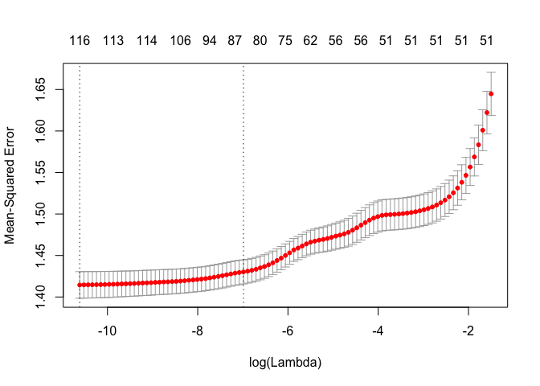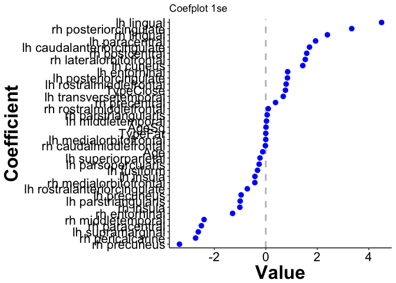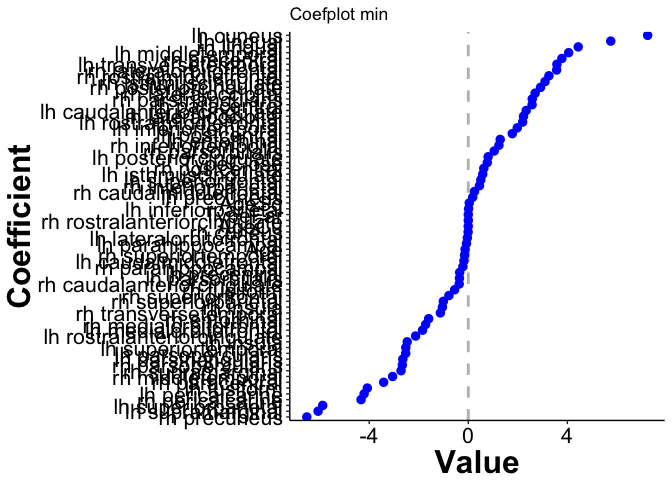

### Rating All: ageCent, Gender, Type, Brain regions

``` r
set.seed(1234)
all2 <- fit_model(data=allRegions, 
                  response='Rating',
                  predictors=c('ID', 'AgeCent', 
                               'Gender', 'Type', regionNames_all),
                  nfolds=10
)
```

We view the coefficient path, error curve and coefplot for both `lambda.1se` and `lambda.min`.

``` r
pathSimple(all2, elementId='all2_mod')
```

<!--html_preserve-->

<script type="application/json" data-for="all2_mod">{"x":{"attrs":{"axes":{"x":{"pixelsPerLabel":60},"y":[]},"labels":["lambda","AgeCent","GenderF","GenderM","TypeClose","TypeFar","lh_caudalanteriorcingulate_thickness","lh_caudalmiddlefrontal_thickness","lh_cuneus_thickness","lh_entorhinal_thickness","lh_fusiform_thickness","lh_inferiorparietal_thickness","lh_inferiortemporal_thickness","lh_isthmuscingulate_thickness","lh_lateraloccipital_thickness","lh_lateralorbitofrontal_thickness","lh_lingual_thickness","lh_medialorbitofrontal_thickness","lh_middletemporal_thickness","lh_parahippocampal_thickness","lh_paracentral_thickness","lh_parsopercularis_thickness","lh_parsorbitalis_thickness","lh_parstriangularis_thickness","lh_pericalcarine_thickness","lh_postcentral_thickness","lh_posteriorcingulate_thickness","lh_precentral_thickness","lh_precuneus_thickness","lh_rostralanteriorcingulate_thickness","lh_rostralmiddlefrontal_thickness","lh_superiorfrontal_thickness","lh_superiorparietal_thickness","lh_superiortemporal_thickness","lh_supramarginal_thickness","lh_transversetemporal_thickness","lh_insula_thickness","rh_caudalanteriorcingulate_thickness","rh_caudalmiddlefrontal_thickness","rh_cuneus_thickness","rh_entorhinal_thickness","rh_fusiform_thickness","rh_inferiorparietal_thickness","rh_inferiortemporal_thickness","rh_isthmuscingulate_thickness","rh_lateraloccipital_thickness","rh_lateralorbitofrontal_thickness","rh_lingual_thickness","rh_medialorbitofrontal_thickness","rh_middletemporal_thickness","rh_parahippocampal_thickness","rh_paracentral_thickness","rh_parsopercularis_thickness","rh_parsorbitalis_thickness","rh_parstriangularis_thickness","rh_pericalcarine_thickness","rh_postcentral_thickness","rh_posteriorcingulate_thickness","rh_precentral_thickness","rh_precuneus_thickness","rh_rostralanteriorcingulate_thickness","rh_rostralmiddlefrontal_thickness","rh_superiorfrontal_thickness","rh_superiorparietal_thickness","rh_superiortemporal_thickness","rh_supramarginal_thickness","rh_transversetemporal_thickness","rh_insula_thickness"],"retainDateWindow":false,"xlabel":"Log Lambda","ylabel":"Coefficients","legend":"onmouseover","labelsDivWidth":250,"labelsShowZeroValues":true,"labelsSeparateLines":false,"showRangeSelector":true,"rangeSelectorHeight":40,"rangeSelectorPlotFillColor":" #A7B1C4","rangeSelectorPlotStrokeColor":"#808FAB","interactionModel":"Dygraph.Interaction.defaultModel","highlightCircleSize":3,"highlightSeriesBackgroundAlpha":0.5,"highlightSeriesOpts":{"strokeWidth":3},"hideOverlayOnMouseOut":true},"annotations":[{"x":-10.7200971168266,"shortText":"AgeCent","text":"AgeCent","width":50,"attachAtBottom":false,"series":"AgeCent"},{"x":-10.7200971168266,"shortText":"GenderF","text":"GenderF","width":50,"attachAtBottom":false,"series":"GenderF"},{"x":-10.7200971168266,"shortText":"GenderM","text":"GenderM","width":50,"attachAtBottom":false,"series":"GenderM"},{"x":-10.7200971168266,"shortText":"TypeClose","text":"TypeClose","width":50,"attachAtBottom":false,"series":"TypeClose"},{"x":-10.7200971168266,"shortText":"TypeFar","text":"TypeFar","width":50,"attachAtBottom":false,"series":"TypeFar"},{"x":-10.7200971168266,"shortText":"lh_caudalanteriorcingulate_thickness","text":"lh_caudalanteriorcingulate_thickness","width":50,"attachAtBottom":false,"series":"lh_caudalanteriorcingulate_thickness"},{"x":-10.7200971168266,"shortText":"lh_caudalmiddlefrontal_thickness","text":"lh_caudalmiddlefrontal_thickness","width":50,"attachAtBottom":false,"series":"lh_caudalmiddlefrontal_thickness"},{"x":-10.7200971168266,"shortText":"lh_cuneus_thickness","text":"lh_cuneus_thickness","width":50,"attachAtBottom":false,"series":"lh_cuneus_thickness"},{"x":-10.7200971168266,"shortText":"lh_entorhinal_thickness","text":"lh_entorhinal_thickness","width":50,"attachAtBottom":false,"series":"lh_entorhinal_thickness"},{"x":-10.7200971168266,"shortText":"lh_fusiform_thickness","text":"lh_fusiform_thickness","width":50,"attachAtBottom":false,"series":"lh_fusiform_thickness"},{"x":-10.7200971168266,"shortText":"lh_inferiorparietal_thickness","text":"lh_inferiorparietal_thickness","width":50,"attachAtBottom":false,"series":"lh_inferiorparietal_thickness"},{"x":-10.7200971168266,"shortText":"lh_inferiortemporal_thickness","text":"lh_inferiortemporal_thickness","width":50,"attachAtBottom":false,"series":"lh_inferiortemporal_thickness"},{"x":-10.7200971168266,"shortText":"lh_isthmuscingulate_thickness","text":"lh_isthmuscingulate_thickness","width":50,"attachAtBottom":false,"series":"lh_isthmuscingulate_thickness"},{"x":-10.7200971168266,"shortText":"lh_lateraloccipital_thickness","text":"lh_lateraloccipital_thickness","width":50,"attachAtBottom":false,"series":"lh_lateraloccipital_thickness"},{"x":-10.7200971168266,"shortText":"lh_lateralorbitofrontal_thickness","text":"lh_lateralorbitofrontal_thickness","width":50,"attachAtBottom":false,"series":"lh_lateralorbitofrontal_thickness"},{"x":-10.7200971168266,"shortText":"lh_lingual_thickness","text":"lh_lingual_thickness","width":50,"attachAtBottom":false,"series":"lh_lingual_thickness"},{"x":-10.7200971168266,"shortText":"lh_medialorbitofrontal_thickness","text":"lh_medialorbitofrontal_thickness","width":50,"attachAtBottom":false,"series":"lh_medialorbitofrontal_thickness"},{"x":-10.7200971168266,"shortText":"lh_middletemporal_thickness","text":"lh_middletemporal_thickness","width":50,"attachAtBottom":false,"series":"lh_middletemporal_thickness"},{"x":-10.7200971168266,"shortText":"lh_parahippocampal_thickness","text":"lh_parahippocampal_thickness","width":50,"attachAtBottom":false,"series":"lh_parahippocampal_thickness"},{"x":-10.7200971168266,"shortText":"lh_paracentral_thickness","text":"lh_paracentral_thickness","width":50,"attachAtBottom":false,"series":"lh_paracentral_thickness"},{"x":-10.7200971168266,"shortText":"lh_parsopercularis_thickness","text":"lh_parsopercularis_thickness","width":50,"attachAtBottom":false,"series":"lh_parsopercularis_thickness"},{"x":-10.7200971168266,"shortText":"lh_parsorbitalis_thickness","text":"lh_parsorbitalis_thickness","width":50,"attachAtBottom":false,"series":"lh_parsorbitalis_thickness"},{"x":-10.7200971168266,"shortText":"lh_parstriangularis_thickness","text":"lh_parstriangularis_thickness","width":50,"attachAtBottom":false,"series":"lh_parstriangularis_thickness"},{"x":-10.7200971168266,"shortText":"lh_pericalcarine_thickness","text":"lh_pericalcarine_thickness","width":50,"attachAtBottom":false,"series":"lh_pericalcarine_thickness"},{"x":-10.7200971168266,"shortText":"lh_postcentral_thickness","text":"lh_postcentral_thickness","width":50,"attachAtBottom":false,"series":"lh_postcentral_thickness"},{"x":-10.7200971168266,"shortText":"lh_posteriorcingulate_thickness","text":"lh_posteriorcingulate_thickness","width":50,"attachAtBottom":false,"series":"lh_posteriorcingulate_thickness"},{"x":-10.7200971168266,"shortText":"lh_precentral_thickness","text":"lh_precentral_thickness","width":50,"attachAtBottom":false,"series":"lh_precentral_thickness"},{"x":-10.7200971168266,"shortText":"lh_precuneus_thickness","text":"lh_precuneus_thickness","width":50,"attachAtBottom":false,"series":"lh_precuneus_thickness"},{"x":-10.7200971168266,"shortText":"lh_rostralanteriorcingulate_thickness","text":"lh_rostralanteriorcingulate_thickness","width":50,"attachAtBottom":false,"series":"lh_rostralanteriorcingulate_thickness"},{"x":-10.7200971168266,"shortText":"lh_rostralmiddlefrontal_thickness","text":"lh_rostralmiddlefrontal_thickness","width":50,"attachAtBottom":false,"series":"lh_rostralmiddlefrontal_thickness"},{"x":-10.7200971168266,"shortText":"lh_superiorfrontal_thickness","text":"lh_superiorfrontal_thickness","width":50,"attachAtBottom":false,"series":"lh_superiorfrontal_thickness"},{"x":-10.7200971168266,"shortText":"lh_superiorparietal_thickness","text":"lh_superiorparietal_thickness","width":50,"attachAtBottom":false,"series":"lh_superiorparietal_thickness"},{"x":-10.7200971168266,"shortText":"lh_superiortemporal_thickness","text":"lh_superiortemporal_thickness","width":50,"attachAtBottom":false,"series":"lh_superiortemporal_thickness"},{"x":-10.7200971168266,"shortText":"lh_supramarginal_thickness","text":"lh_supramarginal_thickness","width":50,"attachAtBottom":false,"series":"lh_supramarginal_thickness"},{"x":-10.7200971168266,"shortText":"lh_transversetemporal_thickness","text":"lh_transversetemporal_thickness","width":50,"attachAtBottom":false,"series":"lh_transversetemporal_thickness"},{"x":-10.7200971168266,"shortText":"lh_insula_thickness","text":"lh_insula_thickness","width":50,"attachAtBottom":false,"series":"lh_insula_thickness"},{"x":-10.7200971168266,"shortText":"rh_caudalanteriorcingulate_thickness","text":"rh_caudalanteriorcingulate_thickness","width":50,"attachAtBottom":false,"series":"rh_caudalanteriorcingulate_thickness"},{"x":-10.7200971168266,"shortText":"rh_caudalmiddlefrontal_thickness","text":"rh_caudalmiddlefrontal_thickness","width":50,"attachAtBottom":false,"series":"rh_caudalmiddlefrontal_thickness"},{"x":-10.7200971168266,"shortText":"rh_cuneus_thickness","text":"rh_cuneus_thickness","width":50,"attachAtBottom":false,"series":"rh_cuneus_thickness"},{"x":-10.7200971168266,"shortText":"rh_entorhinal_thickness","text":"rh_entorhinal_thickness","width":50,"attachAtBottom":false,"series":"rh_entorhinal_thickness"},{"x":-10.7200971168266,"shortText":"rh_fusiform_thickness","text":"rh_fusiform_thickness","width":50,"attachAtBottom":false,"series":"rh_fusiform_thickness"},{"x":-10.7200971168266,"shortText":"rh_inferiorparietal_thickness","text":"rh_inferiorparietal_thickness","width":50,"attachAtBottom":false,"series":"rh_inferiorparietal_thickness"},{"x":-10.7200971168266,"shortText":"rh_inferiortemporal_thickness","text":"rh_inferiortemporal_thickness","width":50,"attachAtBottom":false,"series":"rh_inferiortemporal_thickness"},{"x":-10.7200971168266,"shortText":"rh_isthmuscingulate_thickness","text":"rh_isthmuscingulate_thickness","width":50,"attachAtBottom":false,"series":"rh_isthmuscingulate_thickness"},{"x":-10.7200971168266,"shortText":"rh_lateraloccipital_thickness","text":"rh_lateraloccipital_thickness","width":50,"attachAtBottom":false,"series":"rh_lateraloccipital_thickness"},{"x":-10.7200971168266,"shortText":"rh_lateralorbitofrontal_thickness","text":"rh_lateralorbitofrontal_thickness","width":50,"attachAtBottom":false,"series":"rh_lateralorbitofrontal_thickness"},{"x":-10.7200971168266,"shortText":"rh_lingual_thickness","text":"rh_lingual_thickness","width":50,"attachAtBottom":false,"series":"rh_lingual_thickness"},{"x":-10.7200971168266,"shortText":"rh_medialorbitofrontal_thickness","text":"rh_medialorbitofrontal_thickness","width":50,"attachAtBottom":false,"series":"rh_medialorbitofrontal_thickness"},{"x":-10.7200971168266,"shortText":"rh_middletemporal_thickness","text":"rh_middletemporal_thickness","width":50,"attachAtBottom":false,"series":"rh_middletemporal_thickness"},{"x":-10.7200971168266,"shortText":"rh_parahippocampal_thickness","text":"rh_parahippocampal_thickness","width":50,"attachAtBottom":false,"series":"rh_parahippocampal_thickness"},{"x":-10.7200971168266,"shortText":"rh_paracentral_thickness","text":"rh_paracentral_thickness","width":50,"attachAtBottom":false,"series":"rh_paracentral_thickness"},{"x":-10.7200971168266,"shortText":"rh_parsopercularis_thickness","text":"rh_parsopercularis_thickness","width":50,"attachAtBottom":false,"series":"rh_parsopercularis_thickness"},{"x":-10.7200971168266,"shortText":"rh_parsorbitalis_thickness","text":"rh_parsorbitalis_thickness","width":50,"attachAtBottom":false,"series":"rh_parsorbitalis_thickness"},{"x":-10.7200971168266,"shortText":"rh_parstriangularis_thickness","text":"rh_parstriangularis_thickness","width":50,"attachAtBottom":false,"series":"rh_parstriangularis_thickness"},{"x":-10.7200971168266,"shortText":"rh_pericalcarine_thickness","text":"rh_pericalcarine_thickness","width":50,"attachAtBottom":false,"series":"rh_pericalcarine_thickness"},{"x":-10.7200971168266,"shortText":"rh_postcentral_thickness","text":"rh_postcentral_thickness","width":50,"attachAtBottom":false,"series":"rh_postcentral_thickness"},{"x":-10.7200971168266,"shortText":"rh_posteriorcingulate_thickness","text":"rh_posteriorcingulate_thickness","width":50,"attachAtBottom":false,"series":"rh_posteriorcingulate_thickness"},{"x":-10.7200971168266,"shortText":"rh_precentral_thickness","text":"rh_precentral_thickness","width":50,"attachAtBottom":false,"series":"rh_precentral_thickness"},{"x":-10.7200971168266,"shortText":"rh_precuneus_thickness","text":"rh_precuneus_thickness","width":50,"attachAtBottom":false,"series":"rh_precuneus_thickness"},{"x":-10.7200971168266,"shortText":"rh_rostralanteriorcingulate_thickness","text":"rh_rostralanteriorcingulate_thickness","width":50,"attachAtBottom":false,"series":"rh_rostralanteriorcingulate_thickness"},{"x":-10.7200971168266,"shortText":"rh_rostralmiddlefrontal_thickness","text":"rh_rostralmiddlefrontal_thickness","width":50,"attachAtBottom":false,"series":"rh_rostralmiddlefrontal_thickness"},{"x":-10.7200971168266,"shortText":"rh_superiorfrontal_thickness","text":"rh_superiorfrontal_thickness","width":50,"attachAtBottom":false,"series":"rh_superiorfrontal_thickness"},{"x":-10.7200971168266,"shortText":"rh_superiorparietal_thickness","text":"rh_superiorparietal_thickness","width":50,"attachAtBottom":false,"series":"rh_superiorparietal_thickness"},{"x":-10.7200971168266,"shortText":"rh_superiortemporal_thickness","text":"rh_superiortemporal_thickness","width":50,"attachAtBottom":false,"series":"rh_superiortemporal_thickness"},{"x":-10.7200971168266,"shortText":"rh_supramarginal_thickness","text":"rh_supramarginal_thickness","width":50,"attachAtBottom":false,"series":"rh_supramarginal_thickness"},{"x":-10.7200971168266,"shortText":"rh_transversetemporal_thickness","text":"rh_transversetemporal_thickness","width":50,"attachAtBottom":false,"series":"rh_transversetemporal_thickness"},{"x":-10.7200971168266,"shortText":"rh_insula_thickness","text":"rh_insula_thickness","width":50,"attachAtBottom":false,"series":"rh_insula_thickness"}],"shadings":[],"events":[{"pos":-10.6270633757821,"label":"lambda.min","labelLoc":"bottom","color":"black","strokePattern":[2,2],"axis":"x"},{"pos":-7.1848149571383,"label":"lambda.1se","labelLoc":"bottom","color":"black","strokePattern":[2,2],"axis":"x"}],"format":"numeric","data":[[-10.7200971168266,-10.6270633757821,-10.5340296347377,-10.4409958936933,-10.3479621526489,-10.2549284116044,-10.16189467056,-10.0688609295156,-9.97582718847114,-9.88279344742672,-9.78975970638229,-9.69672596533786,-9.60369222429343,-9.510658483249,-9.41762474220458,-9.32459100116015,-9.23155726011572,-9.13852351907129,-9.04548977802686,-8.95245603698243,-8.85942229593801,-8.76638855489358,-8.67335481384915,-8.58032107280472,-8.48728733176029,-8.39425359071586,-8.30121984967144,-8.20818610862701,-8.11515236758258,-8.02211862653815,-7.92908488549373,-7.8360511444493,-7.74301740340487,-7.64998366236044,-7.55694992131601,-7.46391618027158,-7.37088243922716,-7.27784869818273,-7.1848149571383,-7.09178121609387,-6.99874747504944,-6.90571373400502,-6.81267999296059,-6.71964625191616,-6.62661251087173,-6.5335787698273,-6.44054502878287,-6.34751128773845,-6.25447754669402,-6.16144380564959,-6.06841006460516,-5.97537632356073,-5.88234258251631,-5.78930884147188,-5.69627510042745,-5.60324135938302,-5.51020761833859,-5.41717387729417,-5.32414013624974,-5.23110639520531,-5.13807265416088,-5.04503891311645,-4.95200517207202,-4.8589714310276,-4.76593768998317,-4.67290394893874,-4.57987020789431,-4.48683646684988,-4.39380272580546,-4.30076898476103,-4.2077352437166,-4.11470150267217,-4.02166776162774,-3.92863402058332,-3.83560027953889,-3.74256653849446,-3.64953279745003,-3.5564990564056,-3.46346531536118,-3.37043157431675,-3.27739783327232,-3.18436409222789,-3.09133035118346,-2.99829661013904,-2.90526286909461,-2.81222912805018,-2.71919538700575,-2.62616164596132,-2.53312790491689,-2.44009416387247,-2.34706042282804,-2.25402668178361,-2.16099294073918,-2.06795919969475,-1.97492545865033,-1.8818917176059,-1.78885797656147,-1.69582423551704,-1.60279049447261,-1.50975675342819],[-0.131168024481489,-0.130687892998109,-0.1295313752347,-0.12913572287044,-0.12828536499574,-0.127499386232219,-0.126364612767937,-0.125562904253563,-0.124575456004419,-0.122932553401681,-0.122739972973854,-0.120847257606652,-0.120725474093669,-0.119817545736244,-0.118862455409348,-0.117932334851604,-0.116826161629479,-0.115775058166139,-0.114808769314293,-0.114085749661934,-0.113596778285311,-0.113179662549148,-0.112847575786837,-0.112702284209638,-0.112615818642426,-0.112640572317169,-0.112895994731493,-0.113580908552308,-0.114774945630545,-0.116171608241295,-0.117524892070689,-0.119551033705866,-0.121659394667242,-0.124053050137898,-0.126208089748123,-0.127017921420913,-0.127563797566212,-0.127289818391657,-0.12609038180002,-0.124483583842667,-0.122182055574669,-0.119921909225293,-0.116407990691829,-0.112758723500376,-0.107612349695018,-0.101280663541813,-0.0943133056797536,-0.0869712638606276,-0.0795265214905773,-0.0749739777928991,-0.0666877985275361,-0.0590086498843909,-0.0558912280379034,-0.0529316767653752,-0.0465798599811064,-0.0435798233780557,-0.0400792483191531,-0.0394440483071834,-0.0396908385210304,-0.0400367493243972,-0.0406744573974213,-0.0412819438788824,-0.0418387049636261,-0.0405634615655434,-0.0386836156300723,-0.0363967837607305,-0.0334347995075094,-0.0296479025511604,-0.0248474085334382,-0.0165917763813579,-0.00650040339668355,0,0,0,0,0,0,0,0,0,0,0,0,0,0,0,0,0,0,0,0,0,0,0,0,0,0,0,0,0],[0,0,0,0,0,0,0,0,0,0,0,0,0,0,0,0,0,0,0,0,0,0,0,0,0,0,0,0,0,0,0,0,0,0,0,0,0,0,0,0,0,0,0,0,0,0,0,0,0,0,0,0,0,0,0,0,0,0,0,0,0,0,0,0,0,0,0,0,0,0,0,0,0,0,0,0,0,0,0,0,0,0,0,0,0,0,0,0,0,0,0,0,0,0,0,0,0,0,0,0],[0,0,0,0,0,0,0,0,0,0,0,0,0,0,0,0,0,0,0,0,0,0,0,0,0,0,0,0,0,0,0,0,0,0,0,0,0,0,0,0,0,0,0,0,0,0,0,0,0,0,0,0,0,0,0,0,0,0,0,0,0,0,0,0,0,0,0,0,0,0,0,0,0,0,0,0,0,0,0,0,0,0,0,0,0,0,0,0,0,0,0,0,0,0,0,0,0,0,0,0],[0.76787762319581,0.767871547460513,0.767864872068198,0.767859028109999,0.767851491561194,0.767842868171206,0.767832648869048,0.767822665230813,0.767809993181955,0.767794883725758,0.767780563207779,0.767762797210109,0.767745375947685,0.767725523125455,0.767703151939442,0.767678438343155,0.767651242554857,0.767620575820624,0.767586496602171,0.767548731627307,0.767504803309772,0.767453181090559,0.767401260385763,0.76733728542327,0.767264470553911,0.767182966496669,0.767089785796391,0.766982253203738,0.766848890626602,0.76669935376422,0.766556459632364,0.766403277261384,0.766234793176944,0.766030622089649,0.765782711676355,0.765530360834482,0.765256208160949,0.764954241915708,0.764640302294467,0.764341367867641,0.764063187403373,0.763755105351386,0.763413088717731,0.763060124546526,0.762669398232676,0.762234187053534,0.76177101615945,0.761225658389744,0.760599131433873,0.759966379835465,0.759271354612864,0.758413895222912,0.757545572945869,0.756656816080257,0.755550176538,0.754420388693512,0.753175065536116,0.751752985393678,0.750215394265551,0.748569035773959,0.746757136131715,0.744754051859262,0.742483725567135,0.740025155798158,0.737297701247375,0.734313556425024,0.731034287719974,0.727449244688344,0.72352429691858,0.719105341130117,0.71432645815201,0.709152956053633,0.703620073340511,0.697599104957112,0.690962728670387,0.683668115021472,0.675662285547588,0.666875897583869,0.657232847641234,0.646649612234377,0.63503452444129,0.622286979928244,0.608296565563175,0.592942103069961,0.576090599440164,0.557596095011218,0.537298399233658,0.515021703177217,0.490573056757982,0.463740697497077,0.434292216335374,0.401972544617414,0.366501744808741,0.327572585810899,0.284847881872642,0.237957572048266,0.186495514906742,0.130015970729007,0.0680297406672707,0],[-1.54976773598422e-08,-1.53979948123597e-08,-1.51606978644128e-08,-1.50750028419485e-08,-1.48997681449708e-08,-1.47381323362714e-08,-1.45079583453722e-08,-1.4341074874278e-08,-1.41399430062492e-08,-1.38046698735311e-08,-1.37591499602921e-08,-1.33587526782292e-08,-1.33249832375614e-08,-1.3124890436896e-08,-1.29106692601435e-08,-1.26924768375961e-08,-1.24184414568715e-08,-1.21360678791414e-08,-1.18466679405533e-08,-1.15907895314944e-08,-1.13580451062684e-08,-1.10574343357392e-08,-1.07173856957566e-08,-1.03239795937167e-08,-9.9257926985227e-09,-9.55009503903001e-09,-9.16684571780367e-09,-8.75712750923744e-09,-8.31152102139047e-09,-7.88024714962556e-09,-7.52839822584944e-09,-7.10749937795938e-09,-6.66906808251995e-09,-6.23050725856455e-09,-5.7797399261086e-09,-5.38753693115391e-09,-4.92530067645846e-09,-4.4281377281566e-09,-3.95333759280302e-09,-3.55830301548268e-09,-3.2096660515054e-09,-3.00488906901286e-09,-2.74603327505632e-09,-2.52507066230032e-09,-2.29178515792384e-09,-2.07191228853864e-09,-1.85249241747494e-09,-1.63770076603879e-09,-1.45335014018543e-09,-1.33846980411883e-09,-1.04424377319541e-09,-8.20054251956927e-10,-6.93422309055407e-10,-5.86214153006601e-10,-4.18706475051653e-10,-3.50007395960086e-10,-2.86639378174506e-10,-2.38962220481923e-10,-2.13520212722909e-10,-2.02065654722038e-10,-1.90038488949476e-10,-1.7833615169222e-10,-1.61138116739018e-10,-1.53620910771308e-10,-1.44227963567246e-10,-1.3532784776862e-10,-1.25637873527991e-10,-1.16769252670523e-10,-1.0808610417493e-10,-9.10854914482339e-11,-7.70789131876862e-11,-6.46329572159392e-11,-5.13276088310543e-11,-4.43229827884828e-11,-3.89118496392479e-11,-3.74072904770164e-11,-3.59009584528249e-11,-3.43926307479572e-11,-3.28819586026835e-11,-3.13690195191659e-11,-2.98535228642962e-11,-2.83352555071286e-11,-2.68139074390141e-11,-2.52891880268447e-11,-2.37604966288633e-11,-2.22277751184485e-11,-2.06904422293838e-11,-1.91479941976149e-11,-1.75999660101689e-11,-1.60455051432617e-11,-1.44844565925689e-11,-1.29162003407931e-11,-1.13399613663125e-11,-9.75442213236982e-12,-8.15935013247864e-12,-6.55335032771965e-12,-4.93541518998445e-12,-3.30484719981339e-12,-1.66001881180064e-12,0],[1.9955801985402,1.99686442756335,1.99952947961202,2.00063182602298,2.00272861996422,2.00468499027509,2.00724499780493,2.00912732092733,2.0113960813522,2.01393065595215,2.01448542766153,2.01593041333397,2.01615296714999,2.01649002879342,2.01627534893164,2.01515242519747,2.01243229808619,2.00776431754218,2.00004792965126,1.99022042666975,1.97849647404321,1.95835784011813,1.93531432908611,1.90489256623278,1.87186040375266,1.83808808871147,1.80029980325441,1.75447687188078,1.69655059712812,1.6368435984496,1.59683172069871,1.55901480626104,1.52416097517976,1.49313908095825,1.45435921065611,1.43787841325065,1.43217536423797,1.45782545458941,1.51170221312468,1.55540751524634,1.60113526474036,1.62040515579952,1.63484914087716,1.64368035414746,1.66410913452953,1.69806072194198,1.74669090648484,1.77851980891117,1.78154218935501,1.78573193336776,1.82962737879703,1.79796173533441,1.76123979072561,1.72290097783463,1.66249598468429,1.56625363026878,1.44357016122228,1.32603019041292,1.2553435378152,1.22532722475856,1.18900626805716,1.14667898768798,1.06310655990568,1.00374598350155,0.915039617489544,0.825606957702314,0.726306692466804,0.637245423482249,0.55812227676929,0.432215816360176,0.266496595532239,0.0793720642164588,0,0,0,0,0,0,0,0,0,0,0,0,0,0,0,0,0,0,0,0,0,0,0,0,0,0,0,0],[-0.144869869699986,-0.141999456949978,-0.135052291458907,-0.133446055847453,-0.128641756040154,-0.124280958530379,-0.117989657543027,-0.11410246151502,-0.108918832555201,-0.101175007836034,-0.100863445831217,-0.0916782024416024,-0.0916049490983161,-0.0854358388420203,-0.0784367370246401,-0.071152630602272,-0.0626959883133256,-0.0535258363517266,-0.0428455281197972,-0.0299026134257803,-0.016928669203518,-0.00683257734885642,-0.000332013778881931,-0.000139836035279543,-7.83685055377797e-06,0,0,0,0,0,0,0,0,0,0,0,0,0,0,0,0,0,0,0,0,0,0,0,0,0,0,0,0,0,0,0,0,0,0,0,0,0,0,0,0,0,0,0,0,0,0,0,0,0,0,0,0,0,0,0,0,0,0,0,0,0,0,0,0,0,0,0,0,0,0,0,0,0,0,0],[9.25261517749483,9.22840296372317,9.16950215783242,9.14858984786178,9.10307853654795,9.05977390003091,8.99541358489709,8.94804042467024,8.88730838212564,8.78185178423924,8.76805790497327,8.63477673107534,8.62475943755762,8.55529833834051,8.47768076812912,8.39656005130878,8.2911796570997,8.17853821705569,8.05907634215835,7.95037438065848,7.84856225331096,7.7121644181013,7.5507412962786,7.36127921619517,7.15471852551525,6.94592374629246,6.71742676697403,6.45337165806149,6.1382991879617,5.80445085492628,5.52105719872094,5.16042775165928,4.7636808075197,4.35580430217895,3.9210967974127,3.53729145110361,3.0752343333144,2.56496585093578,2.07505102039073,1.68169424500975,1.34487888659526,1.16419336798926,0.935962327958313,0.755682599379532,0.573115663507793,0.406242549532418,0.251183065521897,0.123991247849534,0.0349341569287282,0.00617382091964674,0,0,0,0,0,0,0,0,0,0,0,0,0,0,0,0,0,0,0,0,0,0,0,0,0,0,0,0,0,0,0,0,0,0,0,0,0,0,0,0,0,0,0,0,0,0,0,0,0,0],[1.26453519244157,1.26056756257144,1.25122924499884,1.24712282672328,1.23985329464177,1.23306181222079,1.22351631006947,1.2159342462184,1.20734418985987,1.1923232606898,1.18947869175621,1.17036709721162,1.16775439577282,1.15833832661481,1.14870941933962,1.13911530807013,1.12733049684225,1.1153137637015,1.10304389099647,1.09258424911184,1.08439591790505,1.07621562074525,1.06906317789081,1.05857808398135,1.04780154459507,1.03717329425503,1.02623354026793,1.01462768515326,1.00416564245288,0.992264627183056,0.98141200016735,0.979100352536077,0.97659101263485,0.970691378823278,0.957470586777231,0.943643310343335,0.931528070091793,0.923238445958673,0.920311348582098,0.920759396414239,0.921098988541319,0.90910624113312,0.890750567529505,0.866255004440232,0.834708792347706,0.794933109337019,0.746480093017742,0.689309257672541,0.639925016565845,0.599897057056621,0.531373610560105,0.474908616682148,0.413007304746588,0.342846738684726,0.216785326879101,0.125409702399467,0.0109966856059145,0,0,0,0,0,0,0,0,0,0,0,0,0,0,0,0,0,0,0,0,0,0,0,0,0,0,0,0,0,0,0,0,0,0,0,0,0,0,0,0,0,0,0],[-4.62917512427855,-4.61806252614871,-4.59132879005926,-4.58106898261352,-4.56112264571327,-4.54262226860224,-4.51612254874261,-4.49628074357934,-4.47271453087862,-4.43099900758032,-4.42484323145657,-4.37176084957717,-4.36680906994423,-4.34137270649947,-4.31433768381289,-4.28665832590242,-4.25082711749847,-4.21172567466948,-4.16852213385391,-4.12769330306077,-4.08974897744371,-4.04022415098701,-3.98040791318131,-3.90500972539354,-3.81885131289677,-3.72666303463523,-3.62171866771,-3.49505277499059,-3.33411023211379,-3.1502195427804,-2.97982344247688,-2.77514276077492,-2.53612918920205,-2.26572641689601,-1.99054501739492,-1.75177769979331,-1.47710872961871,-1.16150523775711,-0.827829931683286,-0.542010499048954,-0.289205085380813,-0.166432966345699,-0.056684871491633,-0.00147214427027763,0,0,0,0,0,0,0,0,0,0,0,0,0,0,0,0,0,0,0,0,0,0,0,0,0,0,0,0,0,0,0,0,0,0,0,0,0,0,0,0,0,0,0,0,0,0,0,0,0,0,0,0,0,0,0,0],[-0.000983738374269504,-0.000974501512896982,-0.000409317331705338,-0.000951824580019613,-0.00094041728676201,-0.000924219402181172,-0.000913926982372996,-0.000883299061181133,-0.00085882038087463,-0.000721229222091765,-0.000757574677343566,-0.000629468390810745,-0.000583910486205008,-0.000491397157311211,-0.000395116842725038,-0.000292749232215468,-0.000173141668339646,-4.02260981415035e-05,0,0,0,0,0,0,0,0,0,0,0,0,0,0,0,0,0,0,0,0,0,0,0,0,0,0,0,0,0,0,0,0,0,0,0,0,0,0,0,0,0,0,0,0,0,0,0,0,0,0,0,0,0,0,0,0,0,0,0,0,0,0,0,0,0,0,0,0,0,0,0,0,0,0,0,0,0,0,0,0,0,0],[1.26427198769266,1.25603133925425,1.23555803621852,1.22975883176923,1.21487574994869,1.20094932297006,1.17974234217783,1.16563949423107,1.14649549630197,1.11302970631961,1.11017129543217,1.06834606206275,1.06662545277617,1.04477521822598,1.01986837913982,0.994102956466531,0.961412853020906,0.926534561084465,0.889804798408381,0.855063437741654,0.821858108699135,0.779404053821906,0.732479757016574,0.675525917864426,0.619616965544193,0.569589609922859,0.522789534125462,0.477820208469624,0.434448684526338,0.39321903551392,0.352412081126433,0.297332603851802,0.235609650875781,0.161581750996048,0.0840708686004586,0.027549083006891,9.03392663416014e-05,0,0,0,0,0,0,0,0,0,0,0,0,0,0,0,0,0,0,0,0,0,0,0,0,0,0,0,0,0,0,0,0,0,0,0,0,0,0,0,0,0,0,0,0,0,0,0,0,0,0,0,0,0,0,0,0,0,0,0,0,0,0,0],[0,0,0,0,0,0,0,0,0,0,0,0,0,0,0,0,0,0,0,0,0,0,0,0,0,0,0,0,-0.00895249880696149,-0.0235978670660554,-0.0362935553142868,-0.0559369907982083,-0.083453413074286,-0.116328992190633,-0.130632645170415,-0.125541915248843,-0.110556550974963,-0.0927749437709081,-0.076331102808455,-0.0880195088757889,-0.122165234990591,-0.152008799897321,-0.202804686023786,-0.238146103760986,-0.248623723739576,-0.229576996808266,-0.195962172036079,-0.143776377590278,-0.0708628158688795,-0.00706039643252127,0,0,0,0,0,0,0,0,0,0,0,0,0,0,0,0,0,0,0,0,0,0,0,0,0,0,0,0,0,0,0,0,0,0,0,0,0,0,0,0,0,0,0,0,0,0,0,0,0,0],[2.04070788032595,2.02306264200709,1.98004758043919,1.9625880350817,1.92904371953677,1.89731823478136,1.8514912927985,1.81566234234402,1.77329823062045,1.69845692802785,1.68628809982961,1.59106712894053,1.58063687229278,1.53321376107405,1.48309944535761,1.4314578783801,1.36509895702554,1.29410471816211,1.21811675500419,1.14763393799865,1.08305181698554,1.00098590201107,0.909840539287114,0.802594100749172,0.68922606669443,0.578420995238005,0.463888351130552,0.34275601490839,0.211053357313996,0.0886613983500778,0,0,0,0,0,0,0,0,0,0,0,0,0,0,0,0,0,0,0,0,0,0,0,0,0,0,0,0,0,0,0,0,0,0,0,0,0,0,0,0,0,0,0,0,0,0,0,0,0,0,0,0,0,0,0,0,0,0,0,0,0,0,0,0,0,0,0,0,0,0],[-0.000770858328973797,-0.00260311418995219,-0.00619463027536594,-0.00897930590630067,-0.0119696901165615,-0.0146070023539712,-0.0171127729092663,-0.0202220841154755,-0.0219935288993706,-0.0232255706579185,-0.0252112220753594,-0.0242955211854938,-0.0264351903922628,-0.0251262370789596,-0.0224089438863771,-0.0196275311496669,-0.0161717141084248,-0.01214437311363,-0.00790700672414512,-0.00389361165550013,-0.000890975881634661,-0.000755157400992215,-0.000485029863850914,-0.000306789208220469,-9.76173263218481e-05,0,0,0,0,0,0,0,0,0,0,0,0,0,0,0,0,0.0104882982893542,0.0697405392553487,0.112486180549114,0.167613979662519,0.211173076753564,0.248282418985229,0.246277079965775,0.188966822646116,0.14516895241249,0.151947702911697,0.0759179915045793,0,0,0,0,0,0,0,0,0,0,0,0,0,0,0,0,0,0,0,0,0,0,0,0,0,0,0,0,0,0,0,0,0,0,0,0,0,0,0,0,0,0,0,0,0,0,0,0],[3.9607935713136,3.96173578867284,3.96476916955357,3.96405681779991,3.96555331811337,3.9669197133307,3.9700443273093,3.97046744474237,3.97293700190114,3.97746892655494,3.97586363329455,3.97969455629807,3.97727895030613,3.97848771131597,3.98119200858197,3.98488062179665,3.99096165673234,3.99836439494788,4.00714200154043,4.01555078354214,4.02411140717579,4.03818799469491,4.05836269963344,4.08204526893753,4.10497067961666,4.12622643114143,4.14713091864328,4.16451522174137,4.17856560278439,4.18855126159403,4.1882420403798,4.17749398142233,4.16730796800168,4.15439074967891,4.15807232802487,4.1684651355823,4.21367643129497,4.29241748933445,4.38125074626703,4.42374807212617,4.41724137914411,4.37436973519005,4.31205144263211,4.24651588032903,4.16192911990193,4.07031741482665,3.9557841345233,3.8060064131536,3.64790723130272,3.50548593506889,3.16165450250399,2.85026913158013,2.65857446195514,2.50113170692846,2.00826144797728,1.63565144932238,1.22004949621952,0.844074616073465,0.571233097452862,0.4202971030073,0.248446118313732,0.0788979671728596,0,0,0,0,0,0,0,0,0,0,0,0,0,0,0,0,0,0,0,0,0,0,0,0,0,0,0,0,0,0,0,0,0,0,0,0,0,0],[-2.37536050686883,-2.36165224459402,-2.32858941218424,-2.31574380449564,-2.29057583632677,-2.26708962542039,-2.23352369447232,-2.20800607915073,-2.17788030465399,-2.12627955567906,-2.11839943474271,-2.05457578466999,-2.04814468915565,-2.01571104484476,-1.9811319717015,-1.9457852629062,-1.90109896083957,-1.85307416456916,-1.80136136485197,-1.7526740883373,-1.70642016083052,-1.644547631261,-1.57354941796218,-1.4955217171845,-1.41209564754679,-1.32878223237266,-1.24006772367377,-1.14262829187181,-1.03685717980343,-0.934752533874173,-0.848954193257927,-0.756202548246527,-0.659144131578931,-0.559169696049908,-0.445736551025704,-0.344612707461003,-0.242325339384319,-0.147357267928025,-0.0689747030563694,-0.0165275850015922,0,0,0,0,0,0,0,0,0,0,0,0,0,0,0,0,0,0,0,0,0,0,0,0,0,0,0,0,0,0,0,0,0,0,0,0,0,0,0,0,0,0,0,0,0,0,0,0,0,0,0,0,0,0,0,0,0,0,0,0],[5.04812839904443,5.02881374727814,4.9818276713602,4.96425974938528,4.92845475213071,4.89480102654063,4.84578140006428,4.80898798226675,4.76409153498131,4.68569664453121,4.67445948061094,4.57635468864501,4.56740756767173,4.51794361102982,4.46459645114996,4.40969430956581,4.33910423921637,4.26207690955725,4.1782607136032,4.10012377865544,4.02727447387477,3.93312604014231,3.82477776879245,3.69555082808519,3.55720821343819,3.41926759769949,3.27065509473839,3.10204190079274,2.90626399011993,2.70045910119239,2.52840117405417,2.33006533882416,2.11137072043053,1.88172632797048,1.62466350688881,1.38256913331087,1.09052103849329,0.757140983474191,0.427816662023505,0.182205142450415,0.0122593040059879,0,0,0,0,0,0,0,0,0,0,0,0,0,0,0,0,0,0,0,0,0,0,0,0,0,0,0,0,0,0,0,0,0,0,0,0,0,0,0,0,0,0,0,0,0,0,0,0,0,0,0,0,0,0,0,0,0,0,0],[-1.0189142566292,-1.01384612847809,-1.00171099338008,-0.996639953822083,-0.987087570997407,-0.978057904334468,-0.965076601910586,-0.954800324063925,-0.942644780517782,-0.920881987686442,-0.917077937260375,-0.887282835384546,-0.883643389789744,-0.8669023370412,-0.848205933251832,-0.828311588659231,-0.802284725127134,-0.77367692921539,-0.741774925596503,-0.710811877958742,-0.6810711920264,-0.642011857297829,-0.595902554453819,-0.538970818520498,-0.480082447429252,-0.423560705967503,-0.365960215820941,-0.306172290443765,-0.246000588213805,-0.18426740805847,-0.128481521869287,-0.0694072126884641,-0.019373806068783,0,0,0,0,0,0,0,0,0,0,0,0,0,0,0,0,0,0,0,0,0,0,0,0,0,0,0,0,0,0,0,0,0,0,0,0,0,0,0,0,0,0,0,0,0,0,0,0,0,0,0,0,0,0,0,0,0,0,0,0,0,0,0,0,0,0,0],[2.41541227182552,2.41193652729765,2.40240286262106,2.39825922004303,2.39099063788959,2.38414371162944,2.37404132906889,2.36547955700544,2.35634403677484,2.33744203058507,2.33433841924082,2.31080029908245,2.30812181838607,2.30013208050216,2.29373615013044,2.28788379747599,2.28141386448024,2.27478080346324,2.26813652448293,2.26219490005822,2.25767803065288,2.25695572161719,2.25762054285604,2.26725557245927,2.27783706086466,2.28945776305129,2.30430973101589,2.32474880973089,2.35504114418021,2.38875961345579,2.4041607247323,2.41209368748936,2.4257230016367,2.45090435788871,2.47496232385089,2.47598131723185,2.45678480329492,2.40356604386619,2.29992443752494,2.18295113583664,2.05387577135107,1.97521464289201,1.9015148635935,1.85106257783649,1.8011459834501,1.73348097884405,1.63997674521171,1.47196120637356,1.26481599300088,1.16736366743573,0.977213469874165,0.762712406419789,0.491761432257368,0.20010605743742,0,0,0,0,0,0,0,0,0,0,0,0,0,0,0,0,0,0,0,0,0,0,0,0,0,0,0,0,0,0,0,0,0,0,0,0,0,0,0,0,0,0,0,0,0,0],[-2.10033319052579,-2.10734155434243,-2.12343469468867,-2.12874935830411,-2.14044197900718,-2.15109594646968,-2.16593782750346,-2.17582319441921,-2.18821331406746,-2.20581523811454,-2.20774940395941,-2.22601318357785,-2.22704408550322,-2.23696017984377,-2.24773618140889,-2.2582347992523,-2.27077777106377,-2.28209078166976,-2.29108276892401,-2.29595288073749,-2.29840282701098,-2.29989171871301,-2.29956492115798,-2.30027509642243,-2.29480200396183,-2.2817968862871,-2.26019734383474,-2.22675360873975,-2.17616171175297,-2.10289264061139,-2.02576451065309,-1.91871879511127,-1.79276069545153,-1.65211297213533,-1.48282934725358,-1.32760978655424,-1.14634419232555,-0.947222167966388,-0.751973445881899,-0.585552922970747,-0.403761496686436,-0.281103678160814,-0.152727708259264,-0.0486644004280499,0,0,0,0,0,0,0,0,0,0,0,0,0,0,0,0,0,0,0,0,0,0,0,0,0,0,0,0,0,0,0,0,0,0,0,0,0,0,0,0,0,0,0,0,0,0,0,0,0,0,0,0,0,0,0,0],[-1.32918681851256,-1.31948381526232,-1.29600129217148,-1.28754566827394,-1.26995384506514,-1.25355456290451,-1.22981459234071,-1.21240115331747,-1.19111159906381,-1.15455223334233,-1.14963036671133,-1.10534448397692,-1.10160141070058,-1.07996063503837,-1.05676794578264,-1.03322568379197,-1.0036377609703,-0.973224019192907,-0.941922335509189,-0.913990679790372,-0.888114687936444,-0.851766468539152,-0.808498420186494,-0.756196425748676,-0.698361844525595,-0.639480567843386,-0.577077176208403,-0.510146024196591,-0.435652845241384,-0.368319476497677,-0.320593282651251,-0.270940178200244,-0.225416719167735,-0.187447553379161,-0.154606153953874,-0.130402779860047,-0.101441995841172,-0.0768750849017804,-0.0559003259310581,-0.0159956265947588,0,0,0,0,0,0,0,0,0,0,0,0,0,0,0,0,0,0,0,0,0,0,0,0,0,0,0,0,0,0,0,0,0,0,0,0,0,0,0,0,0,0,0,0,0,0,0,0,0,0,0,0,0,0,0,0,0,0,0,0],[-1.24696345527318,-1.25453527858839,-1.27321608595374,-1.27962537251689,-1.29357984514989,-1.3066673316075,-1.32595617140117,-1.33967515135995,-1.35683260101051,-1.38606701530636,-1.38940113952859,-1.42286348793059,-1.42481515611846,-1.44006783540035,-1.45631561820333,-1.47294600885688,-1.49340954877732,-1.51330106692247,-1.53231069567763,-1.54819682453814,-1.56323805204777,-1.58336215072935,-1.60614956100427,-1.63414751907717,-1.66631055309754,-1.70060909457166,-1.73990106757676,-1.78571210209231,-1.83404076946267,-1.86847523245876,-1.89105777456221,-1.92256691253804,-1.94056831494992,-1.93075982882676,-1.88948702385787,-1.82904220382301,-1.75144218078909,-1.64103163991484,-1.48280610729044,-1.3014034753531,-1.10372471803962,-0.997257240185331,-0.881391858246699,-0.763507152789746,-0.60141822830587,-0.427451747674318,-0.255777741246398,-0.135036546197554,-0.0293417622750414,0,0,0,0,0,0,0,0,0,0,0,0,0,0,0,0,0,0,0,0,0,0,0,0,0,0,0,0,0,0,0,0,0,0,0,0,0,0,0,0,0,0,0,0,0,0,0,0,0,0,0],[-5.26020368806375,-5.23608053532824,-5.17593805237699,-5.15402168083119,-5.10809845097285,-5.06474630966808,-5.00048847630509,-4.9524303147949,-4.89323986700476,-4.78707616070358,-4.77279028722969,-4.63983713903033,-4.62867894966733,-4.56412647313138,-4.49532802391493,-4.42533757492342,-4.33720163695017,-4.24496244473599,-4.14977104914445,-4.06622577919058,-3.99181981968171,-3.90007794928512,-3.79674443052321,-3.67415093879774,-3.5386349229937,-3.40006844500533,-3.24799531375578,-3.07235413563731,-2.86707433262753,-2.66089441551312,-2.49194129031265,-2.29948080241596,-2.08012561189648,-1.83999331473731,-1.5681187543483,-1.32657570053916,-1.0410209088034,-0.740977414056942,-0.459541772707812,-0.235729543902109,-0.055710557603292,0,0,0,0,0,0,0,0,0,0,0,0,0,0,0,0,0,0,0,0,0,0,0,0,0,0,0,0,0,0,0,0,0,0,0,0,0,0,0,0,0,0,0,0,0,0,0,0,0,0,0,0,0,0,0,0,0,0,0],[3.35533579563567,3.33831234208381,3.29681041340423,3.28198684272766,3.25057767891945,3.22110535080698,3.17791700735047,3.14629677590353,3.10698200140864,3.03880322671336,3.02994248024426,2.94433954934804,2.9375995611023,2.89280358766247,2.84350481631094,2.79283805769966,2.72878617690206,2.66220875315741,2.59336133281185,2.53190913016471,2.47510166710033,2.39952653415035,2.31087867840567,2.1997346540316,2.07786310307898,1.9527491341872,1.81420869354436,1.65312780605917,1.46497365427135,1.27970044590443,1.13414887083447,0.969836554915616,0.793547666635372,0.603974248155226,0.397757636230278,0.238416560922066,0.0899856295322142,3.4293762181278e-05,0,0,0,0,0,0,0,0,0,0,0,0,0,0,0,0,0,0,0,0,0,0,0,0,0,0,0,0,0,0,0,0,0,0,0,0,0,0,0,0,0,0,0,0,0,0,0,0,0,0,0,0,0,0,0,0,0,0,0,0,0,0],[1.40598486569379,1.40451682396955,1.40096048475947,1.3982721989111,1.39500665494928,1.39187360725854,1.38771452340376,1.38302338488735,1.37860910268966,1.36872976833633,1.3657230476976,1.34974767391859,1.34634076184959,1.33788553712453,1.32950024175512,1.32066782945119,1.30882133988973,1.29584306966339,1.28104110673239,1.26783993513698,1.25745499393439,1.24230922210979,1.22450121859943,1.2069528242686,1.18705078401956,1.16625533159369,1.14522197444806,1.12523902907867,1.11561808107469,1.11632902263562,1.11449717075791,1.13099487351225,1.12978960787606,1.11048650480485,1.08399435013166,1.05347874387401,1.0185371471748,0.980245558105794,0.952530278409209,0.953522805867937,0.932973567921767,0.872571232211876,0.802743063049783,0.737825964641571,0.676643723218342,0.598500809396336,0.495921234330175,0.400628581606316,0.321924248031389,0.237478133315907,0.0686859663006861,0,0,0,0,0,0,0,0,0,0,0,0,0,0,0,0,0,0,0,0,0,0,0,0,0,0,0,0,0,0,0,0,0,0,0,0,0,0,0,0,0,0,0,0,0,0,0,0,0],[-0.44540061514222,-0.434095324266715,-0.407078510941126,-0.398314496529712,-0.37842436950766,-0.359978290948537,-0.333117430202697,-0.314595483743837,-0.290802576075007,-0.250786349236024,-0.246216775174072,-0.195837286743052,-0.192465326599345,-0.165082981145134,-0.134733689254677,-0.104813515512632,-0.0695661208106073,-0.036759893469849,-0.0106887471636162,-0.00054924170491002,-0.000103676681233756,0,0,0,0,0,0,0,0,0,0,0,0,0,0,0,0,0,0,0,0,0,0,0,0,0,0,0,0,0,0,0,0,0,0,0,0,0,0,0,0,0,0,0,0,0,0,0,0,0,0,0,0,0,0,0,0,0,0,0,0,0,0,0,0,0,0,0,0,0,0,0,0,0,0,0,0,0,0,0],[0.0616854389710512,0.0565566570627389,0.0444399781910287,0.0408928590924091,0.0330152050566472,0.0262393513432299,0.0171828561361908,0.0120259082974175,0.00650439896331828,0.000339300100333502,0.000389300645048782,0.000100230558996673,4.87090482841696e-05,0,0,0,0,0,0,0,0,0,0,-0.0602751339597763,-0.120689103191381,-0.174596069259656,-0.227694981184646,-0.282772700267409,-0.344574241897894,-0.407863953535339,-0.457306022340845,-0.532798903278937,-0.596159232971405,-0.637539471642572,-0.670265087753664,-0.675896914816474,-0.69701558498973,-0.731179939352779,-0.779288614620966,-0.83200493833108,-0.838714391548358,-0.797814164967605,-0.722015650544915,-0.632143006366612,-0.558127590407143,-0.480233104537676,-0.386920582683952,-0.266188913643735,-0.0854534220411069,-0.00777238948542378,0,0,0,0,0,0,0,0,0,0,0,0,0,0,0,0,0,0,0,0,0,0,0,0,0,0,0,0,0,0,0,0,0,0,0,0,0,0,0,0,0,0,0,0,0,0,0,0,0,0],[-1.77911221880437,-1.77551017876043,-1.76674075100637,-1.76368204511722,-1.75685028846294,-1.75034320487318,-1.74074329239632,-1.73362078773147,-1.72454527140312,-1.70898191915864,-1.70678194352715,-1.68685446881614,-1.68496797790754,-1.67410691534669,-1.66202396512546,-1.64949040278226,-1.633522053889,-1.61619873726392,-1.59726193607827,-1.57907480972857,-1.56135767487418,-1.53563073443869,-1.50289039049642,-1.46137100615442,-1.41881946863299,-1.37852703626411,-1.33810747142276,-1.29603151653731,-1.24945308663354,-1.20450757249285,-1.16680227230646,-1.12392754839653,-1.07233500204338,-1.01488214557455,-0.956043584240772,-0.904732404765955,-0.848854809852058,-0.786305805109497,-0.722500322443979,-0.674619659526903,-0.641689573804832,-0.635616598043226,-0.650675633252677,-0.658521627860682,-0.6529079605789,-0.636690476896535,-0.622416879863192,-0.611503342998183,-0.577925301755113,-0.547550829052645,-0.550772650105321,-0.49889481605668,-0.429278044854487,-0.396141838931432,-0.36797548772529,-0.285694138407983,-0.18969087327947,-0.121527199020957,-0.00051523499697169,0,0,0,0,0,0,0,0,0,0,0,0,0,0,0,0,0,0,0,0,0,0,0,0,0,0,0,0,0,0,0,0,0,0,0,0,0,0,0,0,0],[2.47588906053105,2.47379989567737,2.46923589026571,2.46878514288326,2.46601681747096,2.46364376882257,2.4601084008765,2.45913133254479,2.45665534278236,2.45403790789761,2.45501243938002,2.45215592509976,2.45352427639536,2.4499141727099,2.44423968065304,2.43837232409673,2.43077607635111,2.42142486229549,2.41027675641664,2.39912553037927,2.38960083122303,2.38108235065502,2.36537752428218,2.35787496827848,2.35042587304111,2.34303856253501,2.33605048695423,2.32763183835529,2.31467683565755,2.29048205686053,2.26309794731876,2.22203667030243,2.16759410841502,2.09770039543771,2.00395962542272,1.90212797171359,1.76027935618613,1.57275540280077,1.33681964683527,1.09104249121196,0.857678900890674,0.707806199169165,0.548089315349989,0.418872690458647,0.288370353054467,0.155966253803695,0.0297962208955237,0,0,0,0,0,0,0,0,0,0,0,0,0,0,0,0,0,0,0,0,0,0,0,0,0,0,0,0,0,0,0,0,0,0,0,0,0,0,0,0,0,0,0,0,0,0,0,0,0,0,0,0,0],[0.195811550517274,0.189101183471891,0.174366390058223,0.168508928269947,0.157485303072038,0.147481161661358,0.134162586688313,0.124362050984323,0.112965538188426,0.0963415073969691,0.09338994507231,0.0735445783543271,0.0712197652639431,0.0589872545190838,0.0461004026866738,0.0343208597353113,0.0217451168221376,0.0112601142457064,0.00369164906535304,0,0,0,0,0,0,0,0,0.0117565900545563,0.0292762515779464,0.0432767363513843,0.0461300703546246,0.0471422913998114,0.0479007814090739,0.0451907561571473,0.0350090377480232,0,0,0,0,0,0,0,0,0,0,0,0,0,0,0,0,0,0,0,0,0,0,0,0,0,0,0,0,0,0,0,0,0,0,0,0,0,0,0,0,0,0,0,0,0,0,0,0,0,0,0,0,0,0,0,0,0,0,0,0,0,0,0,0,0],[-3.43393382718674,-3.42393259222871,-3.39917450249816,-3.39081025490674,-3.37247463193248,-3.35530213676214,-3.32982063092934,-3.31189450067776,-3.28944699224728,-3.25080428240324,-3.24653027170799,-3.20339794369386,-3.20091718483784,-3.18294941847465,-3.16416447632308,-3.14578523212379,-3.12305903918588,-3.09860981442383,-3.07228669680009,-3.04887804386073,-3.02974144176126,-3.00729861191114,-2.98201968077174,-2.93489222387345,-2.88521480561868,-2.83803778782632,-2.79144867483717,-2.75140928501898,-2.70966309855692,-2.65911209944083,-2.61481982474605,-2.55545902394502,-2.47275130955398,-2.37350812444376,-2.22874562272681,-2.03930799138268,-1.76767083015397,-1.40071852881063,-0.979980469803233,-0.590631167084431,-0.274152247831018,-0.117555678116604,-0.000199493861665734,0,0,0,0,0,0,0,0,0,0,0,0,0,0,0,0,0,0,0,0,0,0,0,0,0,0,0,0,0,0,0,0,0,0,0,0,0,0,0,0,0,0,0,0,0,0,0,0,0,0,0,0,0,0,0,0,0],[-0.793908337543106,-0.773334048441451,-0.722729173210183,-0.705333118650343,-0.66794133549842,-0.633206314319546,-0.582499024848039,-0.546295347311665,-0.50193059152662,-0.426135770670764,-0.417160356836775,-0.328785835886593,-0.322926801506899,-0.282456416487466,-0.240632886464919,-0.199811700287242,-0.151369709655606,-0.105295955534462,-0.0636003575279758,-0.0329002110343633,-0.0125452916687502,-0.00057962156822229,-0.000127322625353758,0,0,0,0,0,0,0,0,0,0,0,0,0,0,0,0,0,0,0,0,0,0,0,0,0,0,0,0,0,0,0,0,0,0,0,0,0,0,0,0,0,0,0,0,0,0,0,0,0,0,0,0,0,0,0,0,0,0,0,0,0,0,0,0,0,0,0,0,0,0,0,0,0,0,0,0,0],[-8.27007552613905,-8.24990820761552,-8.20058024244478,-8.18128189045058,-8.14279137834594,-8.10635516095892,-8.05323771794452,-8.01232093845475,-7.96281475955454,-7.87537613172876,-7.86207870376066,-7.74789074146426,-7.73658660837956,-7.67556476360402,-7.60835544654838,-7.53740632183608,-7.44429060635934,-7.34255717584284,-7.23130695291196,-7.12630416771808,-7.02490888521499,-6.88511713327594,-6.7094467413058,-6.48453098163633,-6.24380082470446,-6.00493341108016,-5.74944845969102,-5.46487011339986,-5.14389048720861,-4.8243468133416,-4.56098635686752,-4.25278446983407,-3.94249767200944,-3.65118467391217,-3.38162764822783,-3.18218361005218,-2.9841542812742,-2.8195143280103,-2.71337173014832,-2.6505361274103,-2.57739948075082,-2.50106856824867,-2.37779233410475,-2.23811249617264,-2.07574406999444,-1.9119245065276,-1.72811528865809,-1.54589865503543,-1.37723796841723,-1.22773876872226,-0.816985432277095,-0.503329209103731,-0.274967918331795,-0.0963518038421103,0,0,0,0,0,0,0,0,0,0,0,0,0,0,0,0,0,0,0,0,0,0,0,0,0,0,0,0,0,0,0,0,0,0,0,0,0,0,0,0,0,0,0,0,0,0],[2.73348853566429,2.71640321197576,2.67432199390704,2.65952382456295,2.6280315600676,2.59859961648737,2.55547369484201,2.52407300843934,2.48549082662129,2.41819345253976,2.40981062238395,2.3277663273867,2.32171123596826,2.2819586796394,2.23955249269644,2.19650822017477,2.14279605787579,2.0872578746259,2.03032856152068,1.98001017900455,1.9358748890345,1.88516317699721,1.83048601209521,1.76552927458114,1.69797996400156,1.63174859522291,1.56253148210598,1.48811885144124,1.40985631222533,1.33220162688844,1.27213747346517,1.21948416906936,1.16272611008394,1.10417505114137,1.02940256211809,0.953312735142428,0.863141088414364,0.761590350057511,0.662662952119296,0.595077994388852,0.555985742058701,0.544240488801357,0.540828213246219,0.530477152444478,0.509957885450329,0.47049956608053,0.415102537779172,0.346434285779195,0.288319134574716,0.244443088070844,0.154642876771518,0.0714320572504413,0.00411816024864098,0,0,0,0,0,0,0,0,0,0,0,0,0,0,0,0,0,0,0,0,0,0,0,0,0,0,0,0,0,0,0,0,0,0,0,0,0,0,0,0,0,0,0,0,0,0,0],[-1.85880257617401,-1.84496215102213,-1.81112898637362,-1.79751000016829,-1.77164689259612,-1.74744739522587,-1.71272008730092,-1.68565476734798,-1.65431704417708,-1.59831888450523,-1.58936334839984,-1.51863218805234,-1.51076963256887,-1.47666720531535,-1.44115510041941,-1.4042191557105,-1.35699680124449,-1.3084520562852,-1.2589698419523,-1.21605029694662,-1.17828348655965,-1.12843036965322,-1.06992305116948,-0.993080209294545,-0.914215507994369,-0.840695567910561,-0.769837709273158,-0.703255014662176,-0.647579623452427,-0.614736133272612,-0.59285436159124,-0.583748467751009,-0.582303811498145,-0.595306527889209,-0.611714322047365,-0.618799471775644,-0.607598615502763,-0.582682727291459,-0.540323187194477,-0.476953094047228,-0.425840438225166,-0.389906319406756,-0.363776043417053,-0.339627154092014,-0.317434459837559,-0.307432240436459,-0.314548124805766,-0.336881117968324,-0.329204437599164,-0.280537096917163,-0.233329002830841,-0.0225340222544631,0,0,0,0,0,0,0,0,0,0,0,0,0,0,0,0,0,0,0,0,0,0,0,0,0,0,0,0,0,0,0,0,0,0,0,0,0,0,0,0,0,0,0,0,0,0,0,0],[-0.460947762466808,-0.45819809959,-0.4513851733862,-0.448800297300908,-0.443698402977486,-0.438979760134295,-0.432202410428208,-0.427113527538548,-0.421233598910033,-0.410767572408445,-0.409153750584085,-0.395345558202189,-0.393837359133287,-0.386424265389408,-0.378510046641878,-0.370525879183925,-0.36070281496848,-0.349998153921661,-0.338196815915214,-0.326922617119839,-0.316626900591648,-0.304543388523218,-0.290348762149639,-0.273750251269149,-0.255884337389947,-0.237408271527577,-0.217461779882743,-0.194166049617076,-0.161564095064469,-0.120004691671099,-0.0817744440972136,-0.0382629169642559,0,0,0,0,0,0,0,0,0,0,0,0,0,0,0,0,0,0,0,0,0,0,0,0,0,0,0,0,0,0,0,0,0,0,0,0,0,0,0,0,0,0,0,0,0,0,0,0,0,0,0,0,0,0,0,0,0,0,0,0,0,0,0,0,0,0,0,0],[0.156604535227975,0.150527566985255,0.135993890838848,0.129556346662252,0.11824564529767,0.107647718909414,0.0932457891589413,0.0812966262691983,0.0686023223625988,0.048162037788026,0.0440461077990439,0.0232820470230558,0.0202001899956693,0.0116330313555779,0.00452751722870519,7.34903231450664e-05,0,0,0,0,0,0,0,0,0,0,0,0,0,0,0,0,0,0,0,0,0,0,0,0,0,0,0,0,0,0,0,0,0,0,0,0,0,0,0,0,0,0,0,0,0,0,0,0,0,0,0,0,0,0,0,0,0,0,0,0,0,0,0,0,0,0,0,0,0,0,0,0,0,0,0,0,0,0,0,0,0,0,0,0],[1.06747889792512,1.05200277154757,1.01439213544406,1.00007409189816,0.971272836292991,0.944269596996619,0.905176552309731,0.875852830465566,0.84045970961215,0.779435146229169,0.770690058397812,0.694830791892997,0.687944897673646,0.648911277720131,0.606822217080261,0.563801700529659,0.509126038350675,0.451360454693781,0.392117691140154,0.340436325464444,0.295749338541367,0.244928843220097,0.194189175600718,0.14195956558381,0.0924460649166764,0.0499768700488155,0.0158775303063431,0.000202914745771903,0,0,0,0,0,0,0,0,0,0,0,0,0,0,0,0,0,0,0,0,0,0,0,0,0,0,0,0,0,0,0,0,0,0,0,0,0,0,0,0,0,0,0,0,0,0,0,0,0,0,0,0,0,0,0,0,0,0,0,0,0,0,0,0,0,0,0,0,0,0,0,0],[-1.49442993782448,-1.49130957669949,-1.48328665739554,-1.4799297717631,-1.47385491362215,-1.46822495110638,-1.46015323525304,-1.45358462123328,-1.44646482421057,-1.43265702772143,-1.43038068186487,-1.41160376462223,-1.40938853221093,-1.40046160372921,-1.39153270113086,-1.38233864372684,-1.37062741957981,-1.35806652092688,-1.34446068260919,-1.33131600051568,-1.31908649754101,-1.30415647945376,-1.28674004812023,-1.26458343347376,-1.24345966621679,-1.22521042613692,-1.20977085032447,-1.19844908069878,-1.19276713760372,-1.19102389489621,-1.1886892900695,-1.19301083564261,-1.19505353238311,-1.19556839538003,-1.19906942842369,-1.20274786652318,-1.21125324622301,-1.22371662432997,-1.23802400562282,-1.24426977538696,-1.24191969886007,-1.24486774087669,-1.25605705243672,-1.26705825912204,-1.27479328953593,-1.27781890440087,-1.27715109077838,-1.26942235171939,-1.25057392764487,-1.22415958646427,-1.18201407727923,-1.12531073663921,-1.07554594711918,-1.02282707753711,-0.940852929276651,-0.8830148373067,-0.821464445710861,-0.785604548997272,-0.718231351716347,-0.667632944100041,-0.61252886798895,-0.560786197159478,-0.502505601049121,-0.452635269061077,-0.398203452291676,-0.339403071185916,-0.272737022188942,-0.198090684397602,-0.118612460354532,-0.0235820900016405,0,0,0,0,0,0,0,0,0,0,0,0,0,0,0,0,0,0,0,0,0,0,0,0,0,0,0,0,0,0],[-0.97153585743802,-0.94697100623209,-0.888291179967424,-0.868056534160205,-0.824720802021514,-0.784570919682623,-0.726726825852046,-0.68589529069193,-0.635287185646448,-0.55213231453911,-0.541996065451866,-0.446324132865685,-0.439564873139144,-0.39298436079422,-0.343338921847884,-0.294244340684112,-0.235040301110491,-0.177090876427052,-0.121821619863214,-0.0782436665558768,-0.045073181080094,-0.0132780503018035,0,0,0,0,0,0,0,0,0,0,0,0,0,0,0,0,0,0,0,0,0,0,0,0,0,0,0,0,0,0,0,0,0,0,0,0,0,0,0,0,0,0,0,0,0,0,0,0,0,0,0,0,0,0,0,0,0,0,0,0,0,0,0,0,0,0,0,0,0,0,0,0,0,0,0,0,0,0],[1.12648563214207,1.09801603555258,1.02922311865827,1.00285604207784,0.951291955980498,0.903379760797585,0.834925731168846,0.783403100344398,0.722700995310281,0.617931541774022,0.602276318048338,0.476721748297207,0.464568184307782,0.406839761280974,0.348228564009986,0.291003495582135,0.222126941525374,0.155218219545229,0.0932085076060229,0.0467851584196619,0.0150773801176319,0,0,0,0,0,0,0,0,0,0,0,0,0,0,0,0,0,0,0,0,0,0,0,0,0,0,0,0,0,0,0,0,0,0,0,0,0,0,0,0,0,0,0,0,0,0,0,0,0,0,0,0,0,0,0,0,0,0,0,0,0,0,0,0,0,0,0,0,0,0,0,0,0,0,0,0,0,0,0],[2.53059337064164,2.50196629033025,2.43283706777836,2.40739438046991,2.35516701222163,2.30643498421253,2.23590486049671,2.18402870925578,2.12089602259494,2.01324967338285,1.99862112443492,1.86847753103451,1.85749789246307,1.79396347653516,1.72676606522942,1.65994920587322,1.57867557216118,1.49834934625023,1.42047570889128,1.35744290325377,1.30549774489102,1.24595653588057,1.19268967850205,1.132109181335,1.06122905997708,0.985452717486548,0.90107215958954,0.802274976765313,0.677873630761235,0.531219835637504,0.404442086021324,0.258712744131923,0.117833894755578,0.0178423020608773,0,0,0,0,0,0,0,0,0,0,0,0,0,0,0,0,0,0,0,0,0,0,0,0,0,0,0,0,0,0,0,0,0,0,0,0,0,0,0,0,0,0,0,0,0,0,0,0,0,0,0,0,0,0,0,0,0,0,0,0,0,0,0,0,0,0],[4.56773632253845,4.5458709060579,4.49333095425245,4.47338376909295,4.43265205264593,4.39410237859802,4.33800581644981,4.2957425127651,4.24351806483023,4.15401671485874,4.14079465328345,4.02818032196197,4.01767874895829,3.95886284510053,3.89424628718087,3.82710709383838,3.74031062730612,3.6473446656736,3.54835225053284,3.45771877098898,3.37390487241562,3.26288787833863,3.13503998861635,2.98815063566474,2.83261925786354,2.68014283894901,2.52132637636475,2.34846330729761,2.15534565535388,1.95849274507241,1.78651971657801,1.58069888537059,1.36641085138625,1.15948248477694,0.933856605834283,0.737907043564447,0.523565580049211,0.300342182744098,0.0949145803920676,0,0,0,0,0,0,0,0,0,0,0,0,0,0,0,0,0,0,0,0,0,0,0,0,0,0,0,0,0,0,0,0,0,0,0,0,0,0,0,0,0,0,0,0,0,0,0,0,0,0,0,0,0,0,0,0,0,0,0,0,0],[1.69690363069435,1.67920040090871,1.63549325868888,1.61781704562057,1.58431955328106,1.55282230071763,1.50715611719342,1.47124973796057,1.42921269223951,1.35195225401798,1.33953812649548,1.23827091945972,1.22742786317651,1.17857089859222,1.12755851908288,1.07460815548537,1.00675175174678,0.935316638696966,0.860073053175493,0.792294037177699,0.729242756249881,0.642129742313816,0.540115590875411,0.422630201600455,0.305602817645977,0.20102985572849,0.106735138401307,0.0311103989376805,0,0,0,0,0,0,0,0,0,0,0,0,0,0,0,0,0,-0.0221946405813187,-0.0986230705499088,-0.161157709582328,-0.180330268112207,-0.176536141828043,-0.265315024332102,-0.290350007061181,-0.197459286092582,-0.105794942846699,-0.12893198498562,-0.0760154786129211,-0.00782875472554822,0,0,0,0,0,0,0,0,0,0,0,0,0,0,0,0,0,0,0,0,0,0,0,0,0,0,0,0,0,0,0,0,0,0,0,0,0,0,0,0,0,0,0],[2.84160671114342,2.83615708790733,2.82259670216414,2.81761297374432,2.80752145935958,2.79816409204923,2.78451793249332,2.77444235136825,2.76252648822983,2.74128817865898,2.73841333025436,2.71230355297432,2.70994756730003,2.69818721719394,2.68629307207904,2.67449850333738,2.65975297623366,2.64440909747062,2.62848011500915,2.6139285440364,2.60068174989828,2.58328565946162,2.56286341195364,2.5373054039463,2.51131768649729,2.48559767188892,2.45851528609859,2.43071877403126,2.39222428531966,2.35646426049439,2.33149093251042,2.30344567361111,2.26005263935764,2.19897232488776,2.10173526448964,2.0118600808247,1.90788978217355,1.79442732780249,1.68713173973897,1.58255736322124,1.49277534266619,1.42266637119452,1.32462961965399,1.24549909042459,1.15100267639905,1.04037846834763,0.924733584677925,0.787810742995448,0.648164221005837,0.582862503851478,0.398149141961984,0.178598537188323,0.0407023850800969,0,0,0,0,0,0,0,0,0,0,0,0,0,0,0,0,0,0,0,0,0,0,0,0,0,0,0,0,0,0,0,0,0,0,0,0,0,0,0,0,0,0,0,0,0,0,0],[4.15409442023351,4.15739252055129,4.165152206317,4.16604826129858,4.17111331138118,4.17565503919357,4.18266846310083,4.18591191929152,4.19187384521242,4.2004470870539,4.19974322649329,4.20985446327289,4.20844147427836,4.21729293661451,4.22958954563996,4.24344647165173,4.26277683034209,4.28411467768947,4.30726426311267,4.32878591629289,4.35022633238799,4.38385193713284,4.42050543971589,4.45641760026384,4.48582634909061,4.50431964420556,4.51140522902113,4.50104447196278,4.45795823937985,4.39899437279842,4.3281336636151,4.22156742834266,4.10061282725077,3.96255517724944,3.80993979201633,3.66875437109146,3.47674897016108,3.24717080875852,2.98870065788067,2.71216884859613,2.42050864453692,2.24383834125785,2.06200765663948,1.89959987028357,1.73642420946561,1.59786781812881,1.49064302371566,1.37420545424148,1.16228554767554,1.06703457594582,0.964954310562949,0.678622757984391,0.338921925809586,0.0555928322214959,0,0,0,0,0,0,0,0,0,0,0,0,0,0,0,0,0,0,0,0,0,0,0,0,0,0,0,0,0,0,0,0,0,0,0,0,0,0,0,0,0,0,0,0,0,0],[-0.753923831242091,-0.752663951283778,-0.748856579667257,-0.747562122273083,-0.744869293073338,-0.742402208123639,-0.738570814901906,-0.735559986696408,-0.732308864836252,-0.724691134788266,-0.723829283978807,-0.713189866913525,-0.712152177042611,-0.70684956279364,-0.701503794692082,-0.696173643883758,-0.689971980401188,-0.682876302744249,-0.674769530177699,-0.666110463547446,-0.657865647911941,-0.652118056388732,-0.646859414498968,-0.638821469633418,-0.632422557251563,-0.628155051499066,-0.62602946838924,-0.628515825428796,-0.634685715468101,-0.636355879586768,-0.625167180417013,-0.610300250239938,-0.587683366632067,-0.55353585253185,-0.525197897242455,-0.494220583114926,-0.474331725287121,-0.461547365892128,-0.448778563053759,-0.440290309552457,-0.430939516544826,-0.403082389239884,-0.375105064068889,-0.351906654932443,-0.323641389842983,-0.283222242638508,-0.231503591940926,-0.183007558104686,-0.145048056881084,-0.0918487107134017,-9.34581310824518e-06,0,0,0,0,0,0,0,0,0,0,0,0,0,0,0,0,0,0,0,0,0,0,0,0,0,0,0,0,0,0,0,0,0,0,0,0,0,0,0,0,0,0,0,0,0,0,0,0,0],[-5.70816764654592,-5.67142783531809,-5.58288650934653,-5.55156966539981,-5.48546462919479,-5.42386094406839,-5.33426903976442,-5.26970674840321,-5.18960696184924,-5.05231340959879,-5.03467694442341,-4.86492551480156,-4.85186622791444,-4.76644134857932,-4.67336431659669,-4.57822577219568,-4.45753338057834,-4.33134236242832,-4.19980903022264,-4.08265604273532,-3.97770504614525,-3.84560665846896,-3.69725544622782,-3.52120979113771,-3.3417095097113,-3.17311977419999,-3.00745793809551,-2.84273370182725,-2.68103922782096,-2.53048688684504,-2.41634283765375,-2.29628691032683,-2.18500532420184,-2.09563412559917,-2.02889092422055,-1.99724244758801,-2.01560278683522,-2.10319429716914,-2.233482655505,-2.3700116498654,-2.5114602997249,-2.6055524793314,-2.691452005884,-2.69768219175432,-2.64847569903061,-2.54865160835714,-2.41275981686905,-2.22882137713063,-2.01676994234322,-1.89621269416879,-1.6951563265748,-1.43644787922886,-1.23375133903236,-1.11264225768735,-0.926091401710341,-0.690441992671852,-0.385424478119902,-0.0335133413903109,0,0,0,0,0,0,0,0,0,0,0,0,0,0,0,0,0,0,0,0,0,0,0,0,0,0,0,0,0,0,0,0,0,0,0,0,0,0,0,0,0,0],[0.0288129186826743,0.0258167558645234,0.0190453812999341,0.0168674288155702,0.0127225652915633,0.00937445089274127,0.00525373198006603,0.0030608828520798,0.00123066581438862,2.87810621131924e-05,1.48898738703188e-06,0,0,0,0,0,0,0,0,0,0,0,0,0,0,0,0,0,0,0,0,0,0,0,0,0,0,0,0,0,0,0,0,0,0,0,0,0,0,0,0,0,0,0,0,0,0,0,0,0,0,0,0,0,0,0,0,0,0,0,0,0,0,0,0,0,0,0,0,0,0,0,0,0,0,0,0,0,0,0,0,0,0,0,0,0,0,0,0,0],[-4.21242611359446,-4.199960874576,-4.17019251631102,-4.15718914843259,-4.13356749917668,-4.11126304464105,-4.07954598205495,-4.0539791216279,-4.02443747071346,-3.9731226182301,-3.96379408881732,-3.8995547157051,-3.89130280838619,-3.85914963728351,-3.82599565018633,-3.79306451083072,-3.75231449520555,-3.7097703715524,-3.66521304427244,-3.62587440236977,-3.59095458100517,-3.54654615207214,-3.49932581334553,-3.44258660130544,-3.38228534492427,-3.32386090461311,-3.26623481418976,-3.21205768235658,-3.1667790604486,-3.14457854492628,-3.11852950216922,-3.07534083422855,-3.04618778998509,-3.03152765499327,-3.01423063287063,-2.99205010639963,-2.98245779100097,-2.97328226846612,-2.93428538765426,-2.85385695857362,-2.70197675494179,-2.59448618569224,-2.45694630771456,-2.3167044007004,-2.17885615129831,-2.03187879167568,-1.84891364560954,-1.58958921152065,-1.29109022313768,-1.17579780638689,-0.970247087551536,-0.721212429746019,-0.550014271133669,-0.390990299976915,-0.291163005996242,-0.15643358589126,-0.0089436262579363,0,0,0,0,0,0,0,0,0,0,0,0,0,0,0,0,0,0,0,0,0,0,0,0,0,0,0,0,0,0,0,0,0,0,0,0,0,0,0,0,0,0,0],[-2.06963329254151,-2.04293451751537,-1.97834151306466,-1.95431157435408,-1.90544990202745,-1.85974730460802,-1.79361321330305,-1.74441130633177,-1.68473007324441,-1.58173281559196,-1.56712231429267,-1.44024739786399,-1.42891617789872,-1.36652197478446,-1.30009157617828,-1.232326691978,-1.14658645770498,-1.05757925298333,-0.966180836910546,-0.886835671286676,-0.816227974718098,-0.725609224693367,-0.623979473139604,-0.509618284058828,-0.394701464553611,-0.289984778661968,-0.191179539085533,-0.101522282994623,-0.0256996867823251,0,0,0,0,0,0,0,0,0,0,0,0,0,0,0,0,0,0,0,0,0,0,0,0,0,0,0,0,0,0,0,0,0,0,0,0,0,0,0,0,0,0,0,0,0,0,0,0,0,0,0,0,0,0,0,0,0,0,0,0,0,0,0,0,0,0,0,0,0,0,0],[2.11795440153503,2.10630134724105,2.07762496014908,2.06813997618521,2.04693494086703,2.02720424067674,1.99804251077912,1.97746334926253,1.95147775152622,1.9056803569321,1.90041622744552,1.84140358038852,1.83736075636092,1.80652109739285,1.77243698167112,1.73749026956225,1.69320308163242,1.64633287350863,1.59698637677203,1.5521638623416,1.51186292100475,1.46281336565528,1.40856449328592,1.34282937013632,1.27380464125298,1.20638900141452,1.13693241029233,1.06247832083113,0.984381764835319,0.914309201372361,0.856072749539359,0.797304844565721,0.740245427619521,0.680072799378822,0.615737740013725,0.544346284013089,0.465653048923365,0.378536668648783,0.275648457143549,0.162792071329712,0.0342138133396782,0,0,0,0,0,0,0,0,0,0,0,0,0,0,0,0,0,0,0,0,0,0,0,0,0,0,0,0,0,0,0,0,0,0,0,0,0,0,0,0,0,0,0,0,0,0,0,0,0,0,0,0,0,0,0,0,0,0,0],[1.66967845777626,1.64989248011467,1.60140578568119,1.58453125631162,1.54852178381444,1.51497503782559,1.46590868524457,1.43035167739571,1.38646101379563,1.30992221485396,1.30049680239359,1.20702090999585,1.20030397084472,1.15563404612789,1.10839917282753,1.06112432376175,1.00242744165693,0.943006055748162,0.883867823994544,0.834219679532587,0.792250582652678,0.741140444994858,0.685176255500256,0.626987857748035,0.57101265425679,0.523244568549883,0.482833160611002,0.451089807758081,0.433625035565816,0.435730221280892,0.437215810853289,0.432818584236492,0.418459149794912,0.394593329886399,0.347306013766214,0.294904867651681,0.233470620504374,0.155919919826442,0.0646232868729657,0.00616477913332768,0,0,0,0,0,0,0,0,0,0,0,0,0,0,0,0,0,0,0,0,0,0,0,0,0,0,0,0,0,0,0,0,0,0,0,0,0,0,0,0,0,0,0,0,0,0,0,0,0,0,0,0,0,0,0,0,0,0,0,0],[-5.19384495863675,-5.18206435005809,-5.15300868584008,-5.1420940490954,-5.11993930044082,-5.09917521140898,-5.06927927884618,-5.04640609905252,-5.01928760147225,-4.97172130995112,-4.96492544294425,-4.90398358218816,-4.89831560576923,-4.86598658356327,-4.83105432636408,-4.79491008196752,-4.748512793501,-4.69991356013177,-4.64977633441924,-4.60596545097646,-4.56747782317893,-4.5181589741515,-4.46173724971939,-4.38818585584957,-4.31092451809068,-4.23538267738787,-4.15747032777645,-4.07499940344104,-3.9806923379863,-3.88062669929737,-3.78869673973794,-3.65986713074977,-3.52218985832508,-3.38968387330425,-3.26323946453384,-3.16387923963352,-3.06223700019602,-2.97196245232217,-2.90308033797908,-2.85211416047712,-2.79753834904975,-2.74053646510596,-2.64767711985582,-2.551980631324,-2.44239830682603,-2.34698586710885,-2.24880295741257,-2.14848118220232,-2.02893727560784,-1.95126707778205,-1.83317314517628,-1.71548881451314,-1.55401902890455,-1.37995881873517,-1.24786875187604,-1.09474168529226,-0.916068673740662,-0.72053923123891,-0.552228390653272,-0.450611006454103,-0.340343046891759,-0.237024354891697,-0.127684951691532,-0.0113963871700798,0,0,0,0,0,0,0,0,0,0,0,0,0,0,0,0,0,0,0,0,0,0,0,0,0,0,0,0,0,0,0,0,0,0,0,0],[1.53699269590909,1.54786141140606,1.57411386188186,1.58371301443427,1.60354604202448,1.62208198238531,1.64890056235919,1.66835383288798,1.69212449227132,1.73147230571586,1.7367227144722,1.78336804783797,1.787655581327,1.81389100650834,1.84256982675171,1.87184086131839,1.90868554662083,1.94593079304948,1.98248347453148,2.0121837883667,2.03596130111009,2.06360240769424,2.09078908749507,2.14224701629148,2.19113763435714,2.23176698128242,2.26603112412199,2.29233127321828,2.30543711030578,2.31775142021117,2.32429498449683,2.31941552218379,2.29950311382665,2.2530761809393,2.20487461707773,2.16021012567764,2.11227562295842,2.05341358119416,1.97115197770611,1.88738166565013,1.75959214627771,1.6515853623574,1.50798618828228,1.34042199802174,1.13291705193822,0.925447119127004,0.699609072621005,0.479877855521373,0.290825792512473,0.152573434683752,2.07518263247563e-05,0,0,0,0,0,0,0,0,0,0,0,0,0,0,0,0,0,0,0,0,0,0,0,0,0,0,0,0,0,0,0,0,0,0,0,0,0,0,0,0,0,0,0,0,0,0,0,0,0],[4.11479716622456,4.11440770322488,4.11370010137873,4.1128977593462,4.11193965160887,4.11091009594344,4.10957021487495,4.10798903907711,4.10624572030737,4.1034449262785,4.10236697413007,4.09756243376052,4.09634977924949,4.09281643738852,4.08893161604129,4.08501782401138,4.0804122654405,4.07569966382932,4.07084925494634,4.06628214865802,4.06071950762446,4.04987163979169,4.03431475021932,4.01386495355575,3.98646780183381,3.95407626912676,3.91351448627911,3.86000680184442,3.7873922811491,3.69749729338073,3.61885592106014,3.53892776534839,3.4780497583411,3.46027634851312,3.47110458905269,3.49458540281389,3.52026201988137,3.55119447811488,3.57328978042633,3.54025809366244,3.42567298726851,3.31005247842455,3.14545536957449,2.99129275901297,2.84502289685775,2.70159951741061,2.5468896848156,2.37211097225419,2.18655085994852,2.08801595762413,1.89171902132941,1.62982498353518,1.49894623866068,1.38791070987117,1.16597957174087,1.05385632681129,0.929865006370717,0.864064428584927,0.853722591618377,0.826740194403192,0.79008514621453,0.737643531631308,0.635137989770027,0.568951091318353,0.496893120453766,0.426726772226132,0.35028249538637,0.272859415953033,0.19389739487596,0.0411372947366593,0,0,0,0,0,0,0,0,0,0,0,0,0,0,0,0,0,0,0,0,0,0,0,0,0,0,0,0,0,0],[3.20123765072314,3.18454085051823,3.14316056908974,3.12874808762221,3.09755028156167,3.06820467570896,3.0247189437477,2.99307653060979,2.95335966780858,2.88333517352466,2.87474044348679,2.7875988572537,2.78102689421353,2.73684851758688,2.68850682617655,2.63887523787683,2.57442249847959,2.50521601603718,2.43155760848083,2.36613970786793,2.30988315886536,2.23844498504606,2.1561321369617,2.0516898427731,1.94124770744406,1.83388826451449,1.72369074025593,1.61056480724303,1.48975223570914,1.36640225987831,1.27104906915125,1.17756287341592,1.09058487027747,1.013441733636,0.916407074529879,0.844940719043007,0.781440084753234,0.735673694449011,0.691264709481723,0.616583608857879,0.499357691561607,0.418203438667344,0.330976312421866,0.275057071681488,0.230118658139726,0.193224213545989,0.149726730817326,0.103466555230242,0.0252718207605785,0,0,0,0,0,0,0,0,0,0,0,0,0,0,0,0,0,0,0,0,0,0,0,0,0,0,0,0,0,0,0,0,0,0,0,0,0,0,0,0,0,0,0,0,0,0,0,0,0,0,0],[-6.25904851904166,-6.2569539209902,-6.25143131190941,-6.25082877100008,-6.24733867982375,-6.24415224738752,-6.23881676629043,-6.23615180712009,-6.23149145898319,-6.22240212345757,-6.22257215142197,-6.20919680764133,-6.20951336525651,-6.2016344309613,-6.19203994295083,-6.18212910950159,-6.16917450432911,-6.15430746032272,-6.13779740251047,-6.12260281150545,-6.11056527762058,-6.10094561573577,-6.08984815004395,-6.07207064748545,-6.04996672643783,-6.02457734077592,-5.99336932830595,-5.95141236134153,-5.89005527583187,-5.80859161009354,-5.71210267866338,-5.5663097224019,-5.39562223669513,-5.20411776334965,-4.98663488475437,-4.7700375942227,-4.50348748104238,-4.19812650769529,-3.89407163415859,-3.62572095568325,-3.37423584074977,-3.17289169963501,-2.9028310554253,-2.65396904203644,-2.3756693748248,-2.10224004467516,-1.82248507682433,-1.60331795838843,-1.46811744881403,-1.3469282268042,-1.06290946583581,-0.824967948407632,-0.596258930313444,-0.385149318312554,-0.0071101672635959,0,0,0,0,0,0,0,0,0,0,0,0,0,0,0,0,0,0,0,0,0,0,0,0,0,0,0,0,0,0,0,0,0,0,0,0,0,0,0,0,0,0,0,0,0],[-0.578452635654103,-0.573254305519342,-0.559966660843877,-0.555928378608329,-0.546302409214112,-0.537355607764636,-0.523976903623988,-0.514635033292078,-0.502784548777649,-0.481580455385541,-0.479642217074084,-0.454090629456001,-0.452987885595005,-0.440634326447448,-0.427222248803699,-0.41358361635092,-0.396357294303992,-0.378091711201694,-0.358636141425643,-0.340984889558079,-0.324427286696848,-0.302008179912873,-0.27777294383475,-0.250189480614399,-0.220269916189911,-0.189878221918561,-0.156925359297375,-0.119367832457513,-0.0753584926731615,-0.0300192458478912,-0.00274945225441641,0,0,0,0,0,0,0,0,0,0,0,0,0,0,0.0265587493912796,0.0701900608068828,0.113155183057181,0.12989133781543,0.108730364866486,0.123151104609914,0.130907216964405,0.101810736479374,0.0158315486211141,0,0,0,0,0,0,0,0,0,0,0,0,0,0,0,0,0,0,0,0,0,0,0,0,0,0,0,0,0,0,0,0,0,0,0,0,0,0,0,0,0,0,0,0,0,0],[2.24042929466372,2.23158123863088,2.209490643199,2.20061782776683,2.18364047304421,2.16758890973991,2.1440297961919,2.12545867568875,2.10348610168734,2.06226512969933,2.05577131108224,2.00154077591201,1.9958864988617,1.97018259985785,1.94300232670119,1.91417570224232,1.87537857115816,1.83266351606927,1.78534357247983,1.74096331676143,1.69911895517019,1.63772893788764,1.56115274501832,1.46468403544867,1.35977813312675,1.25375600560604,1.13937586129807,1.00987100908578,0.862172580117701,0.712419602887068,0.586697601312126,0.451414834382855,0.330747164851696,0.231261126733409,0.155611229110948,0.119441026086286,0.0776987186438675,0.0344509149165388,0.00955150627537345,0,0,0,0,0,0,0,0,0,0,0,0,0,0,0,0,0,0,0,0,0,0,0,0,0,0,0,0,0,0.0186436335051737,0.13668333282437,0.221421575049011,0.244403367991069,0.14740297037296,0.0343591853723285,0,0,0,0,0,0,0,0,0,0,0,0,0,0,0,0,0,0,0,0,0,0,0,0,0,0],[-0.517634868690382,-0.500178511255659,-0.45867463378791,-0.44407758069981,-0.413788647458577,-0.385984758959402,-0.346431384523339,-0.318403753651844,-0.284566475361443,-0.229458625209995,-0.2225623123365,-0.162188398265502,-0.157807133134066,-0.130694589967035,-0.103519319164476,-0.0788076148764846,-0.0515547249152205,-0.0280692320958861,-0.00972790639940222,-8.87832126809565e-05,0,0,0,0,0,0,0,0,0,0,0,0,0,0,0,0,0,0,0,0,0,0,0,0,0,0,0,0,0,0,0,0,0,0,0,0,0,0,0,0,0,0,0,0,0,0,0,0,0,0,0,0,0,0,0,0,0,0,0,0,0,0,0,0,0,0,0,0,0,0,0,0,0,0,0,0,0,0,0,0],[-2.67286790864892,-2.65395154581031,-2.60787890666581,-2.5884923717242,-2.55313449369104,-2.52005833719086,-2.47295833105254,-2.4357584888332,-2.39331705987888,-2.3178612707827,-2.30526802844023,-2.21217055848595,-2.20180038248191,-2.16008930406717,-2.11789829487218,-2.07474498832085,-2.01986180236387,-1.96142206662291,-1.89887087800939,-1.84049513397076,-1.7859984697205,-1.71730776964581,-1.63424191978186,-1.52420278605855,-1.40629118959034,-1.28835425447414,-1.16206369649804,-1.01898607655458,-0.856833347476749,-0.686985174490402,-0.538253909633605,-0.370146816409615,-0.214517676698386,-0.0901074678157725,0,0,0,0,0,0,0,0,0,0,0,0,0,0,0,0,0,0,0,0,0,0,0,0,0,0,0,0,0,0,0,0,0,0,0,0,0,0,0,0,0,0,0,0,0,0,0,0,0,0,0,0,0,0,0,0,0,0,0,0,0,0,0,0,0,0],[-0.351949674467861,-0.34308222962894,-0.321646184176474,-0.31426643930273,-0.29835735891355,-0.283545356352834,-0.261930554337784,-0.246496005539638,-0.227209855471166,-0.194250247340604,-0.190173022769857,-0.150961221623906,-0.148310316789867,-0.130543974787791,-0.112187936590811,-0.0944174048020741,-0.0733204528072894,-0.0535713260080036,-0.0361485238630422,-0.0240462121039891,-0.0151436893824659,-0.0031402456868372,0,0,0,0,0,0,0,0,0,0,0,0,0,0,0,0,0,0,0,0,0,0,0,0,0,0,0,0,0,0,0,0,0,0,0,0,0,0,0,0,0,0,0,0,0,0,0,0,0,0,0,0,0,0,0,0,0,0,0,0,0,0,0,0,0,0,0,0,0,0,0,0,0,0,0,0,0,0],[-1.97895324094394,-1.95970774209017,-1.91296918267404,-1.89246110279708,-1.85566508078533,-1.82094321978278,-1.7714107633408,-1.73128464265703,-1.68553659255827,-1.60392714830735,-1.58934955278093,-1.48632648716741,-1.47362869808664,-1.42435153400031,-1.37375180894764,-1.32226460338755,-1.25708325933905,-1.18767370819886,-1.11427242244852,-1.04773985208777,-0.98694796774499,-0.911428256519507,-0.823394612430207,-0.719783889693283,-0.612079369300462,-0.509443347249913,-0.406101577563578,-0.298701189119682,-0.180246520179534,-0.0649256033718851,0,0,0,0,0,0,0,0,0,0,0,0,0,0,0,0,0,0,0,0,0,0,0,0,0,0,0,0,0,0,0,0,0,0,0,0,0,0,0,0,0,0,0,0,0,0,0,0,0,0,0,0,0,0,0,0,0,0,0,0,0,0,0,0,0,0,0,0,0,0],[-1.2672553953504,-1.2593272857349,-1.24042674373036,-1.23146189731944,-1.2161586602583,-1.20161232630277,-1.18111324618649,-1.16387867332724,-1.1445331071981,-1.11005927890165,-1.10314703385747,-1.05913783308614,-1.0529167313975,-1.03162004896263,-1.00997153674015,-0.988071382112176,-0.960851752328049,-0.932995342473357,-0.904480299658464,-0.879282181715093,-0.857211446220915,-0.831113000141374,-0.802422452320027,-0.768551322274309,-0.73015138363663,-0.689760881133777,-0.645604785538927,-0.595796367455791,-0.54140137450848,-0.486506188195151,-0.440866497890076,-0.388656539501923,-0.325717420558104,-0.251886054986822,-0.16602442266232,-0.0951126883268689,-0.0290193241976276,0,0,0,0,0,0,0,0,0,0,0,0,0,0,0,0,0,0,0,0,0,0,0,0,0,0,0,0,0,0,0,0,0,0,0,0,0,0,0,0,0,0,0,0,0,0,0,0,0,0,0,0,0,0,0,0,0,0,0,0,0,0,0],[-1.07797482490867,-1.08417613109758,-1.09876346179348,-1.1037869126418,-1.11475515196257,-1.12503081188161,-1.1398846666345,-1.15043700176682,-1.1637731855799,-1.18558101962203,-1.18844099246149,-1.214728487255,-1.21691210817044,-1.23060872647844,-1.24592808333478,-1.2623229011226,-1.28377966911182,-1.3061992835346,-1.32991367842745,-1.35214287440443,-1.37268729512216,-1.39780783789608,-1.42569384295493,-1.46174585110885,-1.49383718741644,-1.51857141621148,-1.53721694604986,-1.54988256895332,-1.55378231389178,-1.54028739009569,-1.52077676511715,-1.50067256046506,-1.48967288536461,-1.48098080734885,-1.44006386751474,-1.39155044676959,-1.31554347661894,-1.18819217955454,-1.04362486831233,-0.909573641213933,-0.782485124831704,-0.708181226563527,-0.619912389991432,-0.557607873989689,-0.503243149610556,-0.461837982271167,-0.434680751010162,-0.384361801429175,-0.283767661325468,-0.243729257555621,-0.167054527905222,-0.00743378415266012,0,0,0,0,0,0,0,0,0,0,0,0,0,0,0,0,0,0,0,0,0,0,0,0,0,0,0,0,0,0,0,0,0,0,0,0,0,0,0,0,0,0,0,0,0,0,0,0]],"plugins":{"Unzoom":"{}"}},"evals":["attrs.interactionModel","plugins.Unzoom"],"jsHooks":[]}</script>
<!--/html_preserve-->
``` r
modelSummary(all2)
```

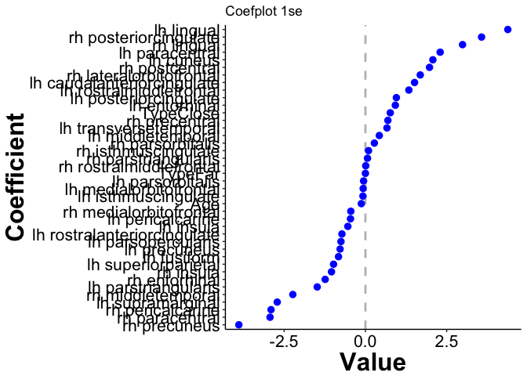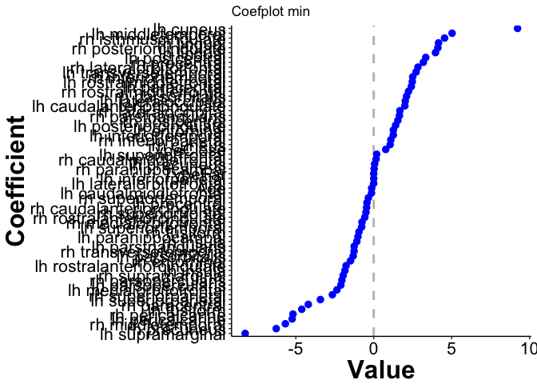

### Far All: ageCent, ageSq, AgeCu, Gender, Brain regions

``` r
set.seed(1234)
all3 <- fit_model(data=allRegions %>% filter(Type == 'Far'), 
                  response='Rating',
                  predictors=c('ID', 'AgeCent', 'AgeCentSq', 'AgeCentCu', 
                               'Gender', regionNames_all),
                  nfolds=10
)
```

We view the coefficient path, error curve and coefplot for both `lambda.1se` and `lambda.min`.

``` r
pathSimple(all3, elementId='all3_mod')
```

<!--html_preserve-->

<script type="application/json" data-for="all3_mod">{"x":{"attrs":{"axes":{"x":{"pixelsPerLabel":60},"y":[]},"labels":["lambda","AgeCent","AgeCentSq","AgeCentCu","GenderF","GenderM","lh_caudalanteriorcingulate_thickness","lh_caudalmiddlefrontal_thickness","lh_cuneus_thickness","lh_entorhinal_thickness","lh_fusiform_thickness","lh_inferiorparietal_thickness","lh_inferiortemporal_thickness","lh_isthmuscingulate_thickness","lh_lateraloccipital_thickness","lh_lateralorbitofrontal_thickness","lh_lingual_thickness","lh_medialorbitofrontal_thickness","lh_middletemporal_thickness","lh_parahippocampal_thickness","lh_paracentral_thickness","lh_parsopercularis_thickness","lh_parsorbitalis_thickness","lh_parstriangularis_thickness","lh_pericalcarine_thickness","lh_postcentral_thickness","lh_posteriorcingulate_thickness","lh_precentral_thickness","lh_precuneus_thickness","lh_rostralanteriorcingulate_thickness","lh_rostralmiddlefrontal_thickness","lh_superiorfrontal_thickness","lh_superiorparietal_thickness","lh_superiortemporal_thickness","lh_supramarginal_thickness","lh_transversetemporal_thickness","lh_insula_thickness","rh_caudalanteriorcingulate_thickness","rh_caudalmiddlefrontal_thickness","rh_cuneus_thickness","rh_entorhinal_thickness","rh_fusiform_thickness","rh_inferiorparietal_thickness","rh_inferiortemporal_thickness","rh_isthmuscingulate_thickness","rh_lateraloccipital_thickness","rh_lateralorbitofrontal_thickness","rh_lingual_thickness","rh_medialorbitofrontal_thickness","rh_middletemporal_thickness","rh_parahippocampal_thickness","rh_paracentral_thickness","rh_parsopercularis_thickness","rh_parsorbitalis_thickness","rh_parstriangularis_thickness","rh_pericalcarine_thickness","rh_postcentral_thickness","rh_posteriorcingulate_thickness","rh_precentral_thickness","rh_precuneus_thickness","rh_rostralanteriorcingulate_thickness","rh_rostralmiddlefrontal_thickness","rh_superiorfrontal_thickness","rh_superiorparietal_thickness","rh_superiortemporal_thickness","rh_supramarginal_thickness","rh_transversetemporal_thickness","rh_insula_thickness"],"retainDateWindow":false,"xlabel":"Log Lambda","ylabel":"Coefficients","legend":"onmouseover","labelsDivWidth":250,"labelsShowZeroValues":true,"labelsSeparateLines":false,"showRangeSelector":true,"rangeSelectorHeight":40,"rangeSelectorPlotFillColor":" #A7B1C4","rangeSelectorPlotStrokeColor":"#808FAB","interactionModel":"Dygraph.Interaction.defaultModel","highlightCircleSize":3,"highlightSeriesBackgroundAlpha":0.5,"highlightSeriesOpts":{"strokeWidth":3},"hideOverlayOnMouseOut":true},"annotations":[{"x":-12.5344586615246,"shortText":"AgeCent","text":"AgeCent","width":50,"attachAtBottom":false,"series":"AgeCent"},{"x":-12.5344586615246,"shortText":"AgeCentSq","text":"AgeCentSq","width":50,"attachAtBottom":false,"series":"AgeCentSq"},{"x":-12.5344586615246,"shortText":"AgeCentCu","text":"AgeCentCu","width":50,"attachAtBottom":false,"series":"AgeCentCu"},{"x":-12.5344586615246,"shortText":"GenderF","text":"GenderF","width":50,"attachAtBottom":false,"series":"GenderF"},{"x":-12.5344586615246,"shortText":"GenderM","text":"GenderM","width":50,"attachAtBottom":false,"series":"GenderM"},{"x":-12.5344586615246,"shortText":"lh_caudalanteriorcingulate_thickness","text":"lh_caudalanteriorcingulate_thickness","width":50,"attachAtBottom":false,"series":"lh_caudalanteriorcingulate_thickness"},{"x":-12.5344586615246,"shortText":"lh_caudalmiddlefrontal_thickness","text":"lh_caudalmiddlefrontal_thickness","width":50,"attachAtBottom":false,"series":"lh_caudalmiddlefrontal_thickness"},{"x":-12.5344586615246,"shortText":"lh_cuneus_thickness","text":"lh_cuneus_thickness","width":50,"attachAtBottom":false,"series":"lh_cuneus_thickness"},{"x":-12.5344586615246,"shortText":"lh_entorhinal_thickness","text":"lh_entorhinal_thickness","width":50,"attachAtBottom":false,"series":"lh_entorhinal_thickness"},{"x":-12.5344586615246,"shortText":"lh_fusiform_thickness","text":"lh_fusiform_thickness","width":50,"attachAtBottom":false,"series":"lh_fusiform_thickness"},{"x":-12.5344586615246,"shortText":"lh_inferiorparietal_thickness","text":"lh_inferiorparietal_thickness","width":50,"attachAtBottom":false,"series":"lh_inferiorparietal_thickness"},{"x":-12.5344586615246,"shortText":"lh_inferiortemporal_thickness","text":"lh_inferiortemporal_thickness","width":50,"attachAtBottom":false,"series":"lh_inferiortemporal_thickness"},{"x":-12.5344586615246,"shortText":"lh_isthmuscingulate_thickness","text":"lh_isthmuscingulate_thickness","width":50,"attachAtBottom":false,"series":"lh_isthmuscingulate_thickness"},{"x":-12.5344586615246,"shortText":"lh_lateraloccipital_thickness","text":"lh_lateraloccipital_thickness","width":50,"attachAtBottom":false,"series":"lh_lateraloccipital_thickness"},{"x":-12.5344586615246,"shortText":"lh_lateralorbitofrontal_thickness","text":"lh_lateralorbitofrontal_thickness","width":50,"attachAtBottom":false,"series":"lh_lateralorbitofrontal_thickness"},{"x":-12.5344586615246,"shortText":"lh_lingual_thickness","text":"lh_lingual_thickness","width":50,"attachAtBottom":false,"series":"lh_lingual_thickness"},{"x":-12.5344586615246,"shortText":"lh_medialorbitofrontal_thickness","text":"lh_medialorbitofrontal_thickness","width":50,"attachAtBottom":false,"series":"lh_medialorbitofrontal_thickness"},{"x":-12.5344586615246,"shortText":"lh_middletemporal_thickness","text":"lh_middletemporal_thickness","width":50,"attachAtBottom":false,"series":"lh_middletemporal_thickness"},{"x":-12.5344586615246,"shortText":"lh_parahippocampal_thickness","text":"lh_parahippocampal_thickness","width":50,"attachAtBottom":false,"series":"lh_parahippocampal_thickness"},{"x":-12.5344586615246,"shortText":"lh_paracentral_thickness","text":"lh_paracentral_thickness","width":50,"attachAtBottom":false,"series":"lh_paracentral_thickness"},{"x":-12.5344586615246,"shortText":"lh_parsopercularis_thickness","text":"lh_parsopercularis_thickness","width":50,"attachAtBottom":false,"series":"lh_parsopercularis_thickness"},{"x":-12.5344586615246,"shortText":"lh_parsorbitalis_thickness","text":"lh_parsorbitalis_thickness","width":50,"attachAtBottom":false,"series":"lh_parsorbitalis_thickness"},{"x":-12.5344586615246,"shortText":"lh_parstriangularis_thickness","text":"lh_parstriangularis_thickness","width":50,"attachAtBottom":false,"series":"lh_parstriangularis_thickness"},{"x":-12.5344586615246,"shortText":"lh_pericalcarine_thickness","text":"lh_pericalcarine_thickness","width":50,"attachAtBottom":false,"series":"lh_pericalcarine_thickness"},{"x":-12.5344586615246,"shortText":"lh_postcentral_thickness","text":"lh_postcentral_thickness","width":50,"attachAtBottom":false,"series":"lh_postcentral_thickness"},{"x":-12.5344586615246,"shortText":"lh_posteriorcingulate_thickness","text":"lh_posteriorcingulate_thickness","width":50,"attachAtBottom":false,"series":"lh_posteriorcingulate_thickness"},{"x":-12.5344586615246,"shortText":"lh_precentral_thickness","text":"lh_precentral_thickness","width":50,"attachAtBottom":false,"series":"lh_precentral_thickness"},{"x":-12.5344586615246,"shortText":"lh_precuneus_thickness","text":"lh_precuneus_thickness","width":50,"attachAtBottom":false,"series":"lh_precuneus_thickness"},{"x":-12.5344586615246,"shortText":"lh_rostralanteriorcingulate_thickness","text":"lh_rostralanteriorcingulate_thickness","width":50,"attachAtBottom":false,"series":"lh_rostralanteriorcingulate_thickness"},{"x":-12.5344586615246,"shortText":"lh_rostralmiddlefrontal_thickness","text":"lh_rostralmiddlefrontal_thickness","width":50,"attachAtBottom":false,"series":"lh_rostralmiddlefrontal_thickness"},{"x":-12.5344586615246,"shortText":"lh_superiorfrontal_thickness","text":"lh_superiorfrontal_thickness","width":50,"attachAtBottom":false,"series":"lh_superiorfrontal_thickness"},{"x":-12.5344586615246,"shortText":"lh_superiorparietal_thickness","text":"lh_superiorparietal_thickness","width":50,"attachAtBottom":false,"series":"lh_superiorparietal_thickness"},{"x":-12.5344586615246,"shortText":"lh_superiortemporal_thickness","text":"lh_superiortemporal_thickness","width":50,"attachAtBottom":false,"series":"lh_superiortemporal_thickness"},{"x":-12.5344586615246,"shortText":"lh_supramarginal_thickness","text":"lh_supramarginal_thickness","width":50,"attachAtBottom":false,"series":"lh_supramarginal_thickness"},{"x":-12.5344586615246,"shortText":"lh_transversetemporal_thickness","text":"lh_transversetemporal_thickness","width":50,"attachAtBottom":false,"series":"lh_transversetemporal_thickness"},{"x":-12.5344586615246,"shortText":"lh_insula_thickness","text":"lh_insula_thickness","width":50,"attachAtBottom":false,"series":"lh_insula_thickness"},{"x":-12.5344586615246,"shortText":"rh_caudalanteriorcingulate_thickness","text":"rh_caudalanteriorcingulate_thickness","width":50,"attachAtBottom":false,"series":"rh_caudalanteriorcingulate_thickness"},{"x":-12.5344586615246,"shortText":"rh_caudalmiddlefrontal_thickness","text":"rh_caudalmiddlefrontal_thickness","width":50,"attachAtBottom":false,"series":"rh_caudalmiddlefrontal_thickness"},{"x":-12.5344586615246,"shortText":"rh_cuneus_thickness","text":"rh_cuneus_thickness","width":50,"attachAtBottom":false,"series":"rh_cuneus_thickness"},{"x":-12.5344586615246,"shortText":"rh_entorhinal_thickness","text":"rh_entorhinal_thickness","width":50,"attachAtBottom":false,"series":"rh_entorhinal_thickness"},{"x":-12.5344586615246,"shortText":"rh_fusiform_thickness","text":"rh_fusiform_thickness","width":50,"attachAtBottom":false,"series":"rh_fusiform_thickness"},{"x":-12.5344586615246,"shortText":"rh_inferiorparietal_thickness","text":"rh_inferiorparietal_thickness","width":50,"attachAtBottom":false,"series":"rh_inferiorparietal_thickness"},{"x":-12.5344586615246,"shortText":"rh_inferiortemporal_thickness","text":"rh_inferiortemporal_thickness","width":50,"attachAtBottom":false,"series":"rh_inferiortemporal_thickness"},{"x":-12.5344586615246,"shortText":"rh_isthmuscingulate_thickness","text":"rh_isthmuscingulate_thickness","width":50,"attachAtBottom":false,"series":"rh_isthmuscingulate_thickness"},{"x":-12.5344586615246,"shortText":"rh_lateraloccipital_thickness","text":"rh_lateraloccipital_thickness","width":50,"attachAtBottom":false,"series":"rh_lateraloccipital_thickness"},{"x":-12.5344586615246,"shortText":"rh_lateralorbitofrontal_thickness","text":"rh_lateralorbitofrontal_thickness","width":50,"attachAtBottom":false,"series":"rh_lateralorbitofrontal_thickness"},{"x":-12.5344586615246,"shortText":"rh_lingual_thickness","text":"rh_lingual_thickness","width":50,"attachAtBottom":false,"series":"rh_lingual_thickness"},{"x":-12.5344586615246,"shortText":"rh_medialorbitofrontal_thickness","text":"rh_medialorbitofrontal_thickness","width":50,"attachAtBottom":false,"series":"rh_medialorbitofrontal_thickness"},{"x":-12.5344586615246,"shortText":"rh_middletemporal_thickness","text":"rh_middletemporal_thickness","width":50,"attachAtBottom":false,"series":"rh_middletemporal_thickness"},{"x":-12.5344586615246,"shortText":"rh_parahippocampal_thickness","text":"rh_parahippocampal_thickness","width":50,"attachAtBottom":false,"series":"rh_parahippocampal_thickness"},{"x":-12.5344586615246,"shortText":"rh_paracentral_thickness","text":"rh_paracentral_thickness","width":50,"attachAtBottom":false,"series":"rh_paracentral_thickness"},{"x":-12.5344586615246,"shortText":"rh_parsopercularis_thickness","text":"rh_parsopercularis_thickness","width":50,"attachAtBottom":false,"series":"rh_parsopercularis_thickness"},{"x":-12.5344586615246,"shortText":"rh_parsorbitalis_thickness","text":"rh_parsorbitalis_thickness","width":50,"attachAtBottom":false,"series":"rh_parsorbitalis_thickness"},{"x":-12.5344586615246,"shortText":"rh_parstriangularis_thickness","text":"rh_parstriangularis_thickness","width":50,"attachAtBottom":false,"series":"rh_parstriangularis_thickness"},{"x":-12.5344586615246,"shortText":"rh_pericalcarine_thickness","text":"rh_pericalcarine_thickness","width":50,"attachAtBottom":false,"series":"rh_pericalcarine_thickness"},{"x":-12.5344586615246,"shortText":"rh_postcentral_thickness","text":"rh_postcentral_thickness","width":50,"attachAtBottom":false,"series":"rh_postcentral_thickness"},{"x":-12.5344586615246,"shortText":"rh_posteriorcingulate_thickness","text":"rh_posteriorcingulate_thickness","width":50,"attachAtBottom":false,"series":"rh_posteriorcingulate_thickness"},{"x":-12.5344586615246,"shortText":"rh_precentral_thickness","text":"rh_precentral_thickness","width":50,"attachAtBottom":false,"series":"rh_precentral_thickness"},{"x":-12.5344586615246,"shortText":"rh_precuneus_thickness","text":"rh_precuneus_thickness","width":50,"attachAtBottom":false,"series":"rh_precuneus_thickness"},{"x":-12.5344586615246,"shortText":"rh_rostralanteriorcingulate_thickness","text":"rh_rostralanteriorcingulate_thickness","width":50,"attachAtBottom":false,"series":"rh_rostralanteriorcingulate_thickness"},{"x":-12.5344586615246,"shortText":"rh_rostralmiddlefrontal_thickness","text":"rh_rostralmiddlefrontal_thickness","width":50,"attachAtBottom":false,"series":"rh_rostralmiddlefrontal_thickness"},{"x":-12.5344586615246,"shortText":"rh_superiorfrontal_thickness","text":"rh_superiorfrontal_thickness","width":50,"attachAtBottom":false,"series":"rh_superiorfrontal_thickness"},{"x":-12.5344586615246,"shortText":"rh_superiorparietal_thickness","text":"rh_superiorparietal_thickness","width":50,"attachAtBottom":false,"series":"rh_superiorparietal_thickness"},{"x":-12.5344586615246,"shortText":"rh_superiortemporal_thickness","text":"rh_superiortemporal_thickness","width":50,"attachAtBottom":false,"series":"rh_superiortemporal_thickness"},{"x":-12.5344586615246,"shortText":"rh_supramarginal_thickness","text":"rh_supramarginal_thickness","width":50,"attachAtBottom":false,"series":"rh_supramarginal_thickness"},{"x":-12.5344586615246,"shortText":"rh_transversetemporal_thickness","text":"rh_transversetemporal_thickness","width":50,"attachAtBottom":false,"series":"rh_transversetemporal_thickness"},{"x":-12.5344586615246,"shortText":"rh_insula_thickness","text":"rh_insula_thickness","width":50,"attachAtBottom":false,"series":"rh_insula_thickness"}],"shadings":[],"events":[{"pos":-8.99917650183633,"label":"lambda.min","labelLoc":"bottom","color":"black","strokePattern":[2,2],"axis":"x"},{"pos":-6.95243419885891,"label":"lambda.1se","labelLoc":"bottom","color":"black","strokePattern":[2,2],"axis":"x"}],"format":"numeric","data":[[-12.5344586615246,-12.4414249204802,-12.3483911794357,-12.2553574383913,-12.1623236973469,-12.0692899563025,-11.976256215258,-11.8832224742136,-11.7901887331692,-11.6971549921247,-11.6041212510803,-11.5110875100359,-11.4180537689915,-11.325020027947,-11.2319862869026,-11.1389525458582,-11.0459188048137,-10.9528850637693,-10.8598513227249,-10.7668175816805,-10.673783840636,-10.5807500995916,-10.4877163585472,-10.3946826175028,-10.3016488764583,-10.2086151354139,-10.1155813943695,-10.022547653325,-9.92951391228061,-9.83648017123618,-9.74344643019175,-9.65041268914733,-9.5573789481029,-9.46434520705847,-9.37131146601404,-9.27827772496961,-9.18524398392519,-9.09221024288076,-8.99917650183633,-8.9061427607919,-8.81310901974747,-8.72007527870305,-8.62704153765862,-8.53400779661419,-8.44097405556976,-8.34794031452533,-8.25490657348091,-8.16187283243648,-8.06883909139205,-7.97580535034762,-7.88277160930319,-7.78973786825876,-7.69670412721434,-7.60367038616991,-7.51063664512548,-7.41760290408105,-7.32456916303662,-7.2315354219922,-7.13850168094777,-7.04546793990334,-6.95243419885891,-6.85940045781448,-6.76636671677006,-6.67333297572563,-6.5802992346812,-6.48726549363677,-6.39423175259234,-6.30119801154791,-6.20816427050349,-6.11513052945906,-6.02209678841463,-5.9290630473702,-5.83602930632577,-5.74299556528135,-5.64996182423692,-5.55692808319249,-5.46389434214806,-5.37086060110363,-5.27782686005921,-5.18479311901478,-5.09175937797035,-4.99872563692592,-4.90569189588149,-4.81265815483706,-4.71962441379264,-4.62659067274821,-4.53355693170378,-4.44052319065935,-4.34748944961492,-4.2544557085705,-4.16142196752607,-4.06838822648164,-3.97535448543721,-3.88232074439278,-3.78928700334836,-3.69625326230393],[-0.31884378520055,-0.31879832500338,-0.318707637744805,-0.31857177280993,-0.318481325482736,-0.318345970177937,-0.318210847270424,-0.31807597360951,-0.317941512165459,-0.31776283006228,-0.317540020299824,-0.317362278854323,-0.317096618789665,-0.316875861138352,-0.316612091421019,-0.316261298083249,-0.315954800622975,-0.315561851128501,-0.315125920462472,-0.314690899187621,-0.314170437211951,-0.313608093545806,-0.313005061761406,-0.312363398863815,-0.311643843470944,-0.310936161492021,-0.310203380221886,-0.309535800933701,-0.308749612980926,-0.308098987735364,-0.307082073071703,-0.306142549317968,-0.305019829272242,-0.303967922950853,-0.303039333079375,-0.302266523634238,-0.301286423019441,-0.300616358963499,-0.300096729226294,-0.299871849750665,-0.300144202169743,-0.299617904003126,-0.298896688184386,-0.297712224633718,-0.296761338593786,-0.295208567419723,-0.293258977357799,-0.290943283221203,-0.287790628110011,-0.283601334571524,-0.277119075603836,-0.272812697388075,-0.264031196466224,-0.255495697614462,-0.247372075766782,-0.233988816168506,-0.222057559934404,-0.208154107726868,-0.197140327896847,-0.184697703465649,-0.179138290401558,-0.169351061867753,-0.164072917684478,-0.16072463053999,-0.156252008402555,-0.151789961645646,-0.148826443210061,-0.145754252638089,-0.140675141666997,-0.133722431231926,-0.124165503314415,-0.119254833031643,-0.115597553650806,-0.106481671557741,-0.10024038679219,-0.088201862473221,-0.0889315733704425,-0.096051284846377,-0.0996394987916301,-0.102869989590174,-0.105590061471196,-0.105713329089176,-0.102681153662658,-0.0992939906328693,-0.0956929731448902,-0.0916874374108213,-0.0873184607134574,-0.0825685796826472,-0.0774108365152462,-0.0717279882754779,-0.0653591386117929,-0.0555463717697167,-0.0434965664239247,-0.0301983857681501,-0.015690654680351,0],[0.0367899242438035,0.0367745397181655,0.0367438028653345,0.0366976619530611,0.0366668862698203,0.0366207264855845,0.036574553181085,0.0365284039639914,0.0364822848175428,0.036420820394574,0.0363439111936996,0.0362823564474309,0.0361899892847349,0.0361129456777433,0.0360205381266545,0.0358971371225762,0.0357889373555881,0.0356496243766063,0.0354942565899774,0.0353382681770352,0.0351502080395248,0.0349450101454513,0.0347222188368699,0.0344813345801462,0.0342051035158304,0.0339250817308595,0.0336234847461479,0.0333340497857937,0.0329861981558933,0.0326888558623764,0.032237480355953,0.0318132028703047,0.0312945657939959,0.0307916020131659,0.0303199926765682,0.02986852265143,0.0290995765333682,0.028413981865687,0.0276186906345058,0.0266845414414928,0.025948385630161,0.0251000529381397,0.024676669052458,0.024306463254132,0.0240518443136256,0.0235749001590197,0.0231666990714269,0.0227775538902706,0.0222128818314649,0.021380095915665,0.020452617388396,0.0198272512482501,0.0192394965615822,0.0189759441170984,0.0187372380482707,0.0187796040888985,0.019215201341167,0.0200430202500478,0.0210905950653032,0.0223374599347206,0.0222268634316173,0.0220300902081265,0.02082821117865,0.0183914964610565,0.0167836964837058,0.0149867377445358,0.0132664051528655,0.0116946803561893,0.00998865501222121,0.00794975096979116,0.00541557654855592,0.00361901647847398,0.000625586860344717,0,0,0,0,0,0,0,0,0,0,0,0,0,0,0,0,0,0,0,0,0,0,0],[-0.000869435570139892,-0.000868137326151474,-0.000865545899323481,-0.000861659259051066,-0.000859069958999896,-0.000855191016551714,-0.000851316436676969,-0.000847451244285753,-0.000843596231426606,-0.000838469121516378,-0.000832068230118755,-0.000826960029134258,-0.000819318791824074,-0.000812971243491915,-0.000805394575664235,-0.000795338682714064,-0.000786592294511035,-0.000775431118496562,-0.000763113683933742,-0.000750897115391088,-0.000736372607999679,-0.00072078002113011,-0.00070415270341951,-0.00068652710940277,-0.000666755899533745,-0.000647176080578177,-0.000626648467259677,-0.000607362492922986,-0.000583939238196219,-0.000564245908974035,-0.000533367956807124,-0.000505171382359284,-0.000473036538547591,-0.000445946877289827,-0.00042304890727624,-0.000401232597147484,-0.000361068392928392,-0.000327725447394491,-0.000291145615948099,-0.000246020439562769,-0.000200718573221049,-0.00011668506027082,-7.4535452432135e-05,-4.1809697231766e-05,-2.65874570735336e-05,-2.15132483101371e-05,-2.44349003417963e-05,-2.60302421833706e-05,-2.48555082925048e-05,-1.4180484753502e-05,-2.10662371116208e-07,0,0,0,0,0,0,0,0,0,0,0,0,0,0,0,0,0,0,0,0,0,0,0,0,0,0,0,0,0,0,0,0,0,0,0,0,0,0,0,0,0,0,0,0,0],[0.0032483778497022,0.0029922949455455,0.00248467050475325,0.0017288201061827,0.00122937126465331,0.000488189891618469,0,0,0,0,0,0,0,0,0,0,0,0,0,0,0,0,0,0,0,0,0,0,0,0,0,0,0,0,0,0,0,0,0,0,0,0,0,0,0,0,0,0,0,0,0,0,0,0,0,0,0,0,0,0,0,0,0,0,0,0,0,0,0,0,0,0,0,0,0,0,0,0,0,0,0,0,0,0,0,0,0,0,0,0,0,0,0,0,0,0],[-7.02986298555388e-11,-6.50651006704604e-11,-5.46106198368014e-11,-3.89603219084335e-11,-2.85477514258554e-11,-1.29602806060864e-11,0,0,0,0,0,0,0,0,0,0,0,0,0,0,0,0,0,0,0,0,0,0,0,0,0,0,0,0,0,0,0,0,0,0,0,0,0,0,0,0,0,0,0,0,0,0,0,0,0,0,0,0,0,0,0,0,0,0,0,0,0,0,0,0,0,0,0,0,0,0,0,0,0,0,0,0,0,0,0,0,0,0,0,0,0,0,0,0,0,0],[-0.188554674270677,-0.188210613100769,-0.187528511796172,-0.18650193449365,-0.185816422363902,-0.184791219087134,-0.183764892787124,-0.182740488211365,-0.181723248668099,-0.18037552478693,-0.178685361676698,-0.1773338346115,-0.175310745573631,-0.173622439096194,-0.17161631315588,-0.168936882389882,-0.166581678755655,-0.163560917477588,-0.160168407269052,-0.156740611299036,-0.152585265573767,-0.14798190245149,-0.142887173693809,-0.137238406073142,-0.130511651435441,-0.123383809583845,-0.115574807342855,-0.108094304366767,-0.100298333250806,-0.093776824182883,-0.0854669460249408,-0.0785765982339195,-0.0703941081769811,-0.0597112776715624,-0.050421392603651,-0.0432644993923053,-0.0347859607121985,-0.0267083294050154,-0.0189490179891135,-0.0107410632413437,-0.00242946093019408,-0.00186040921942231,-0.000199744871328069,0,0,0,0,0,0,0,0,0,0,0.0585025954121752,0.161640183495957,0.314919216475838,0.471200975222978,0.655684183291491,0.818938847469311,0.973278610794788,1.08999999403629,1.29059544968416,1.40205918961454,1.43730372490129,1.42371523315711,1.41495804622273,1.45744437533801,1.50953296596759,1.55311930537106,1.58516879435526,1.61088235834121,1.62560326620563,1.54452111435664,1.47481625692274,1.44586350585761,1.32734778063543,1.19281707871658,1.12349594344027,1.05299850481126,0.979986327130395,0.896300638631599,0.796416705989384,0.717588389444472,0.657750195458168,0.593388093266763,0.521730600752247,0.442413171453059,0.353884749455486,0.253564077777717,0.136595148105519,0.00103725090339256,0,0,0,0,0],[0.388040007530091,0.386810362969104,0.384357478551223,0.380675863171339,0.37822201962082,0.374545874947296,0.370869119335513,0.367196734642912,0.363537355091128,0.358674194223164,0.352601302450537,0.347756767472661,0.340513702809671,0.334499127530977,0.327330527995632,0.317816885562321,0.309543561168321,0.298995120940495,0.287350146829364,0.275803899338087,0.262085888123597,0.247381748818722,0.231816649096645,0.215561789762529,0.197696378076054,0.180459791933047,0.162847895502958,0.146934283296047,0.129008774293529,0.114778044189152,0.0954972772160412,0.0787088266779016,0.0594561171742304,0.0419841644978573,0.0269336736184768,0.0178990304257034,0.00442608644094547,0,0,0,0,0,0,0.0224348888654952,0.0527427562535191,0.0963564238556592,0.15151290147889,0.191410380386564,0.195847255047472,0.17676459415794,0.110014468397238,0.0643655441904928,0.0474755409128526,0.0286819654945551,0,0,0,0,0,0.26010545095087,0.172483687510877,0.405270118177747,0.781493231651128,0.939929124743006,0.874480850115502,0.835836291703261,0.881935844940966,0.956349601085974,0.978766908322567,0.980108609165783,0.914531775544904,0.800152005352068,0.570358256505149,0.35135320966531,0.0529457942180822,0,0,0,0,0,0,0,0,0,0,0,0,0,0,0,0,0,0,0,0,0],[14.2067919472111,14.2046124977881,14.2002536502707,14.1937012878809,14.1893253159548,14.1827528814899,14.1761684518204,14.169575284661,14.1629732251227,14.1541525833182,14.1430830747993,14.1341978699652,14.120817867358,14.1096176671086,14.0961276244545,14.0780190752566,14.0620613731155,14.0413962952694,14.0182091310471,13.9947965740889,13.9664016190472,13.9352507339649,13.9012661139064,13.8643704657126,13.8219435415892,13.7789163240805,13.7328087759685,13.688875413153,13.6354345469852,13.5896738818481,13.5169434497865,13.4473513421259,13.3623434456637,13.2818837029792,13.2084034334985,13.1366965098172,12.9937434751688,12.8570753097092,12.6930256924807,12.4939985025141,12.3208096127865,12.0581771603814,11.9271996146321,11.7789346331602,11.643674841818,11.389634829848,11.1006702495853,10.8074502675519,10.4816648876771,10.0641297971368,9.59149842807872,9.2908444960408,8.782833015216,8.32310636018972,7.81300295221106,7.10226979566318,6.47411895855713,5.64336569697418,4.75055977692132,3.65322068082646,3.0171606863314,1.76223859872472,0.650905292592123,0.0425714145808444,0,0,0,0,0,0,0,0,0,0,0,0,0,0,0,0,0,0,0,0,0,0,0,0,0,0,0,0,0,0,0,0],[1.88745184117971,1.88706388558283,1.88629216182457,1.88513897042795,1.88437391529468,1.88323280314001,1.88209775631855,1.88097298006975,1.87985973084854,1.8783916475338,1.87657535519592,1.87514063626079,1.87301832350005,1.8712765635668,1.8692266129231,1.86654758562155,1.86425805549895,1.86139734396294,1.85831385514499,1.85533574841941,1.85190135036897,1.84833249800687,1.84465768555758,1.84091672357386,1.83690766140368,1.83309198451459,1.82914542618485,1.82543922812781,1.82086522791455,1.81700957418977,1.81086008179376,1.80486801951069,1.79784750461944,1.79171121767919,1.78522490657112,1.77774492008079,1.7601376001516,1.74268634223483,1.72142928320263,1.69500515622711,1.67176442679935,1.613859110553,1.58108668670189,1.54323916093029,1.51057721353062,1.46590792231399,1.41567472209607,1.36865997153108,1.32359607823687,1.27080202250067,1.21000543734425,1.16561449228114,1.07727469345705,1.00714784217661,0.952610208375528,0.879932539463049,0.810143877250157,0.731781854392422,0.659266192512875,0.602561536712102,0.576165370941423,0.54454466812767,0.569973534200287,0.626522769605344,0.634881705495651,0.629069424593664,0.625264531794641,0.60659938008947,0.562177506290032,0.514936100700751,0.460730126601896,0.436618531374044,0.396367623099701,0.328461065725183,0.270719601359985,0.164830417774822,0.0460573103604313,0,0,0,0,0,0,0,0,0,0,0,0,0,0,0,0,0,0,0],[-6.21936538682171,-6.21950079912314,-6.21977670140547,-6.220188140939,-6.22046224466763,-6.22087677085778,-6.22129069601543,-6.22170798614464,-6.22213523647063,-6.2227169616026,-6.22344713187492,-6.22404027389122,-6.22494587694587,-6.22571356113351,-6.22666806175393,-6.22796160403413,-6.22911675041042,-6.23064896801601,-6.23238053495403,-6.23415957592685,-6.23636100190918,-6.23878819410095,-6.24142672336122,-6.24428650786685,-6.24759008490822,-6.25099725249017,-6.25471628455918,-6.25815525041233,-6.26158644780427,-6.26457864150009,-6.26876938633236,-6.27349218909813,-6.28044090057671,-6.28923015261256,-6.29591815039145,-6.29776970964589,-6.28574573849115,-6.27105565655909,-6.24756788020224,-6.20650944219186,-6.16249865277211,-6.05860063895246,-5.99126865190435,-5.9159601956083,-5.85234405294047,-5.76765821233982,-5.66380783171992,-5.55486187917282,-5.44470859727106,-5.30978547934932,-5.13003580128795,-4.99258645875446,-4.85872622506803,-4.7446570844959,-4.59150844185496,-4.36672099413183,-4.10747835800591,-3.77487004994621,-3.36265042544614,-2.81774067289274,-2.43789822745595,-1.80992722375549,-1.13254823944986,-0.620999705220465,-0.363356342190614,-0.0927759674218321,0,0,0,0,0,0,0,0,0,0,0,0,0,0,0,0,0,0,0,0,0,0,0,0,0,0,0,0,0,0],[0.910063885699984,0.909992613743255,0.909852023653152,0.909636822197092,0.909490510619778,0.909269655548485,0.909042894646903,0.908809470393943,0.908575317503727,0.908261630247575,0.907857532793612,0.907525302908035,0.907015314564865,0.906573317630627,0.906034147527422,0.905283604411842,0.904588872859255,0.903657980150255,0.902550740317658,0.901361901170851,0.899830058943104,0.89800807298568,0.895838186855395,0.893262638357924,0.890011150498555,0.886336923295197,0.88192297562794,0.877278029921743,0.870461855920418,0.8639109555356,0.851422990140157,0.838688752918411,0.822121308760587,0.805722295408105,0.788586351056395,0.770313034869954,0.732549930681704,0.695787423666166,0.651006625859785,0.595810399866819,0.546462493037998,0.446684364555229,0.397813182520868,0.34263057262964,0.291609046801936,0.180272698766211,0.0743158876679997,0,0,0,0,0,0,0,0,0,0,0,0,0,0,0,0,0,0,0,0,0,0,0,0,0,0,0,0,0,0,0,0,0,0,0,0,0,0,0,0,0,0,0,0,0,0,0,0,0],[4.86481026888194,4.86384525790899,4.86191178744057,4.85899415368801,4.85703937382199,4.85409320238147,4.85112912490104,4.84815213140131,4.84516315615665,4.84115491387844,4.83609676954675,4.83201860637534,4.82584283546302,4.8206456833795,4.81435587065473,4.80585032683616,4.79830517386178,4.78846634822883,4.77733096650109,4.76599778354019,4.75213845769909,4.73679883830335,4.71992939180655,4.70149739070383,4.68021179446724,4.65862043817279,4.63554625810182,4.61359712350916,4.58653243059683,4.56323129053599,4.52505603151712,4.48831065832535,4.44316215249362,4.40087866590084,4.36096462802464,4.32026839590115,4.24250704055448,4.16779063455625,4.07391128354441,3.95304173265132,3.84514246783651,3.62381439862896,3.51604685241006,3.40438451647518,3.31057528846457,3.16013770365151,2.99325254707789,2.8257766826921,2.65923246386392,2.46763953553562,2.25293640173005,2.13402034381148,1.95619608031942,1.84727120649271,1.77617543639448,1.66709262090273,1.57493743088567,1.48154623878443,1.36894333416351,1.23660342698882,1.18917810123004,1.10616538406122,0.874009773564346,0.579046432337034,0.432473415121516,0.269105219216165,0.139184884180862,0.0266261642616694,0,0,0,0,0,0,0,0,0,0,0,0,0,0,0,0,0,0,0,0,0,0,0,0,0,0,0,0],[4.26168540216756,4.26163840128574,4.26154427658621,4.26139871096004,4.26129843844243,4.26114507703499,4.26098489771584,4.26081517155336,4.26064034031454,4.26039988464284,4.26008395354413,4.25981773641018,4.25939938455838,4.25902864463108,4.25856281285277,4.25790585563903,4.25729455753879,4.25646816245978,4.25549157071577,4.25445267212931,4.25313038346073,4.25160057115516,4.24983670042803,4.24780263328643,4.24530146253656,4.24253480943415,4.23931756071364,4.23606141312475,4.2319549145221,4.22797267016665,4.22105777345895,4.21307812549465,4.20191193827741,4.18958834150885,4.17657983699727,4.16087819688227,4.13163383069684,4.10399880249171,4.07131774523361,4.03276292424676,3.99802670547129,3.92431415914272,3.878443241873,3.82234041856774,3.77171868383375,3.6876129347807,3.58588477694119,3.48624069570226,3.39348455873396,3.30039137328981,3.21939834008049,3.17843423220496,3.13096758354702,3.09762990565875,3.06849183628017,3.04519658189792,3.02584996461862,2.9742071316701,2.85487792661446,2.59869878350533,2.47481139963814,2.00438047250884,1.36917002501106,0.825595664267911,0.646424970367486,0.44662124306576,0.238423567550529,0.0531609164161767,0,0,0,0,0,0,0,0,0,0,0,0,0,0,0,0,0,0,0,0,0,0,0,0,0,0,0,0],[1.5569230363538,1.55493982268623,1.55097819998072,1.54504165112854,1.54108893998408,1.53516894971595,1.52925968815498,1.52336128536286,1.51747466775883,1.50964160997727,1.49987037932409,1.49207368826061,1.48041039728374,1.47072309755893,1.45913891871711,1.44374314201109,1.43032675637399,1.41314916671221,1.39414987642829,1.37525937692896,1.35272795173469,1.32848428009875,1.30257950580583,1.27508120368925,1.24425736008171,1.21388990030339,1.18242314187665,1.15363943202587,1.11901483157694,1.09052406005323,1.04441396286355,1.00229552024426,0.954584400217353,0.914576759672389,0.879957250657059,0.845670116362267,0.766024349026035,0.692830454200423,0.60702270508471,0.506949857218654,0.42971589898145,0.26095239978131,0.180298223510169,0.0874138429602151,0.00585770756128648,0,0,0,0,0,0,0,0,0,0,0,0,0,0,0,0,0,0,0,0,0,0,0,0,0,0,0,0,0,0,0,0,0,0,0,0,0,0,0,0,0,0,0,0,0,0,0,0,0,0,0],[-0.16762311457703,-0.167450547694054,-0.167107102473345,-0.166584065468935,-0.166231359500084,-0.165699272279239,-0.165158801030733,-0.164609828377118,-0.164059246924704,-0.163320406795731,-0.162377720896634,-0.161613581835937,-0.160452838396845,-0.159472206126975,-0.158294190415228,-0.156696671037896,-0.155275715641293,-0.153426896485319,-0.15131709737858,-0.149160007285677,-0.146512254567881,-0.143545769873792,-0.140212772993971,-0.136439733447806,-0.131851392783725,-0.126861667130868,-0.121148318768583,-0.11510602403166,-0.109007739034595,-0.10357379632,-0.0988523348325398,-0.0950099721577299,-0.0886059311399156,-0.0779151559757861,-0.0649946543729314,-0.048138924530081,-0.0360715395918573,-0.0270320889179828,-0.0165256793653865,-0.00441129131688193,-0.0034187721532049,-0.00115715680330382,-0.00103848251129655,-0.000891624610572014,-0.000736755274749038,-0.000584338015418632,-0.000434376100606681,-0.000115258008738221,0,0,0,0,0,0,0,0,0,0,0,0,0,0,0,0,0,0,0,0,0,0,0,0,0,0,0,0,0,0,0,0,0,0,0,0,0,0,0,0,0,0,0,0,0,0,0,0],[6.5725280739652,6.57189941377179,6.57064817396795,6.56876485959575,6.56750666053953,6.56562051014438,6.56373051800877,6.56184357929821,6.5599667200967,6.55747567466645,6.55435588545606,6.55186283792419,6.54813031211363,6.54502160663921,6.54132239982892,6.53640254157909,6.53211666289093,6.52665586072731,6.52059496513624,6.51454847907112,6.50730622000819,6.49941462984423,6.49084573189988,6.48154797975425,6.470746602161,6.45958767361109,6.44757039560429,6.43623537410637,6.42122153366208,6.40872751962176,6.38737017673711,6.36853273477973,6.34905623942979,6.3340071223088,6.32189162373166,6.31372671475792,6.28906986215249,6.27086462479033,6.25725509188935,6.2527653477433,6.25846949878093,6.22081213189909,6.1965905690349,6.17705253865056,6.15757139597394,6.12402846727066,6.09097266989944,6.04542430360269,5.99486574777508,5.95239502235236,5.8705004606961,5.81146480054327,5.68979275307109,5.61102127811083,5.5750243166163,5.49473615879919,5.47445661327477,5.51248001971235,5.64962000105909,5.87140445576039,5.97911608827816,6.22588974672794,6.46546933835958,6.53035653690208,6.34221334020245,6.12484327491919,5.94332635815181,5.7710606965945,5.54430870835114,5.19454479267485,4.81623978311615,4.47773027639739,4.01099724641815,3.45917069665186,3.14854457854024,2.26948903707565,1.7871568194747,1.58218847609153,1.33596729104748,1.05846668469938,0.731191158853304,0.243378650446828,0,0,0,0,0,0,0,0,0,0,0,0,0,0],[-0.438298084903182,-0.43687656164219,-0.434040677870711,-0.429795845716417,-0.426972680589577,-0.422750507532093,-0.418542706771446,-0.414351968338817,-0.410179795508543,-0.404643964335221,-0.397758313126156,-0.392280153187577,-0.384114721293468,-0.377355010071914,-0.369305373539523,-0.358654238243521,-0.349406852750801,-0.337620480896609,-0.324638463710979,-0.311779656400505,-0.296502952053719,-0.280117350187703,-0.262648921824649,-0.244110607590259,-0.223283499396152,-0.202658338169284,-0.181211937909411,-0.161438114413521,-0.137864432471326,-0.118424315708575,-0.0886604061597284,-0.0629582838414951,-0.0359544476919943,-0.015326498794664,-0.00227120607533284,0,0.0435989815891099,0.102151166855425,0.170833922085707,0.256232965687052,0.336534572861005,0.493538030765214,0.566716958950871,0.652943245311889,0.72066143746647,0.825516799404069,0.937277091457293,1.04453797765485,1.1578557321977,1.29398274922562,1.43293389556368,1.50875851387754,1.62054853046945,1.7087502572326,1.79321084396759,1.90896317751805,1.98008763448741,2.08776597115829,2.20833600277981,2.27679305284778,2.30616335289882,2.36627399514713,2.28431508652619,2.0275834127003,1.86593188142038,1.69961331830111,1.50857028018517,1.32781434272296,1.1664873916952,1.00266857483195,0.821197773263551,0.663945500710679,0.516296859384704,0.334309085271644,0.0888155131567939,0,0,0,0,0,0,0,0,0,0,0,0,0,0,0,0,0,0,0,0,0],[4.10081183985706,4.09954621412229,4.09701915645273,4.09323252374252,4.0907118203877,4.08693738364842,4.08316982468311,4.0794115031511,4.07566294587043,4.07067844055519,4.06446327123855,4.05950739938699,4.05210071970962,4.04595468980639,4.03861956006379,4.02889596839841,4.02044441553203,4.00965887738416,3.99776423721147,3.98596517387173,3.97192449471708,3.95683262998917,3.94068412710359,3.92345162398266,3.90394804363019,3.88441067420801,3.86368356240056,3.84401518624833,3.82133154671182,3.80185836390259,3.77349556081583,3.74646002177639,3.7126573528783,3.67840997959712,3.64696528516977,3.61749927457956,3.55585916003097,3.49003464553851,3.41251315949904,3.321139775724,3.25106696980332,3.25974772219965,3.26041556285402,3.26774891393901,3.26484339318502,3.23531364553967,3.1780299729895,3.10840491917435,3.02047033423113,2.88114664206877,2.74112730022236,2.620856780195,2.54276289498331,2.43962087042571,2.22479750877845,2.01491485014732,1.79299637972484,1.49171344156764,1.2067434080262,0.918509990048255,0.578507985904551,0.123410096342669,0.00437441263473094,0,0,0,0,0,0,0,0,0,0,0,0,0,0,0,0,0,0,0,0,0,0,0,0,0,0,0,0,0,0,0,0,0],[-2.41517182521882,-2.4149125334733,-2.41440007267009,-2.41363350452026,-2.4131250332577,-2.4123693416991,-2.41161849772687,-2.41087525869179,-2.4101431151275,-2.40918167722237,-2.40798976900522,-2.40704874215477,-2.40565902537651,-2.40451811155983,-2.40318479107265,-2.40143959084626,-2.39994380871072,-2.39807886722608,-2.39605528673213,-2.39409236187445,-2.39181938408659,-2.38942136689729,-2.3868945568492,-2.3842470133474,-2.3813050833833,-2.37840824158682,-2.37539850347264,-2.37257515103981,-2.36880980024273,-2.36571539174449,-2.36039749162944,-2.35577120288993,-2.35146790653377,-2.34890157227122,-2.34594982780806,-2.34028515425378,-2.32983727975748,-2.32141960916606,-2.31218372215788,-2.30267062578528,-2.29513083362759,-2.25437799715777,-2.22231162627967,-2.18159249385048,-2.14394347642341,-2.08772373572944,-2.01919806101419,-1.94431954100601,-1.86264634627696,-1.76006708294125,-1.63584565896804,-1.55411163621973,-1.36894275220467,-1.20947917164709,-1.07845944683675,-0.8778532402188,-0.697052901173134,-0.490476648831297,-0.291563413860213,-0.0631846882887509,-0.00070162741177561,0,0,0,0,0,0,0,0,0,0,0,0,0,0,0,0,0,0,0,0,0,0,0,0,0,0,0,0,0,0,0,0,0,0,0],[3.03601462700149,3.03639353106756,3.03715485100132,3.03830158769975,3.03906954339463,3.04022795435948,3.0413940506646,3.04257187935481,3.04376271522195,3.04536943687242,3.0474034147668,3.04905377062346,3.05156834631087,3.05369988407273,3.05630396902202,3.05983266417516,3.06296865143606,3.06706830589353,3.07170458302171,3.07643848966522,3.0822530325604,3.0887133556403,3.09585438061904,3.10371071631986,3.1128698665971,3.12234298337078,3.13279927055693,3.14301115746924,3.15357186723596,3.16256496903119,3.17263892145542,3.18316023727002,3.19979199946904,3.22212031660219,3.24422740798548,3.26359385159671,3.28907580317574,3.31090659453691,3.33303036649082,3.35184832078719,3.36023898543401,3.28792072014213,3.24602050700383,3.186528561706,3.13525601859909,3.07039197073594,2.99973974015779,2.93310833305678,2.879032378378,2.83424943126616,2.77617568250238,2.75107480939485,2.64685484872293,2.55519449366845,2.48417628949041,2.34828698812733,2.2129424615231,2.09705398103083,1.98250504128211,1.81145786912118,1.78146638887342,1.72456435580541,1.67000761934819,1.51033491779412,1.43601471820287,1.37809154501245,1.29356775874935,1.17216309684133,1.03048369692784,0.888374765758461,0.854385340154035,0.788954564669025,0.71930576376232,0.614445471054017,0.5587316318247,0.29799840811141,0.321295574027456,0.244938612034976,0.189038372104031,0.118481186802138,0.00763853985568249,0,0,0,0,0,0,0,0,0,0,0,0,0,0,0],[0.00653134905778429,0.00631458006893082,0.00589415949771964,0.00528441876979132,0.00489348534371343,0.00433336273932613,0.00380329153328295,0.00330653831558413,0.00284493780430178,0.00228264884292243,0.00165491633423691,0.00121960609186528,0.000682498930190794,0.000343759018276722,8.89182495691124e-05,0,0,0,0,0,0,0,0,0,0,0,0,0,0,-3.02026091083787e-05,-1.57126799035585e-05,0,0,0,0,0,0,0,0,0,0,-0.000197678189326614,-0.000596115275854792,-0.0850410574986137,-0.165040775385491,-0.267660023824597,-0.374871801912888,-0.477647036409097,-0.572655867876976,-0.679377459747581,-0.7904655488203,-0.828840538056068,-1.01467999470162,-1.1705483641088,-1.27060500120384,-1.48417279449778,-1.63479142446741,-1.79740766279505,-1.95579931257487,-2.20679401273686,-2.13499808025951,-2.22304381900334,-2.31207209477921,-2.09631595410115,-1.86986448469338,-1.62460609552977,-1.38884961815187,-1.13569470473255,-0.88446931474074,-0.660135855591832,-0.459431180669419,-0.282102878870807,-0.0386750851114927,0,0,0,0,0,0,0,0,0,0,0,0,0,0,0,0,0,0,0,0,0,0,0],[-1.13905917194213,-1.13814986536964,-1.13633401587218,-1.13360665000039,-1.13178649283191,-1.12905675333221,-1.12632656315702,-1.12359880911308,-1.12087335854955,-1.11724285520582,-1.11270146826239,-1.1090690948372,-1.10362852779107,-1.09910120269693,-1.09369582330646,-1.0865354979133,-1.08024609657687,-1.07208741314603,-1.06291686716221,-1.05363585584335,-1.04235714363705,-1.02996068466265,-1.01642305312169,-1.001718539268,-0.984786914905944,-0.9675602244701,-0.948974045378134,-0.931060269026908,-0.909308175990354,-0.890549168944905,-0.861549181557857,-0.834508343751751,-0.802956023219013,-0.774060471299492,-0.748492383742326,-0.726223935574984,-0.690003584912634,-0.658071993770481,-0.620365022869004,-0.570446433685358,-0.51647779754832,-0.409620526699759,-0.360929288941441,-0.314972998075404,-0.283376825410686,-0.237668150517198,-0.204091580845564,-0.174711096119858,-0.139951186518899,-0.097025414655366,-0.0358018254799782,-0.0142133334812373,0,0,0,0,0,0,0,0,0,0,0,0,0,0,0,0,0,0,0,0,0,0,0,0,0,0,0,0,0,0,0,0,0,0,0,0,0,0,0,0,0,0,0,0],[1.01476926267297,1.01354091208938,1.01108788115918,1.00740980124958,1.00495966356563,1.00128890289874,0.99762140956372,0.993958294070613,0.990301255682109,0.985433419824946,0.979354380256288,0.974498905173668,0.967229186984296,0.961182314251396,0.953948965927022,0.944329770357147,0.935967248670823,0.925323100352575,0.913624219758461,0.902072385633015,0.888418673181261,0.873874646205535,0.858498937636456,0.842343217563847,0.824369327700849,0.806542140915101,0.787379040741974,0.76869657933531,0.746170828028107,0.726507953566878,0.697019842495109,0.668267235784524,0.631934582963891,0.597632114628308,0.566331267239722,0.535688168285904,0.480239958929514,0.429458895592964,0.370953181255213,0.300767329851046,0.234929969745118,0.117405792763926,0.0741216037351489,0.042761135444985,0.0246874808625001,0.00222995892251669,0.000197681108021487,0,0,0,0,0,0,0,0,0,0,0,0,0,0,0,0,0,0,0,0,0,0,0,0,0,0,0,0,0,0,0,0,0,0,0,0,0,0,0,0,0,0,0,0,0,0,0,0,0],[-8.09564935344485,-8.0933877506933,-8.08887190583923,-8.08208300429255,-8.07755061996994,-8.07074858950483,-8.06393383728196,-8.05711919299044,-8.05031200224782,-8.04124002437912,-8.02986983152267,-8.02076331978024,-8.0070859024049,-7.9956657660776,-7.98197531307658,-7.96366994501015,-7.94760424952937,-7.92692146482818,-7.90383339357781,-7.88066228311224,-7.85277472826151,-7.82241540820717,-7.78959426360886,-7.75435533974316,-7.7143693286308,-7.67438807215374,-7.63207794083363,-7.59215407437613,-7.54238752937664,-7.49977563820375,-7.42968989130009,-7.36329326650604,-7.28443642594468,-7.21440943004998,-7.14983692901021,-7.08430276691084,-6.94378979186968,-6.80943942279146,-6.6505081211517,-6.46051337168551,-6.29795960465925,-5.95329522924413,-5.78225739423212,-5.58933090592797,-5.4318083681977,-5.22557949823479,-5.01654241115888,-4.81487275454335,-4.60777948012224,-4.35259595351721,-4.0684800047035,-3.89602917632908,-3.60651895976884,-3.36337896622553,-3.13082355106058,-2.80753399007236,-2.56169362071291,-2.24160115998009,-1.88626898087814,-1.39085001095525,-1.14743608694631,-0.54490498791283,-0.027081097150801,0,0,0,0,0,0,0,0,0,0,0,0,0,0,0,0,0,0,0,0,0,0,0,0,0,0,0,0,0,0,0,0,0],[3.39203723723732,3.39059957849242,3.38773080855264,3.38342436143646,3.38055351618133,3.37625185788277,3.37195178425502,3.36765817992745,3.36337541498544,3.35767671420302,3.3505516188264,3.34485937203599,3.33633295855289,3.32923830201519,3.32075717016604,3.30945570048485,3.29958970689737,3.28695575192133,3.27294125045939,3.25897477339764,3.24227937433254,3.22424042162355,3.20488800910818,3.1842750381565,3.16109564294833,3.13829946074701,3.11492971409836,3.0935430138581,3.06653739414373,3.04441141296862,3.00707662827695,2.9734474277713,2.93542388313808,2.90713146078909,2.88313666161547,2.85832357369863,2.80498900484398,2.76211227994767,2.71557216675529,2.66332528313971,2.61930061353655,2.44574875151875,2.35244083948046,2.23363568734832,2.1350645881956,2.01655894881048,1.8992101327927,1.77695129958291,1.65706953480562,1.51318461043461,1.33021747253583,1.21954900839819,0.998462003700555,0.787024358178188,0.580436614239053,0.360391550134861,0.192444340200248,0.0449097690240777,0.0178132386209177,0,0,0,0,0,0,0,0,0,0,0,0,0,0,0,0,0,0,0,0,0,0,0,0,0,0,0,0,0,0,0,0,0,0,0,0,0],[0.465656888791785,0.465399916405931,0.464887398760652,0.464115136607906,0.463597985385703,0.462821117668783,0.462038621890536,0.461247101207054,0.460450600341051,0.459381786837289,0.458028971229163,0.456932556039109,0.455268867706479,0.453858851480731,0.45214899208137,0.449836081545021,0.44779552563828,0.445179688354037,0.442267666013196,0.439345417080829,0.435839427005041,0.432034104304048,0.427952529609781,0.423643968755852,0.418903028886606,0.414398207810935,0.40989287858275,0.405875328577567,0.402100141573617,0.399131857979572,0.396585506979645,0.393873582140316,0.388261622615294,0.379405939850295,0.369385374070614,0.358301229427086,0.343499919293256,0.33296297245858,0.322821713848911,0.313758532370733,0.31178602646032,0.351177061855136,0.360738454691128,0.371928389308102,0.379545763756969,0.400585912643916,0.417742577134542,0.433745096552104,0.442025569079206,0.44243637576827,0.453827319996321,0.453721701049964,0.530311666529406,0.545852189706348,0.509531192308408,0.496718462948701,0.4501485019989,0.37523965537127,0.307574754295183,0.27389165080638,0.0861997639406151,0.00546727215694204,0,0,0,0,0,0,0,0,0,0,0,0,0,0,0,0,0,0,0,0,0,0,0,0,0,0,0,0,0,0,0,0,0,0],[-1.91453030607295,-1.91273986548631,-1.90916423178961,-1.90379205188989,-1.90020730849552,-1.89483059702974,-1.88945222370564,-1.88407534472024,-1.87870046076666,-1.87153190154069,-1.86254692142855,-1.85534849994826,-1.84453263379982,-1.83550119739161,-1.8246607699092,-1.81015150361721,-1.7974061608181,-1.78096271753852,-1.76257491646201,-1.7440855165962,-1.72176043502746,-1.69736032619996,-1.67082040874332,-1.64208709595269,-1.60914045122174,-1.57580616585532,-1.54014611818175,-1.50607981230125,-1.46431704936494,-1.42845376138477,-1.37115673138082,-1.31708571377537,-1.25188446490111,-1.19229164072779,-1.13791208009268,-1.0866469442018,-0.996232963577968,-0.915598107823093,-0.82089944776818,-0.704550564401939,-0.607244747172421,-0.387757054191629,-0.281060955651183,-0.175531398609648,-0.100486236479874,-0.0099401321516564,0,0,0,0,0,0,0,0,0,0,0,0,0,0,0,0,0,0,0,0,0,0,0,0,0,0,0,0,0,0,0,0,0,0,0,0,0,0,0,0,0,0,0,0,0,0,0,0,0,0],[0.159145750021116,0.158509171952265,0.157242630209149,0.155345377918923,0.154083382560634,0.152198323381809,0.150320822714978,0.148454389530931,0.146600786467865,0.144147030914692,0.141094099984778,0.138667870851411,0.135057610387255,0.132072278097871,0.128533943097706,0.123860709964286,0.119801076471747,0.11463131255379,0.108925331258617,0.10326951978542,0.0965572369406307,0.0893570622250797,0.0816941992749502,0.0735958057322605,0.0645440433837102,0.0556020474909567,0.0462771093799906,0.0377041580046115,0.0292970853050583,0.0228876321704523,0.0172583901550006,0.0135923164012744,0.00951560838727262,0.00395355767278442,0.000688015738102168,0.000116156783668158,6.153443910345e-05,2.05598564840528e-05,0,0,0,0,0,0,0,0,0,0,0,0,0,0,0,0,0,0,0,0,0,0,0,0,0,0,0,0,0,0,0,0,0,0,0,0,0,0,0,0,0,0,0,0,0,0,0,0,0,0,0,0,0,0,0,0,0,0],[-3.43252405677663,-3.43212031709882,-3.43131344264089,-3.4300947593186,-3.42927711493816,-3.4280458889864,-3.42680746380822,-3.4255627501392,-3.42431245227243,-3.42263566617082,-3.42051467846656,-3.41879969297936,-3.41619965580219,-3.41400337015942,-3.4113424126238,-3.40773071258295,-3.40450237261525,-3.40026807609293,-3.39543506276601,-3.39047321101779,-3.38435922384744,-3.37753623599574,-3.36998299749414,-3.3616882528264,-3.35208333028173,-3.34232686768906,-3.33194134520759,-3.32223388197233,-3.31052563154818,-3.30045247247125,-3.28408824197733,-3.26768370789876,-3.24645099602566,-3.22496784971767,-3.20385416678386,-3.1807067779422,-3.14877130085469,-3.12079415095856,-3.08565824828997,-3.04125913353747,-3.00345042437121,-2.94631842999795,-2.91581481323634,-2.88064096210252,-2.84904428323743,-2.81032325967883,-2.76895744354356,-2.73044596310785,-2.69516849636719,-2.65494051758902,-2.60927698623828,-2.57477122340483,-2.52705164259942,-2.48582869728828,-2.44247663901816,-2.386035466525,-2.3266946231327,-2.26741015265146,-2.20483670418912,-2.06925649373999,-2.02634084358667,-1.86611971806486,-1.63083647758293,-1.44352326359511,-1.33792604032465,-1.22763603971149,-1.09871663591156,-0.973920206170135,-0.858353381213293,-0.736296455427551,-0.643966304008925,-0.566585683818631,-0.500966881570992,-0.39929039338342,-0.280548262714569,-0.178217137391849,-0.0106829019091461,0,0,0,0,0,0,0,0,0,0,0,0,0,0,0,0,0,0,0],[-0.0833628144060354,-0.0826356049708739,-0.0811882530987866,-0.0790284579509292,-0.0775970807627002,-0.0754645242370139,-0.073348464161728,-0.0712500700534773,-0.0691716211320303,-0.0664298184879763,-0.0630446202113201,-0.0603749180971568,-0.0564360585801518,-0.0532181159980501,-0.0494435763161111,-0.0445489838306871,-0.0404064212296979,-0.0352827507443604,-0.0298595481399544,-0.0247540439474772,-0.0190840741296637,-0.0135637321838462,-0.00846178293048041,-0.00412825182853329,-0.000892109205524708,0,0,0,0,0,0,0.0029425445863426,0.0190304504316987,0.0347629408858281,0.0521229639012353,0.0710617223654581,0.103832174603312,0.132701559613331,0.168111200098212,0.206307114874597,0.233493508766669,0.285794651659028,0.304349236830893,0.33022768033984,0.35088651596486,0.369197970089799,0.389933405202209,0.403868434492589,0.402443568357416,0.390434389164341,0.359735350221033,0.333030824291357,0.307353193583595,0.291832109202791,0.269684427257819,0.222668060478736,0.178221545831958,0.118612160958529,0.102928760140094,0.0465321157801214,0,0,0,0,0,0,0,0,0,0,0,0,0,0,0,0,0,0,0,0,0,0,0,0,0,0,0,0,0,0,0,0,0,0,0,0],[0.211279226415009,0.210022683900312,0.207521466708723,0.203788409184954,0.201313792643996,0.197625359722695,0.193962592784082,0.190328658854879,0.186727640538639,0.181974426279035,0.176099455757771,0.171459547289488,0.164600024024298,0.158978503131255,0.152358944644228,0.143721132158142,0.136351300382409,0.127147004431759,0.11726416756411,0.107774119374432,0.0969265796536181,0.0858618693603711,0.0748094341189278,0.0640606597210052,0.053408290629233,0.0446872119997742,0.0359131691609746,0.0280844433596285,0.0207381713754136,0.0153353704768684,0.0112503719705838,0.00826859372753886,0.00391310297092007,0.000830884866116519,0.000504943154083341,0.000459259364749008,0.000308016731903101,0.000166127180776172,2.34597909572781e-05,0,0,0,0,0,0,0,0,0,0,0,0,0,0,0,0,0,0,0,0,0,0,0,0,0,0,0,0,0,0,0,0,0,0,0,0,0,0,0,0,0,0,0,0,0,0,0,0,0,0,0,0,0,0,0,0,0],[-1.65393855221515,-1.65270350047373,-1.65023933635767,-1.64653885542027,-1.64407168835017,-1.64037400047424,-1.63667517982705,-1.6329835142395,-1.62930448625373,-1.6244126682548,-1.6182978656686,-1.61341616121225,-1.60610693501995,-1.60002796829141,-1.59276633879212,-1.58308701970149,-1.57462981330841,-1.56378780081418,-1.55173939518987,-1.53971359194793,-1.52531125898416,-1.50970298173637,-1.49286844459772,-1.47477396512131,-1.45412796479697,-1.43327282127508,-1.4113199020467,-1.39088933968213,-1.36724457728011,-1.34773810001605,-1.31959336347719,-1.29547539298323,-1.27065838368923,-1.25015763673045,-1.23602687216748,-1.22800613789759,-1.22080172362889,-1.21657992829158,-1.21812745162325,-1.22529205375941,-1.23025590912736,-1.23106262718505,-1.22499569993319,-1.22761249641489,-1.2365388193771,-1.25973719434444,-1.27547568135003,-1.29727312011309,-1.32162094424318,-1.31700909476332,-1.23835853992086,-1.16061307767304,-1.01680949882936,-0.835017857887471,-0.641093829200684,-0.38112843251385,-0.153949828892609,0,0,0,0,0,0,0,0,0,0,0,0,0,0,0,0,0,0,0,0,0,0,0,0,0,0,0,0,0,0,0,0,0,0,0,0,0,0,0],[-7.46226494527229,-7.45889828598442,-7.45216762987735,-7.44207685901467,-7.43535346574316,-7.42527490843847,-7.415202596166,-7.40513375987964,-7.39507218422421,-7.38166701497303,-7.36492600783672,-7.35154632762264,-7.33149733848873,-7.31480779655087,-7.29479671529846,-7.26812833040605,-7.24478510052819,-7.2147384368911,-7.18130217025411,-7.14780287799727,-7.10748396411318,-7.0636002474638,-7.01598753362145,-6.96443298755158,-6.9051533038971,-6.84464763116918,-6.77888424771643,-6.71582039326218,-6.63697882401835,-6.56844199641642,-6.45514357851196,-6.34779728537032,-6.2289993761749,-6.12222888260167,-6.0248168562801,-5.92532537403633,-5.72987544587168,-5.54798375425555,-5.32870195306037,-5.05344236370363,-4.80410742784597,-4.31875186520868,-4.0981232450081,-3.85825514111109,-3.66414019180437,-3.37248565602116,-3.06194159544528,-2.76516421349337,-2.47264154592398,-2.12377270284635,-1.72187819388064,-1.52980992820402,-1.10644414737894,-0.79496148755247,-0.648788972435517,-0.365432149876987,-0.178092901045805,-0.0215876324252063,0,0,0,0,0,0,0,0,0,0,0,0,0,0,0,0,0,0,0,0,0,0,0,0,0,0,0,0,0,0,0,0,0,0,0,0,0,0],[-14.486504656865,-14.4838662892648,-14.4785902670461,-14.4706689570084,-14.4653853617287,-14.4574566148104,-14.4495213592091,-14.4415814327555,-14.4336401598841,-14.4230454805475,-14.4097826700529,-14.3991645751238,-14.3832196149101,-14.3699214288366,-14.3539581422509,-14.3326388688746,-14.3139732665323,-14.2899648289217,-14.2632585348553,-14.2365429524518,-14.2044711754168,-14.1697089613262,-14.1322914146209,-14.0922820961154,-14.0470765566137,-14.0021472944341,-13.9550183307563,-13.9112446648135,-13.858121637335,-13.813431467669,-13.7407304584863,-13.671535400658,-13.5883362263186,-13.5123094715849,-13.4435181570693,-13.379334274133,-13.2585743550878,-13.1486124191051,-13.0196981476923,-12.8682491984761,-12.7491187274895,-12.5272751320167,-12.4215347754085,-12.2922706168151,-12.1731639476489,-11.9967194915562,-11.8029838886551,-11.6095651693927,-11.4106656971094,-11.1542166150687,-10.8579625272801,-10.6714190821623,-10.3891267604861,-10.1243048494468,-9.7856991852197,-9.35294602614438,-8.9560754617191,-8.45148286968556,-7.95504980373135,-7.43799093485365,-7.0253881597345,-6.4673789168915,-6.02348521464531,-5.5034967199008,-5.23060206907765,-5.00881259717255,-4.72814556138412,-4.4404468582125,-4.12722194215042,-3.7389631937804,-3.24240108751473,-2.80975190074871,-2.27147398297776,-1.53868080541338,-0.95051087194661,-0.08793530642736,0,0,0,0,0,0,0,0,0,0,0,0,0,0,0,0,0,0,0,0],[5.19579258647668,5.19402543190542,5.19049151693984,5.1851844104266,5.18164290154878,5.17632698311469,5.17100470330285,5.16567753808531,5.16034765341908,5.15323502550969,5.14432638679609,5.13718800381587,5.1264609528027,5.11750263558958,5.10673707493761,5.09233969589941,5.07970878698154,5.06343293049375,5.04528468553655,5.02707768591613,5.00515294911849,4.98129043201952,4.95544926931578,4.92758075654031,4.89574426460185,4.8636054230911,4.82915685203916,4.79606172692884,4.75612051089651,4.72160117753988,4.66809110954756,4.61677317581037,4.5534686813431,4.49315626703982,4.43717082922789,4.38125777220031,4.27588697982778,4.17669943752839,4.05671703930375,3.90765532077398,3.78140218036014,3.56749708407511,3.46680004631803,3.37135372966774,3.29229606844456,3.16919821484584,3.04017301332646,2.92267774308461,2.80932841214581,2.66803449023723,2.51493693380906,2.41851465351608,2.26834897046833,2.14672771664609,2.0312874656039,1.87529578594299,1.73542032018447,1.59596858653428,1.45853151185437,1.30674598687277,1.25198754423147,1.08165799184313,0.970073365233681,0.87532009889249,0.801260511948122,0.741911037931816,0.654294781954992,0.528343432925016,0.375728228451732,0.213394944499681,0.00158317351126666,0,0,0,0,0,0,0,0,0,0,0,0,0,0,0,0,0,0,0,0,0,0,0,0,0],[-3.13921224755281,-3.13665418178865,-3.131547876954,-3.12389471925052,-3.11879893331425,-3.11116854089668,-3.10354737813688,-3.0959389014606,-3.0883527773202,-3.07826781118982,-3.06568911322494,-3.05565649844988,-3.04065602237688,-3.02819766741291,-3.01331593890211,-2.99353806413741,-2.97629432689756,-2.95422434010508,-2.92979308468645,-2.90547629212478,-2.8764508353796,-2.84516156699095,-2.81166037454366,-2.77602048542558,-2.73592313954129,-2.69614765597992,-2.65442309629034,-2.61529716382134,-2.5674851987676,-2.52736605003352,-2.46470811274016,-2.40863979065572,-2.34493720860745,-2.29082137645704,-2.2454768849971,-2.20607095065247,-2.12253459745131,-2.05000410141246,-1.97238459306375,-1.88801410058439,-1.82157545394943,-1.63136545597337,-1.53171901797248,-1.41186933779695,-1.31720611509671,-1.18783889593836,-1.05972462640605,-0.941410446711837,-0.823122929789685,-0.698063358791582,-0.553003483496394,-0.483015056687845,-0.323976943389218,-0.192527890151757,-0.103567702632996,0,0,0,0,0,0,0,0,0,0,0,0,0,0,0,0,0,0,0,0,0,0,0,0,0,0,0,0,0,0,0,0,0,0,0,0,0,0,0,0,0],[-0.15636977321322,-0.155931929738926,-0.155059984766461,-0.153753304043124,-0.152884595788572,-0.151586867720877,-0.15029442411707,-0.149009399109919,-0.14773196333044,-0.146038389305401,-0.143929541403158,-0.142254090309576,-0.139759301418583,-0.137699397420535,-0.135259621523292,-0.132045231690729,-0.129280069946861,-0.125800194067734,-0.122018865768842,-0.118339871842192,-0.11406526924884,-0.109593462847737,-0.104953989851842,-0.100195660651239,-0.0951285780487124,-0.090539760836543,-0.0861810049978898,-0.0827437150977781,-0.0789845510699896,-0.0765718382935655,-0.07288699107229,-0.0703527300348036,-0.069016235479308,-0.0705993635016108,-0.07367351961797,-0.0757422284799759,-0.0703698758352484,-0.0641919646132887,-0.0549040894404906,-0.041520282800536,-0.032310915878293,-0.00703714072690204,0,0,0,0,0,0,0,0,0,0,0,0,0,0,0,0,0,0,0,0,-0.0930970135310061,-0.0945076634350797,-0.0170865628451626,0,0,0,0,0,0,0,0,0,0,0,0,0,0,0,0,0,0,0,0,0,0,0,0,0,0,0,0,0,0,0],[0.0771905794931262,0.0767615312762831,0.0759092264676913,0.074630070435717,0.0737788070174904,0.07250776514574,0.0712379692546036,0.0699712420902562,0.0687165413107285,0.0670576436543757,0.0649900193192691,0.0633485021418227,0.0609045734304339,0.058885054943578,0.0564948179719969,0.0533165308702222,0.050556359080512,0.0470506524122377,0.0431783391345071,0.0393543156509575,0.0348332288913563,0.0300018347891987,0.0249299123258015,0.019740872369671,0.0142197351394372,0.0092610767826548,0.00482661804868159,0.00180413740390713,0.000519019001529667,0.000376429500085341,0.000257074037596107,0.000133149686140847,1.63340940172207e-06,0,0,0,0,0,0,0,0,0,0,0.000185943414963943,8.94606856729413e-05,0,0,0,0,0,0,0,0,0,0,0,0,0,0,0,0,0,0,0,0,0,0,0,0,0,0,0,0,0,0,0,0,0,0,0,0,0,0,0,0,0,0,0,0,0,0,0,0,0,0,0],[0.410501711126975,0.409630811933266,0.407887968255683,0.405262247249266,0.403505174016161,0.400861487331722,0.398205008846684,0.395536873386731,0.392860386554658,0.389277453683514,0.384766729078682,0.381136078524544,0.375654308989913,0.371051648915326,0.365499176558882,0.358029750586833,0.351427495861415,0.342860250431058,0.33322232022363,0.32346754242637,0.311622187319948,0.298608250793515,0.284392475593213,0.268951377290155,0.25122109161835,0.233308374147569,0.214197938242076,0.195862912073162,0.175097386241089,0.156887579633604,0.131200670905783,0.1067019102716,0.0759950039302781,0.0452071218577241,0.0217007160969192,0.00757793861397857,0.00149717674885404,0.000608766034467977,0.000335937059816037,0,0,0,4.19979059986457e-05,0,0,0,0,0,0,0,0,0,0,0,0,0,0,0,0,0,0,0,0,0,0,0,0,0,0,0,0,0,0,0,0,0,0,0,0,0,0,0,0,0,0,0,0,0,0,0,0,0,0,0,0,0],[-3.46515288717245,-3.4648738049453,-3.46431845296878,-3.46348727003508,-3.46293468850771,-3.46210932386934,-3.46128768035297,-3.46047223923464,-3.45966313939215,-3.45859293437954,-3.4572634302736,-3.45620837255318,-3.45464053933165,-3.45334661971485,-3.45181404423402,-3.44979334258529,-3.44804648206589,-3.44583034609503,-3.44339751069747,-3.44100329798873,-3.43817880519076,-3.43516677044348,-3.43197347286325,-3.42861410660416,-3.42488651490063,-3.421263006419,-3.41767038384191,-3.41461287359841,-3.4107058886933,-3.40754760795326,-3.40136257969658,-3.39453258661765,-3.38501566630716,-3.37607278252816,-3.36805694633397,-3.36165955980873,-3.35185542179807,-3.34256919485698,-3.3320322433606,-3.32174223559071,-3.31884502834717,-3.30270811798919,-3.28999806091429,-3.26542918390228,-3.24008943958968,-3.21153451047355,-3.17708746730432,-3.14212388472015,-3.11418716235326,-3.08510832090687,-3.05193836155915,-3.0237037261025,-2.95996848448422,-2.89669445307135,-2.83774820930378,-2.76732985356828,-2.70660952197282,-2.64156153763074,-2.57756344491088,-2.48966674620398,-2.4550846861142,-2.33538729837642,-2.19131562613588,-2.05072468601489,-1.98853276422608,-1.92188237070297,-1.83274891785151,-1.73927228192158,-1.67081696851537,-1.60868452097512,-1.57054376550054,-1.50938340883357,-1.47535528127359,-1.41996487387636,-1.37210936267523,-1.28167873583285,-1.16502734079123,-1.09605123065734,-1.05021984204428,-0.99591092477024,-0.934112251486401,-0.871264525024158,-0.802859963086443,-0.741660616637063,-0.676871977526522,-0.604349902573023,-0.524763901000326,-0.437538910951862,-0.342233519588257,-0.238497833070277,-0.134630003438444,-0.00100043763959355,0,0,0,0],[-1.04830402924267,-1.04646965945064,-1.04280219857699,-1.03729733933012,-1.03362515393439,-1.02811563729933,-1.02260133405074,-1.01708115978923,-1.01156002742064,-1.00419668949898,-0.994982701005169,-0.987604406398364,-0.976527657032407,-0.967283834052916,-0.956182985645586,-0.941353752600938,-0.928364363364372,-0.91166955414394,-0.893113439924543,-0.874556150199688,-0.852300576525192,-0.828211694258042,-0.802327948132462,-0.774693968267024,-0.743530347118717,-0.712586507093137,-0.680148038115391,-0.649878623109278,-0.613294976599027,-0.58251805672284,-0.533314203295486,-0.487986118642759,-0.436531053909384,-0.393334313224894,-0.354584342078932,-0.314862420297076,-0.239568075538867,-0.179746248755878,-0.119607267886534,-0.0675533942434072,-0.0466760869055891,0,0,0,0,0,0,0,0,0,0,0,0,0,0,0,0,0,0,0,0,0.00226627274722141,0.000302242339819121,2.60853480216095e-05,0,0,0,0,0,0,0,0,0,0,0,0,0,0,0,0,0,0,0,0,0,0,0,0,0,0,0,0,0,0,0,0],[6.32290943194885,6.3199725090809,6.31410401075892,6.3053084613288,6.29945073490167,6.29067401122786,6.28190836224903,6.27315555609371,6.26441726085381,6.25278503181038,6.23826851246685,6.22667915986595,6.20933086612838,6.19491080825478,6.1776528532095,6.15470131082039,6.13469492054533,6.10907467283514,6.08073009225787,6.05253246092061,6.01887688936171,5.98263979861092,5.94389776836153,5.90274577993773,5.85656799045886,5.81094213492306,5.76323420770884,5.71888838990109,5.66667155530476,5.62300377841618,5.55618103590074,5.49252169997554,5.41396728885635,5.33863576061348,5.27120411746909,5.2118031226602,5.12102169920862,5.04213691083438,4.95444457531172,4.85688962885222,4.78462637176942,4.749838744132,4.72058725628369,4.68991248476736,4.65345470169995,4.54498434495338,4.41902318120534,4.28430927101582,4.10691239807069,3.85438122922408,3.54683659495459,3.32316595057718,3.01276590190541,2.76244747031447,2.44028505959641,2.07598033928871,1.83542067838566,1.55308083602976,1.30311679558805,0.946914598434489,0.611191896862081,0.23162418841721,0.056345674992842,0.0142552012665121,0,0,0,0,0,0,0,0,0,0,0,0,0,0,0,0,0,0,0,0,0,0,0,0,0,0,0,0,0,0,0,0],[9.56200543994651,9.5592335983815,9.55369166821471,9.54537537042244,9.53983110129071,9.5315147686335,9.52319658189988,9.51487736666955,9.50655913606542,9.49546419346841,9.48157991830037,9.47046662933803,9.45377692530381,9.43985478706627,9.42312823154324,9.40074795896642,9.38109517365289,9.35571835174408,9.32735289272089,9.29881887707942,9.26432772732428,9.22662537176992,9.18563921480669,9.14129513586268,9.0904489373145,9.03902933743111,8.98415878468138,8.93219803177292,8.86780582146211,8.81286030036088,8.72240242344509,8.63816345126484,8.54038587839777,8.45565359624711,8.38203903347428,8.31771104641038,8.19431518262352,8.08509514365766,7.9614015392337,7.81736263769057,7.70302017162625,7.42671588959975,7.28045713067871,7.13298154388573,7.01347962810858,6.84272953274219,6.67142853404997,6.50732975367826,6.34601339027659,6.16131443812599,5.92125575108392,5.78388504900593,5.51270094933849,5.27170174966428,5.06167337127048,4.72780640967373,4.455538747602,4.1449499815221,3.83782739187599,3.35088298334812,3.15991562300483,2.71816238757492,2.24176273276142,1.87124034317898,1.66188114308906,1.43421474307447,1.20169894834617,1.00390062136019,0.814879852618053,0.59782495375108,0.337241103994086,0.0226134584311531,0,0,0,0,0,0,0,0,0,0,0,0,0,0,0,0,0,0,0,0,0,0,0,0],[8.02131406128584,8.01904690988823,8.01451106297212,8.00769443440966,8.00314191050388,7.99630344195612,7.98945103755422,7.9825867873864,7.97571349193597,7.96653354275761,7.95502459194144,7.94579314935375,7.93190763153521,7.9202993239205,7.90633593611585,7.88764641331324,7.87122748518918,7.85003390771232,7.82635450865377,7.80254172809742,7.77378774650056,7.74240134009053,7.70832847773923,7.67150679924143,7.6293699596255,7.58685317403532,7.54169804844306,7.49930403576921,7.44786302414615,7.40422589028186,7.33443477197438,7.26865119659932,7.18995754856827,7.11716889439463,7.05255770063387,6.99040638171726,6.85457885859345,6.72412304132582,6.56506425934116,6.36378620046853,6.18091185817158,5.90055787673551,5.76673219032366,5.63882715284885,5.52935682426259,5.32980773472299,5.10160710524365,4.87505649975239,4.62790018856954,4.30700617612575,3.97179037891142,3.77469393188948,3.49535466640784,3.25510278064491,2.99257646843389,2.64927982349988,2.33372750342235,1.93772003125187,1.5052636907609,1.07666875421852,0.791026357574304,0.384053742672245,0.135341360593483,0.0342480594165242,9.82195273712078e-05,0,0,0,0,0,0,0,0,0,0,0,0,0,0,0,0,0,0,0,0,0,0,0,0,0,0,0,0,0,0,0],[5.74133775286139,5.73884698843041,5.73387075129886,5.72640759113799,5.72143495343895,5.71398247088323,5.70653591001815,5.69909889568256,5.69167316602879,5.68178531884303,5.66943390143182,5.6595666356413,5.64478513692503,5.63248689411167,5.61776155200109,5.59814918729795,5.58101350923098,5.55901921773144,5.53461284779113,5.51026779514174,5.48114557057104,5.44972010747078,5.41606503297594,5.38027291814588,5.34009076616901,5.300400826908,5.25901203763987,5.22071956817057,5.17238623400159,5.13143798164925,5.06107487291305,4.99492499956047,4.91768642837038,4.85133731639144,4.78997195542244,4.72738230585513,4.60906221987284,4.50302340568495,4.37636721489809,4.22191102962167,4.09171084305483,3.76995568791592,3.61230209950043,3.42847383252214,3.27163903295646,3.03854094759261,2.79477859483896,2.5612212406149,2.33530897868039,2.08022214627731,1.77085162953866,1.60512703433229,1.26238220965241,0.996151890882905,0.823829908287816,0.56919007678246,0.368686167612247,0.160560334786334,0,0,0,0,0,0,0,0,0,0,0,0,0,0,0,0,0,0,0,0,0,0,0,0,0,0,0,0,0,0,0,0,0,0,0,0,0,0],[1.46827351288276,1.46809880330269,1.46774867126863,1.46722562845077,1.46687859938987,1.46635927390907,1.46584447514618,1.46533581234361,1.46482949962084,1.46415788493249,1.46332789437934,1.46267236976095,1.46170153443607,1.46090804353921,1.45996976285412,1.45874669800066,1.45771301122091,1.45643161671402,1.4550807975234,1.45381228580657,1.45239522212201,1.45099924681502,1.44967191227357,1.4484753697511,1.44741528154539,1.44670857144157,1.44635432538499,1.44639449642456,1.44588673447153,1.44572234689017,1.44432737809045,1.44334221239449,1.44272880159686,1.44377902078287,1.44393612201635,1.44278018737848,1.43442137279246,1.42652300373956,1.4154931909142,1.40022537535795,1.38264520108364,1.31814695327923,1.29335999625993,1.25969514873388,1.23752566187261,1.21952206438463,1.21238842051146,1.21296385307971,1.23109089658069,1.2681731180885,1.30807371991915,1.33689388706678,1.38684470197813,1.43136211363137,1.47034119575444,1.50210145363669,1.54261162031566,1.58684472725265,1.63975135170316,1.68007420860797,1.70569378859749,1.60680331069319,1.46753068045178,1.3816236385681,1.35651480435441,1.32547684901525,1.29472797730711,1.25356369627604,1.21730644057515,1.18475225698316,1.12111296079633,1.12448050545051,1.02951210630478,0.907921281074631,0.851107216718206,0.603215961075426,0.143957313325496,0,0,0,0,0,0,0,0,0,0,0,0,0,0,0,0,0,0,0],[4.39786253582034,4.39797941639407,4.39821144508509,4.3985518520115,4.39877383572255,4.39910034564131,4.39941652466386,4.39972047257028,4.40001630617097,4.40039813212048,4.40085242933901,4.4011981290469,4.40168869886226,4.40207053660182,4.40250083395537,4.40302389555472,4.40341974986489,4.40383934191869,4.40418353382805,4.40439959495926,4.40449414211758,4.40439026022527,4.40402659797846,4.40333581734057,4.40220126759461,4.40074120111547,4.39893255419144,4.39703440475479,4.39215491906852,4.3873942350306,4.37426191355864,4.36161951213757,4.34819238400653,4.3393765018916,4.32985757123095,4.3184531597448,4.30786521426546,4.30130359435641,4.29162148558266,4.27517465104185,4.25363484132722,4.12697244061264,4.08131868876853,4.03046487029303,3.99152600934243,3.97111642900105,3.96749053915418,3.97087751490815,3.98782314725515,4.02019612908251,4.06305106178481,4.12143589882378,4.20569316817118,4.28657102685745,4.39744207111116,4.55393742363111,4.73604583123372,4.95987541224161,5.0827373040633,5.03319991046589,4.97050089373576,4.85795203943651,4.50658923114002,4.09345156238194,3.93011588885324,3.75579553953855,3.52647385292371,3.26617997927279,2.98354177515292,2.7310689173851,2.55760296532841,2.35767031390361,2.10105501301495,1.86538263057534,1.63998347242725,1.38878478157075,1.19729985664722,0.913874231059593,0.697188179000802,0.463889149113994,0.228796202802063,0.0393022776712198,0,0,0,0,0,0,0,0,0,0,0,0,0,0],[-4.18826454791657,-4.18781767651124,-4.18693064626605,-4.18560068223575,-4.18471575937258,-4.18339506016985,-4.18207737483598,-4.18076405672541,-4.1794617711962,-4.17774005440871,-4.1755948672646,-4.17388952706539,-4.17135220268053,-4.16925216606533,-4.1667685017459,-4.1634842884726,-4.1606433548293,-4.15706238129499,-4.15314074023751,-4.14928794545074,-4.14476116367633,-4.13993277159534,-4.13478792917973,-4.12929778717213,-4.12305485207021,-4.11676906762161,-4.11019816950961,-4.10419356861877,-4.09680898107786,-4.09058903193157,-4.07959240524211,-4.06919434195305,-4.05749231322653,-4.04747929385761,-4.03829942129452,-4.02504793504591,-4.00063950398772,-3.97877516868538,-3.95038865464734,-3.91259974880063,-3.87783908838696,-3.78949251712846,-3.744972692915,-3.69754026676178,-3.65705366884862,-3.61056801916774,-3.55544697593575,-3.50147009756115,-3.45553108642968,-3.40290902618569,-3.33373268774371,-3.27872599458905,-3.19746625544859,-3.12023113964548,-3.02720273127599,-2.92812918998927,-2.83981288070287,-2.77414368360675,-2.72656775131822,-2.70900613850093,-2.64967649847864,-2.63367270115223,-2.59638049937738,-2.4539979294551,-2.37853504063208,-2.28872290703217,-2.16995752801496,-2.02863281124079,-1.91216758079652,-1.79920896704099,-1.62990755377517,-1.44751782825347,-1.28084313363687,-1.1078352909798,-0.900085371058008,-0.751993387917128,-0.591786958039286,-0.436420637738212,-0.332501359744042,-0.219010350400189,-0.0971734398789098,0,0,0,0,0,0,0,0,0,0,0,0,0,0,0],[-13.3979964082557,-13.3943790220811,-13.3871524902889,-13.3763146236536,-13.3690928933416,-13.3582696787534,-13.3474545728675,-13.3366529204909,-13.325866867219,-13.3115043383117,-13.2935619560395,-13.2792252558646,-13.2577465449402,-13.2398704271365,-13.218461125856,-13.189934743453,-13.1649875823662,-13.1329332366318,-13.097306807309,-13.061691819476,-13.0189628061775,-12.9726497242318,-12.9227476463576,-12.8692598965796,-12.8085852146312,-12.7478413778283,-12.6836106438719,-12.6230682553321,-12.551081185959,-12.4897504468272,-12.3949290262442,-12.3041576046525,-12.1924900214966,-12.0861185269974,-11.9898911825223,-11.8997637555197,-11.7387807542397,-11.5909708234712,-11.4197636884587,-11.2190345302429,-11.0595467150471,-10.8405847043397,-10.7210681969919,-10.5908250508046,-10.4772064618594,-10.2698658571162,-10.032046933116,-9.79085706031532,-9.52027824623005,-9.16799447239066,-8.77767874563011,-8.51807711643662,-8.18001253943466,-7.92209853010677,-7.64178053481845,-7.36184084220942,-7.15181591089101,-6.87091910377359,-6.60270093408868,-6.33807735543044,-6.09874897779401,-5.78294617065528,-5.67784886266869,-5.64563618649559,-5.56139940951316,-5.40151114963328,-5.10909688583014,-4.83923894811849,-4.62216764211323,-4.41531699033798,-4.17480797766874,-3.97502221640777,-3.9135456127971,-3.76213784330183,-3.52320094444314,-3.37547846492258,-2.6057122145381,-2.09196310462644,-1.70927867899977,-1.30005827675233,-0.865984632745832,-0.345055076821471,0,0,0,0,0,0,0,0,0,0,0,0,0,0],[0.0141354132418269,0.0139218599604283,0.0135019679257645,0.012878721052126,0.0124692053132185,0.0118664137782687,0.0112745772913716,0.0106956940857394,0.0101342849436505,0.00941000439279687,0.00853189369048498,0.00785742902737916,0.00689239536828132,0.00613259765214379,0.00528896655643829,0.00425857679096255,0.00344445875541212,0.00252292722653606,0.00164749494233947,0.000951047036215285,0.000372176359686533,8.80048462138096e-05,6.62460663412863e-05,4.1026515348468e-05,1.12507183167973e-05,0,0,0,0,0,0,0,0,0,0,0,0,0,0,0,0,0,0,0,0,0,0,0,0,0,0,0,0,0,0,0,0,0,0,0,0,0,0,0,0,0,0,0,0,0,0,0,0,0,0,0,0,0,0,0,0,0,0,0,0,0,0,0,0,0,0,0,0,0,0,0],[-7.32509213489988,-7.32340839503863,-7.32004315325919,-7.31498429713651,-7.31160695779916,-7.30653633669692,-7.30145419274169,-7.29636502703577,-7.29127669148977,-7.28448831044823,-7.27597761887313,-7.26915805824169,-7.25890721627937,-7.25034673415651,-7.24007346777568,-7.22634359544515,-7.21430949557295,-7.19882020840736,-7.18155552430028,-7.16425990875827,-7.14348173126786,-7.12095837191198,-7.09680104653887,-7.07117806858641,-7.04258963281573,-7.01471365913094,-6.98569440820882,-6.95901799050171,-6.92567921362869,-6.89752322870875,-6.84864306026807,-6.80128538642152,-6.7447102641636,-6.69527733201977,-6.64873469390619,-6.60027852590214,-6.50711338420632,-6.42826784587416,-6.33910119429946,-6.23783962827296,-6.155903108997,-5.93778810411352,-5.82941740547157,-5.70004265084429,-5.58882049642552,-5.41507474958,-5.22071311570072,-5.0202726096808,-4.80457978271559,-4.54058045847023,-4.24501274703009,-4.08232612693208,-3.82058489226585,-3.60234351680045,-3.43634608251292,-3.22544194361542,-3.03452612564321,-2.81760005279823,-2.57143432514565,-2.33950249753793,-2.20637390697583,-2.04468994890101,-1.79939919262956,-1.41285144158658,-1.19442883499876,-0.967458607655822,-0.728851041285276,-0.503559626944735,-0.270859164657499,-0.0413687353592857,0,0,0,0,0,0,0,0,0,0,0,0,0,0,0,0,0,0,0,0,0,0,0,0,0,0],[-7.3553707225511,-7.3521534852934,-7.34571932077573,-7.33606060712415,-7.32961874642012,-7.31995239022513,-7.31028078468824,-7.30060676131226,-7.2909317745445,-7.27802487546113,-7.26187154608654,-7.24894163141688,-7.2295273857942,-7.21333913771128,-7.1939037069502,-7.16793971291698,-7.14517923058647,-7.11584347169037,-7.08314237351624,-7.05036042783192,-7.01090947893959,-6.96803561753087,-6.92173579719884,-6.87203424648284,-6.81562344680876,-6.75921557283033,-6.69946871287507,-6.64324966735651,-6.57553871190376,-6.5180395673231,-6.42664485237456,-6.33889276195807,-6.23148907956048,-6.13069164200265,-6.03854535742234,-5.9478464307667,-5.77978815747909,-5.63079635769203,-5.45605610367082,-5.24681376025154,-5.06847960480137,-4.73108253406446,-4.55715539561342,-4.3543897968983,-4.18104758266122,-3.92900133684333,-3.6711251955349,-3.42644917582722,-3.18659122253808,-2.91349460411964,-2.62113722065845,-2.45883222056123,-2.25540182186917,-2.08710802454641,-1.94362284783066,-1.77894321414496,-1.63384409311427,-1.4832986394933,-1.30139855155358,-1.07610710853354,-0.989153364039062,-0.713750751928337,-0.364600458748484,-0.0857317293007162,-0.00174545448661109,0,0,0,0,0,0,0,0,0,0,0,0,0,0,0,0,0,0,0,0,0,0,0,0,0,0,0,0,0,0,0],[5.66732444813174,5.66608588941936,5.66360972707232,5.65988922267437,5.65740642211106,5.65367936799536,5.64994648384122,5.64621163479868,5.64247747672673,5.63749565124913,5.63125340316442,5.6262536551858,5.61873918778464,5.6124652877001,5.6049267772303,5.5948232993418,5.58593945506285,5.57445924340478,5.56160284631333,5.54865102335175,5.53296887132737,5.51577235688392,5.49698270271627,5.47651354788731,5.45285121677603,5.42871059817544,5.4025978815638,5.37755134715715,5.34818589819806,5.32300423077869,5.28502225096352,5.24759711542047,5.19951079421609,5.15065456322268,5.10589756198049,5.06542432425976,5.0006709686126,4.94306257639455,4.87675390705445,4.80091585853632,4.74670315807447,4.67785284394975,4.63840259394397,4.59601087896466,4.55465029820887,4.48724388037049,4.4068533716442,4.31991295467914,4.22049638066848,4.08928750662969,3.95510518648864,3.85877473100067,3.72154276363997,3.58320855343263,3.43773472668121,3.27812127231975,3.09546107584986,2.86804078399524,2.58288312366547,2.23536896354652,2.06607928873915,1.73408777849754,1.40149712781762,1.06175585691523,0.925727168221352,0.80805122133429,0.616483873249907,0.404957660303602,0.192662448380665,0.00159411985058998,0,0,0,0,0,0,0,0,0,0,0,0,0,0,0,0,0,0,0,0,0,0,0,0,0,0],[3.4129941700866,3.41086714183883,3.40661269365713,3.40021665101392,3.39594382509142,3.38952494673469,3.38309242793075,3.37665023033273,3.37019933348334,3.36158288573259,3.35077444555231,3.34210126981135,3.32905119462651,3.31813556747224,3.30500560222837,3.28742425589626,3.27196619931875,3.25200271707838,3.22967909895875,3.2072189776594,3.18010439887221,3.15053267864713,3.11850856165546,3.084060061667,3.04491759317208,3.00582855071329,2.96473469619854,2.92623493837451,2.88048065042507,2.84178632672315,2.78203733142347,2.72606853553594,2.65724888821423,2.59213847840644,2.533414343118,2.47883370586623,2.3767246888295,2.28248750564122,2.17118509861956,2.03517383764565,1.91982707839901,1.75773914337389,1.67197912009109,1.5817868399204,1.49919732029529,1.35185707986599,1.18996554975051,1.02638054283573,0.848448895349163,0.629754163007968,0.384980619806461,0.246074565805911,0.0982172718661348,0.0098040601072062,0,0,0,0,0,0,0,0,0,0,0,0,0,0,0,0,0,0,0,0,0,0,0,0,0,0,0,0,0,0,0,0,0,0,0,0,0,0,0,0,0,0],[-11.4129986399761,-11.4112192697835,-11.4076630631098,-11.4023150150626,-11.3987433019076,-11.3933790969462,-11.3880035619292,-11.3826271553373,-11.3772506070917,-11.370075871778,-11.3610761153356,-11.3538623939358,-11.3430164235674,-11.3339576686038,-11.323087291779,-11.3085482667979,-11.2957938567165,-11.2793654652392,-11.2610286320241,-11.2426304395575,-11.2204785452333,-11.1963473093639,-11.1701874408848,-11.1419700025283,-11.109773021678,-11.0774088808613,-11.0430645069869,-11.0108815815487,-10.9719307168602,-10.9389916109922,-10.8856686802904,-10.8349919289087,-10.774901346951,-10.7197404109688,-10.670660225195,-10.6228336663482,-10.5415949764317,-10.4692012140822,-10.3843804398733,-10.2820622178797,-10.1959486961153,-10.0130516799691,-9.93510092993669,-9.85492148918916,-9.78524334154553,-9.67321033558918,-9.55343716062449,-9.43495602371171,-9.3101351387999,-9.17016806022588,-9.01224454929635,-8.91923728437206,-8.74778292054669,-8.59431541203223,-8.46135378698714,-8.28712560172433,-8.13303394081393,-7.94738737539039,-7.74693574718191,-7.55599444103338,-7.37551485298219,-7.15902356574945,-6.91624667410219,-6.61639000548765,-6.46461350197336,-6.33926672285813,-6.17937152406438,-6.02068771316578,-5.84596677177681,-5.65657659187539,-5.44270924952022,-5.18444624449621,-4.92951382194681,-4.65123515001548,-4.37979289231471,-4.07674980034525,-3.74344978370129,-3.432431042642,-3.15788639593097,-2.85855915665813,-2.54123510742162,-2.21058238742002,-2.01345460065512,-1.91471918396839,-1.80812559890701,-1.69011140215668,-1.56059453568051,-1.41874631386626,-1.26427776926245,-1.09770823747316,-0.923886587543335,-0.705189164864481,-0.492312651999442,-0.258713853741711,-0.00434843190809805,0],[-0.379737424268836,-0.378258748471363,-0.37531248028517,-0.370901646879542,-0.367968951110841,-0.363585897697978,-0.359218243969656,-0.354871996274908,-0.350550045061206,-0.344820908060454,-0.33769336367814,-0.332026572311107,-0.323585324337984,-0.316602379211677,-0.308304330228852,-0.297332617677395,-0.287831750745523,-0.275776977433097,-0.262552562146017,-0.249525572274449,-0.234158879360131,-0.217816993485138,-0.200618750456716,-0.182704128439774,-0.163047827447075,-0.144186385847122,-0.125254734222768,-0.108580259300828,-0.089453502598347,-0.074471938223544,-0.0516340944131879,-0.0332341591300135,-0.0159983184771259,-0.00511656779533958,0,0,0,0,0,0,0,0,0,0,0,0,0,0,0,0,0,0,0.18340195801455,0.317964821919878,0.406766971872069,0.487829454554111,0.531886312202036,0.528550509190204,0.471285530181226,0.472081324127116,0.475294514644626,0.344670255015344,0.213478271355395,0.21522579582265,0.214140098701684,0.176351592988546,0.0962637401344654,0.0279723864702187,0,0,0,0,0,0,0,0,0,0,0,0,0,0,0,0,0,0,0,0,0,0,0,0,0,0,0,0],[2.37701794797383,2.37701942036236,2.37702837747373,2.37704351649482,2.3770555594985,2.37707991199479,2.37710838922591,2.37714412633,2.37719032081013,2.37726676221712,2.37737295059806,2.37747035391044,2.37764130508623,2.37780296317057,2.37803848659581,2.37840115020768,2.37876314680285,2.37931022836985,2.38000041141283,2.38078829483018,2.38187949046594,2.38322424200669,2.3848629645462,2.38682821699486,2.38927981079515,2.39191287759515,2.39505440073365,2.39840063037072,2.40155531958922,2.40471459515158,2.40734111814749,2.41167790003182,2.42224942879582,2.43960553322782,2.45829709520429,2.47379873434379,2.49781153809115,2.52802848716636,2.56665982160997,2.61650889939964,2.66095401791281,2.63868218206148,2.63485154690265,2.61797525763584,2.60195369497143,2.61321978190007,2.63257374079962,2.64569568685213,2.66881289827271,2.71297658903862,2.73573027830233,2.76702701297125,2.72793387569085,2.70002874715167,2.72588885136167,2.71571934985717,2.69683359920087,2.64526388096845,2.5870040638631,2.49284612593133,2.5024402111757,2.48536460105188,2.39617336407988,2.17197017161525,2.04041626547946,1.92519008284583,1.79749744451545,1.67939610779433,1.56352950245942,1.4315226775352,1.22962598361035,1.0154211545305,0.864704635789922,0.674417513500979,0.438896816871749,0.30252364839523,0.315925494153904,0.180145419792772,0.076042366400988,0.00023343431949033,0,0,0,0,0,0,0,0,0,0,0,0,0,0,0,0],[3.61742702740525,3.61463303256713,3.60904917141648,3.60066683464111,3.59507729006527,3.58669362924596,3.57830707885578,3.56992378413381,3.56154764444068,3.55038371300996,3.53641750326261,3.52524698755795,3.50848923562722,3.494528452795,3.477795674529,3.45547942552383,3.4359728029791,3.41092108966306,3.38308376959525,3.35526950223998,3.32190134863039,3.28573671379845,3.24682036066477,3.2052215007804,3.15816581147171,3.11127432559012,3.06167481495234,3.01516947793775,2.95775330905299,2.90912179644805,2.83047987336501,2.75700526076432,2.6712990175161,2.5941376043569,2.52454636096515,2.46270963176197,2.33754569942834,2.219275270653,2.08203828026356,1.91748860395422,1.76944882033335,1.49284279649046,1.37245882617387,1.24944175378917,1.15656489358318,1.0163441460671,0.880585455447042,0.766632988726341,0.66038433506721,0.546026425280818,0.425172036197262,0.347193180425512,0.177184065015767,0.063633703286928,0,0,0,0,0,0,0,0,0,0,0,0,0,0,0,0,0,0,0,0,0,0,0,0,0,0,0,0,0,0,0,0,0,0,0,0,0,0,0,0,0,0],[-9.63239214390227,-9.63196669672227,-9.63112234317762,-9.62985750286373,-9.62901736240146,-9.62776455646283,-9.62651613791559,-9.62527528551875,-9.62404797536391,-9.62242810952882,-9.62041364451725,-9.61881744461193,-9.61644577101124,-9.61448977234425,-9.61218065280285,-9.60912639185186,-9.60646977924444,-9.60307439311667,-9.59928976559446,-9.59549875299991,-9.59092162519826,-9.58586912503831,-9.58026900054026,-9.5740197679753,-9.56649004425874,-9.55832131674199,-9.54902088822242,-9.53957215535802,-9.53048495329181,-9.52255260752293,-9.51632561533628,-9.50964231103548,-9.49808120651726,-9.48036266978156,-9.46445250559125,-9.45158152274759,-9.42875083244118,-9.40378004702154,-9.37740918703651,-9.35000013803553,-9.32832298400129,-9.34271232232687,-9.31948103220433,-9.28198737958039,-9.23073570195304,-9.08277673780178,-8.90544223795766,-8.72409935797513,-8.51791850789265,-8.25285629771883,-7.98169819007862,-7.78379652415121,-7.50390691651802,-7.21075297580315,-6.83673128053871,-6.37925912065666,-5.98027643537034,-5.45502874843574,-4.85321237283605,-4.12692449212687,-3.6118051968358,-2.70262772093653,-2.04746701619132,-1.75801419708813,-1.71709463830823,-1.66379755627632,-1.61667722895025,-1.53057431613573,-1.43275709858573,-1.33818612979198,-1.16173688165373,-1.02799957332199,-0.838242682817622,-0.595333819343328,-0.416599735512332,-0.0266624348432628,0,0,0,0,0,0,0,0,0,0,0,0,0,0,0,0,0,0,0,0],[0.903846649649388,0.903757956099714,0.903585844783276,0.903327248876915,0.903155241461132,0.902902021756639,0.902649888288895,0.902399239395579,0.902156260085402,0.901843573903778,0.901457431981229,0.90115524627232,0.900718992358102,0.900364709897159,0.899969782452462,0.899472896980689,0.899062540441178,0.898593931809531,0.898124205100563,0.897714161629906,0.897318925510669,0.89698793586246,0.896739702136705,0.896593159629085,0.896581002261571,0.896685328938841,0.896922392661744,0.897295141662508,0.898004636571637,0.89883591192395,0.900648427869319,0.902611864004467,0.905761404262538,0.909867539650207,0.914959085411879,0.918299579284555,0.923933202659515,0.929077480269501,0.93619573770292,0.947459155090177,0.961898469302927,0.969617483606447,0.975520980594553,0.979498256636561,0.981361441347468,0.989514604255913,0.993519615538316,0.99291664774438,0.987018491965836,0.975185485540341,0.958090436105857,0.948616018589417,0.939691675382234,0.934517438205422,0.949715906174349,0.994828397401733,1.04140823286533,1.11265203445309,1.18061935979654,1.24845090214017,1.27657535350936,1.32608244016125,1.34866957122207,1.26920141429739,1.21092021320662,1.17742039753905,1.12292610782451,1.06040134274637,1.01786876620397,0.984938737706184,0.949549685651077,0.857201691600649,0.780552284931029,0.71667698385784,0.647374691770711,0.580141092729413,0.626304669147961,0.550070384564105,0.449392267665705,0.334294333517108,0.204314388170724,0.0817067382579527,0,0,0,0,0,0,0,0,0,0,0,0,0,0],[2.4775886876173,2.47607443636688,2.47305034669083,2.46852126426998,2.46550680266644,2.46099352215355,2.45648866719449,2.45199283267992,2.44750762724664,2.44154363484794,2.43411110349169,2.42818399872379,2.41932640654027,2.41197312735058,2.40318632629738,2.39152195721066,2.38135449370492,2.36833809435318,2.35394393832641,2.33962370432333,2.3225381109058,2.30413231253184,2.28440109305351,2.26334541408175,2.23958437519049,2.21590433828317,2.19072075173094,2.16640006259915,2.13688377108849,2.11110592920597,2.07155661992436,2.03288046792526,1.98317481505943,1.93657160438722,1.89452220851506,1.85598326035169,1.78881977684383,1.7240948926734,1.64277567236987,1.53316140938985,1.42609377852748,1.2468862042885,1.15928748476871,1.07394229047186,1.00708077717008,0.898852790808756,0.78530145377692,0.689726598410024,0.599120956861053,0.492110531732242,0.382697702972294,0.308416934899108,0.242301239317381,0.198861201828571,0.108329208712946,0.0466222604407056,0.00109528782075701,0.000215939618810583,0,0,0,0,0,0,0,0,0,0,0,0,0,0,0,0,0,0,0,0,0,0,0,0,0,0,0,0,0,0,0,0,0,0,0,0,0,0],[-0.634929849340618,-0.632778697103604,-0.628489095993187,-0.622071709192592,-0.61780679578878,-0.611432560862888,-0.605082657065466,-0.598760495987082,-0.592470343952931,-0.584128893798141,-0.573759723455019,-0.565518085124161,-0.553243120811237,-0.543094860480364,-0.531027964833449,-0.515092105561911,-0.501303595534812,-0.483798075323144,-0.46461113119907,-0.445721935860174,-0.423447119067785,-0.399785637712647,-0.374888011044318,-0.348929458063555,-0.320408408842982,-0.292886519751529,-0.264698897250823,-0.239236775377489,-0.211429168307054,-0.189088381633066,-0.15819330396357,-0.129769918610116,-0.0956863216620196,-0.0639711694011192,-0.0392796805382232,-0.0222839698567247,-0.00550845063293517,-0.000273431048227246,-0.00011947327387084,0,0,0,0,0,0,0,0,0,0,0,0.0551434563910305,0.114281109245252,0.157798083625496,0.16340467228539,0.138334300125097,0.0914629468293473,0.0591162432540828,0.0432886246250357,0.000999109643954463,0.000126844947055019,0,0,0,0,0,0,0,0,0,0,0,0,0,0,0,0,0,0,0,0,0,0,0,0,0,0,0,0,0,0,0,0,0,0,0,0],[-2.47473068741941,-2.47363110964103,-2.47143594008513,-2.46814808114476,-2.46596029759304,-2.46268538608656,-2.45941651129358,-2.45615588845076,-2.45290547475788,-2.44858587919234,-2.44320342657238,-2.43891376761985,-2.43250522448497,-2.42718785727649,-2.42083898766532,-2.41241079444974,-2.40507287944215,-2.39569448170977,-2.38533345531281,-2.3750370925284,-2.36276272463401,-2.34954745817536,-2.33539540565126,-2.32030321195082,-2.30327308223519,-2.28638163112236,-2.26900130087301,-2.25306822374947,-2.23138897515214,-2.21305574176452,-2.17945644636266,-2.14986887528674,-2.11804001981186,-2.09367893017755,-2.06934301687613,-2.04076284971637,-1.97856125058202,-1.91906097307304,-1.83763595715392,-1.71963059110954,-1.59873075590878,-1.29699367573385,-1.16243443927306,-1.0153009846257,-0.900464940904022,-0.75159690164571,-0.597510656920069,-0.464658438462409,-0.359452245724355,-0.246315510831561,-0.112753803821143,-0.060349332729602,0,0,0,0,0,0,0,0,0,0,0,0,0,0,0,0,0,0,0,0,0,0,0,0,0,0,0,0,0,0,0,0,0,0,0,0,0,0,0,0,0,0,0,0],[-0.196469809900965,-0.195880246221702,-0.194706978645924,-0.192947836441369,-0.19177598229286,-0.190024320171074,-0.188275254205973,-0.186529220016801,-0.184792951191525,-0.182492597359793,-0.179627173504436,-0.177345338120549,-0.173946723327872,-0.1711297348198,-0.16778714968645,-0.16337521740922,-0.159552971839285,-0.154715928573392,-0.149419592002748,-0.14421586599671,-0.138119672594621,-0.131695180549478,-0.125015430888256,-0.118189312871765,-0.110981009706883,-0.104409957542397,-0.0978928329796072,-0.0920224587346113,-0.0840002238202163,-0.0772828592660074,-0.0649279034917937,-0.0532214195917367,-0.036939974748002,-0.0226653705494439,-0.00570571758251961,0,0,0,0,0,0,0,0,0,0,0,0,0,0,0,0,0,0,0,0,0,0,0,0,0,0,0,0,0,0,0,0,0,0,0,0,0,0,0,0,0,0,0,0,0,0,0,0,0,0,0,0,0,0,0,0,0,0,0,0,0],[-2.37125111151354,-2.3692103900483,-2.36512293940191,-2.35897137714005,-2.35485745464746,-2.34866809005095,-2.3424571365815,-2.33622852712733,-2.32998062404562,-2.32161891084364,-2.31111041593604,-2.30266126896437,-2.2899168761236,-2.27923117287717,-2.26633765745072,-2.24901346667151,-2.23373849070052,-2.21395659721163,-2.19177852704165,-2.16940173650307,-2.14230466062199,-2.11265472400835,-2.08041166486063,-2.04555205615991,-2.00572893931257,-1.96569274789973,-1.92315449510149,-1.88282989944528,-1.83472520220816,-1.79335925606492,-1.72907238970838,-1.66633402716896,-1.58622651050707,-1.50860873639293,-1.43992091738289,-1.37763711725759,-1.26521808411904,-1.15992780297419,-1.03377326049271,-0.876414522747542,-0.73156123060486,-0.579974371686985,-0.504171531319737,-0.447697468580386,-0.394757321876976,-0.293841657342446,-0.190909740003012,-0.103363441334032,-0.0310986011526994,-0.000262764226900439,0,0,0,0,0,0,0,0,0,0,0,0,0,0,0,0,0,0,0,0,0,0,0,0,0,0,0,0,0,0,0,0,0,0,0,0,0,0,0,0,0,0,0,0,0,0],[-2.78748290844399,-2.78626416198565,-2.78383024890777,-2.78017450836628,-2.77773534012205,-2.77407682960789,-2.77041445881374,-2.76675080774495,-2.7630909890084,-2.75821493239626,-2.75211153653172,-2.74722734546856,-2.73990120690379,-2.73379350484781,-2.72647879506613,-2.71672240100195,-2.70816521234184,-2.69714053226467,-2.68483483581151,-2.67248062766658,-2.65760114016299,-2.64139176130795,-2.62382989864706,-2.60490853738663,-2.58335350195592,-2.56169958752312,-2.53883515882051,-2.51746204118051,-2.48964728766042,-2.46587772031524,-2.42399494130351,-2.38421381372521,-2.33728584660562,-2.29736577074274,-2.26157229209697,-2.22719594204828,-2.15495169587496,-2.09030239279478,-2.01448775986875,-1.9235350872856,-1.84854798895495,-1.66027984885657,-1.56933698055373,-1.46644432455463,-1.37876123387631,-1.26224153709794,-1.14348862730236,-1.02467753411459,-0.901033926548633,-0.751893476796325,-0.561884430289687,-0.458028340913627,-0.268698155313232,-0.141812893345129,-0.0794673501115401,0,0,0,0,0,0,0,0,0,0,0,0,0,0,0,0,0,0,0,0,0,0,0,0,0,0,0,0,0,0,0,0,0,0,0,0,0,0,0,0,0],[1.67425562038801,1.67326335251559,1.67128423247039,1.66830919937479,1.6663236216318,1.66334631868014,1.66036631664872,1.65738877803141,1.65441640529048,1.65045754654475,1.64549550916243,1.64152285127127,1.63556103864181,1.63058726413122,1.62463611771355,1.61669041704403,1.60973530234623,1.60081501605256,1.59088898818801,1.58096300002275,1.56905970168871,1.55613096854723,1.54215229899987,1.52710372659718,1.50994008581747,1.49263311027337,1.47413169935583,1.45647662658343,1.43434545877334,1.41538858362478,1.38452684952303,1.35600333741943,1.32327792923008,1.29433914270074,1.26795359532478,1.24013087586432,1.18831905439921,1.14256499242264,1.08610714279339,1.00995721102682,0.933386202437875,0.723215593268252,0.617607576383155,0.503603228930287,0.412359019821299,0.292065373773811,0.167784931652941,0.0653879123403596,0,0,0,0,0,0,0,0,0,0,0,0,0,0,0,0,0,0,0,0,0,0,0,0,0,0,0,0,0,0,0,0,0,0,0,0,0,0,0,0,0,0,0,0,0,0,0,0]],"plugins":{"Unzoom":"{}"}},"evals":["attrs.interactionModel","plugins.Unzoom"],"jsHooks":[]}</script>
<!--/html_preserve-->
``` r
modelSummary(all3)
```

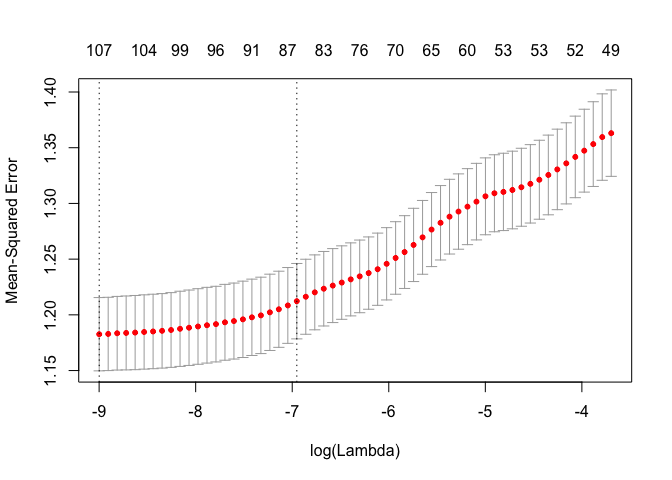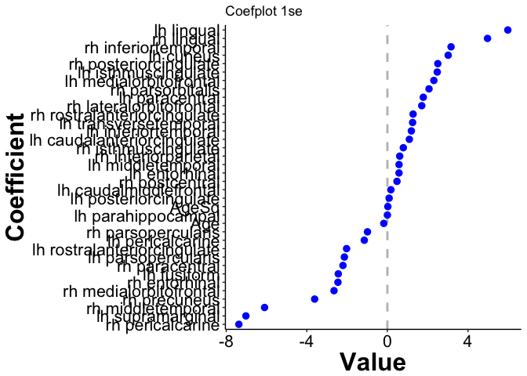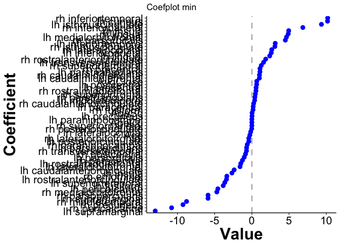

### Far All: ageCent, Gender, Brain regions

``` r
set.seed(1234)
all4 <- fit_model(data=allRegions %>% filter(Type == 'Far'), 
                  response='Rating',
                  predictors=c('ID', 'AgeCent', 
                               'Gender', regionNames_all),
                  nfolds=10
)
```

We view the coefficient path, error curve and coefplot for both `lambda.1se` and `lambda.min`.

``` r
pathSimple(all4, elementId='all4_mod')
```

<!--html_preserve-->

<script type="application/json" data-for="all4_mod">{"x":{"attrs":{"axes":{"x":{"pixelsPerLabel":60},"y":[]},"labels":["lambda","AgeCent","GenderF","GenderM","lh_caudalanteriorcingulate_thickness","lh_caudalmiddlefrontal_thickness","lh_cuneus_thickness","lh_entorhinal_thickness","lh_fusiform_thickness","lh_inferiorparietal_thickness","lh_inferiortemporal_thickness","lh_isthmuscingulate_thickness","lh_lateraloccipital_thickness","lh_lateralorbitofrontal_thickness","lh_lingual_thickness","lh_medialorbitofrontal_thickness","lh_middletemporal_thickness","lh_parahippocampal_thickness","lh_paracentral_thickness","lh_parsopercularis_thickness","lh_parsorbitalis_thickness","lh_parstriangularis_thickness","lh_pericalcarine_thickness","lh_postcentral_thickness","lh_posteriorcingulate_thickness","lh_precentral_thickness","lh_precuneus_thickness","lh_rostralanteriorcingulate_thickness","lh_rostralmiddlefrontal_thickness","lh_superiorfrontal_thickness","lh_superiorparietal_thickness","lh_superiortemporal_thickness","lh_supramarginal_thickness","lh_transversetemporal_thickness","lh_insula_thickness","rh_caudalanteriorcingulate_thickness","rh_caudalmiddlefrontal_thickness","rh_cuneus_thickness","rh_entorhinal_thickness","rh_fusiform_thickness","rh_inferiorparietal_thickness","rh_inferiortemporal_thickness","rh_isthmuscingulate_thickness","rh_lateraloccipital_thickness","rh_lateralorbitofrontal_thickness","rh_lingual_thickness","rh_medialorbitofrontal_thickness","rh_middletemporal_thickness","rh_parahippocampal_thickness","rh_paracentral_thickness","rh_parsopercularis_thickness","rh_parsorbitalis_thickness","rh_parstriangularis_thickness","rh_pericalcarine_thickness","rh_postcentral_thickness","rh_posteriorcingulate_thickness","rh_precentral_thickness","rh_precuneus_thickness","rh_rostralanteriorcingulate_thickness","rh_rostralmiddlefrontal_thickness","rh_superiorfrontal_thickness","rh_superiorparietal_thickness","rh_superiortemporal_thickness","rh_supramarginal_thickness","rh_transversetemporal_thickness","rh_insula_thickness"],"retainDateWindow":false,"xlabel":"Log Lambda","ylabel":"Coefficients","legend":"onmouseover","labelsDivWidth":250,"labelsShowZeroValues":true,"labelsSeparateLines":false,"showRangeSelector":true,"rangeSelectorHeight":40,"rangeSelectorPlotFillColor":" #A7B1C4","rangeSelectorPlotStrokeColor":"#808FAB","interactionModel":"Dygraph.Interaction.defaultModel","highlightCircleSize":3,"highlightSeriesBackgroundAlpha":0.5,"highlightSeriesOpts":{"strokeWidth":3},"hideOverlayOnMouseOut":true},"annotations":[{"x":-10.4075962242862,"shortText":"AgeCent","text":"AgeCent","width":50,"attachAtBottom":false,"series":"AgeCent"},{"x":-10.4075962242862,"shortText":"GenderF","text":"GenderF","width":50,"attachAtBottom":false,"series":"GenderF"},{"x":-10.4075962242862,"shortText":"GenderM","text":"GenderM","width":50,"attachAtBottom":false,"series":"GenderM"},{"x":-10.4075962242862,"shortText":"lh_caudalanteriorcingulate_thickness","text":"lh_caudalanteriorcingulate_thickness","width":50,"attachAtBottom":false,"series":"lh_caudalanteriorcingulate_thickness"},{"x":-10.4075962242862,"shortText":"lh_caudalmiddlefrontal_thickness","text":"lh_caudalmiddlefrontal_thickness","width":50,"attachAtBottom":false,"series":"lh_caudalmiddlefrontal_thickness"},{"x":-10.4075962242862,"shortText":"lh_cuneus_thickness","text":"lh_cuneus_thickness","width":50,"attachAtBottom":false,"series":"lh_cuneus_thickness"},{"x":-10.4075962242862,"shortText":"lh_entorhinal_thickness","text":"lh_entorhinal_thickness","width":50,"attachAtBottom":false,"series":"lh_entorhinal_thickness"},{"x":-10.4075962242862,"shortText":"lh_fusiform_thickness","text":"lh_fusiform_thickness","width":50,"attachAtBottom":false,"series":"lh_fusiform_thickness"},{"x":-10.4075962242862,"shortText":"lh_inferiorparietal_thickness","text":"lh_inferiorparietal_thickness","width":50,"attachAtBottom":false,"series":"lh_inferiorparietal_thickness"},{"x":-10.4075962242862,"shortText":"lh_inferiortemporal_thickness","text":"lh_inferiortemporal_thickness","width":50,"attachAtBottom":false,"series":"lh_inferiortemporal_thickness"},{"x":-10.4075962242862,"shortText":"lh_isthmuscingulate_thickness","text":"lh_isthmuscingulate_thickness","width":50,"attachAtBottom":false,"series":"lh_isthmuscingulate_thickness"},{"x":-10.4075962242862,"shortText":"lh_lateraloccipital_thickness","text":"lh_lateraloccipital_thickness","width":50,"attachAtBottom":false,"series":"lh_lateraloccipital_thickness"},{"x":-10.4075962242862,"shortText":"lh_lateralorbitofrontal_thickness","text":"lh_lateralorbitofrontal_thickness","width":50,"attachAtBottom":false,"series":"lh_lateralorbitofrontal_thickness"},{"x":-10.4075962242862,"shortText":"lh_lingual_thickness","text":"lh_lingual_thickness","width":50,"attachAtBottom":false,"series":"lh_lingual_thickness"},{"x":-10.4075962242862,"shortText":"lh_medialorbitofrontal_thickness","text":"lh_medialorbitofrontal_thickness","width":50,"attachAtBottom":false,"series":"lh_medialorbitofrontal_thickness"},{"x":-10.4075962242862,"shortText":"lh_middletemporal_thickness","text":"lh_middletemporal_thickness","width":50,"attachAtBottom":false,"series":"lh_middletemporal_thickness"},{"x":-10.4075962242862,"shortText":"lh_parahippocampal_thickness","text":"lh_parahippocampal_thickness","width":50,"attachAtBottom":false,"series":"lh_parahippocampal_thickness"},{"x":-10.4075962242862,"shortText":"lh_paracentral_thickness","text":"lh_paracentral_thickness","width":50,"attachAtBottom":false,"series":"lh_paracentral_thickness"},{"x":-10.4075962242862,"shortText":"lh_parsopercularis_thickness","text":"lh_parsopercularis_thickness","width":50,"attachAtBottom":false,"series":"lh_parsopercularis_thickness"},{"x":-10.4075962242862,"shortText":"lh_parsorbitalis_thickness","text":"lh_parsorbitalis_thickness","width":50,"attachAtBottom":false,"series":"lh_parsorbitalis_thickness"},{"x":-10.4075962242862,"shortText":"lh_parstriangularis_thickness","text":"lh_parstriangularis_thickness","width":50,"attachAtBottom":false,"series":"lh_parstriangularis_thickness"},{"x":-10.4075962242862,"shortText":"lh_pericalcarine_thickness","text":"lh_pericalcarine_thickness","width":50,"attachAtBottom":false,"series":"lh_pericalcarine_thickness"},{"x":-10.4075962242862,"shortText":"lh_postcentral_thickness","text":"lh_postcentral_thickness","width":50,"attachAtBottom":false,"series":"lh_postcentral_thickness"},{"x":-10.4075962242862,"shortText":"lh_posteriorcingulate_thickness","text":"lh_posteriorcingulate_thickness","width":50,"attachAtBottom":false,"series":"lh_posteriorcingulate_thickness"},{"x":-10.4075962242862,"shortText":"lh_precentral_thickness","text":"lh_precentral_thickness","width":50,"attachAtBottom":false,"series":"lh_precentral_thickness"},{"x":-10.4075962242862,"shortText":"lh_precuneus_thickness","text":"lh_precuneus_thickness","width":50,"attachAtBottom":false,"series":"lh_precuneus_thickness"},{"x":-10.4075962242862,"shortText":"lh_rostralanteriorcingulate_thickness","text":"lh_rostralanteriorcingulate_thickness","width":50,"attachAtBottom":false,"series":"lh_rostralanteriorcingulate_thickness"},{"x":-10.4075962242862,"shortText":"lh_rostralmiddlefrontal_thickness","text":"lh_rostralmiddlefrontal_thickness","width":50,"attachAtBottom":false,"series":"lh_rostralmiddlefrontal_thickness"},{"x":-10.4075962242862,"shortText":"lh_superiorfrontal_thickness","text":"lh_superiorfrontal_thickness","width":50,"attachAtBottom":false,"series":"lh_superiorfrontal_thickness"},{"x":-10.4075962242862,"shortText":"lh_superiorparietal_thickness","text":"lh_superiorparietal_thickness","width":50,"attachAtBottom":false,"series":"lh_superiorparietal_thickness"},{"x":-10.4075962242862,"shortText":"lh_superiortemporal_thickness","text":"lh_superiortemporal_thickness","width":50,"attachAtBottom":false,"series":"lh_superiortemporal_thickness"},{"x":-10.4075962242862,"shortText":"lh_supramarginal_thickness","text":"lh_supramarginal_thickness","width":50,"attachAtBottom":false,"series":"lh_supramarginal_thickness"},{"x":-10.4075962242862,"shortText":"lh_transversetemporal_thickness","text":"lh_transversetemporal_thickness","width":50,"attachAtBottom":false,"series":"lh_transversetemporal_thickness"},{"x":-10.4075962242862,"shortText":"lh_insula_thickness","text":"lh_insula_thickness","width":50,"attachAtBottom":false,"series":"lh_insula_thickness"},{"x":-10.4075962242862,"shortText":"rh_caudalanteriorcingulate_thickness","text":"rh_caudalanteriorcingulate_thickness","width":50,"attachAtBottom":false,"series":"rh_caudalanteriorcingulate_thickness"},{"x":-10.4075962242862,"shortText":"rh_caudalmiddlefrontal_thickness","text":"rh_caudalmiddlefrontal_thickness","width":50,"attachAtBottom":false,"series":"rh_caudalmiddlefrontal_thickness"},{"x":-10.4075962242862,"shortText":"rh_cuneus_thickness","text":"rh_cuneus_thickness","width":50,"attachAtBottom":false,"series":"rh_cuneus_thickness"},{"x":-10.4075962242862,"shortText":"rh_entorhinal_thickness","text":"rh_entorhinal_thickness","width":50,"attachAtBottom":false,"series":"rh_entorhinal_thickness"},{"x":-10.4075962242862,"shortText":"rh_fusiform_thickness","text":"rh_fusiform_thickness","width":50,"attachAtBottom":false,"series":"rh_fusiform_thickness"},{"x":-10.4075962242862,"shortText":"rh_inferiorparietal_thickness","text":"rh_inferiorparietal_thickness","width":50,"attachAtBottom":false,"series":"rh_inferiorparietal_thickness"},{"x":-10.4075962242862,"shortText":"rh_inferiortemporal_thickness","text":"rh_inferiortemporal_thickness","width":50,"attachAtBottom":false,"series":"rh_inferiortemporal_thickness"},{"x":-10.4075962242862,"shortText":"rh_isthmuscingulate_thickness","text":"rh_isthmuscingulate_thickness","width":50,"attachAtBottom":false,"series":"rh_isthmuscingulate_thickness"},{"x":-10.4075962242862,"shortText":"rh_lateraloccipital_thickness","text":"rh_lateraloccipital_thickness","width":50,"attachAtBottom":false,"series":"rh_lateraloccipital_thickness"},{"x":-10.4075962242862,"shortText":"rh_lateralorbitofrontal_thickness","text":"rh_lateralorbitofrontal_thickness","width":50,"attachAtBottom":false,"series":"rh_lateralorbitofrontal_thickness"},{"x":-10.4075962242862,"shortText":"rh_lingual_thickness","text":"rh_lingual_thickness","width":50,"attachAtBottom":false,"series":"rh_lingual_thickness"},{"x":-10.4075962242862,"shortText":"rh_medialorbitofrontal_thickness","text":"rh_medialorbitofrontal_thickness","width":50,"attachAtBottom":false,"series":"rh_medialorbitofrontal_thickness"},{"x":-10.4075962242862,"shortText":"rh_middletemporal_thickness","text":"rh_middletemporal_thickness","width":50,"attachAtBottom":false,"series":"rh_middletemporal_thickness"},{"x":-10.4075962242862,"shortText":"rh_parahippocampal_thickness","text":"rh_parahippocampal_thickness","width":50,"attachAtBottom":false,"series":"rh_parahippocampal_thickness"},{"x":-10.4075962242862,"shortText":"rh_paracentral_thickness","text":"rh_paracentral_thickness","width":50,"attachAtBottom":false,"series":"rh_paracentral_thickness"},{"x":-10.4075962242862,"shortText":"rh_parsopercularis_thickness","text":"rh_parsopercularis_thickness","width":50,"attachAtBottom":false,"series":"rh_parsopercularis_thickness"},{"x":-10.4075962242862,"shortText":"rh_parsorbitalis_thickness","text":"rh_parsorbitalis_thickness","width":50,"attachAtBottom":false,"series":"rh_parsorbitalis_thickness"},{"x":-10.4075962242862,"shortText":"rh_parstriangularis_thickness","text":"rh_parstriangularis_thickness","width":50,"attachAtBottom":false,"series":"rh_parstriangularis_thickness"},{"x":-10.4075962242862,"shortText":"rh_pericalcarine_thickness","text":"rh_pericalcarine_thickness","width":50,"attachAtBottom":false,"series":"rh_pericalcarine_thickness"},{"x":-10.4075962242862,"shortText":"rh_postcentral_thickness","text":"rh_postcentral_thickness","width":50,"attachAtBottom":false,"series":"rh_postcentral_thickness"},{"x":-10.4075962242862,"shortText":"rh_posteriorcingulate_thickness","text":"rh_posteriorcingulate_thickness","width":50,"attachAtBottom":false,"series":"rh_posteriorcingulate_thickness"},{"x":-10.4075962242862,"shortText":"rh_precentral_thickness","text":"rh_precentral_thickness","width":50,"attachAtBottom":false,"series":"rh_precentral_thickness"},{"x":-10.4075962242862,"shortText":"rh_precuneus_thickness","text":"rh_precuneus_thickness","width":50,"attachAtBottom":false,"series":"rh_precuneus_thickness"},{"x":-10.4075962242862,"shortText":"rh_rostralanteriorcingulate_thickness","text":"rh_rostralanteriorcingulate_thickness","width":50,"attachAtBottom":false,"series":"rh_rostralanteriorcingulate_thickness"},{"x":-10.4075962242862,"shortText":"rh_rostralmiddlefrontal_thickness","text":"rh_rostralmiddlefrontal_thickness","width":50,"attachAtBottom":false,"series":"rh_rostralmiddlefrontal_thickness"},{"x":-10.4075962242862,"shortText":"rh_superiorfrontal_thickness","text":"rh_superiorfrontal_thickness","width":50,"attachAtBottom":false,"series":"rh_superiorfrontal_thickness"},{"x":-10.4075962242862,"shortText":"rh_superiorparietal_thickness","text":"rh_superiorparietal_thickness","width":50,"attachAtBottom":false,"series":"rh_superiorparietal_thickness"},{"x":-10.4075962242862,"shortText":"rh_superiortemporal_thickness","text":"rh_superiortemporal_thickness","width":50,"attachAtBottom":false,"series":"rh_superiortemporal_thickness"},{"x":-10.4075962242862,"shortText":"rh_supramarginal_thickness","text":"rh_supramarginal_thickness","width":50,"attachAtBottom":false,"series":"rh_supramarginal_thickness"},{"x":-10.4075962242862,"shortText":"rh_transversetemporal_thickness","text":"rh_transversetemporal_thickness","width":50,"attachAtBottom":false,"series":"rh_transversetemporal_thickness"},{"x":-10.4075962242862,"shortText":"rh_insula_thickness","text":"rh_insula_thickness","width":50,"attachAtBottom":false,"series":"rh_insula_thickness"}],"shadings":[],"events":[{"pos":-9.47725881384193,"label":"lambda.min","labelLoc":"bottom","color":"black","strokePattern":[2,2],"axis":"x"},{"pos":-6.96534780564237,"label":"lambda.1se","labelLoc":"bottom","color":"black","strokePattern":[2,2],"axis":"x"}],"format":"numeric","data":[[-10.4075962242862,-10.3145624832418,-10.2215287421974,-10.1284950011529,-10.0354612601085,-9.94242751906407,-9.84939377801964,-9.75636003697521,-9.66332629593079,-9.57029255488636,-9.47725881384193,-9.3842250727975,-9.29119133175307,-9.19815759070864,-9.10512384966422,-9.01209010861979,-8.91905636757536,-8.82602262653093,-8.7329888854865,-8.63995514444208,-8.54692140339765,-8.45388766235322,-8.36085392130879,-8.26782018026436,-8.17478643921994,-8.08175269817551,-7.98871895713108,-7.89568521608665,-7.80265147504222,-7.7096177339978,-7.61658399295337,-7.52355025190894,-7.43051651086451,-7.33748276982008,-7.24444902877566,-7.15141528773123,-7.0583815466868,-6.96534780564237,-6.87231406459794,-6.77928032355351,-6.68624658250909,-6.59321284146466,-6.50017910042023,-6.4071453593758,-6.31411161833137,-6.22107787728695,-6.12804413624252,-6.03501039519809,-5.94197665415366,-5.84894291310923,-5.75590917206481,-5.66287543102038,-5.56984168997595,-5.47680794893152,-5.38377420788709,-5.29074046684266,-5.19770672579824,-5.10467298475381,-5.01163924370938,-4.91860550266495,-4.82557176162052,-4.7325380205761,-4.63950427953167,-4.54647053848724,-4.45343679744281,-4.36040305639838,-4.26736931535396,-4.17433557430953,-4.0813018332651,-3.98826809222067,-3.89523435117624,-3.80220061013182,-3.70916686908739],[-0.312653836221112,-0.312633751608424,-0.312597511856369,-0.310662952033394,-0.310587582181398,-0.310518689379828,-0.308395342711631,-0.308020719989324,-0.307914191831575,-0.306478561068755,-0.30633158746103,-0.306063047005248,-0.303673233287033,-0.303130612563355,-0.302647981281841,-0.299601173216708,-0.29929003198379,-0.299207176678575,-0.295101595239329,-0.294619791087705,-0.294441258302256,-0.291549673433772,-0.291431649202316,-0.29070639609525,-0.289630710353605,-0.288952772817992,-0.288349477036696,-0.28770928400935,-0.281811618179839,-0.281637696015623,-0.26477859658081,-0.26294690314023,-0.253207050164909,-0.243431923278118,-0.232853818618319,-0.221601301817727,-0.210382542314624,-0.199194897664554,-0.189222208001716,-0.182746848705287,-0.176614405575947,-0.168280544131071,-0.159981102953837,-0.154459973723007,-0.149128332309088,-0.143624723659164,-0.137744929204447,-0.129142518692094,-0.122140854491706,-0.115407460515843,-0.10648167155774,-0.100240386792189,-0.0882018624732203,-0.0889315733704415,-0.0960512848463759,-0.099639498791629,-0.102869989590174,-0.105590061471195,-0.105713329089175,-0.102681153662656,-0.0992939906328679,-0.0956929731448889,-0.0916874374108201,-0.0873184607134564,-0.0825685796826465,-0.0774108365152458,-0.0717279882754779,-0.065359138611793,-0.0555463717697169,-0.0434965664239245,-0.0301983857681501,-0.015690654680351,0],[0,0,0,0,0,0,0,0,0,0,0,0,0,0,0,0,0,0,0,0,0,0,0,0,0,0,0,0,0,0,0,0,0,0,0,0,0,0,0,0,0,0,0,0,0,0,0,0,0,0,0,0,0,0,0,0,0,0,0,0,0,0,0,0,0,0,0,0,0,0,0,0,0],[0,0,0,0,0,0,0,0,0,0,0,0,0,0,0,0,0,0,0,0,0,0,0,0,0,0,0,0,0,0,0,0,0,0,0,0,0,0,0,0,0,0,0,0,0,0,0,0,0,0,0,0,0,0,0,0,0,0,0,0,0,0,0,0,0,0,0,0,0,0,0,0,0],[-0.598714322722463,-0.597441853952139,-0.595019488414729,-0.549561488088649,-0.545812087907654,-0.54224918800447,-0.479614497318585,-0.472963152460291,-0.47042954059168,-0.424981172000853,-0.42231231871524,-0.413107340451202,-0.339519274089415,-0.340280100892217,-0.328881198780693,-0.259255804008599,-0.259556710771248,-0.258813324780973,-0.157348118025412,-0.155488365333576,-0.153945405606614,-0.0804148810248043,-0.0785083768800845,-0.0543956011046265,-0.0193371412383779,0,0,0,0,0,0,0,0,0.094707814191496,0.219281457328013,0.35286299825276,0.498166449910458,0.668513569998692,0.854523926451407,0.968688754625725,1.07684509454943,1.14352913152956,1.29801496875791,1.36881010803415,1.45317325258962,1.53207042994254,1.57633892787487,1.57907528523187,1.56205668375683,1.53875754198066,1.47481625692279,1.44586350585764,1.32734778063545,1.19281707871659,1.12349594344028,1.05299850481128,0.979986327130407,0.8963006386316,0.796416705989387,0.717588389444483,0.657750195458176,0.593388093266771,0.521730600752257,0.442413171453064,0.353884749455486,0.253564077777713,0.136595148105515,0.00103725090339239,0,0,0,0,0],[0.687653321637725,0.686908522266499,0.68559663050931,0.656107665866229,0.653409130844557,0.651028723870109,0.601878379365402,0.593206435230109,0.590744372910585,0.548291776927523,0.545256432164446,0.538515529427895,0.493032328000028,0.486678257274586,0.4838175988549,0.47801774542596,0.474831081220204,0.474683785779829,0.505952952354897,0.498307493334857,0.496126944905973,0.48615846991819,0.483698961260377,0.479903721436932,0.479954049712296,0.484790099279375,0.475310153073739,0.46650582921313,0.4730162741216,0.469495392906879,0.613549839225858,0.598824852139301,0.731763633926708,0.815322633245366,0.92476913607821,1.04181595049613,1.15344353902787,1.26416955948785,1.30463616683757,1.26111842092711,1.16475979910522,1.02319536681013,1.01491339380328,0.955728378755801,0.946425319214787,0.947927758591697,0.943409503299088,0.8585037544117,0.716686808333332,0.56916673316795,0.351353209665289,0.0529457942180717,0,0,0,0,0,0,0,0,0,0,0,0,0,0,0,0,0,0,0,0,0],[15.2128792498097,15.2097618682801,15.203625412015,15.0517773237326,15.0421771110644,15.0327330424875,14.827755822211,14.8024214399968,14.7949849988993,14.6416381060391,14.631779859922,14.5994587677606,14.3079567838437,14.2759421153169,14.1999290001851,13.7611276054275,13.7399502887739,13.7318621569607,13.1857960364095,13.1571882249408,13.1440020527733,12.7403746193886,12.7290830122761,12.5555433669375,12.223128754862,11.8513471771149,11.475077346463,11.135945649619,10.0421016846356,10.0268353582793,8.68470597771985,8.59142448450526,7.81430331949432,7.18646469378869,6.45933959571772,5.62817580517374,4.73174808973012,3.70745405359557,2.54970095233787,1.28091521959232,0.223463035031288,0,0,0,0,0,0,0,0,0,0,0,0,0,0,0,0,0,0,0,0,0,0,0,0,0,0,0,0,0,0,0,0],[1.81614732527639,1.81586811497291,1.81536236828588,1.79054552023678,1.78991517373388,1.78938955353994,1.76879272380888,1.76720274111899,1.76636286998624,1.76119616734604,1.76031163272325,1.7604508963132,1.75890627106996,1.75641369603978,1.75669772317625,1.75482350353192,1.75282932484476,1.7519270784542,1.72806307275544,1.72377478024145,1.72148878618214,1.67875689890314,1.6763430343627,1.65616633849883,1.61948228681305,1.57134709398997,1.51599536493199,1.46570389036729,1.32074996662325,1.31713394800427,1.1864310342204,1.16960508030274,1.09842633344813,1.03898436692236,0.981465115473778,0.927856329946603,0.8845367007335,0.848427570667476,0.813998228113895,0.791542263029849,0.784401083594436,0.750562366076769,0.719337010871152,0.69397164517241,0.646431330288726,0.592171165902476,0.534102430981194,0.493672456857134,0.449848506634234,0.399941483595568,0.32846106572519,0.270719601359987,0.164830417774818,0.0460573103604263,0,0,0,0,0,0,0,0,0,0,0,0,0,0,0,0,0,0,0],[-5.50574832329413,-5.50513107396232,-5.50405104672276,-5.44990353474276,-5.44818398267428,-5.44674737929768,-5.39212743445452,-5.38548078061952,-5.38380718789239,-5.35483965584079,-5.35219751965976,-5.3483943756616,-5.30300849485352,-5.28825762803053,-5.27970119631855,-5.211750689533,-5.20179529302015,-5.19949611931316,-5.09012016197395,-5.07418916886939,-5.06910398769327,-4.96956081623492,-4.96581638710705,-4.9347571500515,-4.88724763842111,-4.8303713322623,-4.76552417401697,-4.70193851064803,-4.49458313659246,-4.48951168282174,-4.23487856092794,-4.19997360307242,-3.92433098789332,-3.68037947809423,-3.40560346157053,-3.07825180967274,-2.694200380397,-2.2313036952678,-1.70692178263107,-1.04049122863303,-0.420373449760124,-0.0926536074472101,0,0,0,0,0,0,0,0,0,0,0,0,0,0,0,0,0,0,0,0,0,0,0,0,0,0,0,0,0,0,0],[0.775164918880565,0.775318577877776,0.77571349819103,0.788347872829976,0.78884756567082,0.789457046451745,0.807026443334114,0.809086023123158,0.809095362725165,0.819272865209865,0.818507450067088,0.818710944021591,0.828490314229548,0.824148693339624,0.820734005104568,0.81957941193263,0.816518587934381,0.814754748321588,0.785162324659494,0.781955809134892,0.779615758232948,0.73409424598398,0.728993048770878,0.666708946549987,0.531354819035677,0.380529173421524,0.237480880933155,0.132472093066915,5.50202373495025e-05,0,0,0,0,0,0,0,0,0,0,0,0,0,0,0,0,0,0,0,0,0,0,0,0,0,0,0,0,0,0,0,0,0,0,0,0,0,0,0,0,0,0,0,0],[3.2721643873259,3.27146689258019,3.27015359012125,3.2120591379175,3.20992300366308,3.20798234311243,3.13774343264312,3.12952049081646,3.12729386728566,3.0853828171329,3.08210158207384,3.07429483713506,2.98416458559786,2.97139592233467,2.94811434981737,2.7649195017938,2.75260782726371,2.74863375039617,2.50695368233303,2.49153636615181,2.48525289063212,2.33677488713562,2.33254382985506,2.28559528249986,2.20867015296572,2.13293342254339,2.06702492793091,2.01909399867043,1.8249904600924,1.82255477260586,1.61849510178415,1.60914952031296,1.4888956037071,1.39311637427516,1.28877172470623,1.16884927268643,1.03514570515059,0.888508023911604,0.746411798864432,0.512723761064503,0.253382684670326,0.0427464203012423,0.00330915423442743,0.000403627408930104,0,0,0,0,0,0,0,0,0,0,0,0,0,0,0,0,0,0,0,0,0,0,0,0,0,0,0,0,0],[4.02119271218647,4.02085080847344,4.02020705940529,3.99237437635954,3.99132547104217,3.99033850662061,3.95288405726344,3.94937520866686,3.94793169042331,3.92769127782021,3.925929829071,3.92203920767446,3.87653270826968,3.87147065873105,3.85967487457335,3.7437454072188,3.73242506195311,3.72846251176117,3.5201355293833,3.50217369957481,3.49429795539845,3.34229315661189,3.33654631655639,3.28571863636544,3.19261093380336,3.08848234494589,2.99589539876514,2.93411902828867,2.71451572989199,2.71123163987739,2.42700436122583,2.40569618290902,2.27384521481082,2.17720852690846,2.05958958994521,1.91025660700632,1.72445680674777,1.4899709987425,1.23947710422527,0.913654868624569,0.518841352290341,0.314504603045361,0.160959960222799,0.0852823578774301,0.000598163311985904,0,0,0,0,0,0,0,0,0,0,0,0,0,0,0,0,0,0,0,0,0,0,0,0,0,0,0,0],[1.28248086789698,1.28095655463363,1.27795414719932,1.14467724724558,1.13987006819982,1.13514104763478,0.997646964271514,0.978934227338621,0.972237346042213,0.895702641287111,0.887077404591109,0.873866076908899,0.747135796463861,0.713576213875571,0.682236692256124,0.479039671746025,0.458074731085204,0.451497614355764,0.214858344467847,0.189149496368229,0.178497897446933,0.0326067972119847,0.02586127334581,0,0,0,0,0,0,0,0,0,0,0,0,0,0,0,0,0,0,0,0,0,0,0,0,0,0,0,0,0,0,0,0,0,0,0,0,0,0,0,0,0,0,0,0,0,0,0,0,0,0],[-0.215098170604918,-0.214889052955397,-0.214493678130386,-0.25967418852565,-0.25956468308376,-0.259519489369524,-0.283952447309861,-0.290903598756641,-0.295513117711719,-0.300419511290392,-0.306965057772596,-0.307687502180121,-0.312830369363228,-0.330716987722854,-0.325040341209276,-0.262950842812195,-0.264252816830564,-0.264852319032828,-0.134034207704256,-0.132672833627908,-0.132693901321745,-0.0600405399318133,-0.0604894739813275,-0.0402972819529312,-0.0132398947073639,-0.000140357374790257,0,0,0,0,0,0,0,0,0,0,0,0,0,0,0,0,0,0,0,0,0,0,0,0,0,0,0,0,0,0,0,0,0,0,0,0,0,0,0,0,0,0,0,0,0,0,0],[5.06760559700517,5.06714753726128,5.06642882422048,4.99690506553934,4.99584782389943,4.99514233701393,4.94825564427099,4.9393635904244,4.93515343790427,4.9257552247016,4.9199554969651,4.92221496023912,4.94090933728859,4.9259052003402,4.94028813658406,5.04460371715271,5.03910844794233,5.0382619002026,5.1906474819967,5.17917909726394,5.1748435354081,5.22651429000005,5.22139573581341,5.23935836030368,5.27622107699347,5.30878989852299,5.33401936028297,5.34425817977641,5.27744049468263,5.2698118531363,5.2719942757198,5.24876890417807,5.32862732482395,5.40615182625919,5.48659519203447,5.58314677110493,5.69656314330676,5.83737898746095,6.01903254291251,6.19533896942506,6.21380005133579,6.10425664760196,5.93776597242714,5.74455531170116,5.57384903515201,5.36172991573053,5.09268339992557,4.75450192409038,4.38716439152696,3.99758022796892,3.45917069665183,3.14854457854019,2.26948903707561,1.78715681947465,1.58218847609148,1.33596729104742,1.05846668469933,0.731191158853268,0.243378650446822,0,0,0,0,0,0,0,0,0,0,0,0,0,0],[-0.369910806771934,-0.368634064124921,-0.366169495662091,-0.267041996377518,-0.263238343049806,-0.259593700410999,-0.161728267047474,-0.149551876946655,-0.146418162846506,-0.094478775947953,-0.0908807511686299,-0.082287436465819,-0.0143486774237421,-0.0059330193705875,-0.000519904965602156,0,0,0,0,0,0,0.0535784782790656,0.0544069650959201,0.0872011686368868,0.154718979191847,0.234664705526201,0.314027276114288,0.378877421865226,0.610252235225201,0.610276275051173,0.891355008980359,0.893350027987055,1.02397903402568,1.11338474247218,1.20189987259662,1.30092565146828,1.39962309244905,1.51633343798318,1.66985587756481,1.86275748964296,1.96134886000355,1.87918802950286,1.69510321070452,1.54635726073953,1.40356260495309,1.25949995310558,1.08125656541566,0.887809044770187,0.696534777670702,0.513278517492607,0.334309085271632,0.0888155131567887,0,0,0,0,0,0,0,0,0,0,0,0,0,0,0,0,0,0,0,0,0],[5.16636061586313,5.16453234668741,5.16094830606158,5.12769178148088,5.12217168321318,5.11679257906226,5.05144062707566,5.04288691969604,5.04119319129939,4.96973519881726,4.96843994928278,4.9529103512674,4.83552572786044,4.83382705239501,4.7992130082044,4.64839037151029,4.64919403654114,4.64831356269798,4.45858372125982,4.45829508857376,4.4573454454989,4.28969040151892,4.28776145866041,4.20159217150636,4.03419561321334,3.83561691984101,3.63717716266969,3.47312867156746,3.04425109046906,3.04155455333686,2.8498783377346,2.84783668349621,2.5787021701749,2.35234171643501,2.1057784856388,1.8263448665543,1.52237191897178,1.15531260450999,0.701718508217054,0.185117961039182,0,0,0,0,0,0,0,0,0,0,0,0,0,0,0,0,0,0,0,0,0,0,0,0,0,0,0,0,0,0,0,0,0],[-2.72767300189876,-2.72729346451609,-2.72662941327641,-2.70679744769491,-2.70581714057089,-2.70500218898678,-2.68760264502615,-2.68549729397816,-2.68477020456627,-2.67443185935704,-2.67317519919949,-2.67096985816927,-2.65376061045234,-2.64760519633007,-2.63897947649184,-2.58829315530995,-2.58114266875015,-2.57906494140288,-2.50793177179509,-2.49782174878482,-2.49414173325452,-2.43321515972606,-2.42982458482728,-2.40300764948058,-2.35874528650849,-2.30586090779016,-2.24674504746434,-2.1847912540103,-1.97390834773333,-1.96830068224951,-1.63149322678743,-1.58901314726786,-1.37097615158392,-1.20968333533589,-1.03120089784258,-0.839982537360311,-0.649083919917267,-0.452079119174621,-0.254511866741701,-0.0480764318787156,0,0,0,0,0,0,0,0,0,0,0,0,0,0,0,0,0,0,0,0,0,0,0,0,0,0,0,0,0,0,0,0,0],[3.03564604262056,3.03560693290218,3.03555366571405,2.93402043120748,2.93395258098553,2.93396948307718,2.85260870715858,2.8433316493146,2.84067847102186,2.82342575113648,2.81977930479754,2.8207472508652,2.79556340967454,2.7763043570261,2.77775539350269,2.75472336675491,2.74549860229798,2.74375253290636,2.69066774393915,2.67587781562506,2.67100257697149,2.61665860595603,2.61228113032545,2.60034389927334,2.5861442305566,2.5748688091665,2.57965162924772,2.60697604237968,2.61929562456626,2.61531233268813,2.42904991846869,2.38891437621734,2.24605087670139,2.1457637707864,2.05662844702486,1.96861125700668,1.89064769497627,1.81869299516193,1.7548542561545,1.69397868206205,1.68191179837207,1.60234620400121,1.49696001973875,1.4024310529092,1.29106442796518,1.14568129009274,0.976126539062567,0.860982177819055,0.801168159594726,0.723208626825982,0.614445471054012,0.558731631824702,0.297998408111427,0.321295574027464,0.244938612034979,0.189038372104033,0.118481186802148,0.00763853985568384,0,0,0,0,0,0,0,0,0,0,0,0,0,0,0],[0.117389356489815,0.117111634985057,0.116682154740243,0.0516411523968833,0.0507672033398219,0.0501308420772406,0.00747875466057213,0.00166654342962834,0,0.000641927216138239,0,0,0,0,0,0,0,0,0,0,0,0,0,0,0,0,0,0,-0.200929359060976,-0.203237608087386,-0.915642465543854,-0.969602711192727,-1.29382126493702,-1.49392697947281,-1.70932207414137,-1.93596689816568,-2.14735814774188,-2.34664528929301,-2.49965922981155,-2.44186131715993,-2.22287984967489,-1.95630260878402,-1.72413972032004,-1.51763922534963,-1.26131198170124,-1.01741453471332,-0.770855180237975,-0.521214618706211,-0.30394906468287,-0.0495419909852362,0,0,0,0,0,0,0,0,0,0,0,0,0,0,0,0,0,0,0,0,0,0,0],[-1.51463387647541,-1.51333381043374,-1.5107977078191,-1.41258670278475,-1.40860197674519,-1.40472151972347,-1.29357627446591,-1.27926871297245,-1.27478504958724,-1.20601371068912,-1.20000620919536,-1.1858058734584,-1.04134972335967,-1.01687105515405,-0.985158870622125,-0.804650361507538,-0.794077245236893,-0.790592903934988,-0.62002687475103,-0.609262700612571,-0.604899413344472,-0.508946828749765,-0.506126972760135,-0.47139108179496,-0.411379825054646,-0.355291955346518,-0.313182160757011,-0.291157319879981,-0.213882754212595,-0.211747471663354,-0.0242747011881945,-0.0170602119569714,0,0,0,0,0,0,0,0,0,0,0,0,0,0,0,0,0,0,0,0,0,0,0,0,0,0,0,0,0,0,0,0,0,0,0,0,0,0,0,0,0],[1.2229141823687,1.22091746034008,1.21700449515329,1.13280218067605,1.12735270802659,1.12205337791933,1.00884456911054,0.9967448163982,0.993536689170404,0.915932272345503,0.912086200307145,0.897655347814879,0.771906476817854,0.762222094597901,0.732817072746741,0.557402030110218,0.550217820478778,0.547103321703701,0.345016936699965,0.337397140618989,0.333531354847502,0.214323274797402,0.211268569855862,0.169383764122307,0.0991787358135866,0.0333937781360559,0,0,0,0,0,0,0,0,0,0,0,0,0,-0.0368925093147784,-0.101637183099056,-0.024722670888366,0,0,0,0,0,0,0,0,0,0,0,0,0,0,0,0,0,0,0,0,0,0,0,0,0,0,0,0,0,0,0],[-8.02974964209318,-8.02755422394455,-8.02342429046107,-7.84965264711724,-7.84238984650929,-7.83556350411784,-7.63449689382403,-7.60441960325062,-7.59554752369889,-7.46386407083323,-7.45126226786624,-7.427809185231,-7.19331709484999,-7.13793030795519,-7.08374680517032,-6.73924864675629,-6.70771936652478,-6.69840147107018,-6.26984572129702,-6.22919650767226,-6.21404069041063,-5.90533419690706,-5.89344780423413,-5.78046002557728,-5.57943415034226,-5.35200739486591,-5.12683940665608,-4.94382699116823,-4.33365764891983,-4.32320380378329,-3.59982608493592,-3.55798996388892,-3.24546341441988,-2.98949066000888,-2.69074421061911,-2.35312647905099,-1.99919394539081,-1.62099515967294,-1.18571485176216,-0.687061800076292,-0.261972548302522,-0.145229480471864,-0.00484968534808577,0,0,0,0,0,0,0,0,0,0,0,0,0,0,0,0,0,0,0,0,0,0,0,0,0,0,0,0,0,0],[3.83475780955671,3.83321756452885,3.8303148646381,3.72001360422658,3.71493460040197,3.71017798929018,3.58125369830875,3.56400757296803,3.55862296162065,3.47056747329591,3.46341785207799,3.44659574068257,3.28783357379021,3.26403451484948,3.22193653948226,3.00825515455014,2.99769755764848,2.99388828664273,2.77922419213465,2.76827535420929,2.76333946707387,2.60240978787707,2.59765415810574,2.52519218624816,2.38796088551944,2.22331213783559,2.0312177076457,1.85904577244279,1.36083129942471,1.35596890013145,1.06711719620469,1.04291025670094,0.791291027072648,0.595391036665178,0.359360351153195,0.14139490845939,0.000733674540284905,0,0,0,0,0,0,0,0,0,0,0,0,0,0,0,0,0,0,0,0,0,0,0,0,0,0,0,0,0,0,0,0,0,0,0,0],[0.268422096870977,0.268372162900388,0.268290614405526,0.318389091640486,0.318105020446994,0.317818758799888,0.361574085190065,0.365302809608242,0.367019447619587,0.368187564097884,0.369941379872378,0.367086556313299,0.372252537012922,0.377852204635737,0.370098024710388,0.352663945407286,0.354689830007522,0.354722577421457,0.33629742866382,0.340381966174181,0.3413935618438,0.344214328712154,0.345673967963174,0.349731681405322,0.366871922632363,0.39887969525977,0.421456612438474,0.417623738152973,0.552938558475396,0.554374068875703,0.860293204979509,0.863059123549272,0.864170809831443,0.794113185032106,0.708155413549356,0.623299706332176,0.532157555706616,0.421499709892791,0.288351766242882,0.102771990375387,0.000603905351609756,0,0,0,0,0,0,0,0,0,0,0,0,0,0,0,0,0,0,0,0,0,0,0,0,0,0,0,0,0,0,0,0],[-0.969980898475652,-0.967945362711962,-0.964018532287071,-0.868716415699166,-0.862976885365672,-0.857527293410621,-0.719245933538648,-0.705543501840973,-0.702946585465237,-0.607905448105139,-0.604700525326143,-0.587847696923911,-0.412301587520716,-0.395655754777908,-0.358258365653836,-0.142427721981432,-0.135875153481581,-0.134109492446167,-0.00080673053937276,-0.000251225328096866,0,0,0,0,0,0,0,0,0,0,0.124932427465682,0.122560218172512,0.108158783737727,0.111781290478588,0.111692073858051,0.106747605699752,0.0876732081613368,0,0,0,0,0,0,0,0,0,0,0,0,0,0,0,0,0,0,0,0,0,0,0,0,0,0,0,0,0,0,0,0,0,0,0,0],[0.0474799735345418,0.0465905034315373,0.0448714972715954,0.0291970366215693,0.0273166729130352,0.0255206113055447,0.00567354541325624,0.00586655750812549,0.00539620134554859,0,0,0,0,0,0,0,0,0,0,0,0,0,0,0,0,0,0,0,0,0,0,0,0,0,0,0,0,0,0,0,0,0,0,0,0,0,0,0,0,0,0,0,0,0,0,0,0,0,0,0,0,0,0,0,0,0,0,0,0,0,0,0,0],[-3.05579434095585,-3.05549361101635,-3.05496861195309,-3.04727243802208,-3.04611587143216,-3.04507144403012,-3.02687108372031,-3.02289862459756,-3.02131467313672,-2.99858640713882,-2.99606645453454,-2.99015120041313,-2.93212304818459,-2.92243305801469,-2.90212780594979,-2.77038288501151,-2.76138003550331,-2.75834862683727,-2.59197045184163,-2.58151534839951,-2.57740343724078,-2.48372841291707,-2.48067767190379,-2.45033190856954,-2.40152582706475,-2.35124711203256,-2.30435803234386,-2.26670422749293,-2.17376609939954,-2.17121797028796,-2.08360669060716,-2.06643633939343,-1.97406194798259,-1.90087875085867,-1.81842133009526,-1.72270326325054,-1.61757375208446,-1.51153549543501,-1.41409668344349,-1.31714040588565,-1.20480527353213,-1.14152915983275,-1.05604360008669,-0.97727399032491,-0.895291989737853,-0.810830003194181,-0.729018575386742,-0.646036976300737,-0.567934541163335,-0.494468643302638,-0.399290393383419,-0.280548262714562,-0.17821713739185,-0.0106829019091452,0,0,0,0,0,0,0,0,0,0,0,0,0,0,0,0,0,0,0],[-0.25898231209662,-0.258136442799425,-0.256601161184433,-0.174338930414643,-0.171759858800835,-0.169494475706762,-0.0918639210258062,-0.0804736729917365,-0.0767490566603857,-0.040729713096852,-0.0360024911838574,-0.0324313638059752,-0.00944790819336945,0,0,0,0,0,0,0,0,0,0,0,0,0.00966953538863156,0.0449195284859565,0.0693699303763615,0.128382493770477,0.128713717716249,0.140958120278404,0.14960677793884,0.13656102923864,0.113737802235416,0.0883982803505459,0.0613689696934038,0.0343941631001182,0.00727863711219091,0,0,0,0,0,0,0,0,0,0,0,0,0,0,0,0,0,0,0,0,0,0,0,0,0,0,0,0,0,0,0,0,0,0,0],[0.29437560413809,0.29306693450171,0.2905975777083,0.212278774753227,0.208706717337893,0.20545515682394,0.12190593653961,0.113820012648996,0.112265786764433,0.0701072602871427,0.0686283765069819,0.0630608343553737,0.0187475500388173,0.0158627061821662,0.0106830956252321,0.000613062069629085,0.000280503252151441,0,0,0,0,0,0,0,0,0,0,0,0,0,0,0,0,0,0,0,0,0,0,0,0,0,0,0,0,0,0,0,0,0,0,0,0,0,0,0,0,0,0,0,0,0,0,0,0,0,0,0,0,0,0,0,0],[-0.458851036751039,-0.457516681028774,-0.454971398030743,-0.397883414122069,-0.394481426728014,-0.391329991544341,-0.315299639713545,-0.308522367252822,-0.30861257327643,-0.259392314660916,-0.259804909938363,-0.251957681624965,-0.157518821493303,-0.156253366543537,-0.141449708102084,-0.0578194009329223,-0.0601500651206225,-0.0618323683564034,-0.00439210630383055,-0.00868220365094931,-0.0133858784208262,-0.000710461369480923,-0.000280345641035487,0,0,0,0,0,0,0,0,0,0,0,0,0,0,0,0,0,0,0,0,0,0,0,0,0,0,0,0,0,0,0,0,0,0,0,0,0,0,0,0,0,0,0,0,0,0,0,0,0,0],[-4.14243324693937,-4.1406037709056,-4.13706368307618,-3.98966681245136,-3.98393239287838,-3.9784115548442,-3.81977891987618,-3.79772608803983,-3.78938372469172,-3.69845637833988,-3.68733414994303,-3.67120564901358,-3.5050543098209,-3.46218550430512,-3.41970529248879,-3.11084038317251,-3.07780064110892,-3.06697237494626,-2.60421902140187,-2.55964990537258,-2.54087339329441,-2.18899533352187,-2.17472903551621,-2.03941778367922,-1.78344791168984,-1.50176033244131,-1.25619904193234,-1.08083246891582,-0.556906942520723,-0.549497828259532,-0.0148206613506884,0,0,0,0,0,0,0,0,0,0,0,0,0,0,0,0,0,0,0,0,0,0,0,0,0,0,0,0,0,0,0,0,0,0,0,0,0,0,0,0,0,0],[-16.2423511705465,-16.2395900574153,-16.2342090275519,-16.0345038154316,-16.0249141469655,-16.0156094130871,-15.7696867423406,-15.7351207380116,-15.7242153988482,-15.5521925202704,-15.5379042598411,-15.5056414660774,-15.2054395804625,-15.1513761630252,-15.0719101759761,-14.6155598487015,-14.5848685165122,-14.5739686736269,-14.0116621038187,-13.9718886499968,-13.9543817199147,-13.5393531636424,-13.5259658985026,-13.3532999003463,-13.034571025155,-12.6968691541252,-12.3939816784914,-12.1532935439786,-11.4525587254335,-11.4437337639821,-10.9218500920257,-10.8660178805244,-10.3845696300999,-9.95821282352626,-9.46470012514193,-8.92444170435619,-8.37573698547859,-7.79821485915347,-7.17443829354413,-6.41474061055747,-5.68821356683634,-5.34566787664963,-4.95318466775819,-4.67362037487446,-4.3967303293625,-4.09396455803523,-3.7254008966197,-3.24241029426577,-2.75035363348489,-2.25433785992302,-1.53868080541333,-0.950510871946562,-0.0879353064273441,0,0,0,0,0,0,0,0,0,0,0,0,0,0,0,0,0,0,0,0],[3.64665360763602,3.64499290939524,3.64171910605086,3.54352721019042,3.53887892759318,3.53434977148902,3.41807582013797,3.4059451882709,3.40398854685725,3.32892463577842,3.32648771451316,3.31305960841475,3.17752173916374,3.16320545381772,3.13334440469873,2.9556126752187,2.94730625957644,2.94492437778004,2.72837394860692,2.71639326120655,2.71235072116328,2.55499956957401,2.55132318919904,2.48979816558246,2.38269793855183,2.26423281050667,2.15637888130581,2.07423651541678,1.87644492085617,1.87362065536893,1.70567427328395,1.689329631123,1.57615794030995,1.45939096502852,1.33271069005532,1.2032530062574,1.08289494949959,0.973249976632317,0.866839377681353,0.730914221361894,0.609774202264005,0.525528380045658,0.433320365965808,0.382238411412857,0.284761014323706,0.172593179616467,0.0637985846038226,4.57103379408904e-05,0,0,0,0,0,0,0,0,0,0,0,0,0,0,0,0,0,0,0,0,0,0,0,0,0],[-2.83763334073661,-2.83537932096435,-2.83091882463557,-2.63078996577193,-2.62467796209245,-2.61871487540846,-2.41597614692582,-2.39204333404569,-2.38464786860155,-2.28287862194554,-2.27306196348088,-2.25694241352103,-2.07912914309269,-2.04089776120294,-2.00603193280173,-1.78820112298944,-1.76694911236375,-1.76017441194573,-1.50851496200935,-1.47802615812294,-1.46582586908378,-1.27607245359358,-1.26645318385313,-1.20156473944659,-1.08641949000962,-0.964200642810296,-0.849016278444145,-0.765682245868269,-0.516911086984543,-0.509061623499481,-0.143442310028679,-0.108367892356246,-0.0381796656407538,-0.00694917848783575,0,0,0,0,0,0,0,0,0,0,0,0,0,0,0,0,0,0,0,0,0,0,0,0,0,0,0,0,0,0,0,0,0,0,0,0,0,0,0],[-0.330659787062614,-0.330868395754495,-0.331420593829983,-0.329654505528115,-0.329629758183061,-0.329829847748009,-0.335737383591596,-0.332728285012123,-0.330926278362173,-0.331469356944099,-0.328487158759492,-0.328500176926787,-0.347342250161103,-0.336171622286006,-0.331966507665781,-0.309598952205757,-0.299851263473855,-0.296748559127382,-0.242104027313576,-0.230015505966913,-0.224638324005412,-0.167872862244156,-0.163596212841034,-0.13952354407824,-0.0996158443252362,-0.057347822140636,-0.0190126246942835,0,0,0,0,0,0,0,0,0,-0.00848045632276708,-0.0576657183973085,-0.118525918761804,-0.134155010214083,-0.0870272962434764,-0.00334183486556367,0,0,0,0,0,0,0,0,0,0,0,0,0,0,0,0,0,0,0,0,0,0,0,0,0,0,0,0,0,0,0],[0.616005007668827,0.616158366855824,0.616604771365169,0.628991651966798,0.628994214020435,0.62927519768019,0.636668214322763,0.636167809013887,0.636014849748096,0.637537795205349,0.637159650297317,0.637265392151224,0.651367882425243,0.656502153205762,0.655175617067671,0.6432675660658,0.64815832122817,0.648770087515333,0.633363410576509,0.63814541828977,0.638710549387891,0.607070825160156,0.605698783564014,0.579293965422437,0.524147201457411,0.465220663625623,0.40953351615037,0.373195534990053,0.274899833686622,0.272399792015761,0.16163088231107,0.153185441606962,0.0639655125351371,0,0,0,0,0,0,0,0,0,0,0,0,0,0,0,0,0,0,0,0,0,0,0,0,0,0,0,0,0,0,0,0,0,0,0,0,0,0,0,0],[1.83761181075128,1.83596485553091,1.83281670671053,1.72105766380846,1.71528741939843,1.70977651822096,1.56229565815891,1.54074043478518,1.53316814538881,1.42369449586913,1.41292474490955,1.39098009181592,1.19280003215733,1.15323899005164,1.10032457197617,0.820689687956846,0.796592886798787,0.788312988666822,0.501822512379849,0.476818984567255,0.465983512155445,0.292260838699656,0.284507921803972,0.2212238421777,0.120136324904537,0.0292624749006831,0,0,0,0,0,0,0,0,0,0,0,0,0,0,0,0,0,0,0,0,0,0,0,0,0,0,0,0,0,0,0,0,0,0,0,0,0,0,0,0,0,0,0,0,0,0,0],[-3.49618688715186,-3.49591488102971,-3.49544224848995,-3.46363351901767,-3.46259575614817,-3.46168927404972,-3.4299190783397,-3.42404806612086,-3.42260755218851,-3.40222772466752,-3.40006623536894,-3.39676193585371,-3.36308167400796,-3.35131639411564,-3.33965154384153,-3.27006637298955,-3.26169252256563,-3.25931227004267,-3.16119184418063,-3.1497747654544,-3.1455848296053,-3.07026494666769,-3.06683960577712,-3.03712794937144,-2.98724578932534,-2.93183749108913,-2.87983231027153,-2.8367762422146,-2.70689944429215,-2.70421417747305,-2.58733990359311,-2.56428141541247,-2.46969887167643,-2.3828369982654,-2.29534200220935,-2.21092311464682,-2.12724509225868,-2.04557576351425,-1.97501642595533,-1.94337676587909,-1.92124048199821,-1.89890123530757,-1.82737889204512,-1.75971486927401,-1.70208988341489,-1.64292199907462,-1.58246803220402,-1.55500570469121,-1.51557633972641,-1.4751928703841,-1.41996487387636,-1.37210936267522,-1.28167873583285,-1.16502734079123,-1.09605123065734,-1.05021984204427,-0.995910924770234,-0.934112251486397,-0.871264525024154,-0.802859963086438,-0.741660616637058,-0.676871977526518,-0.604349902573019,-0.524763901000321,-0.437538910951859,-0.342233519588255,-0.238497833070277,-0.134630003438444,-0.00100043763959352,0,0,0,0],[-0.769140982461236,-0.766930730752037,-0.762606101297542,-0.616738548055629,-0.610236254160486,-0.603893477823779,-0.440183250185702,-0.419978026818702,-0.413243581570638,-0.314964644871481,-0.30664892400176,-0.289511333727409,-0.137338700072932,-0.116429116958702,-0.0928143043866699,-0.00276571258389175,-0.000468726850281722,0,0,0,0,0,0,0,0,0,0,0,6.33704930305504e-05,0,0,0,0,0,0,0,0,0,0,0,0,0,0,0,0,0,0,0,0,0,0,0,0,0,0,0,0,0,0,0,0,0,0,0,0,0,0,0,0,0,0,0,0],[6.25771551365638,6.25531770685588,6.25069826123704,6.12145946368955,6.1139275688083,6.10670854980186,5.94272692145316,5.91887741493533,5.91085613717917,5.78930148399026,5.77806639274202,5.7546218232404,5.54224102634624,5.50193350046691,5.44693130960912,5.13454132247554,5.10839077138002,5.09980074074977,4.72938058573761,4.69809694634027,4.68445197007603,4.44325996514532,4.43378999566046,4.34537666927164,4.19076229768891,4.02064596052135,3.84595054187747,3.70615295453603,3.20532269640603,3.19498576079842,2.65586668489434,2.60116448465839,2.24160292599284,1.91063001629942,1.50655824354777,1.08054851773923,0.69790304040443,0.360521560352721,0.100904389834808,0,0,0,0,0,0,0,0,0,0,0,0,0,0,0,0,0,0,0,0,0,0,0,0,0,0,0,0,0,0,0,0,0,0],[9.6941591264211,9.69038935040584,9.68293363520224,9.39222126546597,9.3810333120855,9.37005771494916,9.05143849103278,9.01197672508198,8.99918284444116,8.81093963069911,8.79324217633067,8.75953985413478,8.42320048693486,8.35340204676245,8.28297420580131,7.88439659783747,7.85260723463525,7.84252568896803,7.4244480088261,7.38661948479867,7.37105388334598,7.10368976957181,7.0923618710199,6.99794016742566,6.82439914974178,6.63275761117304,6.44750553120493,6.29413745872033,5.77105283223174,5.75996981033943,5.10534695998747,5.04936387834438,4.84251580769734,4.6377058722027,4.37715135948909,4.06537572164764,3.71720981681628,3.33526887737208,2.95746745965786,2.63094767173645,2.19918816933047,1.91070557260924,1.61054523705119,1.39503568164987,1.1543068327332,0.930703146322292,0.711984940464586,0.464783198441509,0.234633533726735,0.000324082220920271,0,0,0,0,0,0,0,0,0,0,0,0,0,0,0,0,0,0,0,0,0,0,0],[8.29972770933302,8.29717795228236,8.29207430253389,8.14977085653824,8.14163246205476,8.13345384140412,7.95434751791321,7.93155672162574,7.92336487629409,7.7948359438049,7.78479262261533,7.75876634142575,7.52625320515893,7.49655608957023,7.44072629092994,7.10448047643173,7.08999873925099,7.08367518279459,6.65254364876891,6.63588852476525,6.62711897985546,6.31064972293909,6.30392246184023,6.17889490001374,5.94422981321458,5.69284470617126,5.46718701764823,5.28499017822093,4.74979014253712,4.7448363804303,4.29059758122621,4.2743940325957,3.97377645026237,3.70160523327103,3.37774031102383,3.00044393256749,2.59446124367556,2.12829896373242,1.59515332165028,0.901966623513873,0.323265819163083,0.0801294852597489,0.00885519253084173,0.013700449103211,0,0,0,0,0,0,0,0,0,0,0,0,0,0,0,0,0,0,0,0,0,0,0,0,0,0,0,0,0],[4.27216121948762,4.27040230733196,4.267029245038,4.04825760720832,4.04254295973788,4.03713609663591,3.81801885142922,3.78773198068944,3.77756768342446,3.66310403554143,3.64941342582756,3.63180204665766,3.42795981565639,3.37169808880013,3.32445238045757,3.03073238160302,3.00241076241736,2.99354894086207,2.62913274248049,2.59034216862434,2.57392712983192,2.28381634224791,2.27073136575933,2.14861963787043,1.92036292109463,1.6829353189143,1.46603864196743,1.30227096568089,0.856118672496798,0.847961332279209,0.434858377255599,0.389693494006797,0.217831284289032,0.0635523641403099,0,0,0,0,0,0,0,0,0,0,0,0,0,0,0,0,0,0,0,0,0,0,0,0,0,0,0,0,0,0,0,0,0,0,0,0,0,0,0],[0.445764826633805,0.445717268885076,0.44560251948625,0.424346097580283,0.424246706010237,0.424115676389256,0.4104792053092,0.407686152145389,0.406014754346047,0.405486916964736,0.403238504508891,0.404199243884119,0.412018229635932,0.405429155875976,0.410771716446255,0.437563756460523,0.434259811298707,0.433117048568356,0.479459887472616,0.478152639185382,0.477002747479183,0.515867518248283,0.515863078762585,0.539528335636146,0.587832444221906,0.644391246194991,0.708133851216085,0.762610994145652,0.905906522432,0.905818668457357,0.927275224515375,0.918428940214639,0.889468205195082,0.889212676369173,0.900955173823485,0.920757474996733,0.94874154662696,0.994909079124661,1.00867411431538,1.00043625965963,0.979599290597256,1.02067835382415,1.02387063033571,1.03314031067565,1.05072415581052,1.05763785718093,1.06055087138974,1.04818670493972,1.04108355878908,1.03312844323569,0.907921281074662,0.851107216718224,0.603215961075448,0.143957313325519,0,0,0,0,0,0,0,0,0,0,0,0,0,0,0,0,0,0,0],[3.64695767615054,3.64749882490837,3.6486184487037,3.61472735983699,3.61559585614451,3.61651833349902,3.58218584362921,3.57386410573607,3.57023253590763,3.55244654150742,3.54640248227945,3.54493530347028,3.48790186418077,3.45505654068505,3.44429403795612,3.32027722619723,3.30051994986085,3.29477018405281,3.13808135253153,3.11595528400369,3.10758244631589,3.05264771297126,3.04809528899505,3.04820242714689,3.05670803697627,3.06758232225672,3.07381255170845,3.0847334441047,3.12758796658616,3.12856049268219,3.13989713521755,3.14055712590971,3.30639244834277,3.43947867012733,3.56490897037246,3.67553262379836,3.76115960243506,3.82506577064962,3.85764597260342,3.87152046829187,3.86391087635,3.8100453867495,3.57961970605753,3.40664594721396,3.19431700608402,2.95944857642817,2.72383928756233,2.49047077912651,2.29626287241307,2.09564629471056,1.86538263057533,1.63998347242726,1.38878478157079,1.19729985664729,0.913874231059656,0.697188179000864,0.463889149114046,0.228796202802096,0.0393022776712263,0,0,0,0,0,0,0,0,0,0,0,0,0,0],[-3.41246823976848,-3.41155941908981,-3.40986042125371,-3.35647293011598,-3.35406642254212,-3.35187621844969,-3.28930309140518,-3.28261492072656,-3.2813589857669,-3.24971378915686,-3.24836838463298,-3.2443081484135,-3.19969404413485,-3.19558481971042,-3.18971178911491,-3.12220496941492,-3.11595594579694,-3.11471774886332,-2.99979914236299,-2.98932847759478,-2.9861961527876,-2.89815539092879,-2.89495882633592,-2.8706482202264,-2.83797175780335,-2.79947573697704,-2.76525595512816,-2.73791214105635,-2.62819666921919,-2.62334435547369,-2.64224978215736,-2.62748439105764,-2.60202019779889,-2.55384981050913,-2.51155875914348,-2.47515744702719,-2.43997317272552,-2.40161296129851,-2.36218663889025,-2.32514529877266,-2.29716587548062,-2.21579397704403,-2.12142843284032,-2.05569280005272,-1.96608858889297,-1.85803600052454,-1.72106253810072,-1.60516997975394,-1.45053239237313,-1.28803316193693,-1.10783529097978,-0.900085371057998,-0.751993387917124,-0.591786958039308,-0.436420637738224,-0.332501359744052,-0.219010350400196,-0.0971734398789171,0,0,0,0,0,0,0,0,0,0,0,0,0,0,0],[-14.7867867271819,-14.783327643901,-14.7765766601293,-14.5968727949613,-14.5863898217268,-14.576224331643,-14.347261090466,-14.3192740136811,-14.3112308167088,-14.1425012295155,-14.1318718110483,-14.0973108033078,-13.7791508735065,-13.7373932306816,-13.6513630069603,-13.1717363512893,-13.1475199854569,-13.1383147576554,-12.5717743711931,-12.5417484062108,-12.5280614204778,-12.1280778490231,-12.1173223841438,-11.9516716782376,-11.6446731002287,-11.2982294159071,-10.9535266363138,-10.6581378722272,-9.73462129791715,-9.72335012649258,-8.99341307715957,-8.94890275227509,-8.52928667898608,-8.17287709496036,-7.78439461288764,-7.37480883891213,-6.97984772715719,-6.58317337045628,-6.22425872876172,-5.98730847701893,-5.78818039382381,-5.63883642984426,-5.39085090687292,-5.19893050750839,-4.91772771966851,-4.65214324234889,-4.44513525694013,-4.27614454185512,-4.0863633183763,-3.91532068641421,-3.76213784330192,-3.52320094444322,-3.37547846492262,-2.6057122145381,-2.09196310462642,-1.70927867899976,-1.30005827675232,-0.865984632745816,-0.345055076821454,0,0,0,0,0,0,0,0,0,0,0,0,0,0],[0.00241304386993823,0.00218302176334856,0.00183687718252976,0.00192829978550601,0.00136108892362185,0.00102079845892129,0,0,0,0,0,0,0,0,0,0,0,0,0,0,0,0,0,0,0,0,0,0,0,0,0,0,0,0,0,0,0,0,0,0,0,0,0,0,0,0,0,0,0,0,0,0,0,0,0,0,0,0,0,0,0,0,0,0,0,0,0,0,0,0,0,0,0],[-7.33091931111965,-7.330337838547,-7.32939515571713,-7.19902586954827,-7.19577392739594,-7.19292377182168,-7.0592119703509,-7.0356571242474,-7.02738499991311,-6.94730552476293,-6.93573749764073,-6.92382154552047,-6.80382527183455,-6.75859246371168,-6.73093332705186,-6.55414200281788,-6.53014696281324,-6.52338479638938,-6.30018430825466,-6.26932314336446,-6.25754213498472,-6.06708343226033,-6.05742363923515,-5.97503989639502,-5.82448756429701,-5.66093479244796,-5.48688487280592,-5.34153409401667,-4.90046073346419,-4.8903631371927,-4.49595161386279,-4.43989504879403,-4.20643304605255,-3.9695399999585,-3.7328036596944,-3.47194553415707,-3.19353965241911,-2.8994817152748,-2.5715711283601,-2.20597920789219,-1.88076423362205,-1.55048234515915,-1.23246664606521,-0.975121925106428,-0.661916607499172,-0.376174236196196,-0.161480813244087,-0.00108841463321543,0,0,0,0,0,0,0,0,0,0,0,0,0,0,0,0,0,0,0,0,0,0,0,0,0],[-5.85662078807245,-5.85410894002845,-5.84926622664173,-5.63610801788485,-5.62773437267102,-5.61970897514546,-5.3795034849896,-5.3447033913459,-5.33239952828111,-5.17955991432197,-5.1624403480098,-5.13433949925199,-4.86411094894897,-4.80073501599262,-4.73833112066737,-4.3583609539462,-4.32110973919417,-4.30904140845674,-3.86553237940784,-3.82018812917013,-3.80076534860982,-3.49849281251097,-3.48395318515992,-3.37478081833235,-3.1895278817709,-3.00169817873422,-2.84481809970538,-2.74617908575031,-2.50210891354545,-2.4912514526773,-2.18709101559556,-2.12043416405699,-1.91131082599877,-1.72463456560843,-1.53155866077671,-1.32070565035513,-1.09903462453715,-0.87257294630569,-0.617295806805616,-0.250740744013733,0,0,0,0,0,0,0,0,0,0,0,0,0,0,0,0,0,0,0,0,0,0,0,0,0,0,0,0,0,0,0,0,0],[6.49225130059231,6.49094240420991,6.48844263889374,6.42944376072546,6.42524893495173,6.42128275258108,6.33777722138161,6.32579837854007,6.3228428438919,6.25154512619304,6.24717649696114,6.23215530960686,6.09650616618418,6.07434257768003,6.03449665423902,5.8234346421415,5.81058730119345,5.80651956989954,5.55822257586713,5.5408620952002,5.53434125405325,5.34788086971316,5.342272695164,5.2614976351689,5.11856425743101,4.96212992126175,4.8072591511157,4.66696551697058,4.27745763802784,4.27252972047777,3.94730342935772,3.90956370737038,3.69034629055199,3.46537817838145,3.19715965987148,2.90239029616248,2.59276533858402,2.25753796640745,1.90249326786117,1.55504107580212,1.29731446331782,1.13694618488079,0.878700046246666,0.679826954270435,0.447671097038878,0.206650545865684,0.000331014662738625,0,0,0,0,0,0,0,0,0,0,0,0,0,0,0,0,0,0,0,0,0,0,0,0,0,0],[1.30672034985074,1.30586715712658,1.30423725839096,1.26072741353673,1.25795898638784,1.25530180551538,1.19586555100156,1.18835848430805,1.18857262714302,1.13568522119357,1.1355189633471,1.12371374411888,1.00683161079519,0.995271295834462,0.962120952071554,0.772560977879795,0.766295593417336,0.764953126792452,0.545243287392071,0.536682612523577,0.534765247428812,0.387675561053511,0.386205515746402,0.327005669919678,0.221136106614972,0.118905923762341,0.0397892007012682,0.00167594323442969,0,0,0,0,0,0,0,0,0,0,0,-0.159311684417817,-0.281927967768864,-0.303113928839914,-0.161928219504662,-0.0122872870358678,0,0,0,0,0,0,0,0,0,0,0,0,0,0,0,0,0,0,0,0,0,0,0,0,0,0,0,0,0],[-11.7359743298665,-11.7343010525648,-11.7311898907058,-11.605883599999,-11.5997796516338,-11.5941045459084,-11.4404919561438,-11.4153989440072,-11.4102686278999,-11.2979183608358,-11.2906786876925,-11.2706007432832,-11.0831961576429,-11.0483736214492,-11.0000226024148,-10.7018162443998,-10.6800500949778,-10.6748529972697,-10.3228475196687,-10.2935434422089,-10.2843990789249,-10.0416997291678,-10.0346525657222,-9.94145091344304,-9.77432449927083,-9.59823464175281,-9.43938955451157,-9.30421804024487,-8.93288938772181,-8.92614122123167,-8.65939188816104,-8.61814638803824,-8.51149526003838,-8.3925455339537,-8.24353265926024,-8.07226377654998,-7.88457923294592,-7.67613773873732,-7.4188492792502,-7.09516273527488,-6.74188925717362,-6.57320230278335,-6.39320301227514,-6.22717844659985,-6.06137220211407,-5.88730870527339,-5.69128718849951,-5.45054131093904,-5.19766384750067,-4.932361566377,-4.65123515001547,-4.37979289231471,-4.07674980034525,-3.74344978370131,-3.43243104264201,-3.15788639593097,-2.85855915665813,-2.54123510742163,-2.21058238742002,-2.01345460065512,-1.91471918396838,-1.80812559890701,-1.69011140215667,-1.5605945356805,-1.41874631386626,-1.26427776926244,-1.09770823747316,-0.923886587543337,-0.705189164864487,-0.49231265199945,-0.258713853741718,-0.00434843190810339,0],[-0.115117904092219,-0.114341497695863,-0.112895293934778,-0.048508876175123,-0.0471437494571437,-0.0460100529379868,-0.00191246074946634,-0.000369993099013118,-0.000205547911510298,-0.000161738422083116,0,0,0,0,0.0364687105670548,0.271566040766556,0.281004599319391,0.284368085352556,0.556801885266177,0.568253196701344,0.572937679437515,0.746423540535546,0.749502741847345,0.821338441450093,0.961524541920479,1.11662013687211,1.25922398942116,1.38022713582607,1.70449888334045,1.70589459836909,1.96206250649153,1.985017276995,2.19431704286389,2.29780673832582,2.3566060634277,2.36520996419839,2.29563424093669,2.11487777411186,1.81208591761227,1.45982539799891,1.13205222643042,0.867605103321305,0.556456417220792,0.377958596203959,0.174022847266112,0.0164747830769227,0,0,0,0,0,0,0,0,0,0,0,0,0,0,0,0,0,0,0,0,0,0,0,0,0,0,0],[3.65219785684584,3.65264576260056,3.65365764065279,3.62773532289185,3.6286981360581,3.62985660170511,3.61441806918917,3.61097758416509,3.61002873013388,3.61666677236139,3.6148160353251,3.61878323214121,3.64853190297195,3.64073269325929,3.64456187137994,3.64743143787751,3.6421106822011,3.64151929894744,3.62654076997758,3.61712001741122,3.61500735386541,3.58313900724857,3.58082320326246,3.56151874786487,3.52714232022107,3.48320436422021,3.43687447242439,3.39897954335494,3.27045389884932,3.26831454008076,3.06276481701585,3.04387412658927,3.01524142870184,2.99260458045764,2.97660729353496,2.95827006737831,2.93086676062625,2.91060752196871,2.87354581888183,2.82359240093303,2.61689731217177,2.41410109756576,2.21035136654214,2.04726533378001,1.88230307214765,1.70631615664037,1.52147060903791,1.29456466899739,1.07963243059599,0.864356300200775,0.674417513500978,0.438896816871753,0.302523648395215,0.315925494153906,0.180145419792785,0.0760423664010073,0.000233434319490823,0,0,0,0,0,0,0,0,0,0,0,0,0,0,0,0],[3.89846944339783,3.89635726912821,3.89228024707986,3.70052334056878,3.69403256537358,3.68786564646945,3.47007491257606,3.44286134526351,3.43527128667827,3.31511033136847,3.3051997214569,3.28815141840765,3.09019673312235,3.04615015683026,2.99551142735969,2.64450296847377,2.6190106819819,2.61228624482087,2.16520165851597,2.13042828204262,2.1188656246197,1.81675253451493,1.80570028401717,1.68627031682529,1.44771093957178,1.18244211197077,0.935710812662047,0.752363851971102,0.25219113637549,0.246714505176935,0,0,0,0,0,0,0,0,0,0,0,0,0,0,0,0,0,0,0,0,0,0,0,0,0,0,0,0,0,0,0,0,0,0,0,0,0,0,0,0,0,0,0],[-10.5359155054534,-10.5350900750818,-10.5335543203232,-10.5361408283005,-10.5340645686955,-10.532223033688,-10.5182074609166,-10.5183686844881,-10.5198300264252,-10.4963899818037,-10.4988390144178,-10.4931267936356,-10.4559251638061,-10.4669398932546,-10.4527792342527,-10.3847093402814,-10.3881924712691,-10.3889189594709,-10.2280504123917,-10.2250360808227,-10.2233799849159,-10.0246149579399,-10.0207752554958,-9.91081165525121,-9.69903472579532,-9.45337502372775,-9.19184321519119,-8.9517302645859,-8.2033837008403,-8.19370832810856,-7.289408654313,-7.23227062723538,-6.7131437917903,-6.26706045697142,-5.76872764558755,-5.22075955211231,-4.65043956201192,-4.00521224471325,-3.3182990859558,-2.59778882040145,-1.95663928289163,-1.69476469876149,-1.62120535148718,-1.59297273705811,-1.49185756577905,-1.38210873895502,-1.27417988004144,-1.16984766272774,-1.01376672701038,-0.838874535638299,-0.595333819343311,-0.416599735512321,-0.0266624348432683,0,0,0,0,0,0,0,0,0,0,0,0,0,0,0,0,0,0,0,0],[0.509497129150732,0.509843774129833,0.510650932927386,0.535543329059388,0.536452435221735,0.537534453386447,0.565377882369661,0.567722614920057,0.567409652129163,0.584811405960165,0.584182527819113,0.587482022995914,0.622100438349632,0.621663000059975,0.627059072657295,0.642823481357586,0.636785454559803,0.63496481766503,0.611232115899073,0.602443778680872,0.598908205652511,0.573967438357319,0.571130138140125,0.5641425074471,0.55597126111799,0.548281525908016,0.544788419525951,0.547088669523915,0.562699404089626,0.56008122559882,0.661326713671834,0.659546033992693,0.756456232947466,0.823005015039603,0.886072956037613,0.954196680959714,1.02181601139649,1.09536149110299,1.1812022201262,1.22295716904687,1.23118491478879,1.20005918542677,1.18123008638781,1.15491362406907,1.11848818366271,1.07182995605693,1.00841515285731,0.953025693087102,0.87344484605026,0.783583730090242,0.716676983857814,0.647374691770695,0.580141092729399,0.626304669147959,0.550070384564104,0.449392267665702,0.334294333517106,0.204314388170726,0.0817067382579603,0,0,0,0,0,0,0,0,0,0,0,0,0,0],[2.13890606301594,2.13717509909259,2.13382052405687,1.99911938344017,1.99408491728222,1.989232900845,1.84534838712849,1.82605104608646,1.82018830219348,1.74004923293053,1.73243207480667,1.71885464063715,1.57475359413027,1.54907502478425,1.52035210210118,1.32691990727732,1.31170527569553,1.30694076302952,1.06194332828317,1.04364991272906,1.03665716730374,0.880449700600785,0.875359935252557,0.822048570795327,0.724149519125086,0.605079395554384,0.482317151756995,0.374148669388584,0.0879900572780596,0.0870051707379935,0.001118598410456,0,0,0,0,0,0,0,0,0,0,0,0,0,0,0,0,0,0,0,0,0,0,0,0,0,0,0,0,0,0,0,0,0,0,0,0,0,0,0,0,0,0],[-0.00119229918013521,-0.000929503762352938,-0.000556045762872535,-0.000946670012663313,-0.000333212009491572,-1.08132932461347e-05,0,0,0,0,0,0,0,0,0,0,0,0,0,0,0,0,0,0,0,0,0,0,0.000283115061036993,0.000397592962400009,0.00647006638343492,0.0361421821779934,0.00139760941452593,0.000687389376280157,3.90014797979764e-05,0,0,0,0,0,0,0,0,0,0,0,0,0,0,0,0,0,0,0,0,0,0,0,0,0,0,0,0,0,0,0,0,0,0,0,0,0,0],[-2.83751415240868,-2.83495142316904,-2.82981035655325,-2.61801332529444,-2.61047441824794,-2.60292428294142,-2.37046341872006,-2.34164569013465,-2.3324739311267,-2.20728080661731,-2.19516459659371,-2.17479897104955,-1.9489923451185,-1.90068694672646,-1.8620480064158,-1.57234891635719,-1.54460593148005,-1.53569076574072,-1.11769007705968,-1.07876859719534,-1.0623944688399,-0.770848068587943,-0.758494334695128,-0.665966135934796,-0.506634065904315,-0.343281562352545,-0.218814375227717,-0.150792233694911,0,0,0,0,0,0,0,0,0,0,0,0,0,0,0,0,0,0,0,0,0,0,0,0,0,0,0,0,0,0,0,0,0,0,0,0,0,0,0,0,0,0,0,0,0],[-0.963094813082182,-0.960812723749935,-0.956394852938512,-0.747586287635756,-0.741058594627629,-0.734714375600416,-0.536408443666763,-0.511936705271735,-0.502207922147325,-0.407187803730417,-0.394462999261993,-0.377760961616578,-0.209630070787145,-0.168721814920615,-0.13662230841309,0,0,0,0,0,0,0,0,0,0,0,0,0,0,0,0,0,0,0,0,0,0,0,0,0,0,0,0,0,0,0,0,0,0,0,0,0,0,0,0,0,0,0,0,0,0,0,0,0,0,0,0,0,0,0,0,0,0],[-2.12924925724528,-2.12795526275681,-2.12548337893862,-2.02926790180066,-2.02437910783359,-2.01969956892445,-1.89525162428876,-1.87529493933831,-1.86848812925102,-1.77039552742343,-1.76075306328824,-1.74167202997148,-1.57041157612925,-1.53477520687132,-1.48575311207392,-1.20699073892378,-1.18296094009565,-1.17508790349436,-0.826939004483885,-0.796986714459649,-0.785228832911768,-0.576754911788861,-0.567632689893256,-0.486211051525963,-0.340513863368384,-0.191974110796454,-0.0685663180041021,-0.0122074191130188,0,0,0,0,0,0,0,0,0,0,0,0,0,0,0,0,0,0,0,0,0,0,0,0,0,0,0,0,0,0,0,0,0,0,0,0,0,0,0,0,0,0,0,0,0],[-2.01127038892481,-2.01086778081476,-2.01018310412406,-1.932204556599,-1.93036559227679,-1.92873802081102,-1.84725749694136,-1.83321446220224,-1.82866291348084,-1.77956899992187,-1.77292924950157,-1.76487999666338,-1.66838069221914,-1.6361936157025,-1.61459080584279,-1.47418442980358,-1.45655363442211,-1.4514801859897,-1.27811236820618,-1.25527943532161,-1.24641911299286,-1.1158161493627,-1.10868881654835,-1.05764691413089,-0.96294427651069,-0.85424804595869,-0.741235158413216,-0.65096322214898,-0.329242744701171,-0.322214212250441,-0.000472980736979291,0,0,0,0,0,0,0,0,0,0,0,0,0,0,0,0,0,0,0,0,0,0,0,0,0,0,0,0,0,0,0,0,0,0,0,0,0,0,0,0,0,0],[1.9021715304794,1.90021073802642,1.89647472517121,1.69741428913045,1.69145649555186,1.68586297447435,1.47816735685975,1.45190670246262,1.4451206347483,1.33395101399682,1.32510953824003,1.30833011645787,1.1239538494885,1.08622312401826,1.05413235945303,0.836111142684835,0.817399836728592,0.813397407512425,0.54604842027382,0.516783481182535,0.508475431153616,0.308115146006684,0.301346541580111,0.241298522718174,0.149254388813009,0.0612620613361631,3.02505189889731e-05,0,0,0,0,0,0,0,0,0,0,0,0,0,0,0,0,0,0,0,0,0,0,0,0,0,0,0,0,0,0,0,0,0,0,0,0,0,0,0,0,0,0,0,0,0,0]],"plugins":{"Unzoom":"{}"}},"evals":["attrs.interactionModel","plugins.Unzoom"],"jsHooks":[]}</script>
<!--/html_preserve-->
``` r
modelSummary(all4)
```

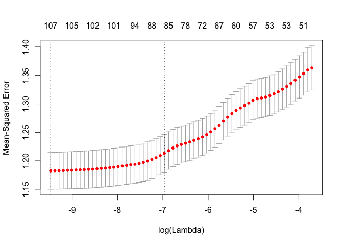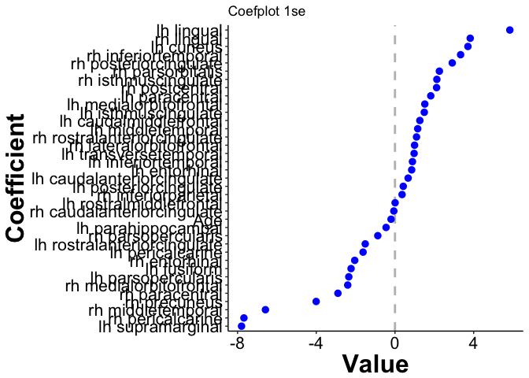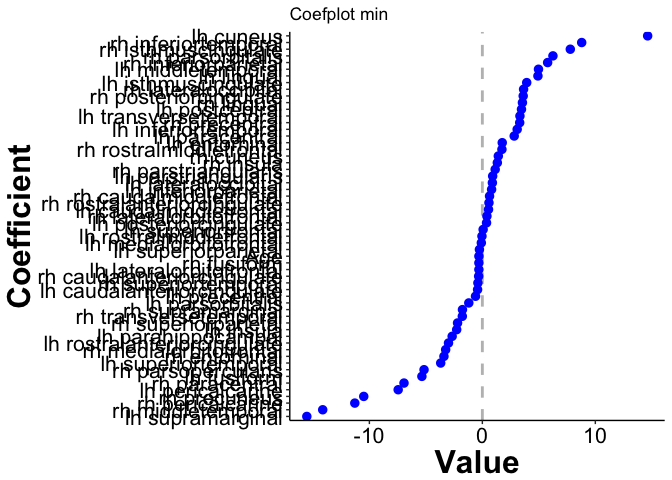

### Fit an `lmer` based on the variables chosen in `all4`

Fit that model and compare with age only.

``` r
chosenVars_all <- coefplot::coefplot(all4, 
                                 sort='mag', lambda='lambda.1se', 
                                 plot=FALSE) %>% 
    dplyr::filter(!grepl(pattern='^ID', Coefficient)) %>% 
    dplyr::mutate(Coefficient=factor(Coefficient, 
                                     levels=Coefficient)) %>% 
    dplyr::filter(abs(Value) > 0.5) %>% 
    select(Coefficient) %>% 
    filter(!Coefficient %in% c('AgeCent', '(Intercept)')) %>% 
    mutate(Coefficient=as.character(Coefficient)) %>% 
    pull(Coefficient)

null_formula <- Rating ~ 1 + (1 | ID)
all4NoAge_formula <- build.formula('Rating', chosenVars_all) %>% 
    update(~ . + (1 | ID))
all4PlusAge_formula <- build.formula('Rating', chosenVars_all) %>% 
    update(~ . + AgeCent + (1 | ID))
ageOnly_formula <- Rating ~ AgeCent + (1 | ID)

null_mod <- lmer(null_formula, 
                 data=allRegions %>% filter(Type == 'Far') %>% 
                     mutate_at(.vars = chosenVars_all, scale))
all4NoAge_mod <- lmer(all4NoAge_formula, 
                        data=allRegions %>% filter(Type == 'Far') %>% 
                     mutate_at(.vars = chosenVars_all, scale))
all4PlusAge_mod <- lmer(all4PlusAge_formula, 
                          data=allRegions %>% filter(Type == 'Far') %>% 
                     mutate_at(.vars = chosenVars_all, scale))
ageOnly_mod <- lmer(ageOnly_formula, 
                    data=allRegions %>% filter(Type == 'Far') %>% 
                     mutate_at(.vars = chosenVars_all, scale))

AIC(null_mod, all4NoAge_mod, all4PlusAge_mod, ageOnly_mod)
```

<script data-pagedtable-source type="application/json">
{"columns":[{"label":[""],"name":["_rn_"],"type":[""],"align":["left"]},{"label":["df"],"name":[1],"type":["dbl"],"align":["right"]},{"label":["AIC"],"name":[2],"type":["dbl"],"align":["right"]}],"data":[{"1":"3","2":"5733.397","_rn_":"null_mod"},{"1":"34","2":"5675.691","_rn_":"all4NoAge_mod"},{"1":"35","2":"5666.497","_rn_":"all4PlusAge_mod"},{"1":"4","2":"5675.648","_rn_":"ageOnly_mod"}],"options":{"columns":{"min":{},"max":[10]},"rows":{"min":[10],"max":[10]},"pages":{}}}
  </script>

``` r
BIC(null_mod, all4NoAge_mod, all4PlusAge_mod, ageOnly_mod)
```

<script data-pagedtable-source type="application/json">
{"columns":[{"label":[""],"name":["_rn_"],"type":[""],"align":["left"]},{"label":["df"],"name":[1],"type":["dbl"],"align":["right"]},{"label":["BIC"],"name":[2],"type":["dbl"],"align":["right"]}],"data":[{"1":"3","2":"5749.880","_rn_":"null_mod"},{"1":"34","2":"5862.502","_rn_":"all4NoAge_mod"},{"1":"35","2":"5858.802","_rn_":"all4PlusAge_mod"},{"1":"4","2":"5697.626","_rn_":"ageOnly_mod"}],"options":{"columns":{"min":{},"max":[10]},"rows":{"min":[10],"max":[10]},"pages":{}}}
  </script>

``` r
# Print list of variables
chosenVars_all
```

    ##  [1] "lh_supramarginal_thickness"           
    ##  [2] "rh_pericalcarine_thickness"           
    ##  [3] "rh_middletemporal_thickness"          
    ##  [4] "rh_precuneus_thickness"               
    ##  [5] "rh_paracentral_thickness"             
    ##  [6] "rh_medialorbitofrontal_thickness"     
    ##  [7] "lh_parsopercularis_thickness"         
    ##  [8] "lh_fusiform_thickness"                
    ##  [9] "rh_entorhinal_thickness"              
    ## [10] "lh_pericalcarine_thickness"           
    ## [11] "lh_rostralanteriorcingulate_thickness"
    ## [12] "rh_parsopercularis_thickness"         
    ## [13] "lh_caudalanteriorcingulate_thickness" 
    ## [14] "lh_entorhinal_thickness"              
    ## [15] "lh_inferiortemporal_thickness"        
    ## [16] "lh_transversetemporal_thickness"      
    ## [17] "rh_lateralorbitofrontal_thickness"    
    ## [18] "rh_rostralanteriorcingulate_thickness"
    ## [19] "lh_middletemporal_thickness"          
    ## [20] "lh_caudalmiddlefrontal_thickness"     
    ## [21] "lh_isthmuscingulate_thickness"        
    ## [22] "lh_medialorbitofrontal_thickness"     
    ## [23] "lh_paracentral_thickness"             
    ## [24] "rh_postcentral_thickness"             
    ## [25] "rh_isthmuscingulate_thickness"        
    ## [26] "rh_parsorbitalis_thickness"           
    ## [27] "rh_posteriorcingulate_thickness"      
    ## [28] "rh_inferiortemporal_thickness"        
    ## [29] "lh_cuneus_thickness"                  
    ## [30] "rh_lingual_thickness"                 
    ## [31] "lh_lingual_thickness"

Now look at Cross-Validation.

``` r
set.seed(1234)
allFolds <- vfold_cv(allRegions %>% filter(Type == 'Far') %>% 
                     mutate_at(.vars = chosenVars_all, scale), V=10, repeats=10)

null_cv <- allFolds$splits %>% 
    purrr::map_df(~holdout_results(.x, 'Rating', null_formula))
all4NoAge_cv <- allFolds$splits %>% 
    purrr::map_df(~holdout_results(.x, 'Rating', all4NoAge_formula))
all4PlusAge_cv <- allFolds$splits %>% 
    purrr::map_df(~holdout_results(.x, 'Rating', all4PlusAge_formula))
ageOnly_cv <- allFolds$splits %>% 
    purrr::map_df(~holdout_results(.x, 'Rating', ageOnly_formula))
```

``` r
mean(null_cv$error^2)
```

    ## [1] 1.353117

``` r
mean(all4NoAge_cv$error^2)
```

    ## [1] 1.197715

``` r
mean(all4PlusAge_cv$error^2)
```

    ## [1] 1.189444

``` r
mean(ageOnly_cv$error^2)
```

    ## [1] 1.314538

Now we plot the AIC, BIC and MSE.

``` r
evalPlotter <- function(data, metric, modelNames)
{
    quo_var <- enquo(metric)
    metricName <- sprintf("%s", quo_name(quo_var))
    data <- data %>% 
        mutate(Model=modelNames) %>% 
        arrange(!! quo_var) %>% 
        mutate(Model = factor(Model, levels=Model))
    
    ggplot(data, aes_string(x=metricName, y='Model')) +
        geom_point() + 
        beckys.theme.conference
}
```

``` r
modelNames <- c('NULL', 'Brain Only', 'Brian and Age', 'Age Only')
evalPlotter(AIC(null_mod, all4NoAge_mod, all4PlusAge_mod, ageOnly_mod), AIC, modelNames)
```

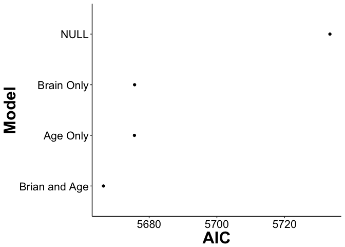

``` r
evalPlotter(BIC(null_mod, all4NoAge_mod, all4PlusAge_mod, ageOnly_mod), BIC, modelNames)
```

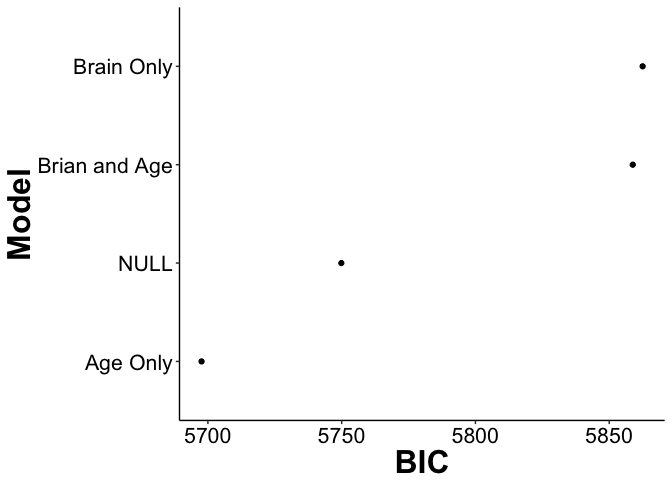

``` r
mseDF <- tibble::tibble(
    Model=modelNames,
    MSE=c(
        mean(null_cv$error^2),
        mean(all4NoAge_cv$error^2),
        mean(all4PlusAge_cv$error^2),
        mean(ageOnly_cv$error^2)
    )
)

evalPlotter(mseDF, MSE, modelNames)
```

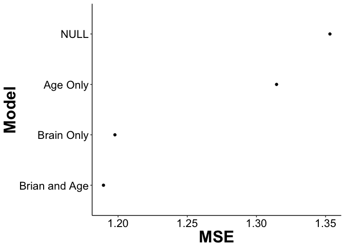

Look at sjPlots of the models.

``` r
#sjPlot::plot_model(null_mod, sort.est=TRUE)
sjPlot::plot_model(all4NoAge_mod, sort.est=TRUE) + beckys.theme.conference
```

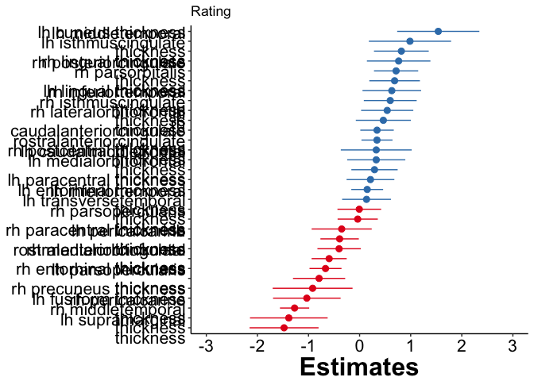

``` r
sjPlot::plot_model(all4PlusAge_mod, sort.est=TRUE) + beckys.theme.conference
```

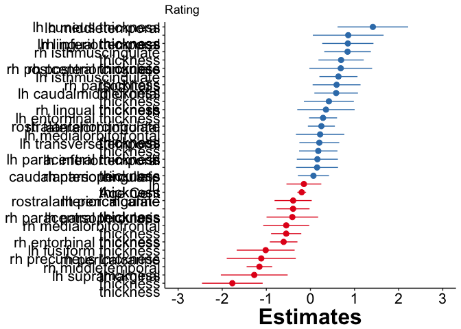

``` r
sjPlot::plot_model(ageOnly_mod, sort.est=TRUE) + beckys.theme.conference
```

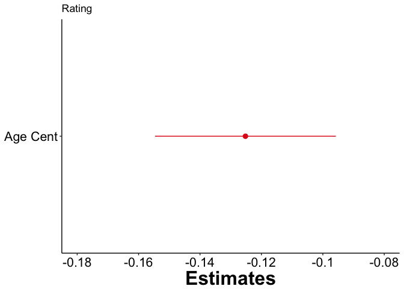
