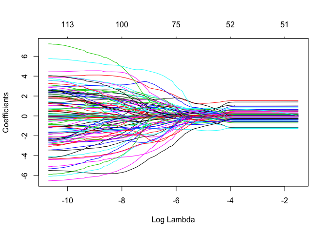
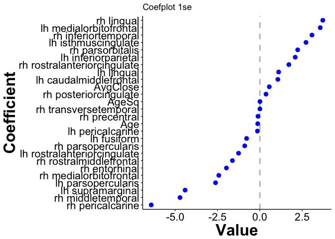

Lasso-CrossValidated Results
================
Jared Lander and Rebecca Martin
6/24/2018

-   [Packages](#packages)
-   [Helper Functions](#helper-functions)
    -   [Datatable](#datatable-func)
    -   [Matrix Prepper](#matrix-prep-func)
    -   [Model Prep and Fit](#model-prep-fit)
    -   [Cross-Validation](#cross-validation)
    -   [Plotting Theme](#plot-theme)
    -   [Coefficient Path](#coef-path)
    -   [Coefficient Plot](#coef-plot)
    -   [Model Summary](#model-summary)
    -   [All Regions](#data-all)
-   [Model Prep](#model-prep)
    -   [Region Names](#region-names)
-   [glmnet Models](#models)
    -   [All Regions Models](#glmnet-all-regions)
        -   [Rating All: ageCent, ageSq, AgeCu, Gender, Type, Brain regions](#rating-all-agecent-agesq-agecu-gender-type-brain-regions)
        -   [Rating All: ageCent, Gender, Type, Brain regions](#rating-all-agecent-gender-type-brain-regions)
        -   [Far All: ageCent, ageSq, AgeCu, Gender, AvgClose Brain regions](#far-all-agecent-agesq-agecu-gender-avgclose-brain-regions)
        -   [Far All: ageCent, Gender, Brain regions](#far-all-agecent-gender-brain-regions)
        -   [Far All: ageCent, Gender, Brain regions, AvgClose](#far-all-agecent-gender-brain-regions-avgclose)
    -   [Supplemental Fig 3A](#supplemental-fig-3a)
        -   [Fit an `lmer` based on the variables chosen in `all5`](#fit-an-lmer-based-on-the-variables-chosen-in-all5)
    -   [Supplemental Fig 3B](#supplemental-fig-3b)

Packages
========

These are the packages we are using frequently enough to be loaded. Other packages may be used as namespaces and are not shown here.

``` r
packages <- c('coefplot',
              'dplyr', 'DT',
              'ggplot2', 'glmnet', 
              'here', 
              'lme4',
              'magrittr', 
              'purrr',
              'rsample',
              'useful')
purrr::walk(packages, library, character.only=TRUE)
```

Helper Functions
================

These are functions to make things a little easier.

Datatable
---------

This sets a bunch of options when using `datatable` which should really be the default anyway.

``` r
makeDT <- function(data, elementId)
{
    if (missing(elementId)) {
        elementId <- sprintf("coefpath_%s", paste(sample(x = c(letters, 
            LETTERS, 0:9), size = 12, replace = TRUE), collapse = ""))
    }
    
    datatable(
        data,
        rownames=FALSE, 
        elementId=elementId,
        extensions=c('FixedColumns', 'Scroller'),
        filter='top',
        options=list(
            dom='trfi',
            fixedColumns=list(leftColumns=1),
            deferRender=TRUE,
            scrollY=400,
            scroller=TRUE
        )
    )
}
```

Matrix Prepper
--------------

For each model the design matrix and penalty factor will be different. This function computes all of that. Numeric columns are unchanged, categorical columns are converted into indicator variables. Baselines of the categorical variables are not dropped since `glmnet` does not need that. We also do not include an intercept since `glmnet` will compute that for us.

``` r
prepMatrices <- function(data, response, predictors, contrats=FALSE, sparse=TRUE, 
                         multiplier=1)
{
    # build a formula with the predictors and response
    # after the formula is build subtract the intercept
    modelFormula <- useful::build.formula(response, predictors) %>% 
        update(~ . -1)
    
    # build matrices
    x <- useful::build.x(modelFormula, data=data, 
                         contrasts=contrats, sparse=sparse)
    y <- useful::build.y(modelFormula, data=data)
    
    # build penalty factor
    # first start by setting all penalty multipliers to 1
    penaltyMultipliers <- rep(multiplier, length=ncol(x))
    # give them names so it is easier to work with
    names(penaltyMultipliers) <- colnames(x)
    # now set the ID names to 0
    penaltyMultipliers[grep(pattern='^ID', x=names(penaltyMultipliers))] <- 0
    
    return(
        list(x=x, y=y, formula=modelFormula, penalty.factor=penaltyMultipliers)
    )
}
```

Model Prep and Fit
------------------

``` r
fit_model <- function(data, response, predictors, nfolds=10, multiplier=1)
{
    prep_info <- prepMatrices(data=data, 
                              response=response,
                              predictors=predictors,
                              multiplier=multiplier
    )
    
    model <- cv.glmnet(x=prep_info$x, y=prep_info$y, 
                       alpha=1,
                       family='gaussian',
                       nfolds=nfolds,
                       penalty.factor=prep_info$penalty.factor
    )
}
```

Cross-Validation
----------------

This will be used for seeing how well our `lme4` models perform.

``` r
holdout_results <- function(splits, response, ...) {
    # Fit the model to the 90%
    mod <- lmer(..., data = analysis(splits))
    # Save the 10%
    holdout <- assessment(splits)
    # `augment` will save the predictions with the holdout data set
    res <- broom::augment(mod, newdata = holdout)
    predictions <- res$.fitted
    # Calculate whether the prediction was correct
    res$error <- predictions - holdout[[response]]
    # Return the assessment data set with the additional columns
    res
}
```

Plotting Theme
--------------

``` r
beckys.theme.conference = theme(
    panel.background = element_rect(fill='transparent'), #color="black"
    axis.line = element_line(color='black'),
    panel.grid.minor = element_line(color='transparent'),
    panel.grid.major=element_line(color="transparent"),
    axis.title.x = element_text(size=24,face = "bold"),
    axis.title.y = element_text(size=24, vjust=1, face = "bold"),
    axis.text.x = element_text(size=16, colour="black"),
    axis.text.y = element_text(size=16, colour="black"),
    legend.text=element_text(size=16),
    strip.text.y = element_text(size = 16, face="bold"),
    strip.text.x = element_text(size = 16, face="bold"),
    legend.title = element_text(face="bold"),
    axis.line.x=element_line(color = 'black'), 
    axis.line.y=element_line(color = 'black')
)
```

Coefficient Path
----------------

Orginarily when using `glmnet` we would just use `coefplot::coefpath()` but there are so many `ID` variables that we write a custom function for removing them.

``` r
pathSimple <- function(model, elementId)
{
    # get the coefficient path
    pathTable <- coefplot::extractPath(model) %>% 
        # remove the ID columns
        dplyr::select(-starts_with('ID'))
    
    # plot with dygraphs
    g <- dygraphs::dygraph(pathTable, elementId=elementId) %>% 
        dygraphs::dyAxis(name="x", label='Log Lambda') %>% 
        dygraphs::dyAxis(name="y", label='Coefficients') %>% 
        dygraphs::dyLegend(show="onmouseover") %>% 
        dygraphs::dyRangeSelector() %>% dygraphs::dyUnzoom() %>% 
        dygraphs::dyHighlight(highlightCircleSize=3, highlightSeriesBackgroundAlpha=0.5, 
                    highlightSeriesOpts=list(strokeWidth=3))
    g <- purrr::reduce(.x=names(pathTable)[-1], .f=coefplot:::annotateSeries, 
                       .init=g, x=min(pathTable$lambda))
    
    g <- g %>% dygraphs::dyEvent(x=log(model$lambda.min), label="lambda.min", 
                  color="black", labelLoc="bottom", strokePattern="dotted") %>% 
        dygraphs::dyEvent(x=log(model$lambda.1se), label="lambda.1se", 
                color="black", labelLoc="bottom", strokePattern="dotted")
    return(g)
}
```

Coefficient Plot
----------------

Likewise, we want to plot the coefplot without the `ID` variables.

``` r
coefSimple <- function(model, 
                       lambda=c('lambda.1se', 'lambda.min'), 
                       sort='magnitude', title='Coefficient Plot',
                       plot=TRUE)
{
    lambda <- match.arg(lambda)
    p <- coefplot::coefplot(model, sort=sort, lambda=lambda, plot=FALSE, 
                            intercept=FALSE) %>% 
        dplyr::filter(!grepl(pattern='^ID', Coefficient)) %>% 
        dplyr::mutate(Coefficient=factor(Coefficient, levels=Coefficient))
    
    if(plot)
    {
        p <- p %>% 
            dplyr::mutate(Coefficient=stringr::str_remove(Coefficient, '_thickness')) %>% 
            dplyr::mutate(Coefficient=stringr::str_replace_all(Coefficient, '_', ' ')) %>% 
            dplyr::mutate(Coefficient=stringr::str_replace(Coefficient, 'AgeCent', 'Age')) %>% 
            dplyr::mutate(Coefficient=factor(Coefficient, levels=Coefficient)) %>% 
            coefplot::coefplot(title=title) + beckys.theme.conference
    }
    
    p
}
```

Model Summary
-------------

``` r
modelSummary <- function(model, elementId=NULL)
{
    plot(model)
    coefSimple(model, lambda='lambda.1se', title='Coefplot 1se') %>% print
    coefSimple(model, lambda='lambda.min', title='Coefplot min') %>% print
    # pathSimple(model, elementId=elementId) %>% print
}
```

This analysis examines the raw data rather than the aggregated data.

The dataset being used (for the paper) is called 'data/AllRegionsRaw.csv' which is the dataset the paper uses. This includes all 62 aparc regions from the DKT atlas (31 per hemisphere).

Note that for the paper we use the "all5" model which includes only the regulation ratings, mean centered age, reactivity score, gender, and the dkt brain regions

All Regions
-----------

``` r
allRegions <- readr::read_csv(here('data', 'AllRegionsRaw.csv')) %>% 
    mutate(ID=factor(ID)) %>% 
    # correct the age centering
    mutate(AgeCent=as.numeric(scale(Age, scale = FALSE))) %>% 
    rename(AgeCentSq=AgedCentSq, AgeCentCu=AgedCentCu)
```

A sample of the data.

``` r
#makeDT(allRegions %>% sample_frac(0.10), elementId='DataAllRaw')
```

Model Prep
==========

Region Names
------------

For predictors (or features or covariates depending on your terminology) we are going to use various types of Age, Gender, BMI and the various regions. Rather than enumerating all the regions we programatically list them using regular expressions.

``` r
regionNames_all <- names(allRegions)[
    stringr::str_detect(names(allRegions), 
                        '(^(lh)|(rh)_)|(_(lh)|(rh)$)')
    ]
```

glmnet Models
=============

We originally intended to use [`cv.glmmLasso`](https://github.com/thepira/cv.glmmLasso) but it is not quite ready so instead we will use `glmnet` to approximately compute random slope models. For this to happen we turn `ID` into indicator variables. To ensure each one remains in the model we need to set their `penalty.factor`s to 0.

All Regions Models
------------------

### Rating All: ageCent, ageSq, AgeCu, Gender, Type, Brain regions

``` r
allRegions <- allRegions %>% 
    dplyr::filter(Type == 'Close') %>% 
    group_by(ID, Phase, Type) %>% 
    summarize(AvgClose=mean(Rating, na.rm=TRUE)) %>% 
    ungroup() %>% 
    dplyr::select(-Type) %>% 
    right_join(allRegions, by=c('ID'='ID', 'Phase'='Phase'))
```

``` r
set.seed(1234)
all1 <- fit_model(data=allRegions, 
                  response='Rating',
                  predictors=c('ID', 'AgeCent', 'AgeCentSq', 'AgeCentCu', 
                               'Gender', 'Type', regionNames_all),
                  nfolds=10
)
```

We view the coefficient path, error curve and coefplot for both `lambda.1se` and `lambda.min`.

``` r
#pathSimple(all1, elementId='all1_mod') ## this makes interactive graphs. github doesn't like them b/c they are html widgets so we're using plot instead to make static graphs
plot(all1$glmnet.fit, xvar = "lambda")
```



``` r
modelSummary(all1)
```


### Rating All: ageCent, Gender, Type, Brain regions

``` r
set.seed(1234)
all2 <- fit_model(data=allRegions, 
                  response='Rating',
                  predictors=c('ID', 'AgeCent', 
                               'Gender', 'Type', regionNames_all),
                  nfolds=10
)
```

We view the coefficient path, error curve and coefplot for both `lambda.1se` and `lambda.min`.

``` r
#pathSimple(all2, elementId='all2_mod')
plot(all2$glmnet.fit, xvar = "lambda")
```


``` r
modelSummary(all2)
```


### Far All: ageCent, ageSq, AgeCu, Gender, AvgClose Brain regions

``` r
set.seed(1234)
all3 <- fit_model(data=allRegions %>% filter(Type == 'Far'), 
                  response='Rating',
                  predictors=c('ID', 'AgeCent', 'AgeCentSq', 'AgeCentCu', 
                               'Gender', 'AvgClose', regionNames_all),
                  nfolds=10
)
```

We view the coefficient path, error curve and coefplot for both `lambda.1se` and `lambda.min`.

``` r
#pathSimple(all3, elementId='all3_mod')
plot(all3$glmnet.fit, xvar = "lambda")
```


``` r
modelSummary(all3)
```



### Far All: ageCent, Gender, Brain regions

``` r
set.seed(1234)
all4 <- fit_model(data=allRegions %>% filter(Type == 'Far'), 
                  response='Rating',
                  predictors=c('ID', 'AgeCent', 
                               'Gender', regionNames_all),
                  nfolds=10
)
```

We view the coefficient path, error curve and coefplot for both `lambda.1se` and `lambda.min`.

``` r
#pathSimple(all4, elementId='all4_mod')
plot(all4$glmnet.fit, xvar = "lambda")
```


``` r
modelSummary(all4)
```


### Far All: ageCent, Gender, Brain regions, AvgClose

``` r
set.seed(1234)
all5 <- fit_model(data=allRegions %>% filter(Type == 'Far'), 
                  response='Rating',
                  predictors=c('ID', 'AgeCent', 'AvgClose',
                               'Gender', regionNames_all),
                  nfolds=10
)
```

We view the coefficient path, error curve and coefplot for both `lambda.1se` and `lambda.min`.

Supplemental Fig 3A
-------------------

``` r
#pathSimple(all4, elementId='all4_mod')
plot(all5$glmnet.fit, xvar = "lambda")
```


``` r
coefpath(all5)
```


``` r
modelSummary(all5)
```


``` r
coefSimple(all5, lambda='lambda.1se', sort='magnitude') + 
    beckys.theme.conference +
    theme(axis.text.y = element_text(size = 10))
```


``` r
#ggsave("figures/bestFitModel.pdf", width=5, height=5, dpi=300)
```

Compare `all4` and `all5`

``` r
all4$cvm[which(all4$lambda == all4$lambda.1se)]
```

    ## [1] 1.213119

``` r
all5$cvm[which(all5$lambda == all5$lambda.1se)]
```

    ## [1] 1.211919

Looks like `all5` has a slightly lower MSE so `AvgClose` is helpful

### Fit an `lmer` based on the variables chosen in `all5`

Fit that model and compare with age only.

``` r
chosenVars_all <- coefplot::coefplot(all5, 
                                 sort='mag', lambda='lambda.1se', 
                                 plot=FALSE) %>% 
    dplyr::filter(!grepl(pattern='^ID', Coefficient)) %>% 
    dplyr::mutate(Coefficient=factor(Coefficient, 
                                     levels=Coefficient)) %>% 
    #dplyr::filter(abs(Value) > 0.5) %>% 
    dplyr::select(Coefficient) %>% 
    filter(!Coefficient %in% c('AgeCent', '(Intercept)')) %>% 
    mutate(Coefficient=as.character(Coefficient)) %>% 
    pull(Coefficient)

null_formula <- Rating ~ 1 + (1 | ID)
all5NoAge_formula <- build.formula('Rating', chosenVars_all) %>% 
    update(~ . + (1 | ID))
all5PlusAge_formula <- build.formula('Rating', chosenVars_all) %>% 
    update(~ . + AgeCent + (1 | ID))
ageOnly_formula <- Rating ~ AgeCent + (1 | ID)
closeOnly_formula <- Rating ~ AvgClose + (1 | ID)
agePlusClose_formula <- Rating ~ AgeCent + AvgClose + (1 | ID)

null_mod <- lmer(null_formula, 
                 data=allRegions %>% filter(Type == 'Far') %>% 
                     mutate_at(.vars = chosenVars_all, scale))
all5NoAge_mod <- lmer(all5NoAge_formula, 
                        data=allRegions %>% filter(Type == 'Far') %>% 
                     mutate_at(.vars = chosenVars_all, scale))
all5PlusAge_mod <- lmer(all5PlusAge_formula, 
                          data=allRegions %>% filter(Type == 'Far') %>% 
                     mutate_at(.vars = chosenVars_all, scale))
ageOnly_mod <- lmer(ageOnly_formula, 
                    data=allRegions %>% filter(Type == 'Far') %>% 
                     mutate_at(.vars = chosenVars_all, scale))
closeOnly_mod <- lmer(closeOnly_formula, 
                    data=allRegions %>% filter(Type == 'Far') %>% 
                     mutate_at(.vars = chosenVars_all, scale))
agePlusClose_mod <- lmer(agePlusClose_formula, 
                    data=allRegions %>% filter(Type == 'Far') %>% 
                     mutate_at(.vars = chosenVars_all, scale))

AIC(null_mod, all5NoAge_mod, all5PlusAge_mod, ageOnly_mod, closeOnly_mod, agePlusClose_mod)
```

    ##                  df      AIC
    ## null_mod          3 5733.397
    ## all5NoAge_mod    26 5645.957
    ## all5PlusAge_mod  27 5640.014
    ## ageOnly_mod       4 5675.648
    ## closeOnly_mod     4 5667.237
    ## agePlusClose_mod  5 5635.297

``` r
BIC(null_mod, all5NoAge_mod, all5PlusAge_mod, ageOnly_mod, closeOnly_mod, agePlusClose_mod)
```

    ##                  df      BIC
    ## null_mod          3 5749.880
    ## all5NoAge_mod    26 5788.812
    ## all5PlusAge_mod  27 5788.364
    ## ageOnly_mod       4 5697.626
    ## closeOnly_mod     4 5689.215
    ## agePlusClose_mod  5 5662.770

``` r
# Print list of variables
chosenVars_all
```

    ##  [1] "rh_pericalcarine_thickness"           
    ##  [2] "rh_middletemporal_thickness"          
    ##  [3] "lh_supramarginal_thickness"           
    ##  [4] "lh_parsopercularis_thickness"         
    ##  [5] "rh_medialorbitofrontal_thickness"     
    ##  [6] "rh_entorhinal_thickness"              
    ##  [7] "rh_rostralmiddlefrontal_thickness"    
    ##  [8] "lh_rostralanteriorcingulate_thickness"
    ##  [9] "rh_parsopercularis_thickness"         
    ## [10] "lh_fusiform_thickness"                
    ## [11] "lh_pericalcarine_thickness"           
    ## [12] "rh_precentral_thickness"              
    ## [13] "rh_posteriorcingulate_thickness"      
    ## [14] "AvgClose"                             
    ## [15] "lh_caudalmiddlefrontal_thickness"     
    ## [16] "lh_lingual_thickness"                 
    ## [17] "rh_rostralanteriorcingulate_thickness"
    ## [18] "rh_parsorbitalis_thickness"           
    ## [19] "lh_inferiorparietal_thickness"        
    ## [20] "lh_isthmuscingulate_thickness"        
    ## [21] "rh_inferiortemporal_thickness"        
    ## [22] "lh_medialorbitofrontal_thickness"     
    ## [23] "rh_lingual_thickness"

Now look at Cross-Validation.

``` r
set.seed(1234)
allFolds <- vfold_cv(allRegions %>% filter(Type == 'Far') %>% 
                     mutate_at(.vars = chosenVars_all, scale), V=10, repeats=10)

null_cv <- allFolds$splits %>% 
    purrr::map_df(~holdout_results(.x, 'Rating', null_formula))
all5NoAge_cv <- allFolds$splits %>% 
    purrr::map_df(~holdout_results(.x, 'Rating', all5NoAge_formula))
all5PlusAge_cv <- allFolds$splits %>% 
    purrr::map_df(~holdout_results(.x, 'Rating', all5PlusAge_formula))
ageOnly_cv <- allFolds$splits %>% 
    purrr::map_df(~holdout_results(.x, 'Rating', ageOnly_formula))
closeOnly_cv <- allFolds$splits %>% 
    purrr::map_df(~holdout_results(.x, 'Rating', closeOnly_formula))
agePlusClose_cv <- allFolds$splits %>% 
    purrr::map_df(~holdout_results(.x, 'Rating', agePlusClose_formula))
```

``` r
mean(null_cv$error^2)
```

    ## [1] 1.353117

``` r
mean(all5NoAge_cv$error^2)
```

    ## [1] 1.201955

``` r
mean(all5PlusAge_cv$error^2)
```

    ## [1] 1.199886

``` r
mean(ageOnly_cv$error^2)
```

    ## [1] 1.314538

``` r
mean(closeOnly_cv$error^2)
```

    ## [1] 1.309186

``` r
mean(agePlusClose_cv$error^2)
```

    ## [1] 1.28794

Now we plot the AIC, BIC and MSE.

``` r
evalPlotter <- function(data, metric, modelNames)
{
    quo_var <- enquo(metric)
    metricName <- sprintf("%s", quo_name(quo_var))
    data <- data %>% 
        mutate(Model=modelNames) %>% 
        arrange(!! quo_var) %>% 
        mutate(Model = factor(Model, levels=Model))
    
    ggplot(data, aes_string(x=metricName, y='Model')) +
        geom_point() + 
        beckys.theme.conference
}
```

``` r
modelNames <- c('NULL', 'Brain Only', 'Brain and Age', 'Age Only')
evalPlotter(AIC(null_mod, all5NoAge_mod, all5PlusAge_mod, agePlusClose_mod), AIC, modelNames)
```


``` r
evalPlotter(BIC(null_mod, all5NoAge_mod, all5PlusAge_mod, agePlusClose_mod), BIC, modelNames)
```


Supplemental Fig 3B
-------------------

``` r
mseDF <- tibble::tibble(
    Model=modelNames,
    MSE=c(
        mean(null_cv$error^2),
        mean(all5NoAge_cv$error^2),
        mean(all5PlusAge_cv$error^2),
        mean(agePlusClose_cv$error^2)
    )
)

evalPlotter(mseDF, MSE, modelNames)
```


``` r
#ggsave("figures/LassoModCompare.pdf", width=4.5, height=5, dpi=300)
```

<!-- Look at sjPlots of the models. -->
<!-- ```{r all-sjplots,dependson=c('all4-vs-age-model')} -->
<!-- #sjPlot::plot_model(null_mod, sort.est=TRUE) -->
<!-- sjPlot::plot_model(all4NoAge_mod, sort.est=TRUE) + beckys.theme.conference -->
<!-- sjPlot::plot_model(all4PlusAge_mod, sort.est=TRUE) + beckys.theme.conference -->
<!-- sjPlot::plot_model(ageOnly_mod, sort.est=TRUE) + beckys.theme.conference -->
<!-- ``` -->
Note that sjPlot changed and this code doesn't work anymore

Likelihood ratio test of top two models

``` r
anova(agePlusClose_mod, all5PlusAge_mod)
```

    ## Data: allRegions %>% filter(Type == "Far") %>% mutate_at(.vars = chosenVars_all,  ...
    ## Models:
    ## agePlusClose_mod: Rating ~ AgeCent + AvgClose + (1 | ID)
    ## all5PlusAge_mod: Rating ~ rh_pericalcarine_thickness + rh_middletemporal_thickness + 
    ## all5PlusAge_mod:     lh_supramarginal_thickness + lh_parsopercularis_thickness + 
    ## all5PlusAge_mod:     rh_medialorbitofrontal_thickness + rh_entorhinal_thickness + 
    ## all5PlusAge_mod:     rh_rostralmiddlefrontal_thickness + lh_rostralanteriorcingulate_thickness + 
    ## all5PlusAge_mod:     rh_parsopercularis_thickness + lh_fusiform_thickness + lh_pericalcarine_thickness + 
    ## all5PlusAge_mod:     rh_precentral_thickness + rh_posteriorcingulate_thickness + 
    ## all5PlusAge_mod:     AvgClose + lh_caudalmiddlefrontal_thickness + lh_lingual_thickness + 
    ## all5PlusAge_mod:     rh_rostralanteriorcingulate_thickness + rh_parsorbitalis_thickness + 
    ## all5PlusAge_mod:     lh_inferiorparietal_thickness + lh_isthmuscingulate_thickness + 
    ## all5PlusAge_mod:     rh_inferiortemporal_thickness + lh_medialorbitofrontal_thickness + 
    ## all5PlusAge_mod:     rh_lingual_thickness + AgeCent + (1 | ID)
    ##                  Df    AIC    BIC  logLik deviance Chisq Chi Df Pr(>Chisq)
    ## agePlusClose_mod  5 5621.2 5648.7 -2805.6   5611.2                        
    ## all5PlusAge_mod  27 5586.2 5734.5 -2766.1   5532.2    79     22  2.364e-08
    ##                     
    ## agePlusClose_mod    
    ## all5PlusAge_mod  ***
    ## ---
    ## Signif. codes:  0 '***' 0.001 '**' 0.01 '*' 0.05 '.' 0.1 ' ' 1

``` r
anova(all5NoAge_mod, all5PlusAge_mod)
```

    ## Data: allRegions %>% filter(Type == "Far") %>% mutate_at(.vars = chosenVars_all,  ...
    ## Models:
    ## all5NoAge_mod: Rating ~ rh_pericalcarine_thickness + rh_middletemporal_thickness + 
    ## all5NoAge_mod:     lh_supramarginal_thickness + lh_parsopercularis_thickness + 
    ## all5NoAge_mod:     rh_medialorbitofrontal_thickness + rh_entorhinal_thickness + 
    ## all5NoAge_mod:     rh_rostralmiddlefrontal_thickness + lh_rostralanteriorcingulate_thickness + 
    ## all5NoAge_mod:     rh_parsopercularis_thickness + lh_fusiform_thickness + lh_pericalcarine_thickness + 
    ## all5NoAge_mod:     rh_precentral_thickness + rh_posteriorcingulate_thickness + 
    ## all5NoAge_mod:     AvgClose + lh_caudalmiddlefrontal_thickness + lh_lingual_thickness + 
    ## all5NoAge_mod:     rh_rostralanteriorcingulate_thickness + rh_parsorbitalis_thickness + 
    ## all5NoAge_mod:     lh_inferiorparietal_thickness + lh_isthmuscingulate_thickness + 
    ## all5NoAge_mod:     rh_inferiortemporal_thickness + lh_medialorbitofrontal_thickness + 
    ## all5NoAge_mod:     rh_lingual_thickness + (1 | ID)
    ## all5PlusAge_mod: Rating ~ rh_pericalcarine_thickness + rh_middletemporal_thickness + 
    ## all5PlusAge_mod:     lh_supramarginal_thickness + lh_parsopercularis_thickness + 
    ## all5PlusAge_mod:     rh_medialorbitofrontal_thickness + rh_entorhinal_thickness + 
    ## all5PlusAge_mod:     rh_rostralmiddlefrontal_thickness + lh_rostralanteriorcingulate_thickness + 
    ## all5PlusAge_mod:     rh_parsopercularis_thickness + lh_fusiform_thickness + lh_pericalcarine_thickness + 
    ## all5PlusAge_mod:     rh_precentral_thickness + rh_posteriorcingulate_thickness + 
    ## all5PlusAge_mod:     AvgClose + lh_caudalmiddlefrontal_thickness + lh_lingual_thickness + 
    ## all5PlusAge_mod:     rh_rostralanteriorcingulate_thickness + rh_parsorbitalis_thickness + 
    ## all5PlusAge_mod:     lh_inferiorparietal_thickness + lh_isthmuscingulate_thickness + 
    ## all5PlusAge_mod:     rh_inferiortemporal_thickness + lh_medialorbitofrontal_thickness + 
    ## all5PlusAge_mod:     rh_lingual_thickness + AgeCent + (1 | ID)
    ##                 Df    AIC    BIC  logLik deviance  Chisq Chi Df Pr(>Chisq)
    ## all5NoAge_mod   26 5598.1 5741.0 -2773.1   5546.1                         
    ## all5PlusAge_mod 27 5586.2 5734.5 -2766.1   5532.2 13.945      1  0.0001882
    ##                    
    ## all5NoAge_mod      
    ## all5PlusAge_mod ***
    ## ---
    ## Signif. codes:  0 '***' 0.001 '**' 0.01 '*' 0.05 '.' 0.1 ' ' 1
