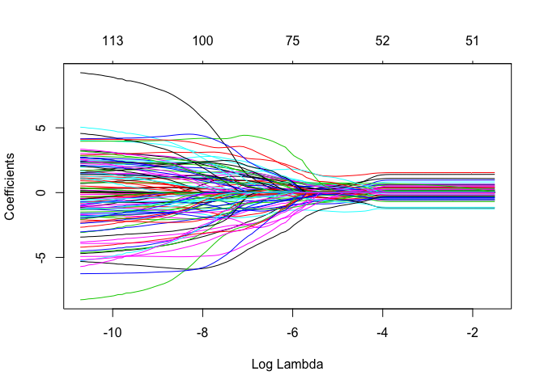
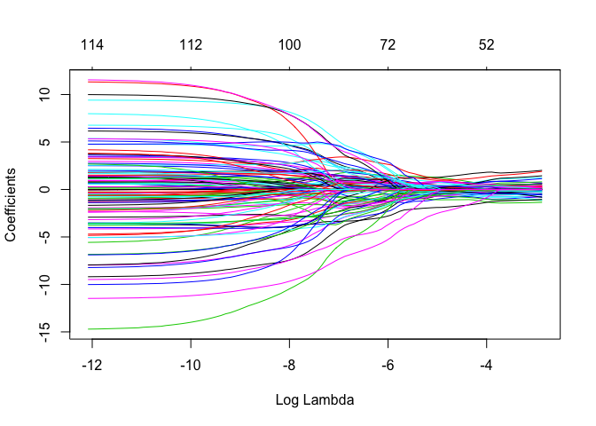
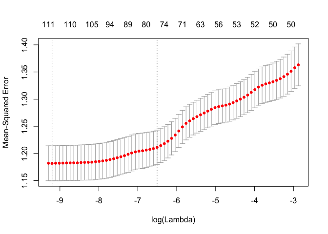
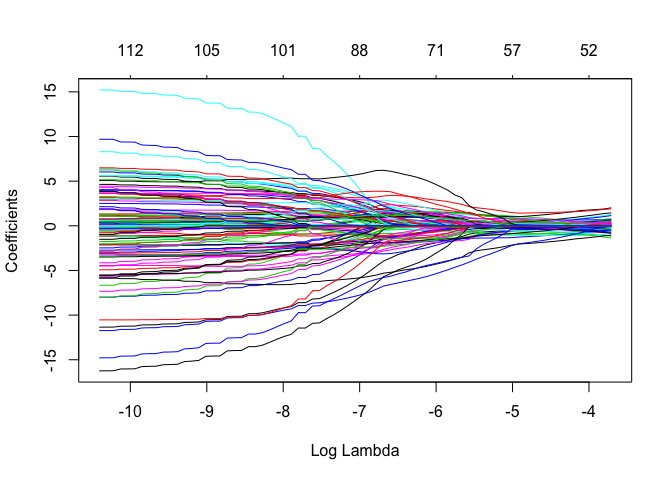

Lasso-CrossValidated Results
================
Jared Lander and Rebecca Martin
6/24/2018

-   [Packages](#packages)
-   [Helper Functions](#helper-functions)
    -   [Datatable](#datatable-func)
    -   [Matrix Prepper](#matrix-prep-func)
    -   [Model Prep and Fit](#model-prep-fit)
    -   [Cross-Validation](#cross-validation)
    -   [Plotting Theme](#plot-theme)
    -   [Coefficient Path](#coef-path)
    -   [Coefficient Plot](#coef-plot)
    -   [Model Summary](#model-summary)
    -   [All Regions](#data-all)
-   [Model Prep](#model-prep)
    -   [Region Names](#region-names)
-   [glmnet Models](#models)
    -   [All Regions Models](#glmnet-all-regions)
        -   [Rating All: ageCent, ageSq, AgeCu, Gender, Type, Brain regions](#rating-all-agecent-agesq-agecu-gender-type-brain-regions)
        -   [Rating All: ageCent, Gender, Type, Brain regions](#rating-all-agecent-gender-type-brain-regions)
        -   [Far All: ageCent, ageSq, AgeCu, Gender, AvgClose Brain regions](#far-all-agecent-agesq-agecu-gender-avgclose-brain-regions)
        -   [Far All: ageCent, Gender, Brain regions](#far-all-agecent-gender-brain-regions)
        -   [Far All: ageCent, Gender, Brain regions, AvgClose](#far-all-agecent-gender-brain-regions-avgclose)
    -   [Supplemental Fig 3A](#supplemental-fig-3a)
        -   [Fit an `lmer` based on the variables chosen in `all5`](#fit-an-lmer-based-on-the-variables-chosen-in-all5)
    -   [Supplemental Fig 3B](#supplemental-fig-3b)

Packages
========

These are the packages we are using frequently enough to be loaded. Other packages may be used as namespaces and are not shown here.

``` r
packages <- c('coefplot',
              'dplyr', 'DT',
              'ggplot2', 'glmnet', 
              'here', 
              'lme4',
              'magrittr', 
              'purrr',
              'rsample',
              'useful')
purrr::walk(packages, library, character.only=TRUE)
```

Helper Functions
================

These are functions to make things a little easier.

Datatable
---------

This sets a bunch of options when using `datatable` which should really be the default anyway.

``` r
makeDT <- function(data, elementId)
{
    if (missing(elementId)) {
        elementId <- sprintf("coefpath_%s", paste(sample(x = c(letters, 
            LETTERS, 0:9), size = 12, replace = TRUE), collapse = ""))
    }
    
    datatable(
        data,
        rownames=FALSE, 
        elementId=elementId,
        extensions=c('FixedColumns', 'Scroller'),
        filter='top',
        options=list(
            dom='trfi',
            fixedColumns=list(leftColumns=1),
            deferRender=TRUE,
            scrollY=400,
            scroller=TRUE
        )
    )
}
```

Matrix Prepper
--------------

For each model the design matrix and penalty factor will be different. This function computes all of that. Numeric columns are unchanged, categorical columns are converted into indicator variables. Baselines of the categorical variables are not dropped since `glmnet` does not need that. We also do not include an intercept since `glmnet` will compute that for us.

``` r
prepMatrices <- function(data, response, predictors, contrats=FALSE, sparse=TRUE, 
                         multiplier=1)
{
    # build a formula with the predictors and response
    # after the formula is build subtract the intercept
    modelFormula <- useful::build.formula(response, predictors) %>% 
        update(~ . -1)
    
    # build matrices
    x <- useful::build.x(modelFormula, data=data, 
                         contrasts=contrats, sparse=sparse)
    y <- useful::build.y(modelFormula, data=data)
    
    # build penalty factor
    # first start by setting all penalty multipliers to 1
    penaltyMultipliers <- rep(multiplier, length=ncol(x))
    # give them names so it is easier to work with
    names(penaltyMultipliers) <- colnames(x)
    # now set the ID names to 0
    penaltyMultipliers[grep(pattern='^ID', x=names(penaltyMultipliers))] <- 0
    
    return(
        list(x=x, y=y, formula=modelFormula, penalty.factor=penaltyMultipliers)
    )
}
```

Model Prep and Fit
------------------

``` r
fit_model <- function(data, response, predictors, nfolds=10, multiplier=1)
{
    prep_info <- prepMatrices(data=data, 
                              response=response,
                              predictors=predictors,
                              multiplier=multiplier
    )
    
    model <- cv.glmnet(x=prep_info$x, y=prep_info$y, 
                       alpha=1,
                       family='gaussian',
                       nfolds=nfolds,
                       penalty.factor=prep_info$penalty.factor
    )
}
```

Cross-Validation
----------------

This will be used for seeing how well our `lme4` models perform.

``` r
holdout_results <- function(splits, response, ...) {
    # Fit the model to the 90%
    mod <- lmer(..., data = analysis(splits))
    # Save the 10%
    holdout <- assessment(splits)
    # `augment` will save the predictions with the holdout data set
    res <- broom::augment(mod, newdata = holdout)
    predictions <- res$.fitted
    # Calculate whether the prediction was correct
    res$error <- predictions - holdout[[response]]
    # Return the assessment data set with the additional columns
    res
}
```

Plotting Theme
--------------

``` r
beckys.theme.conference = theme(
    panel.background = element_rect(fill='transparent'), #color="black"
    axis.line = element_line(color='black'),
    panel.grid.minor = element_line(color='transparent'),
    panel.grid.major=element_line(color="transparent"),
    axis.title.x = element_text(size=24,face = "bold"),
    axis.title.y = element_text(size=24, vjust=1, face = "bold"),
    axis.text.x = element_text(size=16, colour="black"),
    axis.text.y = element_text(size=16, colour="black"),
    legend.text=element_text(size=16),
    strip.text.y = element_text(size = 16, face="bold"),
    strip.text.x = element_text(size = 16, face="bold"),
    legend.title = element_text(face="bold"),
    axis.line.x=element_line(color = 'black'), 
    axis.line.y=element_line(color = 'black')
)
```

Coefficient Path
----------------

Orginarily when using `glmnet` we would just use `coefplot::coefpath()` but there are so many `ID` variables that we write a custom function for removing them.

``` r
pathSimple <- function(model, elementId)
{
    # get the coefficient path
    pathTable <- coefplot::extractPath(model) %>% 
        # remove the ID columns
        dplyr::select(-starts_with('ID'))
    
    # plot with dygraphs
    g <- dygraphs::dygraph(pathTable, elementId=elementId) %>% 
        dygraphs::dyAxis(name="x", label='Log Lambda') %>% 
        dygraphs::dyAxis(name="y", label='Coefficients') %>% 
        dygraphs::dyLegend(show="onmouseover") %>% 
        dygraphs::dyRangeSelector() %>% dygraphs::dyUnzoom() %>% 
        dygraphs::dyHighlight(highlightCircleSize=3, highlightSeriesBackgroundAlpha=0.5, 
                    highlightSeriesOpts=list(strokeWidth=3))
    g <- purrr::reduce(.x=names(pathTable)[-1], .f=coefplot:::annotateSeries, 
                       .init=g, x=min(pathTable$lambda))
    
    g <- g %>% dygraphs::dyEvent(x=log(model$lambda.min), label="lambda.min", 
                  color="black", labelLoc="bottom", strokePattern="dotted") %>% 
        dygraphs::dyEvent(x=log(model$lambda.1se), label="lambda.1se", 
                color="black", labelLoc="bottom", strokePattern="dotted")
    return(g)
}
```

Coefficient Plot
----------------

Likewise, we want to plot the coefplot without the `ID` variables.

``` r
coefSimple <- function(model, 
                       lambda=c('lambda.1se', 'lambda.min'), 
                       sort='magnitude', title='Coefficient Plot',
                       plot=TRUE)
{
    lambda <- match.arg(lambda)
    p <- coefplot::coefplot(model, sort=sort, lambda=lambda, plot=FALSE, 
                            intercept=FALSE) %>% 
        dplyr::filter(!grepl(pattern='^ID', Coefficient)) %>% 
        dplyr::mutate(Coefficient=factor(Coefficient, levels=Coefficient))
    
    if(plot)
    {
        p <- p %>% 
            dplyr::mutate(Coefficient=stringr::str_remove(Coefficient, '_thickness')) %>% 
            dplyr::mutate(Coefficient=stringr::str_replace_all(Coefficient, '_', ' ')) %>% 
            dplyr::mutate(Coefficient=stringr::str_replace(Coefficient, 'AgeCent', 'Age')) %>% 
            dplyr::mutate(Coefficient=factor(Coefficient, levels=Coefficient)) %>% 
            coefplot::coefplot(title=title) + beckys.theme.conference
    }
    
    p
}
```

Model Summary
-------------

``` r
modelSummary <- function(model, elementId=NULL)
{
    plot(model)
    coefSimple(model, lambda='lambda.1se', title='Coefplot 1se') %>% print
    coefSimple(model, lambda='lambda.min', title='Coefplot min') %>% print
    # pathSimple(model, elementId=elementId) %>% print
}
```

This analysis examines the raw data rather than the aggregated data.

The dataset being used (for the paper) is called 'data/AllRegionsRaw.csv' which is the dataset the paper uses. This includes all 62 aparc regions from the DKT atlas (31 per hemisphere).

Note that for the paper we use the "all5" model which includes only the regulation ratings, mean centered age, reactivity score, gender, and the dkt brain regions

All Regions
-----------

``` r
allRegions <- readr::read_csv(here('data', 'AllRegionsRaw.csv')) %>% 
    mutate(ID=factor(ID)) %>% 
    # correct the age centering
    mutate(AgeCent=as.numeric(scale(Age, scale = FALSE))) %>% 
    rename(AgeCentSq=AgedCentSq, AgeCentCu=AgedCentCu)
```

A sample of the data.

``` r
#makeDT(allRegions %>% sample_frac(0.10), elementId='DataAllRaw')
```

Model Prep
==========

Region Names
------------

For predictors (or features or covariates depending on your terminology) we are going to use various types of Age, Gender, BMI and the various regions. Rather than enumerating all the regions we programatically list them using regular expressions.

``` r
regionNames_all <- names(allRegions)[
    stringr::str_detect(names(allRegions), 
                        '(^(lh)|(rh)_)|(_(lh)|(rh)$)')
    ]
```

glmnet Models
=============

We originally intended to use [`cv.glmmLasso`](https://github.com/thepira/cv.glmmLasso) but it is not quite ready so instead we will use `glmnet` to approximately compute random slope models. For this to happen we turn `ID` into indicator variables. To ensure each one remains in the model we need to set their `penalty.factor`s to 0.

All Regions Models
------------------

### Rating All: ageCent, ageSq, AgeCu, Gender, Type, Brain regions

``` r
allRegions <- allRegions %>% 
    dplyr::filter(Type == 'Close') %>% 
    group_by(ID, Phase, Type) %>% 
    summarize(AvgClose=mean(Rating, na.rm=TRUE)) %>% 
    ungroup() %>% 
    dplyr::select(-Type) %>% 
    right_join(allRegions, by=c('ID'='ID', 'Phase'='Phase'))
```

``` r
set.seed(1234)
all1 <- fit_model(data=allRegions, 
                  response='Rating',
                  predictors=c('ID', 'AgeCent', 'AgeCentSq', 'AgeCentCu', 
                               'Gender', 'Type', regionNames_all),
                  nfolds=10
)
```

We view the coefficient path, error curve and coefplot for both `lambda.1se` and `lambda.min`.

``` r
#pathSimple(all1, elementId='all1_mod') ## this makes interactive graphs. github doesn't like them b/c they are html widgets so we're using plot instead to make static graphs
plot(all1$glmnet.fit, xvar = "lambda")
```


``` r
modelSummary(all1)
```


### Rating All: ageCent, Gender, Type, Brain regions

``` r
set.seed(1234)
all2 <- fit_model(data=allRegions, 
                  response='Rating',
                  predictors=c('ID', 'AgeCent', 
                               'Gender', 'Type', regionNames_all),
                  nfolds=10
)
```

We view the coefficient path, error curve and coefplot for both `lambda.1se` and `lambda.min`.

``` r
#pathSimple(all2, elementId='all2_mod')
plot(all2$glmnet.fit, xvar = "lambda")
```



``` r
modelSummary(all2)
```


### Far All: ageCent, ageSq, AgeCu, Gender, AvgClose Brain regions

``` r
set.seed(1234)
all3 <- fit_model(data=allRegions %>% filter(Type == 'Far'), 
                  response='Rating',
                  predictors=c('ID', 'AgeCent', 'AgeCentSq', 'AgeCentCu', 
                               'Gender', 'AvgClose', regionNames_all),
                  nfolds=10
)
```

We view the coefficient path, error curve and coefplot for both `lambda.1se` and `lambda.min`.

``` r
#pathSimple(all3, elementId='all3_mod')
plot(all3$glmnet.fit, xvar = "lambda")
```



``` r
modelSummary(all3)
```



### Far All: ageCent, Gender, Brain regions

``` r
set.seed(1234)
all4 <- fit_model(data=allRegions %>% filter(Type == 'Far'), 
                  response='Rating',
                  predictors=c('ID', 'AgeCent', 
                               'Gender', regionNames_all),
                  nfolds=10
)
```

We view the coefficient path, error curve and coefplot for both `lambda.1se` and `lambda.min`.

``` r
#pathSimple(all4, elementId='all4_mod')
plot(all4$glmnet.fit, xvar = "lambda")
```



``` r
modelSummary(all4)
```


### Far All: ageCent, Gender, Brain regions, AvgClose

``` r
set.seed(1234)
all5 <- fit_model(data=allRegions %>% filter(Type == 'Far'), 
                  response='Rating',
                  predictors=c('ID', 'AgeCent', 'AvgClose',
                               'Gender', regionNames_all),
                  nfolds=10
)
```

We view the coefficient path, error curve and coefplot for both `lambda.1se` and `lambda.min`.

Supplemental Fig 3A
-------------------

``` r
#pathSimple(all4, elementId='all4_mod')
plot(all5$glmnet.fit, xvar = "lambda")
```


``` r
coefpath(all5)
```

<!--html_preserve-->

<script type="application/json" data-for="coefpath_WbaOuwejSgu6">{"x":{"attrs":{"axes":{"x":{"pixelsPerLabel":60},"y":[]},"labels":["lambda","ID829","ID950","ID1301","ID1388","ID1409","ID1484","ID1507","ID1542","ID1559","ID1601","ID1754","ID1816","ID10698","ID10717","ID10798","ID10978","ID11118","ID11135","ID11181","ID11186","ID11229","ID11305","ID11417","ID11679","ID11729","ID11868","ID11869","ID11884","ID11903","ID13008","ID13010","ID13012","ID13017","ID13018","ID13020","ID13025","ID13031","ID13033","ID13043","ID13044","ID13047","ID13052","ID13053","ID13076","ID13077","ID13080","ID13082","ID13086","ID13088","AgeCent","AvgClose","GenderF","GenderM","lh_caudalanteriorcingulate_thickness","lh_caudalmiddlefrontal_thickness","lh_cuneus_thickness","lh_entorhinal_thickness","lh_fusiform_thickness","lh_inferiorparietal_thickness","lh_inferiortemporal_thickness","lh_isthmuscingulate_thickness","lh_lateraloccipital_thickness","lh_lateralorbitofrontal_thickness","lh_lingual_thickness","lh_medialorbitofrontal_thickness","lh_middletemporal_thickness","lh_parahippocampal_thickness","lh_paracentral_thickness","lh_parsopercularis_thickness","lh_parsorbitalis_thickness","lh_parstriangularis_thickness","lh_pericalcarine_thickness","lh_postcentral_thickness","lh_posteriorcingulate_thickness","lh_precentral_thickness","lh_precuneus_thickness","lh_rostralanteriorcingulate_thickness","lh_rostralmiddlefrontal_thickness","lh_superiorfrontal_thickness","lh_superiorparietal_thickness","lh_superiortemporal_thickness","lh_supramarginal_thickness","lh_transversetemporal_thickness","lh_insula_thickness","rh_caudalanteriorcingulate_thickness","rh_caudalmiddlefrontal_thickness","rh_cuneus_thickness","rh_entorhinal_thickness","rh_fusiform_thickness","rh_inferiorparietal_thickness","rh_inferiortemporal_thickness","rh_isthmuscingulate_thickness","rh_lateraloccipital_thickness","rh_lateralorbitofrontal_thickness","rh_lingual_thickness","rh_medialorbitofrontal_thickness","rh_middletemporal_thickness","rh_parahippocampal_thickness","rh_paracentral_thickness","rh_parsopercularis_thickness","rh_parsorbitalis_thickness","rh_parstriangularis_thickness","rh_pericalcarine_thickness","rh_postcentral_thickness","rh_posteriorcingulate_thickness","rh_precentral_thickness","rh_precuneus_thickness","rh_rostralanteriorcingulate_thickness","rh_rostralmiddlefrontal_thickness","rh_superiorfrontal_thickness","rh_superiorparietal_thickness","rh_superiortemporal_thickness","rh_supramarginal_thickness","rh_transversetemporal_thickness","rh_insula_thickness"],"retainDateWindow":false,"xlabel":"Log Lambda","ylabel":"Coefficients","legend":"onmouseover","labelsDivWidth":250,"labelsShowZeroValues":true,"labelsSeparateLines":false,"showRangeSelector":true,"rangeSelectorHeight":40,"rangeSelectorPlotFillColor":" #A7B1C4","rangeSelectorPlotStrokeColor":"#808FAB","interactionModel":"Dygraph.Interaction.defaultModel","highlightCircleSize":3,"highlightSeriesBackgroundAlpha":0.5,"highlightSeriesOpts":{"strokeWidth":3},"hideOverlayOnMouseOut":true},"annotations":[{"x":-10.1452476155983,"shortText":"ID829","text":"ID829","width":50,"attachAtBottom":false,"series":"ID829"},{"x":-10.1452476155983,"shortText":"ID950","text":"ID950","width":50,"attachAtBottom":false,"series":"ID950"},{"x":-10.1452476155983,"shortText":"ID1301","text":"ID1301","width":50,"attachAtBottom":false,"series":"ID1301"},{"x":-10.1452476155983,"shortText":"ID1388","text":"ID1388","width":50,"attachAtBottom":false,"series":"ID1388"},{"x":-10.1452476155983,"shortText":"ID1409","text":"ID1409","width":50,"attachAtBottom":false,"series":"ID1409"},{"x":-10.1452476155983,"shortText":"ID1484","text":"ID1484","width":50,"attachAtBottom":false,"series":"ID1484"},{"x":-10.1452476155983,"shortText":"ID1507","text":"ID1507","width":50,"attachAtBottom":false,"series":"ID1507"},{"x":-10.1452476155983,"shortText":"ID1542","text":"ID1542","width":50,"attachAtBottom":false,"series":"ID1542"},{"x":-10.1452476155983,"shortText":"ID1559","text":"ID1559","width":50,"attachAtBottom":false,"series":"ID1559"},{"x":-10.1452476155983,"shortText":"ID1601","text":"ID1601","width":50,"attachAtBottom":false,"series":"ID1601"},{"x":-10.1452476155983,"shortText":"ID1754","text":"ID1754","width":50,"attachAtBottom":false,"series":"ID1754"},{"x":-10.1452476155983,"shortText":"ID1816","text":"ID1816","width":50,"attachAtBottom":false,"series":"ID1816"},{"x":-10.1452476155983,"shortText":"ID10698","text":"ID10698","width":50,"attachAtBottom":false,"series":"ID10698"},{"x":-10.1452476155983,"shortText":"ID10717","text":"ID10717","width":50,"attachAtBottom":false,"series":"ID10717"},{"x":-10.1452476155983,"shortText":"ID10798","text":"ID10798","width":50,"attachAtBottom":false,"series":"ID10798"},{"x":-10.1452476155983,"shortText":"ID10978","text":"ID10978","width":50,"attachAtBottom":false,"series":"ID10978"},{"x":-10.1452476155983,"shortText":"ID11118","text":"ID11118","width":50,"attachAtBottom":false,"series":"ID11118"},{"x":-10.1452476155983,"shortText":"ID11135","text":"ID11135","width":50,"attachAtBottom":false,"series":"ID11135"},{"x":-10.1452476155983,"shortText":"ID11181","text":"ID11181","width":50,"attachAtBottom":false,"series":"ID11181"},{"x":-10.1452476155983,"shortText":"ID11186","text":"ID11186","width":50,"attachAtBottom":false,"series":"ID11186"},{"x":-10.1452476155983,"shortText":"ID11229","text":"ID11229","width":50,"attachAtBottom":false,"series":"ID11229"},{"x":-10.1452476155983,"shortText":"ID11305","text":"ID11305","width":50,"attachAtBottom":false,"series":"ID11305"},{"x":-10.1452476155983,"shortText":"ID11417","text":"ID11417","width":50,"attachAtBottom":false,"series":"ID11417"},{"x":-10.1452476155983,"shortText":"ID11679","text":"ID11679","width":50,"attachAtBottom":false,"series":"ID11679"},{"x":-10.1452476155983,"shortText":"ID11729","text":"ID11729","width":50,"attachAtBottom":false,"series":"ID11729"},{"x":-10.1452476155983,"shortText":"ID11868","text":"ID11868","width":50,"attachAtBottom":false,"series":"ID11868"},{"x":-10.1452476155983,"shortText":"ID11869","text":"ID11869","width":50,"attachAtBottom":false,"series":"ID11869"},{"x":-10.1452476155983,"shortText":"ID11884","text":"ID11884","width":50,"attachAtBottom":false,"series":"ID11884"},{"x":-10.1452476155983,"shortText":"ID11903","text":"ID11903","width":50,"attachAtBottom":false,"series":"ID11903"},{"x":-10.1452476155983,"shortText":"ID13008","text":"ID13008","width":50,"attachAtBottom":false,"series":"ID13008"},{"x":-10.1452476155983,"shortText":"ID13010","text":"ID13010","width":50,"attachAtBottom":false,"series":"ID13010"},{"x":-10.1452476155983,"shortText":"ID13012","text":"ID13012","width":50,"attachAtBottom":false,"series":"ID13012"},{"x":-10.1452476155983,"shortText":"ID13017","text":"ID13017","width":50,"attachAtBottom":false,"series":"ID13017"},{"x":-10.1452476155983,"shortText":"ID13018","text":"ID13018","width":50,"attachAtBottom":false,"series":"ID13018"},{"x":-10.1452476155983,"shortText":"ID13020","text":"ID13020","width":50,"attachAtBottom":false,"series":"ID13020"},{"x":-10.1452476155983,"shortText":"ID13025","text":"ID13025","width":50,"attachAtBottom":false,"series":"ID13025"},{"x":-10.1452476155983,"shortText":"ID13031","text":"ID13031","width":50,"attachAtBottom":false,"series":"ID13031"},{"x":-10.1452476155983,"shortText":"ID13033","text":"ID13033","width":50,"attachAtBottom":false,"series":"ID13033"},{"x":-10.1452476155983,"shortText":"ID13043","text":"ID13043","width":50,"attachAtBottom":false,"series":"ID13043"},{"x":-10.1452476155983,"shortText":"ID13044","text":"ID13044","width":50,"attachAtBottom":false,"series":"ID13044"},{"x":-10.1452476155983,"shortText":"ID13047","text":"ID13047","width":50,"attachAtBottom":false,"series":"ID13047"},{"x":-10.1452476155983,"shortText":"ID13052","text":"ID13052","width":50,"attachAtBottom":false,"series":"ID13052"},{"x":-10.1452476155983,"shortText":"ID13053","text":"ID13053","width":50,"attachAtBottom":false,"series":"ID13053"},{"x":-10.1452476155983,"shortText":"ID13076","text":"ID13076","width":50,"attachAtBottom":false,"series":"ID13076"},{"x":-10.1452476155983,"shortText":"ID13077","text":"ID13077","width":50,"attachAtBottom":false,"series":"ID13077"},{"x":-10.1452476155983,"shortText":"ID13080","text":"ID13080","width":50,"attachAtBottom":false,"series":"ID13080"},{"x":-10.1452476155983,"shortText":"ID13082","text":"ID13082","width":50,"attachAtBottom":false,"series":"ID13082"},{"x":-10.1452476155983,"shortText":"ID13086","text":"ID13086","width":50,"attachAtBottom":false,"series":"ID13086"},{"x":-10.1452476155983,"shortText":"ID13088","text":"ID13088","width":50,"attachAtBottom":false,"series":"ID13088"},{"x":-10.1452476155983,"shortText":"AgeCent","text":"AgeCent","width":50,"attachAtBottom":false,"series":"AgeCent"},{"x":-10.1452476155983,"shortText":"AvgClose","text":"AvgClose","width":50,"attachAtBottom":false,"series":"AvgClose"},{"x":-10.1452476155983,"shortText":"GenderF","text":"GenderF","width":50,"attachAtBottom":false,"series":"GenderF"},{"x":-10.1452476155983,"shortText":"GenderM","text":"GenderM","width":50,"attachAtBottom":false,"series":"GenderM"},{"x":-10.1452476155983,"shortText":"lh_caudalanteriorcingulate_thickness","text":"lh_caudalanteriorcingulate_thickness","width":50,"attachAtBottom":false,"series":"lh_caudalanteriorcingulate_thickness"},{"x":-10.1452476155983,"shortText":"lh_caudalmiddlefrontal_thickness","text":"lh_caudalmiddlefrontal_thickness","width":50,"attachAtBottom":false,"series":"lh_caudalmiddlefrontal_thickness"},{"x":-10.1452476155983,"shortText":"lh_cuneus_thickness","text":"lh_cuneus_thickness","width":50,"attachAtBottom":false,"series":"lh_cuneus_thickness"},{"x":-10.1452476155983,"shortText":"lh_entorhinal_thickness","text":"lh_entorhinal_thickness","width":50,"attachAtBottom":false,"series":"lh_entorhinal_thickness"},{"x":-10.1452476155983,"shortText":"lh_fusiform_thickness","text":"lh_fusiform_thickness","width":50,"attachAtBottom":false,"series":"lh_fusiform_thickness"},{"x":-10.1452476155983,"shortText":"lh_inferiorparietal_thickness","text":"lh_inferiorparietal_thickness","width":50,"attachAtBottom":false,"series":"lh_inferiorparietal_thickness"},{"x":-10.1452476155983,"shortText":"lh_inferiortemporal_thickness","text":"lh_inferiortemporal_thickness","width":50,"attachAtBottom":false,"series":"lh_inferiortemporal_thickness"},{"x":-10.1452476155983,"shortText":"lh_isthmuscingulate_thickness","text":"lh_isthmuscingulate_thickness","width":50,"attachAtBottom":false,"series":"lh_isthmuscingulate_thickness"},{"x":-10.1452476155983,"shortText":"lh_lateraloccipital_thickness","text":"lh_lateraloccipital_thickness","width":50,"attachAtBottom":false,"series":"lh_lateraloccipital_thickness"},{"x":-10.1452476155983,"shortText":"lh_lateralorbitofrontal_thickness","text":"lh_lateralorbitofrontal_thickness","width":50,"attachAtBottom":false,"series":"lh_lateralorbitofrontal_thickness"},{"x":-10.1452476155983,"shortText":"lh_lingual_thickness","text":"lh_lingual_thickness","width":50,"attachAtBottom":false,"series":"lh_lingual_thickness"},{"x":-10.1452476155983,"shortText":"lh_medialorbitofrontal_thickness","text":"lh_medialorbitofrontal_thickness","width":50,"attachAtBottom":false,"series":"lh_medialorbitofrontal_thickness"},{"x":-10.1452476155983,"shortText":"lh_middletemporal_thickness","text":"lh_middletemporal_thickness","width":50,"attachAtBottom":false,"series":"lh_middletemporal_thickness"},{"x":-10.1452476155983,"shortText":"lh_parahippocampal_thickness","text":"lh_parahippocampal_thickness","width":50,"attachAtBottom":false,"series":"lh_parahippocampal_thickness"},{"x":-10.1452476155983,"shortText":"lh_paracentral_thickness","text":"lh_paracentral_thickness","width":50,"attachAtBottom":false,"series":"lh_paracentral_thickness"},{"x":-10.1452476155983,"shortText":"lh_parsopercularis_thickness","text":"lh_parsopercularis_thickness","width":50,"attachAtBottom":false,"series":"lh_parsopercularis_thickness"},{"x":-10.1452476155983,"shortText":"lh_parsorbitalis_thickness","text":"lh_parsorbitalis_thickness","width":50,"attachAtBottom":false,"series":"lh_parsorbitalis_thickness"},{"x":-10.1452476155983,"shortText":"lh_parstriangularis_thickness","text":"lh_parstriangularis_thickness","width":50,"attachAtBottom":false,"series":"lh_parstriangularis_thickness"},{"x":-10.1452476155983,"shortText":"lh_pericalcarine_thickness","text":"lh_pericalcarine_thickness","width":50,"attachAtBottom":false,"series":"lh_pericalcarine_thickness"},{"x":-10.1452476155983,"shortText":"lh_postcentral_thickness","text":"lh_postcentral_thickness","width":50,"attachAtBottom":false,"series":"lh_postcentral_thickness"},{"x":-10.1452476155983,"shortText":"lh_posteriorcingulate_thickness","text":"lh_posteriorcingulate_thickness","width":50,"attachAtBottom":false,"series":"lh_posteriorcingulate_thickness"},{"x":-10.1452476155983,"shortText":"lh_precentral_thickness","text":"lh_precentral_thickness","width":50,"attachAtBottom":false,"series":"lh_precentral_thickness"},{"x":-10.1452476155983,"shortText":"lh_precuneus_thickness","text":"lh_precuneus_thickness","width":50,"attachAtBottom":false,"series":"lh_precuneus_thickness"},{"x":-10.1452476155983,"shortText":"lh_rostralanteriorcingulate_thickness","text":"lh_rostralanteriorcingulate_thickness","width":50,"attachAtBottom":false,"series":"lh_rostralanteriorcingulate_thickness"},{"x":-10.1452476155983,"shortText":"lh_rostralmiddlefrontal_thickness","text":"lh_rostralmiddlefrontal_thickness","width":50,"attachAtBottom":false,"series":"lh_rostralmiddlefrontal_thickness"},{"x":-10.1452476155983,"shortText":"lh_superiorfrontal_thickness","text":"lh_superiorfrontal_thickness","width":50,"attachAtBottom":false,"series":"lh_superiorfrontal_thickness"},{"x":-10.1452476155983,"shortText":"lh_superiorparietal_thickness","text":"lh_superiorparietal_thickness","width":50,"attachAtBottom":false,"series":"lh_superiorparietal_thickness"},{"x":-10.1452476155983,"shortText":"lh_superiortemporal_thickness","text":"lh_superiortemporal_thickness","width":50,"attachAtBottom":false,"series":"lh_superiortemporal_thickness"},{"x":-10.1452476155983,"shortText":"lh_supramarginal_thickness","text":"lh_supramarginal_thickness","width":50,"attachAtBottom":false,"series":"lh_supramarginal_thickness"},{"x":-10.1452476155983,"shortText":"lh_transversetemporal_thickness","text":"lh_transversetemporal_thickness","width":50,"attachAtBottom":false,"series":"lh_transversetemporal_thickness"},{"x":-10.1452476155983,"shortText":"lh_insula_thickness","text":"lh_insula_thickness","width":50,"attachAtBottom":false,"series":"lh_insula_thickness"},{"x":-10.1452476155983,"shortText":"rh_caudalanteriorcingulate_thickness","text":"rh_caudalanteriorcingulate_thickness","width":50,"attachAtBottom":false,"series":"rh_caudalanteriorcingulate_thickness"},{"x":-10.1452476155983,"shortText":"rh_caudalmiddlefrontal_thickness","text":"rh_caudalmiddlefrontal_thickness","width":50,"attachAtBottom":false,"series":"rh_caudalmiddlefrontal_thickness"},{"x":-10.1452476155983,"shortText":"rh_cuneus_thickness","text":"rh_cuneus_thickness","width":50,"attachAtBottom":false,"series":"rh_cuneus_thickness"},{"x":-10.1452476155983,"shortText":"rh_entorhinal_thickness","text":"rh_entorhinal_thickness","width":50,"attachAtBottom":false,"series":"rh_entorhinal_thickness"},{"x":-10.1452476155983,"shortText":"rh_fusiform_thickness","text":"rh_fusiform_thickness","width":50,"attachAtBottom":false,"series":"rh_fusiform_thickness"},{"x":-10.1452476155983,"shortText":"rh_inferiorparietal_thickness","text":"rh_inferiorparietal_thickness","width":50,"attachAtBottom":false,"series":"rh_inferiorparietal_thickness"},{"x":-10.1452476155983,"shortText":"rh_inferiortemporal_thickness","text":"rh_inferiortemporal_thickness","width":50,"attachAtBottom":false,"series":"rh_inferiortemporal_thickness"},{"x":-10.1452476155983,"shortText":"rh_isthmuscingulate_thickness","text":"rh_isthmuscingulate_thickness","width":50,"attachAtBottom":false,"series":"rh_isthmuscingulate_thickness"},{"x":-10.1452476155983,"shortText":"rh_lateraloccipital_thickness","text":"rh_lateraloccipital_thickness","width":50,"attachAtBottom":false,"series":"rh_lateraloccipital_thickness"},{"x":-10.1452476155983,"shortText":"rh_lateralorbitofrontal_thickness","text":"rh_lateralorbitofrontal_thickness","width":50,"attachAtBottom":false,"series":"rh_lateralorbitofrontal_thickness"},{"x":-10.1452476155983,"shortText":"rh_lingual_thickness","text":"rh_lingual_thickness","width":50,"attachAtBottom":false,"series":"rh_lingual_thickness"},{"x":-10.1452476155983,"shortText":"rh_medialorbitofrontal_thickness","text":"rh_medialorbitofrontal_thickness","width":50,"attachAtBottom":false,"series":"rh_medialorbitofrontal_thickness"},{"x":-10.1452476155983,"shortText":"rh_middletemporal_thickness","text":"rh_middletemporal_thickness","width":50,"attachAtBottom":false,"series":"rh_middletemporal_thickness"},{"x":-10.1452476155983,"shortText":"rh_parahippocampal_thickness","text":"rh_parahippocampal_thickness","width":50,"attachAtBottom":false,"series":"rh_parahippocampal_thickness"},{"x":-10.1452476155983,"shortText":"rh_paracentral_thickness","text":"rh_paracentral_thickness","width":50,"attachAtBottom":false,"series":"rh_paracentral_thickness"},{"x":-10.1452476155983,"shortText":"rh_parsopercularis_thickness","text":"rh_parsopercularis_thickness","width":50,"attachAtBottom":false,"series":"rh_parsopercularis_thickness"},{"x":-10.1452476155983,"shortText":"rh_parsorbitalis_thickness","text":"rh_parsorbitalis_thickness","width":50,"attachAtBottom":false,"series":"rh_parsorbitalis_thickness"},{"x":-10.1452476155983,"shortText":"rh_parstriangularis_thickness","text":"rh_parstriangularis_thickness","width":50,"attachAtBottom":false,"series":"rh_parstriangularis_thickness"},{"x":-10.1452476155983,"shortText":"rh_pericalcarine_thickness","text":"rh_pericalcarine_thickness","width":50,"attachAtBottom":false,"series":"rh_pericalcarine_thickness"},{"x":-10.1452476155983,"shortText":"rh_postcentral_thickness","text":"rh_postcentral_thickness","width":50,"attachAtBottom":false,"series":"rh_postcentral_thickness"},{"x":-10.1452476155983,"shortText":"rh_posteriorcingulate_thickness","text":"rh_posteriorcingulate_thickness","width":50,"attachAtBottom":false,"series":"rh_posteriorcingulate_thickness"},{"x":-10.1452476155983,"shortText":"rh_precentral_thickness","text":"rh_precentral_thickness","width":50,"attachAtBottom":false,"series":"rh_precentral_thickness"},{"x":-10.1452476155983,"shortText":"rh_precuneus_thickness","text":"rh_precuneus_thickness","width":50,"attachAtBottom":false,"series":"rh_precuneus_thickness"},{"x":-10.1452476155983,"shortText":"rh_rostralanteriorcingulate_thickness","text":"rh_rostralanteriorcingulate_thickness","width":50,"attachAtBottom":false,"series":"rh_rostralanteriorcingulate_thickness"},{"x":-10.1452476155983,"shortText":"rh_rostralmiddlefrontal_thickness","text":"rh_rostralmiddlefrontal_thickness","width":50,"attachAtBottom":false,"series":"rh_rostralmiddlefrontal_thickness"},{"x":-10.1452476155983,"shortText":"rh_superiorfrontal_thickness","text":"rh_superiorfrontal_thickness","width":50,"attachAtBottom":false,"series":"rh_superiorfrontal_thickness"},{"x":-10.1452476155983,"shortText":"rh_superiorparietal_thickness","text":"rh_superiorparietal_thickness","width":50,"attachAtBottom":false,"series":"rh_superiorparietal_thickness"},{"x":-10.1452476155983,"shortText":"rh_superiortemporal_thickness","text":"rh_superiortemporal_thickness","width":50,"attachAtBottom":false,"series":"rh_superiortemporal_thickness"},{"x":-10.1452476155983,"shortText":"rh_supramarginal_thickness","text":"rh_supramarginal_thickness","width":50,"attachAtBottom":false,"series":"rh_supramarginal_thickness"},{"x":-10.1452476155983,"shortText":"rh_transversetemporal_thickness","text":"rh_transversetemporal_thickness","width":50,"attachAtBottom":false,"series":"rh_transversetemporal_thickness"},{"x":-10.1452476155983,"shortText":"rh_insula_thickness","text":"rh_insula_thickness","width":50,"attachAtBottom":false,"series":"rh_insula_thickness"}],"shadings":[],"events":[{"pos":-9.12187646410964,"label":"lambda.min","labelLoc":"bottom","color":"black","strokePattern":[2,2],"axis":"x"},{"pos":-6.51693171486565,"label":"lambda.1se","labelLoc":"bottom","color":"black","strokePattern":[2,2],"axis":"x"}],"format":"numeric","data":[[-10.1452476155983,-10.0522138745539,-9.95918013350949,-9.86614639246506,-9.77311265142063,-9.68007891037621,-9.58704516933178,-9.49401142828735,-9.40097768724292,-9.30794394619849,-9.21491020515407,-9.12187646410964,-9.02884272306521,-8.93580898202078,-8.84277524097635,-8.74974149993193,-8.6567077588875,-8.56367401784307,-8.47064027679864,-8.37760653575421,-8.28457279470978,-8.19153905366536,-8.09850531262093,-8.0054715715765,-7.91243783053207,-7.81940408948764,-7.72637034844322,-7.63333660739879,-7.54030286635436,-7.44726912530993,-7.3542353842655,-7.26120164322108,-7.16816790217665,-7.07513416113222,-6.98210042008779,-6.88906667904336,-6.79603293799893,-6.70299919695451,-6.60996545591008,-6.51693171486565,-6.42389797382122,-6.33086423277679,-6.23783049173237,-6.14479675068794,-6.05176300964351,-5.95872926859908,-5.86569552755465,-5.77266178651023,-5.6796280454658,-5.58659430442137,-5.49356056337694,-5.40052682233251,-5.30749308128809,-5.21445934024366,-5.12142559919923,-5.0283918581548,-4.93535811711037,-4.84232437606595,-4.74929063502152,-4.65625689397709,-4.56322315293266,-4.47018941188823,-4.3771556708438,-4.28412192979938,-4.19108818875495,-4.09805444771052,-4.00502070666609,-3.91198696562166,-3.81895322457724,-3.72591948353281,-3.63288574248838,-3.53985200144395,-3.44681826039952,-3.3537845193551,-3.26075077831067,-3.16771703726624,-3.07468329622181,-2.98164955517738,-2.88861581413295],[-8.86518876239737,-8.86380959641386,-8.81751024727829,-8.76520439738892,-8.70551702197846,-8.63389206009327,-8.55888856175007,-8.51866650406683,-8.48738269852338,-8.45408828524841,-8.42002251318977,-8.38868090184368,-8.35160719473119,-8.31015534596514,-8.26851759361499,-8.21825291279312,-8.13303759798281,-8.07154365480231,-8.00371794591131,-7.92197896127139,-7.84398020538328,-7.75408929743504,-7.62074129737766,-7.47963072921021,-7.3027883789714,-7.11954219363067,-6.92696687917663,-6.65714347089916,-6.29058952215577,-6.00928573548396,-5.67932442930571,-5.35293912577305,-5.00169736561646,-4.50192268595515,-4.11557119192948,-3.85091266500098,-3.71714255720918,-3.51791621590498,-3.36616491544499,-3.21804164805557,-3.04586121369154,-2.86769885786739,-2.66596977342182,-2.44135210369369,-2.18711661669608,-1.88400553132004,-1.55788288107791,-1.21206134954338,-1.0817610676809,-1.03379529014772,-0.983981247569965,-0.961189269560319,-0.93679278650326,-0.904140561001,-0.814594981724268,-0.68530139395922,-0.523015667655745,-0.474595226597287,-0.44344307660583,-0.408856444470896,-0.370990258777017,-0.329470345092281,-0.28873971669216,-0.230487721976582,-0.169445865415497,-0.102277784800824,-0.0286995749936624,0.0430510776955552,0.0793828805955761,0.108336806008784,0.115421187408623,0.123190721645135,0.131596128559242,0.140948370365646,0.151208036481326,0.162343430665877,0.174693235209689,0.188232096432952,0.202531544989391],[-0.93757442031584,-0.937440950594808,-0.951152135954367,-0.964988386771302,-0.978327241199021,-0.990654850596588,-0.999366233497504,-1.00348278604776,-1.00743828424161,-1.01002005305306,-1.01384986633013,-1.01945563471571,-1.02862299679769,-1.04721950636215,-1.0690219414211,-1.08911854114072,-1.12576128415497,-1.14579069930604,-1.15581578097786,-1.16004486226018,-1.16295622444886,-1.16759047106329,-1.15439177274171,-1.1270097096338,-1.05549333424109,-0.902960412702415,-0.739463835738264,-0.552351222755702,-0.34271108687544,-0.211655471090939,-0.0820072329396374,-0.0153765523187281,0.0482816792943037,0.201337330175384,0.303893471830262,0.346935846594954,0.384778363851339,0.438065944389695,0.480899236126196,0.513154047867301,0.50675259323074,0.501574565139671,0.501298397640679,0.501316414581123,0.503855606026442,0.50517858752067,0.45467115406164,0.538121406005264,0.441526013914923,0.375427804519491,0.391168267324432,0.339242212864042,0.28451115112397,0.213012423592127,0.21056590061665,0.213423319324987,0.203080747973857,0.233949476929085,0.268603013646527,0.307400564136721,0.350254199343786,0.398746408939794,0.450084732387541,0.474895906329623,0.471534554794271,0.467811259823078,0.463295664948768,0.462944399428319,0.467193295916235,0.464072620705945,0.446987790167414,0.428250988012964,0.407988522202679,0.385435300932757,0.360694080234523,0.333849024521825,0.304067940533091,0.271420455998082,0.23694107046995],[-3.81864776515646,-3.81595422424035,-3.7360217598805,-3.64442507309688,-3.53795148929777,-3.40678121087773,-3.26537842768436,-3.18861727194407,-3.12817249864533,-3.0620374525405,-2.99496286445226,-2.93400178755757,-2.86569798187959,-2.78871176788663,-2.7123212091751,-2.63771079979312,-2.52535278134026,-2.4470766629221,-2.37536263957883,-2.30143469237597,-2.23648168755683,-2.15983308738573,-2.03969795779235,-1.90421064592489,-1.76032688471456,-1.62722195763059,-1.48527976679846,-1.29826337647742,-1.06781030867996,-0.916870574625142,-0.739073909963808,-0.590048319560186,-0.438818455490027,-0.210840727789263,-0.08436702140993,0.0202043222340538,0.0791986451113303,0.144637772170878,0.176868995558909,0.20629599827083,0.228681527550468,0.252978202896575,0.26422014997705,0.268198210970034,0.288140679000972,0.322138150744388,0.339348084071663,0.345292160800301,0.385037887965917,0.41634496281292,0.400079278966352,0.362518746314149,0.32895523253426,0.287884022693216,0.22854263553259,0.186579643692978,0.120493661720801,0.135407561018185,0.156546231505864,0.180167781180603,0.205986362948321,0.234239082771148,0.262158088215229,0.294864842490001,0.314894592024103,0.337149952079883,0.363026069241874,0.36700090677585,0.326098525310217,0.297271451571234,0.299471646247249,0.301884656030975,0.304495749126134,0.30740033604175,0.310586769351988,0.314045798427888,0.317881423505376,0.322086422063754,0.326525378352032],[2.64602220646943,2.64606715729815,2.65686611349436,2.66939166834716,2.68400274129339,2.70129954077292,2.71772041391206,2.72492819930247,2.73022876071142,2.73861699970674,2.74742981132901,2.75646360383892,2.76744456320019,2.76884669521403,2.77013462113467,2.76555939081127,2.75579034013225,2.74417842352832,2.71930754804816,2.68447488781594,2.64432152664268,2.58509582565581,2.50017796195311,2.43223311278426,2.35194221503957,2.25567847686212,2.13541140996101,1.97575834061162,1.76420852497417,1.59840213524287,1.36435499717458,1.13372661350607,0.889612540838642,0.579464911361241,0.443374328473792,0.327561142614555,0.255314747589767,0.159726600838481,0.110285693545154,0.0886981173998933,0.0512132526594439,0.0164416020743415,-0.0128304907576562,-0.0287614364875536,-0.0433734507723738,-0.0282767015483635,0.061489112565267,0.196677408280388,0.253411103463404,0.33337662008196,0.426298603563601,0.534094668751292,0.60796238607148,0.667551616700249,0.7053281339827,0.737286852923552,0.766728472588184,0.762641241313874,0.757050490792505,0.750789636365359,0.74392929047166,0.736363364551073,0.727491891579167,0.726923453109525,0.739687351752681,0.753588931685413,0.7675791324415,0.796845579436584,0.839805051198258,0.86599240030558,0.852287732039012,0.837257881953355,0.821003207141931,0.802911940096701,0.783065513463113,0.761530444940408,0.737641173663262,0.711452458876053,0.683790016386012],[0.547014193258652,0.546858421545922,0.533478720207126,0.518569939849797,0.50176708021022,0.481914054530035,0.462409935670711,0.453675432174495,0.447449017691903,0.438045463012605,0.42829550045584,0.41887012643893,0.404144884633873,0.394143998224397,0.384882902043812,0.367604352958656,0.333579497888961,0.310242592635655,0.285526533673048,0.25778234693598,0.223479704925744,0.177373941030039,0.137251930887189,0.134739635641979,0.150302211553451,0.16603918195861,0.19553729695465,0.242725142073673,0.313317102402778,0.374925155750744,0.481599866838156,0.600673452080605,0.735258908198516,0.975897938247365,1.08924000495877,1.13477809059246,1.14313972399554,1.14148934958369,1.09659819446659,1.04134355329371,0.99820436062687,0.957754500730779,0.912829149232005,0.871337040442776,0.810200785962839,0.758394569890315,0.685230910946702,0.531238523620747,0.4727104489838,0.382133780605154,0.301216584256926,0.271144551556562,0.254020820326975,0.233332501729993,0.197153548965798,0.185256194363494,0.146098727686114,0.128701849410945,0.109084093390976,0.087411844363242,0.0636068006397972,0.0373053833393136,0.0105308193306035,-0.0243921233410828,-0.0658789396541465,-0.111383979258249,-0.160355341738648,-0.221636861914345,-0.281669802769178,-0.329957607882888,-0.343101995452563,-0.357517456118907,-0.373109160210174,-0.390460969057904,-0.409496251429998,-0.430152683655315,-0.453065673268865,-0.4781843192518,-0.504722275763844],[-3.43397418296298,-3.43467368187109,-3.4327649811769,-3.42912242209022,-3.42304048615302,-3.41337523123105,-3.40292352136978,-3.3997086376126,-3.39888394821119,-3.40038013505665,-3.40388088482941,-3.40914953210878,-3.41780840914856,-3.418822943285,-3.4198101205987,-3.43222580004745,-3.44975937142649,-3.46105294855815,-3.47421278414725,-3.48474200301165,-3.4924028532341,-3.49907787615105,-3.50584092270182,-3.49823001085044,-3.47686020736598,-3.45437027943885,-3.42691090166014,-3.38457352777631,-3.31315426255797,-3.25906729876567,-3.16685811268778,-3.07754878410215,-2.99014358646534,-2.83609529232468,-2.7522106546331,-2.71113846281508,-2.6768110617214,-2.62087402715369,-2.51188491234814,-2.36254783545293,-2.18256678540084,-1.98159347646739,-1.7882812350639,-1.59950654614017,-1.38384300183752,-1.16484492355493,-0.930286073754516,-0.68093167105105,-0.570076069133959,-0.501169138635398,-0.446048195428693,-0.402430708739094,-0.336390834976215,-0.286612388650487,-0.246924818493951,-0.224843859877862,-0.248608779027131,-0.252328773466855,-0.247034221376712,-0.241378249334447,-0.235534737976545,-0.230466737384054,-0.229368758372825,-0.183762869882559,-0.111526739519217,-0.0319787845424086,0.0556933701626664,0.134438687959407,0.162060890948282,0.187430669033778,0.201976519666688,0.217928894482496,0.23518135380536,0.25438305793636,0.275447655801666,0.298304626870623,0.323660223997366,0.351456414690807,0.380805208733401],[-0.302330920728025,-0.300919649656508,-0.273848719653695,-0.24302785288354,-0.207642327718689,-0.165302102465869,-0.122071240426396,-0.0996889449631054,-0.0823438055415661,-0.0584304739186314,-0.0337252490952151,-0.0105831536132164,0.0177884952863931,0.0414812846331659,0.0657093134090756,0.0864724323105493,0.116858480915163,0.152795027059852,0.188660394025194,0.229633504472148,0.268293617186241,0.31326955785956,0.384386285044297,0.441303817578458,0.487148986526275,0.546274490918632,0.577935639086285,0.628797031643322,0.695858165945601,0.744339048182008,0.795938370382641,0.83127176947227,0.873560183900878,0.97839128637163,1.05811175435481,1.02689067682734,0.990964867995109,0.944278482663192,0.921538977141329,0.898739614024879,0.863531007661356,0.827982531646973,0.795228133158666,0.752825959122451,0.697217737221374,0.647705964058128,0.516349794411172,0.405133203970006,0.266176350773865,0.179029278419773,0.161355583211051,0.105144394151624,0.0491808846186964,-0.0197569006284008,-0.00179429091992357,0.0199491223842886,0.0620837151136392,0.0602697000914181,0.0549095884614932,0.0488907594590256,0.0422788502189662,0.0349086912884847,0.0275636881245545,0.0213874488487229,0.0192087986489027,0.0167785754218346,0.0139641743249123,0.0140135648602245,0.0211229340478732,0.0280474415722118,0.0328076252275068,0.0380281250824393,0.0436746518265417,0.0499585409185898,0.0568520953036836,0.0643327994368261,0.0726306542347369,0.0817272861931149,0.0913327010530514],[-1.35857443460495,-1.35863940323316,-1.33877651253745,-1.31576701288376,-1.28843582495955,-1.25349590840244,-1.21498600346201,-1.19483221903891,-1.17997539474989,-1.16099380271049,-1.14275171891114,-1.12753601623153,-1.1119013483407,-1.09914136413854,-1.08836323817488,-1.08470704628738,-1.08918961632234,-1.10268661103047,-1.12867793541157,-1.16589196995797,-1.20404513291958,-1.25403107405356,-1.31687195528876,-1.36080177658859,-1.37808577111855,-1.36086684145801,-1.35232446604081,-1.35232075857081,-1.36484876571437,-1.39251082937215,-1.43346663014373,-1.50244248956845,-1.59244415692627,-1.70817990496768,-1.75446714077779,-1.7637428889403,-1.72905958502209,-1.68259004057987,-1.61037656851834,-1.51571341258237,-1.43956984474287,-1.35111371522838,-1.257722763961,-1.15021389445346,-1.05320906635683,-0.960182424473113,-0.854743875704185,-0.605041713169583,-0.534958818795319,-0.44198048399024,-0.339068712758371,-0.328055244842328,-0.304916486575146,-0.26719045917591,-0.194577597330336,-0.130810068662543,-0.0816602154422514,-0.0389269751333874,0.00282134760246722,0.0493964404411725,0.100622575697875,0.157741770528338,0.216058051085932,0.268608530853602,0.304289961107873,0.343552424431161,0.386365835184036,0.429305350905826,0.450468217764459,0.462752234244347,0.454254014396213,0.444934037872961,0.434854205221461,0.423635833311478,0.41132907664055,0.397974840445946,0.383161095638927,0.366921422452191,0.349768461116823],[-1.133787088897,-1.13244248360217,-1.08532513954,-1.0324815333314,-0.972796826181097,-0.90225815518816,-0.830446845549669,-0.793104181339939,-0.763551654672846,-0.732674530158357,-0.702101949264025,-0.675135197940902,-0.644081842259778,-0.61278640286272,-0.582322514964931,-0.556496962929817,-0.521657455599827,-0.494493598703334,-0.46887448399515,-0.44136718729001,-0.420712849498866,-0.404571148795697,-0.38418431878819,-0.356163078460434,-0.301199315599794,-0.22291063460949,-0.13347683920784,0.0318536819868028,0.277049783574512,0.466913001896666,0.690304524055585,0.892722564778103,1.08089635931996,1.36498128464238,1.59799150491911,1.62507621848224,1.64009166490005,1.65930933756754,1.64190594560495,1.61805493528721,1.58972657829949,1.56255348405435,1.53953115143986,1.52046053400002,1.50991055840475,1.49193488033276,1.46740426544027,1.51885291349549,1.43557251029959,1.39453472627832,1.38161701676181,1.37243909849902,1.35412404228324,1.3319838926,1.30737104421192,1.27100607084282,1.22139909204044,1.16484114909025,1.10898526423318,1.0469268653232,0.97868770762184,0.902821879407572,0.824346917785492,0.748003810251838,0.683900520922692,0.613488557683891,0.537031855929333,0.451338845433605,0.38295399044672,0.326311422781186,0.306861751902191,0.285531268763252,0.262460018223314,0.236784621200992,0.208618185264114,0.178052646712235,0.144148363081583,0.106980340766564,0.0677183894116259],[1.79918778241531,1.79943674522936,1.79222911779963,1.78229193781506,1.76818058488623,1.746365755503,1.71665229291763,1.69837248206162,1.68348225889851,1.66208442175077,1.63892067925008,1.61674086411995,1.59104590006881,1.565500591649,1.54233560119108,1.51979169828485,1.48676073794,1.4620303592572,1.43980690132119,1.42065688678196,1.40920262769825,1.41108028738676,1.412672923579,1.39685324337151,1.38798876164085,1.39142372774461,1.40623335399929,1.42554461128874,1.45252506855311,1.48738620521709,1.53732492682822,1.59498481726324,1.67817633732805,1.76689258316035,1.66491418575002,1.59606028521013,1.55177957820679,1.50099036931579,1.47065782897347,1.45560940530656,1.45082773338557,1.43645120449044,1.41826865471328,1.39208384867237,1.3453695415308,1.27268375599671,1.14097394795441,0.954298993907284,0.893060619375304,0.814327481645069,0.719593161172764,0.64698553803481,0.592331826990637,0.536528047508727,0.486472731440225,0.434544144312578,0.425397652146502,0.383082884134971,0.336701001476994,0.285069276278658,0.228158749829738,0.164359071374001,0.096726198728188,0.0487286314783718,0.0232457444427325,-0.00468929129830741,-0.0346994892453091,-0.0734941719277282,-0.114285990553252,-0.148124021621065,-0.159900520052517,-0.172815928577123,-0.186787654005201,-0.202333984299533,-0.219388710099902,-0.237898444617658,-0.258427578092115,-0.280933198542393,-0.304716280942469],[1.99435437176871,1.99224772305493,1.95807833241948,1.91982679664657,1.87639392858326,1.8240211901689,1.76695053766415,1.73495336278132,1.70904551983611,1.68324052347689,1.65629145666147,1.63096399146561,1.60202503280552,1.56841273800538,1.53334786292101,1.49270029116942,1.42070945674745,1.35031213485509,1.26980692001687,1.16489548894084,1.0574354510791,0.928381028907898,0.753605978399797,0.593884604979214,0.441352948188113,0.314340341879415,0.214243972858564,0.109876572251571,-0.00985389901504953,-0.0926007393736463,-0.1991408031227,-0.303207054444916,-0.413917342885956,-0.523039471219085,-0.576953969251995,-0.585387077226751,-0.567771757795054,-0.53250887867409,-0.469094350792142,-0.401872479251196,-0.328992321169763,-0.247220949950358,-0.171518418800546,-0.0998865122106235,-0.0238293797883286,0.053051446996574,0.185093230709523,0.420379743086949,0.368173178386787,0.358898553942774,0.29783945985388,0.290276478136613,0.279829632673301,0.263710890461603,0.232193480860696,0.196105055579155,0.132235523321551,0.0813160267552594,0.0337176985319947,-0.0193694201777057,-0.0774439322355973,-0.141115631316868,-0.202677876668853,-0.286965242645203,-0.36254600731924,-0.445929475076808,-0.538494688431212,-0.609017432640357,-0.599635556358199,-0.589020733782655,-0.578662651305524,-0.567303110786755,-0.555020550398506,-0.541347332484706,-0.526347678576997,-0.5100745417015,-0.49201953971968,-0.472227001754025,-0.451336795758764],[-2.54968128417602,-2.54858664646469,-2.52067440409858,-2.48942762229525,-2.45403930393955,-2.41149950418646,-2.36731779759403,-2.34415414388488,-2.3264819568058,-2.30304507636406,-2.28035820974742,-2.26096061718552,-2.23764143049555,-2.21408381774515,-2.19083962379446,-2.1696387017596,-2.13106817508303,-2.08963630381213,-2.0511534114961,-2.00726160564861,-1.96440348085565,-1.91767778810707,-1.85246020667915,-1.80745278700909,-1.78736806617198,-1.77983285764352,-1.80360861345155,-1.85155854614936,-1.9167658577509,-1.96489552992109,-2.04058208340799,-2.10986496804698,-2.19089508135179,-2.26657040583363,-2.17733842643487,-2.12168797035466,-2.08093898842094,-2.02665212481678,-1.96206968191586,-1.89640807664502,-1.83182086699278,-1.75811741333389,-1.66263854594879,-1.54367981855567,-1.42400837214849,-1.3046232668143,-1.12365334899974,-0.920090103135271,-0.847412643917896,-0.766832879962423,-0.69750288848096,-0.598032176608442,-0.498589868780783,-0.399254229820744,-0.354587976772903,-0.341998198851591,-0.295497464958674,-0.273466116403826,-0.254259110957038,-0.232891264184112,-0.209428085729947,-0.183444939522945,-0.155902782057181,-0.133717055765018,-0.124154607198273,-0.11355181718208,-0.101133870529027,-0.0984490836298646,-0.112205892219882,-0.116013844898539,-0.0991791880237283,-0.0807167462060865,-0.0607509109363074,-0.0385279297315506,-0.0141489847851908,0.0123030612007055,0.041648077345098,0.0738175315782968,0.10778574806389],[0.0354447554345531,0.0352776308583731,0.0233519296788192,0.00998831025509671,-0.00507799228748614,-0.0229113143262331,-0.0401418471406112,-0.0473569333540366,-0.0519745446555885,-0.0562098516650977,-0.0599810567092193,-0.0630862795129902,-0.0671354548541957,-0.0671479457139876,-0.0625926150434404,-0.0580659926681465,-0.0498086880189134,-0.0384789532427622,-0.0120789441032324,0.035528982346203,0.0908012586156572,0.162814633540133,0.263188707742247,0.332441831618069,0.408984918447424,0.507525818518618,0.603967682946313,0.681268457439862,0.718372577724511,0.724167903478616,0.723292289929188,0.69538644170957,0.696353671145168,0.803119252209375,0.762233209881577,0.716723064951616,0.698956378379519,0.679193867698314,0.687741476786898,0.713999301866783,0.731646754961765,0.758059901052408,0.787710380673466,0.798684834477903,0.765282546252864,0.706791789015723,0.497671483123754,0.156265240235511,0.0912265434019704,0.12922149943141,0.182471537348072,0.0954436366556773,-0.0105664539717144,-0.138283320728643,-0.116159255297221,-0.0494405828556677,-0.0265478394189297,-0.00400969592137882,0.0196296015057945,0.0458556402454009,0.0744426853780862,0.105343191970955,0.134229211016951,0.188914740394938,0.251107532043688,0.319615153371567,0.395150483397829,0.461703231501035,0.480657361038959,0.496616890186891,0.502628556474789,0.509221496855902,0.516351104398423,0.524286923971526,0.532992630451834,0.542438440306353,0.552917514977963,0.564405169424309,0.576536618606406],[-4.0779981554756,-4.07579105534648,-4.0385671582306,-3.99607610954757,-3.94714349098629,-3.88809676972767,-3.8257299330276,-3.79154806229933,-3.76391020259185,-3.73040614384429,-3.69640890008262,-3.66547483171236,-3.6293376531454,-3.59461546999921,-3.5595774886066,-3.5141188754799,-3.44041179398558,-3.38371709791099,-3.31989903054765,-3.2436527381406,-3.17550790378058,-3.1047717105264,-3.00462557086491,-2.91228173781421,-2.81760950662635,-2.73655632937132,-2.66254001599336,-2.56450744600839,-2.4481500228596,-2.36091728857806,-2.24293192518423,-2.12690196616558,-1.98707089725368,-1.77552137239803,-1.6658925500187,-1.55385705284774,-1.50001856084748,-1.4172772812443,-1.33149490479956,-1.22993152855828,-1.12469812433422,-1.00334608585409,-0.883656101556429,-0.758297266907722,-0.660848773858423,-0.561030594603445,-0.450627334607209,-0.34922341794113,-0.306422652770737,-0.247280132133426,-0.240997043894924,-0.244266294719503,-0.220216606175307,-0.156971055410269,-0.126308822294397,-0.105363655458628,-0.0825096124162207,-0.0486315568731994,-0.0148896322134412,0.0226138431368442,0.0636859866311128,0.108783559084643,0.154097066922201,0.20964394262171,0.25823206223282,0.311791609742424,0.371283820089607,0.418938279329571,0.424511808358391,0.434323448114197,0.450092138149813,0.467385641628791,0.48608952830033,0.506905585618563,0.529741192784998,0.554520891981306,0.582008330636368,0.612141686223564,0.64397175936349],[-0.389737798359156,-0.390487170714129,-0.402937715124701,-0.417047172096006,-0.433240039121415,-0.452802528524986,-0.472515395817429,-0.48286698119742,-0.492099193261779,-0.503851001055606,-0.516158523569524,-0.527786603952233,-0.540865779795107,-0.554968310135699,-0.56817490882368,-0.583446693765746,-0.605551560118908,-0.614905809399871,-0.627603775709034,-0.639445166389666,-0.650116641269573,-0.663929567715647,-0.67909203582718,-0.674476509391476,-0.6681685420884,-0.671669740899582,-0.675574236138564,-0.699621674081954,-0.748941707976239,-0.796044200064154,-0.850086632189244,-0.883269257088118,-0.908268676459645,-0.898060650900221,-0.935447841396142,-1.02134019447847,-1.06996368564078,-1.13804936236998,-1.16095532280388,-1.14559701061501,-1.08781445330409,-1.02533500442029,-0.959769528468704,-0.891527584632124,-0.825535748649774,-0.747737166990357,-0.662097462889117,-0.470377788345688,-0.473962748389093,-0.432616041839912,-0.421607855576237,-0.40263973305844,-0.35588528518254,-0.318098794556527,-0.270083386609288,-0.203170498796176,-0.145222749276323,-0.096492405133125,-0.0497855463395707,0.00211453085415155,0.0590781808953655,0.122055269435672,0.18546524065528,0.259995260231272,0.331097325268525,0.409271944095968,0.494476473466145,0.583752629519573,0.641463638877194,0.686495918887774,0.695172507119624,0.704688175793301,0.714981317435048,0.726435326797454,0.739000642275469,0.752637148310195,0.767762231914402,0.784343418251202,0.801867292927431],[6.28626694849638,6.28439385569886,6.2339027962996,6.17729882990516,6.11352550472816,6.03834143134191,5.96032431972995,5.91786580040659,5.8841004391887,5.84525793684021,5.80569874443793,5.76996107601177,5.72818282211618,5.67865386334279,5.62813913819263,5.5724981788918,5.47534688846851,5.39601078994939,5.31215825708341,5.20935971640167,5.10980329075272,4.99811021114128,4.84145783350942,4.68528785582623,4.52692967450859,4.39059688061486,4.24142652815635,4.04717727859185,3.76509933114888,3.53788698373113,3.26657386898729,3.00692149568731,2.77016214913683,2.51598028659719,2.25984891568099,2.07810858501061,1.96863300310574,1.81957693890261,1.72293003729049,1.64491070089772,1.56393346808591,1.47291819410408,1.37204888906337,1.26125002426397,1.10656126112674,0.932701128531478,0.712852032924478,0.460289165580639,0.380988126687309,0.324380335065971,0.257054954160127,0.203914199548162,0.1731285366179,0.116456972265774,0.0786479347630984,0.0549074506669477,0.0215481154292363,0.0304914698453284,0.0473805195293773,0.0660335284453684,0.0863711903127656,0.108315892409713,0.129577200161215,0.168196839017928,0.21306105138955,0.262452280923542,0.31692502647545,0.366429923914749,0.387154928387271,0.408618955858492,0.426209500534887,0.445501147794076,0.466368718702887,0.489590057645099,0.515064397645889,0.542710121777015,0.573373998255926,0.606989872290987,0.642511180292229],[-0.974315878394797,-0.974456451421778,-1.02482478806105,-1.08180140316168,-1.14685683866011,-1.22491901572932,-1.30467297592627,-1.34523041818871,-1.37596569008976,-1.41299535679567,-1.45057908786361,-1.48628014957278,-1.53095409451523,-1.57622829389449,-1.62180286426001,-1.6578539038719,-1.70754237831169,-1.71704035163731,-1.70550240570768,-1.66728895500122,-1.60717665450482,-1.50862189079158,-1.34985224475503,-1.18523348441893,-1.00575994573461,-0.86072675437736,-0.738858171808158,-0.608907561912098,-0.466465359873507,-0.364422653698104,-0.243730305814238,-0.125850530505792,0.00521267326342654,0.289349636925465,0.388481077589633,0.336429432404788,0.321927358803469,0.302535416453346,0.281341210044447,0.241526202953089,0.199460780312911,0.149333048916613,0.0989606502590859,0.0420087552356168,-0.0516879836071024,-0.143058454805335,-0.186888002325077,-0.274069564953222,-0.310933748271517,-0.373166303225435,-0.273945129996146,-0.146083459719674,-0.052878717170445,0.0443019643384821,0.135864584923465,0.248283936625905,0.353835195907363,0.405420466257277,0.446418109634885,0.49196390054297,0.541826504182989,0.596509396024181,0.650413094087403,0.724591002011004,0.798562547192019,0.880004137912381,0.969574993201173,1.05213304012382,1.08452053615776,1.11179345088246,1.12212844670047,1.13346301487533,1.14572615110441,1.1593696959322,1.17433707291596,1.19058296110252,1.20859961038002,1.22835104288911,1.24923679825602],[-7.96910457404096,-7.96766544079084,-7.93321494824207,-7.89346127124816,-7.84713015053509,-7.79042362269282,-7.72993185467259,-7.69619397437549,-7.66786745707657,-7.62896936377622,-7.58657358003841,-7.54378884506368,-7.48995284891719,-7.43133724195013,-7.37220487774431,-7.2994829375565,-7.17882052826959,-7.09266923852656,-6.9931930624498,-6.87155326189578,-6.7535271858641,-6.61474212588131,-6.39876725040788,-6.17019328387152,-5.9469130244703,-5.71211104061166,-5.4671898073278,-5.13473445233969,-4.71787778592383,-4.44785441891335,-4.16007749388052,-3.93578099722129,-3.74480968551365,-3.46726647855354,-3.1802314430771,-2.96707650520708,-2.84361563453245,-2.65619378711178,-2.51726276333118,-2.37878623403531,-2.23819002589701,-2.08323019737144,-1.91117129004236,-1.72307833489766,-1.4798728865659,-1.18113145823463,-0.861192377198034,-0.628455422287263,-0.480417176749679,-0.359174218049504,-0.311884256202476,-0.289041920506709,-0.280810928361935,-0.256072764280142,-0.240117036859993,-0.229192561983908,-0.265470332129546,-0.299449170487413,-0.330226404576468,-0.364469261507691,-0.402056180323354,-0.443645191798007,-0.486106584915806,-0.530235653900824,-0.564912449141401,-0.60310393812907,-0.645262906726399,-0.682457784050097,-0.694345602999954,-0.706331585648924,-0.715614899180736,-0.72579569360327,-0.736802318431116,-0.74905663498804,-0.762499689077207,-0.777082623519569,-0.793263861895204,-0.811002138655647,-0.829710279444611],[5.04961682750757,5.04957787874842,5.03004267245654,5.00750288206185,4.98116892914152,4.94856534874534,4.91332829028087,4.89432850164848,4.87935245002047,4.86303296877739,4.84611247689781,4.83063819830988,4.81138323838228,4.78623825511196,4.75996993207631,4.72537002601442,4.66755084742169,4.62799528138662,4.58526374051243,4.53485366900321,4.48801619931947,4.43759138387781,4.36935270373414,4.29181115254496,4.18726137515935,4.08067612289163,3.97723205866967,3.85077909058629,3.68413110462804,3.5433209734187,3.35132238814297,3.14979106798984,2.94258041183666,2.66271087841481,2.4221473660092,2.27296225783643,2.18778301004055,2.05371355309041,1.90017148017324,1.73779242208683,1.55538495289569,1.35909606098775,1.15582155507749,0.932863981601217,0.710646962380313,0.476288377524095,0.210017487103243,-0.136835909848463,-0.182262195103757,-0.200717563651198,-0.209887163004584,-0.225781793970095,-0.257647736575861,-0.298301383724065,-0.315471189175369,-0.33064173404342,-0.329127448326495,-0.334235749019549,-0.339381389818864,-0.345089906709627,-0.351253743376282,-0.357713961876303,-0.36305161801076,-0.379571511511674,-0.399734928331527,-0.421978173416642,-0.446708960747882,-0.465426473451334,-0.463325451766741,-0.462020322347187,-0.462678662874723,-0.463400491406768,-0.464177410902483,-0.465046078117107,-0.465998885430253,-0.467028935740166,-0.468175590275606,-0.469432153010143,-0.470735825920387],[3.06983116297265,3.06965921545506,3.06389350918705,3.05638922653973,3.04668194795587,3.0336892378666,3.01911807828852,3.01005741753741,3.00137106359368,2.98409980494936,2.96386238301611,2.94231259268824,2.91265708283077,2.8802562730641,2.84598039307908,2.80655896185245,2.75156171041737,2.72639699425587,2.69961377105818,2.66907499740398,2.6403382558671,2.60596301551989,2.56191139865222,2.53845656299689,2.52075805512035,2.49340405047838,2.46080408382829,2.41546803783633,2.36731145796488,2.29641225853737,2.21432694633952,2.14095113695757,2.0506423647346,1.87733519308485,1.72660174384043,1.62122867292851,1.56600743806359,1.47783940234492,1.4088662680918,1.33142782313405,1.26191491167691,1.17949327429045,1.10471812481175,1.04204673936971,0.989020173493288,0.966664316436504,0.930278914165735,0.788980060316023,0.740730030646985,0.632970704387585,0.573249399470018,0.529174718938489,0.493805467856663,0.45016140967602,0.395613308449362,0.370015242405458,0.354761271135923,0.349118175651673,0.342371385244208,0.334821957735684,0.326207389323211,0.315516563800678,0.301969015166283,0.313904721092915,0.333917660614705,0.356204700473136,0.38259825665699,0.381305034948534,0.327949754187341,0.293066803603242,0.303450904007662,0.314839302659069,0.327160168179329,0.340868483336523,0.355906896776315,0.37222936529578,0.390331489486044,0.410176563814649,0.43115936831446],[2.110624122983,2.10893125592971,2.0763802730429,2.03989969088664,1.99864649522917,1.94897089196596,1.89560797952295,1.86483641509723,1.8389379913115,1.80721254193425,1.77351981848716,1.74160857728085,1.70126408618373,1.65993310657747,1.61970689535925,1.58506103723152,1.52989840313368,1.48063980611902,1.42390654920266,1.35838616512321,1.29308877797522,1.21682493624407,1.10450486550663,1.01625442299631,0.958550143589159,0.895930196380853,0.84505255402991,0.797834258097728,0.752172645003905,0.717425218316202,0.694238243716059,0.686111170069663,0.69396904110986,0.728271507251953,0.669877669838457,0.601142933313334,0.527579972621208,0.427656854266446,0.344039181147982,0.270491166038652,0.191191829512492,0.0977764278638073,0.0167253095986066,-0.058028964711449,-0.143315866413982,-0.193357414629853,-0.261279649442573,-0.350354715134032,-0.467209183051083,-0.555069853727061,-0.57897652123323,-0.610283900523974,-0.626918987616853,-0.650039100465497,-0.660251299428305,-0.650326851790852,-0.641010593822544,-0.605543605135689,-0.570422902728246,-0.531243431450602,-0.488333743084114,-0.441112322611011,-0.394978255133644,-0.33648307470497,-0.285941402856439,-0.230201231338498,-0.168486872607087,-0.119416312226576,-0.120690002988279,-0.124801061178849,-0.13357985945182,-0.143207368007263,-0.153615920500701,-0.165204268262742,-0.177916754257101,-0.191707269878416,-0.207009138648643,-0.223783440189167,-0.241475062468712],[-1.20456586765192,-1.20463359675016,-1.1650496515181,-1.12117183846005,-1.07216788024764,-1.01464017683202,-0.956097222691867,-0.925916142484073,-0.903526147816927,-0.878178542798463,-0.853806189808428,-0.833311497375948,-0.809004686386611,-0.78562622115397,-0.760461438847812,-0.737265686612762,-0.693241684039541,-0.64504432871096,-0.596106937536892,-0.53414564070917,-0.469536671683155,-0.395851635886985,-0.327286287606237,-0.298142479652699,-0.281389248753018,-0.273560150760456,-0.308540823137708,-0.379296334734877,-0.456627110203411,-0.490619019129073,-0.522384226421056,-0.531011865438241,-0.551172033718168,-0.710419811682949,-0.794627960873469,-0.825434543330171,-0.883239891267008,-0.991969336419947,-1.04248912270793,-1.07382883956091,-1.11042065996735,-1.1542471712749,-1.18879168139798,-1.21811311092079,-1.23962337898616,-1.29479154407803,-1.36691319821912,-1.35500367278039,-1.40052577956418,-1.35472650602832,-1.25277893117881,-1.23564270538418,-1.21147989690346,-1.18853347232062,-1.10894336877886,-1.01901964160626,-0.95415220723445,-0.901738404405895,-0.852339847124988,-0.797184096278018,-0.736546861231597,-0.668998456210379,-0.599967700894826,-0.539595063048311,-0.504172033275021,-0.465108624967129,-0.421926442612439,-0.38701813507221,-0.387199359691346,-0.390693161547574,-0.399964304644085,-0.41013181217475,-0.421125387832024,-0.433363778292104,-0.446789409062171,-0.461354791530658,-0.477515144279534,-0.495230688570989,-0.513921224419804],[5.98475039816322,5.98303503377709,5.92389099546334,5.856157306064,5.77769172248973,5.68166862048424,5.57828238842127,5.52129051042043,5.47525669482547,5.41451472797302,5.35086838918936,5.2907685482578,5.21788216993774,5.14292609526459,5.06786379390762,4.98341474345567,4.84769791378364,4.74797889188025,4.63811497102024,4.51284192714399,4.3947048854241,4.25635234053741,4.05544612771758,3.87621874958581,3.7180679323405,3.5934812375675,3.47341436378856,3.31482173128218,3.1502636664499,3.0244336539767,2.92202385425097,2.83756811694041,2.73493335976508,2.49704847424125,2.20786708132544,2.03330342606839,1.96333710544859,1.84985703458513,1.78186983864511,1.69537193286618,1.60440247770948,1.51293793369747,1.39901113511645,1.27100123249394,1.12612106962522,0.957281539261387,0.764196680914466,0.641709230672537,0.50936934376798,0.367289252172734,0.284395050428221,0.172610258417573,0.0937313520468989,-0.0113869706816614,-0.064235827559281,-0.0892797015973407,-0.13271334401118,-0.140421615685414,-0.144590411961814,-0.148917069298411,-0.153996622779472,-0.160544940623753,-0.172508429553601,-0.158294642733106,-0.143382226443567,-0.126582250697344,-0.10614656014197,-0.120666169919208,-0.208512124243241,-0.287759398109294,-0.330452556262736,-0.377274058104413,-0.427913384225526,-0.484272029016251,-0.546098497825358,-0.61318776297738,-0.687608826190739,-0.769193505272335,-0.855352228284121],[-0.74846009549363,-0.747507372778072,-0.733282186164264,-0.71562632261163,-0.693565103519782,-0.665297530439757,-0.635147681713975,-0.619984900809879,-0.6088678806285,-0.58841697106122,-0.567821102504211,-0.549241087215491,-0.526232984220534,-0.504878830861617,-0.484142077849321,-0.4568221955507,-0.40844616494225,-0.364010640118402,-0.303288241948984,-0.22527317511416,-0.155232038511804,-0.0774435973045294,0.0178222289194653,0.0962646674577571,0.191449912243305,0.302898609928814,0.395636792959015,0.527800577025308,0.678437210630592,0.765518995643479,0.812588511035214,0.831309495449684,0.840089800295236,0.848521771892776,0.792617843860337,0.756704839527806,0.704205748174316,0.613423620360676,0.558354954482552,0.526393877175538,0.491588542574296,0.459068414226505,0.430765195111977,0.404794069389673,0.403060696447298,0.407485151652589,0.457691487975786,0.545762292053438,0.619005460411023,0.610049300639827,0.661374284149526,0.703212889372523,0.722056988229798,0.722675008027246,0.732805666639307,0.729297631992746,0.718240631420831,0.702671998630569,0.689376770565355,0.674756769018458,0.65855548184345,0.640217448425309,0.61870867419959,0.609580927963625,0.604679749482002,0.599455521924849,0.594466812994096,0.575596017907456,0.530825032207222,0.487786853085325,0.458719623685221,0.426841509822997,0.392360970047672,0.353989397689696,0.311894965952178,0.26621420651441,0.215544566421296,0.159997190801675,0.101322827918587],[-2.10934422321197,-2.10943691975681,-2.11657086967897,-2.1246629564736,-2.13366278484268,-2.14336354870552,-2.15076975376774,-2.15343699417051,-2.15551713102569,-2.15804038188425,-2.16129002798267,-2.16610841669635,-2.17497996001458,-2.1848640980184,-2.19926059667208,-2.21517391444519,-2.25559313891424,-2.29125822256856,-2.32553637215782,-2.37517983423605,-2.43085457205631,-2.50188128236824,-2.57436174276981,-2.60413349516781,-2.58586074574607,-2.57208906075707,-2.54588196879133,-2.54275352759752,-2.55206259090857,-2.54271015361439,-2.5294063755178,-2.51015855309783,-2.47383843492895,-2.39149740937127,-2.29141997942221,-2.17766387264741,-2.0782927934118,-1.93998566123803,-1.83880556702405,-1.74566072042489,-1.6395321545538,-1.52148254000112,-1.38040871444694,-1.21675557199932,-1.05890649453892,-0.872741112461658,-0.657749286832701,-0.427377423793324,-0.367210867954169,-0.33797925657326,-0.275764749315309,-0.252067156245365,-0.246137585705026,-0.221312579432554,-0.207503221254224,-0.179964031320007,-0.161125758079345,-0.173559978645705,-0.193108869272039,-0.21497786459601,-0.239341646701486,-0.2676133953106,-0.299406485209202,-0.300450097041317,-0.283442036480751,-0.264516187704853,-0.242155517871687,-0.242162904470579,-0.284055976957764,-0.310127780118796,-0.298384939121086,-0.285506769153788,-0.271582460596106,-0.25608131743207,-0.239076421694317,-0.220628080881421,-0.200159398468229,-0.177720932180472,-0.154036662766359],[3.89813097958782,3.89519098143682,3.81953656293247,3.73358948004844,3.63513304746072,3.5169440482776,3.39432637023564,3.32930108022751,3.27853068452476,3.213638539411,3.14638445774542,3.08389574532695,3.00765542180062,2.92703747541009,2.84685128084941,2.76144136293529,2.63324461338608,2.54117026509041,2.45342895582565,2.36683610587094,2.29362664588607,2.21345346312541,2.09983305908356,2.00242472259676,1.91464580090302,1.84838880498102,1.79645842222904,1.69975570397675,1.58378412873434,1.50121617146529,1.43625825991322,1.40936372018086,1.40018725664968,1.35159762406011,1.2910942367637,1.27353002268967,1.30766169221916,1.33901787261741,1.34169563693675,1.29937827690219,1.25370697156594,1.19955368650508,1.13269168120735,1.05746463435987,0.945566816253568,0.819588270580478,0.675274463170332,0.547528165121997,0.468225447466898,0.449593368166096,0.42290251674914,0.357561907587663,0.298250318685589,0.246025749047113,0.187659169630725,0.154777497489212,0.148806304463896,0.157998494729241,0.165310138236353,0.173461596608724,0.182138498946895,0.190823899642657,0.19629524957947,0.228773670101446,0.26908007228589,0.313621288407098,0.363585723781244,0.394457864212118,0.371296890353173,0.352566408898144,0.347215256087679,0.341346493494534,0.3349956066452,0.327931244433183,0.320181379291233,0.311768153763981,0.302439337019171,0.292212103984885,0.281398026534004],[-0.804630206745895,-0.804036306728921,-0.798431183473328,-0.791168058660359,-0.781484961574216,-0.76744100774814,-0.749066076280598,-0.737305483948012,-0.727057340756881,-0.714451669172073,-0.70023753513102,-0.685696174233177,-0.667959091917807,-0.649842878454022,-0.632937935977347,-0.61463540069231,-0.593551262240033,-0.589110922903488,-0.590252130990486,-0.599933515046232,-0.605101664906769,-0.605925360189468,-0.604685711212415,-0.603669294499212,-0.620044107525079,-0.646994707712088,-0.676500803880001,-0.725222119376668,-0.793003987262901,-0.833109198193731,-0.891324626997307,-0.949296050489816,-0.996324613989057,-1.01025281663028,-1.02126914353445,-1.03174785809633,-1.01719701360421,-0.980345043559022,-0.926837060079823,-0.852702683691563,-0.777205706033482,-0.693425833870495,-0.617069369812613,-0.5450274242193,-0.495013752587314,-0.430012181028454,-0.325132872787418,-0.142959365635165,-0.0909423652418971,-0.0378961297065022,0.0165741021708945,0.0336438015881874,0.023895843310498,0.010414198758719,-0.0143668956452614,-0.0356022121407614,-0.0761197966348517,-0.0618213648860781,-0.0385662288753125,-0.0127988090728568,0.0154322714984964,0.046430410058937,0.0763534584552358,0.124257603688811,0.182578198936003,0.246638842322333,0.315933154314476,0.395222490052926,0.457180395395503,0.502170068834952,0.502281235606347,0.502402976638437,0.502530809106192,0.502677152604566,0.502837555049743,0.503007679226472,0.503200504563525,0.503411416027452,0.503619446283233],[3.22979276021052,3.22940017457518,3.21414485961296,3.19720178603661,3.17818980113018,3.15535110313174,3.13120664841988,3.11818108005614,3.10786449869417,3.09774877524211,3.08733347542998,3.0778484391773,3.06622478676565,3.04662262773209,3.02547026068287,3.00039879003752,2.96056116356035,2.93124702681809,2.89298013995918,2.84111234415511,2.78472507951669,2.70811354866549,2.59169692202427,2.47256318119025,2.33074688114318,2.18858033429669,2.0385325443042,1.84187020871109,1.59044735278553,1.42130991369688,1.21001537780064,1.01985805900053,0.831153267699969,0.563551962158913,0.442507105147578,0.383941556964976,0.350698028744924,0.281584161077807,0.197903875843149,0.107652254071363,-0.000511608659686696,-0.110185928560022,-0.226949543601663,-0.348956706764131,-0.477303602672641,-0.60640944059529,-0.700211122977179,-0.722275399771753,-0.730668754904283,-0.688862283954206,-0.623258372113507,-0.563725146841092,-0.545674407641841,-0.543531844473527,-0.574775852390031,-0.622957231736021,-0.676745331316275,-0.693361693334619,-0.703923672746398,-0.715738659921214,-0.728435760198373,-0.741603994730215,-0.750396103662641,-0.792025533931512,-0.845955391010676,-0.90544304910894,-0.971186248091556,-1.02356284525096,-1.0195165562056,-1.00883375980012,-0.987644900619537,-0.964407238207384,-0.939277345427904,-0.911306498875357,-0.88062205941622,-0.847328330191653,-0.810393370139454,-0.769903446045712,-0.727150685413956],[5.50397318689205,5.50428621087175,5.52649628599007,5.54903776456018,5.57091463104423,5.59087552799527,5.602816646576,5.60487190416065,5.60451518260879,5.60536874810663,5.60418650741918,5.60094030086853,5.59624864860809,5.58288212133661,5.56661329040568,5.53785704508151,5.4853450161163,5.44461015767387,5.38882838393628,5.30829548284528,5.22848532904019,5.1253560993198,4.96448257661995,4.78817008114808,4.59240015953081,4.40424353304843,4.22022835968477,4.0059695048967,3.73012158486449,3.51483988482254,3.24656279267066,2.99256187489858,2.74482584876412,2.3897364611545,2.0590314557172,1.76851616344111,1.65209928245306,1.49528115813264,1.36264645013257,1.23580040164168,1.10366471718573,0.959374798421037,0.809571582904249,0.651377452427688,0.447629880914175,0.208346094597055,-0.066450032198499,-0.232773668772987,-0.312050066722131,-0.340757717811581,-0.381023250289964,-0.406038856419359,-0.422742661722145,-0.446369999072261,-0.448530245109591,-0.465150317057765,-0.489843015685678,-0.512263812315078,-0.531087818672296,-0.5521530693747,-0.575154391770479,-0.600275737860672,-0.623090039244629,-0.661838996834604,-0.700504552804315,-0.743157672117459,-0.790239537759842,-0.827921442507595,-0.824272926112632,-0.814302141107038,-0.794246279142932,-0.772251068271259,-0.748462656055332,-0.721987221853596,-0.692943194533769,-0.66142717474397,-0.62646664305244,-0.588140919329552,-0.547664403477491],[3.26406954619072,3.26398563293843,3.23536891341846,3.20287510586563,3.16553249325076,3.12050170689181,3.07453305880655,3.05168619795697,3.0343392719954,3.01765652266346,3.00260013186141,2.99074404175592,2.97745723422294,2.96247635446494,2.94848400629304,2.92889401906926,2.88843619232082,2.85236654664239,2.81471464188926,2.76504166219007,2.71519076791409,2.65769902418998,2.57368380808531,2.49360999777214,2.41144392972171,2.35726705759053,2.30909054437912,2.22344495411955,2.10383937455693,2.03396335115581,1.94032240482221,1.85890395840158,1.78860175877007,1.61134746371889,1.47755836573886,1.39874490705471,1.32694360145612,1.19485809925486,1.13498483278921,1.0907597947771,1.02663494780115,0.957672400848546,0.8715524339382,0.772875582771846,0.670186973949937,0.556791920352858,0.450182071606122,0.481902840595652,0.460478169054913,0.471765432912419,0.501015434074094,0.474652952368271,0.431376908061709,0.390295665604189,0.373225215723897,0.338307458175556,0.293527462897668,0.29416290081961,0.302944455996953,0.312791940558004,0.323919456883334,0.337376318213354,0.354063979260353,0.34212231700778,0.316331565528839,0.287756673720355,0.255022293530178,0.242864856416094,0.275730758458604,0.296825054043949,0.289286145250832,0.28101825401531,0.272076528951311,0.262124555154015,0.251207069011219,0.239360602134521,0.226219149947008,0.211812769899198,0.19659926614369],[2.5761158989134,2.57581583207854,2.57002617199653,2.56336155869264,2.55554351816992,2.54580269058216,2.53506930390092,2.52923241947134,2.52434338006282,2.52130391533075,2.51772560322727,2.51369983827795,2.50542597827839,2.49423753895999,2.48235983616343,2.46003784798291,2.41916928129162,2.38452997933884,2.34697773442734,2.30148552702286,2.25214104709157,2.18297143317944,2.0822544252294,1.99607476503922,1.92034813555912,1.88077425116601,1.83639177485382,1.7730729826387,1.68174736335568,1.59471137184622,1.49541122229464,1.39738599449959,1.28986504252916,1.11426367250141,1.05774546318955,1.00901729642001,1.02428830742118,1.03283007291275,1.00294443201099,0.942550182052356,0.855398626555235,0.763423091900114,0.670511828454022,0.582404609325229,0.509221147687159,0.431128920276637,0.354194593954546,0.34368527122442,0.31380322730975,0.305772957136288,0.287523013026354,0.228341016928033,0.164207952549759,0.134000575320433,0.132135218467802,0.138631990018951,0.126361487993728,0.112310988842117,0.0936826975743136,0.0732081824776474,0.050941270753785,0.027181550198913,0.00369851118812477,-0.041672585029932,-0.0948394501599222,-0.153403197497912,-0.218490884703463,-0.272832132360621,-0.289473386836396,-0.31561736291278,-0.354285055544361,-0.396691943366745,-0.44255900716232,-0.493603936494817,-0.549601245908383,-0.610367539334082,-0.677772144898912,-0.751665263930702,-0.829717311390413],[0.94629551478153,0.946981885635812,0.956076307072916,0.966547666866259,0.978830909288789,0.994241616932299,1.01172771641479,1.02279178970394,1.03274756968377,1.04372862736717,1.05632915249009,1.06931428047014,1.08450587438819,1.10167437234135,1.11780647356114,1.13488707944803,1.15127195384742,1.15495060318123,1.15978688049338,1.16339290864751,1.16242782478616,1.15936673823273,1.17743008207242,1.21325965099564,1.24814002618355,1.25520305300505,1.26197380906037,1.23850905660184,1.1694040047423,1.10844226579784,1.00307863692889,0.884551725189745,0.773666331817195,0.654728780098858,0.559913676153642,0.552070320540546,0.574064021296119,0.613975550221448,0.633799809192326,0.648275275868957,0.674529586211821,0.707060533785794,0.726760313145899,0.735959958630383,0.737868083910693,0.750452627941592,0.752696191845423,0.762645448992156,0.775772573948517,0.737517926028837,0.705924458284723,0.680664394165892,0.640012240664253,0.580461716509346,0.532682630862822,0.484953701862979,0.389007164209372,0.342847899197477,0.306146780994972,0.265212328503277,0.220278547094652,0.170488476222245,0.120070101066192,0.0696316800956408,0.0345926553286346,-0.00405934897585362,-0.0469987959843475,-0.0797782779053943,-0.0766414529019031,-0.0741244966746656,-0.073552800993719,-0.0729260186206666,-0.0722523968453768,-0.0714981614036534,-0.0706709060309972,-0.0697776090490503,-0.0687821155018501,-0.0676913262845812,-0.0665600893553366],[-2.84399544172833,-2.84401717356068,-2.82811702093183,-2.80959880707034,-2.78750196296236,-2.75912546236334,-2.72695864620039,-2.70915788493971,-2.69572557837218,-2.680441963681,-2.66577610585425,-2.65314497912585,-2.63843319616662,-2.63311114877859,-2.62895201907348,-2.63014891956879,-2.63142124395823,-2.63567983546474,-2.64625272038786,-2.66130633203549,-2.67584121260666,-2.69615216464497,-2.72428714198446,-2.74670891650491,-2.77273415126057,-2.78205776367728,-2.78742298006546,-2.75314476826279,-2.67634577616275,-2.63718706877814,-2.60382875727015,-2.57340286576817,-2.56404743231313,-2.49246664051691,-2.34361700493329,-2.2555977804223,-2.20603073023028,-2.1474133828116,-2.10601472621644,-2.05118069492699,-1.99839428315782,-1.93910676987494,-1.86078029862002,-1.75478904224633,-1.63273778457244,-1.48163323990173,-1.27092827110412,-1.0129247668265,-1.02723387407327,-0.984930240500189,-0.956150958491602,-0.966068666315863,-0.992273767675999,-1.00962899194835,-1.04564590056883,-1.08262680830451,-1.08774043313965,-1.08342759279396,-1.0816372384085,-1.07950582702471,-1.07680153994374,-1.07247869375991,-1.062954692082,-1.09973362588771,-1.16602460355316,-1.23903033338621,-1.31922773691069,-1.39256604489183,-1.41627463556478,-1.43136933901428,-1.425700312004,-1.41948327952583,-1.41276320803207,-1.40528001707182,-1.39707096042248,-1.3881671279509,-1.37828607100302,-1.36745436673976,-1.35603433462326],[-7.60113175829295,-7.59997011953225,-7.53990510428548,-7.47254962611576,-7.39634466117342,-7.30537485667318,-7.20958755278322,-7.15830441614629,-7.11869143781657,-7.07368321732895,-7.02889272248475,-6.98956140020769,-6.94647891431939,-6.89601962541244,-6.84666973071465,-6.79094161862404,-6.69727146827726,-6.62801423132238,-6.56618463775222,-6.50264284794157,-6.44485646084069,-6.37415045351407,-6.2500565035039,-6.09009080501565,-5.89682782230547,-5.736176932217,-5.57324144309653,-5.30568911481249,-4.92858638546448,-4.63724945242898,-4.25559848213305,-3.88049155259514,-3.50308371333042,-2.93889052668917,-2.54794323547647,-2.29651093625979,-2.16544266114794,-1.98706025857276,-1.85684150352588,-1.72924668197863,-1.57423421540644,-1.41520620430766,-1.2434322835669,-1.0527925539629,-0.858695572628398,-0.625270384434942,-0.380235870630015,-0.183669242074468,-0.0676767490188141,-0.0428833246799213,-0.013142238244053,0.0116689881209377,0.036689569420882,0.0821303231981039,0.0985433594667541,0.150942716171927,0.22714841028828,0.277388264797841,0.316534037994984,0.360016284327702,0.407593755598947,0.459670603150868,0.511633436729094,0.579887427421166,0.642502871494176,0.711527567399202,0.788227331839211,0.849338673964982,0.855646823020696,0.867799386735834,0.888520024323236,0.911244192688977,0.935818800873944,0.96317156305412,0.993177955492165,1.02573600269385,1.06185479684489,1.10145000248811,1.14325399674519],[9.43372984286931,9.43344267355302,9.42192029264429,9.40759938409371,9.38936377815311,9.36438393632073,9.33395081457773,9.31531280886068,9.2995535882208,9.27937364946387,9.25632841877019,9.23241471867421,9.20085009598281,9.16034257909141,9.11604594566124,9.05707138336557,8.95737261518041,8.88729829441491,8.80521949290624,8.69732256258039,8.57505598557954,8.41696939115223,8.20200643500081,8.01499352827361,7.8465380951772,7.70873978315522,7.58350592668516,7.40245228261945,7.14252387185308,6.91706660737062,6.60897827580048,6.290863119488,5.94946055825293,5.42651209274405,4.99057553307719,4.68781378035131,4.52664395502379,4.28895640539794,4.06670833801494,3.82616684843902,3.55987150673156,3.27511159382246,2.97962678797324,2.66023270977772,2.34748686753196,2.01822016354913,1.69859732565186,1.41937537424848,1.26764195896907,1.11666783269045,0.996647335006551,0.960253284620288,0.919842978848565,0.87349503998264,0.831980077479351,0.781883872977486,0.742546224965012,0.680274264912745,0.617694762707679,0.548022406902677,0.471455347056731,0.386390543374962,0.299267658843348,0.214594694281905,0.149910379832221,0.0787431633486215,0.000837782916695078,-0.0759470887886801,-0.11622208132004,-0.148225124543196,-0.155937081006517,-0.164394852147542,-0.173544102475074,-0.183724743140311,-0.194893159448523,-0.207014133278559,-0.220457774678173,-0.235195699777021,-0.250771927321787],[2.47193033878139,2.47130144199899,2.44209499137556,2.40832217026865,2.36883127310036,2.32045677353626,2.26944435815632,2.2424949189546,2.22210986848118,2.18742335036347,2.15065649888408,2.11530404340044,2.06974413452965,2.03293958217314,1.99397544097974,1.95351630835069,1.88627713855836,1.82089407328347,1.74966032128798,1.66210696945012,1.56973422442393,1.4608865478067,1.3071197930806,1.18106434954686,1.10473493603195,1.03805847184136,0.997747372379011,0.961746762823184,0.936359793314838,0.967361834619086,1.03567760439851,1.11334479571575,1.20169363748626,1.19321994987595,1.1215605199715,1.15573177796072,1.18115184721819,1.20679433583996,1.1834042994488,1.1322960523855,1.06498726644645,0.978714787942826,0.897611633496872,0.828225446841486,0.778808483912432,0.717538370257236,0.664101206102248,0.602818388004024,0.647982438325383,0.617968434365495,0.605666275155991,0.591900964307094,0.563952064136476,0.528374770155315,0.475916713810916,0.439670397240576,0.41399281411256,0.394159276061869,0.372010856139226,0.347242056622026,0.319595226842701,0.287340107031127,0.250750767417678,0.251941464640315,0.272857253974067,0.296173869071325,0.324024988822622,0.320108372219253,0.258337672657277,0.219259635462741,0.234918262626971,0.252090980205352,0.270662478588069,0.291333057719427,0.314009009063209,0.338613664471453,0.365908808571086,0.395831142636102,0.42742336755793],[-5.4896106863367,-5.48812466104868,-5.43217138838407,-5.36808777851834,-5.29391547218089,-5.20338020560906,-5.10611952707145,-5.05278840188536,-5.01014177881576,-4.96157388645574,-4.91213154509483,-4.86702724847224,-4.81374289424485,-4.75316469804824,-4.69026447894184,-4.60943260876212,-4.47064756912224,-4.35394265762863,-4.22631337933299,-4.06878845942037,-3.90981097335146,-3.71615158096484,-3.42733744438455,-3.14399603430347,-2.85757707812118,-2.64320740980559,-2.44108947183801,-2.26439008467811,-2.08872046346429,-1.95431378620126,-1.75585169754861,-1.52915315604409,-1.25510492184088,-0.783224522520933,-0.5799333478815,-0.427061785909027,-0.36674161141914,-0.278050484860335,-0.150080577151718,-0.0246454417721721,0.132939671923339,0.303181197245264,0.492171205564015,0.700532905457166,0.860105642770326,1.02351838079117,1.15226451523037,1.21338016194325,1.14866554658533,1.17594831689272,1.22242732418301,1.22129559463662,1.22648513671837,1.2274075964994,1.22693882372486,1.26476614311614,1.30534153219794,1.35775995047876,1.40252487698215,1.45243190111234,1.50707914239057,1.56714037748397,1.62829237620673,1.69147157127091,1.72833160881378,1.76922287290596,1.81659255390728,1.82837708082083,1.7685215793754,1.73277027495659,1.75380208954313,1.77686766190814,1.80181450442345,1.82957836395561,1.86003584623519,1.89308644869739,1.92974842064214,1.96993945969693,2.01238567743617],[2.04434066551749,2.04279839157607,2.03055501514565,2.0156083411846,1.9974242299051,1.97500460609503,1.95240315407217,1.94128732689798,1.93280154902709,1.91673303498187,1.89863207386118,1.87993300619629,1.85437118071768,1.83705403187022,1.8235672313756,1.80648982526824,1.79202064474314,1.79229857772319,1.79229231717039,1.8058038022836,1.82235502005413,1.85174759539434,1.90785764477723,1.97334627514395,2.06371162790768,2.15263849304678,2.24012225242549,2.35859983279869,2.52077268807056,2.62685639047788,2.77332623560561,2.89759375010107,2.99028649911845,3.14241620732195,3.21349994710683,3.22392333395862,3.199451277503,3.1757047718343,3.12400253706304,3.05308567356352,2.97883481784672,2.89568086901422,2.82531675999889,2.75490515461073,2.67860583332022,2.59118830429749,2.41761973502397,2.15169977259437,1.95446283767075,1.77799964797183,1.67538621739171,1.54728615696223,1.42181264725661,1.27475902109142,1.18682983865195,1.11322392965935,1.0588076140662,0.997365347355963,0.932324087786725,0.860007195972268,0.780088030677866,0.689824578279446,0.593346765308116,0.530470860332281,0.488742946064795,0.443310112373379,0.396876405197392,0.304051888216101,0.16045487086291,0.0539901790030846,0.0476932021619502,0.0407873791242441,0.0333197452766467,0.0250073302680247,0.0158885050478654,0.0059947890337267,-0.00498153601176794,-0.017014259453292,-0.0297195796483206],[-0.023045516465079,-0.024226917162759,-0.0550427266611735,-0.0897253021365304,-0.129270020379093,-0.17714731616664,-0.228334547607353,-0.256192515717456,-0.278207348685335,-0.302256857566252,-0.325832684584995,-0.34628916750844,-0.367615279521979,-0.395512689842474,-0.424226153412811,-0.455183872950841,-0.504531515252261,-0.537404480229343,-0.561298885312878,-0.586247583544779,-0.607914824051711,-0.635102457610741,-0.674717095196188,-0.720110526971456,-0.776792611213753,-0.826246760560355,-0.860837980106263,-0.89618096234411,-0.937214685120166,-0.967392908868332,-1.00856451633445,-1.0433727570684,-1.06334885275631,-1.05296863961781,-1.05311767921471,-1.03710150970773,-1.02868828395333,-1.01130841474286,-1.00718179375015,-1.01058257229751,-1.00914222543195,-1.00164188069099,-0.99305223792127,-0.981122933850411,-0.957643830111481,-0.926379478504644,-0.857676157453716,-0.860513860423175,-0.821284540503056,-0.853598598887932,-0.865051319706227,-0.822462910346517,-0.780918216945854,-0.736188123094328,-0.709663935011603,-0.69883011281073,-0.706411602557118,-0.72658885524369,-0.74592436401784,-0.767405062428044,-0.790792113234061,-0.815992865107976,-0.839567287082458,-0.883421368344302,-0.929783496136637,-0.980928423829496,-1.03787729575485,-1.08046213798135,-1.07595574173039,-1.0749264738465,-1.08092842204932,-1.08751071978942,-1.09462914856761,-1.1025521745602,-1.11124385827338,-1.12067479175645,-1.13113700893551,-1.1426062242858,-1.15471945806921],[2.5588909571007,2.55795025957036,2.53881939038172,2.51635054726108,2.48957445309842,2.45581880203151,2.41790556260499,2.39566159693736,2.37756627163981,2.35362246935387,2.32840963179064,2.3048376000433,2.27547346738403,2.25126519020887,2.22462039886414,2.19249585258267,2.13618158218591,2.07571480075197,2.00268094613395,1.90227522569309,1.79038448710951,1.64367748029322,1.43073644452936,1.24415224050976,1.09072847650414,0.984523597348063,0.893425293592038,0.793137889244064,0.685780004511539,0.618504388579336,0.556007164188822,0.499634213577386,0.427832222352597,0.221240928279257,0.131089608101293,0.159546320209977,0.178446024566755,0.218346303877102,0.243141679358578,0.251242647569294,0.2615302132582,0.269451851235504,0.284322687448505,0.30905078459511,0.346722789355892,0.400151515204009,0.464572659658717,0.484071526715022,0.541742145529989,0.53496020616576,0.495520677415494,0.459705185187793,0.437656872707518,0.420416040865885,0.369953411071056,0.325204602140901,0.321731972514188,0.313614111371265,0.300828210322141,0.286723551135902,0.270926474798923,0.252443587004153,0.229849754264043,0.231530511889262,0.239844999675807,0.249297380150476,0.26149604031618,0.245035816826871,0.174979505190477,0.118334574468021,0.102448390795119,0.0850260169307639,0.0661824161081054,0.0452112215198633,0.0222054137471278,-0.00275931802477042,-0.030451650742299,-0.0608096646244823,-0.0928771468188615],[-1.67872473503584,-1.67709335356943,-1.63206945444037,-1.58219258407735,-1.52709978731434,-1.46417023871522,-1.40202875028601,-1.36934937658456,-1.34363457214655,-1.30879872036131,-1.27228443128416,-1.23743944570506,-1.19272355162021,-1.14507318031345,-1.09232473635986,-1.03725344502043,-0.943327767259317,-0.855536169674897,-0.768030015396763,-0.661198801161815,-0.545752467976311,-0.39854913285376,-0.183718355347175,-0.00261609787720249,0.143443285580433,0.271416921363839,0.381792350458093,0.537863418478702,0.726131885097342,0.839123342357615,0.976405754847048,1.09513255831126,1.2200597409342,1.4707245055758,1.53541552440947,1.47026028094337,1.41471932643527,1.34961867272321,1.3286942219766,1.32403172414078,1.32386929901697,1.32299709575948,1.31652604749291,1.3040590331032,1.26150434462727,1.20969276566025,1.05671703862738,0.850270922602713,0.655649769417608,0.48621199307326,0.344527718013372,0.210214224841419,0.101721972506412,-0.02228910966575,-0.0395297584477886,-0.0391296842837775,-0.0518845033091443,-0.0599421442148423,-0.0636692431092361,-0.0678376340204112,-0.0720709612221349,-0.0755913469491182,-0.0758329626660031,-0.104014815717921,-0.136874471385835,-0.173335478083808,-0.215375643712883,-0.226462438411488,-0.17122395925146,-0.132064221606009,-0.13439392201681,-0.136948971098943,-0.139713917581898,-0.14278948781174,-0.146163501378328,-0.149826315992627,-0.153887748358119,-0.158340318690233,-0.163052300076022],[-4.52341407889696,-4.52278107737591,-4.52060117340472,-4.51796143189873,-4.51467264608566,-4.51035088821127,-4.50586623724143,-4.50353069438225,-4.50175460668267,-4.49669943752415,-4.49034522690112,-4.48318171684122,-4.4693403743703,-4.45078740330787,-4.43076636919896,-4.40199473164011,-4.34654776306029,-4.29533605576268,-4.22907029172734,-4.13956268583681,-4.0468091617972,-3.93091688182055,-3.77076786225547,-3.63457216446379,-3.50402415089689,-3.36869262938119,-3.23815114735768,-3.09354260920035,-2.93490035836645,-2.82159651945956,-2.67366467743994,-2.54433488333704,-2.41637933756159,-2.25300427076636,-2.12866590975773,-2.00529605948465,-1.93047931480781,-1.83564475571365,-1.75996631821892,-1.69169268735061,-1.61794246180847,-1.53427708496539,-1.45747308106835,-1.39094950353782,-1.29046200633332,-1.22170604599232,-1.19144916657114,-1.2807161419836,-1.1374384557155,-1.02443893122107,-0.990859028168241,-0.95404224824179,-0.89377176143205,-0.821356554149303,-0.766263190744911,-0.726609000499036,-0.687340394933893,-0.649558203086544,-0.609023556701194,-0.563975771995845,-0.514377164994019,-0.459004881084085,-0.401402098684258,-0.349439278613014,-0.306506023340139,-0.259418226307255,-0.208840990446136,-0.14470841725348,-0.0814469046654146,-0.0321144849328801,-0.0225313027191511,-0.0120214952809048,-0.000655800685701387,0.011994710349543,0.0258725141394937,0.0409305155480629,0.0576352785350428,0.0759478730656307,0.0952813722229933],[-0.128021120509232,-0.127955136638418,-0.124115228730236,-0.119563061660725,-0.113877443804768,-0.105773048563335,-0.0958603805185104,-0.0904815836714317,-0.086781492484277,-0.0840623223152338,-0.0820158397285826,-0.0817751923948071,-0.0829319874237693,-0.0782975909641394,-0.0741612210400302,-0.071239529427645,-0.0745339605675021,-0.0746846751121707,-0.0775290081689167,-0.0853902436019458,-0.0917895126467694,-0.0928014260038719,-0.0920778357232973,-0.0939078908584006,-0.0873395654160721,-0.0770993517836169,-0.0690236444549637,-0.0622916728346068,-0.0450562914774289,-0.0195869279088209,0.0361043595800897,0.0845112260259244,0.124911612485247,0.15089652851919,0.208824856448727,0.224390107991853,0.222785850278313,0.209197039384062,0.214081360489717,0.224124507727787,0.232135377195128,0.240682169112047,0.246803821942156,0.238729816651765,0.233429778177127,0.203904629853808,0.0916654876218629,-0.121752319394135,-0.146624277487821,-0.129170087376958,-0.0960257690469393,-0.0759184978899193,-0.0361232255836524,0.00336269779424959,0.0612628256404525,0.11918118094406,0.181104950147221,0.234776403715243,0.289226961335896,0.349654979265318,0.416030596041963,0.489541385252731,0.564482420665522,0.648896663639361,0.730724718877116,0.820611437318323,0.918166878213473,1.02749427473586,1.11358364692354,1.18311028135203,1.20265913071527,1.22409832553682,1.24728590175186,1.27309209048418,1.30140196199473,1.33212186376112,1.36619871973537,1.4035557710453,1.44300893754799],[1.29314481896508,1.29386327357951,1.29787529217113,1.30290712032938,1.30953614141935,1.31920109758275,1.33182460757371,1.33946645402528,1.34619301852004,1.3522248701018,1.35883174684672,1.36532337668959,1.37344667006477,1.3835177998379,1.39693710527686,1.41540369693744,1.44902739669728,1.47041770392981,1.50226992628489,1.54920535760915,1.60537006290464,1.67964652915486,1.75765621362915,1.77975008135964,1.76894893745945,1.75055091790555,1.72490499344519,1.67575961415321,1.62039241017566,1.60298569290804,1.59136689874916,1.58896033151945,1.60174824618413,1.64169809080993,1.73233817643953,1.80381681522326,1.82088507749367,1.86697684004414,1.88419933571006,1.88419282681228,1.85848656744593,1.82935486731165,1.79547708213165,1.74790525803565,1.65744667744226,1.53796166192595,1.39321918186142,1.26092879817611,1.23433178778858,1.26630676135343,1.24863694213612,1.19259412325697,1.13652399268816,1.06229295114732,1.00229671647643,0.944842119898027,0.95327385386039,0.974880789010438,0.999941071224022,1.02760824133607,1.05784287451211,1.09069511959855,1.12364411789303,1.17437803949881,1.23054800719167,1.29235735521617,1.36047101924263,1.4243006131222,1.45701788716341,1.49209526539571,1.52331087206365,1.55754510185316,1.59457376233298,1.63578136571367,1.68098697149725,1.73004361880995,1.78445819898182,1.84411098080507,1.90712410315674],[-1.50075954814402,-1.49996871638123,-1.49571787805313,-1.49023665081319,-1.48315253542571,-1.4737906515476,-1.46326336791766,-1.4571572853403,-1.45215342526069,-1.44217403867594,-1.43060650599793,-1.41858653139345,-1.40321055314925,-1.39054346711939,-1.37804738889494,-1.36315766653779,-1.34433351600745,-1.3271739779902,-1.31319161557033,-1.30050001620107,-1.29098032578072,-1.27905844904213,-1.24645973637113,-1.20756054280467,-1.19051003228787,-1.18311555959651,-1.18013806840725,-1.17495451299115,-1.16469478347105,-1.16845079143365,-1.21246047233229,-1.26570753852801,-1.32923072918739,-1.39305582665356,-1.3581512671991,-1.36902522622902,-1.37962811699136,-1.38224869247382,-1.36024037960536,-1.31212875225823,-1.25169420816296,-1.18548588831108,-1.11687762841845,-1.04729691675141,-0.938834777876802,-0.792473995129252,-0.61990895392015,-0.466290397142478,-0.407863460134976,-0.417148249531155,-0.394304627490541,-0.312453922460052,-0.247337217652987,-0.17012720253894,-0.102632999089118,-0.0538016173558201,-0.0254282587537435,-0.0337285714620299,-0.0421748129042834,-0.0517448523514747,-0.0619858100743585,-0.0725167677206241,-0.0807998320851586,-0.103213359407051,-0.115499209706268,-0.129403773454621,-0.147218811849063,-0.127103113805636,-0.0394254927931729,0.0260240030646899,0.0312305178254748,0.0369407154309777,0.0431214044096642,0.0499949692596394,0.0575355731988056,0.0657230539801707,0.0748000665323915,0.0847514177444611,0.0952823304650185],[-4.40220387683468,-4.40256914306505,-4.39033128591304,-4.37589730047238,-4.35846593187837,-4.33593160920207,-4.31140271501401,-4.29838853142571,-4.28783476832276,-4.27400628434942,-4.25852237470567,-4.24233006601516,-4.21943361815104,-4.19689581263062,-4.17431717112008,-4.14150417139847,-4.07998696435596,-4.04251549104202,-4.00029795468814,-3.94744883563485,-3.8888449376599,-3.818403401687,-3.74900753107743,-3.70323540597887,-3.68477678816449,-3.68306560885276,-3.67599653319832,-3.65607369340134,-3.6233758282716,-3.59185050407234,-3.57124495588962,-3.54919878261773,-3.53326355731323,-3.56525940977722,-3.41763684126204,-3.29522517895415,-3.18837088206301,-3.02139059740813,-2.91409423271798,-2.82168626787467,-2.73835338390121,-2.65818339589635,-2.57697638026531,-2.48487602007797,-2.35108580405708,-2.20978759570035,-1.95139956905639,-1.6438722667914,-1.43644883959682,-1.2107739104599,-1.1117515948487,-0.93447633584058,-0.758521396226978,-0.557506594091136,-0.492735701206295,-0.464678027287046,-0.415178211556847,-0.407625530406417,-0.404538507986682,-0.401040422182881,-0.39698701124011,-0.391721772889654,-0.385008149002235,-0.394216687070648,-0.408097273900323,-0.423542001510297,-0.441845909417065,-0.441614413678051,-0.407809322705677,-0.388382938905805,-0.402294996913465,-0.417552126395425,-0.434049014395427,-0.452413672620009,-0.472559883923411,-0.494416566081352,-0.518666453889564,-0.545250051876364,-0.573307110905281],[-1.5263136729272,-1.52524339884491,-1.4957718161335,-1.46055970139428,-1.41774999401559,-1.3621827959698,-1.29840209376517,-1.26173978371021,-1.23220576254476,-1.196001997774,-1.15906516757399,-1.12587649904438,-1.08643318971665,-1.04885369279664,-1.01072258227031,-0.969497754216491,-0.906285268300358,-0.854304851526917,-0.800809331090746,-0.74165682729199,-0.691758629573382,-0.641681242598577,-0.566436461504094,-0.511578028836603,-0.475854795557515,-0.449150796123654,-0.431220550329966,-0.393487115713895,-0.337418924597221,-0.292359287180212,-0.27040817713933,-0.262566463335716,-0.263817163721945,-0.220494030393931,-0.127302349244103,-0.067633832696702,-0.0785175618504113,-0.0954673723812697,-0.117344531027317,-0.130028859495358,-0.145826082214614,-0.155597604420404,-0.15514655094158,-0.147678134492864,-0.146654082541378,-0.150246741623575,-0.148093596694109,-0.113790554820191,-0.179339572390827,-0.211257662426643,-0.231676588676268,-0.221537941001883,-0.226311228484168,-0.231944024078382,-0.225401965137258,-0.239345769923171,-0.281573520775666,-0.30629081139809,-0.327546398990905,-0.35101879127474,-0.376530971985592,-0.403775263872438,-0.429910236511225,-0.481395148790921,-0.538806353646374,-0.602112503201285,-0.672748078741868,-0.726277528858477,-0.727523573200199,-0.739139714707179,-0.768518899085551,-0.800738911658742,-0.835584379441397,-0.8743672456451,-0.916912698468531,-0.96307789942061,-1.01429011831767,-1.07043169989146,-1.12971708294974],[1.83132097637054,1.83148325302194,1.82206337304754,1.81077678009271,1.79688411275282,1.77817582928351,1.75555860819247,1.74278127020768,1.73351406093678,1.72622853598728,1.72143052701319,1.72052616324713,1.72349332099165,1.72861781587977,1.73215500077538,1.7361779006297,1.73437400274799,1.7216549809527,1.70982506072329,1.68882476045124,1.66306369944005,1.62374945203011,1.55275809669763,1.47842199236444,1.39159190474963,1.28738243251221,1.19277920390577,1.09298515801635,0.971590111913499,0.901112178021861,0.83632369972898,0.802535856476922,0.784106556089069,0.735111274854553,0.731579999133671,0.697113042949097,0.680761193815435,0.664554983299358,0.633361844576643,0.615208433061125,0.622236156895723,0.625402861947288,0.613607791519649,0.588195462082291,0.572681798393732,0.550193106247256,0.528424177841768,0.536474967045494,0.605160072432893,0.673447688357303,0.670172046990565,0.693725889217449,0.739911726722135,0.8057729977194,0.829475043438653,0.834030634305643,0.853638165408033,0.828762570637896,0.798176514555038,0.764223375101389,0.727001887454363,0.686027155904284,0.644821365328436,0.593498228566025,0.543801782735858,0.489124487289922,0.429163010579736,0.370722331602471,0.339791012664047,0.312759446336938,0.300114458293317,0.286246702079181,0.271247668095033,0.254555142014807,0.236243116040979,0.216371818846877,0.194329439443592,0.170165244654117,0.144642145753481],[-3.53663211206424,-3.53783131011774,-3.56316266530653,-3.59078208884616,-3.62102512739298,-3.65594101830863,-3.69154632161066,-3.71071303771339,-3.72540199239894,-3.74431924172749,-3.76303882641101,-3.77886113093423,-3.79724039321151,-3.81334249149615,-3.82772871093932,-3.8415954472498,-3.85515597789914,-3.87579303952506,-3.89493943037247,-3.91026502981296,-3.91941482221503,-3.92092268003302,-3.92675049413009,-3.91779834169989,-3.89832032561983,-3.8723141299558,-3.84623082932344,-3.7890981284106,-3.69225428056519,-3.62293118128442,-3.53992748766976,-3.47269531611413,-3.42708464272918,-3.38470724208924,-3.43067692931084,-3.42934401136255,-3.43109531405142,-3.4306012914924,-3.38254144120724,-3.30630173008782,-3.22252808114579,-3.12820013102805,-3.04392237783102,-2.95640077840702,-2.84421589211409,-2.71456242317582,-2.51314235934626,-2.2943467756126,-2.14920171268867,-2.11208840063906,-2.06885298681145,-2.02563059130588,-1.98102441416395,-1.95246413935781,-1.92216424647393,-1.89694907376172,-1.89361790107828,-1.8617598620348,-1.8240195293609,-1.78211420625855,-1.73620516106679,-1.68576220874868,-1.63560346824171,-1.56922334981989,-1.50302199166779,-1.43017082366744,-1.35025249023322,-1.27334978636995,-1.23561013580622,-1.20379033919857,-1.19160832004193,-1.17824835332652,-1.16379966098441,-1.14771841518008,-1.13007701648762,-1.1109346076763,-1.08969954372937,-1.06642051689849,-1.04183784137396],[-0.231321542865629,-0.231326616760448,-0.231212973025122,-0.231074119932717,-0.230867968073971,-0.230474322128924,-0.229794816816139,-0.22929871394481,-0.22887903436905,-0.228361781002899,-0.227778217035979,-0.227166330528886,-0.226286228867361,-0.225253320530792,-0.22411963615123,-0.222691717931483,-0.21962146321534,-0.216537298091957,-0.212812885758619,-0.207709023069411,-0.202165062745662,-0.195846629379523,-0.188634037386682,-0.18257667903548,-0.176465962577854,-0.170303572458056,-0.166650623872077,-0.163472491283416,-0.159506946175447,-0.156956271004649,-0.15300354891524,-0.148251316271651,-0.143849435260628,-0.137952471944983,-0.132006762448021,-0.130394069428655,-0.129696275797933,-0.130493392835919,-0.129462988800098,-0.128141800191984,-0.127180733046831,-0.125746240150781,-0.123775444055794,-0.121149130948138,-0.12071265687837,-0.120476569191506,-0.120816355475026,-0.114366878629434,-0.111685927301434,-0.102483710185814,-0.0934804303573175,-0.0937677567845915,-0.0939698472318882,-0.0953770938928031,-0.0929893572883684,-0.088501515619994,-0.0815651174739526,-0.0764939468936963,-0.0716978275809796,-0.066361641136381,-0.0605306499945129,-0.0541686542900718,-0.0480265871935566,-0.0388146182473668,-0.029788134778926,-0.019835933353673,-0.00880216000072082,0,0,0,0,0,0,0,0,0,0,0,0],[0.678065804877761,0.677991308755814,0.676633369226354,0.675071155023269,0.673252395995266,0.671021480559934,0.668674030319096,0.667357660379832,0.666206419801208,0.664555566228964,0.662837456899809,0.661185927236912,0.659379445142724,0.657612443537601,0.656039581773813,0.654924253754432,0.653576300007593,0.652819219035334,0.652424035003301,0.652291817641638,0.651366381634053,0.649539496485017,0.644660869905937,0.639223791401077,0.635710156234962,0.631886250965745,0.629270942716136,0.628187562262104,0.627340142217803,0.626927793137698,0.626532486926679,0.626001493914442,0.624449681567982,0.617456949107749,0.604166579444328,0.594673302666697,0.588296801868202,0.578599074374625,0.570383099413877,0.560746880425659,0.551055329669156,0.540470834206341,0.529324216506149,0.51809282408972,0.508906751831974,0.49844308100466,0.489554530014,0.477917836513162,0.472385565933514,0.462080493329988,0.45543411162617,0.455894575868538,0.457699563610966,0.457711086777632,0.455949147123643,0.454957188938793,0.451970626549571,0.451045127585722,0.448994614284389,0.446877478104275,0.444549956331048,0.442072142787254,0.438446286989879,0.434177912410192,0.42629019092572,0.417679205810771,0.408361535435216,0.394638253010788,0.371556289508212,0.345684222301863,0.319744934477711,0.291292730568543,0.260419078707464,0.226166239795063,0.188586567592304,0.147704021682612,0.102462361149438,0.0528532721560892,0],[0,0,0,0,0,0,0,0,0,0,0,0,0,0,0,0,0,0,0,0,0,0,0,0,0,0,0,0,0,0,0,0,0,0,0,0,0,0,0,0,0,0,0,0,0,0,0,0,0,0,0,0,0,0,0,0,0,0,0,0,0,0,0,0,0,0,0,0,0,0,0,0,0,0,0,0,0,0,0],[0,0,0,0,0,0,0,0,0,0,0,0,0,0,0,0,0,0,0,0,0,0,0,0,0,0,0,0,0,0,0,0,0,0,0,0,0,0,0,0,0,0,0,0,0,0,0,0,0,0,0,0,0,0,0,0,0,0,0,0,0,0,0,0,0,0,0,0,0,0,0,0,0,0,0,0,0,0,0],[-2.54242057860079,-2.53984959926242,-2.50168388928979,-2.45864766211779,-2.40951095776424,-2.35010698711995,-2.28561719551926,-2.24858019396706,-2.2182619768076,-2.18035895885097,-2.14067551957946,-2.10352326435027,-2.05913541153687,-2.01516196059008,-1.97100007586438,-1.92345417866229,-1.84161291916114,-1.76049232660744,-1.65826733121769,-1.5242499598947,-1.37696653061251,-1.19821249985542,-0.957810740829881,-0.749385383358415,-0.556662564876494,-0.390240268916482,-0.26156913681809,-0.140035102001827,-0.0207842802589091,0,0,0,0,0,0,0,0,0,0,0,0,0,0,0,0,0.000191464948814011,0.00028122030079605,0,2.19355871287645e-05,0.075563512993712,0.145932370751635,0.0787528720514662,0.00703556770914848,0,0,0,0,0,0,0,0,0,0,0,0,0,0,0,0,0,0,0,0,0,0,0,0,0,0],[0.108367789892679,0.108397161490553,0.100401604586776,0.0918594519525806,0.0826616871020046,0.0718562396956359,0.0591795094337103,0.0508935456694907,0.0434957971085038,0.032954910588962,0.0214572155814868,0.0110803404764066,0.00131154758203688,0,0,0,0,0,0,0,0,0,0,0,0,0,0,0,0,0,0.112999489691556,0.25504819434702,0.426851976001228,0.686476941676323,0.772588732547595,0.824613658708502,0.858741954382836,0.898477612004489,0.894695998562961,0.897339003017677,0.950488223122271,1.01000758171931,1.04577225287056,1.05956896365806,1.09784004346667,1.07140632125177,0.897477806191334,0.559704416593885,0.543110763163225,0.474457999045551,0.222863727222395,0.0372893063301655,0,0,0,0,0,0,0,0,0,0,0,0,0,0,0,0,0,0,0,0,0,0,0,0,0,0,0],[12.3230770755109,12.318975462072,12.2185488833751,12.1037005977446,11.9712566213883,11.8113656732624,11.6441879261163,11.5535103164467,11.48043893448,11.3915959712211,11.2981438994828,11.2089976803391,11.0973769808856,10.9675209950717,10.8287282841881,10.6622334830952,10.3691878910821,10.1215444631022,9.83733524991074,9.47132836516518,9.09238613474372,8.62611409093988,7.98988589620948,7.41454196100103,6.86405548758943,6.39682833779527,5.93257134427259,5.29563682962627,4.4359881367735,3.8204978790765,3.10062391303958,2.41367794250934,1.7041666281222,0.636861985411408,0.145787018212218,1.12163975808008e-05,0,0,0,0,0,0,0,0,0,0,0,0,0,0,0,0,0,0,0,0,0,0,0,0,0,0,0,0,0,0,0,0,0,0,0,0,0,0,0,0,0,0,0],[-0.000458167991123486,-0.000319485795872601,-0.000319913861736945,-0.000319230859178993,-0.000311644636780443,-0.000281622724184092,-0.000206292687876245,-0.000132497265801617,-3.75299726827567e-05,0,0,0,0,0,0,0,0,0,0,0,0,0,0,0,0,0,0,0,0,0,0,0,0,0,0,0,0,0,0,0,0,0,0,0,0,0,0,0,0,0,0,0,0,0,0,0,0,0,0,0,0,0,0,0,0,0,0,0,0,0,0,0,0,0,0,0,0,0,0],[-5.08996378213595,-5.08902882147918,-5.08496736284183,-5.08114064483056,-5.07813401930631,-5.07685552570201,-5.07640490691824,-5.0740482758724,-5.07077208423626,-5.06624073291563,-5.06116377206915,-5.0571720136703,-5.05058256551196,-5.04307541975811,-5.02920709306405,-5.0052392332604,-4.95906931399778,-4.92246306914157,-4.86734330666373,-4.7885678532741,-4.69217727141128,-4.56255726446937,-4.39411856008298,-4.28404333051812,-4.18884001528828,-4.12853464252505,-4.05158001673583,-3.92160000875014,-3.72088963536531,-3.50451566181186,-3.21318738460821,-2.87847574191253,-2.46971344356753,-1.79607887404048,-1.47714414495077,-1.30127623072134,-1.22188826807167,-1.11004782509306,-0.971308792784619,-0.81141242861576,-0.632602725864143,-0.433934974710538,-0.248689617391389,-0.04755073537694,0,0,0,0,0,0,0,0,0,0,0,0,0,0,0,0,0,0,0,0,0,0,0,0,0,0,0,0,0,0,0,0,0,0,0],[3.9882088639051,3.98857906311607,3.96779532097974,3.94447349782766,3.91805359568117,3.88613929206409,3.85206164448843,3.8343463489156,3.82081386489601,3.80494460669549,3.79101266381846,3.78064746000474,3.77109924671908,3.76858570807869,3.77089806281749,3.7809049107784,3.78734017239639,3.79865804296346,3.82780038407983,3.87568146155358,3.93977033817625,4.02280096035027,4.10274440383713,4.13529366857694,4.1355011972797,4.09503614412212,4.08845854411336,4.0397608041618,3.92659102748642,3.79763521627486,3.61592743210031,3.43032521081413,3.2817654839358,3.13515404223668,2.95699624148493,2.74063786605531,2.62536017742666,2.49701211663963,2.38370517603804,2.27809581713021,2.14690139844438,1.99498393605856,1.8349540177535,1.66740822324609,1.49400982292441,1.34477378531622,1.12122469616916,0.691900760053143,0.553726997939439,0.458405662211754,0.303714074660814,0.234771115479049,0.199826098948082,0.0855800678569831,0,0,0,0,0,0,0,0,0,0,0,0,0,0,0,0,0,0,0,0,0,0,0,0,0],[2.51532859103721,2.51449918200085,2.51925872107454,2.5236240336968,2.5271301150997,2.52888792712139,2.52715259676597,2.5247373772616,2.52256369906865,2.52003408841406,2.51755723132163,2.51530649872129,2.51215706695056,2.50598427490113,2.49911768589422,2.48917498021263,2.47517685617418,2.45992751186608,2.44127593144895,2.41862358413219,2.40137409058839,2.38442419140255,2.36164612417961,2.346380430146,2.32505315418611,2.27718207912538,2.20300541827047,2.0893105412423,1.91282415080681,1.73167070838626,1.50779282839707,1.26092695880511,0.980839170514781,0.571992616595068,0.246184005263398,0.0528703667369245,6.91952998709626e-05,0,0,0,0,0,0,0,0,0,0,0,0,0,0,0,0,0,0,0,0,0,0,0,0,0,0,0,0,0,0,0,0,0,0,0,0,0,0,0,0,0,0],[10.6960990935188,10.6938286833317,10.6567295579104,10.6123106688502,10.5581364480983,10.4880480444297,10.4091393703107,10.3645903325122,10.3278546207209,10.2823937126023,10.2343863626925,10.1884606977622,10.1312465369238,10.0676848100578,10.00089887747,9.92135354603462,9.78895045071296,9.67725302627555,9.54492651201357,9.3683256201795,9.17991503113744,8.935425764605,8.56458364152001,8.22560687263957,7.90946591823353,7.63961536987234,7.3897280149495,7.04400474204238,6.59511228521533,6.27536036903301,5.89057853385029,5.53091553515222,5.16428462968029,4.42895415337649,3.85141715117278,3.50809500592003,3.35648875609037,3.10340348377122,2.88854518326321,2.64819325841473,2.3683765111176,2.06320966114111,1.73691918100789,1.38232730403123,1.02405305439356,0.640402794796349,0.241118475240796,0.00327001181979758,0,0,0,0,0,0,0,0,0,0,0,0,0,0,0,0,0,0,0,0,0,0,0,0,0,0,0,0,0,0,0],[-0.139911805697169,-0.13835681000808,-0.128222530500805,-0.117301561193017,-0.105244567922962,-0.0906838868205416,-0.0745449005741065,-0.0654694009293702,-0.0578496670933858,-0.0481750153692406,-0.0375286123935201,-0.0269217051265587,-0.0155862874100759,-0.00730368607782882,-0.00293247107916669,-0.000938612914952126,-0.000191582366546685,0,0,0,0,0,0,0,0,0,0,0,0,0,0,0,0,0,0,0,0,0,0,0,0,0,0,0,0,0,0,0,0,0,0,0,0,0,0,0,0,0,0,0,0,0,0,0,0,0,0,0,0,0,0,0,0,0,0,0,0,0,0],[-0.269050612346688,-0.268322100486614,-0.272265601863427,-0.275467323101354,-0.277024505908692,-0.275229152707881,-0.269299520135448,-0.265003952127499,-0.261548766059861,-0.259000102319,-0.257337205385388,-0.257224763675084,-0.26091691026883,-0.265222554306757,-0.272283426397814,-0.280314226655664,-0.304442210913986,-0.328870002845133,-0.355910543474328,-0.39036364496577,-0.429480283201434,-0.471206651910869,-0.494842507967333,-0.475736312441562,-0.42230728494086,-0.351467767665637,-0.270424257751723,-0.185093315582171,-0.0772217060367862,-0.0244304139089017,0,0,0,0,0,0,0,0,0,0,0,0,0,0,0,0,0,0,0,0,0,0,0,0,0,0,0,0,0,0,0,0,0,0,0,0,0,0,0,0,0,0,0,0,0,0,0,0,0],[0.513560238834699,0.512693670149148,0.531207364375161,0.553648929515046,0.581519500720927,0.618533147445116,0.659905769512625,0.680154818193139,0.694002501260381,0.708137057348532,0.719236384980369,0.724762298699084,0.726327283853478,0.72206429736794,0.715713529604387,0.702078035606161,0.681133949699676,0.685488851133207,0.687739584105091,0.694888350918667,0.700070576420795,0.701853413129498,0.70313972959397,0.691148601012346,0.680282687855964,0.66995676666936,0.660887437732599,0.708835622234123,0.784427367292044,0.813581993878994,0.865515520047857,0.914506115622329,0.959162224477505,1.10221777690858,1.20069208316128,1.15823056102886,1.12419820111537,1.08633390510593,1.02302267612327,0.953807777085195,0.875664847576297,0.784849390777916,0.687271686796193,0.569041750485135,0.43143319697386,0.267179663778176,0.0676554469997837,0.0551419942325562,0.000373740113546644,0,0,0,0,0,0,0,0,0,0,0,0,0,0,0,0,0,0,0,0,0,0,0,0,0,0,0,0,0,0],[3.59901924349351,3.5993957416853,3.60617985489549,3.61290174186672,3.61890911960219,3.62313960053635,3.62459055141163,3.62539048945025,3.62679772626716,3.62924869373888,3.63212297985676,3.63558823068022,3.63973073915572,3.64402612289372,3.65168693344926,3.66620295011747,3.70121744103828,3.74223802715483,3.79631843878157,3.86991388577117,3.94780871401133,4.04833572770733,4.18218932306613,4.29122198094695,4.3825308213002,4.46367834805406,4.54685475861083,4.64539168644751,4.74659675304723,4.77946671895001,4.79457173810847,4.78043107936188,4.76379053726417,4.76083327103119,4.52806478948775,4.32267509777381,4.19770197756105,4.0011484826313,3.81088817368335,3.6025262158847,3.3568192024361,3.09323196314025,2.81584977555219,2.50964273481679,2.18502225083069,1.84893069227109,1.45616716159899,0.935876439752052,0.744563176028616,0.569204621661963,0.45053966364016,0.340414460157361,0.208684462001031,0.053055417241048,0,0,0,0,0,0,0,0,0,0,0,0,0,0,0,0,0,0,0,0,0,0,0,0,0],[3.06383501032011,3.06129140711662,2.97307123774492,2.87291812306202,2.75806926843361,2.61955038634703,2.47485968597628,2.39878558172579,2.33950169232809,2.26900565660187,2.19637348591527,2.12985474038466,2.05099381944376,1.96071030010007,1.86922880381049,1.7644015793685,1.5968483354778,1.45970798807227,1.31163178144772,1.13664498341966,0.970351254525879,0.780560612004899,0.519132820383937,0.273855042942416,0.0522352207115066,0,0,0,0,0,0,0,0,0,0,0,0,0,0,0,0,0,0,0,0,0,0,0,0,0,0,0,0,0,0,0,0,0,0,0,0,0,0,0,0,0,0,0,0,0,0,0,0,0,0,0,0,0,0],[-0.253846042423464,-0.253298127582358,-0.236654655526013,-0.218067224560334,-0.197079615595271,-0.171998158203183,-0.145653745586651,-0.131620490260735,-0.12114959342232,-0.110094182127198,-0.100253600092578,-0.0926004334397164,-0.0841168031076267,-0.0745784043983355,-0.0645138928256762,-0.0519292756756009,-0.0255679401502402,-0.0048826329827617,0,0,0,0,0,0,0,0,0,0,0,0,0,0,0,0,0,0,0,0,0,0,0,0,0,0,0,0,0,0,0,0,0,0,0,0,0,0,0,0,0,0,0,0,0,0,0,0,0,0,0,0,0,0,0,0,0,0,0,0,0],[0.757166406145391,0.758684789022714,0.759745338856285,0.761152954165046,0.76277722608739,0.76429444235107,0.764894358171075,0.766018479756494,0.767950485831301,0.770377730336262,0.77314499446932,0.775922032200131,0.778182007987102,0.779736255408323,0.779812391967599,0.782699571782893,0.772788351736451,0.760185679022465,0.745531726561663,0.721071634531434,0.682176252449077,0.630895505427598,0.574347652603907,0.516353740662183,0.438606932120658,0.363459348858129,0.306128796365794,0.218898347487712,0.118899502165377,0.0849695932285463,0.0354451507446692,0.00530461316627942,0,0,0,0,0,0,0,0,0,0,0,0,0,0,0,0.160033467923808,0.109955914800949,0.0587567753285353,0.00428063831917226,0.000766945162312031,0,0,0,0,0,0,0,0,0,0,0,0,0,0,0,0,0,0,0,0,0,0,0,0,0,0,0],[0.272357212132504,0.270349466160944,0.238362936473114,0.202586139672787,0.16261853189469,0.116717039589786,0.0720574187281756,0.049784345989715,0.0334316474199698,0.0170940150362781,0.00496151982725327,0.000272495648352771,0,0,0,0,-0.0196900544679251,-0.119989270486268,-0.240417220917035,-0.412138633890514,-0.602004364051283,-0.849835139723194,-1.228192108192,-1.56938517562702,-1.8742039636871,-2.11917066299283,-2.31126298843666,-2.52134567537222,-2.78645280623981,-2.91376598518678,-3.08526662366285,-3.24565113811907,-3.39023153583364,-3.67869962728347,-3.5669309623038,-3.2937569647425,-3.14273116096578,-2.92520649824419,-2.77328629891823,-2.61957246350463,-2.47945948602189,-2.33476468308925,-2.19177754096579,-2.04471571359645,-1.8574248016798,-1.62331125798421,-1.28190117744845,-0.796161720728907,-0.395152626396757,-0.0617822278292953,0,0,0,0,0,0,0,0,0,0,0,0,0,0,0,0,0,0,0,0,0,0,0,0,0,0,0,0,0],[-1.93047741770445,-1.93034217845466,-1.91303275319769,-1.89421743504972,-1.8733953606993,-1.84840703713008,-1.82101723542318,-1.80573460629207,-1.79336276532118,-1.77713773091311,-1.75936267328272,-1.74177402529237,-1.71732408544048,-1.6897888677844,-1.66065931552659,-1.6303032924716,-1.57871941274106,-1.5382805903803,-1.49992998781811,-1.45727224521305,-1.41704500159413,-1.37622730760346,-1.34208063603974,-1.31650081290902,-1.2855496093804,-1.23811377840392,-1.19510939276291,-1.09717361053479,-0.947653797031115,-0.829264434529641,-0.68777186650517,-0.55552131441366,-0.451204067932964,-0.277669831629293,-0.017900804158244,0,0,0,0,0,0,0,0,0,0,0,0,0,0,0,0,0,0,0,0,0,0,0,0,0,0,0,0,0,0,0,0,0,0,0,0,0,0,0,0,0,0,0,0],[0.846773891402762,0.845170686512778,0.798234946465107,0.746423416868942,0.688654145080335,0.620405589000815,0.549119101349317,0.509861010834105,0.478164870764403,0.439702060857182,0.398777171303783,0.35920855668066,0.310552889702458,0.257205114713937,0.206162797860484,0.152203385678915,0.0772386901387964,0.0361877434032406,0.00698596791025369,0,0,0,0,0,0,0,0,0,0,0,0,0,0,0,0,0,0,0,0,0,0,0,0,0,0,0,0,0,0,0,0,0,0,0,0,0,0,0,0,0,0,0,0,0,0,0,0,0,0,0,0,0,0,0,0,0,0,0,0],[-5.28235454130246,-5.27964824297724,-5.2480812519871,-5.21079339884304,-5.16672711605948,-5.11299371177142,-5.05595502431797,-5.02282857847041,-4.99452373386917,-4.95969067645328,-4.92196571566968,-4.88524279115799,-4.83967991873261,-4.78207263795072,-4.71902096499395,-4.64801804656225,-4.52655870718482,-4.41251597613757,-4.27315833759287,-4.09015532094343,-3.90130692263033,-3.66858016049263,-3.34721377753908,-3.06561551800935,-2.81737773788758,-2.59802961994588,-2.37582665840795,-2.09614507404502,-1.75304523336256,-1.53510888876291,-1.27822458261922,-1.05074411352381,-0.81694370025967,-0.45810798228439,-0.444342472121861,-0.492804227843897,-0.491142236841823,-0.495681192255119,-0.419138499433758,-0.324648968216988,-0.214150862575834,-0.0750711126835276,0,0,0,0,0,0,0,0,0,0,0,0,0,0,0,0,0,0,0,0,0,0,0,0,0,0,0,0,0,0,0,0,0,0,0,0,0],[0.986782902635629,0.986592918371693,0.973115758001986,0.957654500063957,0.93955832672284,0.916291940707175,0.888093811047185,0.87107732226642,0.856551369365338,0.838103653238588,0.818193417196454,0.79907161687001,0.775333821025898,0.74803499051789,0.721399854929724,0.689479911918241,0.646192665728965,0.625081270915529,0.610439784730847,0.600685483668863,0.592637227277894,0.577241508434195,0.541534025565497,0.464961306566605,0.341738321084194,0.217851002263646,0.071471955384478,0,0,0,0,0,0,0,0,0,0,0,0,0,0,0,0,0,0,0,0,0,0,0,0,0,0,0,0,0,0,0,0,0,0,0,0,0,0,0,0,0,0,0,0,0,0,0,0,0,0,0,0],[0,0,0,0,0,0,0,0,0,0,0,0,0,0,0,0,0,0,0,0,0,0,0,0,0,0,0,0,0,0,0,0,0,0,0,0,0,0,0,0,0,0,0,0,0,0,0,0,0,0,0,0,0,0,0,0,0,0,0,0,0,0,0,0,0,0,0,0,0,0,0,0,0,0,0,0,0,0,0],[1.69196046455889,1.69078837853531,1.68947723022193,1.68834051412703,1.68728232527598,1.68596033732374,1.6834546665543,1.68073664552175,1.67828333239393,1.67642937836156,1.67649904635605,1.6790159273545,1.6861564966591,1.6986274192552,1.71434229247218,1.74122526098612,1.79481103266265,1.83788383619735,1.88903787080651,1.94988239606667,1.99911630780413,2.04186235239578,2.07852471756349,2.10334789695104,2.10632480980747,2.06888007230092,2.0363027781256,1.96922796337288,1.86523190648993,1.75008414062019,1.59819342605747,1.45106353961659,1.29617009577562,0.955109332266127,0.577618428552261,0.334337230732209,0.188211023775559,0.00397603334057504,0,0,0,0,0,0,0,0,0,0,0,0,0,0,0,0,0,0,0,0,0,0,0,0,0,0,0,0,0,0,0,0,0,0,0,0,0,0,0,0,0],[1.00661004480365,1.00445513163241,0.946679592183831,0.881581841255532,0.808121191099167,0.722842804268127,0.639877089606284,0.598518263561224,0.566728019700039,0.529819975685185,0.494939367357612,0.46537627173274,0.433827695565034,0.408744226752318,0.386003479942312,0.364299364056261,0.332517146208301,0.303418852324567,0.276149198365464,0.246344851399256,0.215289512803141,0.17724290738951,0.112845541479951,0.0527823542146452,0.00953666707794703,0,0,0,0,0,0,0,0,0,0,0,0,0,0,0,0,0,0,0,0,0,0,0,0,0,0,0,0,0,0,0,0,0,0,0,0,0,0,0,0,0,0,0,0,0,0,0,0,0,0,0,0,0,0],[-3.49544152980554,-3.49504806433387,-3.48310439889641,-3.46928568314421,-3.45301261153339,-3.43236157131384,-3.40866250496064,-3.39513796601174,-3.38476863628097,-3.37289850519451,-3.36062241393448,-3.34949747239946,-3.3362696742659,-3.32279985695036,-3.30977829587427,-3.29590591191134,-3.27246025194193,-3.24781669607358,-3.22205021738397,-3.1924702092353,-3.16723070018558,-3.14043030280155,-3.09836259220224,-3.05083349577661,-3.00547043139815,-2.96769432673859,-2.9246313318701,-2.85174138900407,-2.73387230169743,-2.62156955691222,-2.47424040083713,-2.31841226460549,-2.16333532052912,-1.98757286440132,-1.79095474297127,-1.63087215795957,-1.54185788414744,-1.44560529553004,-1.34943261595423,-1.25470372090011,-1.15036976836177,-1.04010713202589,-0.932389536365454,-0.813345364560839,-0.664428991322392,-0.498788281581494,-0.318232479878617,-0.0336379840372566,0,0,0,0,0,0,0,0,0,0,0,0,0,0,0,0,0,0,0,0,0,0,0,0,0,0,0,0,0,0,0],[-1.97687505499489,-1.97396378448888,-1.91210216373338,-1.84385755514025,-1.76861801945225,-1.68292774138793,-1.59976826920222,-1.5576423880051,-1.5246802088867,-1.48540034626877,-1.44549710216158,-1.40928356581127,-1.36484798848539,-1.3161407920234,-1.2712551421329,-1.22684850481891,-1.16382698094493,-1.11976412801163,-1.08525152596912,-1.05904204524975,-1.04008519889211,-1.017518169902,-0.960936849543931,-0.896860102589597,-0.841270417912165,-0.808518239657677,-0.769136347474405,-0.667250583413128,-0.534430819974552,-0.438064367754743,-0.324531180101321,-0.231850843965143,-0.14637696775925,-0.00199943045489133,0,0,0,0,0,0,0,0,0,0,0,0,0,0,0,0,0,0,0,0,0,0,0,0,0,0,0,0,0,0,0,0,0,0,0,0,0,0,0,0,0,0,0,0,0],[0.257796476287831,0.255833986691998,0.219050220481654,0.180151785695231,0.139658637905213,0.0970831676742096,0.0595079400789483,0.0413864197530089,0.028385328515009,0.0159099845791172,0.00625912371878593,0.00116236710212519,0.00079285821739795,0.000580281663790331,0.000354390006114227,0.000178162727235532,5.69629970830822e-05,0,0,0,0,0,0,0,0,0,0,0,0,0,0,0,0,0,0,0,0,0,0,0,0,0,0,0,0,0,0,0,0,0,0,0,0,0,0,0,0,0,0,0,0,0,0,0,0,0,0,0,0,0,0,0,0,0,0,0,0,0,0],[0,0,0,0,0,0,0,0,0,0,0,0,0,0,0,0,0,0,0,0,0,0,0,0,0,0,0,0,0,0,0,0,0,0,0,0,0,0,0,0,0,0,0,0,0,0,0,0,0,0,0,0,0,0,0,0,0,0,0,0,0,0,0,0,0,0,0,0,0,0,0,0,0,0,0,0,0,0,0],[-2.04348930163099,-2.04137013857335,-2.01336357937957,-1.97774844238947,-1.93129092926447,-1.86650486822262,-1.78794258293309,-1.74213676359912,-1.70548597659656,-1.66294005608114,-1.62047997453584,-1.58280556707175,-1.53863401335754,-1.49035699584422,-1.44254392957368,-1.3851517069367,-1.28518349765581,-1.18896044981753,-1.08082252402855,-0.950409568772844,-0.815345363397577,-0.649893241859871,-0.42579824001278,-0.244235614517223,-0.115121849675523,-0.0386688149436033,0,0,0,0,0,0,0,0,0,0,0,0,0,0,0,0,0,0,0,0,0,0,0,0,0,0,0,0,0,0,0,0,0,0,0,0,0,0,0,0,0,0,0,0,0,0,0,0,0,0,0,0,0],[-13.5803051854988,-13.5771215232762,-13.4568064183442,-13.3221051305668,-13.1705158916868,-12.9922370386597,-12.8121944616383,-12.7204469230654,-12.6505850468706,-12.5703760730434,-12.4914487238395,-12.4221043673933,-12.3407673173814,-12.2494583672933,-12.1601340815604,-12.0637025494709,-11.8970298981165,-11.7747611097217,-11.6610145632663,-11.5415494954132,-11.4353185572325,-11.3142310154969,-11.1196713102458,-10.8709050046959,-10.5559213950432,-10.2567219787957,-9.96572103855307,-9.56891488293004,-8.97942630444293,-8.52149908541406,-7.96226161764408,-7.41898655461678,-6.93374817720837,-6.33393200715988,-5.80755165905158,-5.39936781348151,-5.19798117319276,-4.91992794101309,-4.65345758829235,-4.386471565652,-4.07419541581921,-3.7209591998189,-3.32645105028025,-2.87739882062433,-2.36210956961197,-1.78848227111707,-0.985090963134542,-0.039531808028158,0,0,0,0,0,0,0,0,0,0,0,0,0,0,0,0,0,0,0,0,0,0,0,0,0,0,0,0,0,0,0],[0.267561384449367,0.26640125848246,0.263753954027366,0.261297433655586,0.259505393555207,0.259433793542684,0.262417376093819,0.264662857961238,0.266349871594922,0.268889846843873,0.271126188012585,0.272824426228279,0.274337024226871,0.272417229936573,0.271428219965942,0.269282659494387,0.276471132559691,0.291420715605514,0.309723476690938,0.339871548370364,0.376670209132394,0.424121721016226,0.493832503295278,0.553976591456497,0.592497912642351,0.602973060466182,0.596818814734252,0.555479769027675,0.485600474526478,0.405884526301438,0.290835948235005,0.182877500733825,0.0706124015016212,5.6051259683084e-05,0,0,0,0,0,0,0,0,0,0,0,0,0,0,0,0,0,0,0,0,0,0,0,0,0,0,0,0,0,0,0,0,0,0,0,0,0,0,0,0,0,0,0,0,0],[-4.90113503846975,-4.89861145845055,-4.82014624680038,-4.73074966320699,-4.62793002001581,-4.50321748680103,-4.36949733577627,-4.29554602763843,-4.23592735544332,-4.16355089384892,-4.08930195150721,-4.02132464610187,-3.94020865281813,-3.85469671154553,-3.76539816771023,-3.66198335631132,-3.48207829686724,-3.32156202175181,-3.14497164444705,-2.92009573656881,-2.68648059583712,-2.398562740603,-1.99813628116606,-1.64942199102752,-1.35020520749372,-1.11394138219903,-0.916616798648675,-0.657062129842659,-0.354434858186776,-0.199251001250827,-0.0705202259693963,0,0,0,0,0,0,0,0,0,0,0,0,0,0,0,0,0,0,0,0,0,0,0,0,0,0,0,0,0,0,0,0,0,0,0,0,0,0,0,0,0,0,0,0,0,0,0,0],[1.26419642138638,1.26290921739867,1.2429205883028,1.22096016305644,1.19690967395339,1.16969680943753,1.1423907716572,1.12655319427596,1.11314612056031,1.09637291545456,1.07744947822932,1.05764288692806,1.03148888904934,1.0001887542555,0.96722128440485,0.930127743063461,0.863544733201073,0.79809386490761,0.720942318976761,0.622030368779974,0.524052560500141,0.409803678865757,0.25572740317087,0.122928456322291,0.0268117487626321,0,0,0,0,0,0,-0.0479162790399418,-0.120910402511335,-0.243752605055403,-0.27921057125353,-0.25544957899435,-0.205616424510127,-0.132448430064284,-0.0587111797138625,0,0,0,0,0,0,0,0,0,0,0,0,0,0,0,0,0,0,0,0,0,0,0,0,0,0,0,0,0,0,0,0,0,0,0,0,0,0,0,0],[2.1467713130993,2.14551274762914,2.11569626830781,2.08124630646933,2.04110592654301,1.99237308163034,1.94249152082553,1.91641546325814,1.89581190988504,1.86928811910184,1.84227990458602,1.81705092333357,1.78433363568472,1.76045032664258,1.73722746373841,1.71612654198897,1.67386623017718,1.61965290967837,1.55341596265814,1.4702909105397,1.38657051382667,1.28854022167687,1.1466344967853,1.01962638992762,0.903985715907492,0.805033396726402,0.738804510993351,0.640752550677331,0.519389561396401,0.450087327229009,0.38576723571653,0.326523936659553,0.254477760663128,0.115325212932364,0.0549417297049416,0.00127490387794523,0,0.026453021798448,0.000593277052477037,0,0,0,0,0,0,0,0,0,0,0,0,0,0,0,0,0,0,0,0,0,0,0,0,0,0,0,0,0,0,0,0,0,0,0,0,0,0,0,0],[0.161754503494766,0.1614390639135,0.141441898844275,0.119300979435138,0.0945344977348846,0.0648961004135106,0.0327399671993975,0.0149524931743733,8.55295444247349e-06,0,0,0,0,0,0,0,0,0,0,0,0,0,0,0,0,0,0,0,0,0,0,0,0,0,0,0,0,0,0,0,0,0,0,0,0,0,0,0,0,0,0,0,0,0,0,0,0,0,0,0,0,0,0,0,0,0,0,0,0,0,0,0,0,0,0,0,0,0,0],[-3.87337988725,-3.87309961002879,-3.85138133763803,-3.82642000781117,-3.79731983168874,-3.76129930758472,-3.72196013434194,-3.70057029785664,-3.68414243363172,-3.66520431243975,-3.64564887297106,-3.62778503698336,-3.60665839931321,-3.58370062283878,-3.56040787785937,-3.5326502946914,-3.48382222723072,-3.44055069278143,-3.39388419057832,-3.33594624323507,-3.27788424726257,-3.20953054117235,-3.11111129713906,-3.01780701573532,-2.93540674606584,-2.87984225515992,-2.83985216371902,-2.78992426444494,-2.72591639419612,-2.67896524936569,-2.61384793701883,-2.54580229888493,-2.48001168179587,-2.37668756498452,-2.27108213483688,-2.16940873820761,-2.11884500649161,-2.06029911111188,-2.00555881474698,-1.93698638525636,-1.86141170380356,-1.7791296807239,-1.68704577662955,-1.57783025145849,-1.45501508082162,-1.32309769899309,-1.17732869903169,-1.07371041109589,-0.96747923762851,-0.88842428517478,-0.802746719679206,-0.740377816756942,-0.681291127512351,-0.611649009854748,-0.573739211575035,-0.540359124923438,-0.508182306879181,-0.443652460524289,-0.380427901744057,-0.309902736721894,-0.232110362184535,-0.144620639757409,-0.0508344754045265,0,0,0,0,0,0,0,0,0,0,0,0,0,0,0,0],[0.0881085036632344,0.089154961208141,0.102266068759501,0.116794941082727,0.132578609043965,0.149331127039174,0.162709342305808,0.168366039839484,0.173307728947778,0.180825357624407,0.190493106735438,0.202540631887311,0.218206994890499,0.233321525174248,0.251612573779064,0.279546981213013,0.31368049075786,0.321691689204918,0.335386652403775,0.356590782004663,0.374830841349166,0.396917202537517,0.424316730326188,0.454168104024613,0.502084862619547,0.539137498722082,0.534894803011071,0.470001799152778,0.322565944141553,0.22946817838025,0.112640710387121,0.0285933862761158,0,0,0,0,0,0,0,0,0,0,0,0,0,0,0,0,0,0,0,0,0,0,0,0,0,0,0,0,0,0,0,0,0,0,0,0,0,0,0,0,0,0,0,0,0,0,0],[5.47973547644392,5.47723141591605,5.44284105132983,5.40344789848201,5.35770601805628,5.30120730661812,5.23776652884427,5.19982861374253,5.16766726564806,5.12695811285168,5.08285450453488,5.03989339587322,4.98792211797478,4.93220017521574,4.86965725182177,4.79348281663944,4.6571473009881,4.53031663854482,4.37519461517415,4.16845846667267,3.94539397081256,3.66618242370137,3.27411155755929,2.90616685300355,2.5535292286807,2.20997841866774,1.92497458320159,1.66109495690105,1.41574271832326,1.25009724722299,1.07467978777919,0.914994544794685,0.734352562252393,0.37146748659661,0.0412552429275617,0,0,0,0,0,0,0,0,0,0,0,0,0,0,0,0,0,0,0,0,0,0,0,0,0,0,0,0,0,0,0,0,0,0,0,0,0,0,0,0,0,0,0,0],[11.6437855839972,11.6411728549406,11.54365639731,11.4342114434442,11.3105639033041,11.1641350180734,11.013566810975,10.9333715700694,10.8690596644104,10.7908868274993,10.7089677712954,10.6299149078316,10.5291653714821,10.4119314113248,10.2868791234204,10.1456138593259,9.88730859484035,9.69731751071812,9.48665214254366,9.22400096712405,8.95285696370497,8.6280758133987,8.20177601730994,7.84060455011099,7.5199896863327,7.24455957648745,7.00053936033488,6.71934487225162,6.39006127736805,6.13286445898062,5.8115030779458,5.49802861833143,5.15184340957206,4.65787728595872,4.27732637602317,4.03256299125684,3.87497404263255,3.62381857660525,3.38520111271029,3.10938770339908,2.81595591574756,2.50248146857221,2.17311339767739,1.82038533884885,1.47991213522622,1.17552325763187,0.887960162792036,0.665073526629331,0.461470922373349,0.0946721065671123,0,0,0,0,0,0,0,0,0,0,0,0,0,0,0,0,0,0,0,0,0,0,0,0,0,0,0,0,0],[3.61024146315913,3.61041037055989,3.5641129964626,3.51182390621339,3.45230297410434,3.38090271268607,3.30542051466333,3.26523869974197,3.23486883713676,3.19992943418666,3.16404471422067,3.13134861042336,3.09214334772957,3.0472628225066,3.00102873218108,2.95160657753782,2.86994284200125,2.80377013143704,2.73551810641982,2.66255094554333,2.59542174145567,2.51960658299433,2.41867463136896,2.3145190947127,2.19896641230623,2.07423996532737,1.91257545128336,1.68239124538982,1.37502534206691,1.14322946672827,0.891749509618107,0.676551574338175,0.44589505179468,0.138877929224139,0.0137748593003267,0,0,0,0,0,0,0,0,0.029078193252491,0.0492829907516823,0.0456663850156976,0.0775910779991573,0.0296209147925119,0,0,0,0,0,0,0,0,0,0,0,0,0,0,0,0,0,0,0,0,0,0,0,0,0,0,0,0,0,0,0],[3.6275638762678,3.62528759936707,3.53597628207291,3.43371357712807,3.31560686611776,3.17295357717963,3.02534874824567,2.94839759560789,2.88864772979673,2.8182433391034,2.74717929010095,2.68259748291434,2.60687462028744,2.52706568769951,2.44538424062896,2.35082598451421,2.18259591613666,2.04471640381649,1.89527849909659,1.71023145346073,1.53188082522025,1.33366902830969,1.11765848879432,0.986776766056076,0.922185486015235,0.901547853876871,0.902904339554932,0.80890724550871,0.627560080822593,0.507662093665206,0.368343502028428,0.221586576516416,0.0805854428346344,0,0,0,0,0,0,0,0,0,0,0,0,0,0,0,0,0,0,0,0,0,0,0,0,0,0,0,0,0,0,0,0,0,0,0,0,0,0,0,0,0,0,0,0,0,0],[-0.748386320415209,-0.746848529426819,-0.705462691100767,-0.658323877426741,-0.604185822812812,-0.538935112985638,-0.470587758917371,-0.433851887096226,-0.404961902868672,-0.371400042188305,-0.338646314855029,-0.31009817748064,-0.277919767721666,-0.245439043967288,-0.216118156793385,-0.186679933867381,-0.138649064979864,-0.0967324707731968,-0.0601350658064399,-0.0249947141749428,-0.00264244656196842,-0.000412048956448344,0,0,0,0,0,0,0,0,0,0,0,0,0,0,0,0,0,0,0,0,0,0,0,0,0,0.160089492672311,0.0118712037942593,0,0,0,0,0,0,0,0,0,0,0,0,0,0,0,0,0,0,0,0,0,0,0,0,0,0,0,0,0,0],[5.31037935775308,5.31212955300097,5.31703925046722,5.32051255772636,5.32153173870343,5.31810031060537,5.3087046056833,5.30240639413585,5.2973470533975,5.29095024802854,5.28359240389639,5.2765835462211,5.26876754690065,5.25753632250066,5.24521290980209,5.23010407022224,5.20197796672139,5.18378121914077,5.16489123245558,5.13857126407707,5.11427868375477,5.08254736331374,5.04571000801531,4.9956108015247,4.94825445740214,4.92267083024131,4.87612262083331,4.75010279872894,4.63010334280072,4.59955716878233,4.58308114527807,4.57683933835669,4.58674940290642,4.52851255031443,4.41421402372398,4.30834375351306,4.20618100173546,4.03498810357922,3.89850236751067,3.75408883280012,3.57895653496714,3.40024869046536,3.25963354767219,3.13130166366687,2.95510385644684,2.74720997186341,2.35209874673162,2.0215569640159,1.55751723723797,1.30640400208801,1.22036014533619,0.862215429821686,0.482306573030562,0.0491584160681938,0,0,0,0,0,0,0,0,0,0,0,0,0,0,0,0,0,0,0,0,0,0,0,0,0],[-4.28152387499773,-4.28152271173531,-4.27266192419491,-4.26226301476648,-4.24991388990736,-4.23420713033601,-4.21571091395389,-4.20428233013007,-4.19493546359488,-4.18409841249754,-4.17296103952707,-4.16302697120396,-4.15134553758955,-4.13626151411912,-4.12066262580589,-4.10164528794289,-4.07155016651509,-4.04728301448324,-4.01920857508435,-3.98579336032675,-3.94967529484169,-3.90414292293963,-3.83652722005589,-3.76843823169082,-3.70792392149253,-3.6751747851888,-3.62984680672519,-3.5701217848986,-3.49544411259074,-3.44201184252815,-3.37948054205041,-3.30178191160809,-3.20546719385757,-3.03999511118125,-2.87108519163497,-2.74523864959799,-2.65569873873481,-2.51217197358702,-2.42307430090576,-2.34808717845753,-2.24680244715879,-2.14217170160445,-2.01185159457954,-1.86527714102134,-1.69541607950215,-1.49430917475331,-1.22749151987658,-1.12066054817877,-0.970383162854414,-0.853235043927832,-0.80291921188226,-0.672768769193626,-0.53486821545028,-0.345573116663871,-0.247825704742376,-0.143463799305234,-0.0217230585834255,0,0,0,0,0,0,0,0,0,0,0,0,0,0,0,0,0,0,0,0,0,0],[-11.7949475749946,-11.791727969443,-11.6879016078589,-11.5710504936794,-11.4383524633529,-11.2800439403531,-11.1175498244952,-11.0324880106505,-10.9658482542361,-10.885901383381,-10.8034196268478,-10.7255926636716,-10.6256731911951,-10.5125614940166,-10.3957160808572,-10.258952677951,-10.012993767388,-9.80162443269099,-9.56933624368438,-9.28572535838927,-9.01259491043121,-8.69985026190608,-8.28463481929225,-7.9392293671408,-7.651069110257,-7.44223842502084,-7.27030736673522,-7.1098711990384,-6.92729863888103,-6.74040649835258,-6.54216441260872,-6.35531303785448,-6.1544189680225,-5.95532053770241,-5.57168136645345,-5.33564029783978,-5.18898759934504,-5.003645576317,-4.90716999866765,-4.79472886015559,-4.66854245608438,-4.532175563946,-4.35784626902032,-4.16486810329166,-3.83614081540668,-3.54048830585355,-3.23722317931282,-3.09351487273833,-2.65551063328342,-2.2781136175895,-2.02113764841208,-1.63851302406908,-1.24053270946736,-0.821309255099452,-0.469604341483269,-0.22425475822785,-0.0136550334067898,0,0,0,0,0,0,0,0,0,0,0,0,0,0,0,0,0,0,0,0,0,0],[-0.320355854126203,-0.319981392427259,-0.294530496710796,-0.26599023392528,-0.233832467210836,-0.195850322111066,-0.156516929396878,-0.135442108551665,-0.119146940273676,-0.100797121360991,-0.0822314945936239,-0.0656552715195904,-0.0480932066309374,-0.0278169909426291,-0.00540857830575888,0,0,0,0,0,0,0,0,0,0,0,0,0,0,0,0,0,0,0,0,0,0,0,0,0,0,0,0,0,0,0,0,0,0,0,0,0,0,0,0,0,0,0,0,0,0,0,0,0,0,0,0,0,0,0,0,0,0,0,0,0,0,0,0],[-2.29670865704544,-2.29573078497964,-2.22989476055268,-2.15603100230373,-2.07228398912851,-1.97215975902319,-1.86766899840037,-1.81237121253124,-1.76924270449156,-1.71878497602726,-1.66830594230028,-1.62288353781561,-1.56887346814619,-1.50856709360625,-1.44736354717312,-1.38394857131903,-1.27288895370131,-1.18013281610758,-1.08125551732952,-0.963845816902941,-0.866908357468337,-0.781607145468669,-0.68369131601942,-0.619193966684047,-0.544418415500199,-0.460475532181401,-0.390779699117801,-0.308773299566702,-0.253368871194663,-0.228474323321783,-0.237210952647362,-0.255538735910302,-0.260088138577099,-0.309904548256571,-0.322411459977472,-0.199531266393437,-0.136820983443975,-0.0478588245490711,0,0,0,0,0,0,0,0,0,0,0,0,0,0,0,0,0,0,0,0,0,0,0,0,0,0,0,0,0,0,0,0,0,0,0,0,0,0,0,0,0],[-6.70063295439908,-6.69951542553835,-6.64740846542122,-6.58862865557573,-6.52176802620576,-6.44191527386934,-6.35902355710934,-6.31428031672591,-6.2792779687099,-6.23882812997778,-6.19672075898671,-6.15761783419646,-6.11052505240313,-6.05459682365073,-5.9957449677632,-5.92401507673067,-5.80272261020742,-5.69899465506709,-5.58734790263852,-5.45257819417453,-5.32905971832358,-5.18406806743512,-4.95477562560071,-4.72200760561367,-4.48875277037122,-4.26296835459193,-4.03667413395117,-3.69165835569336,-3.24646813133527,-2.96083073686693,-2.62640023515145,-2.33269480886502,-2.06032882574396,-1.6407297122965,-1.34447669861054,-1.20438587244442,-1.12503915812632,-1.01217989318194,-0.928788861719626,-0.858646846287216,-0.767858750389023,-0.670930423934045,-0.55432896820819,-0.427491947891468,-0.276383238957936,-0.0733202510701002,0,0,0,0,0,0,0,0,0,0,0,0,0,0,0,0,0,0,0,0,0,0,0,0,0,0,0,0,0,0,0,0,0],[5.36901141524161,5.36653562999468,5.31922576137871,5.26678156960966,5.20842502654503,5.14052440066603,5.07180696952558,5.03561927323884,5.00747291413818,4.97511682401273,4.94201849950316,4.91173913329889,4.87554405270525,4.83234010000057,4.7908568079046,4.74363806865956,4.66818908161846,4.61790345729973,4.5728625352218,4.52785180522601,4.49918130906813,4.48257279599962,4.43499627216871,4.35257963636991,4.23976334862571,4.13535266826788,4.0349832303545,3.91019220294629,3.757115654044,3.63712404723611,3.50163424179113,3.37698667825992,3.25593580094926,3.10107359095655,2.91864564183114,2.74955323664716,2.65878020436478,2.51595214683765,2.39347568799205,2.25115167730218,2.08839006379986,1.90991031974494,1.71400447059465,1.49116001118976,1.23632043613327,0.937328884068455,0.602035376653888,0.256391114121517,0.0263979308682244,0,0,0,0,0,0,0,0,0,0,0,0,0,0,0,0,0,0,0,0,0,0,0,0,0,0,0,0,0,0],[0.0619218265090167,0.0618974041160202,0.0558239189282917,0.0487115575859288,0.0401539541083706,0.0287456423740816,0.0157231966145786,0.00875174826497612,0.00453352743548906,0.00183768780421914,0.000120962861927868,0,0,0,0,0,0,0,0,0,0,0,0,0,0,0,0,0,0,0,0,0,0,0,0,0,0,0,0,0,0,0,0,0,0,0,0,0,0,0,0,0,0,0,0,0,0,0,0,0,0,0,0,0,0,0,0,0,0,0,0,0,0,0,0,0,0,0,0],[-11.0450997600965,-11.0446053600288,-11.0004200894155,-10.9494313884836,-10.8898091375942,-10.8158221329197,-10.7348342628576,-10.6896541222955,-10.6542532041025,-10.6136698802889,-10.5708705736434,-10.5306046855065,-10.4821733144987,-10.4257451828364,-10.3674260194725,-10.2948819173597,-10.1770024105794,-10.0952478553817,-10.0117091081077,-9.91562507786369,-9.82210365821171,-9.71408314769626,-9.56567788944692,-9.41294752219832,-9.26247841535683,-9.12571476715528,-8.97078321729066,-8.77044862721776,-8.51271294866172,-8.31689434320279,-8.11558050207704,-7.92853999922862,-7.73427787893669,-7.49646210243006,-7.21562088366456,-6.97665044169467,-6.84040372551101,-6.64453049566541,-6.49535528438646,-6.35123709462235,-6.20020418185694,-6.04146975768491,-5.86205696670002,-5.65592636521278,-5.39394461314288,-5.08498944595638,-4.69522784403418,-4.33389260515451,-4.05525302300441,-3.8203788028977,-3.64315008497705,-3.39702683536995,-3.1629395982512,-2.88144844422046,-2.70427233533642,-2.53508476251522,-2.39131345550144,-2.27838863044057,-2.16466410492863,-2.03856394693671,-1.89969392450563,-1.74471808278504,-1.58503561734585,-1.41812846614989,-1.23950714925929,-1.04382278004016,-0.835290231556402,-0.548119798952728,-0.231958991951103,0,0,0,0,0,0,0,0,0,0],[-1.25413108321996,-1.25147998234009,-1.17625749985175,-1.08878719723025,-0.986055306686823,-0.858852651799133,-0.722267368246543,-0.649830139174881,-0.592845744636115,-0.526033072629413,-0.459831134637781,-0.401334129863027,-0.335055823747331,-0.267740596147386,-0.205639811465269,-0.147840439663544,-0.0717149329757577,-0.0250747778465989,-6.16613398460726e-05,0,0,0,0,0,0,0,0,0,0,0,0,0,0,0,0,0,0,0,0,0,0,0,0,0,0,0,0,0,0,0,0,0,0,0,0,0,0,0,0,0,0,0,0,0,0,0,0,0,0,0,0,0,0,0,0,0,0,0,0],[0.189001364706344,0.187922719115654,0.165378934832329,0.140230019197299,0.112048410017858,0.0791915242946431,0.0469240439530152,0.0303811497685294,0.0184708863284826,0.00771150287461957,0.000711180685415161,9.80677663801619e-05,0,0,0,0,0,0,0,0,0,0,0.0246567692878747,0.103740945493211,0.151445528740362,0.173468435575543,0.191126919708033,0.229935006763228,0.290406010356464,0.321969076763878,0.359857580588968,0.40109962712672,0.444804283203956,0.586854419452434,0.75606946097831,0.725428473039077,0.688202919725652,0.623702246035425,0.530834292622928,0.445877911828799,0.366610380136421,0.281025509624207,0.195309416273029,0.101851763764675,0.0117585805525664,0,0,0,0,0,0,0,0,0,0,0,0,0,0,0,0,0,0,0,0,0,0,0,0,0,0,0,0,0,0,0,0,0,0],[1.7502809557926,1.7474584732823,1.66140038896391,1.56205051474276,1.44629607397071,1.30532157928467,1.15770368401168,1.07923993932671,1.01733464795027,0.943840299274142,0.868841808519913,0.800183743441425,0.720132504816765,0.638013298609269,0.556438918896094,0.46927321954979,0.340808409370243,0.245176215995961,0.147680399756974,0.0486519065456116,0,0,0,0,0,0,0,0,0,0,0,0,0,0,0,-0.116280086147755,-0.125470604398219,-0.11853498367657,-0.0975336984873375,-0.0454824829938264,-0.00220036090487861,0,0,0,0,0,0,0,0,0,0,0,0,0,0,0,0,0,0,0,0,0,0,0,0,0,0,0,0,0,0,0,0,0,0,0,0,0,0],[-10.9891270944185,-10.987419566665,-10.9264307293633,-10.8548634038392,-10.769945842462,-10.6639651982082,-10.5494210347666,-10.4865698446997,-10.4363707303014,-10.376973474017,-10.3152874512452,-10.2577482047598,-10.1873427879685,-10.1007634974067,-10.0082952554323,-9.89551027850399,-9.68377331770293,-9.49512288772942,-9.27068400843935,-8.97250692339165,-8.65571748836695,-8.25330850471815,-7.69270961950634,-7.16213051860484,-6.62607684218076,-6.1190890387702,-5.61774003652267,-4.87832538862088,-3.94810425506357,-3.36208935809384,-2.68446198266535,-2.09136744963301,-1.50632482573306,-0.463749469351787,0,0,0,0,0,0,0,0,0,0,0,0,0,0,0,0,0,0,0,0,0,0,0,0,0,0,0,0,0,0,0,0,0,0,0,0,0,0,0,0,0,0,0,0,0],[1.1826464336561,1.18374280555465,1.18187074007351,1.17908625237705,1.1748872834659,1.1681050308613,1.15849907430026,1.15217830968525,1.14753533000718,1.14265417766291,1.13839536248047,1.13559035770922,1.1349747350513,1.13616632181761,1.13853082619871,1.14347477602335,1.15971469413748,1.1790721700637,1.20556589434527,1.24299454058725,1.28053326454456,1.32982689276051,1.39125404058759,1.42898641969695,1.45933448394209,1.47726687139598,1.47754545225049,1.48464479893497,1.51034227558042,1.55515947985061,1.61828274350403,1.69912401072558,1.78661128383229,1.87749486090256,1.92503704552075,1.92939282119097,1.87772988648832,1.81061977482117,1.7460501252267,1.67310704082452,1.60217692197199,1.52474326882121,1.43980841773965,1.34201627964133,1.22176828931004,1.07413115286585,0.908859512837528,0.764029675659014,0.677700042966712,0.589853948759432,0.513665033129109,0.427465616083897,0.338041554220495,0.225542367980962,0.125167427052535,0.00128555277400143,0,0,0,0,0,0,0,0,0,0,0,0,0,0,0,0,0,0,0,0,0,0,0],[0.924403208177314,0.923065547352154,0.86715052511273,0.805826840617282,0.738885539508181,0.663904626653782,0.593667820564261,0.559561640325243,0.533402168192299,0.501765055082352,0.468344738187721,0.436221714608741,0.394196600557896,0.345222561243649,0.294373211396841,0.232995108395783,0.14081079508328,0.0866451350716662,0.0411876520583329,0.00457261128881193,0,0,0,0,0,0,-0.0779864428396005,-0.352833010992685,-0.739072920383992,-0.987674622808615,-1.27896252039162,-1.51311615164488,-1.7217005150401,-2.01214728340699,-2.10771018006187,-2.05375146337003,-1.97661700019553,-1.8953125423808,-1.79523789096789,-1.71880219515987,-1.64127515727482,-1.53768692218707,-1.42650485586632,-1.29513005915319,-1.23362476111088,-1.20513317506119,-1.11895190115444,-0.928555837127258,-0.664562247811068,-0.45140762407774,-0.0959701508834089,0,0,0,0,0,0,0,0,0,0,0,0,0,0,0,0,0,0,0,0,0,0,0,0,0,0,0,0],[-0.0500445730007405,-0.0502814417001685,-0.0332842650044011,-0.0182339071788663,-0.00641650148769095,0.00016242214525355,0.000230159238692037,0.000279577788130063,0.000311268950527204,0.000335474521409802,0.000351644828599714,0.000355410609717676,0.000445895239765506,0.000412128131276023,0.000400119014869455,0.000393201291732464,0.000471506335021837,0.000506598901631669,0.000561419315234243,0.000678488535860348,0,0,0.000158281523716483,6.25301559943745e-05,0,0,0,0,0,0,0,0,0,0,0,0,0,0,0,0,0,0,0,0,0,0,0,0,0,0,0,0,0,0,0,0,0,0,0,0,0,0,0,0,0,0,0,0,0,0,0,0,0,0,0,0,0,0,0],[-0.494228490985688,-0.492497554120314,-0.442260862300745,-0.386448716334986,-0.324257268552339,-0.252077239212681,-0.18217071987269,-0.146703042775883,-0.119803120690281,-0.0901352864970407,-0.0609839015107066,-0.03492838604172,-0.000225252326328738,0,0,0,0,0,0,0,0,0,0,0,0,0,0,0,0,0,0,0,0,0,0,0,0,0,0,0,0,0,0,0,0,0,0,0,0,0,0,0,0,0,0,0,0,0,0,0,0,0,0,0,0,0,0,0,0,0,0,0,0,0,0,0,0,0,0],[-0.19471764730768,-0.193290549507426,-0.152722987469251,-0.110625173236628,-0.0684898748042327,-0.0287786373560285,-0.00418957620322437,0,0,0,0,0,0,0,0,0,0,0,0,0,0,0,0,0,0,0,0,0,0,0,0,0,0,0,0,0,0,0,0,0,0,0,0,0,0,0,0,0,0,0,0,0,0,0,0,0,0,0,0,0,0,0,0,0,0,0,0,0,0,0,0,0,0,0,0,0,0,0,0],[-6.14658607256719,-6.14609733939707,-6.11546997820869,-6.07744622894161,-6.02927238128409,-5.96351309993065,-5.88241045549521,-5.83254228697836,-5.79036873705122,-5.73776884488701,-5.68045000029343,-5.62532377581726,-5.55790650964231,-5.47491468302273,-5.38599960880698,-5.28050323102468,-5.10724762288443,-4.97462991079632,-4.82711566536126,-4.64952229537219,-4.49181037419942,-4.31181299036632,-4.05696242467975,-3.8159279994643,-3.58686165764773,-3.40248138996979,-3.27466113559112,-3.05855950721463,-2.75123386963129,-2.4594283736338,-2.08921781172296,-1.7203229266038,-1.38346014983859,-0.966893840864241,-0.435072103278554,-0.0261095190094727,0,0,0,0,0,0,0,0,0,0,0,0,0,0,0,0,0,0,0,0,0,0,0,0,0,0,0,0,0,0,0,0,0,0,0,0,0,0,0,0,0,0,0],[-0.66574113816743,-0.66541997153332,-0.666430959119691,-0.666417120339708,-0.664761240161231,-0.660089798887357,-0.651822686918906,-0.645582424441958,-0.639893938650563,-0.632382893766123,-0.623583058075868,-0.614266549206195,-0.600547932272727,-0.581469379906329,-0.559998231076615,-0.532985315334714,-0.481334478580094,-0.435182546991357,-0.381369743548307,-0.311727751900525,-0.242274364838657,-0.165352804984767,-0.0789262013672276,-0.0191116722077787,0,0,0,0,0,0,0,0,0,0,0,0,0,0,0,0,0,0.0165093115724835,0.0266208983079941,0.0333740417765012,0.0227993681466064,0,0.0229104670332546,0.0100919531645738,0.121903403759106,0.214168573764132,0.245810963009929,0.309240181383992,0.358402957861389,0.390263367004773,0.313050115013936,0.191907291055291,0.0254004502248191,0,0,0,0,0,0,0,0,0,0,0,0,0,0,0,0,0,0,0,0,0,0],[6.92587240551534,6.92374725405059,6.88611415724648,6.84324630274083,6.79365649947775,6.73217797782391,6.66330989680893,6.6230309201758,6.58959175135185,6.54914943953311,6.50610189341822,6.46551663954284,6.41740837985397,6.36006592479059,6.30118766014531,6.23077021983378,6.10833784349466,6.00506184310083,5.88363978909756,5.72657721940693,5.55874787985314,5.35071118527794,5.04222098626381,4.74410477291228,4.46122351795937,4.21632685760526,3.98724849731252,3.71513965226017,3.3546815028238,3.07444821818484,2.72761494477536,2.38692981359151,2.06905542868413,1.64455324114413,1.08731680959949,0.671331664641215,0.439635194134933,0.134683507885481,0,0,0,0,0,0,0,0,0,0,0,0,0,0,0,0,0,0,0,0,0,0,0,0,0,0,0,0,0,0,0,0,0,0,0,0,0,0,0,0,0]],"plugins":{"Unzoom":"{}"}},"evals":["attrs.interactionModel","plugins.Unzoom"],"jsHooks":[]}</script>
<!--/html_preserve-->
``` r
modelSummary(all5)
```


``` r
coefSimple(all5, lambda='lambda.1se', sort='magnitude') + 
    beckys.theme.conference +
    theme(axis.text.y = element_text(size = 10))
```


``` r
#ggsave("figures/bestFitModel.pdf", width=5, height=5, dpi=300)
```

Compare `all4` and `all5`

``` r
all4$cvm[which(all4$lambda == all4$lambda.1se)]
```

    ## [1] 1.213119

``` r
all5$cvm[which(all5$lambda == all5$lambda.1se)]
```

    ## [1] 1.211919

Looks like `all5` has a slightly lower MSE so `AvgClose` is helpful

### Fit an `lmer` based on the variables chosen in `all5`

Fit that model and compare with age only.

``` r
chosenVars_all <- coefplot::coefplot(all5, 
                                 sort='mag', lambda='lambda.1se', 
                                 plot=FALSE) %>% 
    dplyr::filter(!grepl(pattern='^ID', Coefficient)) %>% 
    dplyr::mutate(Coefficient=factor(Coefficient, 
                                     levels=Coefficient)) %>% 
    #dplyr::filter(abs(Value) > 0.5) %>% 
    dplyr::select(Coefficient) %>% 
    filter(!Coefficient %in% c('AgeCent', '(Intercept)')) %>% 
    mutate(Coefficient=as.character(Coefficient)) %>% 
    pull(Coefficient)

null_formula <- Rating ~ 1 + (1 | ID)
all5NoAge_formula <- build.formula('Rating', chosenVars_all) %>% 
    update(~ . + (1 | ID))
all5PlusAge_formula <- build.formula('Rating', chosenVars_all) %>% 
    update(~ . + AgeCent + (1 | ID))
ageOnly_formula <- Rating ~ AgeCent + (1 | ID)
closeOnly_formula <- Rating ~ AvgClose + (1 | ID)
agePlusClose_formula <- Rating ~ AgeCent + AvgClose + (1 | ID)

null_mod <- lmer(null_formula, 
                 data=allRegions %>% filter(Type == 'Far') %>% 
                     mutate_at(.vars = chosenVars_all, scale))
all5NoAge_mod <- lmer(all5NoAge_formula, 
                        data=allRegions %>% filter(Type == 'Far') %>% 
                     mutate_at(.vars = chosenVars_all, scale))
all5PlusAge_mod <- lmer(all5PlusAge_formula, 
                          data=allRegions %>% filter(Type == 'Far') %>% 
                     mutate_at(.vars = chosenVars_all, scale))
ageOnly_mod <- lmer(ageOnly_formula, 
                    data=allRegions %>% filter(Type == 'Far') %>% 
                     mutate_at(.vars = chosenVars_all, scale))
closeOnly_mod <- lmer(closeOnly_formula, 
                    data=allRegions %>% filter(Type == 'Far') %>% 
                     mutate_at(.vars = chosenVars_all, scale))
agePlusClose_mod <- lmer(agePlusClose_formula, 
                    data=allRegions %>% filter(Type == 'Far') %>% 
                     mutate_at(.vars = chosenVars_all, scale))

AIC(null_mod, all5NoAge_mod, all5PlusAge_mod, ageOnly_mod, closeOnly_mod, agePlusClose_mod)
```

    ##                  df      AIC
    ## null_mod          3 5733.397
    ## all5NoAge_mod    26 5645.957
    ## all5PlusAge_mod  27 5640.014
    ## ageOnly_mod       4 5675.648
    ## closeOnly_mod     4 5667.237
    ## agePlusClose_mod  5 5635.297

``` r
BIC(null_mod, all5NoAge_mod, all5PlusAge_mod, ageOnly_mod, closeOnly_mod, agePlusClose_mod)
```

    ##                  df      BIC
    ## null_mod          3 5749.880
    ## all5NoAge_mod    26 5788.812
    ## all5PlusAge_mod  27 5788.364
    ## ageOnly_mod       4 5697.626
    ## closeOnly_mod     4 5689.215
    ## agePlusClose_mod  5 5662.770

``` r
# Print list of variables
chosenVars_all
```

    ##  [1] "rh_pericalcarine_thickness"           
    ##  [2] "rh_middletemporal_thickness"          
    ##  [3] "lh_supramarginal_thickness"           
    ##  [4] "lh_parsopercularis_thickness"         
    ##  [5] "rh_medialorbitofrontal_thickness"     
    ##  [6] "rh_entorhinal_thickness"              
    ##  [7] "rh_rostralmiddlefrontal_thickness"    
    ##  [8] "lh_rostralanteriorcingulate_thickness"
    ##  [9] "rh_parsopercularis_thickness"         
    ## [10] "lh_fusiform_thickness"                
    ## [11] "lh_pericalcarine_thickness"           
    ## [12] "rh_precentral_thickness"              
    ## [13] "rh_posteriorcingulate_thickness"      
    ## [14] "AvgClose"                             
    ## [15] "lh_caudalmiddlefrontal_thickness"     
    ## [16] "lh_lingual_thickness"                 
    ## [17] "rh_rostralanteriorcingulate_thickness"
    ## [18] "rh_parsorbitalis_thickness"           
    ## [19] "lh_inferiorparietal_thickness"        
    ## [20] "lh_isthmuscingulate_thickness"        
    ## [21] "rh_inferiortemporal_thickness"        
    ## [22] "lh_medialorbitofrontal_thickness"     
    ## [23] "rh_lingual_thickness"

Now look at Cross-Validation.

``` r
set.seed(1234)
allFolds <- vfold_cv(allRegions %>% filter(Type == 'Far') %>% 
                     mutate_at(.vars = chosenVars_all, scale), V=10, repeats=10)

null_cv <- allFolds$splits %>% 
    purrr::map_df(~holdout_results(.x, 'Rating', null_formula))
all5NoAge_cv <- allFolds$splits %>% 
    purrr::map_df(~holdout_results(.x, 'Rating', all5NoAge_formula))
all5PlusAge_cv <- allFolds$splits %>% 
    purrr::map_df(~holdout_results(.x, 'Rating', all5PlusAge_formula))
ageOnly_cv <- allFolds$splits %>% 
    purrr::map_df(~holdout_results(.x, 'Rating', ageOnly_formula))
closeOnly_cv <- allFolds$splits %>% 
    purrr::map_df(~holdout_results(.x, 'Rating', closeOnly_formula))
agePlusClose_cv <- allFolds$splits %>% 
    purrr::map_df(~holdout_results(.x, 'Rating', agePlusClose_formula))
```

``` r
mean(null_cv$error^2)
```

    ## [1] 1.353117

``` r
mean(all5NoAge_cv$error^2)
```

    ## [1] 1.201955

``` r
mean(all5PlusAge_cv$error^2)
```

    ## [1] 1.199886

``` r
mean(ageOnly_cv$error^2)
```

    ## [1] 1.314538

``` r
mean(closeOnly_cv$error^2)
```

    ## [1] 1.309186

``` r
mean(agePlusClose_cv$error^2)
```

    ## [1] 1.28794

Now we plot the AIC, BIC and MSE.

``` r
evalPlotter <- function(data, metric, modelNames)
{
    quo_var <- enquo(metric)
    metricName <- sprintf("%s", quo_name(quo_var))
    data <- data %>% 
        mutate(Model=modelNames) %>% 
        arrange(!! quo_var) %>% 
        mutate(Model = factor(Model, levels=Model))
    
    ggplot(data, aes_string(x=metricName, y='Model')) +
        geom_point() + 
        beckys.theme.conference
}
```

``` r
modelNames <- c('NULL', 'Brain Only', 'Brain and Age', 'Age Only')
evalPlotter(AIC(null_mod, all5NoAge_mod, all5PlusAge_mod, agePlusClose_mod), AIC, modelNames)
```


``` r
evalPlotter(BIC(null_mod, all5NoAge_mod, all5PlusAge_mod, agePlusClose_mod), BIC, modelNames)
```


Supplemental Fig 3B
-------------------

``` r
mseDF <- tibble::tibble(
    Model=modelNames,
    MSE=c(
        mean(null_cv$error^2),
        mean(all5NoAge_cv$error^2),
        mean(all5PlusAge_cv$error^2),
        mean(agePlusClose_cv$error^2)
    )
)

evalPlotter(mseDF, MSE, modelNames)
```


``` r
#ggsave("figures/LassoModCompare.pdf", width=4.5, height=5, dpi=300)
```

Look at sjPlots of the models.

``` r
#sjPlot::plot_model(null_mod, sort.est=TRUE)
sjPlot::plot_model(all4NoAge_mod, sort.est=TRUE) + beckys.theme.conference
```


``` r
sjPlot::plot_model(all4PlusAge_mod, sort.est=TRUE) + beckys.theme.conference
```


``` r
sjPlot::plot_model(ageOnly_mod, sort.est=TRUE) + beckys.theme.conference
```

 Note that sjPlot changed and this code doesn't work anymore

Likelihood ratio test of top two models

``` r
anova(agePlusClose_mod, all5PlusAge_mod)
```

    ## Data: allRegions %>% filter(Type == "Far") %>% mutate_at(.vars = chosenVars_all,  ...
    ## Models:
    ## agePlusClose_mod: Rating ~ AgeCent + AvgClose + (1 | ID)
    ## all5PlusAge_mod: Rating ~ rh_pericalcarine_thickness + rh_middletemporal_thickness + 
    ## all5PlusAge_mod:     lh_supramarginal_thickness + lh_parsopercularis_thickness + 
    ## all5PlusAge_mod:     rh_medialorbitofrontal_thickness + rh_entorhinal_thickness + 
    ## all5PlusAge_mod:     rh_rostralmiddlefrontal_thickness + lh_rostralanteriorcingulate_thickness + 
    ## all5PlusAge_mod:     rh_parsopercularis_thickness + lh_fusiform_thickness + lh_pericalcarine_thickness + 
    ## all5PlusAge_mod:     rh_precentral_thickness + rh_posteriorcingulate_thickness + 
    ## all5PlusAge_mod:     AvgClose + lh_caudalmiddlefrontal_thickness + lh_lingual_thickness + 
    ## all5PlusAge_mod:     rh_rostralanteriorcingulate_thickness + rh_parsorbitalis_thickness + 
    ## all5PlusAge_mod:     lh_inferiorparietal_thickness + lh_isthmuscingulate_thickness + 
    ## all5PlusAge_mod:     rh_inferiortemporal_thickness + lh_medialorbitofrontal_thickness + 
    ## all5PlusAge_mod:     rh_lingual_thickness + AgeCent + (1 | ID)
    ##                  Df    AIC    BIC  logLik deviance Chisq Chi Df Pr(>Chisq)
    ## agePlusClose_mod  5 5621.2 5648.7 -2805.6   5611.2                        
    ## all5PlusAge_mod  27 5586.2 5734.5 -2766.1   5532.2    79     22  2.364e-08
    ##                     
    ## agePlusClose_mod    
    ## all5PlusAge_mod  ***
    ## ---
    ## Signif. codes:  0 '***' 0.001 '**' 0.01 '*' 0.05 '.' 0.1 ' ' 1

``` r
anova(all5NoAge_mod, all5PlusAge_mod)
```

    ## Data: allRegions %>% filter(Type == "Far") %>% mutate_at(.vars = chosenVars_all,  ...
    ## Models:
    ## all5NoAge_mod: Rating ~ rh_pericalcarine_thickness + rh_middletemporal_thickness + 
    ## all5NoAge_mod:     lh_supramarginal_thickness + lh_parsopercularis_thickness + 
    ## all5NoAge_mod:     rh_medialorbitofrontal_thickness + rh_entorhinal_thickness + 
    ## all5NoAge_mod:     rh_rostralmiddlefrontal_thickness + lh_rostralanteriorcingulate_thickness + 
    ## all5NoAge_mod:     rh_parsopercularis_thickness + lh_fusiform_thickness + lh_pericalcarine_thickness + 
    ## all5NoAge_mod:     rh_precentral_thickness + rh_posteriorcingulate_thickness + 
    ## all5NoAge_mod:     AvgClose + lh_caudalmiddlefrontal_thickness + lh_lingual_thickness + 
    ## all5NoAge_mod:     rh_rostralanteriorcingulate_thickness + rh_parsorbitalis_thickness + 
    ## all5NoAge_mod:     lh_inferiorparietal_thickness + lh_isthmuscingulate_thickness + 
    ## all5NoAge_mod:     rh_inferiortemporal_thickness + lh_medialorbitofrontal_thickness + 
    ## all5NoAge_mod:     rh_lingual_thickness + (1 | ID)
    ## all5PlusAge_mod: Rating ~ rh_pericalcarine_thickness + rh_middletemporal_thickness + 
    ## all5PlusAge_mod:     lh_supramarginal_thickness + lh_parsopercularis_thickness + 
    ## all5PlusAge_mod:     rh_medialorbitofrontal_thickness + rh_entorhinal_thickness + 
    ## all5PlusAge_mod:     rh_rostralmiddlefrontal_thickness + lh_rostralanteriorcingulate_thickness + 
    ## all5PlusAge_mod:     rh_parsopercularis_thickness + lh_fusiform_thickness + lh_pericalcarine_thickness + 
    ## all5PlusAge_mod:     rh_precentral_thickness + rh_posteriorcingulate_thickness + 
    ## all5PlusAge_mod:     AvgClose + lh_caudalmiddlefrontal_thickness + lh_lingual_thickness + 
    ## all5PlusAge_mod:     rh_rostralanteriorcingulate_thickness + rh_parsorbitalis_thickness + 
    ## all5PlusAge_mod:     lh_inferiorparietal_thickness + lh_isthmuscingulate_thickness + 
    ## all5PlusAge_mod:     rh_inferiortemporal_thickness + lh_medialorbitofrontal_thickness + 
    ## all5PlusAge_mod:     rh_lingual_thickness + AgeCent + (1 | ID)
    ##                 Df    AIC    BIC  logLik deviance  Chisq Chi Df Pr(>Chisq)
    ## all5NoAge_mod   26 5598.1 5741.0 -2773.1   5546.1                         
    ## all5PlusAge_mod 27 5586.2 5734.5 -2766.1   5532.2 13.945      1  0.0001882
    ##                    
    ## all5NoAge_mod      
    ## all5PlusAge_mod ***
    ## ---
    ## Signif. codes:  0 '***' 0.001 '**' 0.01 '*' 0.05 '.' 0.1 ' ' 1
