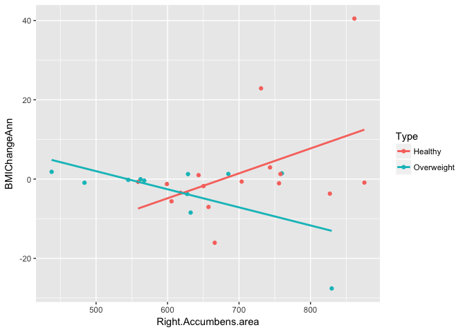
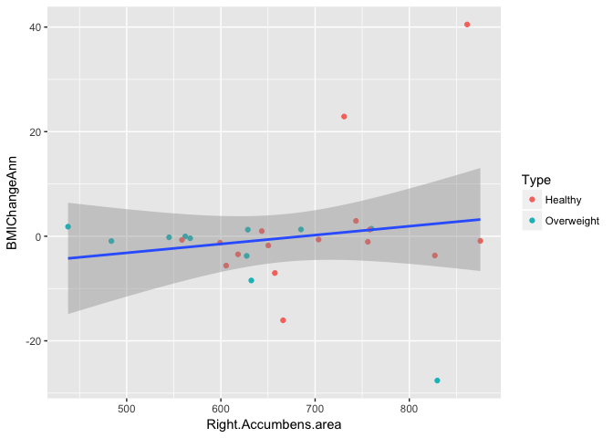
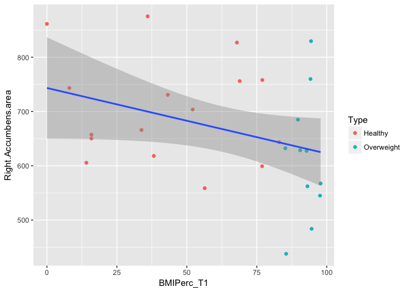
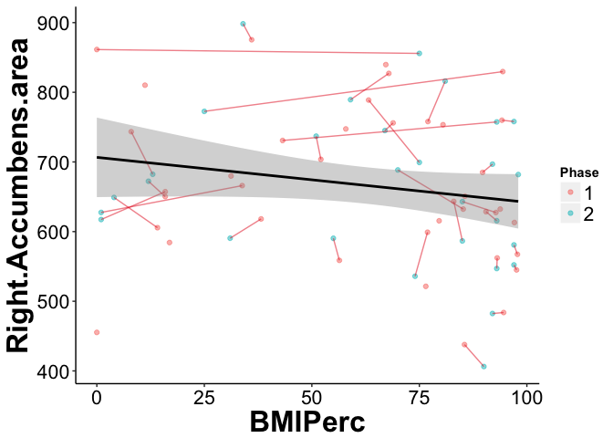
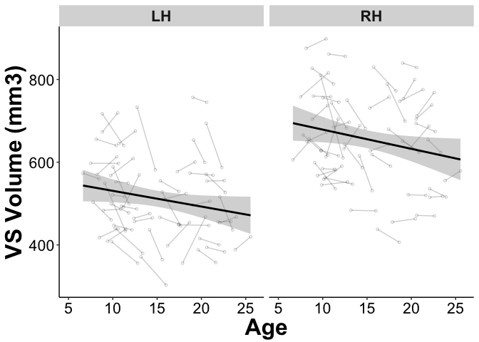
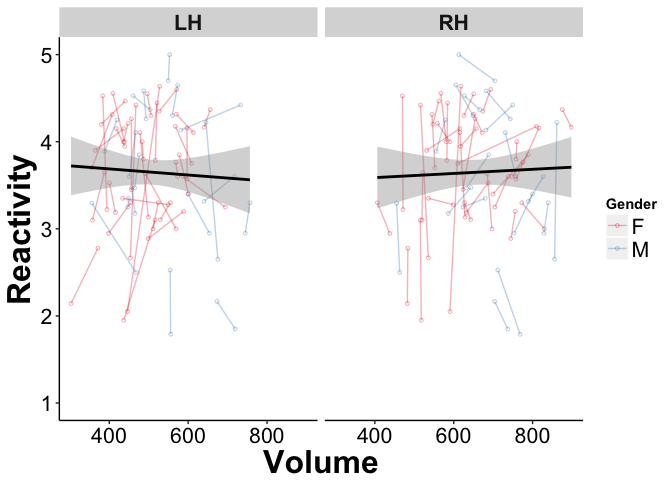
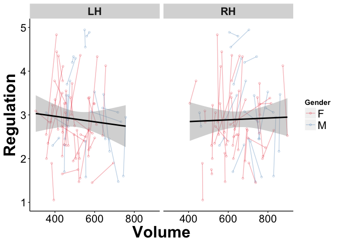
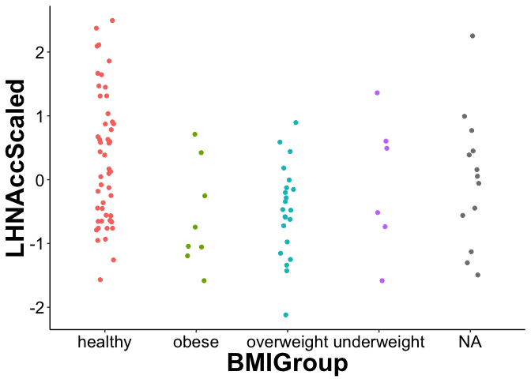
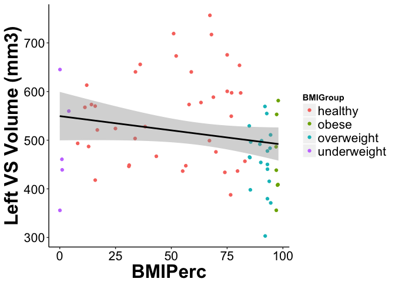

Subcortical Analysis
================
Rebecca Martin
6/24/2018

-   [Settings](#settings)
-   [Packages](#packages)
-   [Read in data](#read-in-data)
-   [Merge ROI data with behavioral data, add age terms, and center (zscore) subcortical values](#merge-roi-data-with-behavioral-data-add-age-terms-and-center-zscore-subcortical-values)
-   [Make subsets](#make-subsets)
-   [Prep Graphs](#prep-graphs)
-   [Subcortical ROIs](#subcortical-rois)
    -   [Question 1: Volume](#question-1-volume)
    -   [Question 2: Rates of change](#question-2-rates-of-change)
    -   [Question 3: Weight Gain and NAcc](#question-3-weight-gain-and-nacc)
    -   [Prep data to look at NAcc and BMI Percentile](#prep-data-to-look-at-nacc-and-bmi-percentile)
    -   [Plots](#plots)
    -   [Plot VS and Age](#plot-vs-and-age)
    -   [Reviewer Request: Report BMI percentile regressions](#reviewer-request-report-bmi-percentile-regressions)

Note: this script needs to be proofread and cleaned up and is not a final version

Settings
--------

``` r
knitr::opts_chunk$set(cache=TRUE)
```

``` r
root <- rprojroot::find_rstudio_root_file()
dataDir <- file.path(root, 'data')
codeDir <- file.path(root, 'code')
figureDir <- file.path(root, 'figures')
```

Packages
--------

``` r
library(tidyverse)
library(lme4)
library(lmerTest)
library(bmlm)
library(arm)
```

Read in data
------------

``` r
## Behavioral
appAvgLong <- read.table(file.path(dataDir,"app_avg_long.txt"), header=TRUE, sep="\t") ## for graphing 
appAvgWide <- read.table(file.path(dataDir,"app_avg_wide.txt"), header=TRUE, sep="\t")
demographicsLong <- read.table(file.path(dataDir,"demographicsLong.txt"), header=TRUE, sep="\t")
appBehavLongRaw <- read.table(file.path(dataDir,"app_behav_long.txt"), header=TRUE, sep="\t")

# Subcortical ROIs
asegLong <- read.table(file.path(dataDir,"asegLong.txt"), header=TRUE, sep="\t")
asegRate <- read.table(file.path(dataDir, "appAsegRate.txt"), header=TRUE, sep="\t")
aseg2TPWide <- read.table(file.path(dataDir, "aseg2TPwide.txt"), header=TRUE, sep="\t")
```

Merge ROI data with behavioral data, add age terms, and center (zscore) subcortical values
------------------------------------------------------------------------------------------

``` r
## Merge data
appLongAll <- merge(appBehavLongRaw, demographicsLong, by=c('ID', 'Phase'))
asegLongPlusBehav <- merge(appLongAll, asegLong, by=c('ID', 'Phase'))
asegLongPlusBehav2TP <- merge(appLongAll, asegLong, by=c('ID', 'Phase'))
aseg2TPbehav <- merge(appAvgLong, asegLong, by=c('ID', 'Phase'))
asegRatePlusBehav <- merge(appAvgWide, asegRate, by=c("ID","fsid"))
aseg2TPWideBehav <- merge(appAvgWide, aseg2TPWide, by=c('fsid'))

## Age Terms
aseg2TPbehav$AgeCent <- scale(aseg2TPbehav$Age, scale=FALSE)
aseg2TPbehav$AgeCent <- as.numeric(aseg2TPbehav$AgeCent)
aseg2TPbehav$AgeCentSq <- aseg2TPbehav$AgeCent*aseg2TPbehav$AgeCent
aseg2TPbehav$AgeCentCu <- aseg2TPbehav$AgeCent*aseg2TPbehav$AgeCent*aseg2TPbehav$AgeCent

asegLongPlusBehav$AgeCent <- scale(asegLongPlusBehav$Age, scale=FALSE)
asegLongPlusBehav$AgeCent <- as.numeric(asegLongPlusBehav$AgeCent)
asegLongPlusBehav$AgeCentSq <- asegLongPlusBehav$AgeCent*asegLongPlusBehav$AgeCent
asegLongPlusBehav$AgeCentCu <- asegLongPlusBehav$AgeCent*asegLongPlusBehav$AgeCent*asegLongPlusBehav$AgeCent

## Scale Volumes
aseg2TPbehav$RHNAccScaled <- scale(aseg2TPbehav$Right.Accumbens.area)
aseg2TPbehav$LHNAccScaled <- scale(aseg2TPbehav$Left.Accumbens.area)
aseg2TPbehav$ETivCrossScaled <- scale(aseg2TPbehav$ETivCross)
aseg2TPbehav$LHWBVScaled <- scale(aseg2TPbehav$lhCortexVol)
aseg2TPbehav$RHWBVScaled <- scale(aseg2TPbehav$rhCortexVol)
aseg2TPbehav$RHNAccScaled <- as.numeric(aseg2TPbehav$RHNAccScaled)
aseg2TPbehav$LHNAccScaled <- as.numeric(aseg2TPbehav$LHNAccScaled)
aseg2TPbehav$ETivCrossScaled <- as.numeric(aseg2TPbehav$ETivCrossScaled)
aseg2TPbehav$LHWBVScaled <- as.numeric(aseg2TPbehav$LHWBVScaled)
aseg2TPbehav$RHWBVScaled <- as.numeric(aseg2TPbehav$RHWBVScaled)

asegLongPlusBehav$RHNAccScaled <- scale(asegLongPlusBehav$Right.Accumbens.area)
asegLongPlusBehav$LHNAccScaled <- scale(asegLongPlusBehav$Left.Accumbens.area)
asegLongPlusBehav$ETivCrossScaled <- scale(asegLongPlusBehav$ETivCross)
asegLongPlusBehav$LHWBVScaled <- scale(asegLongPlusBehav$lhCortexVol)
asegLongPlusBehav$RHWBVScaled <- scale(asegLongPlusBehav$rhCortexVol)
asegLongPlusBehav$RHNAccScaled <- as.numeric(asegLongPlusBehav$RHNAccScaled)
asegLongPlusBehav$LHNAccScaled <- as.numeric(asegLongPlusBehav$LHNAccScaled)
asegLongPlusBehav$ETivCrossScaled <- as.numeric(asegLongPlusBehav$ETivCrossScaled)
asegLongPlusBehav$LHWBVScaled <- as.numeric(asegLongPlusBehav$LHWBVScaled)
asegLongPlusBehav$RHWBVScaled <- as.numeric(asegLongPlusBehav$RHWBVScaled)
```

Make subsets
------------

``` r
asegLongPlusBehavClose <- asegLongPlusBehav %>% dplyr::filter(Type=="Close")
asegLongPlusBehavFar <- asegLongPlusBehav %>% dplyr::filter(Type=="Far")
```

Prep Graphs
-----------

Subcortical ROIs
================

Question 1: Volume
------------------

Does NAcc volume predict reactivity or regulation (accounting for gender, then accounting for ICV, then accounting for WBV)?

``` r
## Close
summary(NAccLHClose <- lmer(LHNAccScaled ~ AgeCent + (1 | ID), data=aseg2TPbehav))
```

    ## Linear mixed model fit by REML. t-tests use Satterthwaite's method [
    ## lmerModLmerTest]
    ## Formula: LHNAccScaled ~ AgeCent + (1 | ID)
    ##    Data: aseg2TPbehav
    ## 
    ## REML criterion at convergence: 214.7
    ## 
    ## Scaled residuals: 
    ##      Min       1Q   Median       3Q      Max 
    ## -1.89986 -0.36614 -0.00384  0.33957  2.26328 
    ## 
    ## Random effects:
    ##  Groups   Name        Variance Std.Dev.
    ##  ID       (Intercept) 0.8533   0.9238  
    ##  Residual             0.1319   0.3632  
    ## Number of obs: 98, groups:  ID, 49
    ## 
    ## Fixed effects:
    ##               Estimate Std. Error         df t value Pr(>|t|)  
    ## (Intercept) -2.368e-17  1.370e-01  4.744e+01   0.000   1.0000  
    ## AgeCent     -4.876e-02  2.171e-02  9.157e+01  -2.246   0.0271 *
    ## ---
    ## Signif. codes:  0 '***' 0.001 '**' 0.01 '*' 0.05 '.' 0.1 ' ' 1
    ## 
    ## Correlation of Fixed Effects:
    ##         (Intr)
    ## AgeCent 0.000

``` r
summary(NAccRHClose <- lmer(RHNAccScaled ~ AgeCent + (1 | ID), data=aseg2TPbehav))
```

    ## Linear mixed model fit by REML. t-tests use Satterthwaite's method [
    ## lmerModLmerTest]
    ## Formula: RHNAccScaled ~ AgeCent + (1 | ID)
    ##    Data: aseg2TPbehav
    ## 
    ## REML criterion at convergence: 200
    ## 
    ## Scaled residuals: 
    ##      Min       1Q   Median       3Q      Max 
    ## -2.69252 -0.47861 -0.05729  0.38469  2.80392 
    ## 
    ## Random effects:
    ##  Groups   Name        Variance Std.Dev.
    ##  ID       (Intercept) 0.8775   0.9368  
    ##  Residual             0.0968   0.3111  
    ## Number of obs: 98, groups:  ID, 49
    ## 
    ## Fixed effects:
    ##               Estimate Std. Error         df t value Pr(>|t|)  
    ## (Intercept)  7.883e-17  1.375e-01  4.772e+01    0.00   1.0000  
    ## AgeCent     -4.148e-02  2.033e-02  9.562e+01   -2.04   0.0441 *
    ## ---
    ## Signif. codes:  0 '***' 0.001 '**' 0.01 '*' 0.05 '.' 0.1 ' ' 1
    ## 
    ## Correlation of Fixed Effects:
    ##         (Intr)
    ## AgeCent 0.000

``` r
summary(NAccLHClose <- lmer(Close ~ LHNAccScaled + (1 | ID), data=aseg2TPbehav))
```

    ## Linear mixed model fit by REML. t-tests use Satterthwaite's method [
    ## lmerModLmerTest]
    ## Formula: Close ~ LHNAccScaled + (1 | ID)
    ##    Data: aseg2TPbehav
    ## 
    ## REML criterion at convergence: 201
    ## 
    ## Scaled residuals: 
    ##      Min       1Q   Median       3Q      Max 
    ## -2.82301 -0.44496  0.08319  0.48404  2.43866 
    ## 
    ## Random effects:
    ##  Groups   Name        Variance Std.Dev.
    ##  ID       (Intercept) 0.2719   0.5214  
    ##  Residual             0.2424   0.4923  
    ## Number of obs: 98, groups:  ID, 49
    ## 
    ## Fixed effects:
    ##               Estimate Std. Error        df t value Pr(>|t|)    
    ## (Intercept)   3.648788   0.089563 46.968402  40.740   <2e-16 ***
    ## LHNAccScaled -0.004973   0.083631 69.113465  -0.059    0.953    
    ## ---
    ## Signif. codes:  0 '***' 0.001 '**' 0.01 '*' 0.05 '.' 0.1 ' ' 1
    ## 
    ## Correlation of Fixed Effects:
    ##             (Intr)
    ## LHNAccScald 0.000

``` r
summary(NAccRHClose <- lmer(Close ~ RHNAccScaled + (1 | ID), data=aseg2TPbehav))
```

    ## Linear mixed model fit by REML. t-tests use Satterthwaite's method [
    ## lmerModLmerTest]
    ## Formula: Close ~ RHNAccScaled + (1 | ID)
    ##    Data: aseg2TPbehav
    ## 
    ## REML criterion at convergence: 200.7
    ## 
    ## Scaled residuals: 
    ##      Min       1Q   Median       3Q      Max 
    ## -2.80389 -0.45239  0.09492  0.49940  2.44795 
    ## 
    ## Random effects:
    ##  Groups   Name        Variance Std.Dev.
    ##  ID       (Intercept) 0.2739   0.5234  
    ##  Residual             0.2405   0.4904  
    ## Number of obs: 98, groups:  ID, 49
    ## 
    ## Fixed effects:
    ##              Estimate Std. Error       df t value Pr(>|t|)    
    ## (Intercept)   3.64879    0.08969 47.15782  40.682   <2e-16 ***
    ## RHNAccScaled  0.04228    0.08539 63.11613   0.495    0.622    
    ## ---
    ## Signif. codes:  0 '***' 0.001 '**' 0.01 '*' 0.05 '.' 0.1 ' ' 1
    ## 
    ## Correlation of Fixed Effects:
    ##             (Intr)
    ## RHNAccScald 0.000

``` r
## Far
summary(NAccLHFar <- lmer(Far ~ LHNAccScaled + (1 | ID), data=aseg2TPbehav))
```

    ## Linear mixed model fit by REML. t-tests use Satterthwaite's method [
    ## lmerModLmerTest]
    ## Formula: Far ~ LHNAccScaled + (1 | ID)
    ##    Data: aseg2TPbehav
    ## 
    ## REML criterion at convergence: 249.9
    ## 
    ## Scaled residuals: 
    ##      Min       1Q   Median       3Q      Max 
    ## -1.51556 -0.69187 -0.03015  0.68026  2.13793 
    ## 
    ## Random effects:
    ##  Groups   Name        Variance Std.Dev.
    ##  ID       (Intercept) 0.3203   0.5660  
    ##  Residual             0.4717   0.6868  
    ## Number of obs: 98, groups:  ID, 49
    ## 
    ## Fixed effects:
    ##              Estimate Std. Error       df t value Pr(>|t|)    
    ## (Intercept)   2.89834    0.10654 46.86450  27.205   <2e-16 ***
    ## LHNAccScaled -0.03306    0.10228 63.36738  -0.323    0.748    
    ## ---
    ## Signif. codes:  0 '***' 0.001 '**' 0.01 '*' 0.05 '.' 0.1 ' ' 1
    ## 
    ## Correlation of Fixed Effects:
    ##             (Intr)
    ## LHNAccScald 0.000

``` r
summary(NAccRHFar <- lmer(Far ~ RHNAccScaled + (1 | ID), data=aseg2TPbehav))
```

    ## Linear mixed model fit by REML. t-tests use Satterthwaite's method [
    ## lmerModLmerTest]
    ## Formula: Far ~ RHNAccScaled + (1 | ID)
    ##    Data: aseg2TPbehav
    ## 
    ## REML criterion at convergence: 249.7
    ## 
    ## Scaled residuals: 
    ##      Min       1Q   Median       3Q      Max 
    ## -1.42995 -0.71073 -0.05184  0.70002  2.18605 
    ## 
    ## Random effects:
    ##  Groups   Name        Variance Std.Dev.
    ##  ID       (Intercept) 0.3311   0.5754  
    ##  Residual             0.4647   0.6817  
    ## Number of obs: 98, groups:  ID, 49
    ## 
    ## Fixed effects:
    ##              Estimate Std. Error       df t value Pr(>|t|)    
    ## (Intercept)   2.89834    0.10723 46.87481  27.029   <2e-16 ***
    ## RHNAccScaled  0.04941    0.10411 58.83204   0.475    0.637    
    ## ---
    ## Signif. codes:  0 '***' 0.001 '**' 0.01 '*' 0.05 '.' 0.1 ' ' 1
    ## 
    ## Correlation of Fixed Effects:
    ##             (Intr)
    ## RHNAccScald 0.000

``` r
## Close X Age Interaction
summary(NAccLHCloseInt <- lmer(Close ~ LHNAccScaled*AgeCent + Gender + (1 | ID), data=aseg2TPbehav))
```

    ## Linear mixed model fit by REML. t-tests use Satterthwaite's method [
    ## lmerModLmerTest]
    ## Formula: Close ~ LHNAccScaled * AgeCent + Gender + (1 | ID)
    ##    Data: aseg2TPbehav
    ## 
    ## REML criterion at convergence: 207
    ## 
    ## Scaled residuals: 
    ##      Min       1Q   Median       3Q      Max 
    ## -2.78663 -0.44247  0.08122  0.45467  2.42883 
    ## 
    ## Random effects:
    ##  Groups   Name        Variance Std.Dev.
    ##  ID       (Intercept) 0.2541   0.5041  
    ##  Residual             0.2314   0.4810  
    ## Number of obs: 98, groups:  ID, 49
    ## 
    ## Fixed effects:
    ##                       Estimate Std. Error        df t value Pr(>|t|)    
    ## (Intercept)           3.686563   0.109516 45.139043  33.662  < 2e-16 ***
    ## LHNAccScaled         -0.042947   0.086316 66.993771  -0.498  0.62042    
    ## AgeCent              -0.047000   0.016869 57.286156  -2.786  0.00722 ** 
    ## GenderM              -0.084394   0.190625 46.224881  -0.443  0.66003    
    ## LHNAccScaled:AgeCent  0.008719   0.016954 70.341348   0.514  0.60869    
    ## ---
    ## Signif. codes:  0 '***' 0.001 '**' 0.01 '*' 0.05 '.' 0.1 ' ' 1
    ## 
    ## Correlation of Fixed Effects:
    ##             (Intr) LHNAcS AgeCnt GendrM
    ## LHNAccScald  0.159                     
    ## AgeCent      0.010  0.200              
    ## GenderM     -0.590 -0.276 -0.018       
    ## LHNAccSc:AC  0.096 -0.048 -0.007  0.091

``` r
summary(NAccRHCloseInt <- lmer(Close ~ RHNAccScaled*AgeCent + Gender + (1 | ID), data=aseg2TPbehav))
```

    ## Linear mixed model fit by REML. t-tests use Satterthwaite's method [
    ## lmerModLmerTest]
    ## Formula: Close ~ RHNAccScaled * AgeCent + Gender + (1 | ID)
    ##    Data: aseg2TPbehav
    ## 
    ## REML criterion at convergence: 207.4
    ## 
    ## Scaled residuals: 
    ##      Min       1Q   Median       3Q      Max 
    ## -2.76859 -0.42964  0.06615  0.44539  2.41551 
    ## 
    ## Random effects:
    ##  Groups   Name        Variance Std.Dev.
    ##  ID       (Intercept) 0.2600   0.5099  
    ##  Residual             0.2305   0.4801  
    ## Number of obs: 98, groups:  ID, 49
    ## 
    ## Fixed effects:
    ##                       Estimate Std. Error        df t value Pr(>|t|)    
    ## (Intercept)           3.692742   0.111235 45.429265  33.198   <2e-16 ***
    ## RHNAccScaled          0.007595   0.087969 61.495222   0.086   0.9315    
    ## AgeCent              -0.045063   0.017017 58.244801  -2.648   0.0104 *  
    ## GenderM              -0.122483   0.189680 45.461282  -0.646   0.5217    
    ## RHNAccScaled:AgeCent  0.001374   0.016717 72.239407   0.082   0.9347    
    ## ---
    ## Signif. codes:  0 '***' 0.001 '**' 0.01 '*' 0.05 '.' 0.1 ' ' 1
    ## 
    ## Correlation of Fixed Effects:
    ##             (Intr) RHNAcS AgeCnt GendrM
    ## RHNAccScald  0.134                     
    ## AgeCent      0.015  0.205              
    ## GenderM     -0.596 -0.240 -0.015       
    ## RHNAccSc:AC  0.177 -0.047  0.043 -0.030

``` r
### Not really. 
## Age predicts NAcc volume
## Age*NAcc does not predict close scoress. Controlling for Gender and ETivCross doesn't help. 
```

Question 2: Rates of change
---------------------------

Does change in volume predict change in rating? Is there an interaction with age?

``` r
## Close
## Age and reactivity rate change? 
summary(lm(CloseAnn ~ Age_T1, data=asegRatePlusBehav))
```

    ## 
    ## Call:
    ## lm(formula = CloseAnn ~ Age_T1, data = asegRatePlusBehav)
    ## 
    ## Residuals:
    ##      Min       1Q   Median       3Q      Max 
    ## -1.14940 -0.13327 -0.02604  0.21072  0.98447 
    ## 
    ## Coefficients:
    ##              Estimate Std. Error t value Pr(>|t|)
    ## (Intercept) -0.205883   0.152848  -1.347    0.184
    ## Age_T1       0.007267   0.010267   0.708    0.483
    ## 
    ## Residual standard error: 0.3552 on 47 degrees of freedom
    ## Multiple R-squared:  0.01055,    Adjusted R-squared:  -0.01051 
    ## F-statistic: 0.501 on 1 and 47 DF,  p-value: 0.4826

``` r
## Far
summary(lm(FarAnn ~ Age_T1, data=asegRatePlusBehav))
```

    ## 
    ## Call:
    ## lm(formula = FarAnn ~ Age_T1, data = asegRatePlusBehav)
    ## 
    ## Residuals:
    ##      Min       1Q   Median       3Q      Max 
    ## -0.80380 -0.29007 -0.01993  0.29460  1.06973 
    ## 
    ## Coefficients:
    ##              Estimate Std. Error t value Pr(>|t|)
    ## (Intercept) -0.005037   0.198213  -0.025    0.980
    ## Age_T1      -0.011218   0.013314  -0.843    0.404
    ## 
    ## Residual standard error: 0.4606 on 47 degrees of freedom
    ## Multiple R-squared:  0.01488,    Adjusted R-squared:  -0.00608 
    ## F-statistic: 0.7099 on 1 and 47 DF,  p-value: 0.4037

``` r
## Age X NAcc rate change interactions on behavior?
summary(lm(CloseAnn ~  Right.Accumbens.area*AgeCent_T1 + Gender, data=asegRatePlusBehav))
```

    ## 
    ## Call:
    ## lm(formula = CloseAnn ~ Right.Accumbens.area * AgeCent_T1 + Gender, 
    ##     data = asegRatePlusBehav)
    ## 
    ## Residuals:
    ##      Min       1Q   Median       3Q      Max 
    ## -1.13016 -0.09818  0.01207  0.14386  1.04314 
    ## 
    ## Coefficients:
    ##                                   Estimate Std. Error t value Pr(>|t|)
    ## (Intercept)                     -0.0870148  0.0660816  -1.317    0.195
    ## Right.Accumbens.area             0.0016973  0.0023026   0.737    0.465
    ## AgeCent_T1                       0.0058343  0.0105385   0.554    0.583
    ## GenderM                         -0.0476444  0.1135069  -0.420    0.677
    ## Right.Accumbens.area:AgeCent_T1  0.0005415  0.0005365   1.009    0.318
    ## 
    ## Residual standard error: 0.3619 on 44 degrees of freedom
    ## Multiple R-squared:  0.03852,    Adjusted R-squared:  -0.04889 
    ## F-statistic: 0.4407 on 4 and 44 DF,  p-value: 0.7785

``` r
## Far
summary(lm(FarAnn ~ Right.Accumbens.area*AgeCent_T1 + Gender, data=asegRatePlusBehav))
```

    ## 
    ## Call:
    ## lm(formula = FarAnn ~ Right.Accumbens.area * AgeCent_T1 + Gender, 
    ##     data = asegRatePlusBehav)
    ## 
    ## Residuals:
    ##      Min       1Q   Median       3Q      Max 
    ## -0.83985 -0.31600  0.07196  0.23940  1.01493 
    ## 
    ## Coefficients:
    ##                                   Estimate Std. Error t value Pr(>|t|)  
    ## (Intercept)                     -0.1338275  0.0813436  -1.645    0.107  
    ## Right.Accumbens.area             0.0063162  0.0028344   2.228    0.031 *
    ## AgeCent_T1                      -0.0145478  0.0129724  -1.121    0.268  
    ## GenderM                         -0.0436663  0.1397222  -0.313    0.756  
    ## Right.Accumbens.area:AgeCent_T1  0.0010642  0.0006604   1.612    0.114  
    ## ---
    ## Signif. codes:  0 '***' 0.001 '**' 0.01 '*' 0.05 '.' 0.1 ' ' 1
    ## 
    ## Residual standard error: 0.4455 on 44 degrees of freedom
    ## Multiple R-squared:  0.1375, Adjusted R-squared:  0.05905 
    ## F-statistic: 1.753 on 4 and 44 DF,  p-value: 0.1555

Question 3: Weight Gain and NAcc
--------------------------------

Are people with smaller NAcc volumes more likely to increase in weight at time 2?

``` r
summary(NAccBMILH <- lm(BMIPerc_T2 ~ BMIPerc_T1*Left.Accumbens.area + Age_T1, data=aseg2TPWideBehav))
```

    ## 
    ## Call:
    ## lm(formula = BMIPerc_T2 ~ BMIPerc_T1 * Left.Accumbens.area + 
    ##     Age_T1, data = aseg2TPWideBehav)
    ## 
    ## Residuals:
    ##     Min      1Q  Median      3Q     Max 
    ## -63.655  -9.242   1.512   8.228  48.446 
    ## 
    ## Coefficients:
    ##                                  Estimate Std. Error t value Pr(>|t|)   
    ## (Intercept)                    -1.329e+02  6.893e+01  -1.929  0.06622 . 
    ## BMIPerc_T1                      2.720e+00  9.012e-01   3.018  0.00613 **
    ## Left.Accumbens.area             2.504e-01  1.199e-01   2.088  0.04809 * 
    ## Age_T1                          1.295e+00  1.486e+00   0.871  0.39260   
    ## BMIPerc_T1:Left.Accumbens.area -3.803e-03  1.729e-03  -2.200  0.03815 * 
    ## ---
    ## Signif. codes:  0 '***' 0.001 '**' 0.01 '*' 0.05 '.' 0.1 ' ' 1
    ## 
    ## Residual standard error: 21.94 on 23 degrees of freedom
    ##   (21 observations deleted due to missingness)
    ## Multiple R-squared:  0.6327, Adjusted R-squared:  0.5688 
    ## F-statistic: 9.905 on 4 and 23 DF,  p-value: 8.233e-05

``` r
summary(NAccBMIRH <- lm(BMIPerc_T2 ~ Right.Accumbens.area*BMIPerc_T1 + Age_T1 + ETivCross, data=aseg2TPWideBehav))
```

    ## 
    ## Call:
    ## lm(formula = BMIPerc_T2 ~ Right.Accumbens.area * BMIPerc_T1 + 
    ##     Age_T1 + ETivCross, data = aseg2TPWideBehav)
    ## 
    ## Residuals:
    ##     Min      1Q  Median      3Q     Max 
    ## -40.691  -7.047  -0.419   7.829  46.176 
    ## 
    ## Coefficients:
    ##                                   Estimate Std. Error t value Pr(>|t|)    
    ## (Intercept)                     -1.909e+02  6.073e+01  -3.143 0.004910 ** 
    ## Right.Accumbens.area             2.592e-01  9.722e-02   2.666 0.014461 *  
    ## BMIPerc_T1                       3.559e+00  8.398e-01   4.238 0.000368 ***
    ## Age_T1                           4.030e-01  1.470e+00   0.274 0.786659    
    ## ETivCross                        1.234e-05  1.762e-05   0.701 0.491164    
    ## Right.Accumbens.area:BMIPerc_T1 -3.995e-03  1.219e-03  -3.276 0.003603 ** 
    ## ---
    ## Signif. codes:  0 '***' 0.001 '**' 0.01 '*' 0.05 '.' 0.1 ' ' 1
    ## 
    ## Residual standard error: 19.02 on 21 degrees of freedom
    ##   (22 observations deleted due to missingness)
    ## Multiple R-squared:  0.7464, Adjusted R-squared:  0.686 
    ## F-statistic: 12.36 on 5 and 21 DF,  p-value: 1.131e-05

``` r
### this interaction is significant, particularly for right hemisphere. holds up when controlling for age and interaction with age also significant

## how about does BMI predict accumbens volume at T2?
summary(NAccBMI2 <- lm(Right.Accumbens.area.1 ~ BMIPerc_T1*Right.Accumbens.area + Age_T1 + ETivCross, data=aseg2TPWideBehav))
```

    ## 
    ## Call:
    ## lm(formula = Right.Accumbens.area.1 ~ BMIPerc_T1 * Right.Accumbens.area + 
    ##     Age_T1 + ETivCross, data = aseg2TPWideBehav)
    ## 
    ## Residuals:
    ##      Min       1Q   Median       3Q      Max 
    ## -114.806  -26.714    2.047   29.886   72.499 
    ## 
    ## Coefficients:
    ##                                   Estimate Std. Error t value Pr(>|t|)    
    ## (Intercept)                      9.977e+01  9.648e+01   1.034  0.30863    
    ## BMIPerc_T1                      -1.657e+00  1.298e+00  -1.276  0.21093    
    ## Right.Accumbens.area             6.982e-01  1.353e-01   5.160 1.15e-05 ***
    ## Age_T1                          -1.492e+00  1.923e+00  -0.776  0.44342    
    ## ETivCross                        7.050e-05  2.548e-05   2.767  0.00919 ** 
    ## BMIPerc_T1:Right.Accumbens.area  3.225e-03  1.965e-03   1.641  0.11025    
    ## ---
    ## Signif. codes:  0 '***' 0.001 '**' 0.01 '*' 0.05 '.' 0.1 ' ' 1
    ## 
    ## Residual standard error: 46.06 on 33 degrees of freedom
    ##   (10 observations deleted due to missingness)
    ## Multiple R-squared:  0.8588, Adjusted R-squared:  0.8374 
    ## F-statistic: 40.15 on 5 and 33 DF,  p-value: 4.243e-13

``` r
## does NAcc correlate with BMI Perc controlling for age
summary(NAccCorr <- lm(Right.Accumbens.area ~ BMIPerc_T1 + Age_T1, data=aseg2TPWideBehav))
```

    ## 
    ## Call:
    ## lm(formula = Right.Accumbens.area ~ BMIPerc_T1 + Age_T1, data = aseg2TPWideBehav)
    ## 
    ## Residuals:
    ##     Min      1Q  Median      3Q     Max 
    ## -244.99  -67.87  -13.25   90.48  187.86 
    ## 
    ## Coefficients:
    ##             Estimate Std. Error t value Pr(>|t|)    
    ## (Intercept) 725.3388    62.3017  11.642 6.21e-14 ***
    ## BMIPerc_T1   -0.6506     0.5663  -1.149    0.258    
    ## Age_T1       -1.4019     4.4432  -0.316    0.754    
    ## ---
    ## Signif. codes:  0 '***' 0.001 '**' 0.01 '*' 0.05 '.' 0.1 ' ' 1
    ## 
    ## Residual standard error: 111.3 on 37 degrees of freedom
    ##   (9 observations deleted due to missingness)
    ## Multiple R-squared:  0.04209,    Adjusted R-squared:  -0.00969 
    ## F-statistic: 0.8129 on 2 and 37 DF,  p-value: 0.4514

``` r
### Nope!
```

Prep data to look at NAcc and BMI Percentile
--------------------------------------------

``` r
## Make subset for volume
BMIPercPlot <- aseg2TPWideBehav %>% dplyr::select(Right.Accumbens.area, Left.Accumbens.area, BMIPerc_T1, BMIPerc_T2, BMIGroup_T1_Reduced, BMIGroup_T2_Reduced, Age_T1, ETivCross, TimeElapsed)

## Make subsets for rate changes
BMIPercPlotRate <- asegRatePlusBehav %>% dplyr::select(Right.Accumbens.area, Left.Accumbens.area, BMIPerc_T1, BMIPerc_T2, Age_T1)

BMIPercPlotRate$BMIChange <- BMIPercPlotRate$BMIPerc_T1 - BMIPercPlotRate$BMIPerc_T2

BMIPercPlotRate <- BMIPercPlotRate %>% dplyr::mutate(WeightGroup=ifelse(BMIPerc_T1 < 85, 'Healthy', 'Overweight'))

BMIPercPlotRateNoNAs <- BMIPercPlotRate %>% dplyr::filter(complete.cases(.))

BMIPercPlotRate <- asegRatePlusBehav %>% dplyr::select(Right.Accumbens.area, Left.Accumbens.area, BMIPerc_T1, BMIPerc_T2, Age_T1)

BMIPercPlotRate$BMIChange <- BMIPercPlotRate$BMIPerc_T1 - BMIPercPlotRate$BMIPerc_T2

BMIPercPlotRate <- BMIPercPlotRate %>% dplyr::mutate(WeightGroup=ifelse(BMIPerc_T1 < 85, 'Healthy', 'Overweight'))

BMIPercPlotRateNoNAs <- BMIPercPlotRate %>% dplyr::filter(complete.cases(.))

## Remove NAs
BMIPercPlotNoNAs <- BMIPercPlot %>% dplyr::filter(complete.cases(.))
NAccBMIRH <- lm(BMIPerc_T2 ~ Right.Accumbens.area*BMIPerc_T1 + Age_T1 + ETivCross, data=BMIPercPlotNoNAs, na.action = na.exclude)

## make BMI change score
BMIPercPlotNoNAs$BMIChangeAnn <- (BMIPercPlotNoNAs$BMIPerc_T2 - BMIPercPlotNoNAs$BMIPerc_T1)/BMIPercPlotNoNAs$TimeElapsed

### Center for interactions
BMIPercPlotNoNAs$RHNAccScaled <- scale(BMIPercPlotNoNAs$Right.Accumbens.area)
BMIPercPlotNoNAs$LHNAccScaled <- scale(BMIPercPlotNoNAs$Left.Accumbens.area)
BMIPercPlotNoNAs$ETivCrossScaled <- scale(BMIPercPlotNoNAs$ETivCross)
BMIPercPlotNoNAs$BMIPerc_T1_Scaled <- scale(BMIPercPlotNoNAs$BMIPerc_T1, scale=FALSE)

BMIPercPlotNoNAs$RHNAccScaled <- as.numeric(BMIPercPlotNoNAs$RHNAccScaled)
BMIPercPlotNoNAs$LHNAccScaled <- as.numeric(BMIPercPlotNoNAs$LHNAccScaled)
BMIPercPlotNoNAs$ETivCrossScaled <- as.numeric(BMIPercPlotNoNAs$ETivCrossScaled)
BMIPercPlotNoNAs$BMIPerc_T1_Scaled <- as.numeric(BMIPercPlotNoNAs$BMIPerc_T1_Scaled)

## make low/high distinction for BMI
BMIPercPlotNoNAs <- BMIPercPlotNoNAs %>% dplyr::mutate(Type=ifelse(BMIPerc_T1 < 85, 'Healthy', 'Overweight'))
```

Question 4: Volume change and BMI

``` r
summary(NAccBMIRHChange <- lm(BMIChangeAnn ~ Right.Accumbens.area*BMIPerc_T1 + ETivCross, data=BMIPercPlotNoNAs, na.action = na.exclude))
```

    ## 
    ## Call:
    ## lm(formula = BMIChangeAnn ~ Right.Accumbens.area * BMIPerc_T1 + 
    ##     ETivCross, data = BMIPercPlotNoNAs, na.action = na.exclude)
    ## 
    ## Residuals:
    ##      Min       1Q   Median       3Q      Max 
    ## -16.0715  -3.1976  -0.3749   4.1021  21.4435 
    ## 
    ## Coefficients:
    ##                                   Estimate Std. Error t value Pr(>|t|)    
    ## (Intercept)                     -9.954e+01  2.711e+01  -3.671 0.001340 ** 
    ## Right.Accumbens.area             1.408e-01  4.284e-02   3.288 0.003359 ** 
    ## BMIPerc_T1                       1.330e+00  3.651e-01   3.643 0.001436 ** 
    ## ETivCross                        4.730e-06  7.632e-06   0.620 0.541746    
    ## Right.Accumbens.area:BMIPerc_T1 -2.056e-03  5.334e-04  -3.855 0.000858 ***
    ## ---
    ## Signif. codes:  0 '***' 0.001 '**' 0.01 '*' 0.05 '.' 0.1 ' ' 1
    ## 
    ## Residual standard error: 8.543 on 22 degrees of freedom
    ## Multiple R-squared:  0.5279, Adjusted R-squared:  0.4421 
    ## F-statistic:  6.15 on 4 and 22 DF,  p-value: 0.001767

``` r
#### I think I can report on this one... There are only 24 subs and I think that there may be two outliers driving the effects. Need to look at cook's distance. 

## Does NAcc at T1 predict increases in BMI at time 2? 
summary(bmichange <- lm(BMIChangeAnn ~ Right.Accumbens.area, data=BMIPercPlotNoNAs))
```

    ## 
    ## Call:
    ## lm(formula = BMIChangeAnn ~ Right.Accumbens.area, data = BMIPercPlotNoNAs)
    ## 
    ## Residuals:
    ##     Min      1Q  Median      3Q     Max 
    ## -30.019  -3.416   0.196   2.034  37.532 
    ## 
    ## Coefficients:
    ##                       Estimate Std. Error t value Pr(>|t|)
    ## (Intercept)          -11.67208   13.76300  -0.848    0.404
    ## Right.Accumbens.area   0.01699    0.02036   0.834    0.412
    ## 
    ## Residual standard error: 11.5 on 25 degrees of freedom
    ## Multiple R-squared:  0.0271, Adjusted R-squared:  -0.01182 
    ## F-statistic: 0.6964 on 1 and 25 DF,  p-value: 0.4119

``` r
## nope not by itself

### How about controlling for BMI
summary(bmichange <- lm(BMIChangeAnn ~ Right.Accumbens.area + BMIPerc_T1, data=BMIPercPlotNoNAs))
```

    ## 
    ## Call:
    ## lm(formula = BMIChangeAnn ~ Right.Accumbens.area + BMIPerc_T1, 
    ##     data = BMIPercPlotNoNAs)
    ## 
    ## Residuals:
    ##     Min      1Q  Median      3Q     Max 
    ## -25.168  -4.989  -0.149   4.164  33.166 
    ## 
    ## Coefficients:
    ##                       Estimate Std. Error t value Pr(>|t|)
    ## (Intercept)           1.608085  16.608831   0.097    0.924
    ## Right.Accumbens.area  0.006642   0.021369   0.311    0.759
    ## BMIPerc_T1           -0.101108   0.073418  -1.377    0.181
    ## 
    ## Residual standard error: 11.3 on 24 degrees of freedom
    ## Multiple R-squared:  0.09835,    Adjusted R-squared:  0.02321 
    ## F-statistic: 1.309 on 2 and 24 DF,  p-value: 0.2887

``` r
## Closer

## Interaction??
summary(bmichange <- lm(BMIChangeAnn ~ Right.Accumbens.area*BMIPerc_T1, data=BMIPercPlotNoNAs))
```

    ## 
    ## Call:
    ## lm(formula = BMIChangeAnn ~ Right.Accumbens.area * BMIPerc_T1, 
    ##     data = BMIPercPlotNoNAs)
    ## 
    ## Residuals:
    ##      Min       1Q   Median       3Q      Max 
    ## -15.0443  -3.9737   0.3027   4.1653  21.0378 
    ## 
    ## Coefficients:
    ##                                   Estimate Std. Error t value Pr(>|t|)    
    ## (Intercept)                     -1.026e+02  2.630e+01  -3.901 0.000719 ***
    ## Right.Accumbens.area             1.542e-01  3.651e-02   4.223 0.000323 ***
    ## BMIPerc_T1                       1.405e+00  3.398e-01   4.135 0.000402 ***
    ## Right.Accumbens.area:BMIPerc_T1 -2.183e-03  4.861e-04  -4.491 0.000165 ***
    ## ---
    ## Signif. codes:  0 '***' 0.001 '**' 0.01 '*' 0.05 '.' 0.1 ' ' 1
    ## 
    ## Residual standard error: 8.428 on 23 degrees of freedom
    ## Multiple R-squared:  0.5197, Adjusted R-squared:  0.457 
    ## F-statistic: 8.294 on 3 and 23 DF,  p-value: 0.000642

``` r
summary(bmichange <- lm(BMIChangeAnn ~ Right.Accumbens.area*BMIGroup_T1_Reduced, data=BMIPercPlotNoNAs))
```

    ## 
    ## Call:
    ## lm(formula = BMIChangeAnn ~ Right.Accumbens.area * BMIGroup_T1_Reduced, 
    ##     data = BMIPercPlotNoNAs)
    ## 
    ## Residuals:
    ##      Min       1Q   Median       3Q      Max 
    ## -15.3721  -4.1097  -0.1454   3.3812  28.9103 
    ## 
    ## Coefficients:
    ##                                                     Estimate Std. Error
    ## (Intercept)                                        -42.56323   19.74596
    ## Right.Accumbens.area                                 0.06286    0.02783
    ## BMIGroup_T1_Reducedoverweight                       67.38350   26.53140
    ## Right.Accumbens.area:BMIGroup_T1_Reducedoverweight  -0.10851    0.03976
    ##                                                    t value Pr(>|t|)  
    ## (Intercept)                                         -2.156   0.0418 *
    ## Right.Accumbens.area                                 2.258   0.0337 *
    ## BMIGroup_T1_Reducedoverweight                        2.540   0.0183 *
    ## Right.Accumbens.area:BMIGroup_T1_Reducedoverweight  -2.729   0.0120 *
    ## ---
    ## Signif. codes:  0 '***' 0.001 '**' 0.01 '*' 0.05 '.' 0.1 ' ' 1
    ## 
    ## Residual standard error: 10.28 on 23 degrees of freedom
    ## Multiple R-squared:  0.2847, Adjusted R-squared:  0.1914 
    ## F-statistic: 3.052 on 3 and 23 DF,  p-value: 0.04884

``` r
summary(NAccBMIRHChangeScaled <- lm(BMIChangeAnn ~ LHNAccScaled*BMIPerc_T1_Scaled + ETivCrossScaled, data=BMIPercPlotNoNAs, na.action = na.exclude))
```

    ## 
    ## Call:
    ## lm(formula = BMIChangeAnn ~ LHNAccScaled * BMIPerc_T1_Scaled + 
    ##     ETivCrossScaled, data = BMIPercPlotNoNAs, na.action = na.exclude)
    ## 
    ## Residuals:
    ##      Min       1Q   Median       3Q      Max 
    ## -21.5383  -2.0122   0.6831   3.9493  23.8827 
    ## 
    ## Coefficients:
    ##                                Estimate Std. Error t value Pr(>|t|)
    ## (Intercept)                    -2.04061    2.21505  -0.921    0.367
    ## LHNAccScaled                   -1.16246    2.53123  -0.459    0.651
    ## BMIPerc_T1_Scaled              -0.08455    0.07148  -1.183    0.250
    ## ETivCrossScaled                 2.81428    2.87497   0.979    0.338
    ## LHNAccScaled:BMIPerc_T1_Scaled -0.14282    0.08329  -1.715    0.100
    ## 
    ## Residual standard error: 10.29 on 22 degrees of freedom
    ## Multiple R-squared:  0.3156, Adjusted R-squared:  0.1912 
    ## F-statistic: 2.536 on 4 and 22 DF,  p-value: 0.06901

``` r
####
NAccBMIRHChange <- lm(BMIChangeAnn ~ RHNAccScaled*BMIPerc_T1_Scaled + ETivCross, data=BMIPercPlotNoNAs, na.action = na.exclude)
summary(NAccBMIRHChange)
```

    ## 
    ## Call:
    ## lm(formula = BMIChangeAnn ~ RHNAccScaled * BMIPerc_T1_Scaled + 
    ##     ETivCross, data = BMIPercPlotNoNAs, na.action = na.exclude)
    ## 
    ## Residuals:
    ##      Min       1Q   Median       3Q      Max 
    ## -16.0715  -3.1976  -0.3749   4.1021  21.4435 
    ## 
    ## Coefficients:
    ##                                  Estimate Std. Error t value Pr(>|t|)    
    ## (Intercept)                    -8.238e+00  8.664e+00  -0.951 0.352005    
    ## RHNAccScaled                    1.235e+00  2.047e+00   0.603 0.552436    
    ## BMIPerc_T1_Scaled              -4.208e-02  5.862e-02  -0.718 0.480425    
    ## ETivCross                       4.730e-06  7.632e-06   0.620 0.541746    
    ## RHNAccScaled:BMIPerc_T1_Scaled -2.279e-01  5.911e-02  -3.855 0.000858 ***
    ## ---
    ## Signif. codes:  0 '***' 0.001 '**' 0.01 '*' 0.05 '.' 0.1 ' ' 1
    ## 
    ## Residual standard error: 8.543 on 22 degrees of freedom
    ## Multiple R-squared:  0.5279, Adjusted R-squared:  0.4421 
    ## F-statistic:  6.15 on 4 and 22 DF,  p-value: 0.001767

``` r
NAccBMIRHChangeL <- lm(BMIChangeAnn ~ LHNAccScaled*BMIPerc_T1_Scaled + ETivCross, data=BMIPercPlotNoNAs, na.action = na.exclude)
summary(NAccBMIRHChangeL)
```

    ## 
    ## Call:
    ## lm(formula = BMIChangeAnn ~ LHNAccScaled * BMIPerc_T1_Scaled + 
    ##     ETivCross, data = BMIPercPlotNoNAs, na.action = na.exclude)
    ## 
    ## Residuals:
    ##      Min       1Q   Median       3Q      Max 
    ## -21.5383  -2.0122   0.6831   3.9493  23.8827 
    ## 
    ## Coefficients:
    ##                                  Estimate Std. Error t value Pr(>|t|)
    ## (Intercept)                    -1.323e+01  1.117e+01  -1.184    0.249
    ## LHNAccScaled                   -1.162e+00  2.531e+00  -0.459    0.651
    ## BMIPerc_T1_Scaled              -8.455e-02  7.148e-02  -1.183    0.250
    ## ETivCross                       9.776e-06  9.987e-06   0.979    0.338
    ## LHNAccScaled:BMIPerc_T1_Scaled -1.428e-01  8.329e-02  -1.715    0.100
    ## 
    ## Residual standard error: 10.29 on 22 degrees of freedom
    ## Multiple R-squared:  0.3156, Adjusted R-squared:  0.1912 
    ## F-statistic: 2.536 on 4 and 22 DF,  p-value: 0.06901

``` r
####

## Let's look multilevel
NAccBMI_ML <- lmer(BMIPerc ~ LHNAccScaled + ETivCrossScaled + (1|ID), data=asegLongPlusBehav)

aseg2TPbehav <- aseg2TPbehav %>% mutate(WeightStatus=ifelse(BMIPerc < 85, 0, 1))

## Get residuals for plotting
BMIPercPlotNoNAs$changeresid <- resid(NAccBMIRHChange)
BMIPercPlotNoNAs$residval <- resid(NAccBMIRH)

BMIPercPlotNoNAs$changeresid <- as.numeric(BMIPercPlotNoNAs$changeresid)
BMIPercPlotNoNAs$residval <- as.numeric(BMIPercPlotNoNAs$residval)
```

BMI Percentile and VS

``` r
## try with two tps 
summary(NAccBMI_ML2 <- lmer(LHNAccScaled ~ BMIGroupReduced + AgeCent + (1|ID), data=aseg2TPbehav)) #asegLongPlusBehav
```

    ## Linear mixed model fit by REML. t-tests use Satterthwaite's method [
    ## lmerModLmerTest]
    ## Formula: LHNAccScaled ~ BMIGroupReduced + AgeCent + (1 | ID)
    ##    Data: aseg2TPbehav
    ## 
    ## REML criterion at convergence: 209.3
    ## 
    ## Scaled residuals: 
    ##      Min       1Q   Median       3Q      Max 
    ## -1.98571 -0.45885  0.00087  0.41676  1.79803 
    ## 
    ## Random effects:
    ##  Groups   Name        Variance Std.Dev.
    ##  ID       (Intercept) 0.7697   0.8773  
    ##  Residual             0.1270   0.3564  
    ## Number of obs: 98, groups:  ID, 49
    ## 
    ## Fixed effects:
    ##                           Estimate Std. Error       df t value Pr(>|t|)   
    ## (Intercept)                0.11445    0.13672 53.90224   0.837  0.40622   
    ## BMIGroupReducedoverweight -0.37386    0.13416 64.89458  -2.787  0.00697 **
    ## AgeCent                   -0.05420    0.02101 89.07054  -2.579  0.01155 * 
    ## ---
    ## Signif. codes:  0 '***' 0.001 '**' 0.01 '*' 0.05 '.' 0.1 ' ' 1
    ## 
    ## Correlation of Fixed Effects:
    ##             (Intr) BMIGrR
    ## BMIGrpRdcdv -0.300       
    ## AgeCent     -0.030  0.100

``` r
summary(NAccBMI_ML2 <- lmer(RHNAccScaled~ BMIGroupReduced + AgeCent + (1|ID), data=aseg2TPbehav))
```

    ## Linear mixed model fit by REML. t-tests use Satterthwaite's method [
    ## lmerModLmerTest]
    ## Formula: RHNAccScaled ~ BMIGroupReduced + AgeCent + (1 | ID)
    ##    Data: aseg2TPbehav
    ## 
    ## REML criterion at convergence: 198.5
    ## 
    ## Scaled residuals: 
    ##      Min       1Q   Median       3Q      Max 
    ## -2.69912 -0.49031 -0.04511  0.39588  2.78430 
    ## 
    ## Random effects:
    ##  Groups   Name        Variance Std.Dev.
    ##  ID       (Intercept) 0.83149  0.9119  
    ##  Residual             0.09602  0.3099  
    ## Number of obs: 98, groups:  ID, 49
    ## 
    ## Fixed effects:
    ##                           Estimate Std. Error       df t value Pr(>|t|)  
    ## (Intercept)                0.07222    0.13888 53.18397   0.520   0.6052  
    ## BMIGroupReducedoverweight -0.23590    0.11946 60.67265  -1.975   0.0528 .
    ## AgeCent                   -0.04581    0.02014 94.25998  -2.275   0.0252 *
    ## ---
    ## Signif. codes:  0 '***' 0.001 '**' 0.01 '*' 0.05 '.' 0.1 ' ' 1
    ## 
    ## Correlation of Fixed Effects:
    ##             (Intr) BMIGrR
    ## BMIGrpRdcdv -0.263       
    ## AgeCent     -0.029  0.108

``` r
summary(NAccBMIPerc_ML2 <- lmer(LHNAccScaled ~ BMIPerc + (1|ID), data=aseg2TPbehav)) #asegLongPlusBehav
```

    ## Linear mixed model fit by REML. t-tests use Satterthwaite's method [
    ## lmerModLmerTest]
    ## Formula: LHNAccScaled ~ BMIPerc + (1 | ID)
    ##    Data: aseg2TPbehav
    ## 
    ## REML criterion at convergence: 165
    ## 
    ## Scaled residuals: 
    ##      Min       1Q   Median       3Q      Max 
    ## -1.71058 -0.33228  0.02384  0.42340  1.62769 
    ## 
    ## Random effects:
    ##  Groups   Name        Variance Std.Dev.
    ##  ID       (Intercept) 0.8881   0.9424  
    ##  Residual             0.1238   0.3518  
    ## Number of obs: 69, groups:  ID, 41
    ## 
    ## Fixed effects:
    ##               Estimate Std. Error         df t value Pr(>|t|)
    ## (Intercept)  0.0360577  0.2488418 66.5976738   0.145    0.885
    ## BMIPerc     -0.0001852  0.0031460 57.7144947  -0.059    0.953
    ## 
    ## Correlation of Fixed Effects:
    ##         (Intr)
    ## BMIPerc -0.786

``` r
summary(NAccBMIPerc_ML2 <- lmer(RHNAccScaled ~ BMIPerc + (1|ID), data=aseg2TPbehav))
```

    ## Linear mixed model fit by REML. t-tests use Satterthwaite's method [
    ## lmerModLmerTest]
    ## Formula: RHNAccScaled ~ BMIPerc + (1 | ID)
    ##    Data: aseg2TPbehav
    ## 
    ## REML criterion at convergence: 147.3
    ## 
    ## Scaled residuals: 
    ##      Min       1Q   Median       3Q      Max 
    ## -1.55575 -0.40613 -0.00619  0.40594  1.73534 
    ## 
    ## Random effects:
    ##  Groups   Name        Variance Std.Dev.
    ##  ID       (Intercept) 0.95326  0.9764  
    ##  Residual             0.06235  0.2497  
    ## Number of obs: 69, groups:  ID, 41
    ## 
    ## Fixed effects:
    ##              Estimate Std. Error        df t value Pr(>|t|)
    ## (Intercept) 4.528e-02  2.201e-01 6.674e+01   0.206    0.838
    ## BMIPerc     7.721e-04  2.501e-03 4.430e+01   0.309    0.759
    ## 
    ## Correlation of Fixed Effects:
    ##         (Intr)
    ## BMIPerc -0.707

``` r
summary(NAccBMI_ML2 <- lmer(LHNAccScaled ~ BMIGroupReduced + (1|ID), data=aseg2TPbehav)) #asegLongPlusBehav
```

    ## Linear mixed model fit by REML. t-tests use Satterthwaite's method [
    ## lmerModLmerTest]
    ## Formula: LHNAccScaled ~ BMIGroupReduced + (1 | ID)
    ##    Data: aseg2TPbehav
    ## 
    ## REML criterion at convergence: 209.9
    ## 
    ## Scaled residuals: 
    ##      Min       1Q   Median       3Q      Max 
    ## -1.77264 -0.40278  0.02707  0.47332  1.94522 
    ## 
    ## Random effects:
    ##  Groups   Name        Variance Std.Dev.
    ##  ID       (Intercept) 0.7897   0.8887  
    ##  Residual             0.1381   0.3716  
    ## Number of obs: 98, groups:  ID, 49
    ## 
    ## Fixed effects:
    ##                           Estimate Std. Error      df t value Pr(>|t|)  
    ## (Intercept)                 0.1055     0.1390 54.9199   0.759   0.4512  
    ## BMIGroupReducedoverweight  -0.3446     0.1386 65.7407  -2.487   0.0154 *
    ## ---
    ## Signif. codes:  0 '***' 0.001 '**' 0.01 '*' 0.05 '.' 0.1 ' ' 1
    ## 
    ## Correlation of Fixed Effects:
    ##             (Intr)
    ## BMIGrpRdcdv -0.305

``` r
summary(NAccBMI_ML2 <- lmer(RHNAccScaled ~ BMIGroupReduced + (1|ID), data=aseg2TPbehav)) 
```

    ## Linear mixed model fit by REML. t-tests use Satterthwaite's method [
    ## lmerModLmerTest]
    ## Formula: RHNAccScaled ~ BMIGroupReduced + (1 | ID)
    ##    Data: aseg2TPbehav
    ## 
    ## REML criterion at convergence: 197.7
    ## 
    ## Scaled residuals: 
    ##      Min       1Q   Median       3Q      Max 
    ## -2.79537 -0.46156 -0.09447  0.43186  2.94544 
    ## 
    ## Random effects:
    ##  Groups   Name        Variance Std.Dev.
    ##  ID       (Intercept) 0.86992  0.9327  
    ##  Residual             0.09996  0.3162  
    ## Number of obs: 98, groups:  ID, 49
    ## 
    ## Fixed effects:
    ##                           Estimate Std. Error       df t value Pr(>|t|)  
    ## (Intercept)                0.06311    0.14195 53.51312   0.445   0.6584  
    ## BMIGroupReducedoverweight -0.20617    0.12120 60.34071  -1.701   0.0941 .
    ## ---
    ## Signif. codes:  0 '***' 0.001 '**' 0.01 '*' 0.05 '.' 0.1 ' ' 1
    ## 
    ## Correlation of Fixed Effects:
    ##             (Intr)
    ## BMIGrpRdcdv -0.261

``` r
summary(NAccBMI_ML2 <- lmer(LHNAccScaled ~ BMIGroupReduced + AgeCent + (1|ID), data=aseg2TPbehav)) #asegLongPlusBehav
```

    ## Linear mixed model fit by REML. t-tests use Satterthwaite's method [
    ## lmerModLmerTest]
    ## Formula: LHNAccScaled ~ BMIGroupReduced + AgeCent + (1 | ID)
    ##    Data: aseg2TPbehav
    ## 
    ## REML criterion at convergence: 209.3
    ## 
    ## Scaled residuals: 
    ##      Min       1Q   Median       3Q      Max 
    ## -1.98571 -0.45885  0.00087  0.41676  1.79803 
    ## 
    ## Random effects:
    ##  Groups   Name        Variance Std.Dev.
    ##  ID       (Intercept) 0.7697   0.8773  
    ##  Residual             0.1270   0.3564  
    ## Number of obs: 98, groups:  ID, 49
    ## 
    ## Fixed effects:
    ##                           Estimate Std. Error       df t value Pr(>|t|)   
    ## (Intercept)                0.11445    0.13672 53.90224   0.837  0.40622   
    ## BMIGroupReducedoverweight -0.37386    0.13416 64.89458  -2.787  0.00697 **
    ## AgeCent                   -0.05420    0.02101 89.07054  -2.579  0.01155 * 
    ## ---
    ## Signif. codes:  0 '***' 0.001 '**' 0.01 '*' 0.05 '.' 0.1 ' ' 1
    ## 
    ## Correlation of Fixed Effects:
    ##             (Intr) BMIGrR
    ## BMIGrpRdcdv -0.300       
    ## AgeCent     -0.030  0.100

``` r
summary(NAccBMI_ML2 <- lmer(RHNAccScaled ~ BMIGroupReduced + AgeCent + (1|ID), data=aseg2TPbehav))
```

    ## Linear mixed model fit by REML. t-tests use Satterthwaite's method [
    ## lmerModLmerTest]
    ## Formula: RHNAccScaled ~ BMIGroupReduced + AgeCent + (1 | ID)
    ##    Data: aseg2TPbehav
    ## 
    ## REML criterion at convergence: 198.5
    ## 
    ## Scaled residuals: 
    ##      Min       1Q   Median       3Q      Max 
    ## -2.69912 -0.49031 -0.04511  0.39588  2.78430 
    ## 
    ## Random effects:
    ##  Groups   Name        Variance Std.Dev.
    ##  ID       (Intercept) 0.83149  0.9119  
    ##  Residual             0.09602  0.3099  
    ## Number of obs: 98, groups:  ID, 49
    ## 
    ## Fixed effects:
    ##                           Estimate Std. Error       df t value Pr(>|t|)  
    ## (Intercept)                0.07222    0.13888 53.18397   0.520   0.6052  
    ## BMIGroupReducedoverweight -0.23590    0.11946 60.67265  -1.975   0.0528 .
    ## AgeCent                   -0.04581    0.02014 94.25998  -2.275   0.0252 *
    ## ---
    ## Signif. codes:  0 '***' 0.001 '**' 0.01 '*' 0.05 '.' 0.1 ' ' 1
    ## 
    ## Correlation of Fixed Effects:
    ##             (Intr) BMIGrR
    ## BMIGrpRdcdv -0.263       
    ## AgeCent     -0.029  0.108

``` r
summary(ETiv <- lmer(ETivCrossScaled ~ BMIGroupReduced + AgeCent + (1|ID), data=aseg2TPbehav)) 
```

    ## Linear mixed model fit by REML. t-tests use Satterthwaite's method [
    ## lmerModLmerTest]
    ## Formula: ETivCrossScaled ~ BMIGroupReduced + AgeCent + (1 | ID)
    ##    Data: aseg2TPbehav
    ## 
    ## REML criterion at convergence: 276.2
    ## 
    ## Scaled residuals: 
    ##     Min      1Q  Median      3Q     Max 
    ## -2.0352 -0.8406  0.2005  0.6842  1.8211 
    ## 
    ## Random effects:
    ##  Groups   Name        Variance Std.Dev.
    ##  ID       (Intercept) 0.05374  0.2318  
    ##  Residual             0.88761  0.9421  
    ## Number of obs: 97, groups:  ID, 49
    ## 
    ## Fixed effects:
    ##                           Estimate Std. Error       df t value Pr(>|t|)  
    ## (Intercept)                0.17567    0.12121 53.46177   1.449   0.1531  
    ## BMIGroupReducedoverweight -0.56700    0.21565 79.97383  -2.629   0.0103 *
    ## AgeCent                    0.01869    0.02007 48.09511   0.931   0.3564  
    ## ---
    ## Signif. codes:  0 '***' 0.001 '**' 0.01 '*' 0.05 '.' 0.1 ' ' 1
    ## 
    ## Correlation of Fixed Effects:
    ##             (Intr) BMIGrR
    ## BMIGrpRdcdv -0.550       
    ## AgeCent     -0.025  0.051

``` r
#asegLongPlusBehav
##### ICV is smaller in this sample of participants too...

NAccBMI_ML3 <- glmer(WeightStatus~ LHNAccScaled + ETivCrossScaled + (1|ID), data=aseg2TPbehav, family="binomial")

## Look by group
NAccBMIRHChange <- lm(BMIChangeAnn ~ Right.Accumbens.area*Type, data=BMIPercPlotNoNAs, na.action = na.exclude)
```

Does group predict size?

``` r
NAccBMI <- lm(Right.Accumbens.area ~ Type, data=BMIPercPlotNoNAs, na.action = na.exclude)
```

Yes!!! Healthy subs have bigger accumbens (when I look by group)

``` r
NAccBMI <- lm(Left.Accumbens.area.1 ~ BMIGroup_T1, data=aseg2TPWideBehav, na.action = na.exclude)
```

BMI group at T1 predict accumbens volume at t2

``` r
NAccBMI2 <- lm(Left.Accumbens.area ~  BMIGroup_T1, data=aseg2TPWideBehav, na.action = na.exclude)
```

Ok I think I can say something about overweight people having smaller NAccs at both T1 and T2. BMI group at T1 predicts accumbens volume at T2 (and T1). Basically, when you are overweight, you are more likely to have a smaller NAcc. There doesn't seem to be an effect of change in BMI status or Accumbens volume. Treating subs as groups so I can include adults helps. Also, there is no effect of age. This seems to be an age independent effect. This paper replicates the results I'm seeing: Pannacciulli, N., Del Parigi, A., Chen, K., Le, D. S. N. T., Reiman, E. M., & Tataranni, P. A. (2006). Brain abnormalities in human obesity: A voxel-based morphometric study. NeuroImage, 31(4), 1419–1425. <https://doi.org/10.1016/j.neuroimage.2006.01.047>

``` r
summary(NAccBMI4 <- lm(ETivCross ~  BMIGroup_T1, data=aseg2TPWideBehav, na.action = na.exclude))
```

    ## 
    ## Call:
    ## lm(formula = ETivCross ~ BMIGroup_T1, data = aseg2TPWideBehav, 
    ##     na.action = na.exclude)
    ## 
    ## Residuals:
    ##     Min      1Q  Median      3Q     Max 
    ## -485182 -194334 -104220  247860  638492 
    ## 
    ## Coefficients:
    ##                        Estimate Std. Error t value Pr(>|t|)    
    ## (Intercept)             1300336      58320  22.296   <2e-16 ***
    ## BMIGroup_T1obese        -186507     162357  -1.149   0.2570    
    ## BMIGroup_T1overweight   -235269     102300  -2.300   0.0264 *  
    ## BMIGroup_T1underweight    -1494     184425  -0.008   0.9936    
    ## ---
    ## Signif. codes:  0 '***' 0.001 '**' 0.01 '*' 0.05 '.' 0.1 ' ' 1
    ## 
    ## Residual standard error: 303000 on 43 degrees of freedom
    ##   (2 observations deleted due to missingness)
    ## Multiple R-squared:  0.1223, Adjusted R-squared:  0.06102 
    ## F-statistic: 1.996 on 3 and 43 DF,  p-value: 0.1288

also found obesity related to low brain volume, which replicates this study: Raji, C. A., Ho, A. J., Parikshak, N. N., Becker, J. T., Lopez, O. L., Kuller, L. H., … Thompson, P. M. (2010). Brain structure and obesity. Human Brain Mapping, 31(3), 353–364. <https://doi.org/10.1002/hbm.20870>, and this one: Taki, Y., Kinomura, S., Sato, K., Inoue, K., Goto, R., Okada, K., … Fukuda, H. (2008). Relationship Between Body Mass Index and Gray Matter Volume in 1,428 Healthy Individuals. Obesity, 16(1), 119–124. <https://doi.org/10.1038/oby.2007.4>

The next step is to look at craving and regulation and NAcc volume...

``` r
NAccCloseBMI <- lm(Left.Accumbens.area ~  BMIGroup_T1*p1Close + Age_T1, data=aseg2TPWideBehav, na.action = na.exclude)
```

Yes there is an effect! Effect remains but weakens when I include ETivCross. Adding age as a control helps. This seems to reverse and be more predictive for underweight individuals.

``` r
summary(NAccCloseBMI2 <- lm(p1Close ~  BMIGroup_T1_Reduced*Left.Accumbens.area + ETivCross, data=aseg2TPWideBehav, na.action = na.exclude))
```

    ## 
    ## Call:
    ## lm(formula = p1Close ~ BMIGroup_T1_Reduced * Left.Accumbens.area + 
    ##     ETivCross, data = aseg2TPWideBehav, na.action = na.exclude)
    ## 
    ## Residuals:
    ##     Min      1Q  Median      3Q     Max 
    ## -1.4106 -0.5369 -0.1060  0.5442  1.0995 
    ## 
    ## Coefficients:
    ##                                                     Estimate Std. Error
    ## (Intercept)                                        4.668e+00  7.305e-01
    ## BMIGroup_T1_Reducedoverweight                     -2.212e+00  1.517e+00
    ## Left.Accumbens.area                               -1.541e-03  1.336e-03
    ## ETivCross                                         -4.010e-08  3.708e-07
    ## BMIGroup_T1_Reducedoverweight:Left.Accumbens.area  4.270e-03  3.191e-03
    ##                                                   t value Pr(>|t|)    
    ## (Intercept)                                         6.390 1.09e-07 ***
    ## BMIGroup_T1_Reducedoverweight                      -1.458    0.152    
    ## Left.Accumbens.area                                -1.153    0.255    
    ## ETivCross                                          -0.108    0.914    
    ## BMIGroup_T1_Reducedoverweight:Left.Accumbens.area   1.338    0.188    
    ## ---
    ## Signif. codes:  0 '***' 0.001 '**' 0.01 '*' 0.05 '.' 0.1 ' ' 1
    ## 
    ## Residual standard error: 0.6747 on 42 degrees of freedom
    ##   (2 observations deleted due to missingness)
    ## Multiple R-squared:  0.06246,    Adjusted R-squared:  -0.02683 
    ## F-statistic: 0.6996 on 4 and 42 DF,  p-value: 0.5966

EFfect is weaker when I look at it this way. There is an effect for close but not far.. It gets stronger with ETivCross though.

``` r
summary(NAccCloseBMI2 <- lm(p1Close ~  BMI_T1*Left.Accumbens.area + ETivCross, data=aseg2TPWideBehav, na.action = na.exclude))
```

    ## 
    ## Call:
    ## lm(formula = p1Close ~ BMI_T1 * Left.Accumbens.area + ETivCross, 
    ##     data = aseg2TPWideBehav, na.action = na.exclude)
    ## 
    ## Residuals:
    ##      Min       1Q   Median       3Q      Max 
    ## -1.59568 -0.33979 -0.00272  0.35078  1.48390 
    ## 
    ## Coefficients:
    ##                              Estimate Std. Error t value Pr(>|t|)  
    ## (Intercept)                 5.314e+00  2.416e+00   2.199   0.0334 *
    ## BMI_T1                     -4.292e-02  1.088e-01  -0.395   0.6951  
    ## Left.Accumbens.area        -1.097e-03  4.573e-03  -0.240   0.8116  
    ## ETivCross                   1.064e-07  3.511e-07   0.303   0.7633  
    ## BMI_T1:Left.Accumbens.area -2.391e-05  2.124e-04  -0.113   0.9109  
    ## ---
    ## Signif. codes:  0 '***' 0.001 '**' 0.01 '*' 0.05 '.' 0.1 ' ' 1
    ## 
    ## Residual standard error: 0.6466 on 42 degrees of freedom
    ##   (2 observations deleted due to missingness)
    ## Multiple R-squared:  0.139,  Adjusted R-squared:  0.05697 
    ## F-statistic: 1.695 on 4 and 42 DF,  p-value: 0.1692

``` r
## What about change?
aseg2TPWideBehav$LeftNAccChange <- aseg2TPWideBehav$Left.Accumbens.area - aseg2TPWideBehav$Left.Accumbens.area.1
aseg2TPWideBehav$RightNAccChange <- aseg2TPWideBehav$Right.Accumbens.area - aseg2TPWideBehav$Right.Accumbens.area.1

NAccBMIChangeClose <- lm(FarDiff ~ RightNAccChange*BMIGroup_T1 + TimeElapsed, data=aseg2TPWideBehav, na.action = na.exclude)
summary(NAccBMIChangeClose)
```

    ## 
    ## Call:
    ## lm(formula = FarDiff ~ RightNAccChange * BMIGroup_T1 + TimeElapsed, 
    ##     data = aseg2TPWideBehav, na.action = na.exclude)
    ## 
    ## Residuals:
    ##      Min       1Q   Median       3Q      Max 
    ## -1.56290 -0.62262 -0.05174  0.40429  2.63364 
    ## 
    ## Coefficients:
    ##                                          Estimate Std. Error t value
    ## (Intercept)                             0.2009163  0.6018790   0.334
    ## RightNAccChange                        -0.0005089  0.0030096  -0.169
    ## BMIGroup_T1obese                       -0.5187859  0.5835732  -0.889
    ## BMIGroup_T1overweight                   0.5321905  0.3016582   1.764
    ## BMIGroup_T1underweight                 -0.2086904  0.6020795  -0.347
    ## TimeElapsed                            -0.3226227  0.2880282  -1.120
    ## RightNAccChange:BMIGroup_T1obese       -0.0092467  0.0124960  -0.740
    ## RightNAccChange:BMIGroup_T1overweight  -0.0128256  0.0084110  -1.525
    ## RightNAccChange:BMIGroup_T1underweight -0.0336062  0.0453076  -0.742
    ##                                        Pr(>|t|)  
    ## (Intercept)                              0.7403  
    ## RightNAccChange                          0.8666  
    ## BMIGroup_T1obese                         0.3795  
    ## BMIGroup_T1overweight                    0.0855 .
    ## BMIGroup_T1underweight                   0.7307  
    ## TimeElapsed                              0.2695  
    ## RightNAccChange:BMIGroup_T1obese         0.4637  
    ## RightNAccChange:BMIGroup_T1overweight    0.1354  
    ## RightNAccChange:BMIGroup_T1underweight   0.4627  
    ## ---
    ## Signif. codes:  0 '***' 0.001 '**' 0.01 '*' 0.05 '.' 0.1 ' ' 1
    ## 
    ## Residual standard error: 0.8779 on 39 degrees of freedom
    ##   (1 observation deleted due to missingness)
    ## Multiple R-squared:  0.2284, Adjusted R-squared:  0.07009 
    ## F-statistic: 1.443 on 8 and 39 DF,  p-value: 0.21

nope, no effect for Close or Far and change...

``` r
## what about accumbens change??? Does bmi change relate to accumbens change? 
BMIPercPlotRate <- asegRatePlusBehav %>% dplyr::select(Right.Accumbens.area, Left.Accumbens.area, BMIPerc_T1, BMIPerc_T2, Age_T1)

BMIPercPlotRate$BMIChange <- BMIPercPlotRate$BMIPerc_T1 - BMIPercPlotRate$BMIPerc_T2

BMIPercPlotRate <- BMIPercPlotRate %>% dplyr::mutate(WeightGroup=ifelse(BMIPerc_T1 < 85, 'Healthy', 'Overweight'))

BMIPercPlotRateNoNAs <- BMIPercPlotRate %>% dplyr::filter(complete.cases(.))

NAccBMI_RateChange <- lm(BMIChange ~ Left.Accumbens.area*BMIPerc_T1, data=BMIPercPlotRateNoNAs)

summary(NAccBMI_RateChange)
```

    ## 
    ## Call:
    ## lm(formula = BMIChange ~ Left.Accumbens.area * BMIPerc_T1, data = BMIPercPlotRateNoNAs)
    ## 
    ## Residuals:
    ##     Min      1Q  Median      3Q     Max 
    ## -49.845  -8.619  -2.021   5.103  61.659 
    ## 
    ## Coefficients:
    ##                                  Estimate Std. Error t value Pr(>|t|)
    ## (Intercept)                    -11.833620   9.726444  -1.217    0.236
    ## Left.Accumbens.area             -0.979061   0.599336  -1.634    0.115
    ## BMIPerc_T1                       0.196541   0.138440   1.420    0.169
    ## Left.Accumbens.area:BMIPerc_T1   0.012447   0.008338   1.493    0.149
    ## 
    ## Residual standard error: 22.64 on 24 degrees of freedom
    ## Multiple R-squared:  0.1795, Adjusted R-squared:  0.07696 
    ## F-statistic:  1.75 on 3 and 24 DF,  p-value: 0.1836

No effects here that I can find.

Plots
-----

``` r
ggplot(BMIPercPlotNoNAs, aes(x=Right.Accumbens.area, y=BMIChangeAnn, color=Type)) +
    geom_point(aes(color=Type)) +
    geom_smooth(method="lm", se=FALSE)
```



``` r
ggplot(BMIPercPlotNoNAs, aes(x=Right.Accumbens.area, y=BMIChangeAnn)) +
    geom_point(aes(color=Type)) +
    geom_smooth(method="lm")
```



``` r
ggplot(BMIPercPlotNoNAs, aes(x=BMIPerc_T1, y=Right.Accumbens.area)) +
    geom_point(aes(color=Type)) +
    geom_smooth(method="lm")
```



``` r
## long plotting
aseg2TPbehav$ID <- as.character(aseg2TPbehav$ID)
aseg2TPbehav$Phase <- as.character(aseg2TPbehav$Phase)

bmi <- ggplot(aseg2TPbehav, aes(x=BMIPerc, y=Right.Accumbens.area)) + 
    geom_point(aes(group=ID, color=Phase), alpha=.5) +
    geom_line(aes(group=ID), color="#e41a1c", alpha=.5) + 
    beckys.theme.conference + 
    # theme(legend.position = "none") + 
    #ylab("Rating of Craving") + 
    #ylim(1,5) +
    geom_smooth(color='black', method=lm) 
    #ggtitle("Craving Decreases With Age")
bmi
```

    ## Warning: Removed 29 rows containing non-finite values (stat_smooth).

    ## Warning: Removed 29 rows containing missing values (geom_point).

    ## Warning: Removed 13 rows containing missing values (geom_path).



Plot VS and Age
---------------

merge lh and rh

``` r
asegBehavReduced <- aseg2TPbehav %>% dplyr::select(Reactivity=Close, Regulation=Far, Age, ID, Phase, Gender, LH=Left.Accumbens.area, RH=Right.Accumbens.area) %>% gather(key=hemi, value=Volume, -ID, -Reactivity, -Regulation, -Age, -Phase, -Gender)
```

Plot age and VS

``` r
ggplot(asegBehavReduced, aes(x=Age, y=Volume)) +
    geom_point(aes(y=Volume), shape=1, size=1, alpha=.2) +
    geom_line(aes(y=Volume, group=ID), alpha=.2) + 
    geom_smooth(method='lm', color="black", ) +
    facet_wrap(~hemi) + 
    beckys.theme.conference +
    #theme_bw() +
    ylab("VS Volume (mm3)") + 
    xlim(5,26) +
    #ylim(0,4) +
    scale_color_brewer(palette="Set1") + scale_fill_brewer(palette="Set1") 
```



``` r
    #scale_color_manual(values=c("#e41a1c", "#377eb8")) + 
    theme(legend.position="none", #legend.title=element_blank(), strip.text.y = element_text(size = 14, face="bold"),
                        strip.text.x = element_text(size = 14, face="bold"),)
```

    ## List of 2
    ##  $ legend.position: chr "none"
    ##  $ strip.text.x   :List of 11
    ##   ..$ family       : NULL
    ##   ..$ face         : chr "bold"
    ##   ..$ colour       : NULL
    ##   ..$ size         : num 14
    ##   ..$ hjust        : NULL
    ##   ..$ vjust        : NULL
    ##   ..$ angle        : NULL
    ##   ..$ lineheight   : NULL
    ##   ..$ margin       : NULL
    ##   ..$ debug        : NULL
    ##   ..$ inherit.blank: logi FALSE
    ##   ..- attr(*, "class")= chr [1:2] "element_text" "element"
    ##  - attr(*, "class")= chr [1:2] "theme" "gg"
    ##  - attr(*, "complete")= logi FALSE
    ##  - attr(*, "validate")= logi TRUE

``` r
#ggsave("figures/VSAge.pdf", width=7, height=5, dpi=300)
```

Reactivity and VS

``` r
ggplot(asegBehavReduced, aes(x=Volume, y=Reactivity)) +
    geom_point(aes(y=Reactivity, color=Gender), shape=1, size=1, alpha=.3) +
    geom_line(aes(y=Reactivity, group=ID, color=Gender), alpha=.3) + 
    geom_smooth(method='lm', color="black", ) +
    facet_wrap(~hemi) + 
    beckys.theme.conference +
    #theme_bw() +
    #ylab("VS Volume (mm3)") + 
    #xlim(1,5) +
    ylim(1,5) +
    scale_color_brewer(palette="Set1") + scale_fill_brewer(palette="Set1") 
```



``` r
    #scale_color_manual(values=c("#e41a1c", "#377eb8")) + 
    theme(legend.position="none", #legend.title=element_blank(), strip.text.y = element_text(size = 14, face="bold"),
                        strip.text.x = element_text(size = 14, face="bold"),)
```

    ## List of 2
    ##  $ legend.position: chr "none"
    ##  $ strip.text.x   :List of 11
    ##   ..$ family       : NULL
    ##   ..$ face         : chr "bold"
    ##   ..$ colour       : NULL
    ##   ..$ size         : num 14
    ##   ..$ hjust        : NULL
    ##   ..$ vjust        : NULL
    ##   ..$ angle        : NULL
    ##   ..$ lineheight   : NULL
    ##   ..$ margin       : NULL
    ##   ..$ debug        : NULL
    ##   ..$ inherit.blank: logi FALSE
    ##   ..- attr(*, "class")= chr [1:2] "element_text" "element"
    ##  - attr(*, "class")= chr [1:2] "theme" "gg"
    ##  - attr(*, "complete")= logi FALSE
    ##  - attr(*, "validate")= logi TRUE

``` r
#ggsave("BehavMainEffects.pdf", width=15, height=5, dpi=300)
```

Regulation and VS

``` r
ggplot(asegBehavReduced, aes(x=Volume, y=Regulation)) +
    geom_point(aes(y=Regulation, color=Gender), shape=1, size=1, alpha=.3) +
    geom_line(aes(y=Regulation, group=ID, color=Gender), alpha=.3) + 
    geom_smooth(method='lm', color="black", ) +
    facet_wrap(~hemi) + 
    beckys.theme.conference +
    #theme_bw() +
    #ylab("VS Volume (mm3)") + 
    #xlim(1,5) +
    ylim(1,5) +
    scale_color_brewer(palette="Set1") + scale_fill_brewer(palette="Set1") 
```



``` r
    #scale_color_manual(values=c("#e41a1c", "#377eb8")) + 
    theme(legend.position="none", #legend.title=element_blank(), strip.text.y = element_text(size = 14, face="bold"),
                        strip.text.x = element_text(size = 14, face="bold"),)
```

    ## List of 2
    ##  $ legend.position: chr "none"
    ##  $ strip.text.x   :List of 11
    ##   ..$ family       : NULL
    ##   ..$ face         : chr "bold"
    ##   ..$ colour       : NULL
    ##   ..$ size         : num 14
    ##   ..$ hjust        : NULL
    ##   ..$ vjust        : NULL
    ##   ..$ angle        : NULL
    ##   ..$ lineheight   : NULL
    ##   ..$ margin       : NULL
    ##   ..$ debug        : NULL
    ##   ..$ inherit.blank: logi FALSE
    ##   ..- attr(*, "class")= chr [1:2] "element_text" "element"
    ##  - attr(*, "class")= chr [1:2] "theme" "gg"
    ##  - attr(*, "complete")= logi FALSE
    ##  - attr(*, "validate")= logi TRUE

``` r
#ggsave("BehavMainEffects.pdf", width=15, height=5, dpi=300)
```

Plot BMI Group and VS

``` r
ggplot(aseg2TPbehav, aes(x=BMIGroup, y=LHNAccScaled)) +
    geom_jitter(aes(y=LHNAccScaled, color=BMIGroup), width=.1) +
    #geom_line(aes(y=LHNAccScaled, group=ID, color=BMIGroup)) + 
    geom_smooth(method='lm', color="black") +
    beckys.theme.conference +
    #theme_bw() +
    #ylab("VS Volume (mm3)") + 
    #xlim(1,5) +
    #ylim(1,5) +
    #scale_color_brewer(palette="Set1") + scale_fill_brewer(palette="Set1") 
    #scale_color_manual(values=c("#e41a1c", "#377eb8")) + 
    theme(legend.position="none", strip.text.x = element_text(size = 14, face="bold"),)
```



``` r
##### Plot averages here and average volume
aseg2TPbehav2 <- aseg2TPbehav %>% filter(BMIGroup!="NA") 

ggplot(aseg2TPbehav2, aes(x=BMIPerc, y=Left.Accumbens.area)) +
    geom_jitter(aes(y=Left.Accumbens.area, color=BMIGroup), width=.1) +
    #geom_line(aes(y=LHNAccScaled, group=ID, color=BMIGroup)) + 
    geom_smooth(method='lm', color="black") +
    ylab("Left VS Volume (mm3)") + 
    beckys.theme.conference 
```

    ## Warning: Removed 16 rows containing non-finite values (stat_smooth).

    ## Warning: Removed 16 rows containing missing values (geom_point).



Ok effect of BMI and NAcc on Behavior?

``` r
## BMI and Close?
summary(lmer(Close ~ BMIPerc + (1|ID), data=aseg2TPbehav)) # BMI perc show lower reactivity...
```

    ## Linear mixed model fit by REML. t-tests use Satterthwaite's method [
    ## lmerModLmerTest]
    ## Formula: Close ~ BMIPerc + (1 | ID)
    ##    Data: aseg2TPbehav
    ## 
    ## REML criterion at convergence: 143
    ## 
    ## Scaled residuals: 
    ##     Min      1Q  Median      3Q     Max 
    ## -3.1179 -0.4312 -0.0068  0.4708  2.3847 
    ## 
    ## Random effects:
    ##  Groups   Name        Variance Std.Dev.
    ##  ID       (Intercept) 0.2150   0.4637  
    ##  Residual             0.2276   0.4771  
    ## Number of obs: 69, groups:  ID, 41
    ## 
    ## Fixed effects:
    ##              Estimate Std. Error        df t value Pr(>|t|)    
    ## (Intercept)  4.035985   0.190298 54.355840  21.209   <2e-16 ***
    ## BMIPerc     -0.005418   0.002662 59.033964  -2.035   0.0463 *  
    ## ---
    ## Signif. codes:  0 '***' 0.001 '**' 0.01 '*' 0.05 '.' 0.1 ' ' 1
    ## 
    ## Correlation of Fixed Effects:
    ##         (Intr)
    ## BMIPerc -0.871

``` r
summary(lmer(Close ~ BMIGroupReduced + (1|ID), data=aseg2TPbehav)) 
```

    ## Linear mixed model fit by REML. t-tests use Satterthwaite's method [
    ## lmerModLmerTest]
    ## Formula: Close ~ BMIGroupReduced + (1 | ID)
    ##    Data: aseg2TPbehav
    ## 
    ## REML criterion at convergence: 198
    ## 
    ## Scaled residuals: 
    ##      Min       1Q   Median       3Q      Max 
    ## -2.91686 -0.36948  0.03031  0.45429  2.47454 
    ## 
    ## Random effects:
    ##  Groups   Name        Variance Std.Dev.
    ##  ID       (Intercept) 0.2842   0.5331  
    ##  Residual             0.2301   0.4797  
    ## Number of obs: 98, groups:  ID, 49
    ## 
    ## Fixed effects:
    ##                           Estimate Std. Error      df t value Pr(>|t|)    
    ## (Intercept)                 3.7113     0.1012 59.6740  36.660   <2e-16 ***
    ## BMIGroupReducedoverweight  -0.2043     0.1497 93.5420  -1.365    0.176    
    ## ---
    ## Signif. codes:  0 '***' 0.001 '**' 0.01 '*' 0.05 '.' 0.1 ' ' 1
    ## 
    ## Correlation of Fixed Effects:
    ##             (Intr)
    ## BMIGrpRdcdv -0.453

``` r
summary(lmer(Far ~ BMIGroupReduced + (1|ID), data=aseg2TPbehav)) 
```

    ## Linear mixed model fit by REML. t-tests use Satterthwaite's method [
    ## lmerModLmerTest]
    ## Formula: Far ~ BMIGroupReduced + (1 | ID)
    ##    Data: aseg2TPbehav
    ## 
    ## REML criterion at convergence: 248.4
    ## 
    ## Scaled residuals: 
    ##      Min       1Q   Median       3Q      Max 
    ## -1.58482 -0.66502 -0.07369  0.69935  2.11133 
    ## 
    ## Random effects:
    ##  Groups   Name        Variance Std.Dev.
    ##  ID       (Intercept) 0.3119   0.5585  
    ##  Residual             0.4758   0.6898  
    ## Number of obs: 98, groups:  ID, 49
    ## 
    ## Fixed effects:
    ##                           Estimate Std. Error       df t value Pr(>|t|)
    ## (Intercept)                2.86917    0.12171 59.67222  23.575   <2e-16
    ## BMIGroupReducedoverweight  0.09529    0.19579 95.81344   0.487    0.628
    ##                              
    ## (Intercept)               ***
    ## BMIGroupReducedoverweight    
    ## ---
    ## Signif. codes:  0 '***' 0.001 '**' 0.01 '*' 0.05 '.' 0.1 ' ' 1
    ## 
    ## Correlation of Fixed Effects:
    ##             (Intr)
    ## BMIGrpRdcdv -0.492

``` r
summary(lmer(Far ~ BMIPerc + (1|ID), data=aseg2TPbehav)) 
```

    ## Linear mixed model fit by REML. t-tests use Satterthwaite's method [
    ## lmerModLmerTest]
    ## Formula: Far ~ BMIPerc + (1 | ID)
    ##    Data: aseg2TPbehav
    ## 
    ## REML criterion at convergence: 175
    ## 
    ## Scaled residuals: 
    ##      Min       1Q   Median       3Q      Max 
    ## -2.18031 -0.57468 -0.09197  0.52979  2.28878 
    ## 
    ## Random effects:
    ##  Groups   Name        Variance Std.Dev.
    ##  ID       (Intercept) 0.09089  0.3015  
    ##  Residual             0.55032  0.7418  
    ## Number of obs: 69, groups:  ID, 41
    ## 
    ## Fixed effects:
    ##              Estimate Std. Error        df t value Pr(>|t|)    
    ## (Intercept)  3.439541   0.218404 46.304203   15.75   <2e-16 ***
    ## BMIPerc     -0.004993   0.003101 48.855534   -1.61    0.114    
    ## ---
    ## Signif. codes:  0 '***' 0.001 '**' 0.01 '*' 0.05 '.' 0.1 ' ' 1
    ## 
    ## Correlation of Fixed Effects:
    ##         (Intr)
    ## BMIPerc -0.885

``` r
summary(lmer(Close ~ BMIPerc*AgeCent + (1|ID), data=aseg2TPbehav)) 
```

    ## Linear mixed model fit by REML. t-tests use Satterthwaite's method [
    ## lmerModLmerTest]
    ## Formula: Close ~ BMIPerc * AgeCent + (1 | ID)
    ##    Data: aseg2TPbehav
    ## 
    ## REML criterion at convergence: 153.3
    ## 
    ## Scaled residuals: 
    ##      Min       1Q   Median       3Q      Max 
    ## -2.79722 -0.30440 -0.02215  0.36780  2.57331 
    ## 
    ## Random effects:
    ##  Groups   Name        Variance Std.Dev.
    ##  ID       (Intercept) 0.2038   0.4514  
    ##  Residual             0.2041   0.4517  
    ## Number of obs: 69, groups:  ID, 41
    ## 
    ## Fixed effects:
    ##                   Estimate Std. Error         df t value Pr(>|t|)    
    ## (Intercept)      3.6988939  0.2383600 64.7964615  15.518   <2e-16 ***
    ## BMIPerc         -0.0022407  0.0031769 64.9190836  -0.705    0.483    
    ## AgeCent         -0.1056197  0.0495582 62.5534474  -2.131    0.037 *  
    ## BMIPerc:AgeCent  0.0007110  0.0007183 63.9557602   0.990    0.326    
    ## ---
    ## Signif. codes:  0 '***' 0.001 '**' 0.01 '*' 0.05 '.' 0.1 ' ' 1
    ## 
    ## Correlation of Fixed Effects:
    ##             (Intr) BMIPrc AgeCnt
    ## BMIPerc     -0.907              
    ## AgeCent      0.642 -0.582       
    ## BMIPrc:AgCn -0.556  0.572 -0.886

``` r
summary(lm(CloseAnn ~ BMIGroup_T1_Reduced*Left.Accumbens.area + AgeCent_T1, data=aseg2TPWideBehav))
```

    ## 
    ## Call:
    ## lm(formula = CloseAnn ~ BMIGroup_T1_Reduced * Left.Accumbens.area + 
    ##     AgeCent_T1, data = aseg2TPWideBehav)
    ## 
    ## Residuals:
    ##      Min       1Q   Median       3Q      Max 
    ## -1.04232 -0.16795  0.02424  0.17425  0.82696 
    ## 
    ## Coefficients:
    ##                                                     Estimate Std. Error
    ## (Intercept)                                       -0.4841544  0.3537186
    ## BMIGroup_T1_Reducedoverweight                      0.9088798  0.7706608
    ## Left.Accumbens.area                                0.0005215  0.0006370
    ## AgeCent_T1                                         0.0052001  0.0101026
    ## BMIGroup_T1_Reducedoverweight:Left.Accumbens.area -0.0013054  0.0016244
    ##                                                   t value Pr(>|t|)
    ## (Intercept)                                        -1.369    0.178
    ## BMIGroup_T1_Reducedoverweight                       1.179    0.245
    ## Left.Accumbens.area                                 0.819    0.418
    ## AgeCent_T1                                          0.515    0.609
    ## BMIGroup_T1_Reducedoverweight:Left.Accumbens.area  -0.804    0.426
    ## 
    ## Residual standard error: 0.3423 on 43 degrees of freedom
    ##   (1 observation deleted due to missingness)
    ## Multiple R-squared:  0.1591, Adjusted R-squared:  0.08088 
    ## F-statistic: 2.034 on 4 and 43 DF,  p-value: 0.1065

``` r
summary(lmer(Close ~ LHNAccScaled + (1|ID), data=aseg2TPbehav))
```

    ## Linear mixed model fit by REML. t-tests use Satterthwaite's method [
    ## lmerModLmerTest]
    ## Formula: Close ~ LHNAccScaled + (1 | ID)
    ##    Data: aseg2TPbehav
    ## 
    ## REML criterion at convergence: 201
    ## 
    ## Scaled residuals: 
    ##      Min       1Q   Median       3Q      Max 
    ## -2.82301 -0.44496  0.08319  0.48404  2.43866 
    ## 
    ## Random effects:
    ##  Groups   Name        Variance Std.Dev.
    ##  ID       (Intercept) 0.2719   0.5214  
    ##  Residual             0.2424   0.4923  
    ## Number of obs: 98, groups:  ID, 49
    ## 
    ## Fixed effects:
    ##               Estimate Std. Error        df t value Pr(>|t|)    
    ## (Intercept)   3.648788   0.089563 46.968402  40.740   <2e-16 ***
    ## LHNAccScaled -0.004973   0.083631 69.113466  -0.059    0.953    
    ## ---
    ## Signif. codes:  0 '***' 0.001 '**' 0.01 '*' 0.05 '.' 0.1 ' ' 1
    ## 
    ## Correlation of Fixed Effects:
    ##             (Intr)
    ## LHNAccScald 0.000

``` r
summary(lm(Close ~ BMIGroupReduced*Right.Accumbens.area + AgeCent, data=aseg2TPbehav))
```

    ## 
    ## Call:
    ## lm(formula = Close ~ BMIGroupReduced * Right.Accumbens.area + 
    ##     AgeCent, data = aseg2TPbehav)
    ## 
    ## Residuals:
    ##      Min       1Q   Median       3Q      Max 
    ## -1.98277 -0.39402  0.04776  0.46490  1.21536 
    ## 
    ## Coefficients:
    ##                                                  Estimate Std. Error
    ## (Intercept)                                     4.2033085  0.5519188
    ## BMIGroupReducedoverweight                      -1.0669447  0.9278720
    ## Right.Accumbens.area                           -0.0007736  0.0008076
    ## AgeCent                                        -0.0440962  0.0143184
    ## BMIGroupReducedoverweight:Right.Accumbens.area  0.0014918  0.0014498
    ##                                                t value Pr(>|t|)    
    ## (Intercept)                                      7.616 2.13e-11 ***
    ## BMIGroupReducedoverweight                       -1.150  0.25314    
    ## Right.Accumbens.area                            -0.958  0.34063    
    ## AgeCent                                         -3.080  0.00272 ** 
    ## BMIGroupReducedoverweight:Right.Accumbens.area   1.029  0.30619    
    ## ---
    ## Signif. codes:  0 '***' 0.001 '**' 0.01 '*' 0.05 '.' 0.1 ' ' 1
    ## 
    ## Residual standard error: 0.688 on 93 degrees of freedom
    ## Multiple R-squared:  0.101,  Adjusted R-squared:  0.06231 
    ## F-statistic: 2.612 on 4 and 93 DF,  p-value: 0.04035

``` r
summary(closeInt <-  lmer(Close ~ BMIGroupReduced*LHNAccScaled + AgeCent + (1|ID), data=aseg2TPbehav))
```

    ## Linear mixed model fit by REML. t-tests use Satterthwaite's method [
    ## lmerModLmerTest]
    ## Formula: Close ~ BMIGroupReduced * LHNAccScaled + AgeCent + (1 | ID)
    ##    Data: aseg2TPbehav
    ## 
    ## REML criterion at convergence: 196.2
    ## 
    ## Scaled residuals: 
    ##      Min       1Q   Median       3Q      Max 
    ## -3.09694 -0.30462 -0.03093  0.44063  2.63429 
    ## 
    ## Random effects:
    ##  Groups   Name        Variance Std.Dev.
    ##  ID       (Intercept) 0.2591   0.5090  
    ##  Residual             0.2065   0.4544  
    ## Number of obs: 98, groups:  ID, 49
    ## 
    ## Fixed effects:
    ##                                        Estimate Std. Error       df
    ## (Intercept)                             3.75615    0.09799 58.86636
    ## BMIGroupReducedoverweight              -0.17702    0.16176 87.09836
    ## LHNAccScaled                           -0.15810    0.09081 79.50997
    ## AgeCent                                -0.05446    0.01680 58.47995
    ## BMIGroupReducedoverweight:LHNAccScaled  0.33672    0.17869 88.29246
    ##                                        t value Pr(>|t|)    
    ## (Intercept)                             38.330  < 2e-16 ***
    ## BMIGroupReducedoverweight               -1.094  0.27681    
    ## LHNAccScaled                            -1.741  0.08555 .  
    ## AgeCent                                 -3.241  0.00197 ** 
    ## BMIGroupReducedoverweight:LHNAccScaled   1.884  0.06281 .  
    ## ---
    ## Signif. codes:  0 '***' 0.001 '**' 0.01 '*' 0.05 '.' 0.1 ' ' 1
    ## 
    ## Correlation of Fixed Effects:
    ##             (Intr) BMIGrR LHNAcS AgeCnt
    ## BMIGrpRdcdv -0.398                     
    ## LHNAccScald -0.173  0.154              
    ## AgeCent     -0.072  0.098  0.247       
    ## BMIGR:LHNAS  0.100  0.372 -0.330 -0.079

``` r
residMod <- lmer(Close ~ AgeCent + (1|ID), data=aseg2TPbehav)
aseg2TPbehav$CloseAgeResid <- resid(residMod)
```

Best Fit models for age?

``` r
summary(NAccLHClose <- lmer(LHNAccScaled ~ AgeCent + LHWBVScaled + (1 | ID), data=aseg2TPbehav))
```

    ## Linear mixed model fit by REML. t-tests use Satterthwaite's method [
    ## lmerModLmerTest]
    ## Formula: LHNAccScaled ~ AgeCent + LHWBVScaled + (1 | ID)
    ##    Data: aseg2TPbehav
    ## 
    ## REML criterion at convergence: 185.4
    ## 
    ## Scaled residuals: 
    ##      Min       1Q   Median       3Q      Max 
    ## -1.91109 -0.42173 -0.02102  0.38070  2.08663 
    ## 
    ## Random effects:
    ##  Groups   Name        Variance Std.Dev.
    ##  ID       (Intercept) 0.5434   0.7371  
    ##  Residual             0.1062   0.3259  
    ## Number of obs: 98, groups:  ID, 49
    ## 
    ## Fixed effects:
    ##               Estimate Std. Error         df t value Pr(>|t|)    
    ## (Intercept) -3.996e-16  1.103e-01  4.673e+01   0.000    1.000    
    ## AgeCent      5.583e-03  2.010e-02  8.761e+01   0.278    0.782    
    ## LHWBVScaled  6.170e-01  9.957e-02  8.994e+01   6.196 1.71e-08 ***
    ## ---
    ## Signif. codes:  0 '***' 0.001 '**' 0.01 '*' 0.05 '.' 0.1 ' ' 1
    ## 
    ## Correlation of Fixed Effects:
    ##             (Intr) AgeCnt
    ## AgeCent     0.000        
    ## LHWBVScaled 0.000  0.425

``` r
summary(NAccLHClose <- lmer(RHNAccScaled ~ AgeCent + RHWBVScaled + (1 | ID), data=aseg2TPbehav))
```

    ## Linear mixed model fit by REML. t-tests use Satterthwaite's method [
    ## lmerModLmerTest]
    ## Formula: RHNAccScaled ~ AgeCent + RHWBVScaled + (1 | ID)
    ##    Data: aseg2TPbehav
    ## 
    ## REML criterion at convergence: 177.6
    ## 
    ## Scaled residuals: 
    ##      Min       1Q   Median       3Q      Max 
    ## -2.41938 -0.43843 -0.09502  0.43109  2.75561 
    ## 
    ## Random effects:
    ##  Groups   Name        Variance Std.Dev.
    ##  ID       (Intercept) 0.58617  0.7656  
    ##  Residual             0.08586  0.2930  
    ## Number of obs: 98, groups:  ID, 49
    ## 
    ## Fixed effects:
    ##              Estimate Std. Error        df t value Pr(>|t|)    
    ## (Intercept) 3.002e-16  1.133e-01 4.660e+01   0.000    1.000    
    ## AgeCent     7.653e-03  1.995e-02 9.161e+01   0.384    0.702    
    ## RHWBVScaled 5.331e-01  9.800e-02 9.356e+01   5.439 4.26e-07 ***
    ## ---
    ## Signif. codes:  0 '***' 0.001 '**' 0.01 '*' 0.05 '.' 0.1 ' ' 1
    ## 
    ## Correlation of Fixed Effects:
    ##             (Intr) AgeCnt
    ## AgeCent     0.000        
    ## RHWBVScaled 0.000  0.454

``` r
summary(NAccLHClose <- lmer(LHNAccScaled ~ BMIGroupReduced + LHWBVScaled + (1 | ID), data=aseg2TPbehav))
```

    ## Linear mixed model fit by REML. t-tests use Satterthwaite's method [
    ## lmerModLmerTest]
    ## Formula: LHNAccScaled ~ BMIGroupReduced + LHWBVScaled + (1 | ID)
    ##    Data: aseg2TPbehav
    ## 
    ## REML criterion at convergence: 181
    ## 
    ## Scaled residuals: 
    ##      Min       1Q   Median       3Q      Max 
    ## -1.94301 -0.44787  0.02189  0.40272  2.07250 
    ## 
    ## Random effects:
    ##  Groups   Name        Variance Std.Dev.
    ##  ID       (Intercept) 0.5296   0.7277  
    ##  Residual             0.1070   0.3272  
    ## Number of obs: 98, groups:  ID, 49
    ## 
    ## Fixed effects:
    ##                           Estimate Std. Error       df t value Pr(>|t|)
    ## (Intercept)                0.03483    0.11581 56.60050   0.301    0.765
    ## BMIGroupReducedoverweight -0.11378    0.12703 68.32206  -0.896    0.374
    ## LHWBVScaled                0.57868    0.09441 88.29348   6.130 2.41e-08
    ##                              
    ## (Intercept)                  
    ## BMIGroupReducedoverweight    
    ## LHWBVScaled               ***
    ## ---
    ## Signif. codes:  0 '***' 0.001 '**' 0.01 '*' 0.05 '.' 0.1 ' ' 1
    ## 
    ## Correlation of Fixed Effects:
    ##             (Intr) BMIGrR
    ## BMIGrpRdcdv -0.336       
    ## LHWBVScaled -0.106  0.314

``` r
summary(NAccLHClose <- lmer(RHNAccScaled ~ BMIGroupReduced + RHWBVScaled + (1 | ID), data=aseg2TPbehav))
```

    ## Linear mixed model fit by REML. t-tests use Satterthwaite's method [
    ## lmerModLmerTest]
    ## Formula: RHNAccScaled ~ BMIGroupReduced + RHWBVScaled + (1 | ID)
    ##    Data: aseg2TPbehav
    ## 
    ## REML criterion at convergence: 174.2
    ## 
    ## Scaled residuals: 
    ##      Min       1Q   Median       3Q      Max 
    ## -2.40775 -0.45451 -0.09178  0.43823  2.72570 
    ## 
    ## Random effects:
    ##  Groups   Name        Variance Std.Dev.
    ##  ID       (Intercept) 0.58242  0.7632  
    ##  Residual             0.08652  0.2941  
    ## Number of obs: 98, groups:  ID, 49
    ## 
    ## Fixed effects:
    ##                           Estimate Std. Error       df t value Pr(>|t|)
    ## (Intercept)                0.00672    0.11852 54.83087   0.057    0.955
    ## BMIGroupReducedoverweight -0.02195    0.11675 63.44309  -0.188    0.851
    ## RHWBVScaled                0.51128    0.09188 93.38765   5.565  2.5e-07
    ##                              
    ## (Intercept)                  
    ## BMIGroupReducedoverweight    
    ## RHWBVScaled               ***
    ## ---
    ## Signif. codes:  0 '***' 0.001 '**' 0.01 '*' 0.05 '.' 0.1 ' ' 1
    ## 
    ## Correlation of Fixed Effects:
    ##             (Intr) BMIGrR
    ## BMIGrpRdcdv -0.302       
    ## RHWBVScaled -0.094  0.310

``` r
## Control for age
summary(NAccLHClose <- lmer(LHNAccScaled ~ BMIGroupReduced + LHWBVScaled + AgeCent + (1 | ID), data=aseg2TPbehav))
```

    ## Linear mixed model fit by REML. t-tests use Satterthwaite's method [
    ## lmerModLmerTest]
    ## Formula: LHNAccScaled ~ BMIGroupReduced + LHWBVScaled + AgeCent + (1 |  
    ##     ID)
    ##    Data: aseg2TPbehav
    ## 
    ## REML criterion at convergence: 186.9
    ## 
    ## Scaled residuals: 
    ##      Min       1Q   Median       3Q      Max 
    ## -1.92994 -0.44644  0.01903  0.39889  2.06363 
    ## 
    ## Random effects:
    ##  Groups   Name        Variance Std.Dev.
    ##  ID       (Intercept) 0.5367   0.7326  
    ##  Residual             0.1079   0.3285  
    ## Number of obs: 98, groups:  ID, 49
    ## 
    ## Fixed effects:
    ##                            Estimate Std. Error        df t value Pr(>|t|)
    ## (Intercept)                0.034155   0.117032 56.140954   0.292    0.771
    ## BMIGroupReducedoverweight -0.111572   0.132395 69.072382  -0.843    0.402
    ## LHWBVScaled                0.581594   0.108323 88.111883   5.369 6.35e-07
    ## AgeCent                    0.001152   0.020848 85.175773   0.055    0.956
    ##                              
    ## (Intercept)                  
    ## BMIGroupReducedoverweight    
    ## LHWBVScaled               ***
    ## AgeCent                      
    ## ---
    ## Signif. codes:  0 '***' 0.001 '**' 0.01 '*' 0.05 '.' 0.1 ' ' 1
    ## 
    ## Correlation of Fixed Effects:
    ##             (Intr) BMIGrR LHWBVS
    ## BMIGrpRdcdv -0.346              
    ## LHWBVScaled -0.136  0.394       
    ## AgeCent     -0.092  0.266  0.482

``` r
summary(NAccLHClose <- lmer(RHNAccScaled ~ BMIGroupReduced + RHWBVScaled + AgeCent + (1 | ID), data=aseg2TPbehav))
```

    ## Linear mixed model fit by REML. t-tests use Satterthwaite's method [
    ## lmerModLmerTest]
    ## Formula: RHNAccScaled ~ BMIGroupReduced + RHWBVScaled + AgeCent + (1 |  
    ##     ID)
    ##    Data: aseg2TPbehav
    ## 
    ## REML criterion at convergence: 180
    ## 
    ## Scaled residuals: 
    ##      Min       1Q   Median       3Q      Max 
    ## -2.39769 -0.43575 -0.09506  0.43510  2.73323 
    ## 
    ## Random effects:
    ##  Groups   Name        Variance Std.Dev.
    ##  ID       (Intercept) 0.5874   0.7664  
    ##  Residual             0.0874   0.2956  
    ## Number of obs: 98, groups:  ID, 49
    ## 
    ## Fixed effects:
    ##                            Estimate Std. Error        df t value Pr(>|t|)
    ## (Intercept)                0.003006   0.119517 54.780576   0.025    0.980
    ## BMIGroupReducedoverweight -0.009821   0.122473 65.391090  -0.080    0.936
    ## RHWBVScaled                0.530463   0.107568 91.767629   4.931 3.62e-06
    ## AgeCent                    0.007238   0.020919 89.254062   0.346    0.730
    ##                              
    ## (Intercept)                  
    ## BMIGroupReducedoverweight    
    ## RHWBVScaled               ***
    ## AgeCent                      
    ## ---
    ## Signif. codes:  0 '***' 0.001 '**' 0.01 '*' 0.05 '.' 0.1 ' ' 1
    ## 
    ## Correlation of Fixed Effects:
    ##             (Intr) BMIGrR RHWBVS
    ## BMIGrpRdcdv -0.314              
    ## RHWBVScaled -0.126  0.402       
    ## AgeCent     -0.090  0.287  0.514

``` r
## Linear best fit...ETivCrossScaled, RHWBVScaled
```

Is there a relationship between whole brain volume and BMI Perc?? (Do heavier people have lower brain volumes overall?)

``` r
summary(BMIGroupVolLH <- lmer(lhCortexVol ~BMIGroupReduced + (1|ID), data=aseg2TPbehav))
```

    ## Linear mixed model fit by REML. t-tests use Satterthwaite's method [
    ## lmerModLmerTest]
    ## Formula: lhCortexVol ~ BMIGroupReduced + (1 | ID)
    ##    Data: aseg2TPbehav
    ## 
    ## REML criterion at convergence: 2202
    ## 
    ## Scaled residuals: 
    ##     Min      1Q  Median      3Q     Max 
    ## -4.0087 -0.2608  0.0245  0.3137  3.8844 
    ## 
    ## Random effects:
    ##  Groups   Name        Variance  Std.Dev.
    ##  ID       (Intercept) 1.046e+09 32345   
    ##  Residual             1.138e+08 10669   
    ## Number of obs: 98, groups:  ID, 49
    ## 
    ## Fixed effects:
    ##                            Estimate Std. Error        df t value Pr(>|t|)
    ## (Intercept)               264897.79    4908.10     53.26  53.972   <2e-16
    ## BMIGroupReducedoverweight -13407.74    4102.15     59.69  -3.268   0.0018
    ##                              
    ## (Intercept)               ***
    ## BMIGroupReducedoverweight ** 
    ## ---
    ## Signif. codes:  0 '***' 0.001 '**' 0.01 '*' 0.05 '.' 0.1 ' ' 1
    ## 
    ## Correlation of Fixed Effects:
    ##             (Intr)
    ## BMIGrpRdcdv -0.256

``` r
summary(BMIPercVolLH <- lmer(lhCortexVol ~BMIGroupReduced + (1|ID), data=aseg2TPbehav))
```

    ## Linear mixed model fit by REML. t-tests use Satterthwaite's method [
    ## lmerModLmerTest]
    ## Formula: lhCortexVol ~ BMIGroupReduced + (1 | ID)
    ##    Data: aseg2TPbehav
    ## 
    ## REML criterion at convergence: 2202
    ## 
    ## Scaled residuals: 
    ##     Min      1Q  Median      3Q     Max 
    ## -4.0087 -0.2608  0.0245  0.3137  3.8844 
    ## 
    ## Random effects:
    ##  Groups   Name        Variance  Std.Dev.
    ##  ID       (Intercept) 1.046e+09 32345   
    ##  Residual             1.138e+08 10669   
    ## Number of obs: 98, groups:  ID, 49
    ## 
    ## Fixed effects:
    ##                            Estimate Std. Error        df t value Pr(>|t|)
    ## (Intercept)               264897.79    4908.10     53.26  53.972   <2e-16
    ## BMIGroupReducedoverweight -13407.74    4102.15     59.69  -3.268   0.0018
    ##                              
    ## (Intercept)               ***
    ## BMIGroupReducedoverweight ** 
    ## ---
    ## Signif. codes:  0 '***' 0.001 '**' 0.01 '*' 0.05 '.' 0.1 ' ' 1
    ## 
    ## Correlation of Fixed Effects:
    ##             (Intr)
    ## BMIGrpRdcdv -0.256

``` r
summary(BMIGroupVolRH <- lmer(rhCortexVol ~BMIGroupReduced + (1|ID), data=aseg2TPbehav))
```

    ## Linear mixed model fit by REML. t-tests use Satterthwaite's method [
    ## lmerModLmerTest]
    ## Formula: rhCortexVol ~ BMIGroupReduced + (1 | ID)
    ##    Data: aseg2TPbehav
    ## 
    ## REML criterion at convergence: 2205.7
    ## 
    ## Scaled residuals: 
    ##     Min      1Q  Median      3Q     Max 
    ## -3.8590 -0.3238 -0.0232  0.3353  3.7150 
    ## 
    ## Random effects:
    ##  Groups   Name        Variance  Std.Dev.
    ##  ID       (Intercept) 1.070e+09 32716   
    ##  Residual             1.198e+08 10945   
    ## Number of obs: 98, groups:  ID, 49
    ## 
    ## Fixed effects:
    ##                            Estimate Std. Error        df t value Pr(>|t|)
    ## (Intercept)               265678.62    4972.00     53.39  53.435  < 2e-16
    ## BMIGroupReducedoverweight -13493.99    4201.76     60.02  -3.212  0.00212
    ##                              
    ## (Intercept)               ***
    ## BMIGroupReducedoverweight ** 
    ## ---
    ## Signif. codes:  0 '***' 0.001 '**' 0.01 '*' 0.05 '.' 0.1 ' ' 1
    ## 
    ## Correlation of Fixed Effects:
    ##             (Intr)
    ## BMIGrpRdcdv -0.259

``` r
summary(BMIPercVolRH <- lmer(rhCortexVol ~BMIGroupReduced + (1|ID), data=aseg2TPbehav))
```

    ## Linear mixed model fit by REML. t-tests use Satterthwaite's method [
    ## lmerModLmerTest]
    ## Formula: rhCortexVol ~ BMIGroupReduced + (1 | ID)
    ##    Data: aseg2TPbehav
    ## 
    ## REML criterion at convergence: 2205.7
    ## 
    ## Scaled residuals: 
    ##     Min      1Q  Median      3Q     Max 
    ## -3.8590 -0.3238 -0.0232  0.3353  3.7150 
    ## 
    ## Random effects:
    ##  Groups   Name        Variance  Std.Dev.
    ##  ID       (Intercept) 1.070e+09 32716   
    ##  Residual             1.198e+08 10945   
    ## Number of obs: 98, groups:  ID, 49
    ## 
    ## Fixed effects:
    ##                            Estimate Std. Error        df t value Pr(>|t|)
    ## (Intercept)               265678.62    4972.00     53.39  53.435  < 2e-16
    ## BMIGroupReducedoverweight -13493.99    4201.76     60.02  -3.212  0.00212
    ##                              
    ## (Intercept)               ***
    ## BMIGroupReducedoverweight ** 
    ## ---
    ## Signif. codes:  0 '***' 0.001 '**' 0.01 '*' 0.05 '.' 0.1 ' ' 1
    ## 
    ## Correlation of Fixed Effects:
    ##             (Intr)
    ## BMIGrpRdcdv -0.259

``` r
## Control for Age
summary(BMIGroupVolLHAge <- lmer(lhCortexVol ~BMIGroupReduced + AgeCent + (1|ID), data=aseg2TPbehav))
```

    ## Linear mixed model fit by REML. t-tests use Satterthwaite's method [
    ## lmerModLmerTest]
    ## Formula: lhCortexVol ~ BMIGroupReduced + AgeCent + (1 | ID)
    ##    Data: aseg2TPbehav
    ## 
    ## REML criterion at convergence: 2162.5
    ## 
    ## Scaled residuals: 
    ##     Min      1Q  Median      3Q     Max 
    ## -4.0492 -0.2957 -0.0102  0.3177  3.8613 
    ## 
    ## Random effects:
    ##  Groups   Name        Variance  Std.Dev.
    ##  ID       (Intercept) 800180808 28287   
    ##  Residual              90421156  9509   
    ## Number of obs: 98, groups:  ID, 49
    ## 
    ## Fixed effects:
    ##                            Estimate Std. Error        df t value Pr(>|t|)
    ## (Intercept)               265570.38    4302.94     52.92  61.718  < 2e-16
    ## BMIGroupReducedoverweight -15604.87    3670.37     60.25  -4.252 7.50e-05
    ## AgeCent                    -3291.46     621.43     94.42  -5.297 7.68e-07
    ##                              
    ## (Intercept)               ***
    ## BMIGroupReducedoverweight ***
    ## AgeCent                   ***
    ## ---
    ## Signif. codes:  0 '***' 0.001 '**' 0.01 '*' 0.05 '.' 0.1 ' ' 1
    ## 
    ## Correlation of Fixed Effects:
    ##             (Intr) BMIGrR
    ## BMIGrpRdcdv -0.261       
    ## AgeCent     -0.028  0.109

``` r
summary(BMIPercVolLHAge <- lmer(lhCortexVol ~BMIGroupReduced + AgeCent + (1|ID), data=aseg2TPbehav))
```

    ## Linear mixed model fit by REML. t-tests use Satterthwaite's method [
    ## lmerModLmerTest]
    ## Formula: lhCortexVol ~ BMIGroupReduced + AgeCent + (1 | ID)
    ##    Data: aseg2TPbehav
    ## 
    ## REML criterion at convergence: 2162.5
    ## 
    ## Scaled residuals: 
    ##     Min      1Q  Median      3Q     Max 
    ## -4.0492 -0.2957 -0.0102  0.3177  3.8613 
    ## 
    ## Random effects:
    ##  Groups   Name        Variance  Std.Dev.
    ##  ID       (Intercept) 800180808 28287   
    ##  Residual              90421156  9509   
    ## Number of obs: 98, groups:  ID, 49
    ## 
    ## Fixed effects:
    ##                            Estimate Std. Error        df t value Pr(>|t|)
    ## (Intercept)               265570.38    4302.94     52.92  61.718  < 2e-16
    ## BMIGroupReducedoverweight -15604.87    3670.37     60.25  -4.252 7.50e-05
    ## AgeCent                    -3291.46     621.43     94.42  -5.297 7.68e-07
    ##                              
    ## (Intercept)               ***
    ## BMIGroupReducedoverweight ***
    ## AgeCent                   ***
    ## ---
    ## Signif. codes:  0 '***' 0.001 '**' 0.01 '*' 0.05 '.' 0.1 ' ' 1
    ## 
    ## Correlation of Fixed Effects:
    ##             (Intr) BMIGrR
    ## BMIGrpRdcdv -0.261       
    ## AgeCent     -0.028  0.109

``` r
summary(BMIGroupVolRHAge <- lmer(rhCortexVol ~BMIGroupReduced + AgeCent + (1|ID), data=aseg2TPbehav))
```

    ## Linear mixed model fit by REML. t-tests use Satterthwaite's method [
    ## lmerModLmerTest]
    ## Formula: rhCortexVol ~ BMIGroupReduced + AgeCent + (1 | ID)
    ##    Data: aseg2TPbehav
    ## 
    ## REML criterion at convergence: 2161.3
    ## 
    ## Scaled residuals: 
    ##     Min      1Q  Median      3Q     Max 
    ## -4.0353 -0.3144 -0.0007  0.3096  3.8278 
    ## 
    ## Random effects:
    ##  Groups   Name        Variance  Std.Dev.
    ##  ID       (Intercept) 816286042 28571   
    ##  Residual              86623865  9307   
    ## Number of obs: 98, groups:  ID, 49
    ## 
    ## Fixed effects:
    ##                            Estimate Std. Error        df t value Pr(>|t|)
    ## (Intercept)               266358.41    4331.38     52.64  61.495  < 2e-16
    ## BMIGroupReducedoverweight -15714.62    3605.24     59.49  -4.359 5.26e-05
    ## AgeCent                    -3629.35     617.92     94.78  -5.874 6.30e-08
    ##                              
    ## (Intercept)               ***
    ## BMIGroupReducedoverweight ***
    ## AgeCent                   ***
    ## ---
    ## Signif. codes:  0 '***' 0.001 '**' 0.01 '*' 0.05 '.' 0.1 ' ' 1
    ## 
    ## Correlation of Fixed Effects:
    ##             (Intr) BMIGrR
    ## BMIGrpRdcdv -0.255       
    ## AgeCent     -0.028  0.110

``` r
summary(BMIPercVolRHAge <- lmer(rhCortexVol ~BMIGroupReduced + AgeCent + (1|ID), data=aseg2TPbehav))
```

    ## Linear mixed model fit by REML. t-tests use Satterthwaite's method [
    ## lmerModLmerTest]
    ## Formula: rhCortexVol ~ BMIGroupReduced + AgeCent + (1 | ID)
    ##    Data: aseg2TPbehav
    ## 
    ## REML criterion at convergence: 2161.3
    ## 
    ## Scaled residuals: 
    ##     Min      1Q  Median      3Q     Max 
    ## -4.0353 -0.3144 -0.0007  0.3096  3.8278 
    ## 
    ## Random effects:
    ##  Groups   Name        Variance  Std.Dev.
    ##  ID       (Intercept) 816286042 28571   
    ##  Residual              86623865  9307   
    ## Number of obs: 98, groups:  ID, 49
    ## 
    ## Fixed effects:
    ##                            Estimate Std. Error        df t value Pr(>|t|)
    ## (Intercept)               266358.41    4331.38     52.64  61.495  < 2e-16
    ## BMIGroupReducedoverweight -15714.62    3605.24     59.49  -4.359 5.26e-05
    ## AgeCent                    -3629.35     617.92     94.78  -5.874 6.30e-08
    ##                              
    ## (Intercept)               ***
    ## BMIGroupReducedoverweight ***
    ## AgeCent                   ***
    ## ---
    ## Signif. codes:  0 '***' 0.001 '**' 0.01 '*' 0.05 '.' 0.1 ' ' 1
    ## 
    ## Correlation of Fixed Effects:
    ##             (Intr) BMIGrR
    ## BMIGrpRdcdv -0.255       
    ## AgeCent     -0.028  0.110

Look at this correcting for whole brain volume

``` r
aseg2TPbehav$LHNAccWBVCorrected <- aseg2TPbehav$Left.Accumbens.area/aseg2TPbehav$lhCortexVol

aseg2TPbehav$RHNAccWBVCorrected <- aseg2TPbehav$Right.Accumbens.area/aseg2TPbehav$rhCortexVol
```

Now look at NAcc volume and obesity

``` r
summary(BMIGroupVolRHAgeCorrected <- lmer(LHNAccWBVCorrected ~BMIGroupReduced + AgeCent + (1|ID), data=aseg2TPbehav))
```

    ## Linear mixed model fit by REML. t-tests use Satterthwaite's method [
    ## lmerModLmerTest]
    ## Formula: LHNAccWBVCorrected ~ BMIGroupReduced + AgeCent + (1 | ID)
    ##    Data: aseg2TPbehav
    ## 
    ## REML criterion at convergence: -1299.6
    ## 
    ## Scaled residuals: 
    ##      Min       1Q   Median       3Q      Max 
    ## -1.76984 -0.40616 -0.01362  0.32942  2.26017 
    ## 
    ## Random effects:
    ##  Groups   Name        Variance  Std.Dev. 
    ##  ID       (Intercept) 7.856e-08 0.0002803
    ##  Residual             1.916e-08 0.0001384
    ## Number of obs: 98, groups:  ID, 49
    ## 
    ## Fixed effects:
    ##                             Estimate Std. Error         df t value
    ## (Intercept)                1.968e-03  4.513e-05  5.617e+01  43.616
    ## BMIGroupReducedoverweight -5.053e-06  5.038e-05  7.214e+01  -0.100
    ## AgeCent                    6.198e-06  7.255e-06  8.096e+01   0.854
    ##                           Pr(>|t|)    
    ## (Intercept)                 <2e-16 ***
    ## BMIGroupReducedoverweight    0.920    
    ## AgeCent                      0.395    
    ## ---
    ## Signif. codes:  0 '***' 0.001 '**' 0.01 '*' 0.05 '.' 0.1 ' ' 1
    ## 
    ## Correlation of Fixed Effects:
    ##             (Intr) BMIGrR
    ## BMIGrpRdcdv -0.342       
    ## AgeCent     -0.031  0.091

``` r
summary(BMIPercVolRHAgeCorrected <- lmer(RHNAccWBVCorrected ~BMIGroupReduced + AgeCent + (1|ID), data=aseg2TPbehav))
```

    ## Linear mixed model fit by REML. t-tests use Satterthwaite's method [
    ## lmerModLmerTest]
    ## Formula: RHNAccWBVCorrected ~ BMIGroupReduced + AgeCent + (1 | ID)
    ##    Data: aseg2TPbehav
    ## 
    ## REML criterion at convergence: -1280
    ## 
    ## Scaled residuals: 
    ##      Min       1Q   Median       3Q      Max 
    ## -2.54249 -0.43724 -0.02705  0.32468  3.15502 
    ## 
    ## Random effects:
    ##  Groups   Name        Variance  Std.Dev.
    ##  ID       (Intercept) 1.109e-07 0.000333
    ##  Residual             2.102e-08 0.000145
    ## Number of obs: 98, groups:  ID, 49
    ## 
    ## Fixed effects:
    ##                            Estimate Std. Error        df t value Pr(>|t|)
    ## (Intercept)               2.500e-03  5.244e-05 5.565e+01  47.677   <2e-16
    ## BMIGroupReducedoverweight 5.931e-05  5.397e-05 6.812e+01   1.099   0.2757
    ## AgeCent                   1.501e-05  8.208e-06 8.662e+01   1.829   0.0708
    ##                              
    ## (Intercept)               ***
    ## BMIGroupReducedoverweight    
    ## AgeCent                   .  
    ## ---
    ## Signif. codes:  0 '***' 0.001 '**' 0.01 '*' 0.05 '.' 0.1 ' ' 1
    ## 
    ## Correlation of Fixed Effects:
    ##             (Intr) BMIGrR
    ## BMIGrpRdcdv -0.315       
    ## AgeCent     -0.030  0.097

Reviewer Request: Report BMI percentile regressions
---------------------------------------------------

``` r
aseg2TPbehavUnder21 <- aseg2TPbehav %>% dplyr::filter(Age < 21)

# LH VS ~ BMI Perc 
summary(lmer(LHNAccScaled ~ BMIPerc + (1 | ID), data=aseg2TPbehavUnder21))
```

    ## Linear mixed model fit by REML. t-tests use Satterthwaite's method [
    ## lmerModLmerTest]
    ## Formula: LHNAccScaled ~ BMIPerc + (1 | ID)
    ##    Data: aseg2TPbehavUnder21
    ## 
    ## REML criterion at convergence: 165
    ## 
    ## Scaled residuals: 
    ##      Min       1Q   Median       3Q      Max 
    ## -1.71058 -0.33228  0.02384  0.42340  1.62769 
    ## 
    ## Random effects:
    ##  Groups   Name        Variance Std.Dev.
    ##  ID       (Intercept) 0.8881   0.9424  
    ##  Residual             0.1238   0.3518  
    ## Number of obs: 69, groups:  ID, 41
    ## 
    ## Fixed effects:
    ##               Estimate Std. Error         df t value Pr(>|t|)
    ## (Intercept)  0.0360577  0.2488418 66.5976739   0.145    0.885
    ## BMIPerc     -0.0001852  0.0031460 57.7144947  -0.059    0.953
    ## 
    ## Correlation of Fixed Effects:
    ##         (Intr)
    ## BMIPerc -0.786

``` r
# RH VS ~ BMI Perc 
summary(lmer(RHNAccScaled ~ BMIPerc + (1 | ID), data=aseg2TPbehavUnder21))
```

    ## Linear mixed model fit by REML. t-tests use Satterthwaite's method [
    ## lmerModLmerTest]
    ## Formula: RHNAccScaled ~ BMIPerc + (1 | ID)
    ##    Data: aseg2TPbehavUnder21
    ## 
    ## REML criterion at convergence: 147.3
    ## 
    ## Scaled residuals: 
    ##      Min       1Q   Median       3Q      Max 
    ## -1.55575 -0.40613 -0.00619  0.40594  1.73534 
    ## 
    ## Random effects:
    ##  Groups   Name        Variance Std.Dev.
    ##  ID       (Intercept) 0.95326  0.9764  
    ##  Residual             0.06235  0.2497  
    ## Number of obs: 69, groups:  ID, 41
    ## 
    ## Fixed effects:
    ##              Estimate Std. Error        df t value Pr(>|t|)
    ## (Intercept) 4.528e-02  2.201e-01 6.674e+01   0.206    0.838
    ## BMIPerc     7.721e-04  2.501e-03 4.430e+01   0.309    0.759
    ## 
    ## Correlation of Fixed Effects:
    ##         (Intr)
    ## BMIPerc -0.707

``` r
# LH VS ~ BMI Perc + Age
summary(lmer(LHNAccScaled ~ BMIPerc + AgeCent + (1 | ID), data=aseg2TPbehavUnder21))
```

    ## Linear mixed model fit by REML. t-tests use Satterthwaite's method [
    ## lmerModLmerTest]
    ## Formula: LHNAccScaled ~ BMIPerc + AgeCent + (1 | ID)
    ##    Data: aseg2TPbehavUnder21
    ## 
    ## REML criterion at convergence: 167
    ## 
    ## Scaled residuals: 
    ##      Min       1Q   Median       3Q      Max 
    ## -1.61967 -0.38277 -0.01116  0.34865  1.47832 
    ## 
    ## Random effects:
    ##  Groups   Name        Variance Std.Dev.
    ##  ID       (Intercept) 0.8896   0.9432  
    ##  Residual             0.1148   0.3388  
    ## Number of obs: 69, groups:  ID, 41
    ## 
    ## Fixed effects:
    ##               Estimate Std. Error         df t value Pr(>|t|)  
    ## (Intercept) -0.0928944  0.2537606 65.9414126  -0.366   0.7155  
    ## BMIPerc      0.0003913  0.0030812 54.4261047   0.127   0.8994  
    ## AgeCent     -0.0531673  0.0291320 62.4024532  -1.825   0.0728 .
    ## ---
    ## Signif. codes:  0 '***' 0.001 '**' 0.01 '*' 0.05 '.' 0.1 ' ' 1
    ## 
    ## Correlation of Fixed Effects:
    ##         (Intr) BMIPrc
    ## BMIPerc -0.771       
    ## AgeCent  0.261 -0.079

``` r
# RH VS ~ BMI Perc + Age
summary(lmer(RHNAccScaled ~ BMIPerc + AgeCent + (1 | ID), data=aseg2TPbehavUnder21))
```

    ## Linear mixed model fit by REML. t-tests use Satterthwaite's method [
    ## lmerModLmerTest]
    ## Formula: RHNAccScaled ~ BMIPerc + AgeCent + (1 | ID)
    ##    Data: aseg2TPbehavUnder21
    ## 
    ## REML criterion at convergence: 151.3
    ## 
    ## Scaled residuals: 
    ##      Min       1Q   Median       3Q      Max 
    ## -1.42494 -0.43039  0.00464  0.40249  1.64301 
    ## 
    ## Random effects:
    ##  Groups   Name        Variance Std.Dev.
    ##  ID       (Intercept) 0.94644  0.9729  
    ##  Residual             0.06169  0.2484  
    ## Number of obs: 69, groups:  ID, 41
    ## 
    ## Fixed effects:
    ##               Estimate Std. Error         df t value Pr(>|t|)
    ## (Intercept) -0.0140138  0.2241412 65.9866159  -0.063    0.950
    ## BMIPerc      0.0008754  0.0024905 43.2033280   0.351    0.727
    ## AgeCent     -0.0305852  0.0243280 51.2006269  -1.257    0.214
    ## 
    ## Correlation of Fixed Effects:
    ##         (Intr) BMIPrc
    ## BMIPerc -0.697       
    ## AgeCent  0.209 -0.031

``` r
# LH VS ~ BMI Perc + Gender
summary(lmer(LHNAccScaled ~ BMIPerc + Gender + (1 | ID), data=aseg2TPbehavUnder21))
```

    ## Linear mixed model fit by REML. t-tests use Satterthwaite's method [
    ## lmerModLmerTest]
    ## Formula: LHNAccScaled ~ BMIPerc + Gender + (1 | ID)
    ##    Data: aseg2TPbehavUnder21
    ## 
    ## REML criterion at convergence: 161.2
    ## 
    ## Scaled residuals: 
    ##      Min       1Q   Median       3Q      Max 
    ## -1.67420 -0.38229  0.00875  0.37018  1.67526 
    ## 
    ## Random effects:
    ##  Groups   Name        Variance Std.Dev.
    ##  ID       (Intercept) 0.8184   0.9046  
    ##  Residual             0.1224   0.3499  
    ## Number of obs: 69, groups:  ID, 41
    ## 
    ## Fixed effects:
    ##               Estimate Std. Error         df t value Pr(>|t|)  
    ## (Intercept) -0.2558291  0.2813015 64.4376256  -0.909   0.3665  
    ## BMIPerc      0.0006815  0.0031238 57.6352178   0.218   0.8281  
    ## GenderM      0.6538841  0.3112065 39.4325573   2.101   0.0421 *
    ## ---
    ## Signif. codes:  0 '***' 0.001 '**' 0.01 '*' 0.05 '.' 0.1 ' ' 1
    ## 
    ## Correlation of Fixed Effects:
    ##         (Intr) BMIPrc
    ## BMIPerc -0.752       
    ## GenderM -0.507  0.151

``` r
# RH VS ~ BMI Perc + Gender
summary(lmer(RHNAccScaled ~ BMIPerc + Gender + (1 | ID), data=aseg2TPbehavUnder21))
```

    ## Linear mixed model fit by REML. t-tests use Satterthwaite's method [
    ## lmerModLmerTest]
    ## Formula: RHNAccScaled ~ BMIPerc + Gender + (1 | ID)
    ##    Data: aseg2TPbehavUnder21
    ## 
    ## REML criterion at convergence: 145.9
    ## 
    ## Scaled residuals: 
    ##      Min       1Q   Median       3Q      Max 
    ## -1.54682 -0.38721 -0.04202  0.42585  1.76939 
    ## 
    ## Random effects:
    ##  Groups   Name        Variance Std.Dev.
    ##  ID       (Intercept) 0.93639  0.9677  
    ##  Residual             0.06206  0.2491  
    ## Number of obs: 69, groups:  ID, 41
    ## 
    ## Fixed effects:
    ##              Estimate Std. Error        df t value Pr(>|t|)
    ## (Intercept) -0.136694   0.257470 64.177800  -0.531    0.597
    ## BMIPerc      0.001144   0.002509 43.703641   0.456    0.651
    ## GenderM      0.435331   0.322828 39.407695   1.348    0.185
    ## 
    ## Correlation of Fixed Effects:
    ##         (Intr) BMIPrc
    ## BMIPerc -0.659       
    ## GenderM -0.527  0.115

``` r
# LH VS ~ BMI Perc + ICV
summary(lmer(LHNAccScaled ~ BMIPerc + ETivCrossScaled + (1 | ID), data=aseg2TPbehavUnder21))
```

    ## Linear mixed model fit by REML. t-tests use Satterthwaite's method [
    ## lmerModLmerTest]
    ## Formula: LHNAccScaled ~ BMIPerc + ETivCrossScaled + (1 | ID)
    ##    Data: aseg2TPbehavUnder21
    ## 
    ## REML criterion at convergence: 168.4
    ## 
    ## Scaled residuals: 
    ##      Min       1Q   Median       3Q      Max 
    ## -1.65238 -0.31935  0.02263  0.33412  1.56782 
    ## 
    ## Random effects:
    ##  Groups   Name        Variance Std.Dev.
    ##  ID       (Intercept) 0.8953   0.9462  
    ##  Residual             0.1307   0.3615  
    ## Number of obs: 68, groups:  ID, 41
    ## 
    ## Fixed effects:
    ##                   Estimate Std. Error         df t value Pr(>|t|)
    ## (Intercept)      0.0478879  0.2537606 64.7158608   0.189    0.851
    ## BMIPerc         -0.0003613  0.0032378 54.4730745  -0.112    0.912
    ## ETivCrossScaled -0.0059636  0.0594122 27.3748245  -0.100    0.921
    ## 
    ## Correlation of Fixed Effects:
    ##             (Intr) BMIPrc
    ## BMIPerc     -0.792       
    ## ETvCrssScld -0.074  0.125

``` r
# RH VS ~ BMI Perc + ICV
summary(lmer(RHNAccScaled ~ BMIPerc + ETivCrossScaled + (1 | ID), data=aseg2TPbehavUnder21))
```

    ## Linear mixed model fit by REML. t-tests use Satterthwaite's method [
    ## lmerModLmerTest]
    ## Formula: RHNAccScaled ~ BMIPerc + ETivCrossScaled + (1 | ID)
    ##    Data: aseg2TPbehavUnder21
    ## 
    ## REML criterion at convergence: 145.8
    ## 
    ## Scaled residuals: 
    ##      Min       1Q   Median       3Q      Max 
    ## -1.31832 -0.40401 -0.00552  0.38019  1.29980 
    ## 
    ## Random effects:
    ##  Groups   Name        Variance Std.Dev.
    ##  ID       (Intercept) 0.96397  0.9818  
    ##  Residual             0.05239  0.2289  
    ## Number of obs: 68, groups:  ID, 41
    ## 
    ## Fixed effects:
    ##                  Estimate Std. Error        df t value Pr(>|t|)
    ## (Intercept)     -0.008557   0.214729 64.857639  -0.040    0.968
    ## BMIPerc          0.001456   0.002375 38.833119   0.613    0.543
    ## ETivCrossScaled -0.007620   0.038956 26.929424  -0.196    0.846
    ## 
    ## Correlation of Fixed Effects:
    ##             (Intr) BMIPrc
    ## BMIPerc     -0.686       
    ## ETvCrssScld -0.083  0.149

``` r
# LH VS ~ BMI Perc + WBV
summary(lmer(LHNAccScaled ~ BMIPerc + LHWBVScaled + (1 | ID), data=aseg2TPbehavUnder21))
```

    ## Linear mixed model fit by REML. t-tests use Satterthwaite's method [
    ## lmerModLmerTest]
    ## Formula: LHNAccScaled ~ BMIPerc + LHWBVScaled + (1 | ID)
    ##    Data: aseg2TPbehavUnder21
    ## 
    ## REML criterion at convergence: 142
    ## 
    ## Scaled residuals: 
    ##      Min       1Q   Median       3Q      Max 
    ## -1.47774 -0.54664  0.02945  0.40006  1.31565 
    ## 
    ## Random effects:
    ##  Groups   Name        Variance Std.Dev.
    ##  ID       (Intercept) 0.54015  0.735   
    ##  Residual             0.09988  0.316   
    ## Number of obs: 69, groups:  ID, 41
    ## 
    ## Fixed effects:
    ##              Estimate Std. Error        df t value Pr(>|t|)    
    ## (Intercept) -0.270087   0.214667 65.997974  -1.258    0.213    
    ## BMIPerc      0.003596   0.002783 57.382635   1.292    0.201    
    ## LHWBVScaled  0.658509   0.117721 50.470834   5.594 9.06e-07 ***
    ## ---
    ## Signif. codes:  0 '***' 0.001 '**' 0.01 '*' 0.05 '.' 0.1 ' ' 1
    ## 
    ## Correlation of Fixed Effects:
    ##             (Intr) BMIPrc
    ## BMIPerc     -0.823       
    ## LHWBVScaled -0.281  0.276

``` r
# RH VS ~ BMI Perc + WBV
summary(lmer(RHNAccScaled ~ BMIPerc + RHWBVScaled + (1 | ID), data=aseg2TPbehavUnder21))
```

    ## Linear mixed model fit by REML. t-tests use Satterthwaite's method [
    ## lmerModLmerTest]
    ## Formula: RHNAccScaled ~ BMIPerc + RHWBVScaled + (1 | ID)
    ##    Data: aseg2TPbehavUnder21
    ## 
    ## REML criterion at convergence: 128.8
    ## 
    ## Scaled residuals: 
    ##      Min       1Q   Median       3Q      Max 
    ## -1.43593 -0.43372  0.03757  0.43194  1.79110 
    ## 
    ## Random effects:
    ##  Groups   Name        Variance Std.Dev.
    ##  ID       (Intercept) 0.62938  0.7933  
    ##  Residual             0.05366  0.2316  
    ## Number of obs: 69, groups:  ID, 41
    ## 
    ## Fixed effects:
    ##              Estimate Std. Error        df t value Pr(>|t|)    
    ## (Intercept) -0.121206   0.192655 65.915802  -0.629    0.531    
    ## BMIPerc      0.002504   0.002282 44.854415   1.097    0.279    
    ## RHWBVScaled  0.555447   0.110871 61.563312   5.010 4.87e-06 ***
    ## ---
    ## Signif. codes:  0 '***' 0.001 '**' 0.01 '*' 0.05 '.' 0.1 ' ' 1
    ## 
    ## Correlation of Fixed Effects:
    ##             (Intr) BMIPrc
    ## BMIPerc     -0.748       
    ## RHWBVScaled -0.198  0.186
